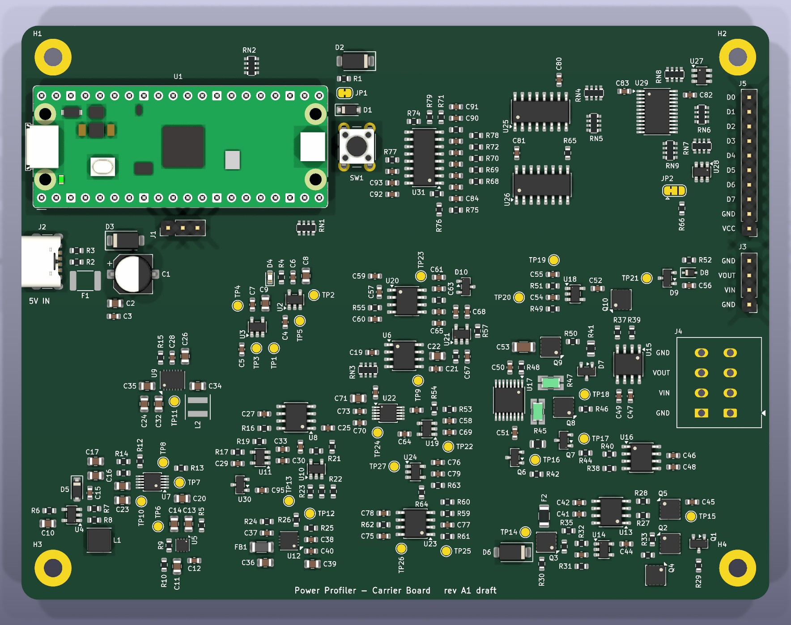
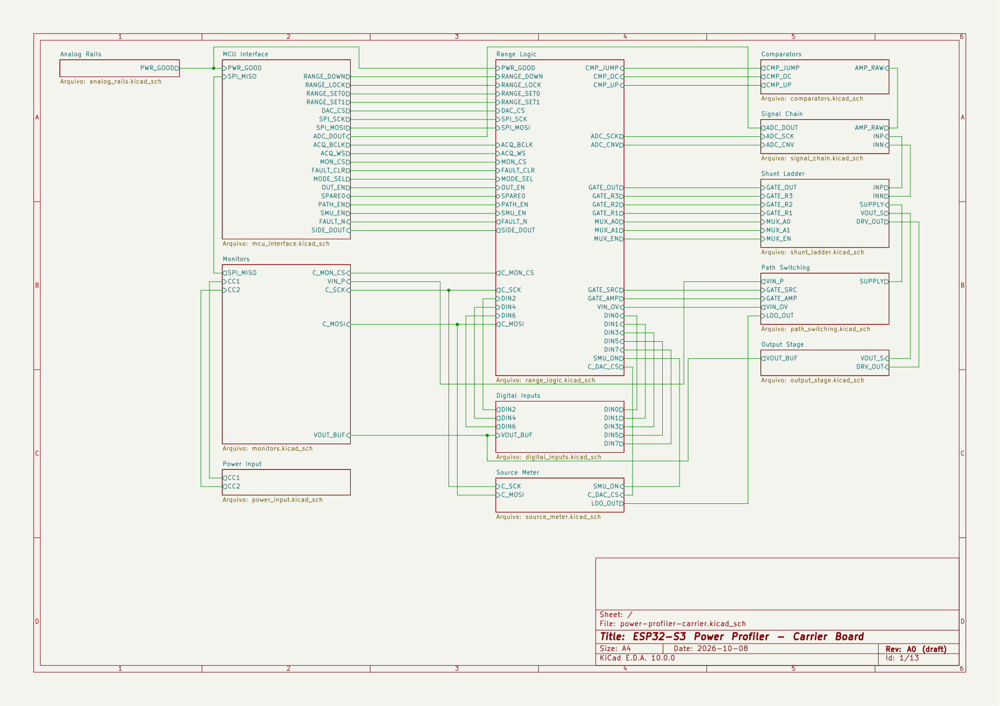

# Power Profiler

[![Checks: run on demand][badge-checks]](CONTRIBUTING.md#quality-gates)
[![Status: early development][badge-status]](#roadmap)
[![Software license: MIT][badge-mit]](LICENSE)
[![Hardware license: CERN-OHL-P v2][badge-ohl]](hardware/LICENSE)

Open-source power profiler in the class of the Nordic PPK2, built around the
Raspberry Pi Pico 2. It is designed to sample current at 100 kSPS from
100 nA to 1 A with automatic range switching, to work either as a source
meter that powers the device under test or as an ampere meter in series
with an external supply, and to stream the samples to a PC over USB.

The instrument is two boards: a Raspberry Pi Pico 2, bought ready-made,
plugged into a carrier board designed in this project that holds the
measurement electronics.


> [!NOTE]
> The project is in early development. The software foundations exist and
> are tested without hardware: the protocol definition, the core logic of
> the firmware and the host package with a device simulator. The carrier
> board exists as a review draft, shown above: the complete schematic and
> every part placed on the board, with candidate parts and no tracks. No
> hardware has been built and nothing has been measured, so every figure
> in this repository is a design target.
>
> The project started on the ESP32-S3, which the name of the repository
> still shows. The controller is now a Raspberry Pi Pico 2 (decision D-39
> of the specification). The firmware still builds for the ESP32-S3: its
> hardware-independent core carries over, and the port of the rest to the
> Pico SDK is the next step.

## Table of Contents

- [Target Specifications](#target-specifications)
- [How It Works](#how-it-works)
- [Hardware Draft](#hardware-draft)
- [Repository Structure](#repository-structure)
- [Roadmap](#roadmap)
- [Getting Started](#getting-started)
- [Engineering Practices](#engineering-practices)
- [Documentation](#documentation)
- [Contributing](#contributing)
- [License](#license)
- [Acknowledgments](#acknowledgments)

## Target Specifications

| Item | Target |
| --- | --- |
| Sampling rate | 100 kSPS, timed by hardware |
| Current range | 100 nA to 1 A in four ranges, switched automatically |
| Burden voltage | 100 mV maximum across the shunt |
| Source meter mode | Programmable output from 0.8 V to 5.0 V, up to 1 A |
| Ampere meter mode | External supply from 0.8 V to 5.0 V through the shunts |
| Digital inputs | 8 logic channels sampled together with the current |
| Host link | Native USB (Full-Speed), CDC ACM, binary protocol |
| Controller | Raspberry Pi Pico 2 (RP2350) on sockets |
| Power input | USB-C, 5 V, on the carrier board; the USB cable of the Pico 2 alone at low load |
| DUT connectors | Pin header and lever terminal block, in the pin order of the PPK2 |

The complete list, with requirement IDs, is in section 2 of the
[specification](docs/specification.md).

## How It Works

```text
USB-C 5 V ──► pre-regulator ──► LDO (source mode) ◄── DAC ◄── SPI
                                    │
VIN (ampere mode) ──► protection ──►├── mode switch
                                    │
                         shunt ladder + range FETs ◄── range logic
                                    │         │ Kelvin sense   ▲
                         output switch     in-amp ──┬──► comparators
                                    │               └──► ADC ──► Pico 2
                                  VOUT ──► DUT          D0..D7 ──► level shift
```

- **Two boards.** Everything in the diagram except the controller is on the
  carrier board. The Raspberry Pi Pico 2 brings the microcontroller and
  the USB port, and uses every one of its 26 GPIO pins.
- **One programmable part.** The range logic and the sampling clock are
  programs for the PIO blocks of the RP2350, small state machines that
  run from the system clock whatever the processors do. Firmware is
  loaded through USB; no programmer and no vendor tool is needed.
- **Four shunt ranges.** Each range is limited to 100 mV of burden voltage.
  Comparators switch to a higher range in hardware within microseconds, so a
  current step does not brown out the device under test. The firmware decides
  when to step back down.
- **Hardware-timed sampling.** A 16-bit SAR ADC is clocked by a PIO state
  machine, so the sampling instant does not depend on firmware latency.
  The same state machine reads the range and the logic inputs with every
  conversion result.
- **Self-describing samples.** Every sample is a 32-bit word that carries the
  ADC code, the active range, a validity flag, the fault flag and the eight
  logic inputs.
- **Two cores, two jobs.** One core acquires data in DMA blocks. The other
  frames the blocks and streams them over USB.
- **Programmable supply.** In source meter mode a DAC sets a low-noise linear
  regulator, fed by a pre-regulator that tracks the output voltage.

## Hardware Draft

The carrier board is drawn in KiCad 10 as draft A1: thirteen A4 schematic
sheets and a 130 mm × 100 mm board with every footprint placed near the
pin it serves, inside the area of its functional block. It is a draft to
review and to start the layout from, not a design to fabricate: the parts
are candidates and their checks are open.





Every sheet and the board are shown in
[`hardware/doc/`](hardware/doc/README.md); the status and the open work are
in the [hardware README](hardware/README.md).

## Repository Structure

| Path | Content | License |
| --- | --- | --- |
| [`firmware/`](firmware/) | Firmware of the controller (still the ESP-IDF project of the first plan) | MIT |
| [`hardware/`](hardware/) | KiCad project of the carrier board, its pictures, simulations, fabrication outputs | CERN-OHL-P v2 |
| [`host/`](host/) | Python package: protocol, device client, simulator, capture tool | MIT |
| [`protocol/`](protocol/) | Protocol definition, generator and shared test vectors | MIT |
| [`tools/`](tools/) | Calibration and production-test scripts | MIT |
| [`docs/`](docs/) | Specification, component checks, test reports | MIT |

## Roadmap

The work is split into phases. Each phase is closed by a test report with
recorded measurements. The exit criteria are in section 13 of the
[specification](docs/specification.md).

| Phase | Goal | Status |
| --- | --- | --- |
| 1 | Risk prototypes: hardware-timed ADC capture and USB throughput | In progress: software foundations done; firmware port to the Pico SDK and bench work not started |
| 2 | Analog front end with one fixed range | Not started |
| 3 | Shunt ladder and automatic range logic | Not started |
| 4 | Source meter mode and power input | Not started |
| 5 | Carrier board, revision A | Not started; a review draft of the schematic and of the part placement exists (draft A1) |
| 6 | Calibration, protocol freeze and host software | Not started |
| 7 | Revision B and release | Not started |

## Getting Started

```sh
git clone https://github.com/Guiimartinho/esp32-s3-power-profiler.git
cd esp32-s3-power-profiler
```

Start with the [specification](docs/specification.md). Each part of the
repository documents its own setup and commands:

| Part | Needs | Guide |
| --- | --- | --- |
| Firmware | CMake, Ninja and gcc for the unit tests; ESP-IDF v6.0 for the target build of the first plan | [`firmware/README.md`](firmware/README.md) |
| Host software | Python 3.10 or later | [`host/README.md`](host/README.md) |
| Protocol | Python 3.11 or later | [`protocol/README.md`](protocol/README.md) |
| Hardware | KiCad 10 | [`hardware/README.md`](hardware/README.md) |
| Documentation | Node.js, for `npx --yes markdownlint-cli2@0.23.3` | [`CONTRIBUTING.md`](CONTRIBUTING.md) |

No instrument is needed to work on the software: the firmware logic runs in
unit tests on the PC, and the host package talks to a simulator.

## Engineering Practices

- Logic that does not need hardware is kept apart from the code that does,
  in firmware and in host software, and is covered by unit tests.
- The wire protocol has one definition. The constants of both sides are
  generated from it, and both codecs must reproduce the same test vectors.
- Continuous integration workflows build the firmware, run the tests with
  coverage floors, run the formatters and static analyzers and check the
  hardware project. For now they are started by hand, not on every push;
  the same checks run locally before a change is recorded.
- Timing, throughput and analog behavior are not claimed from tests. They
  are measured on the bench and recorded in a report.

The rules are in section 18 of the [specification](docs/specification.md)
and in the [contributing guide](CONTRIBUTING.md).

## Documentation

- [System specification](docs/specification.md): requirements, analog and
  firmware architecture, host protocol, calibration, verification plan,
  risks and decision log.
- [Component checks](docs/checks/): candidate parts verified against their
  datasheets.
- [Test reports](docs/reports/): the measurements that close each phase.
- [Changelog](CHANGELOG.md): notable changes by release.

## Contributing

Contributions are welcome. Read the [contributing guide](CONTRIBUTING.md)
first: it covers the workflow, the commit message format, the quality gates
and how changes to the specification are recorded.

## License

- Hardware design files under [`hardware/`](hardware/):
  [CERN-OHL-P v2](hardware/LICENSE).
- Everything else, including firmware, host software, tools and
  documentation: [MIT](LICENSE).

## Acknowledgments

- Inspired by
  [Gedankenn/power_profiller](https://github.com/Gedankenn/power_profiller),
  an ESP32 and INA226 power profiler with a web dashboard.
- The controller module is a Raspberry Pi Pico 2. This project is
  independent and is not affiliated with or endorsed by Raspberry Pi Ltd.
- The feature set follows the Nordic Semiconductor Power Profiler Kit II
  (PPK2). This project is independent and is not affiliated with or endorsed
  by Nordic Semiconductor.

[badge-checks]: https://img.shields.io/badge/checks-run%20on%20demand-lightgrey
[badge-status]: https://img.shields.io/badge/status-early%20development-orange
[badge-mit]: https://img.shields.io/badge/software-MIT-blue
[badge-ohl]: https://img.shields.io/badge/hardware-CERN--OHL--P%20v2-blue
