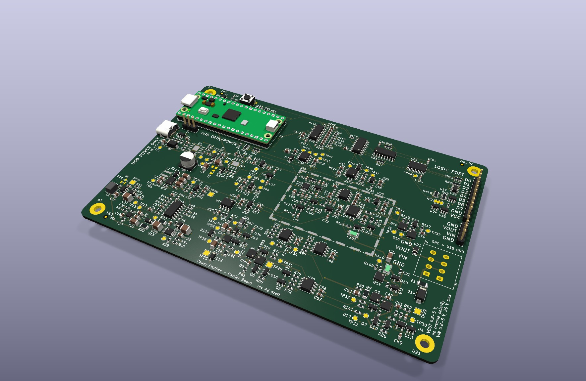
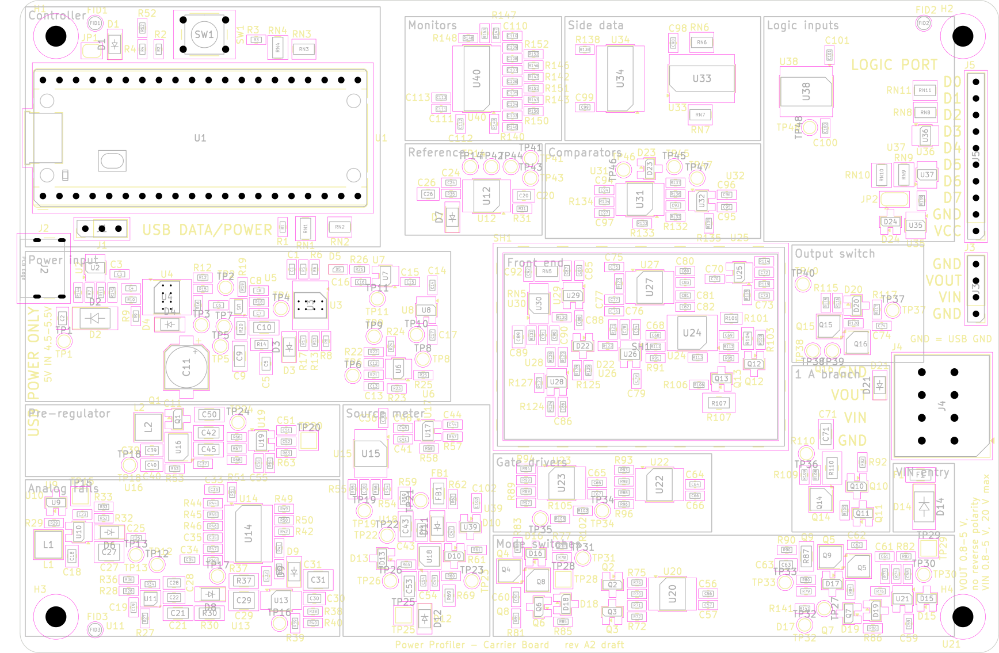
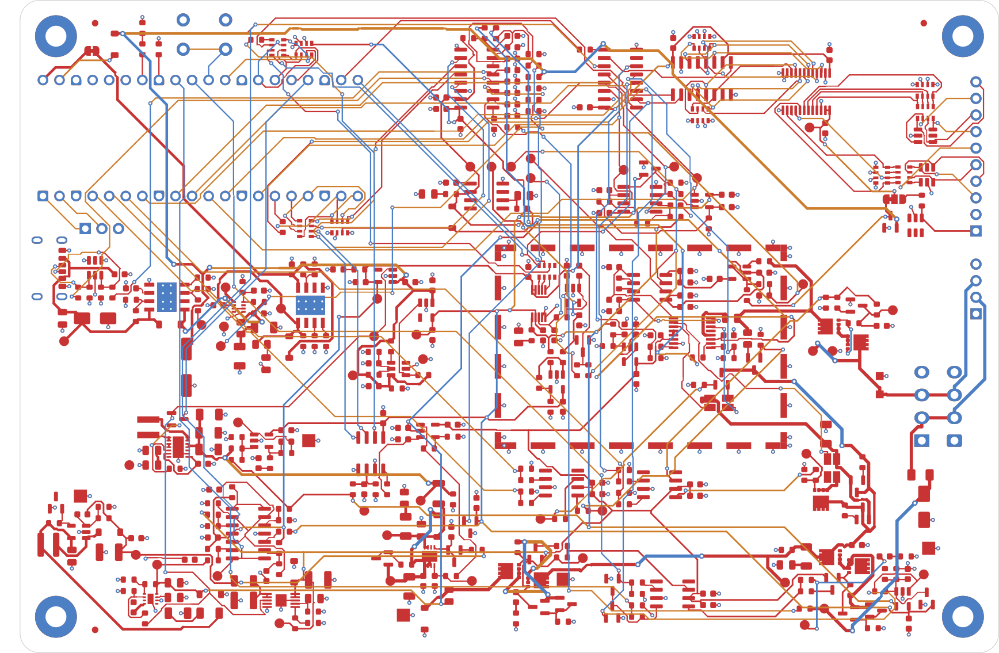
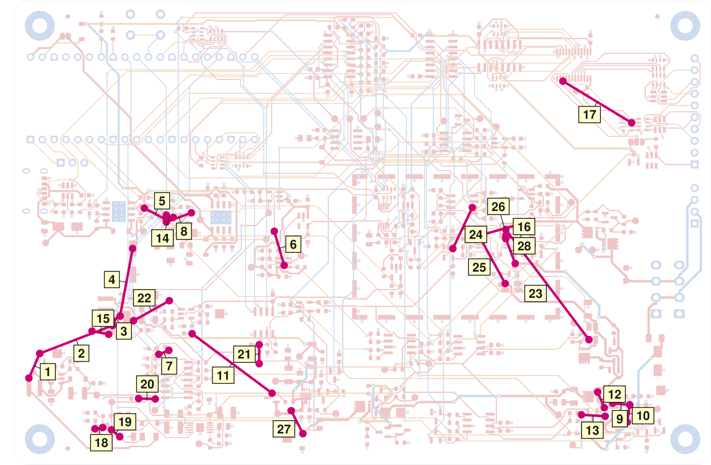

# Hardware

The carrier board of the instrument: schematic, PCB layout, simulations and
fabrication outputs.

The instrument is two boards. A Raspberry Pi Pico 2, bought ready-made, is
the controller. It plugs into two rows of pin sockets on the carrier board
designed here, which holds everything else: power input, source meter, shunt
ladder, signal chain, side data and connectors. Sections 4.11 and 5 of the
[specification](../docs/specification.md) define the interface.



The picture is a rendering from the KiCad files, with the Pico 2 on its
sockets. It is not a photograph: no board has been built.

## Status

Draft A2, as of 2026-10-10. The KiCad project holds the whole carrier board
as a review draft: the schematic with 428 parts on fifteen A4 pages (the
root sheet and fourteen sheets) and a four-layer board of 150 mm × 100 mm
with every footprint placed and the tracks drawn by an autorouter. It is
drawn and checked by rule checks and against datasheets. It is not built,
and nothing is measured.

| What | State |
| --- | --- |
| Schematic | Every sheet drawn: 428 parts, 225 nets, 15 pages |
| Electrical rules check | 0 errors, 0 warnings |
| Netlist against datasheets | Checked independently; no blocker and no major defect found |
| Bill of materials | 151 lines, each with a part number and a maker; three lines without stock on 2026-10-09 |
| Component checks | 0 closed; every part is a candidate |
| Board, placement | 425 footprints placed by a script; not reviewed by hand |
| Board, routing | Autorouted: 956 of 984 connections; 28 open, 25 of which break a function while they are open |
| Design rules check with schematic parity | 0 violations, 0 footprint errors, 28 unconnected items |
| Layout review | Not started: no pours on the 1 A path, no guard ring, no coupled Kelvin pairs, converter loops as the autorouter left them |
| Simulations | Run for the figures that the specification marks "simulated"; their files are not in this repository |
| PIO programs | Not written |
| Fabrication outputs | None |
| Measurements | None: no board has been built |

What the draft has behind it:

- The schematic passes the electrical rules check of KiCad with no errors
  and no warnings. The netlist that KiCad exports equals the netlist the
  drawings were generated from (428 parts, 225 nets), and every symbol pin
  has a pad in its footprint (65 pairs of symbol and footprint).
- The netlist was checked independently against the datasheets: symbol,
  footprint and ratings of every part type that is new in this draft, and
  six subsystems as a whole (power, source meter, ampere path, measuring
  chain, controller and logic, and the seams between the blocks). That
  check found no blocker and no major defect. It is not a component check:
  it closes no item of section 16 of the specification. Its notes are not
  filed in this repository, so the result can be read here but not
  inspected: it counts as a review, not as evidence.
- Every line of the bill of materials has a part number and a maker (151
  lines; section 17 of the specification).
- The board passes the design rules check of KiCad with no rule violation
  and with no difference between board and schematic. The check lists 28
  unconnected items, the connections that the autorouter left open
  ([Still to Do](#still-to-do) names each one).
- The notes on the sheets were compared with the specification figure by
  figure and corrected where they differed, and the pictures and the PDF of
  [`doc/`](doc/README.md) are plotted from the present files.

It is not a design to fabricate:

- Nothing has been built and nothing has been measured. Every figure in
  these documents is a datasheet value, a calculation, a simulation or an
  estimate; the specification says which.
- The parts are the candidates of the specification. No component check of
  [`docs/checks/`](../docs/checks/README.md) is closed, and the open checks
  of section 16 of the specification stand, the bench items among them.
- The board is an autorouted draft that needs a layout review before
  fabrication ([Board](#board)). With its 28 open connections it would not
  work: the 5 V rail does not reach the converters, and neither mode has a
  complete current path.
- The files of the simulations are not in `simulation/`, so nobody can
  repeat a figure that the specification marks "simulated".
- The range logic and the sampling clock are programs for the PIO blocks of
  the controller. They are not written yet; until they are, the pin
  assignment of the controller is provisional.
- Three positions carry no part. They are marked "do not populate" and are
  left out of the bill of materials: a voltage detector at the enable pin
  of the boost converter (U9) and the two parts of a damper on the
  module input (R14, C5). Each is the remedy for a bench item of
  section 16 (decision D-84).
- Three lines of the bill of materials had no stock at an authorized
  distributor on 2026-10-09: the 1.5 µH inductor of the pre-regulator
  (L2, Coilcraft XFL4020-152MEC; Würth 74438356015 fits the same pads)
  and the capacitors Samsung CL21A106KAYNNNE and CL31A226KAHNNNE.
- The land pattern of the pre-regulator (U16) is a library footprint
  whose lead pads agree with the drawing of the manufacturer; its center
  pad is larger than the drawing asks for (1.7 mm × 3.3 mm against
  1.58 mm × 2.85 mm), which is accepted.
- KiCad has no 3D model of the lever terminal block, so the pictures show
  only its pads. The side its wires enter from was taken from the
  footprint, not from the drawing of the manufacturer.

## Layout

| Path | Content |
| --- | --- |
| `kicad/` | KiCad 10 project: schematic sheets, board, design rules and library tables |
| `kicad/lib/` | Project symbol and footprint libraries |
| `doc/` | Pictures of every schematic sheet and of the board, the schematic as PDF, and the bill of materials of the draft as CSV |
| `simulation/` | Place of the simulation files behind the figures marked "simulated". Empty: none is filed yet ([Still to Do](#still-to-do) lists them) |
| `fabrication/` | Outputs of each revision: Gerber and drill files, bill of materials, placement (empty until a revision is fabricated) |

## KiCad Project

Open `kicad/power-profiler-carrier.kicad_pro` with KiCad 10. To look at the
design without KiCad, see [`doc/`](doc/README.md): every sheet with a
description and the board as pictures, and
[`doc/schematic.pdf`](doc/schematic.pdf).

### Schematic

| Page | Sheet | File | Content |
| --- | --- | --- | --- |
| 1 | Root | `power-profiler-carrier.kicad_sch` | One block per sheet and the wires between them |
| 2 | Controller | `controller.kicad_sch` | Raspberry Pi Pico 2 on its sockets, supply of the module, pull and series resistors of the SPI and acquisition lines, series resistors of the two status lines, reset button, console header |
| 3 | Power Input | `power_input.kicad_sch` | USB-C power connector, one current limiter per USB input, priority multiplexer that drives the 5 V rail |
| 4 | Logic Supplies | `logic_supplies.kicad_sch` | Supervisor of the 5 V rail, the two 3.3 V regulators, power LED, mounting holes, fiducials |
| 5 | Analog Rails | `analog_rails.kicad_sch` | +13.5 V boost, +12 V and −4 V rails with their clamps, 2.5 V reference |
| 6 | Rail Monitor | `rail_monitor.kicad_sch` | Four comparators that watch the analog rails and the reference: PWR_GOOD |
| 7 | Source Meter | `source_meter.kicad_sch` | Pre-regulator that tracks the output, linear regulator with its clamps, DAC and set-point amplifier |
| 8 | Path Switching | `path_switching.kicad_sch` | Source and ampere mode switches with their gate networks and interlock, VIN input and its protection |
| 9 | Shunt Ladder | `shunt_ladder.kicad_sch` | Four shunts, range switches with their drivers, ladder clamp, Kelvin multiplexer |
| 10 | Output Stage | `output_stage.kicad_sch` | Output switch with slow turn-on, DUT connectors and their suppressor, guard buffer |
| 11 | Signal Chain | `signal_chain.kicad_sch` | Instrumentation amplifier, pedestal, limiter on its own driver rail, filter, converter, shield can |
| 12 | Comparators | `comparators.kicad_sch` | Step up, over-current and jump thresholds |
| 13 | Side Data | `side_data.kicad_sch` | Two shift registers: status and logic inputs of every sample |
| 14 | Digital Inputs | `digital_inputs.kicad_sch` | Logic port, protection, series resistors and pull-downs, level translator |
| 15 | Monitors | `monitors.kicad_sch` | Eight slow channels and the temperature sensor |

Drawing conventions:

- Every page is A4.
- Connections inside a sheet are wires. Supply rails use power symbols.
- A signal that goes to another sheet ends on a hierarchical label, and the
  root sheet joins the sheets with wires.
- Reference designators are numbered as the annotation tool of KiCad does by
  default: one count per prefix (`R1`, `R2`, ... and `C1`, `C2`, ...), in the
  order of the sheets, and on a sheet by position (decision D-45).
- Each sheet carries notes with the design values of its block. In the
  notes, "range 0" to "range 3" are the four current ranges, so that they
  are not taken for resistors. On the Digital Inputs sheet, "D0" to "D7"
  are the logic inputs, named as on the logic port of the PPK2: they are
  not diodes.
- A part drawn with a cross is a position without a part.

Supply rails:

| Rail | Source | Feeds |
| --- | --- | --- |
| `+5V` | Priority multiplexer: the USB-C connector of the carrier through a 2.0 A limiter, or the USB connector of the Pico 2 through a jumper and a 0.76 A limiter | Every converter and regulator, the supervisor, and the Pico 2 through a diode |
| `+13V5` | Boost converter, running whenever `+5V` is present | +12 V_A regulator, control pin of the output regulator |
| `+12V_A` | Low-noise regulator | Amplifiers, multiplexer, gate drivers, buffers |
| `-4V_A` | Inverting charge pump with regulator | Amplifiers, multiplexer, buffers, minimum load of the output regulator |
| `+3V3_A` | Low-noise regulator | Converter, comparators, DAC, monitor, reference, buffer of the driver rail, tracking amplifier of the pre-regulator, temperature sensor |
| `+3V3_C` | Regulator | Logic of the carrier, rail monitor, power LED |
| `VREF` | 2.5 V reference, supplied from `+3V3_A` | Converter, DAC, monitor, thresholds, pedestal, driver rail |

A supervisor on `+5V` enables both 3.3 V regulators, the +12 V_A regulator,
the charge pump and, through a transistor, the pre-regulator: below 3.83 V
to 4.00 V on the rail (calculated) the carrier is off, with no firmware
involved (decision D-48). The power tree with its thresholds and its
start-up order is in section 3 of the specification.

The bill of materials is generated from the schematic, in which each of
its parts carries the fields `MPN` and `Manufacturer`: one line per part
number, 151 lines for 368 parts. The positions without parts, the test
points, the mounting holes, the fiducials and the solder jumpers are not
in it. The list of this draft is filed as [`doc/bom.csv`](doc/bom.csv);
to make it again, from `kicad/`:

```sh
kicad-cli sch export bom --output ../doc/bom.csv --fields 'Reference,Value,Footprint,MPN,Manufacturer,${QUANTITY}' --group-by 'Value,Footprint,MPN,Manufacturer' --exclude-dnp power-profiler-carrier.kicad_sch
```

### Board

`power-profiler-carrier.kicad_pcb` is linked to the schematic: every
footprint has its nets and its symbol.

- Outline 150 mm × 100 mm with a corner radius of 3 mm and four M3 holes
  (decision D-85).
- Four copper layers: `F.Cu` carries signals and all parts, `In1.Cu` is the
  ground plane, `In2.Cu` carries power and signals, `B.Cu` signals. All 425
  footprints are on the top side. The schematic has 428 parts: the two
  sockets of the module (MP1, MP2) sit in the holes of the module
  footprint, and the cover of the shield can (MP3) snaps onto its frame,
  so these three have no footprint of their own.
- The stackup in the board setup is the build that section 10.1 of the
  specification assumes until a manufacturer is chosen: 1.6 mm, 35 µm
  outer and 17.5 µm inner copper, 0.2 mm of dielectric between each outer
  layer and the inner layer next to it, gold finish (ENIG).
- Back edge, on the left: the USB connector of the Pico 2, which lies along
  the top edge, and below it the USB-C power connector.
- Front edge, on the right, from the top: the logic port, the DUT pin header
  and the DUT lever terminal block, each with the names of its pins; the
  limits of VOUT and VIN are printed below the terminal block.
- The rectangles on the `Dwgs.User` layer are the areas of the sixteen
  functional blocks. They follow section 10.1 of the specification: the
  switching converters in the left third, the front end right of center
  under the frame of a shield can, the 1 A branch of the ladder between the
  can and the terminal block.
- Net classes for the 1 A path, the supply inputs, the switch nodes, the
  rails, the sense and guard nets, the gate nodes and the clocked lines are
  defined in the project file, thirteen with the default class. The file
  `power-profiler-carrier.kicad_dru` adds the clearances that a net class
  cannot express. The classes are bound to the names of the nets: after a
  change to the schematic, check that the nets of the 1 A path still have
  their class.



Placement. The parts are placed by a script, from the netlist and from a
table that gives each part the pin it serves and its largest distance from
it. Connectors, mounting holes, fiducials and the frame of the shield can
stand at fixed coordinates. The result of the run that made this board:

- Every part is inside the rectangle of its block, no courtyard overlaps
  another, and nothing stands under the controller module.
- Only the 58 parts of the front end are inside the frame of the shield
  can.
- 95.9 % of the 370 distances of the table are kept, measured as the copper
  gap between the two pads, and so are those of all 47 decoupling
  capacitors.
- The reference designators of 115 parts are hidden on the silkscreen,
  where no free place was left beside the part. They are on the fabrication
  layer.

Nobody has reviewed that placement for routing by hand.

Routing. The board is routed automatically with FreeRouting 2.5.0, through
a Specctra export of the placed board and an import of the session file
(decision D-86). The ground plane on `In1.Cu` is given to the router as a
plane, so that ground pads reach it through vias and the layer stays free
of tracks.

The board of this draft is the result of several runs, each one continuing
from the board of the run before and routing only what was still open:

- 956 of the 984 connections are routed. 28 are open, and the design rules
  check lists them; the table under [Still to Do](#still-to-do) names each
  one with its place on the board and with what it breaks. Seventeen lie
  where parts stand too close for a track or a via: at the input
  multiplexer, the pre-regulator, the charge pump, the ampere pair and the
  Kelvin multiplexer. Five belong to parts that came into the schematic
  after the first runs (two test points, a capacitor of the rail monitor,
  the position of the voltage detector): the router found no way to them
  through the tracks already laid. The other six are single connections:
  on `5V_OK`, on `PWR_GOOD`, at the output of the linear regulator, on one
  logic input, on the pedestal and on the sense line of the tracking
  amplifier.
- The open connections are not loose ends of minor nets. The 5 V rail is in
  five pieces, with the pad of the unfitted voltage detector as a sixth,
  the node after the shunts is in three, the VIN input in three, and one of
  the two Kelvin sense lines of the 0.1 Ω shunt, the one on its supply
  side, is open from end to end.
- 7.83 m of track in 3,228 segments and 499 vias: 3.57 m on `F.Cu`, 2.66 m
  on `In2.Cu` and 1.60 m on `B.Cu`. `In1.Cu` is an unbroken ground plane.
- The tracks are narrower than their net classes ask. Those of the power
  nets are 0.4 mm and 0.5 mm wide, with necks down to 0.24 mm at the pads,
  where the classes ask for 0.8 mm to 1.5 mm. Those of the rails, the guard
  nets and the gate drivers are 0.25 mm wide, with necks of 0.19 mm and
  0.15 mm, where the classes ask for 0.25 mm to 0.5 mm. The router did not
  finish the board with the widths of the classes, and section 10 of the
  specification asks for pours on the power nets in any case.
- The bottom layer under the measured node carries tracks. With that area
  kept free the router did not reach the pins of the Kelvin multiplexer;
  the ground plane lies between those tracks and the node.
- The spacings of the rule file around gate nodes, switching nodes, the 1 A
  path, the measured node and VIN do not apply to a track that touches the
  courtyard of a footprint. At the pins of a part the pad pitch decides the
  spacing, and no track could leave a transistor otherwise.

An autorouted board is a draft: it needs a layout review before fabrication.
An autorouter connects pads. It does not draw the copper pours of the 1 A
path, the guard ring around the measured node or the coupled pairs of the
Kelvin sense lines, it does not keep the loops of the switching converters
small, and it places no vias for heat. Section 10.8 of the specification
lists what the review draws and checks by hand, with the rule of section 10
behind each item.



### Connectors

Someone who faces the front edge reads the pins from left to right in the
order of the Nordic PPK2 (Figure 4 of its user guide, v1.0.1).

| Connector | Type | Pins |
| --- | --- | --- |
| DUT, pin header | 1×4, 2.54 mm, straight | GND, VIN, VOUT, GND |
| DUT, terminal block | Lever-operated, 3.5 mm (candidate: WAGO 2601-1104) | GND, VIN, VOUT, GND |
| Logic port | 1×10, 2.54 mm, straight | VCC, GND, D7 down to D0 |

The carrier also has the USB-C power connector at the back edge (power
only) and a 3-pin console header (TX, RX and GND at 3.3 V).

The two DUT connectors carry the same nets. VOUT delivers 0.8 V to 5.0 V in
source mode. VIN is the external supply of ampere mode: 0.8 V to 5.0 V in
use, and −20 V to +20 V withstood while the ampere switch is open
(simulated; decision D-60). The VCC pin of the logic port is used only when
the solder jumper beside the level translator (JP2) is moved: as built,
the logic inputs follow the output voltage of the instrument, and they are
valid for logic levels of 1.65 V to 5.5 V (R-10). The limits of every
terminal are in section 4.9 of the specification.

### Libraries

| Library | Item | Description |
| --- | --- | --- |
| `PowerProfiler` | Symbol `ADS8860xDGS` | 16-bit converter, from the datasheet SBAS569B |
| `PowerProfiler` | Symbol `MUX509xPW` | Dual 4:1 multiplexer, from the datasheet SBAS758C |
| `PowerProfiler` | Symbol `TPS63020DSJ` | Buck-boost converter, from the datasheet SLVS916I |
| `PowerProfiler` | Symbol `TPS2116DRL` | Priority power multiplexer, with the pin numbers of the KiCad symbol `Power_Management:TPS2116DRL`; its second output pin is passive |
| `PowerProfiler` | Footprint `TerminalBlock_WAGO_2601-1104_1x04_P3.50mm_Horizontal_Pad1.9mm` | Lever terminal block: the library footprint with pads of 1.9 mm × 2.3 mm |
| `PowerProfiler` | Footprint `RaspberryPi_Pico_Common_THT_NoKeepout` | Controller module: the library footprint without its antenna keep-out |
| `PowerRails` | Power symbols | One symbol per supply rail of the table above, and the ground symbol |

The symbols are in `kicad/lib/PowerProfiler.kicad_sym` and
`kicad/lib/PowerRails.kicad_sym`, the two footprints in
`kicad/lib/PowerProfiler.pretty` (decision D-85). Every other symbol and
footprint, the symbol of the Pico 2 among them, comes from the library that
KiCad 10 installs.

### Controller Module

The carrier takes a Raspberry Pi Pico 2 with its pin headers fitted, on two
1×20 pin sockets 17.78 mm apart (MP1, MP2). The sockets are soldered
into the holes of the module footprint (U1) and the module is plugged
into them; an RP2350 of stepping A3 or A4 is preferred (decision D-82). A
Pico 2 W fits the same sockets, but the firmware does not support it. The
pin map is in section 5 of the specification; every GPIO of the headers is
in use.

- Either USB connector powers the whole instrument, and USB-C is used
  whenever it is present. Each input has its own current limiter, and
  neither connector is fed back from the other. Cut the solder jumper on
  the Controller sheet (JP1) to keep the carrier off the USB port of the
  computer.
- With the data cable alone the instrument stays inside what a default USB
  port offers: the input current allowed is 0.45 A, about 1.5 W at the
  output (estimate). The whole current curve of R-08 needs a USB-C source
  that offers 1.5 A or more (section 4.1 of the specification, decision
  D-49).
- Every line that the module drives, except the console output, has a
  resistor to a rail on the carrier, and series resistors limit what a pin
  can push into an input whose supply is absent. With the module in reset,
  in its boot loader or out of its sockets every switch is open and the
  pre-regulator is off (section 5).
- Firmware is loaded through the USB connector of the Pico 2: hold its
  BOOTSEL button and press the reset button of the carrier.

### Checks

Run them from `kicad/`. The Hardware workflow runs the same commands when it
is started.

```sh
kicad-cli sch erc --severity-all power-profiler-carrier.kicad_sch
kicad-cli pcb drc --schematic-parity --severity-all power-profiler-carrier.kicad_pcb
```

Results on the files of this draft, with KiCad 10.0.0 on 2026-10-10:

| Check | Result |
| --- | --- |
| Electrical rules check | 0 errors, 0 warnings |
| Design rules check, rule violations | 0 |
| Design rules check, footprint errors (difference between board and schematic) | 0 |
| Design rules check, unconnected items | 28 |

The design rules check compares the board with its rules and with the
schematic. Before a board is ordered it must report no rule violation, no
difference between board and schematic and no unconnected item. The 28
unconnected items are the open connections of the autorouted board; the
table under [Still to Do](#still-to-do) is made from this report.

Three corrections stand behind the result of the board. The autorouter had
left five pairs of vias 0.493 mm to 0.499 mm apart; each pair was moved
apart by less than 0.01 mm and the ground plane was filled again. The
pattern that binds one net to its net class was corrected. And the stackup
of the board file was set to the build of section 10.1 of the
specification.

Both checks were run with `kicad-cli` only. The project has not been opened
in the KiCad editor yet. The checks say that the files are consistent and
that the copper keeps the rules of the project as they were relaxed for
the autorouter: the larger spacings of the rule file do not apply to a
track that touches a footprint, the tracks are narrower than their net
classes ask, and the bottom layer under the measured node carries tracks
([Board](#board)). They say nothing about whether the layout is good,
which is the subject of the layout review.

### Still to Do

Nothing of this list is started. It is the hardware part of the next steps
that the [README](../README.md#project-status) of the repository puts in
order: the board first (items 1 and 2 here), then the software, which the
[firmware guide](../firmware/README.md) and the
[host guide](../host/README.md) list, then the simulation files (item 3).
The checks that need parts or a bench (item 4) and the work that waits for
firmware (item 5) belong to the phases that follow.

#### 1. Close the 28 Open Connections

The table is made from the report of the design rules check. Each line is
one connection that the autorouter did not draw: two pieces of copper of
the same net that have to be joined. The coordinates are those of the board
editor, in millimeters; the upper left corner of the board is at (50, 50).
The distance is the straight line between the two points. KiCad names one
item of each piece, and another run of the check can name another item of
the same piece. The nets whose name starts with `Net-(` have no label on
the drawings; the column beside the name says what they are.

The picture shows where they are: each link joins the two ends of one
connection over the pale copper of the board, and its number is the
number of the line in the table.



| No. | Net | What the net is | From | At (mm) | To | At (mm) | Distance | While it is open |
| --- | --- | --- | --- | --- | --- | --- | --- | --- |
| 1 | `+5V` | 5 V rail of the carrier | track on `F.Cu` | 53.16, 131.36 | U9 pad 3 | 55.50, 126.06 | 5.8 mm | The boost converter U10 and the charge pump U11 hang on the rail only through the pad of U9, a position without a part: with No. 1 or No. 2 open there is no +13.5 V, no +12 V_A and no −4 V_A |
| 2 | `+5V` | 5 V rail of the carrier | U9 pad 3 | 55.50, 126.06 | track on `F.Cu` | 71.15, 120.04 | 16.8 mm | As No. 1; the far end is at the input capacitors C39 and C40 of the pre-regulator |
| 3 | `+5V` | 5 V rail of the carrier | track on `F.Cu` | 71.15, 119.00 | track on `F.Cu` | 72.80, 118.00 | 1.9 mm | The input capacitors C39 and C40 are not at the supply pins of the pre-regulator U16, and everything behind No. 2 has no supply |
| 4 | `+5V` | 5 V rail of the carrier | track on `F.Cu` | 75.50, 103.45 | track on `F.Cu` | 72.80, 118.00 | 14.8 mm | The pre-regulator U16 has no supply: no source mode. The near end is the bulk capacitor C11, on the main part of the rail |
| 5 | `+5V` | 5 V rail of the carrier | track on `F.Cu` | 82.76, 97.25 | track on `F.Cu` | 78.00, 94.78 | 5.4 mm | The outputs of the input multiplexer U5 do not reach the rail: the carrier has no supply at all |
| 6 | `/Analog Rails/5V_OK` | Release signal of the supervisor of the 5 V rail | track on `F.Cu` | 108.12, 107.08 | track on `F.Cu` | 106.00, 99.75 | 7.6 mm | The supervisor U6 reaches only the +3V3_A regulator U8. The +3V3_C regulator U7, the +12 V_A regulator U13, the charge pump and the transistor Q1 at the enable of the pre-regulator never get the release |
| 7 | `/Controller/PWR_GOOD` | Flag of the rail monitor | track on `B.Cu` | 81.12, 126.23 | track on `F.Cu` | 83.30, 125.37 | 2.3 mm | The pull-up R51 and the comparator outputs for +12 V_A and the reference (U14 pins 1 and 14) are cut off from the line to the controller: the flag stays low |
| 8 | `/Monitors/SRC_ST` | Status output of the input multiplexer | U5 pad 8 | 82.76, 97.75 | track on `B.Cu` | 88.15, 95.77 | 5.7 mm | Channel 2 of the monitor cannot tell which input supplies the rail: R143 is never switched into the divider |
| 9 | `/Monitors/VIN_P` | VIN behind the fuse | Q5 pad 5 | 178.88, 136.75 | R73 pad 1 | 182.55, 137.12 | 3.7 mm | The ampere pair is not connected to VIN: ampere mode has no current path |
| 10 | `/Monitors/VIN_P` | VIN behind the fuse | track on `B.Cu` | 182.00, 140.86 | R73 pad 1 | 182.55, 137.12 | 3.8 mm | The divider of the over-voltage detector (R73) is cut off from VIN: the detector sees nothing; with it the ampere pair, which hangs on the same pad |
| 11 | `Net-(D13-K)` | Sense node of the tracking amplifier, where R64, R65, C55 and D13 meet | R64 pad 1 | 88.30, 121.78 | track on `F.Cu` | 105.51, 134.60 | 21.5 mm | The amplifier U19 does not see the output of the linear regulator: the pre-regulator does not follow the output |
| 12 | `Net-(D17-A)` | Gate node of the ampere pair (TP32) | track on `F.Cu` | 177.06, 137.72 | Q9 pad 4 | 175.64, 134.38 | 3.6 mm | The gate of Q9 is not driven: the ampere pair cannot close |
| 13 | `Net-(D17-A)` | Gate node of the ampere pair (TP32) | R84 pad 1 | 177.25, 139.57 | track on `B.Cu` | 172.15, 139.25 | 5.1 mm | The gates are cut off from the charging resistor R80, from C61 and from TP32: the ampere pair cannot close |
| 14 | `Net-(D4-A)` | Output of the USB-C limiter U4, input 1 of the multiplexer (TP2) | U5 pad 3 | 84.24, 96.75 | U5 pad 5 | 82.76, 96.25 | 1.6 mm | Input 1 of the multiplexer U5 is open: the USB-C connector cannot supply the carrier |
| 15 | `Net-(Q1-S)` | Enable pin of the pre-regulator (TP18) | track on `F.Cu` | 70.33, 121.93 | TP18 pad 1 | 66.75, 121.25 | 3.6 mm | No function is lost: only the test point TP18 is not connected |
| 16 | `Net-(Q12-S)` | Upper end of the 33 Ω shunt R104, at the source of Q12 | track on `F.Cu` | 161.50, 102.76 | U24 pad 5 | 155.86, 100.67 | 6.0 mm | The upper sense tap of range 1 does not reach the multiplexer: range 1 cannot be measured |
| 17 | `Net-(RN10-R3.1)` | Logic input D6 between its series resistor and the level translator | track on `F.Cu` | 168.14, 67.42 | RN10 pad 3 | 182.95, 76.40 | 17.3 mm | D6 does not reach the level translator U38 |
| 18 | `Net-(U11-C-)` | Negative side of the flying capacitor C19 of the charge pump | C19 pad 2 | 67.40, 142.28 | U11 pad 7 | 69.05, 142.00 | 1.7 mm | The charge pump U11 cannot pump: no −4 V_A |
| 19 | `Net-(U11-VIN)` | Supply pin of the charge pump, behind R30 | U11 pad 1 | 70.95, 142.50 | C21 pad 1 | 72.72, 143.95 | 2.3 mm | The charge pump U11 has no supply: no −4 V_A |
| 20 | `Net-(U14B--)` | Input of the rail monitor for −4 V_A, between R47 and R48 | C34 pad 1 | 76.78, 135.75 | track on `F.Cu` | 80.38, 135.85 | 3.6 mm | The comparator works. Its input lacks C34, the capacitor that keeps an edge of the flag from moving the threshold |
| 21 | `Net-(U15-Vref)` | Reference input of the DAC, half the reference (TP19) | C38 pad 1 | 102.75, 124.17 | TP19 pad 1 | 102.75, 128.25 | 4.1 mm | No function is lost: only the test point TP19 is not connected |
| 22 | `Net-(U16-FB)` | Feedback pin of the pre-regulator, driven by the amplifier U19 (TP24) | TP24 pad 1 | 83.40, 114.70 | U16 pad 3 | 75.70, 119.00 | 8.8 mm | The feedback pin of U16 is open: the pre-regulator does not regulate |
| 23 | `Net-(U24-S4A)` | Kelvin sense line of the 0.1 Ω shunt R110 on its supply side | U24 pad 7 | 155.86, 99.38 | R110 pad 2 | 173.75, 123.08 | 29.7 mm | The whole line is missing, the net has no track: range 3, the range up to 1 A, cannot be measured |
| 24 | `Net-(U26--)` | Pedestal, from the buffer U26 to the reference pin of the amplifier (TP41) | track on `F.Cu` | 144.45, 103.49 | track on `F.Cu` | 148.65, 94.64 | 9.8 mm | The reference pin of the amplifier U27 floats: no range gives a valid reading |
| 25 | `/Output Stage/VOUT_S` | Node after the shunts | track on `F.Cu` | 150.14, 100.83 | track on `F.Cu` | 155.72, 111.00 | 11.6 mm | The shunts of ranges 2 and 3, C71 and the ladder clamp are joined to the rest of the node only through Nos. 25 and 26: with either open the current of ranges 2 and 3 does not reach the output switch |
| 26 | `/Output Stage/VOUT_S` | Node after the shunts | track on `F.Cu` | 161.03, 97.63 | track on `F.Cu` | 150.14, 100.67 | 11.3 mm | As No. 25; this one also cuts the lower sense taps of ranges 0 and 1 (U24 pins 12 and 13) off from their shunts and from the output switch |
| 27 | `/Path Switching/LDO_OUT` | Output of the linear regulator | track on `F.Cu` | 109.65, 138.38 | track on `F.Cu` | 112.16, 143.31 | 5.5 mm | The regulator U18 is cut off from the source pair (Q4), from its minimum load R69 and from the clamp D12: source mode has no current path |
| 28 | `/Path Switching/SUPPLY` | Supply node of the ladder | U24 pad 4 | 155.86, 101.33 | track on `F.Cu` | 157.88, 106.69 | 5.7 mm | The 1 kΩ shunt R101 and its upper sense tap are cut off from the node: range 0 carries no current |

To use the table in KiCad, open the board, run Inspect, Design Rules
Checker and take the tab "Unconnected Items": it lists the same 28
connections on the same nets, a click on an entry moves the view to it,
and the thin ratsnest line shows the two ends to join. The coordinates of
an entry can differ from the table, because KiCad may name another item of
the same piece of copper: find a line by its net and by the parts named
in its last column.

Which of them matter:

- 25 of the 28 break a function for as long as they are open. Three do
  not: Nos. 15 and 21 leave a test point unconnected, and No. 20 leaves
  one filter capacitor off its node.
- The 5 V rail has five (Nos. 1 to 5). With No. 5 open nothing on the
  carrier is supplied; the others take the supply from the pre-regulator,
  the boost converter and the charge pump.
- The node after the shunts has two (Nos. 25 and 26) and the supply node of
  the ladder one (No. 28). Together with Nos. 9, 16, 23 and 27 they are
  on the measured path or on its sense lines: no range and no mode works
  with them open.
- No. 23 is a whole Kelvin sense line of the 0.1 Ω shunt, the one on its
  supply side, 29.7 mm in a straight line and the longest of the list. Its
  partner on the output side is routed. It is one half of a Kelvin pair
  and belongs to the layout review as much as to this list: section
  10.3 of the specification asks for the pair on one layer, without vias,
  with equal lengths.
- Nos. 1 and 2 join two parts of the rail through the pad of a position
  that carries no part. When they are drawn by hand, the rail goes to the
  boost converter and to the charge pump directly, and the pad of U9 is a
  branch of it.

The connections on the 1 A path (Nos. 9, 25 to 27) are not tracks to add:
they are part of the pours of step 2.

#### 2. Review the Layout

What an autorouter does not do, and what the board therefore lacks
(section 10.8 of the specification, with the rule of section 10 behind
each item):

- Review the placement and the routed board against the rules of
  section 10. Nobody has done that by hand.
- Draw the 1 A path as pours and count its squares; draw the output island
  of the linear regulator and the ground fills with their vias. The power
  nets are tracks of 0.5 mm or less now.
- Draw the guard ring with its mask opening and its pour, and keep foreign
  nets and ground fill away from the measured node (1.0 mm from ground
  fill to the node). Clear the bottom layer under the measured node, which
  carries tracks now.
- Route the Kelvin pairs and the amplifier inputs as pairs of equal length
  on one layer without vias, with taps that leave a shunt pad apart from
  the force copper. No. 23 of the table is one of these lines.
- Lay the loops of the pre-regulator, the boost converter and the charge
  pump on the top layer without vias, and route the reference as a star.
- Take tracks through the wall of the shield can only at the openings of
  its frame; place the vias of the thermal pads, of the 1 A path and of the
  lands of the can.
- Read the distances that no net class holds: the gate node of the output
  switch 2 mm from VOUT, the converters 30 mm from the can, the copper of
  VIN 1.0 mm from the pads of other nets. The rule file does not apply its
  spacings to a track that touches a courtyard, so these are checked by
  eye.
- Give the tracks of the rails, the guard nets and the gate drivers the
  widths of their net classes (0.4 mm for the rails, 0.5 mm and 0.3 mm
  for the guard nets, 0.3 mm for the gate drivers); the autorouter drew
  them 0.25 mm wide or narrower.
- Calculate the resistance of the 1 A path from the plotted copper, and
  that of the copper from the pre-regulator to FB1 (15 mΩ or less;
  section 16).
- Compare a 1:1 print with the module on its sockets, the USB-C connector,
  the terminal block, the frame of the can and one of the 1 A transistors.
- Open the project in the KiCad editor. Until now every check ran from the
  command line.
- Run both checks again. The board can be ordered only when the design
  rules check reports no violation, no difference between board and
  schematic and no unconnected item.

#### 3. File the Simulations

`simulation/` is empty. The specification marks every figure that comes
from a simulation with the word "simulated", and the circuit files of those
simulations are not in this repository. Until they are, such a figure can
be read but not repeated, and nobody can see which models and which corner
cases stand behind it. What has to be filed, block by block:

| Block | Section of the specification | Figures that rest on a simulation |
| --- | --- | --- |
| Rails, start and stop | 3, 4.7, 4.11 | Order of the rails at power-up with datasheet delays (+12 V_A above 9.85 V after 8 ms to 17 ms, PWR_GOOD about 24 ms after `5V_OK`); order at power-off; levels of the clamps between +12 V_A and −4 V_A (+0.24 V and −0.23 V, D-52); the capacitors at the inputs of the rail monitor, with an estimated pin capacitance; the instants at which firmware sees PWR_GOOD rise and fall |
| Input stage | 4.1 | Behavioral models of the limiters, the multiplexer and the supervisor (D-47, D-48). Hot plug of a live cable (11.4 V and 12.2 V at the connector, 5.51 V or less behind the limiter); a contact that opens and closes again (25 mV to 85 mV below the 6 V rating of the multiplexer inputs); in-rush on a computer port (0.71 A to 0.87 A, 0.44 mC to 0.96 mC); USB-C plugged while the module input supplies (dip to 4.0 V to 4.5 V); the recharge pulse when the multiplexer falls back to the module input |
| Pre-regulator loop and linear regulator | 4.2 | Phase margin of the tracking amplifier (73° to 77°, with the model of its maker) and of the converter loop (55° or more, with a behavioral model); fold-back at a short circuit (0.84 V); set-point step down (IN pin 0.44 V above the output); power returned to the 5 V rail (0.12 W to 0.20 W for about 5 ms, 0.06 W on a set-point step); the clamps D11 and D10 with C47 at power-off; source impedance at the IN pin with the damper (0.27 Ω to 0.37 Ω); the regulator on its control pin alone; sag in dropout (4.48 V into 5 Ω) |
| Mode switches and output switch | 4.2 | A mode pair closing as a follower (supply node at about 0.9 V/ms) and opening within 1 µs; ramp of the output switch (0.44 V/ms, 90 % after about 20 ms), in-rush of 0.39 A into 1000 µF and 0.85 A into 2200 µF, largest DUT capacitance without a trip; opening in 7 µs; the gate charging current in the reading (0.5 µA at 30 ms, 4 nA at 200 ms) |
| Shunt ladder, load step | 2 (R-07), 4.3 | Drop on a step from 1 µA to 500 mA (312 mV nominal and 422 mV worst case with 1 µF at the DUT, 169 mV and 186 mV with 10 µF); the damper of the supply node (node below 11.5 V at a trip, sag of 0.17 V to 0.21 V); the ladder clamp at a hot plug or a short circuit (8.8 A in each part, 14.2 A in one); the sweep of the multiplexer on-resistance, 125 Ω to 430 Ω |
| Range change and trip | 4.4 | Range 3 conducting 0.35 µs after the threshold (0.20 µs to 0.51 µs) with a sequencer of 100 ns; what the blanking of 2 µs has to cover; the times behind the trip qualification (8.6 µs of recharge after a step to 1.0 A, 12 µs to 29 µs with long leads, 2.1 µs with 100 µF at the VIN terminals) |
| Signal chain | 4.5, 4.10 | Settling after a range change (about 45 µs to 0.1 % and 65 µs to 1 LSB; 37 µs to 50 µs and 64 µs to 70 µs over the cases); phase margin of the buffer of the driver rail (54° with its 10 Ω); the converter input in overload (VREF + 0.20 V in the worst case); noise in range 0 (about 2.1 nA from a quiet supply, 26 nA to 27 nA in source mode, 1.1 nA to 3.9 nA for the mean of 100 samples) |
| VIN protection | 4.9 | The terminal at −20 V to +20 V with the ampere pair open (less than 1 mA; the 30 V rating reached for tens of nanoseconds at the plug-in edge); a supply that steps to ±20 V with the pair closed (9.2 V and −2.4 V at the DUT); the interlock with both requests high; a pair closing on a live supply; the supply node at a trip (0.5 V or more below +12 V_A); 125 µA taken from the supply in ampere mode |
| VOUT terminal | 4.9 | The suppressor at a trip (11.6 A forward, terminal at −0.8 V to −1.7 V, with an assumed forward curve); a charged DUT plugged into a live output (regulator input 0.32 V to 0.94 V below its output for 3 µs to 21 µs) |
| Digital inputs | 4.8 | Clamp of the translator supply (−0.40 V at 0 °C and at 27 °C; −0.44 V with 470 Ω in place of 1 kΩ) |
| Output switch, heat | 10.6 | About 25 mJ and 3.5 W in the output pair for milliseconds each time the output is switched on into a capacitive DUT |
| Converter lines | 15 (D-75) | The lines of the converter driven into a dead supply for up to 0.1 ms at power-off |

The list is made from a search of the specification for "simulated"; the
specification is the reference where the two differ. Each set of files
needs the circuit, the models with their source, the corner cases and the
result that the specification quotes, so that a run gives the figure again.
The models of the input stage and of the converter loop are behavioral:
section 16 keeps those figures open until they are measured.

#### 4. Close the Open Checks

Section 16 of the specification, tracked in
[`docs/checks/`](../docs/checks/README.md):

- Close the component checks, part by part, each with the comparison of
  pin numbers and land pattern with the datasheet. None is closed.
- Before a board is ordered, without a carrier board: the risk prototypes of
  phase 1 (reaction of the range sequencer, pre-regulator with its tracking
  amplifier, start of the boost converter from a supply limited to 0.7 A),
  the linear range of the amplifier near full scale with the output below
  0.2 V, and on loose parts the leakage of the VOUT suppressor, the leakage
  of the range and clamp transistors and the on-resistance of the
  multiplexer.
- Find stock for the three lines of the bill of materials that had none,
  and order the parts with long lead times first.
- On the first board, before a DUT is connected: every gate at or below
  0.3 V in the states that section 16 lists, then the gate ramp of the
  output switch and the in-rush with a capacitor in place of the DUT.
- Decide the three positions without parts on the bench.

#### 5. With the Firmware

- Write the PIO programs of the range sequencer and of the acquisition, and
  test them in an emulator. Until they exist the pin assignment of the
  controller is provisional, and a change of it changes the Controller
  sheet and the board.
- The firmware rules that guard hardware (F-1 to F-36, section 6.6 of the
  specification) are part of this design: several limits of the carrier
  hold only with them. None is implemented; the
  [firmware guide](../firmware/README.md) says what exists.

#### After Every Change

- Plot the pictures of `doc/` again after every change to the schematic or
  the board; the commands are at the end of [`doc/README.md`](doc/README.md).
  Export the bill of materials again after a change to the schematic.
- After a change to the schematic, check that the nets of the 1 A path
  still have their net class, and run both checks.

## Design References

In the [specification](../docs/specification.md):

- Section 3: system architecture and power tree.
- Section 4: analog hardware design, from the power input to the error
  budget, and the controller module.
- Section 5: pin map.
- Section 6.6: firmware rules that guard hardware.
- Section 10: PCB and mechanical guidelines.
- Section 15: decisions, D-23 onwards for the drafts and D-47 to D-86 for
  draft A2.
- Section 16: open checks.
- Section 17: bill of materials summary.

## Revisions

Board revisions are named with letters. Drafts A0, A1 and A2 are review
drafts; A2 is the one in this directory. Revision A is the first carrier
board to be fabricated (phase 5) and revision B corrects the issues found on
it (phase 7). Fabrication outputs are stored per revision, for example
`fabrication/rev-a/`.

- Draft A1 changed, against draft A0, the controller (a Raspberry Pi Pico 2
  in place of the ESP32-S3 development board and of the programmable logic
  device), the connectors of the DUT, the reference designators and the
  board (decisions D-39 to D-46).
- Draft A2 is draft A1 after a review of every part and every block, which
  recorded 432 findings, six of them blockers. The power input has a
  current limiter per USB input and a priority multiplexer in place of the
  fuse and the diode OR-ing, and a supervisor of the 5 V rail gives the
  carrier one off state. Four comparators make PWR_GOOD, the pre-regulator
  follows the output of the linear regulator, the switches of the path
  close slowly behind gate networks, the two mode switches cannot be closed
  together, and VIN withstands −20 V to +20 V. Clamps, pull resistors and
  series resistors protect the ladder, the terminals, the converter input
  and the lines of the controller. The schematic grew from 278 parts on
  13 pages to 428 parts on 15 and was numbered again, and every line of
  the bill of materials has a part number. Where the specification asked
  for more than an instrument of this class delivers, the requirement was
  restated (R-04, R-06 to R-10 and R-14). The board grew from
  130 mm × 100 mm to 150 mm × 100 mm and is placed and routed
  automatically, where draft A1 had placed footprints and no tracks
  (decisions D-47 to D-86).

## License

Copyright (c) 2026 Luiz Guilherme Ito.

The design files in this directory are licensed under the CERN Open Hardware
Licence Version 2 - Permissive (CERN-OHL-P v2). See [LICENSE](LICENSE). They
are provided without any warranty, as stated in section 5 of the license.
