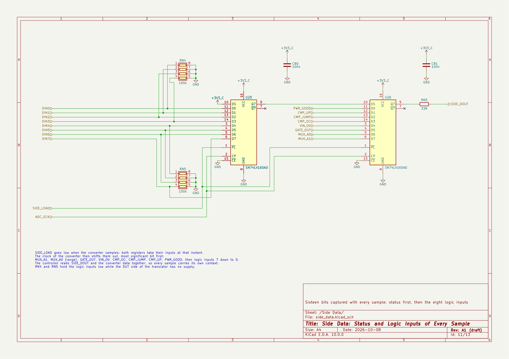

# Carrier Board, Draft A1 in Pictures

The schematic and the board of [`../kicad/`](../kicad/), plotted so that the
design can be read without KiCad. The complete schematic is also in
[`schematic.pdf`](schematic.pdf).

Draft A1 is a review draft. Its parts are candidates, no component check is
closed, nothing was simulated or measured, and the board has no tracks. The
status and the open work are in the [hardware README](../README.md).

## Board

Outline 130 mm × 100 mm, four copper layers, four M3 holes. Every footprint
is placed near the pin it serves, inside the area of its functional block;
nothing is routed.


The areas of the blocks, as drawn on the `Dwgs.User` layer. The back of the
instrument is the left edge: the Raspberry Pi Pico 2 lies along it with its
USB connector at the edge, and the USB-C power connector is below it. The
front is the right edge: the logic port, then the two DUT connectors, in the
pin order of the PPK2. The switching converters are on the left, the front
end on the right. KiCad has no 3D model of the lever terminal block, so the
3D views show its pads only.


## Schematic

Thirteen A4 pages. Inside a sheet every connection is a wire; supply rails
use power symbols; a signal that leaves a sheet ends on a hierarchical
label, and the root sheet joins the labels with wires.

### 1. Root

One block per sheet and the 44 signals between them.


### 2. Controller

The Raspberry Pi Pico 2 on its sockets, the only programmable part of the
instrument. Two diodes join its USB supply and the 5 V rail of the carrier,
so either connector powers both boards. Resistor arrays sit in the slow SPI
lines and in the acquisition outputs. A push button resets the controller,
and a 3-pin header brings out its console.


### 3. Power Input

USB-C sink for 5 V with its CC resistors, a resettable fuse and a transient
suppressor, and the two 3.3 V regulators: one for the logic of the carrier,
one for the converter and the comparators.


### 4. Analog Rails

Boost converter to 13.5 V, low-noise regulator to +12 V with the power-good
output, inverting charge pump with regulator to −4 V, and the 2.5 V
reference.


### 5. Source Meter

Buck-boost pre-regulator that follows the set-point through a difference
amplifier, linear regulator with its control pin on the boost rail, and the
12-bit DAC with a gain of 2.1 that sets the output from 0.8 V to 5.0 V.


### 6. Path Switching

Two back-to-back MOSFET pairs select the source meter or the external
supply. The VIN input has a fuse, a reverse clamp and a detector that keeps
its switch open above 5.5 V: the detector pulls the input of the gate driver
low through a transistor, whatever the controller asks.


### 7. Shunt Ladder

Four shunts for four ranges: 1 kΩ always in circuit, 33 Ω, 1 Ω and 0.1 Ω
behind their switches. A dual multiplexer takes both sense taps of the
active shunt to the amplifier.


### 8. Output Stage

Output switch after the shunts, the two DUT connectors with low-leakage
clamps, and the buffer that copies the ladder output for the guard ring, the
level translator and the monitor. The pin header and the lever terminal
block carry the same four nets: GND, VIN, VOUT, GND.


### 9. Signal Chain

Instrumentation amplifier with a gain of 19.93 and a 50 mV pedestal, limiter,
two-pole filter at 40 kHz and the 16-bit converter, clocked by a PIO state
machine of the controller.


### 10. Comparators

Three thresholds on the amplifier output: step up at 90 mV across the shunt,
over-current at 120 mV, jump to the highest range at 150 mV.


### 11. Side Data

Two shift registers take, at the instant of every sample, the range, the
state of the output switch, the over-voltage detector, the comparators, the
power-good signal and the eight logic inputs. The clock of the converter
shifts them out, and the controller reads them together with the conversion
result.



### 12. Digital Inputs

The logic port in the pin order of the PPK2, eight inputs with protection,
series resistors and pull-downs, and a level translator. A solder jumper
selects the supply of its DUT side: the output voltage of the instrument, as
built, or the VCC pin of the port.


### 13. Monitors

Eight slow channels: output voltage, VIN, VBUS, the two CC lines,
temperature and the two analog rails.


## Making the Pictures Again

Run from [`../kicad/`](../kicad/) after a change, with KiCad 10:

```sh
kicad-cli sch export pdf --output ../doc/schematic.pdf power-profiler-carrier.kicad_sch
kicad-cli pcb render --output ../doc/images/board-3d.jpg --width 1800 --height 1170 --rotate "-42,0,-25" --perspective --zoom 0.92 --quality high --background opaque power-profiler-carrier.kicad_pcb
kicad-cli pcb render --output ../doc/images/board-top.jpg --width 1800 --height 1420 --zoom 1.22 --quality high --background opaque power-profiler-carrier.kicad_pcb
kicad-cli pcb export svg --output board-placement.svg --layers F.Cu,F.SilkS,F.Fab,Edge.Cuts,Dwgs.User,F.CrtYd --page-size-mode 2 --exclude-drawing-sheet power-profiler-carrier.kicad_pcb
```

The page images are the pages of the PDF at 160 dpi, for example from
`pdftoppm -r 160 -png`, named after their sheets. The placement drawing is
the exported SVG converted to PNG.
