# Carrier Board, Draft A0 in Pictures

The schematic and the board of [`../kicad/`](../kicad/), plotted so that the
design can be read without KiCad. The complete schematic is also in
[`schematic.pdf`](schematic.pdf).

Draft A0 is a review draft. Its parts are candidates, no component check is
closed, nothing was simulated or measured, and the board has no tracks. The
status and the open work are in the [hardware README](../README.md).

## Board

Outline 160 mm × 100 mm, four copper layers, four M3 holes. Every footprint
is placed inside the area of its functional block; nothing is routed.


The areas of the blocks, as drawn on the `Dwgs.User` layer. The development
board plugs into the two sockets on the left, with its USB connectors at the
bottom edge; the parts of its interface sit between the socket rows. The
power connector is beside it, and the VIN and VOUT terminals and the logic
header are on the right edge, next to the front end.


## Schematic

Thirteen A4 pages. Inside a sheet every connection is a wire; supply rails
use power symbols; a signal that leaves a sheet ends on a hierarchical
label, and the root sheet joins the labels with wires.

### 1. Root

One block per sheet and the 60 signals between them.


### 2. MCU Interface

The development board on its sockets. Every output of the MCU passes a
series resistor on its way to the logic device, and the request lines have
pull-downs. The outputs of the carrier reach the MCU through a buffer
powered from the 3.3 V pin of the development board. A header brings out the
JTAG pins of the module, and a solder jumper can feed 5 V to the development
board.

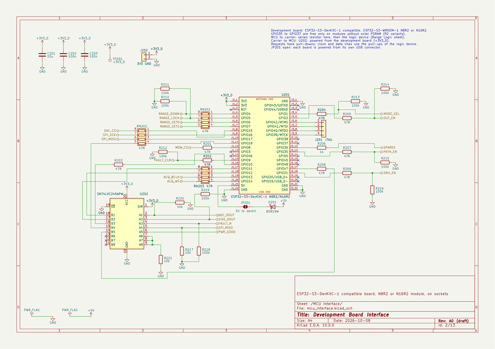

### 3. Power Input

USB-C sink for 5 V with its CC resistors, a resettable fuse and a transient
suppressor, and the two 3.3 V regulators: one for the logic of the carrier,
one for the converter and the comparators.


### 4. Analog Rails

Boost converter to 13.5 V, low-noise regulator to +12 V with the power-good
output, inverting charge pump with regulator to −4 V, and the 2.5 V
reference.

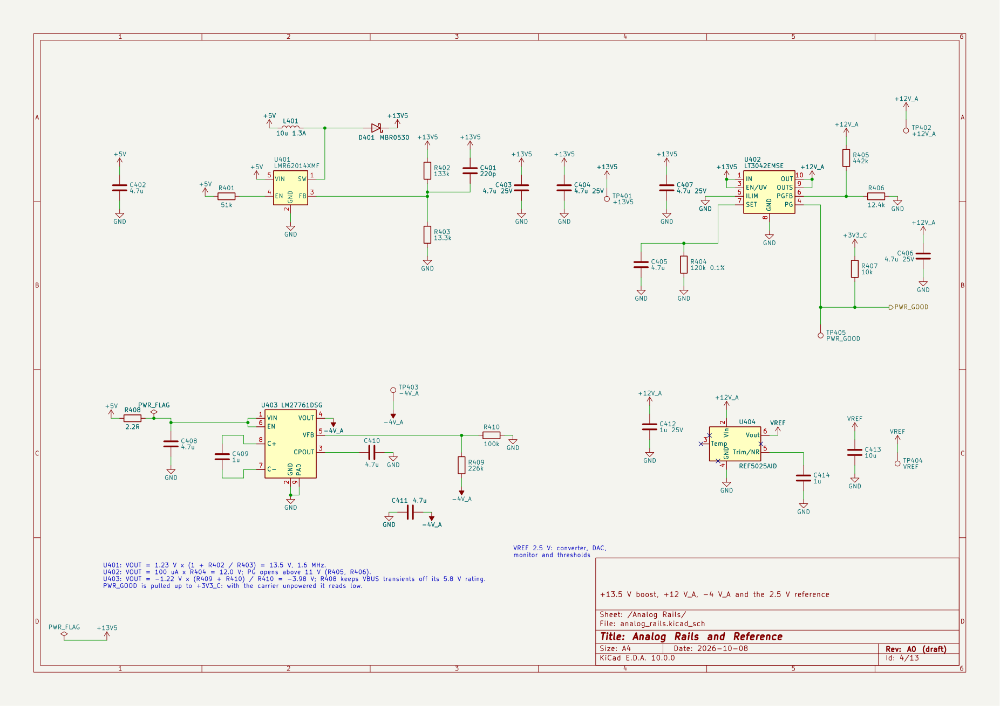

### 5. Source Meter

Buck-boost pre-regulator that follows the set-point through a difference
amplifier, linear regulator with its control pin on the boost rail, and the
12-bit DAC with a gain of 2.1 that sets the output from 0.8 V to 5.0 V.

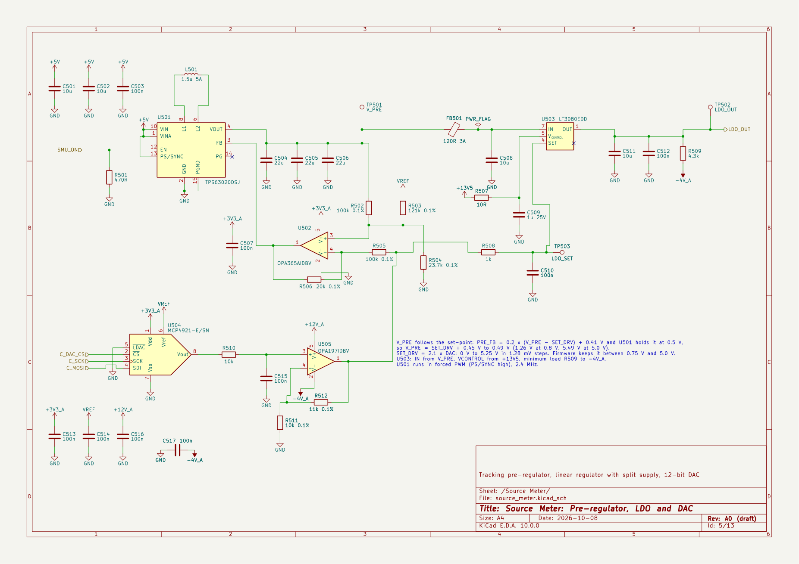

### 6. Path Switching

Two back-to-back MOSFET pairs select the source meter or the external
supply. The VIN terminal has a fuse, a reverse clamp and a detector that
keeps its switch open above 5.5 V.

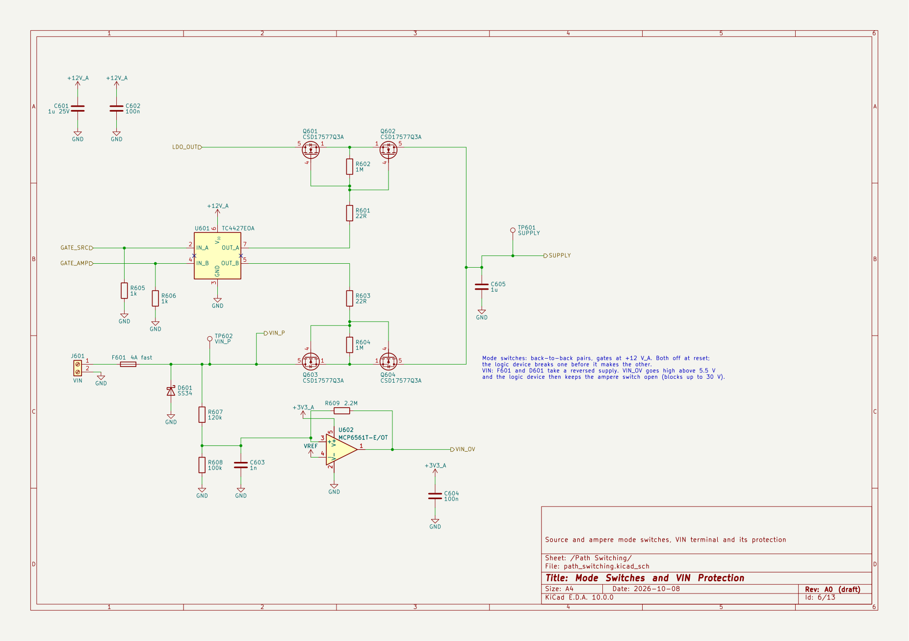

### 7. Shunt Ladder

Four shunts for four ranges: 1 kΩ always in circuit, 33 Ω, 1 Ω and 0.1 Ω
behind their switches. A dual multiplexer takes both sense taps of the
active shunt to the amplifier.

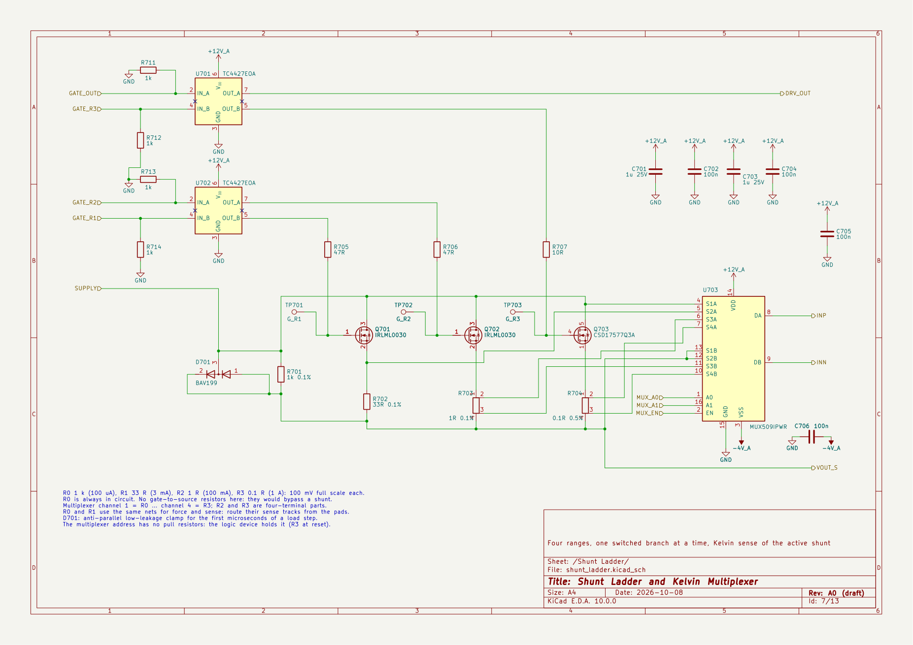

### 8. Output Stage

Output switch after the shunts, the VOUT terminal with low-leakage clamps,
and the buffer that copies the ladder output for the guard ring, the level
translator and the monitor.

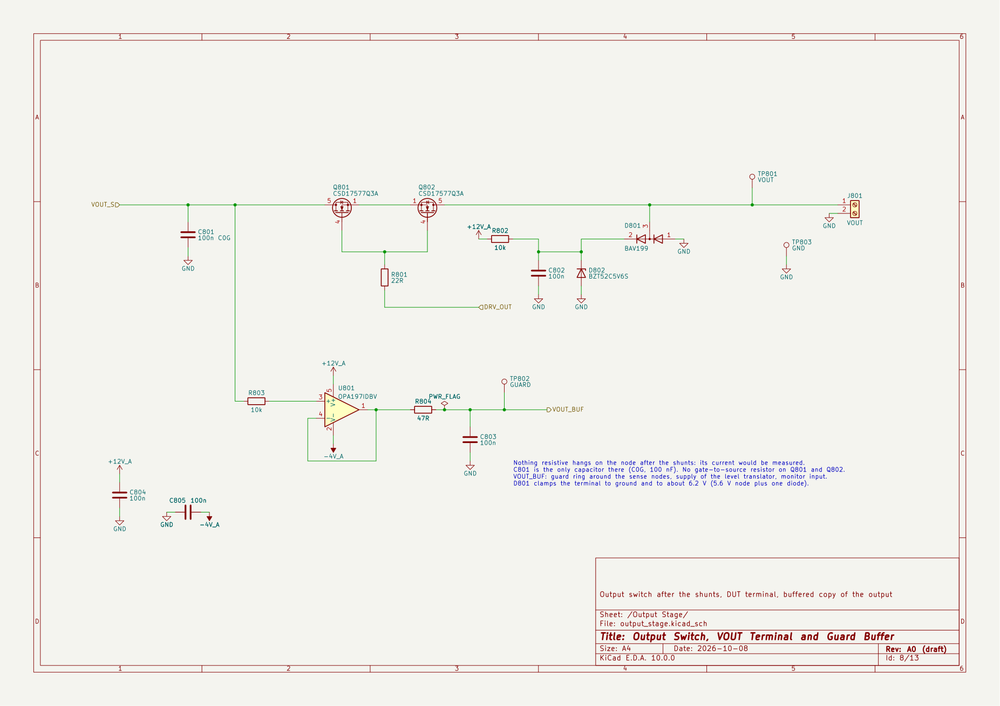

### 9. Signal Chain

Instrumentation amplifier with a gain of 19.93 and a 50 mV pedestal, limiter,
two-pole filter at 40 kHz and the 16-bit converter clocked by the I2S
peripheral of the MCU.

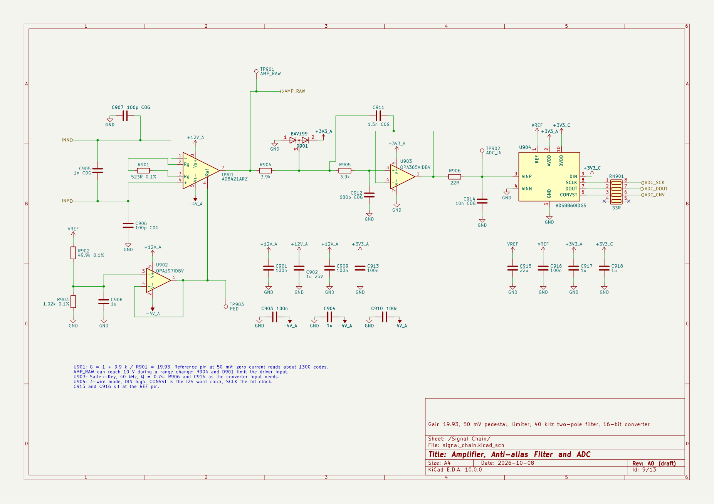

### 10. Comparators

Three thresholds on the amplifier output: step up at 90 mV across the shunt,
over-current at 120 mV, jump to the highest range at 150 mV.

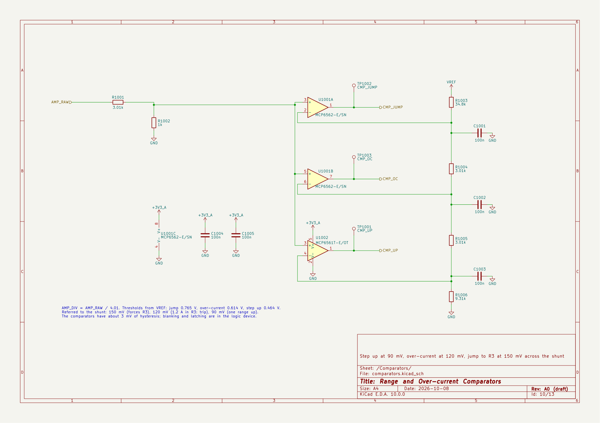

### 11. Range Logic

One programmable logic device holds the range register, the switch timing,
the fault latch, the mode interlock and the side-data shift register. Its
description is not written yet.

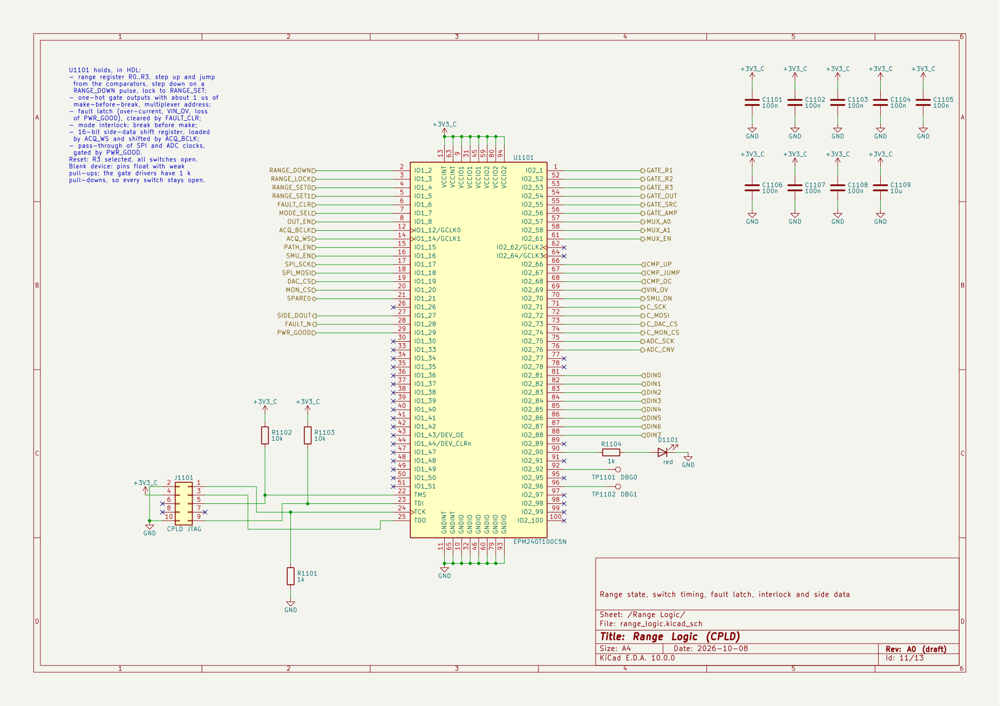

### 12. Digital Inputs

Eight logic inputs with protection, series resistors and pull-downs, and a
level translator whose DUT side follows the output voltage.

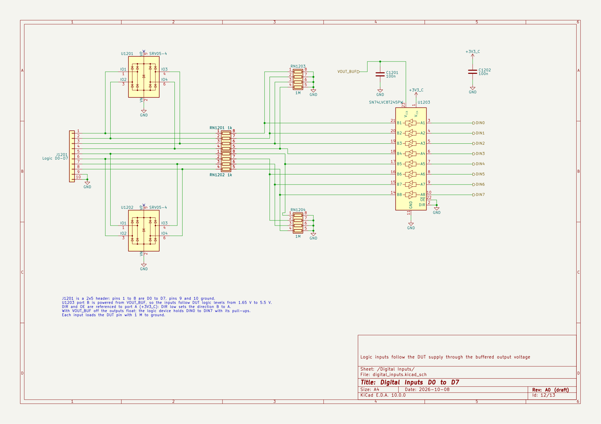

### 13. Monitors

Eight slow channels: output voltage, VIN, VBUS, the two CC lines,
temperature and the two analog rails.

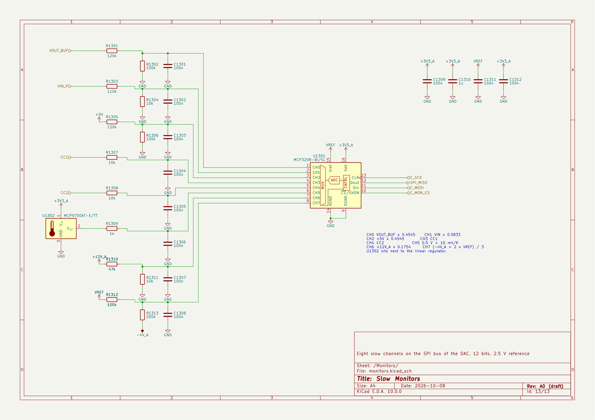

## Making the Pictures Again

Run from [`../kicad/`](../kicad/) after a change, with KiCad 10:

```sh
kicad-cli sch export pdf --output ../doc/schematic.pdf power-profiler-carrier.kicad_sch
kicad-cli pcb render --output ../doc/images/board-3d.jpg --width 1800 --height 1170 --rotate "-42,0,-25" --perspective --zoom 0.92 --quality high --background opaque power-profiler-carrier.kicad_pcb
kicad-cli pcb render --output ../doc/images/board-top.jpg --width 1800 --height 1170 --zoom 1.45 --quality high --background opaque power-profiler-carrier.kicad_pcb
kicad-cli pcb export svg --output board-placement.svg --layers F.Cu,F.SilkS,F.Fab,Edge.Cuts,Dwgs.User,F.CrtYd --page-size-mode 2 --exclude-drawing-sheet power-profiler-carrier.kicad_pcb
```

The page images are the pages of the PDF at 160 dpi, for example from
`pdftoppm -r 160 -png`, named after their sheets. The placement drawing is
the exported SVG converted to PNG.
