# Carrier Board, Draft A2 in Pictures

The schematic and the board of [`../kicad/`](../kicad/), plotted so that the
design can be read without KiCad. The complete schematic is also in
[`schematic.pdf`](schematic.pdf).

Draft A2 is a review draft. Its schematic passes the electrical rules check
of KiCad with no errors and no warnings, and its netlist was checked
independently against datasheets. The parts are candidates, no component
check is closed, and nothing was built or measured: every figure below is a
datasheet value, a calculation, a simulation or an estimate, as marked. The
files of the simulations are not in the repository yet.

The board was an autorouted draft with 28 of its 984 connections open. On
2026-10-10 its layout was reviewed: the open connections were closed and the
copper that an autorouter does not draw was drawn, with scripts on the board
file, block by block, and checked by independent calculation. All 984
connections are routed now, and the design rules check reports no violation,
no unconnected pad and no difference between board and schematic. Every
figure of the board in this guide is calculated from the drawn copper. No
board exists, and nobody has yet looked at the layout in the KiCad editor
the way a person does before ordering boards. The seven points in which the
drawn board differs from the earlier text of section 10 of the specification
are recorded as decisions D-87 to D-93, and some open items need parts
moved; both lists are in the [Board](#board) part below.

The status and the open work of the hardware are in the
[hardware README](../README.md); the reasons behind every value are in the
[specification](../../docs/specification.md), whose sections are named with
each sheet.

The pages, the PDF and the pictures of the board are plotted from the
files as they are now. The fifteen pages were plotted on 2026-10-09, after
the notes of the sheets were compared with the specification. On 2026-10-10
the title block of the root page got the name of the project, and the PDF
and the picture of the root page were exported again; the other fourteen
pages were compared page by page and are unchanged. The pictures of the
board were plotted on 2026-10-10 from the final board file. The circuit did
not change in the layout review: the same 428 parts and the same nets. The
text of each section below was read against its picture, notes included.

## Schematic

Fifteen A4 pages: the root sheet and fourteen sheets with 428 parts. Inside
a sheet every connection is a wire; supply rails use power symbols; a signal
that leaves a sheet ends on a hierarchical label, and the root sheet joins
the labels with wires. Each sheet carries notes with the design values of
its block. A part drawn with a cross is a position without a part.

### 1. Root

One block per sheet and the 48 signals between them. The supply rails are
not on this page: they are power symbols on the sheets. The title block
reads "Open Power Profiler - Carrier Board".

The controller is in the middle. To its left are the sheets of the
measurement: the signal chain with the comparators above it, and the side
data, which collect the logic inputs, the comparator outputs and the status
lines for every sample. Below the controller are the shunt ladder and the
output stage. To its right are the source meter, the monitors and the path
switching, which joins the regulator output or the VIN terminal to the
supply node of the ladder. Of the three supply sheets at the right edge, the
logic supplies and the analog rails share the signal `5V_OK` with the source
meter. The digital inputs and the rail monitor are at the left edge; the rail
monitor has one output, `PWR_GOOD`.


### 2. Controller

The Raspberry Pi Pico 2 (U1) on its two sockets (MP1, MP2), the
only programmable part of the instrument. An RP2350 of stepping A3 or A4 is
preferred (decision D-82). Sections 4.11 and 5 of the specification
describe it.

- Left side of the module: the console header J1 on GP0 and GP1, the
  reset button SW1 on the RUN pin, and the lines of the range sequencer,
  a state machine in PIO block 1. GP2 to GP7 drive the three range gates,
  the two address bits of the Kelvin multiplexer and the output switch; GP8
  to GP10 read the three comparators. GP11 reads the over-voltage detector
  of VIN through R1.
- Below it, GP12 to GP15 are the slow SPI bus of the DAC and of the monitor
  converter, with 2.2 kΩ in each line (RN1).
- Right side: PIO block 0 clocks the converter and reads its data and the
  side data in the same word, on GP16, GP17 and GP19 to GP21, with 47 Ω in
  each output (RN4). GP18 asks for the pre-regulator, GP22 selects the
  DAC through 47 Ω and R3, GP26 and GP27 ask for the two mode switches,
  and GP28 reads `PWR_GOOD` through R4.
- Top: the supply. The 5 V rail of the carrier feeds the VSYS pin through
  the Schottky diode D1. The VBUS pin leaves the sheet through the
  solder jumper JP1 as `PICO_5V`, the second power input of the
  carrier. The 3.3 V pins of the module are not connected, and its analog
  ground joins the ground plane through the link R2.

Every line that the module drives, except the console output, has a
resistor to a rail on the carrier. RN2 and RN3, 4.7 kΩ, pull the two chip
selects up to `+3V3_A` and the other SPI and acquisition lines down, so that
with the module in reset, in its boot loader or out of its sockets no
converter is selected and none converts; against the pull-down of a pad a
select stays at 2.8 V or more (calculated). The pull resistors of the gate
and address lines are on the sheets of their receivers.

The series resistors limit what a pin can push into an input whose supply
is absent: 1.39 mA into a slow SPI input and 1.90 mA into the select of the
DAC at the tolerance limits, against a rating of 2 mA (calculated; datasheet
value). The slow SPI bus runs at 500 kHz or less. R1 and R4 keep the two
status lines true if a pin is set as an output by mistake: the detector
line then moves by 0.14 V at the most, and `PWR_GOOD` carries 3.3 mA at the
most, against 25 mA that the comparators driving it are rated for
(calculated; datasheet value). Firmware never sets GP1, GP8 to GP12, GP16,
GP17 or GP28 as an output (rule F-4).

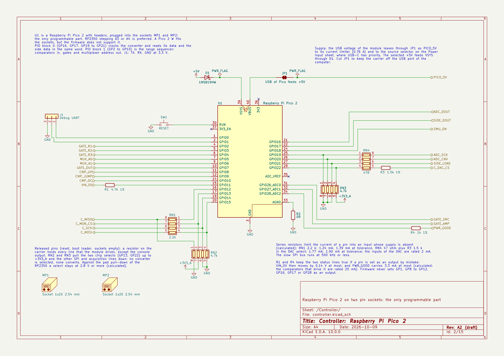

### 3. Power Input

Two USB inputs, a current limiter for each, and a priority multiplexer that
connects one of them to the 5 V rail (section 4.1, decision D-47).

- Top row, from the left: the USB-C receptacle J2, a sink for 5 V, with
  the suppressor D2 and the capacitors C2 and C3 at its pins,
  then the limiter U4, an electronic fuse. The divider R9, R10
  turns it on at 2.92 V to 3.09 V and off at 2.67 V to 2.87 V; R15 sets
  the limit to 2.0 A, 1.81 A to 2.17 A with the tolerances (calculated).
  With an input above 5.54 V to 5.83 V it clamps its output at 5.28 V to
  5.61 V (datasheet values; R12 selects that level), and C4 sets the
  ramp of its output to 13 V/ms after a turn-on delay of about 0.25 ms
  (datasheet, typical). TP3 shows the input current, 0.297 V per ampere
  (calculated).
- Behind the limiter: the damper R20, C9, C10 and C7, which
  take the ring of a contact that closes, and the Schottky diode D4
  across the limiter, which returns their charge when the plug is pulled.
- Middle: the two CC lines with their 5.1 kΩ pull-downs (R7, R11) and
  the ESD array U2. They leave the sheet to the monitor converter, where
  firmware reads what the source offers: below 0.61 V a default USB port,
  0.70 V to 1.16 V a source of 1.5 A, 1.31 V to 2.04 V a source of 3 A.
- Bottom row: `PICO_5V`, the USB voltage of the controller module, with the
  second limiter U3. It is the same circuit with a limit of 0.76 A,
  0.67 A to 0.85 A with the tolerances (calculated, R13), and without a
  ramp capacitor: its turn-on delay is about 0.08 ms (datasheet, typical).
  R17 defines its output while the limiter is off or the jumper is open.
  The crossed parts R14 and C5 are a position for a second damper, 0.33 Ω
  and 10 µF, to be fitted if the bench shows more than 6.0 V at TP4 when
  the data cable is plugged again (decision D-84).
- Right: the multiplexer U5. It drives `+5V` from the USB-C limiter
  while that output is above 2.15 V to 2.59 V (calculated; R18, R19,
  delayed by C8), otherwise from the module input, and it blocks reverse
  current into both inputs. Its status output `SRC_ST` is open while USB-C
  supplies the rail and low while the module input does. C11, 47 µF, is
  the bulk capacitor of the rail.

There is no fuse: the parts ahead of the limiter are protected by the source
alone. A live cable plugged into the receptacle lifts its pins to as much as
11.4 V with a 5.25 V source and 12.2 V with a 5.5 V source for microseconds,
while the rail never rises above the source (simulated); the limiter
withstands 21 V at its input (datasheet value). Test points: TP1 on the
receptacle, TP2 and TP4 on the two inputs of the multiplexer,
TP5 on `SRC_ST`.

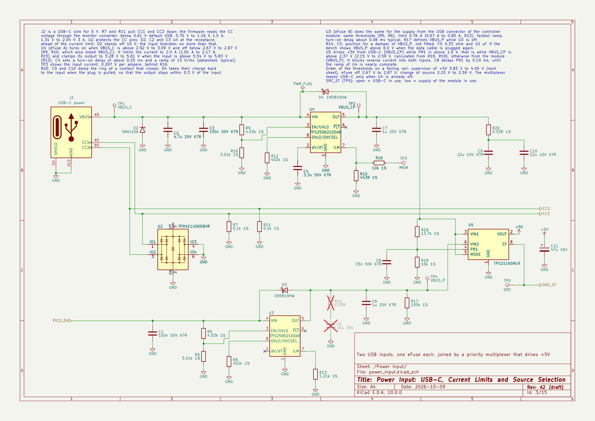

### 4. Logic Supplies

The supervisor of the 5 V rail and the two 3.3 V regulators that it enables
(section 3, decision D-48).

- U6 compares the rail, divided by the 0.1 % resistors R21 and
  R22 and filtered by C12, with its internal reference. Its
  open-drain output `5V_OK`, pulled up by R25, goes low when the rail
  falls below 3.91 V, 3.83 V to 4.00 V with the tolerances, and returns
  0.18 s to 0.42 s after the rail is back above 4.12 V at the most
  (calculated from datasheet limits; R24 selects the delay).
- `5V_OK` is the enable input of U7, which makes `+3V3_C` for the logic
  of the carrier, and of U8, which makes `+3V3_A` for the converter, the
  comparators, the DAC, the monitor converter and the reference. The
  driver of the converter is not on this rail: it runs from the driver
  rail of the Signal Chain sheet. `5V_OK` leaves the sheet to the
  +12 V regulator, to the charge pump and to the transistor at the enable
  pin of the pre-regulator. The carrier therefore has one off state, which
  it reaches without firmware and in which only `+5V` and `+13V5` are up.
- TP9, held to ground, keeps the carrier in that state during
  bring-up.
- The green LED D5 on `+3V3_C` is lit while the supervisor has released
  the carrier. R23 loads the 5 V rail with 10 kΩ, so that the reverse
  current of the diode to the module cannot lift a rail that has no source.
- The four mounting holes H1 to H4, tied to ground, the three
  fiducials FID1 to FID3 and the test points of the rails are drawn
  here.

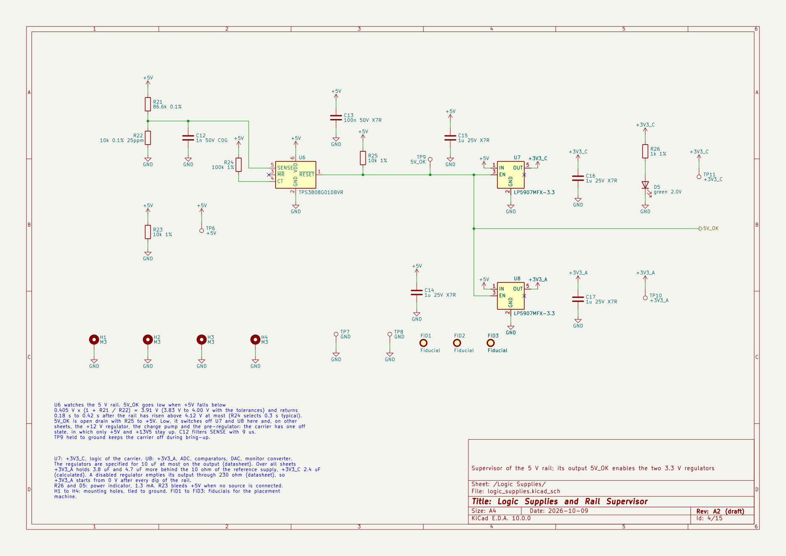

### 5. Analog Rails

The rails of the analog parts and the reference (section 3, decisions D-51
to D-53).

- Top left: the boost converter U10 with L1 and D6 makes `+13V5`,
  13.0 V to 14.1 V with the tolerances (calculated; feedback R32,
  R33). Its enable pin is pulled up to `+5V` by R29: it is not gated
  by `5V_OK` and runs whenever the rail is present. The crossed part U9
  is a position for a 3.08 V voltage detector at that pin. The converter has
  no under-voltage lock-out and no soft start (datasheet); the detector is
  the remedy if it does not start from the current-limited module input,
  which is a bench item (decision D-84).
- Top right: R37, 0.47 Ω, and C29 filter the boost output for the
  low-noise regulator U13, which makes `+12V_A`. R38 sets 12.0 V and
  C30 at the same pin sets the noise and the slow approach of the last
  volt: the rail is above 9.85 V after 8 ms to 17 ms and settles in about
  0.8 s (simulated). The Schottky diode D9 keeps the rail from being
  pulled below ground through its loads.
- Middle: the charge pump U11 makes `-4V_A` from the 5 V rail behind
  R30, 2.2 Ω, and C21, which take the edges of the rail. The 0.1 %
  feedback resistors R34 and R36 put the rail at −3.91 V to −4.05 V
  (calculated). `5V_OK` enables it through the divider R27, R28, and
  D8 keeps the rail from being pulled above ground.
- Bottom: the 2.5 V reference U12. It is supplied from `+3V3_A` through
  R31 and C20, and D7 ties its output to that rail by a Schottky
  drop, so that the reference is never present without the rail of the
  parts that receive it. C26 behind R35 is its damped output
  capacitor and C24 its noise filter.

With the clamps, `-4V_A` stays below +0.24 V and `+12V_A` above −0.23 V
while the other rail is absent (simulated). L1, R37, R31 and
R27 are the links of the first power-up: each starts one stage. Test
points TP12 to TP14 and TP16 are on the three rails and on the reference,
and TP15 is a probe ground at the boost converter.

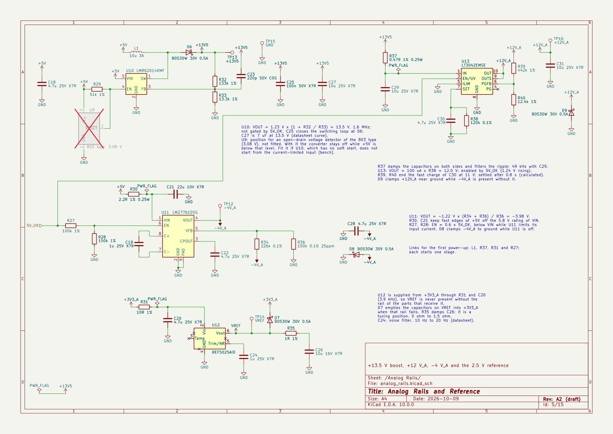

### 6. Rail Monitor

Four open-drain comparators in one package (U14) share the line
`PWR_GOOD`, so that the line is high only while every rail they watch is
present (section 3, decision D-54).

- R41, R43 and R44 make the two thresholds as fractions of
  `+3V3_C`: 2.97 V and 1.645 V.
- From the left: `+3V3_A` against the upper threshold; `+12V_A`, divided by
  R45 and R46; `-4V_A`, lifted toward `+3V3_C` by R47 and R48;
  and the reference, divided by R49 and R50. The flag is low while
  `+3V3_A` is below 2.97 V, `+12V_A` below 9.85 V, `-4V_A` above −2.57 V or
  the reference below 2.245 V (calculated).
- R51 pulls the line up to `+3V3_C` and R52 pulls it down: the high
  level is 0.82 of the rail, and the line is low without supply.
- C32, C33 and C34 at the comparator inputs keep an edge of the
  flag from moving its own thresholds: in the package every output pin is
  the neighbor of an inverting input.

The flag reports that the rails are present, not that they are in
tolerance, and it cannot see a `+3V3_C` that stands low; firmware checks the
levels on the monitor converter. It is also low while the supervisor of the
5 V rail holds the carrier off. `PWR_GOOD` goes to the controller and to a
side bit of every sample; TP17 is its test point.

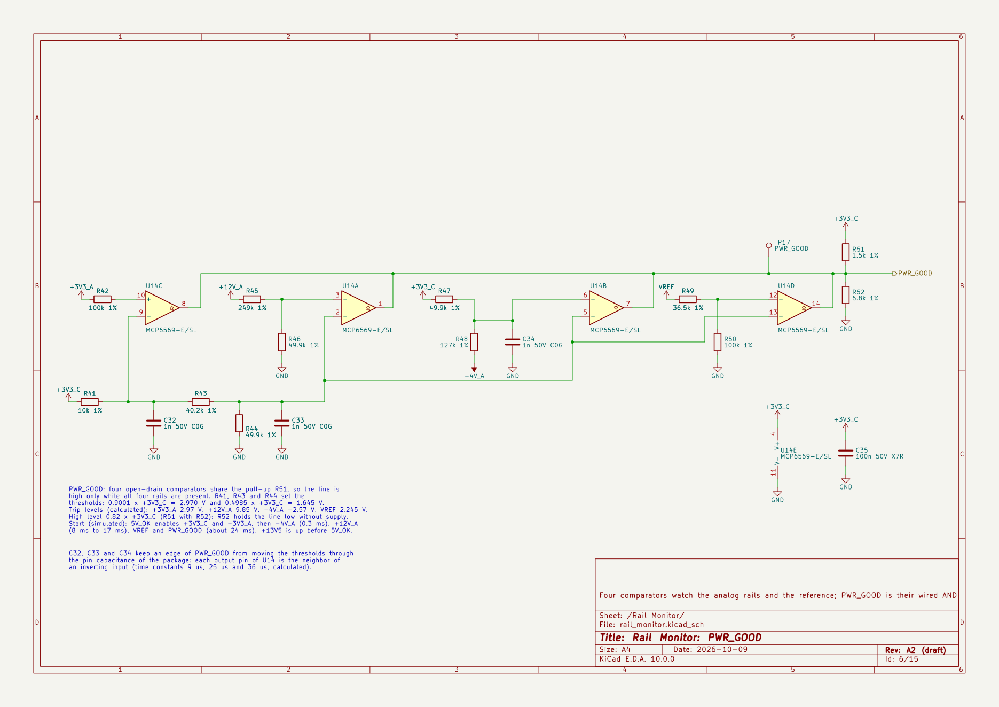

### 7. Source Meter

The supply of source mode: a switching pre-regulator, a linear regulator
behind it and the DAC that sets the output (section 4.2, decisions D-55 to
D-58).

- Top left: the buck-boost converter U16 with L2 makes `V_PRE` from
  the 5 V rail, in forced PWM. Its enable pin has R53 to ground and gets
  the request `SMU_ON` of the controller through Q1, whose gate is
  `5V_OK`: the converter runs only while the controller asks for it and the
  5 V rail is valid. With the rail at 4.25 V the pin still gets 2.36 V
  (calculated; the gate threshold of Q1 is an estimate), against the 1.2 V
  it needs (datasheet value).
- Top right: the difference amplifier U19 with the 0.1 % resistors R63
  to R68 drives the feedback pin of the converter, so that
  `V_PRE` = 0.672 V + 0.956 × the output of the linear regulator
  (calculated). The pre-regulator follows the output, not the set-point,
  because the linear regulator cannot sink current: its input stays above
  its output also when a DUT holds the output up. R65 and C55, loaded by
  R64, are a low-pass of 0.62 ms in the sense path (calculated), and one
  diode of D13 across R65 lets a rise of the output through at once.
- `V_PRE` carries C42, C45 and C50 and the bleeder R62, which empties
  them while the converter is off. The bead FB1, C46 and the damper
  C43 with R59 filter it for the linear regulator.
- Bottom right: the linear regulator U18. Its control pin is fed from
  `+13V5` through R61 and one diode of D10, with C47 at the pin.
  D11 clamps its input to its output, and D12 keeps its output above
  about −0.2 V (estimate).
  R69 to `-4V_A` is the minimum load, 3.7 mA at 0.8 V and 6.9 mA at 5.0 V
  (calculated); it sits ahead of the shunts and is not measured. C53 and
  C54 are the output capacitors.
- Bottom left: the 12-bit DAC U15 on the slow SPI bus. Its reference
  input is half the reference, from R55 and R56. R54 with C41
  filters its output with 10 ms, and the amplifier U17 with a gain of
  2.1 (R57, R58) drives the SET pin of the regulator through R60.
  The output is 0.01 V to 5.26 V in steps of 1.28 mV, before calibration
  10 mV + code × 1.2817 mV; no SPI frame can command more than 5.26 V
  nominal and 5.39 V at the tolerance limits (calculated).

The source delivers 1.0 A up to 2.0 V, falling in a straight line to 0.6 A
at 5.0 V (R-08; calculated, a design figure until it is measured on several
boards). Test points: TP21 on `V_PRE`, TP22 on the regulator input,
TP26 on its output, TP23 on its SET pin, TP24 on the feedback pin,
TP19 on the reference of the DAC, TP18 on the enable pin, and the
probe grounds TP25 and TP20.

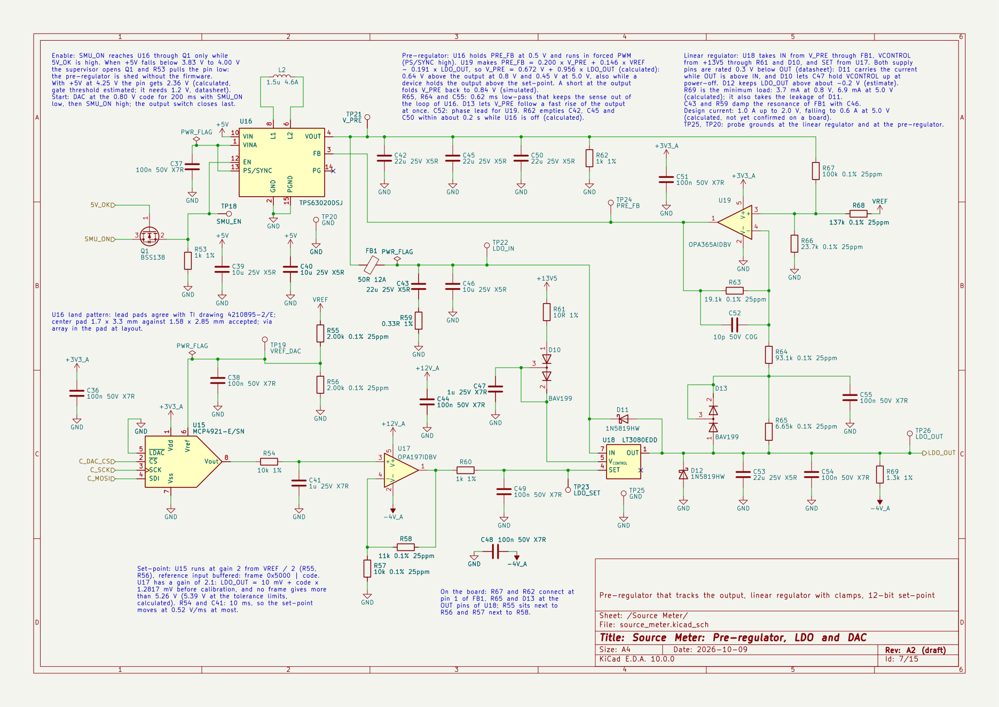

### 8. Path Switching

Two back-to-back MOSFET pairs connect either the regulator output or the
VIN terminal to the supply node of the ladder (sections 4.2 and 4.9,
decisions D-60 to D-63).

- Upper half: the source pair Q4, Q8 between `LDO_OUT` and
  `SUPPLY`. Lower half: the ampere pair Q5, Q9 between the VIN input
  and `SUPPLY`. The gate driver U20 in the middle drives both from
  `+12V_A`.
- Each pair has the same gate network; the parts of the ampere pair are
  named here. The driver charges the gate through R80, 100 kΩ, and
  C61 with R82 sets the ramp to 10.7 ms (calculated), so the pair
  closes as a source follower and the supply node rises with about 0.9 V/ms
  (simulated). One diode of D17 and R79 discharge the gate at once:
  the pair opens within 1 µs (simulated). The second diode ties the gate to
  `+12V_A`. R84 returns the gate to the common source. Q7 with
  R86 and D19 joins gate and common source when the common source
  goes below ground, so that a reversed supply cannot turn an open pair on.
- Interlock, left of the driver: Q2, driven by the source-mode request,
  and Q3, driven by the over-voltage detector, both pull the input of
  the ampere driver low. The two pairs can never be closed together, and
  the ampere pair stays open above the over-voltage level, whatever the
  controller asks. R70 and R71 hold both requests low while the pins
  of the controller float.
- Bottom left: the VIN input with the fuse F1, the bidirectional
  suppressor D14 and the detector U21. The detector compares VIN,
  divided by R73 and R74, with the reference; R76 gives the
  hysteresis and D15 clamps its input. It trips at 5.46 V, 5.41 V to
  5.51 V with the tolerances, and releases at 5.35 V, 5.30 V to 5.40 V
  (calculated). It is not latched.
- Right: the supply node with C62 and the damped branch C63, R87,
  which take the current of the supply leads when the over-current trip
  opens the output.

VIN works with 0.8 V to 5.0 V. While the ampere pair is open the terminal
withstands −20 V to +20 V and takes less than 1 mA (simulated). The
suppressor conducts from 22.2 V (datasheet value) and the fuse cannot
protect it: 20 V is the limit of the terminal. Test points: TP33 on the
supply node, TP27 on VIN behind the fuse, TP32 and TP31 on the
gates, TP30 on the detector output, and the probe grounds TP28 and
TP29.

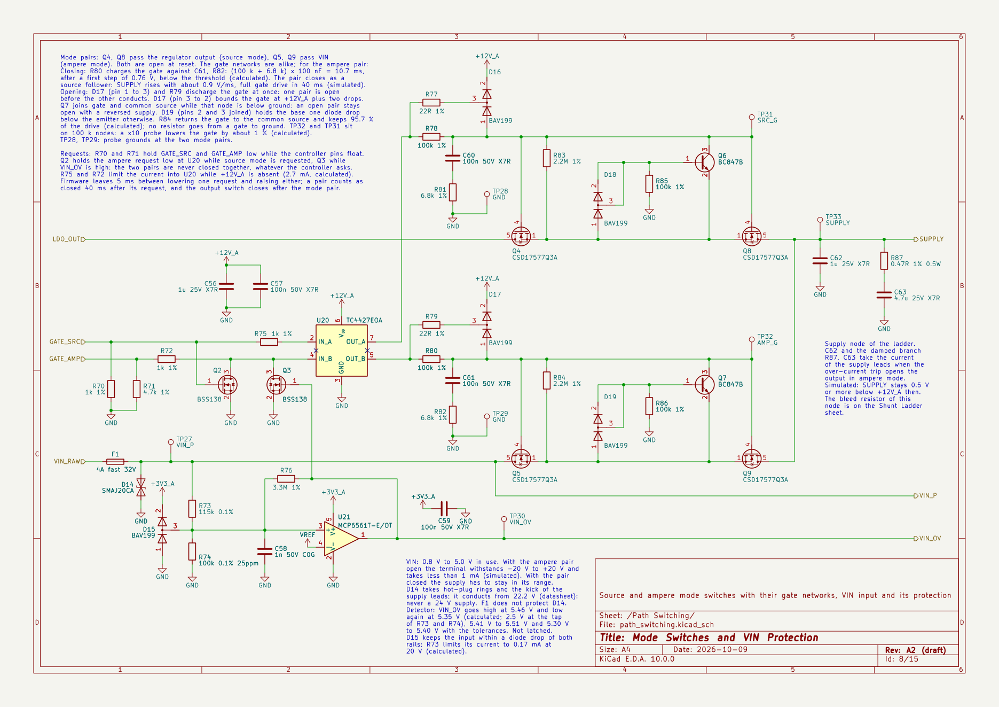

### 9. Shunt Ladder

Four shunts for four ranges between the supply node and the node after the
shunts (sections 4.3 and 4.4, decisions D-66 to D-68).

- The shunts are along the bottom of the drawing: 1 kΩ for range 0
  (R101), always in circuit, 33 Ω for range 1 (R104), 1 Ω for range 2
  (R107) and 0.1 Ω for range 3 (R110). Each drops about 100 mV at its
  full scale of 100 µA, 3 mA, 100 mA and 1 A. R107 is a two-terminal chip
  on a four-pad Kelvin land and R110 a four-terminal part.
- Above each switched shunt is its MOSFET, on the supply side: Q12,
  Q13 and Q14. One branch is on at a time, on top of range 0, and two
  overlap for about 1 µs during a range change.
- Top left: the gate drivers U22 and U23 on `+12V_A`. Each input has
  1 kΩ to ground and 1 kΩ in series, so that every switch is open without
  the controller and a line that is high without `+12V_A` feeds 2.7 mA into
  an input, 2.9 mA at the tolerance limits (calculated). Each range gate
  has 100 kΩ to ground (R103, R106 and R109) and no resistor to its
  source, which would bypass a shunt. The second half of U22 drives the
  output switch of the next sheet.
- Left: the ladder clamp Q10, Q11, two MOSFETs with gate and drain on
  the supply node and the source on the node after the shunts. Below their
  threshold they are off; in a hot plug or a short circuit they carry the
  surge until range 3 conducts and bound the ladder at about 4 V: 8.8 A in
  each, 14.2 A in one part with the thresholds at opposite limits
  (simulated), against a pulsed rating of 21 A (datasheet value). A charged
  DUT on a lower output discharges through their body diodes with 12.5 A
  each at the most (estimate). R90,
  100 kΩ from the supply node to ground, sets the idle level and is the
  bias return of the amplifier.
- Right: the dual multiplexer U24 takes both sense taps of the active
  shunt to the amplifier (`INP`, `INN`), so the switches and the copper
  between the shunts add burden but no measurement error. Its address lines
  have 5.1 kΩ to ground (R95, R91): range 0 is selected while the
  pins of the controller float. R113 pulls its enable input up to its own
  supply.

The range state lives in the controller as a PIO state machine; this sheet
is what it drives. On a jump, range 3 conducts 0.35 µs after the threshold
(simulated, typical), and on a step from 1 µA to 500 mA the voltage from
the supply node to VOUT drops by 312 mV with 1 µF at the DUT and by 169 mV
with 10 µF (simulated, nominal), against limits of 0.5 V and 0.25 V (R-07).
The leakage across the ladder has a budget of 100 nA at 100 mV and 40 °C,
which no datasheet figure bounds: it is an open check, and the clamp type
stays a candidate until it is closed. Test points TP34 to TP36 are on the
three range gates.

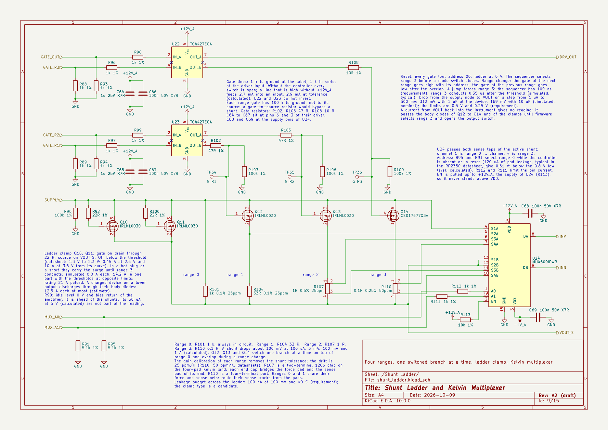

### 10. Output Stage

The output switch after the shunts, the two DUT connectors and the buffer
that copies the ladder output (sections 4.2, 4.8 and 4.9, decisions D-70 to
D-72).

- Middle: the output pair Q15, Q16 between the node after the shunts
  and VOUT. C71, 100 nF C0G, is the only capacitor on that node, and
  nothing resistive hangs on it: its current would be read as DUT current.
- Below it, the gate network. The driver charges the gate through R117,
  2.2 MΩ, against C74: the pair closes as a source follower and VOUT
  rises with 0.44 V/ms, 90 % of 5 V after about 20 ms. That limits the
  in-rush to 0.39 A into 1000 µF and 0.85 A into 2200 µF, below the trip
  level (simulated). One diode of D20 with R116 opens the pair: the
  gate is below 2 V within 7 µs (simulated). R120 damps the gates and
  R115 holds them low while the driver has no supply.
- Right: the pin header J3 and the lever terminal block J4 carry
  the same four nets in the order of the PPK2: GND, VIN, VOUT, GND. The
  unidirectional suppressor D21 is the only protection part on VOUT; its
  leakage adds to the reading and is an open check.
- Top: the buffer U25 senses the node after the shunts through R114.
  Behind R119 its output is `VOUT_BUF`, which drives the guard ring and
  the VOUT channel of the monitor. Behind R118 it is `VCCB_SRC`, the
  supply of the DUT side of the level translator, so that this current does
  not come from the DUT. Two Schottky diodes on the Digital Inputs sheet
  hold that supply between −0.40 V (simulated) and 6.0 V (calculated) with
  the buffer at either of its rails, inside the −0.5 V and 6.5 V that the
  translator allows (datasheet value).

For 250 ms after the switch closes, the charging current of its gate lowers
the reading, by 0.5 µA at 30 ms and 4 nA at 200 ms (simulated); the host
marks those samples. VOUT has no reverse-polarity protection. Test points:
TP38 on VOUT, TP40 on the guard, TP39 on ground and TP37 on the
gate node.

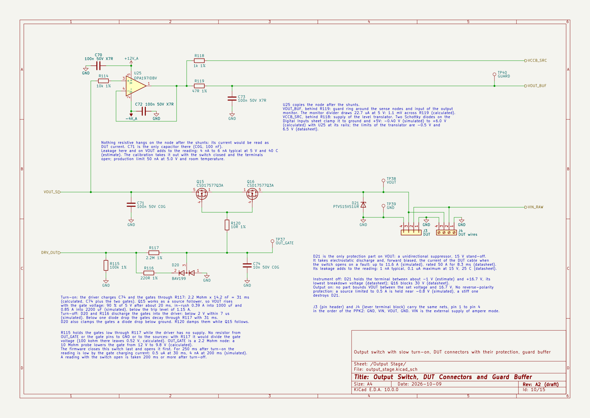

### 11. Signal Chain

From the sense taps of the active shunt to the 16-bit converter (sections
4.5 and 4.6, decisions D-65, D-73 and D-75).

- Left: the input filter C77, C76, C75 and the instrumentation
  amplifier U27 on `+12V_A` and `-4V_A`. R123 sets its gain to 19.93
  (calculated from the datasheet equation).
- Bottom left: the pedestal. R121 and R122 divide the reference to
  50 mV, and the buffer U26 puts it on the reference pin of the
  amplifier. Zero current then reads about 1313 codes (calculated), so that
  offset, noise and small reverse currents are not clipped.
- Middle: the limiter and the filter. The amplifier output can reach 10 V
  during a range change; R125 and the diode pair D22 limit the input
  of the ADC driver U29. With R128, C85 and C87 the driver is a
  two-pole filter at 40 kHz.
- Top: the driver rail `VDRV`. The buffer U28 with R127 and R124
  makes 1.091 × the reference, 2.73 V, and feeds the driver and the cathode
  of the clamp through R129, behind which the rail stands at about 2.68 V
  (calculated; TP42). While the buffer is supplied the converter
  input cannot pass the reference by more than 0.25 V, against a rating of
  0.3 V, and no clamp current flows into the reference (calculated;
  datasheet value).
- Right: the converter U30 with the input network R130, C90 and one
  reference capacitor, C89, behind R131. RN5 puts 220 Ω in its
  clock, data and convert-start lines, which keeps the current into the
  supply pin at 6 mA to 10 mA peak, 11.3 mA at the tolerance limits, when
  the controller drives the lines while `+3V3_C` is off (calculated). A PIO
  state machine of the controller makes the convert-start pulse and the 16
  clock pulses of every sample; the rising edge of convert-start is the
  sampling instant.
- Top right: the frame SH1 and the cover MP3 of the shield can over
  the multiplexer, the amplifier, the converter and the shunts of ranges 0
  to 2.

The converter reads full scale at 122.9 mV across the shunt (calculated).
After a range change the chain settles to 0.1 % of full scale in about
45 µs and to 1 LSB in about 65 µs (simulated); seven samples are flagged.
Test points: TP44 on the amplifier output, TP41 on the pedestal,
TP42 on the driver rail and TP43 on the converter input.

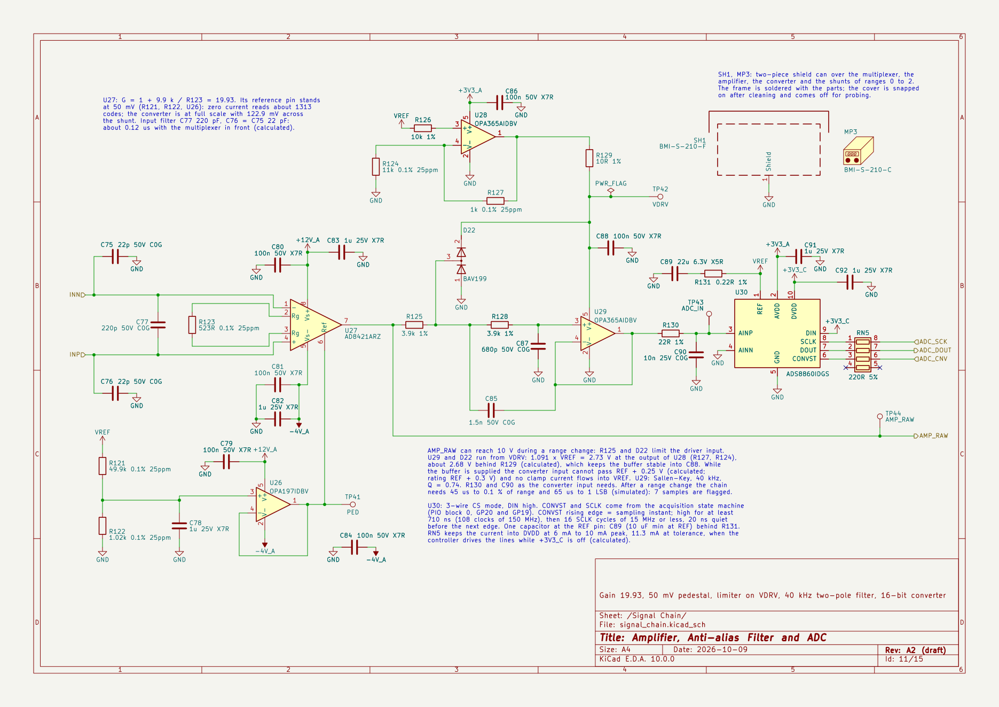

### 12. Comparators

Three thresholds on the amplifier output, for the range sequencer in the
controller (section 4.4, decisions D-74 and D-76).

- Top: R136 and R137 divide the amplifier output by 4.01, and the
  diode pair D23 keeps the comparator inputs inside their rating while
  `+3V3_A` is off and the amplifier output is high.
- Left: one resistor string on the reference, R132 to R135, makes the
  three thresholds, each with a 100 nF capacitor. All six resistors are
  0.1 % parts.
- Right, from the top: the jump comparator and the over-current comparator
  (the two halves of U31) and the step-up comparator (U32).

| Comparator | At the shunt | With tolerances | What the sequencer does |
| --- | --- | --- | --- |
| Step up | 91 mV | 87.5 mV to 94.4 mV | One range up |
| Over-current | 115 mV | 111.4 mV to 118.7 mV | In range 3, at 1.15 A: opens the output switch |
| Jump | 151 mV | 147.2 mV to 155.1 mV | Range 3 at once |

The levels are calculated from the resistor values, the tolerances and the
offset limit of the comparators. The over-current level lies below the full
scale of the converter on every board, so a trip is preceded by valid
samples. The outputs are active high and read low without `+3V3_A`. The
blanking of 2 µs after a range change, the qualification of the trip for
12 µs and its latch are in the sequencer, not on this sheet. Test points
TP45 to TP47 are on the three outputs.

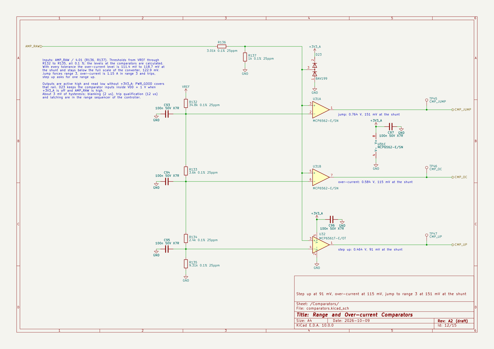

### 13. Side Data

Two shift registers give every sample sixteen bits of context (section 4.7,
decision D-41).

- U33, at the top, takes the eight logic inputs from the level
  translator. RN6 and RN7 hold them low while the DUT side of the
  translator has no supply.
- U34, below it, takes the status: the two address bits of the
  multiplexer, which are the range, the request of the output switch, the
  over-voltage detector of VIN, the three comparators and `PWR_GOOD`.
- Both registers load their inputs on a pulse at the convert-start edge of
  the converter and shift with the clock of the converter. The output of
  U33 feeds the serial input of U34, whose output reaches the
  controller through R138.

The order on the data line is the range, the output switch, the detector,
the over-current, jump and step-up comparators and `PWR_GOOD`, then the
logic inputs D7 down to D0. The controller reads this line and the data pin
of the converter at the same instants, so one word holds a conversion
result with the range, the flags and the logic levels of its own instant,
and the two cannot lose alignment. The detector and `PWR_GOOD` are taken on
the carrier side of the series resistors of their controller pins: no state
of a pin can falsify the bits.

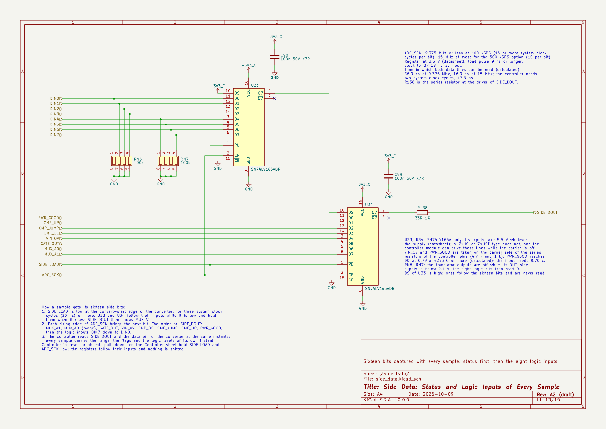

### 14. Digital Inputs

The logic port and the eight inputs that follow the logic level of the DUT
(section 4.8, decisions D-50, D-72 and D-79).

- Left: the port J5 in the pin order of the PPK2: VCC, ground, D7 down
  to D0.
- Seen from the port, each line meets one channel of an ESD array (U36
  for D0 to D3, U37 for D4 to D7), then 330 Ω in series (RN8,
  RN9), then a 470 kΩ pull-down (RN11, RN10) at the pin of the
  level translator U38. The VCC pin has one channel of a third array,
  U35.
- Right: the translator. Its DUT side runs from `VCC_B`, its other side
  from `+3V3_C`. Direction and enable are tied to ground, so the DUT side
  is always the input.
- Top: the solder jumper JP2 selects `VCC_B`. Bridged 1-2, as built,
  it is `VCCB_SRC`, the buffered copy of the ladder output from the Output
  Stage sheet, held between ground and `+5V` by the dual Schottky diode
  D24: the thresholds follow the supply of the DUT. Bridged 2-3 it is
  the VCC pin of the port through R139, for a DUT whose logic runs on
  another voltage than its supply. The bridge 1-2 is cut before 2-3 is
  closed.

The inputs work for logic levels of 1.65 V to 5.5 V (R-10). A line held
high loads the DUT with its voltage across 470 kΩ, which is 7.0 µA at 3.3 V
(calculated); that is real DUT current and is measured. An unconnected
line reads 0. TP48 is the test point of `VCC_B`.

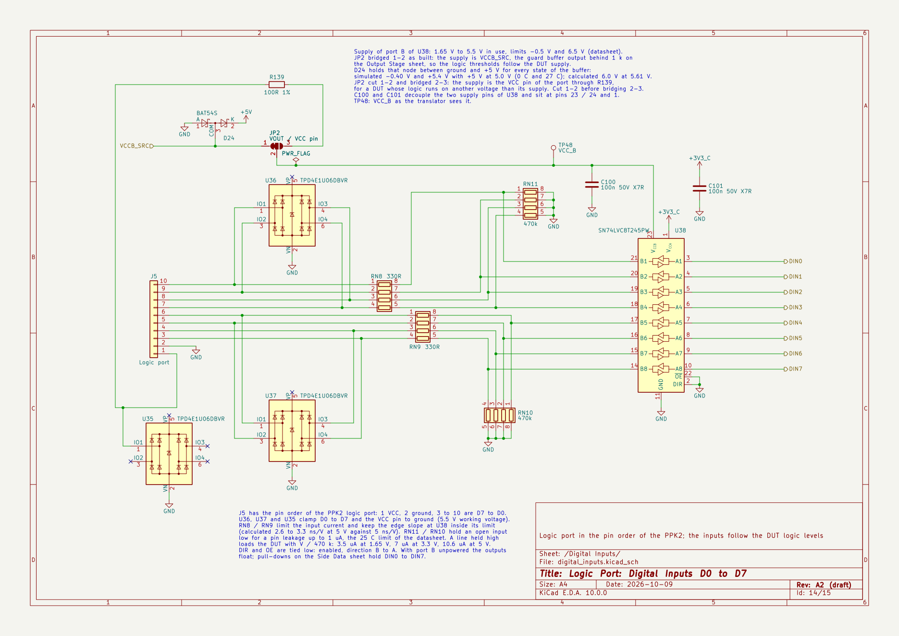

### 15. Monitors

Eight slow channels for supervision, read at 100 SPS by a 12-bit converter
(U40) on the SPI bus of the DAC, with the reference of the instrument
(section 4.2, decision D-80). Each channel has a divider or a series
resistor and 100 nF at its pin.

| Channel | Signal | Scale at the converter |
| --- | --- | --- |
| 0 | Ladder output, buffered (R140, R149) | × 0.4545 |
| 1 | VIN behind the fuse (R141, R150) | × 1/44, for −20 V to +20 V |
| 2 | 5 V rail (R142, R151), with the source tag (R143) | × 0.4545 on USB-C, × 0.2524 on the module input |
| 3, 4 | CC1, CC2 | × 1 behind 10 kΩ |
| 5 | Temperature sensor U39, at the linear regulator | × 1 behind 1 kΩ |
| 6 | `+12V_A` (R147, R152) | × 0.1754 |
| 7 | `-4V_A` against the reference (R148, R153) | 0.333 × V + 1.667 V |

The scale factors are calculated from the nominal resistor values. Channel 2
also tells which input supplies the rail: the status output of the input
multiplexer switches R143 into the divider while the module input
supplies, and firmware separates the two bands at 1.67 V (calculated). On
channel 1 one count is 27 mV of VIN, and a reversed supply reads below
0.13 V (calculated). No channel reads a 3.3 V rail.

Firmware converts every channel at 100 SPS, because a faster scan loads
the dividers of channels 0, 2 and 7: 0.97 count of error at 100 SPS and
4.9 counts at 1 kSPS (calculated). There is one exception: in source mode
with the output on, channel 0 is also read as often as the reaction of
0.5 ms to 5.3 V on VOUT asks, and those readings serve that comparison
alone (rule F-10).

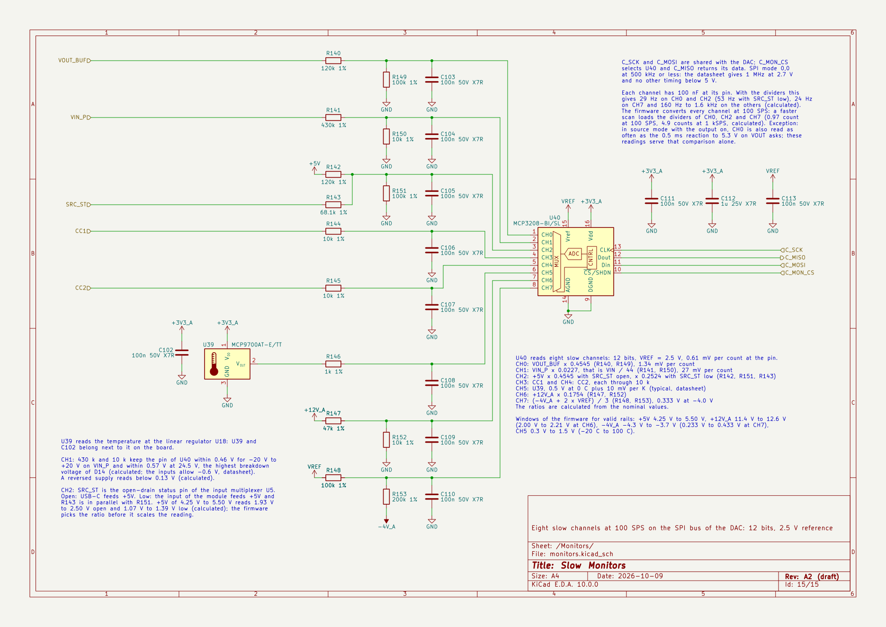

## Board

Outline 150 mm × 100 mm, four copper layers, four M3 holes, 425 footprints,
all on the top side. The board came about in two steps.

- Draft A2 was placed by a script inside the areas of its functional blocks
  and routed by an autorouter: 956 of 984 connections, 28 open, 25 of them
  breaking a function. That board did not work as drawn.
- On 2026-10-10 the layout was reviewed. The open connections were closed
  and the copper that an autorouter does not draw was drawn: the pours of
  the 1 A path, the guard, the Kelvin lines, the copper of the converters,
  the 5 V rail and the ground fills. The work was done with scripts on the
  board file, block by block against the rules of section 10 of the
  specification, each block checked by an independent check that calculated
  every rule again. A final review by rule group followed, then a repair
  round for the leakage paths into the measured node that it found. 35 of
  the 425 footprints moved or turned, 33 of them by 2.75 mm or less; no part
  was added or removed.

What the board rests on: it is drawn, and its figures are calculated from
the drawn copper. Nothing is built and nothing is measured, every part is a
candidate, and nobody has opened the board in the KiCad editor and looked at
it as a person would before ordering boards.

The figures can be calculated again: the package in
[`tools/board`](../../tools/board/README.md) reads a dump of the board file
and gives the resistance of the 1 A path in squares and milliohms, the
lengths of the Kelvin pairs, the surface leakage into the measured node and
the count of sense and guarded nets without a via. On the board in the
repository it gives the figures of this guide. The scripts that drew the
layout and the files of the simulations are not in the repository.

### Renderings

The two views below are renderings from the board file, with the Pico 2 on
its sockets. They are not photographs: no board has been built. KiCad has
no 3D model of the lever terminal block, so the views show its pads only,
and the cover of the shield can is not drawn. The text on the silkscreen at
the bottom edge reads "Open Power Profiler - Carrier Board rev A2 draft".


In the top view the gold line around the front end is the guard: the solder
mask is open over it, so the rendering shows the plated copper. It runs
inside the dashed frame of the shield can, around the amplifier, the
multiplexer and the shunts, and leaves the can at the lower right toward
the 0.1 Ω shunt. The lighter green areas at the lower edge and at the right
are the pours of the 1 A path.


### Placement

The areas of the sixteen blocks, as drawn on the `Dwgs.User` layer. The back
of the instrument is the left edge: the Raspberry Pi Pico 2 lies along the
top edge with its USB connector at the back, and the USB-C power connector
is below it. The front is the right edge: the logic port, then the two DUT
connectors, in the pin order of the PPK2. The switching converters are on
the left. The front end is on the right, under the frame of the shield can,
with the 1 A branch of the ladder between the can and the terminal block.
The placement is that of the script; the review moved 35 parts inside
their blocks, the farthest being the test point of VOUT (11.2 mm, onto the
VOUT pour) and the suppressor of VOUT (8.6 mm).


### Copper Layers

The four copper layers, each with its caption: the top layer `F.Cu` in red,
the ground plane `In1.Cu` in green, the second inner layer `In2.Cu` in
orange and the bottom layer `B.Cu` in blue. Each layer is drawn in one
color, so a pour and a ground fill differ only by their outlines.

- Top: all parts, the pours of the 1 A path along the lower edge and up the
  right side, the sense lines and the guard inside the dashed frame of the
  shield can. 3.76 m of track.
- Inner layer 1: the ground plane, one piece of 14205 mm² with no track on
  the layer. The white dots are the clearances of vias and pins; where the
  clearances of a via group merge, the plane has an opening, up to
  4.7 mm × 2.3 mm under the linear regulator.
- Inner layer 2: the 5 V rail as a pour of 1623 mm² in three pieces, the
  trunks of the other rails, 2.84 m of track in all, and a ground fill of
  10891 mm² in the space between, which the tracks cut into 80 pieces.
- Bottom: crossings, the second layer of the 1 A path under the supply
  band and under the linear regulator, 1.79 m of track, and a ground fill
  of 12108 mm².

The fills are stitched to the plane with 41 added vias.


| Item | Autorouted board | After the layout review |
| --- | --- | --- |
| Connections | 956 of 984, 28 open | 984 of 984, none open |
| Design rules check | 0 violations, 28 unconnected items | 0 violations, 0 unconnected pads, 0 footprint errors, 0 differences between board and schematic, against a stricter rule file |
| Tracks | 7.83 m in 3228 segments | 8.38 m in 3716 segments |
| Vias | 499, 26 of them 0.8/0.4 mm | 694: 594 of 0.6/0.3 mm, 100 of 0.8/0.4 mm; 336 on ground |
| Copper zones | 1, the ground plane | 42 |
| 5 V rail | Tracks of 0.4 mm | A pour on the second inner layer |
| Ground fills | None | Second inner layer and bottom |
| Reference texts hidden on the silkscreen | 115 | 123 |

The [rule file](../kicad/power-profiler-carrier.kicad_dru) was rewritten in
the review and is stricter than the one the autorouted board passed; the
five checks that the project ignores are the same as before. 1069 tracks
were widened toward the width of their net class where the copper around
them left room. The share of the track length at the class width or wider
is 62 % for the rails (0.4 mm), 71 % for the gate drives (0.3 mm), 34 % for
the power input nets (1.0 mm) and 100 % for the sense nets (0.2 mm).

### Front End

The top layer under the shield can, enlarged: copper in red, openings of
the solder mask in pink. Every pad is pink, and so is the guard where its
mask is open.

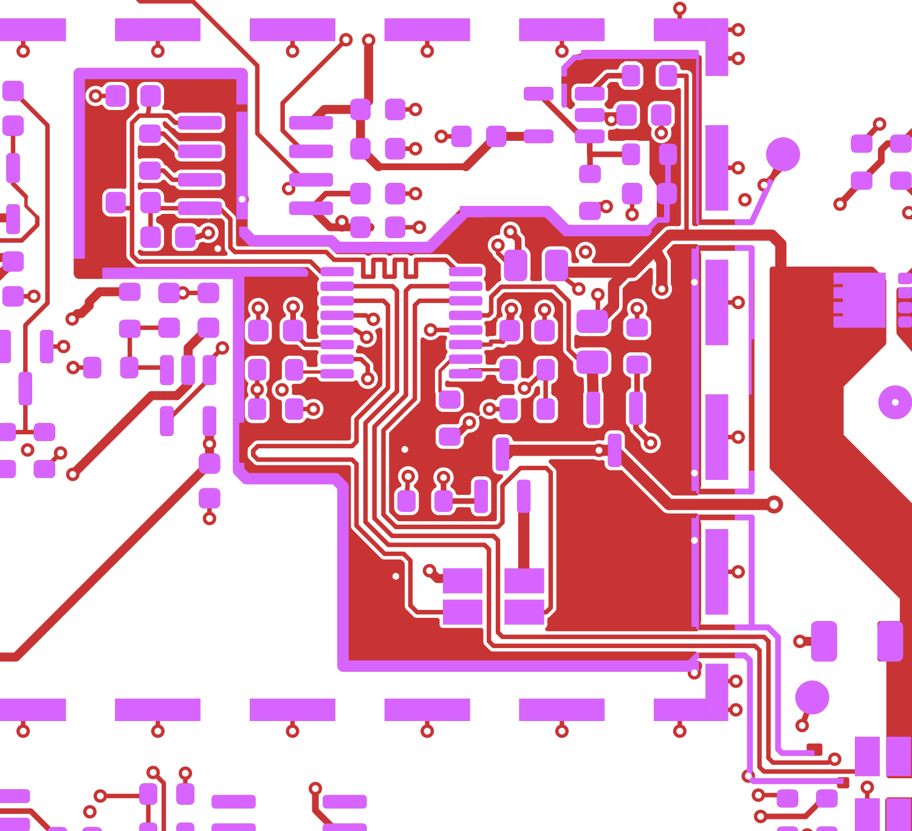

What to find in it:

- The rows of pink rectangles at the top and at the bottom and the column
  at the right are the lands of the can frame; the column is the east wall.
  All 32 lands have a ground via within 1.5 mm.
- The part in the middle with two rows of eight pins is the Kelvin
  multiplexer U24. Above it to the left is the amplifier U27, above it to
  the right the buffer U25, and the four-pad land at the bottom is the 1 Ω
  shunt R107.
- The pink line along the edge of the large red area is the guard ring, the
  buffered copy of the ladder output. The red area inside it is the guard
  pour, 227 mm² under solder mask. The ring is not closed on this layer: it
  is three arcs, cut where the measured node itself leaves through the wall
  (the ladder output, the supply node, the pair of range 3), with a guard
  track on both sides of each exit. The arcs are joined through 11 vias
  on the other layers.
- The solder mask is open over 160 mm of the 190 mm of guard track (84 %).
  It stays closed at the six wall crossings and between pads, and no bare
  guard lies within 0.3 mm of a land of the can. In the can 109 mm of the
  guard track is 0.5 mm wide, 24 mm is 0.25 mm and 7 mm is 0.15 mm.
- The lines that fan out below the multiplexer are the Kelvin lines to the
  shunts. The pair of range 3 runs down, along the lower edge and out
  through the wall at the lower right, with guard on both sides as far as
  the 0.1 Ω shunt below the picture: 46.3 mm and 45.4 mm, side by side at
  0.2 mm over 83 % of the run. The pair of range 2 is 28.4 mm and 27.8 mm,
  equal in length but not side by side. The pair from the multiplexer to the
  amplifier, with the small meander between the two parts, is 17.0 mm and
  17.9 mm, side by side over about 4 mm.
- Inside the ring there is no ground pour, but 29 pads of 10 other nets:
  the supply, address and enable pins of the multiplexer and their parts.
- Right of the east wall the large red areas are the pours of the ladder
  output and of VOUT at the output switch. No ground copper lies within
  1.0 mm of them.

Of the 11 sense and guarded nets, 10 are on the top layer without a via.
The eleventh, the high-side sense line of the 0.1 Ω shunt, has two vias and
1.9 mm on the second inner layer at the shunt: with the pin order of the
multiplexer and the pad order of the four-terminal shunt the two lines of
that pair cross once, and no rotation of a part changes that. The taps of
the shunts of ranges 0 and 1 run through a via each and 12 mm and 10 mm on
the second inner layer, for the same reason. The ladder output has no track
on the bottom layer and 41 mm on the second inner layer.

The surface leakage into the measured node is 5.1 nA, calculated from the
drawn copper, against the budget of 10 nA: 4.46 nA on the top layer (0.73 nA
inside the can, 3.73 nA outside) and 0.67 nA on the bottom layer. The
calculation uses the assumptions of section 10.3 of the specification:
10¹¹ Ω per square on a clean surface, 5 V to ground and logic, 7 V to the
+12 V rail and to gate nodes, 9 V to the −4 V rail. Solder mask,
cleanliness and humidity are not modeled, and nothing is measured. Before
the repair round the same calculation gave about 20 nA. Almost all of the
rest is pad pitch: gate beside source in a transistor package, the poles of
the two DUT connectors, neighbor pins of the multiplexer and of the buffer.
An estimate from before the board was drawn gave 1.3 nA to 2.9 nA; section
10.3 now carries the figure calculated from the board.

### 1 A Path

The top layer from the linear regulator at the bottom left, along the
supply band at the lower edge, to the shunt branch, the output switch and
the terminal block at the right. The dashed frame is the shield can.

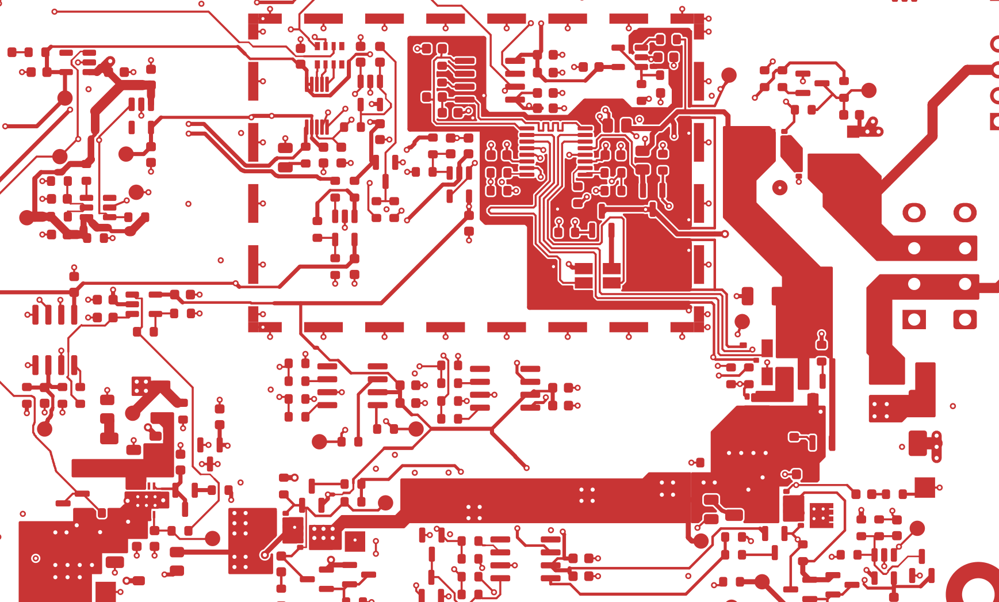

The path is pours on the top layer. The supply band, 38 mm from the source
pair to the shunt branch, is doubled on the bottom layer through groups of
four to eight vias of 0.8/0.4 mm, which show as white dots in the band. The
linear regulator stands on an island of output copper, 102 mm² on top and
291 mm² on the bottom, joined by 22 vias. Two pieces of the path run on the
bottom layer because parts stand in the way on top: from the regulator
output to the source pair, and from the fuse to the ampere pair.

Section 10.4 of the specification allows 30 squares of 35 µm copper in
either mode. Calculated from the drawn copper, at 40 °C, copper only
(transistors, shunt and fuse are not counted):

| Mode | Autorouted board | After the layout review |
| --- | --- | --- |
| Source mode, regulator output to the VOUT terminal | 397 squares, about 211 mΩ | 19.5 squares, 10.4 mΩ |
| Ampere mode, VIN terminal to the VOUT terminal | 217 squares, about 116 mΩ | 23.3 squares, 12.3 mΩ |

| Piece | Squares |
| --- | --- |
| Source mode: output of the linear regulator to the source pair | 2.2 |
| Source mode: common source of the source pair | 0.4 |
| Source mode: supply node to the transistor of range 3 | 6.5 |
| Ampere mode: VIN terminal to the fuse | 3.5 |
| Ampere mode: fuse to the ampere pair | 8.0 |
| Ampere mode: common source of the ampere pair | 0.3 |
| Ampere mode: supply node | 1.0 |
| Both: transistor of range 3 to the 0.1 Ω shunt | 1.3 |
| Both: ladder output from the shunt to the output switch | 5.6 |
| Both: common source of the output pair | 0.6 |
| Both: VOUT to the terminal | 2.9 |

Each piece is rounded by itself: the pieces of ampere mode add to
23.25 squares, which the table above gives as 23.3. The resistances are
calculated on a grid of 0.1 mm; on a grid of 0.05 mm the two totals read
about 2 % higher, 19.9 and 23.8 squares. A via counts 1.7 squares per layer
step, which errs high. The method and its limits are in the guide of
[`tools/board`](../../tools/board/README.md).

The links from the terminal block to the pin header J3 are tracks of
1.0 mm: a DUT on the header sees about 21 mΩ more than one on the terminal
block (calculated: 10.2 mΩ in VOUT and 11.2 mΩ in VIN).

### Converters, Rails and Reference

These blocks have no detail picture; they are in the left half of the copper
picture. All figures are calculated from the drawn copper, against the
limits of section 10.5 of the specification where it gives one.

- Pre-regulator: both switch nodes are pours without a via. The feedback
  line is 16.4 mm (limit 20 mm), and the copper from the output capacitors
  to the bead is 7.1 mΩ (limit 15 mΩ).
- Boost converter: its output reaches the filter resistor of the +12 V
  regulator as one track of 28.8 mm (25 mm or more is asked).
- 5 V rail: from the bulk capacitor to the input capacitors of the
  pre-regulator 2.7 mΩ and 3.0 mΩ, to the input capacitor of the boost
  converter 3.6 mΩ. The review worked to targets of 10 mΩ and 25 mΩ; the
  specification gives no figure for the rail.
- Reference: ten branches that share no track beyond the star copper at
  the output pin.

What these blocks do not keep is in the list of open items below.

### Deviations Recorded as Decisions

The drawn board differs in seven points from what section 10 of the
specification asked before the review. The owner accepted all seven on
2026-10-10. They are decisions D-87 to D-93 of the
[decision log](../../docs/specification.md#15-decision-log), which now ends
at D-93, and section 10 of the specification describes the board as drawn.

| Decision | What it records |
| --- | --- |
| D-87 | The rule file states every spacing: the exemption near pins on the top layer only, 0.5 mm of the measured node on the bottom layer too, VIN 1.0 mm on the outer layers and 0.5 mm on the inner layers, fills and pours 1.0 mm from the measured node, the guard 0.2 mm beside it |
| D-88 | The high-side sense line of the 0.1 Ω shunt keeps two vias and 1.9 mm on the second inner layer |
| D-89 | Kelvin routing: the pair of range 3 side by side, the pair of range 2 and the pair to the amplifier equal in length within 1 mm, the taps of ranges 0 and 1 through one via each |
| D-90 | The guard is one piece of copper, open on the top layer at the three exits of the measured node and joined on the other layers, with guard pours on the bottom layer |
| D-91 | The supply, address and enable pins of the multiplexer and their parts stand inside the guard; no ground pour inside it |
| D-92 | The 1 A path is judged by its resistance, 30 squares or less in either mode; two pieces run on the bottom layer |
| D-93 | The island of output copper under the linear regulator: 291 mm² on the bottom, 22 vias, 102 mm² on top; its temperature rise at full dissipation is an open check of section 16, read on the first board |

The [hardware README](../README.md) describes each point on the board.

### Still Open on the Board

Not done in the review, because each needs parts moved or another
footprint:

- The loops of the converter capacitors close on the top layer over more
  than the 5 mm of section 10.5: 8.2 mm to 17.1 mm at the five capacitors
  of the pre-regulator, whose ground pads face away from the converter
  (each has a ground via 0.15 mm to 0.20 mm from its pad), and 6.8 mm and
  10.3 mm at the boost converter. At the charge pump the ground sides of
  two capacitors are 3.4 mm and 4.4 mm from the pin (limit 2 mm).
- The inductor of the pre-regulator is 4.5 mm from its second pair of
  switch pins (limit 3 mm).
- The temperature sensor U39 is 5.1 mm pad to pad from the linear regulator
  (limit 5 mm).
- The suppressor of VOUT, D21, has 93 mm² of cathode copper (1 cm² is
  asked) and stands 8.6 mm from the VOUT pole.
- The clamps Q10 and Q11 have 21 mm² and 28 mm² of supply copper within
  5 mm of their drains (1 cm² is asked).
- The drain pad of the ampere-pair transistor on the VIN side lies in no
  top pour: the current enters through four vias in the pad.
- The ground plane has 787 mm² of openings in all (593 mm² on the
  autorouted board); a via pitch of 1.5 mm in the groups would keep webs of
  plane.
- The branches of the reference should leave the output pad itself; the
  star copper there is still common to several branches, 2.2 mΩ between the
  branch of the ADC and the pedestal divider.
- The 5 V pour is in three pieces, and the three 3.3 V regulators hang on
  two single vias.
- The +12 V regulator is 22 mm, courtyard to courtyard, from the diode and
  the capacitor of the boost converter; 25 mm is asked and is kept from
  center to center only.
- Vias stand in or at pads that get solder paste: 4 holes and 14 rings,
  and via holes in the drain pads of two path transistors.

Not touched by the review, as on the autorouted board:

- 32 of the 40 signal test points have no probe ground within 5 mm
  (section 10.7).
- The net names of the test points and the function of the two jumpers are
  not on the silkscreen (section 10.2), 123 reference texts are hidden, and
  there is no frame for a hand-written serial number.
- The three acquisition lines enter the can at three places on two layers
  instead of one opening.
- 21 nets cross the wall of the can below the ground plane.
- The two resistor pairs of the set-point path do not stand side by side
  (section 10.1).

What comes next for the board, in order: a person opens the board in KiCad
and reviews it; the open items that need parts moved are a placement change
with a local redraw; then the silkscreen and test point items; the
temperature rise of the linear regulator (D-93) is read on the first board.
The [hardware README](../README.md) has the whole plan of the hardware.

## Making the Pictures Again

Run from [`../kicad/`](../kicad/) after a change, with KiCad 10:

```sh
kicad-cli sch export pdf --output ../doc/schematic.pdf power-profiler-carrier.kicad_sch
kicad-cli pcb render --output ../doc/images/board-3d.jpg --width 1800 --height 1170 --rotate "-42,0,-25" --perspective --zoom 0.92 --quality high --background opaque power-profiler-carrier.kicad_pcb
kicad-cli pcb render --output ../doc/images/board-top.jpg --width 1800 --height 1420 --zoom 1.22 --quality high --background opaque power-profiler-carrier.kicad_pcb
kicad-cli pcb export svg --output board-placement.svg --layers F.SilkS,F.Fab,Edge.Cuts,Dwgs.User,F.CrtYd --page-size-mode 2 --exclude-drawing-sheet --mode-single power-profiler-carrier.kicad_pcb
kicad-cli pcb export svg --output board-top.svg --layers F.Cu,Edge.Cuts --page-size-mode 2 --exclude-drawing-sheet --mode-single power-profiler-carrier.kicad_pcb
kicad-cli pcb export svg --output board-front-end.svg --layers F.Cu,F.Mask,Edge.Cuts --page-size-mode 2 --exclude-drawing-sheet --mode-single power-profiler-carrier.kicad_pcb
```

The page images are the pages of the PDF at 160 dpi, for example from
`pdftoppm -r 160 -png`, named after their sheets. The placement drawing is
the exported SVG converted to PNG and cropped to the board. The bill of
materials, [`bom.csv`](bom.csv), is exported with the command given in the
[hardware README](../README.md). The pictures here were plotted with KiCad
set to English: on the root page the label "File:" of every sheet follows
the language of KiCad.

The three copper pictures are made from such plots, converted to PNG:

- `board-copper.png` is four plots, one for each of `F.Cu`, `In1.Cu`,
  `In2.Cu` and `B.Cu`, each with `Edge.Cuts`: the command of
  `board-top.svg` with the other layer names. Each is cut to the outline of
  the board, and the four are set two by two, each under its caption.
- `board-front-end.png` is the plot of `F.Cu`, `F.Mask` and `Edge.Cuts`,
  cut to x 136 mm to 178 mm and y 86.5 mm to 126 mm in the coordinates of
  the board editor.
- `board-1a-path.png` is the plot of `F.Cu` and `Edge.Cuts`, cut to x 98 mm
  to 199.5 mm and y 86 mm to 149 mm.

The figures of the [Board](#board) part do not come from these commands.
The resistance of the 1 A path, the lengths of the pairs, the surface
leakage and the count of nets without a via are calculated from a dump of
the board file by the package in
[`tools/board`](../../tools/board/README.md), which says how to install it,
make the dump and run it. After a change of the board they have to be
calculated again before the text is changed.
