# Simulation Results: Analog Rails and Rail Monitor

Everything on this page is a simulation result. Nothing here is measured on
hardware. The page is written by `circuit-sim report` from the result files
beside it; do not edit it by hand.

## `analog_rails/boost-detector`

**Boost converter with the voltage detector of decision D-84 fitted at U9.**

A detector of 3.08 V holds the converter off until the 5 V rail has stood for a
while. The position U9 is empty on the board. Here it carries an 803-type
detector: its output holds the enable pin of the converter low until the rail
has been above 3.08 V for the time-out of the part, and pulls it low again 20 us
after the rail has fallen below. The converter then starts on a rail that
already stands at 5 V, with +13V5 at 4.6 V. The first attempt is taken cycle by
cycle on the three limits of the input of the controller module, on the corner
that is kindest to the source, and on the USB-C input. Two runs of 1.1 s with
the averaged model and the real time-out of 0.24 s then show what follows a
failed attempt, with 1 mA and with 0.1 mA drawn from +13V5 in between.

Answers: section 4.1 (the detector is the remedy if the converter does not start
cleanly), requirement R-14, decision D-84, the risk register.

| Figure | Simulated | Specification | Limits | Verdict | Source |
| --- | --- | --- | --- | --- | --- |
| First attempt, source limited to 0.67 A: lowest 5 V rail | 2.928 V | | at least 3.13 V | **FAIL** | datasheet of the detector: it stops the converter at 3.04 V to 3.13 V; a rail that stays above 3.13 V is a start in one go |
| First attempt, source limited to 0.67 A: +13V5 when the detector stops the converter | 10.21 V | | | | |
| First attempt, source limited to 0.67 A: time from the enable to the stop | 177.5 µs | | | | |
| First attempt, source limited to 0.76 A: lowest 5 V rail | 2.976 V | | at least 3.13 V | **FAIL** | datasheet of the detector: it stops the converter at 3.04 V to 3.13 V; a rail that stays above 3.13 V is a start in one go |
| First attempt, source limited to 0.76 A: +13V5 when the detector stops the converter | 10.73 V | | | | |
| First attempt, source limited to 0.76 A: time from the enable to the stop | 203.5 µs | | | | |
| First attempt, source limited to 0.85 A: lowest 5 V rail | 3.03 V | | at least 3.13 V | **FAIL** | datasheet of the detector: it stops the converter at 3.04 V to 3.13 V; a rail that stays above 3.13 V is a start in one go |
| First attempt, source limited to 0.85 A: +13V5 when the detector stops the converter | 11.48 V | | | | |
| First attempt, source limited to 0.85 A: time from the enable to the stop | 249 µs | | | | |
| First attempt, 0.85 A, gentle amplifier and least current limit: lowest 5 V rail | 3.62 V | | at least 3.13 V | pass | datasheet of the detector: it stops the converter at 3.04 V to 3.13 V; a rail that stays above 3.13 V is a start in one go |
| First attempt, 0.85 A, gentle amplifier and least current limit: +13V5 at the end of the run | 13.98 V | | | | |
| First attempt, source limited to 2.0 A: lowest 5 V rail | 4.586 V | | at least 3.13 V | pass | datasheet of the detector: it stops the converter at 3.04 V to 3.13 V; a rail that stays above 3.13 V is a start in one go |
| First attempt, source limited to 2.0 A: +13V5 at the end of the run | 13.66 V | | | | |
| First attempt, 0.76 A: lowest 5 V rail, averaged model | 3.006 V | 2.976 V (+1.01 %) | 2.827 V to 3.124 V | pass | the cycle-by-cycle model in the same circuit (check of the averaged model) |
| 0.76 A, a detector with a time-out of 3 ms: attempts until +13V5 is charged | 2 | | | | |
| 0.76 A, a detector with a time-out of 3 ms: +13V5 above 13.0 V after the first enable | 3.379 ms | | | | |
| 0.76 A, 1 mA on +13V5: number of starts of the converter in 1.1 s | 4 | | at most 1 | **FAIL** | decision D-84: the detector is the remedy for a start that hangs or repeats |
| 0.76 A, 1 mA on +13V5: +13V5 above 13.0 V after the source starts | nan s | | at most 460 ms | **FAIL** | section 3, step 8: PWR_GOOD at the latest 0.46 s after power |
| 0.76 A, 1 mA on +13V5: +13V5 just before the second start | 4.817 V | | | | |
| 0.76 A, 0.1 mA on +13V5: number of starts of the converter in 1.1 s | 2 | | at most 1 | **FAIL** | decision D-84: the detector is the remedy for a start that hangs or repeats |
| 0.76 A, 0.1 mA on +13V5: +13V5 above 13.0 V after the source starts | 485.6 ms | | at most 460 ms | **FAIL** | section 3, step 8: PWR_GOOD at the latest 0.46 s after power |
| 0.76 A, 0.1 mA on +13V5: +13V5 just before the second start | 8.867 V | | | | |

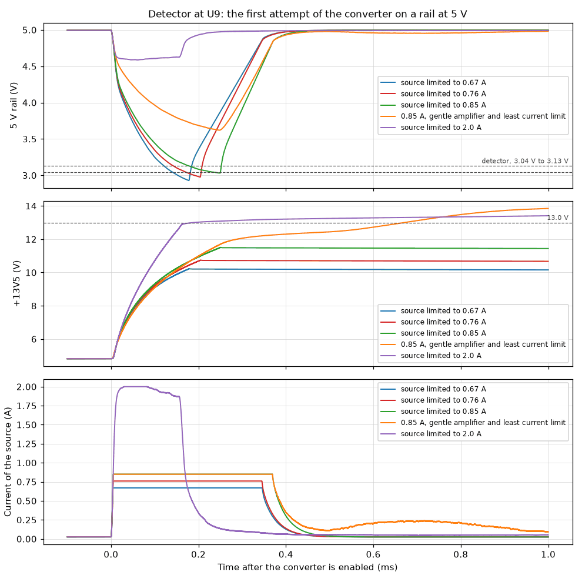

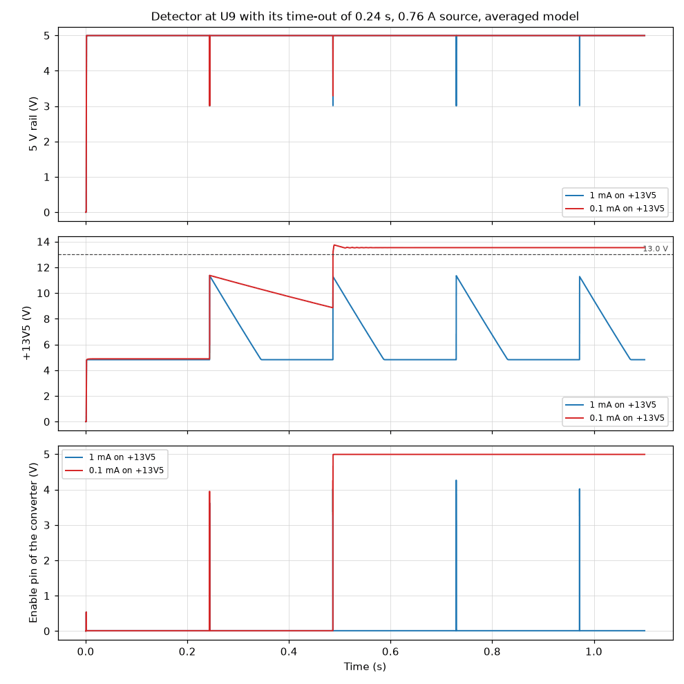

Notes:

- The detector carries the figures of the APX803S-31: 3.08 V, 20 us to answer,
  0.24 s of time-out. The schematic names the position "803 type, 3.08 V"
  without a part number.
- The source is a voltage behind 0.2 ohm with a flat current limit and no path
  back; a limiter that folds back or switches off while it limits makes the
  attempt harder, not easier.
- With the detector the converter starts on a rail at 5 V. There it takes more
  than twice what the input of the controller module gives, the capacitors of
  the rail make up the difference, and the rail reaches the detector before
  +13V5 is charged. The detector then stops the converter for 0.24 s. Whether a
  later attempt ends depends on what +13V5 keeps in between: with 1 mA drawn
  from it nothing is left and every attempt is the first one again.
- The cycle-by-cycle runs wait 3 ms where the part waits 0.24 s, and they go on
  to the second attempt of such a detector: in 3 ms +13V5 keeps its charge and
  the second attempt ends. A detector with a short time-out, or anything else
  that keeps +13V5 from emptying between two attempts, charges the rail in two
  steps; the part of the schematic does not.
- The load on +13V5 while the detector waits is an assumption: 1 mA for the
  control pin of the source regulator, whose datasheet gives it only under load,
  beside the 0.09 mA of the feedback divider, which is in the netlist.
- The converter model takes its current limit from the typical curve of the
  datasheet and holds the full current until the output is within 1 V. The case
  "gentle amplifier and least current limit" takes both the other way and is the
  kindest corner for the source that the datasheet allows.
- The ceramic capacitors are linear in every run: those of +13V5 take the value
  that needs the energy of the real charge from 4.6 V to 13.5 V, those of the 5
  V rail the value they have at 5 V, which is less than they have while the rail
  is lower.

Models. written here: B0530W, LMR62014, LMR62014_AVG, L_74438357100,
PWRIN_WCAP_47U, RAILS_803.

Decks: [boost-detector.first-0p76.cir](boost-detector.first-0p76.cir),
[boost-detector.long-1ma.cir](boost-detector.long-1ma.cir).

## `analog_rails/boost-output`

**Boost converter: +13V5 with tolerances, against load, and its ripple.**

The boost converter on a 5 V rail that is up, with the loads of +13V5. The level
of +13V5 is read from the averaged model: with typical parts, with the feedback
voltage and the 1 % divider at their limits, at 10 mA and at 40 mA of load, and
with the 5 V rail at 4.25 V and at 5.5 V. The ripple is read from the
cycle-by-cycle model at the same two loads, at the output of the converter,
behind the filter R37 with C29 at the input of the +12V_A regulator, and on the
5 V rail; then once more with a 0 ohm part in the place of R37.

Answers: section 3 (analog rails, 13.0 V to 14.1 V), decision D-51.

| Figure | Simulated | Specification | Limits | Verdict | Source |
| --- | --- | --- | --- | --- | --- |
| +13V5, typical parts, 10 mA | 13.53 V | 13.53 V (+0.00 %) | 13.46 V to 13.6 V | pass | section 3: 13.5 V; 1.23 V x (1 + R32 / R33) |
| +13V5, feedback voltage and divider at the limits that make it highest | 14.06 V | | 13 V to 14.1 V | pass | section 3: 13.0 V to 14.1 V |
| +13V5, feedback voltage and divider at the limits that make it lowest, 40 mA | 13.02 V | | 13 V to 14.1 V | pass | section 3: 13.0 V to 14.1 V |
| +13V5: change from 10 mA to 40 mA | -352.7 µV | | | | |
| +13V5 with the 5 V rail at 4.25 V, 40 mA | 13.53 V | | 13 V to 14.1 V | pass | section 3: 13.0 V to 14.1 V; D-49: the rail may stand at 4.25 V |
| +13V5 with the 5 V rail at 5.5 V, 10 mA | 13.53 V | | 13 V to 14.1 V | pass | section 3: 13.0 V to 14.1 V |
| Current from the 5 V rail at 10 mA of load | 29.86 mA | | | | |
| Current from the 5 V rail at 40 mA of load | 113.6 mA | | | | |
| Ripple at the output of the converter within two switching periods, peak to peak, 10 mA | 879.4 µV | | | | |
| Slow movement at the output of the converter over 0.25 ms, peak to peak, 10 mA | 1.352 mV | | | | |
| Ripple behind R37 with C29 within two switching periods, peak to peak, 10 mA | 39.82 µV | | | | |
| Slow movement behind R37 with C29 over 0.25 ms, peak to peak, 10 mA | 1.217 mV | | | | |
| Ripple on the 5 V rail within two switching periods, peak to peak, 10 mA | 867.9 µV | | | | |
| Slow movement on the 5 V rail over 0.25 ms, peak to peak, 10 mA | 1.108 mV | | | | |
| Ripple at the input of the +12V_A regulator with R37 at 0 ohm, 10 mA | 451.8 µV | | | | |
| That ripple behind the regulator by its 79 dB, R37 as drawn, 10 mA | 4.468 nV | | | | |
| The same with R37 at 0 ohm, 10 mA | 50.69 nV | | | | |
| Highest inductor current in regulation, 10 mA | 121.7 mA | | at most 3 A | pass | datasheet of the inductor: 10 % of the inductance lost at 3 A |
| Ripple at the output of the converter within two switching periods, peak to peak, 40 mA | 2.542 mV | | | | |
| Slow movement at the output of the converter over 0.25 ms, peak to peak, 40 mA | 5.135 mV | | | | |
| Ripple behind R37 with C29 within two switching periods, peak to peak, 40 mA | 129.2 µV | | | | |
| Slow movement behind R37 with C29 over 0.25 ms, peak to peak, 40 mA | 4.547 mV | | | | |
| Ripple on the 5 V rail within two switching periods, peak to peak, 40 mA | 1.144 mV | | | | |
| Slow movement on the 5 V rail over 0.25 ms, peak to peak, 40 mA | 3.597 mV | | | | |
| Ripple at the input of the +12V_A regulator with R37 at 0 ohm, 40 mA | 1.319 mV | | | | |
| That ripple behind the regulator by its 79 dB, R37 as drawn, 40 mA | 14.5 nV | | | | |
| The same with R37 at 0 ohm, 40 mA | 148 nV | | | | |
| Highest inductor current in regulation, 40 mA | 241.5 mA | | at most 3 A | pass | datasheet of the inductor: 10 % of the inductance lost at 3 A |

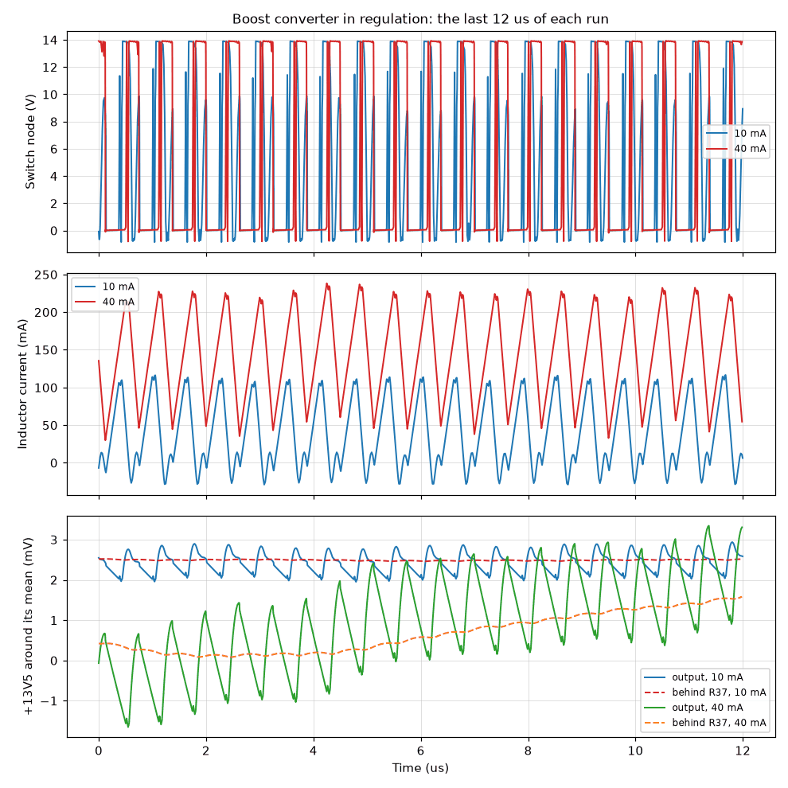

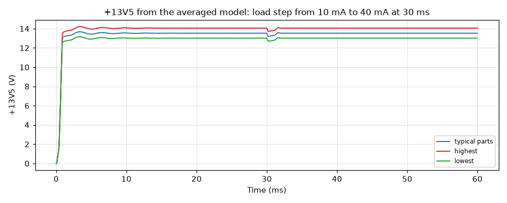

Notes:

- The level of +13V5 is that of the feedback divider and of the feedback
  voltage; the models add nothing to it. The response to the load step and the
  pattern of the pulses belong to an error amplifier that is an assumption: the
  compensation of the part is not published.
- At these loads the converter works with a discontinuous inductor current. The
  ripple figures hold the capacitors at the capacitance they have at their
  voltage and no series resistance or inductance of the capacitors or of the
  board: the spikes at the edges of the switch node are not in them.
- Beside the ripple of a cycle the output of the model moves by a few millivolts
  over a quarter of a millisecond. That slow movement belongs to the assumed
  error amplifier and is not a figure of the part; it is listed so that the next
  bench can take the worse of the two.
- With a 0 ohm part in the place of R37 the ripple of the converter output
  stands at the input of the +12V_A regulator. Behind the regulator both cases
  are nanovolts by the 79 dB that its datasheet gives at 1 MHz: by conduction
  the choice of R37 does not matter. A bead cannot be simulated without a part
  number. What decides in practice is not in a circuit simulation: the edges of
  the switch node, which pass a regulator through its pass element and the
  board.
- The load is a current sink behind R37: 10 mA stands for the +12V_A regulator
  with its loads and the control pin of the source regulator at rest, 40 mA for
  the same with 30 mA into that pin (datasheet limit at 1.1 A of output).

Models. written here: B0530W, LMR62014, LMR62014_AVG, L_74438357100,
PWRIN_WCAP_47U, RAILS_MLCC.

Decks: [boost-output.level-typical.cir](boost-output.level-typical.cir),
[boost-output.ripple-light.cir](boost-output.ripple-light.cir).

## `analog_rails/boost-start`

**Boost converter as drawn: its start on a source limited to 0.67 A to 0.85 A.**

The 5 V rail is brought up through a current limit and the converter starts by
itself. The circuit is the converter as drawn: the position of the voltage
detector U9 is empty and the enable pin is on the rail through R29. The
converter is taken cycle by cycle. The source is limited to 0.67 A, 0.76 A and
0.85 A, the span of the limiter on the input of the controller module, and to
2.0 A, the USB-C input. The rail carries its capacitors and the 25 mA of the
controller module. Three more runs on the 0.76 A source change one assumption
about the converter each: an error amplifier that lets go of the full current
earlier, the least current limit of the datasheet, and a converter that works
only from the 2.7 V at which its datasheet begins. A last run of a second with
the averaged model counts the starts.

Answers: section 4.1 (no lock-out, no soft start), section 16 and the risk
register (start on the data cable alone), decision D-51.

| Figure | Simulated | Specification | Limits | Verdict | Source |
| --- | --- | --- | --- | --- | --- |
| Source limited to 0.67 A: +13V5 above 12.2 V after the source starts | 1.294 ms | 3 ms (-56.85 %) | at most 4.5 ms | pass | section 3, step 2: charged about 3 ms after the start |
| Source limited to 0.67 A: time the source spends in its limit | 1.632 ms | | | | |
| Source limited to 0.67 A: level of the 5 V rail while the source is in its limit | 2.638 V | | | | |
| Source limited to 0.67 A: 5 V rail above 4.12 V after the source starts | 1.566 ms | | | | |
| Source limited to 0.67 A: lowest 5 V rail after it has passed 4.12 V | 4.12 V | | at least 4 V | pass | section 4.1: the supervisor trips at 3.83 V to 4.00 V; a rail that stays above 4.00 V is a start in one go (criterion of this bench) |
| Source limited to 0.67 A: highest inductor current | 709.8 mA | | at most 5.95 A | pass | datasheet of the inductor: 30 % of the inductance lost at 5.95 A (10 % at 3 A) |
| Source limited to 0.67 A: highest +13V5 | 13.65 V | | at most 20 V | pass | datasheet of the +12V_A regulator: input up to 20 V |
| Source limited to 0.76 A: +13V5 above 12.2 V after the source starts | 1.115 ms | 3 ms (-62.83 %) | at most 4.5 ms | pass | section 3, step 2: charged about 3 ms after the start |
| Source limited to 0.76 A: time the source spends in its limit | 1.385 ms | | | | |
| Source limited to 0.76 A: level of the 5 V rail while the source is in its limit | 2.738 V | | | | |
| Source limited to 0.76 A: 5 V rail above 4.12 V after the source starts | 1.334 ms | | | | |
| Source limited to 0.76 A: lowest 5 V rail after it has passed 4.12 V | 4.12 V | | at least 4 V | pass | section 4.1: the supervisor trips at 3.83 V to 4.00 V; a rail that stays above 4.00 V is a start in one go (criterion of this bench) |
| Source limited to 0.76 A: highest inductor current | 799.7 mA | | at most 5.95 A | pass | datasheet of the inductor: 30 % of the inductance lost at 5.95 A (10 % at 3 A) |
| Source limited to 0.76 A: highest +13V5 | 13.7 V | | at most 20 V | pass | datasheet of the +12V_A regulator: input up to 20 V |
| Source limited to 0.85 A: +13V5 above 12.2 V after the source starts | 980 µs | 3 ms (-67.33 %) | at most 4.5 ms | pass | section 3, step 2: charged about 3 ms after the start |
| Source limited to 0.85 A: time the source spends in its limit | 1.198 ms | | | | |
| Source limited to 0.85 A: level of the 5 V rail while the source is in its limit | 2.823 V | | | | |
| Source limited to 0.85 A: 5 V rail above 4.12 V after the source starts | 1.159 ms | | | | |
| Source limited to 0.85 A: lowest 5 V rail after it has passed 4.12 V | 4.12 V | | at least 4 V | pass | section 4.1: the supervisor trips at 3.83 V to 4.00 V; a rail that stays above 4.00 V is a start in one go (criterion of this bench) |
| Source limited to 0.85 A: highest inductor current | 885.5 mA | | at most 5.95 A | pass | datasheet of the inductor: 30 % of the inductance lost at 5.95 A (10 % at 3 A) |
| Source limited to 0.85 A: highest +13V5 | 13.71 V | | at most 20 V | pass | datasheet of the +12V_A regulator: input up to 20 V |
| Source limited to 2.0 A: +13V5 above 12.2 V after the source starts | 1.334 ms | 3 ms (-55.54 %) | at most 4.5 ms | pass | section 3, step 2: charged about 3 ms after the start |
| Source limited to 2.0 A: time the source spends in its limit | 0 s | | | | |
| Source limited to 2.0 A: 5 V rail above 4.12 V after the source starts | 1.428 ms | | | | |
| Source limited to 2.0 A: lowest 5 V rail after it has passed 4.12 V | 4.12 V | | at least 4 V | pass | section 4.1: the supervisor trips at 3.83 V to 4.00 V; a rail that stays above 4.00 V is a start in one go (criterion of this bench) |
| Source limited to 2.0 A: highest inductor current | 1.39 A | | at most 5.95 A | pass | datasheet of the inductor: 30 % of the inductance lost at 5.95 A (10 % at 3 A) |
| Source limited to 2.0 A: highest +13V5 | 13.67 V | | at most 20 V | pass | datasheet of the +12V_A regulator: input up to 20 V |
| 0.76 A, gentle amplifier: +13V5 above 12.2 V after the source starts | 1.217 ms | 3 ms (-59.42 %) | at most 4.5 ms | pass | section 3, step 2: charged about 3 ms after the start |
| 0.76 A, gentle amplifier: time the source spends in its limit | 1.253 ms | | | | |
| 0.76 A, gentle amplifier: level of the 5 V rail while the source is in its limit | 2.703 V | | | | |
| 0.76 A, gentle amplifier: lowest 5 V rail after it has passed 4.12 V | 4.12 V | | at least 4 V | pass | section 4.1: the supervisor trips at 3.83 V to 4.00 V |
| 0.76 A, least current limit of the datasheet: +13V5 above 12.2 V after the source starts | 1.044 ms | 3 ms (-65.19 %) | at most 4.5 ms | pass | section 3, step 2: charged about 3 ms after the start |
| 0.76 A, least current limit of the datasheet: time the source spends in its limit | 1.273 ms | | | | |
| 0.76 A, least current limit of the datasheet: level of the 5 V rail while the source is in its limit | 3.027 V | | | | |
| 0.76 A, least current limit of the datasheet: lowest 5 V rail after it has passed 4.12 V | 4.12 V | | at least 4 V | pass | section 4.1: the supervisor trips at 3.83 V to 4.00 V |
| 0.76 A, converter working from 2.7 V only: +13V5 above 12.2 V after the source starts | 1.212 ms | 3 ms (-59.58 %) | at most 4.5 ms | pass | section 3, step 2: charged about 3 ms after the start |
| 0.76 A, converter working from 2.7 V only: time the source spends in its limit | 1.483 ms | | | | |
| 0.76 A, converter working from 2.7 V only: level of the 5 V rail while the source is in its limit | 2.743 V | | | | |
| 0.76 A, converter working from 2.7 V only: lowest 5 V rail after it has passed 4.12 V | 4.12 V | | at least 4 V | pass | section 4.1: the supervisor trips at 3.83 V to 4.00 V |
| Source limited to 2.0 A: highest current of the source | 1.513 A | | 1.5 A to 2.5 A | pass | section 16: start current expected at 1.5 A to 2.5 A |
| Source limited to 2.0 A: time the source gives more than 1 A | 383.8 µs | | 150 µs to 200 µs | **FAIL** | section 16: expected for 0.15 ms to 0.2 ms |
| 0.76 A: +13V5 above 12.2 V after the source starts, averaged model | 1.005 ms | 1.115 ms (-9.84 %) | 947.7 µs to 1.282 ms | pass | the cycle-by-cycle model in the same circuit (check of the averaged model) |
| 0.76 A, averaged model: number of starts of the converter in the first second | 1 | | at most 1 | pass | section 16: a start that neither hangs nor repeats |
| 0.76 A, averaged model: +13V5 at the end of the first second | 13.53 V | | 13 V to 14.1 V | pass | section 3: 13.0 V to 14.1 V |

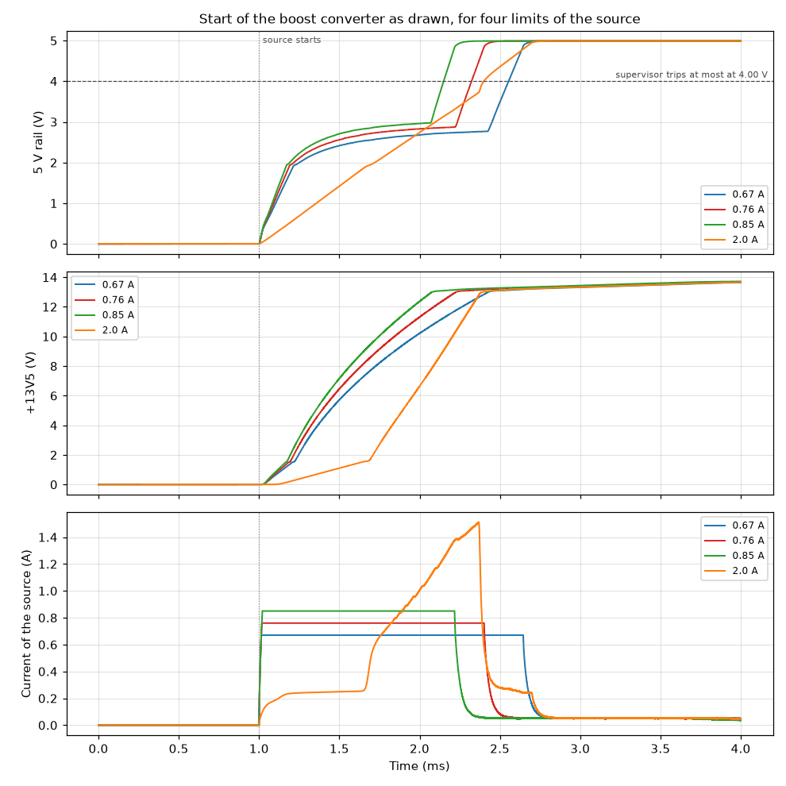

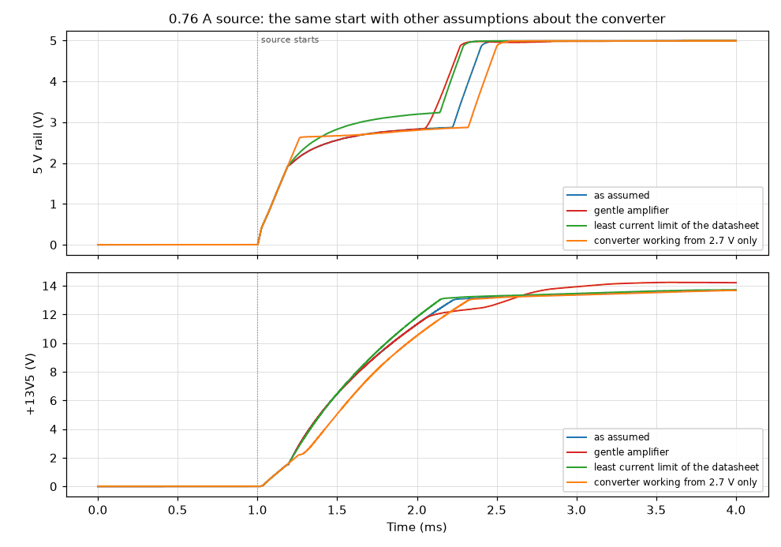

Notes:

- The source is a voltage behind 0.2 ohm with a flat current limit and no path
  back. A real limiter may fold back or switch off while it limits; that belongs
  to the power input block and is not in this bench.
- What the converter does below the 2.7 V at which its datasheet begins decides
  this bench, and the datasheet does not say it. The model works from 2.0 V and
  its current limit there continues the trend of the datasheet curves. With that
  the converter starts while the rail is still rising and takes all the source
  gives: the rail stands at the level of the figures for about a millisecond and
  rises to 5 V when +13V5 is charged. The start neither hangs nor repeats, with
  each of the other assumptions as well. A part that stops below some supply
  voltage would hold the rail at that voltage instead.
- While the rail is held low nothing else is supplied from it: the supervisor
  has not released the other rails, and the controller module has its own
  regulator.
- The error amplifier of the converter model is an assumption: the overshoot of
  +13V5 at the end of the start is not a figure of the part.
- The ceramic capacitors are linear in the cycle-by-cycle runs: those of +13V5
  take the value that needs the energy of the real charge from 0 V to 13.5 V,
  those of the 5 V rail the value they have at 5 V. The run of a second has them
  with their loss under bias.
- The inductor is linear here; at the highest current of these runs it has lost
  less than 10 % of its inductance (datasheet curve).

Models. written here: B0530W, LMR62014, LMR62014_AVG, L_74438357100,
PWRIN_WCAP_47U, RAILS_MLCC.

Decks: [boost-start.averaged-second.cir](boost-start.averaged-second.cir),
[boost-start.limited-0p76.cir](boost-start.limited-0p76.cir).

## `analog_rails/clamps`

**Clamp diodes D8 and D9: one analog rail present, the other one absent.**

One of the two analog rails is brought up while the other has no converter. The
amplifiers that sit between +12V_A and -4V_A draw their supply current through
both rails, so the rail without a converter is pulled across ground until its
clamp diode conducts. The bench holds that state and reads the voltage of the
absent rail: with the typical diode and the typical supply currents, with the
diode at the largest forward voltage of its datasheet and the largest supply
currents, and with that diode in the cold.

Answers: section 3 (Schottky clamps), decision D-52.

| Figure | Simulated | Vendor models | Specification | Limits | Verdict | Source |
| --- | --- | --- | --- | --- | --- | --- |
| -4V_A with its converter absent (typical diode, typical load) | 230 mV | 199.7 mV | 240 mV (-4.18 %) | at most 240 mV | pass | section 3 and D-52: below +0.24 V |
| +12V_A with its converter absent (typical diode, typical load) | -225.7 mV | -194.3 mV | -230 mV (+1.85 %) | at least -230 mV | pass | section 3 and D-52: above -0.23 V |
| Current through D8 in that state (typical diode, typical load) | 4.879 mA | 4.902 mA | | | | |
| -4V_A with its converter absent (largest forward voltage, largest load) | 296.4 mV | 296.4 mV | | at most 300 mV | pass | datasheet of the charge pump: its output at most 0.3 V above ground |
| +12V_A with its converter absent (largest forward voltage, largest load) | -292.8 mV | -292.8 mV | | at least -300 mV | pass | datasheet of the +12V_A regulator: its output at most 0.3 V below ground |
| Current through D8 in that state (largest forward voltage, largest load) | 6.067 mA | 6.067 mA | | | | |
| -4V_A with its converter absent (largest forward voltage, largest load, -40 C) | 394.2 mV | 394.2 mV | | at most 300 mV | **FAIL** | datasheet of the charge pump: its output at most 0.3 V above ground |
| +12V_A with its converter absent (largest forward voltage, largest load, -40 C) | -391.4 mV | -391.4 mV | | at least -300 mV | **FAIL** | datasheet of the +12V_A regulator: its output at most 0.3 V below ground |
| Current through D8 in that state (largest forward voltage, largest load, -40 C) | 5.991 mA | 5.991 mA | | | | |

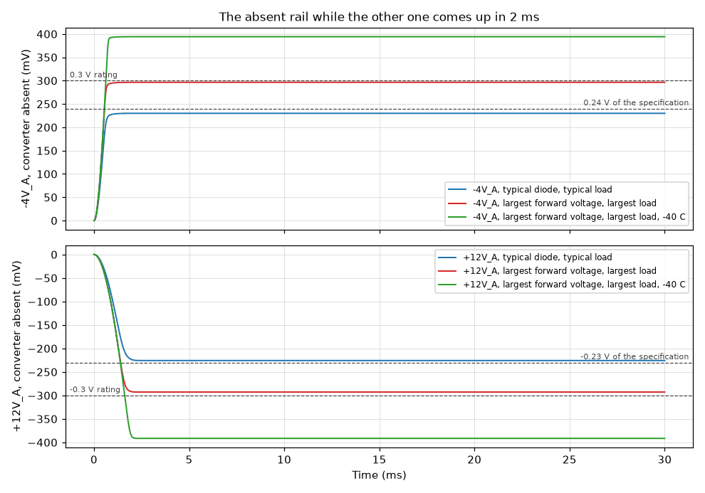

Notes:

- The load is one current sink between the two rails for the supply currents of
  the amplifiers; it fades out below 3 V between the rails. The minimum load R69
  of the source regulator hangs on -4V_A from a regulator output held at 0 V.
- The 0.24 V and 0.23 V of the specification are met by the typical diode, whose
  forward voltage is an assumption 40 mV below the datasheet maximum. With the
  diode at that maximum the rail stands closer to the 0.3 V that the datasheets
  of the two regulators allow at their output pins.
- The cold run uses the temperature law of the diode equation with the barrier
  height usual for a Schottky diode; the datasheet of the diode gives no forward
  voltage in the cold, so that figure is a trend and not a datasheet value.

Models. written here: B0530W, B0530W_HI.

Decks: [clamps.m4-absent-cold.cir](clamps.m4-absent-cold.cir),
[clamps.m4-absent-max.cir](clamps.m4-absent-max.cir),
[clamps.m4-absent-typ.cir](clamps.m4-absent-typ.cir),
[clamps.p12-absent-cold.cir](clamps.p12-absent-cold.cir),
[clamps.p12-absent-max.cir](clamps.p12-absent-max.cir),
[clamps.p12-absent-typ.cir](clamps.p12-absent-typ.cir).

## `analog_rails/monitor`

**Rail monitor: thresholds with tolerances, hysteresis, and the edge of
PWR_GOOD.**

The four watched rails cross their thresholds, slowly, one at a time. The
circuit is the sheet of the rail monitor with the series resistor of the
controller pin. 3V3_C stands at 3.3 V and each rail falls through its threshold
and returns; the level of the rail at the two edges of PWR_GOOD is its threshold
in each direction. The same run is made with random sets of tolerances: every
resistor inside its 1 %, the offset of the comparators inside 10 mV, 3V3_C
inside 2 %. Then +12V_A crosses its threshold at 2 V/s and at 400 V/s, the pace
of its start, with a capacitance between each output pin of the package and the
inverting input beside it. The run is made with the capacitors C32 to C34 as
drawn, ten times larger and left out, and counts the edges of PWR_GOOD.

Answers: section 3 (rail monitor, table of thresholds), section 4.11, decision
D-54.

| Figure | Simulated | Vendor models | Specification | Limits | Verdict | Source |
| --- | --- | --- | --- | --- | --- | --- |
| 3V3_A: PWR_GOOD falls at | 2.969 V | 2.969 V | 2.97 V (-0.05 %) | 2.955 V to 2.985 V | pass | section 3, table of the rail monitor |
| 3V3_A: hysteresis, referred to the rail | 3.524 mV | 3.524 mV | | | | |
| 3V3_A: lowest threshold over 36 sets of tolerances | 2.912 V | 2.912 V | | 2.89 V to 3.05 V | pass | section 3: band 2.89 V to 3.05 V |
| 3V3_A: highest threshold over 36 sets of tolerances | 3.03 V | 3.03 V | | 2.89 V to 3.05 V | pass | section 3: band 2.89 V to 3.05 V |
| +12V_A: PWR_GOOD falls at | 9.844 V | 9.844 V | 9.85 V (-0.07 %) | 9.801 V to 9.899 V | pass | section 3, table of the rail monitor |
| +12V_A: hysteresis, referred to the rail | 20.56 mV | 20.56 mV | | | | |
| +12V_A: lowest threshold over 36 sets of tolerances | 9.601 V | 9.601 V | | 9.25 V to 10.48 V | pass | section 3: band 9.25 V to 10.48 V |
| +12V_A: highest threshold over 36 sets of tolerances | 10.14 V | 10.14 V | | 9.25 V to 10.48 V | pass | section 3: band 9.25 V to 10.48 V |
| -4V_A: PWR_GOOD falls at | -2.559 V | -2.559 V | -2.57 V (+0.43 %) | -2.583 V to -2.557 V | pass | section 3, table of the rail monitor |
| -4V_A: hysteresis, referred to the rail | 16.34 mV | 16.34 mV | | | | |
| -4V_A: lowest threshold over 36 sets of tolerances | -2.694 V | -2.694 V | | -2.86 V to -2.29 V | pass | section 3: band -2.86 V to -2.29 V |
| -4V_A: highest threshold over 36 sets of tolerances | -2.48 V | -2.48 V | | -2.86 V to -2.29 V | pass | section 3: band -2.86 V to -2.29 V |
| VREF: PWR_GOOD falls at | 2.243 V | 2.243 V | 2.245 V (-0.08 %) | 2.234 V to 2.256 V | pass | section 3, table of the rail monitor |
| VREF: hysteresis, referred to the rail | 4.687 mV | 4.687 mV | | | | |
| VREF: lowest threshold over 36 sets of tolerances | 2.189 V | 2.189 V | | 2.14 V to 2.35 V | pass | section 3: band 2.14 V to 2.35 V |
| VREF: highest threshold over 36 sets of tolerances | 2.293 V | 2.293 V | | 2.14 V to 2.35 V | pass | section 3: band 2.14 V to 2.35 V |
| PWR_GOOD high level at the controller pin | 2.704 V | 2.704 V | 2.704 V (+0.00 %) | 2.677 V to 2.731 V | pass | section 4.11: 0.82 x 3V3_C |
| PWR_GOOD low level while one comparator pulls | 70.11 mV | 70.11 mV | | at most 600 mV | pass | datasheet of the comparators: at most 0.6 V at 3 mA; the pin of the controller reads low below 0.8 V |
| Edges of PWR_GOOD at one crossing (capacitors as drawn, 3.5 mV, 0.5 pF, 2 V/s) | 1 | 1 | | at most 1 | pass | decision D-54: the capacitors keep an edge from moving its own threshold; one crossing, one edge |
| Time from the first edge to the last (capacitors as drawn, 3.5 mV, 0.5 pF, 2 V/s) | 0 s | 0 s | | | | |
| Largest movement of the threshold at the first edge (capacitors as drawn, 3.5 mV, 0.5 pF, 2 V/s) | 2.564 mV | 2.564 mV | | | | |
| Edges of PWR_GOOD at one crossing (capacitors as drawn, 1 mV, 1 pF, 20 V/s) | 2771 | 2771 | | at most 1 | **FAIL** | decision D-54: the capacitors keep an edge from moving its own threshold; one crossing, one edge |
| Time from the first edge to the last (capacitors as drawn, 1 mV, 1 pF, 20 V/s) | 241.6 µs | 241.6 µs | | | | |
| Largest movement of the threshold at the first edge (capacitors as drawn, 1 mV, 1 pF, 20 V/s) | 3.149 mV | 3.149 mV | | | | |
| Edges of PWR_GOOD at one crossing (capacitors as drawn, 1 mV, 1 pF, 400 V/s) | 423 | 423 | | at most 1 | **FAIL** | decision D-54: the capacitors keep an edge from moving its own threshold; one crossing, one edge |
| Time from the first edge to the last (capacitors as drawn, 1 mV, 1 pF, 400 V/s) | 36.36 µs | 36.36 µs | | | | |
| Largest movement of the threshold at the first edge (capacitors as drawn, 1 mV, 1 pF, 400 V/s) | 3.606 mV | 3.606 mV | | | | |
| Edges of PWR_GOOD at one crossing (capacitors of 10 nF, 1 mV, 1 pF, 2 V/s) | 1 | 1 | | | | |
| Time from the first edge to the last (capacitors of 10 nF, 1 mV, 1 pF, 2 V/s) | 0 s | 0 s | | | | |
| Largest movement of the threshold at the first edge (capacitors of 10 nF, 1 mV, 1 pF, 2 V/s) | 525 µV | 525 µV | | | | |
| Edges of PWR_GOOD at one crossing (no capacitors, 3.5 mV, 0.5 pF, 400 V/s) | 212 | 212 | | | | |
| Time from the first edge to the last (no capacitors, 3.5 mV, 0.5 pF, 400 V/s) | 35.34 µs | 35.34 µs | | | | |
| Largest movement of the threshold at the first edge (no capacitors, 3.5 mV, 0.5 pF, 400 V/s) | 64.86 mV | 64.86 mV | | | | |

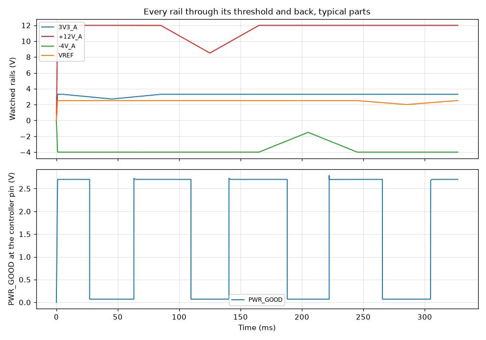

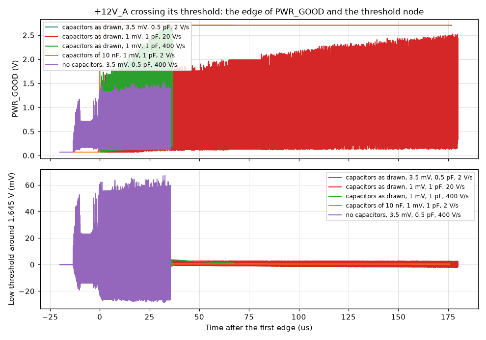

Notes:

- The comparators are one model with an offset and a hysteresis as parameters;
  the four of a package take the same offset in a run, so the bands hold for
  each threshold alone and not for combinations. The bands of the specification
  also hold drift, which is not in these runs.
- The hysteresis referred to a rail is that of the comparator, 3.5 mV, divided
  by the share of the rail that reaches its input.
- The capacitance between an output pin and the input beside it is an
  assumption, 0.5 pF and 1 pF: the datasheet names the hazard (section 4.7 of
  it) and gives no figure, and the board adds its own. With 1 nF at the
  threshold the step is that capacitance times the 2.7 V of the edge over 1 nF:
  comparable with the hysteresis, whose least value is 1 mV.
- The delay of the comparator is a fixed 45 ns here; a real part is slower close
  to its threshold, which makes a burst last longer, not shorter.

Models. written here: MCP6569_OD.

Decks: [monitor.drawn-typ.cir](monitor.drawn-typ.cir),
[monitor.thresholds.cir](monitor.thresholds.cir).

## `analog_rails/negative-rail`

**-4V_A: its level and the 5 V rail it needs.**

The charge pump runs from a 5 V rail that falls from 5.5 V to 3.6 V in 0.19 s.
The rail feeds the pump through R30 with C21, as drawn. The pump is its averaged
model: an inverter with the output resistance of the datasheet that keeps its
output 2.7 % short of its supply at light load, and a regulator behind it. The
load is the supply current of the amplifiers and the minimum load of the source
regulator, once with that regulator at 0 V and once at 5 V. The run is repeated
with the feedback reference and the 0.1 % divider at their limits, and once with
a divider of 1 % parts, which is what the 0.1 % parts replaced.

Answers: section 3 (charge pump, -3.91 V to -4.05 V), decisions D-26, D-49 and
D-51.

| Figure | Simulated | Vendor models | Specification | Limits | Verdict | Source |
| --- | --- | --- | --- | --- | --- | --- |
| -4V_A, typical parts | -3.977 V | -3.977 V | -3.977 V (-0.01 %) | -3.997 V to -3.957 V | pass | datasheet equation of the pump with R34 and R36 |
| -4V_A, reference and divider at the limits that make it most negative | -4.041 V | -4.041 V | | -4.05 V to -3.91 V | pass | section 3: -3.91 V to -4.05 V |
| -4V_A, reference and divider at the limits that make it least negative | -3.913 V | -3.913 V | | -4.05 V to -3.91 V | pass | section 3: -3.91 V to -4.05 V |
| 5 V rail at which -4V_A has lost 1 %, typical parts, source off | 4.059 V | 4.059 V | | at most 4.25 V | pass | decision D-49: 4.25 V is what the charge pump needs |
| 5 V rail at which -4V_A has lost 1 %, typical parts, source at 5 V | 4.071 V | 4.072 V | | at most 4.25 V | pass | decision D-49: 4.25 V is what the charge pump needs |
| 5 V rail at which -4V_A has lost 1 %, most negative output, source at 5 V | 4.137 V | 4.137 V | | at most 4.25 V | pass | decisions D-49 and D-51: the 0.1 % divider keeps the need at 4.25 V |
| The same with resistors of 1 % in the divider, as before decision D-51 | 4.189 V | 4.189 V | 4.26 V (-1.67 %) | 4.175 V to 4.345 V | pass | section 15, decision D-51: with 1 % resistors the corner needs 4.26 V |
| Current the pump takes from the 5 V rail at 5.5 V, source off | 8.326 mA | 8.368 mA | | | | |

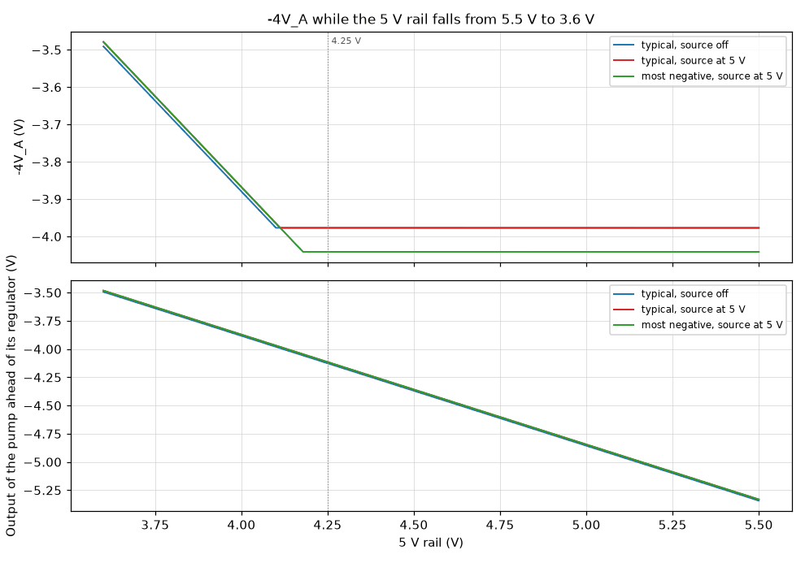

Notes:

- The pump is the averaged model. Its light-load level, 2.7 % short of the
  supply, is read from two figures of the datasheet (7-3 and 7-4) and is the
  figure that decides where the rail lets go; the datasheet does not state it in
  words or in its table.
- The load on -4V_A is 5.1 mA of the amplifiers and the minimum load R69 of the
  source regulator: 3.1 mA with that regulator at 0 V and 6.9 mA at 5 V.
- R30 is taken 1 % high. The capacitors lose capacitance under bias; no figure
  here depends on it.

Models. written here: B0530W, LM27761_AVG, RAILS_MLCC.

Decks: [negative-rail.typical.cir](negative-rail.typical.cir).

## `analog_rails/power-down`

**Power-off and supervisor trip: the order in which the rails fall.**

The rails run, then the 5 V source is removed, or lowered for 3 ms. The circuit
and the loads are those of the power-up bench. The supervisor has a release
delay of 20 ms here, so that the rails are up and +12V_A has settled when the
event comes at 0.6 s. In the first run the source disappears and the 5 V rail
falls under its loads until the supervisor trips. In the second the source falls
to 3.4 V for 3 ms and returns: the supervisor trips, the rails fall, and the
carrier starts again.

Answers: section 3 (power-off), section 4.6 (D-53), section 4.11, rule F-7,
decisions D-48 and D-52.

| Figure | Simulated | Vendor models | Specification | Limits | Verdict | Source |
| --- | --- | --- | --- | --- | --- | --- |
| Source removed: the supervisor falls after the event | 1.153 ms | 1.158 ms | | | | the rail falls through 3.91 V under its loads |
| Source removed: 3V3_C below 3.0 V after the supervisor fell | 45.72 µs | 45.79 µs | 20 µs (+128.59 %) | at most 30 µs | **FAIL** | section 3: 0.02 ms (taken as at most 0.03 ms) |
| Source removed: PWR_GOOD below 2.0 V at the controller pin after the supervisor fell | 145.1 µs | 145.2 µs | | 0 s to 70 µs | **FAIL** | rule F-7: 0.05 ms to 0.07 ms after the rails begin to fall, not before them |
| Source removed: PWR_GOOD below 0.8 V at the controller pin after the supervisor fell | 604.5 µs | 604.5 µs | 300 µs (+101.50 %) | at most 400 µs | **FAIL** | section 3: 0.3 ms (taken as at most 0.4 ms) |
| Source removed: 3V3_A below 1.0 V after the supervisor fell | 3.584 ms | 3.628 ms | | 4 ms to 6 ms | **FAIL** | section 3: 4 ms to 6 ms |
| Source removed: +12V_A below 3.6 V after the supervisor fell | 20.31 ms | 20.16 ms | 14 ms (+45.08 %) | 9.8 ms to 18.2 ms | **FAIL** | section 3: about 14 ms |
| Source removed: time with +12V_A above 3.6 V and 3V3_A below 1.0 V | 16.73 ms | 16.54 ms | 10 ms (+67.27 %) | 6 ms to 14 ms | **FAIL** | section 3: about 10 ms |
| Source removed: VREF above 3V3_A at the most | 267.8 mV | 247.7 mV | | at most 600 mV | pass | section 4.6 and D-53: at most a diode drop; the monitor converter is rated for its supply plus 0.6 V (datasheet), the lowest rating on the line |
| Source removed: largest current through D7 | 14.92 mA | 14.97 mA | | at most 500 mA | pass | datasheet of the diode: 0.5 A average |
| Source removed: -4V_A at its highest while the rails fall | 230.3 mV | 199.8 mV | | at most 240 mV | pass | section 3 and D-52: below +0.24 V |
| Source removed: +12V_A at its lowest while the rails fall | 15.37 mV | 2.832 mV | | at least -230 mV | pass | section 3 and D-52: above -0.23 V |
| Dip to 3.4 V: the supervisor falls after the event | 1.153 ms | 1.158 ms | | | | the rail falls through 3.91 V under its loads |
| Dip to 3.4 V: 3V3_C below 3.0 V after the supervisor fell | 45.72 µs | 45.79 µs | 20 µs (+128.59 %) | at most 30 µs | **FAIL** | section 3: 0.02 ms (taken as at most 0.03 ms) |
| Dip to 3.4 V: PWR_GOOD below 2.0 V at the controller pin after the supervisor fell | 145.1 µs | 145.2 µs | | 0 s to 70 µs | **FAIL** | rule F-7: 0.05 ms to 0.07 ms after the rails begin to fall, not before them |
| Dip to 3.4 V: PWR_GOOD below 0.8 V at the controller pin after the supervisor fell | 604.5 µs | 604.5 µs | 300 µs (+101.50 %) | at most 400 µs | **FAIL** | section 3: 0.3 ms (taken as at most 0.4 ms) |
| Dip to 3.4 V: 3V3_A below 1.0 V after the supervisor fell | 3.584 ms | 3.628 ms | | 4 ms to 6 ms | **FAIL** | section 3: 4 ms to 6 ms |
| Dip to 3.4 V: +12V_A below 3.6 V after the supervisor fell | 20.31 ms | 20.16 ms | 14 ms (+45.08 %) | 9.8 ms to 18.2 ms | **FAIL** | section 3: about 14 ms |
| Dip to 3.4 V: time with +12V_A above 3.6 V and 3V3_A below 1.0 V | 16.73 ms | 16.54 ms | 10 ms (+67.27 %) | 6 ms to 14 ms | **FAIL** | section 3: about 10 ms |
| Dip to 3.4 V: VREF above 3V3_A at the most | 267.8 mV | 247.7 mV | | at most 600 mV | pass | section 4.6 and D-53: at most a diode drop; the monitor converter is rated for its supply plus 0.6 V (datasheet), the lowest rating on the line |
| Dip to 3.4 V: largest current through D7 | 14.92 mA | 14.98 mA | | at most 500 mA | pass | datasheet of the diode: 0.5 A average |
| Dip to 3.4 V: -4V_A at its highest while the rails fall | 230.3 mV | 199.8 mV | | at most 240 mV | pass | section 3 and D-52: below +0.24 V |
| Dip to 3.4 V: +12V_A at its lowest while the rails fall | 3.131 V | 3.086 V | | at least -230 mV | pass | section 3 and D-52: above -0.23 V |
| Dip to 3.4 V: PWR_GOOD returns after the supervisor has released again | 22.44 ms | 22.41 ms | 24 ms (-6.52 %) | 16.8 ms to 31.2 ms | pass | section 3, step 8: about 24 ms after 5V_OK, also after a trip |
| +12V_A when the event comes | 11.96 V | 11.96 V | | 11.9 V to 12.1 V | pass | the rail has settled: within 0.1 V of 12 V (limit of this bench) |

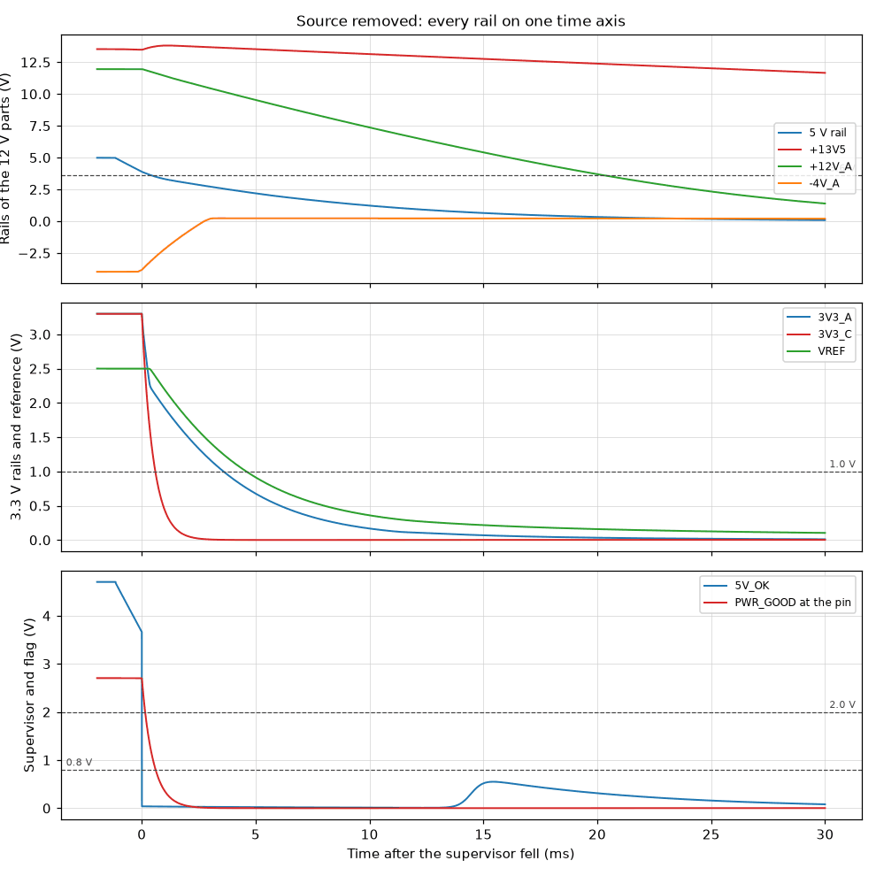

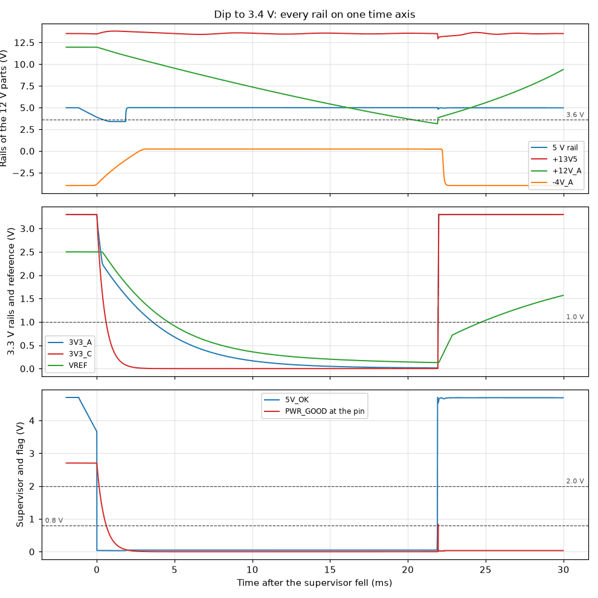

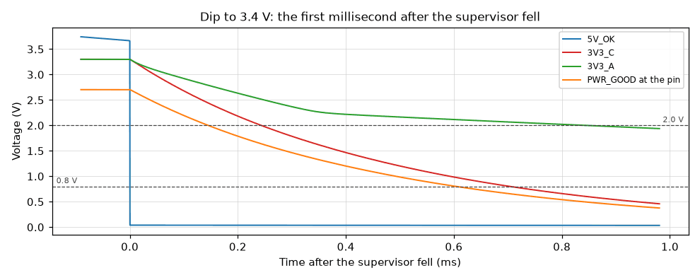

Notes:

- Source, loads and models are those of the power-up bench. The times of the two
  3.3 V rails and of PWR_GOOD follow from the discharge of 230 ohm of the
  regulators and from the loads assumed here: 0.5 mA and the LED on 3V3_C, 10 mA
  on 3V3_A. The flag has no edge of its own: its thresholds and its pull-up fall
  with 3V3_C, so it falls as 0.82 times that rail.
- 3V3_C and the flag fall about half as fast as the specification says. The rail
  carries 2.4 uF in the netlist (C16 and C92 of 1 uF, four capacitors of 0.1 uF)
  and is emptied by the 230 ohm of its regulator and about 2 mA of load: 2.4 uF
  times 0.3 V over 15.6 mA is the 46 us of the figure. The 0.02 ms of the
  specification fit a rail of 1 uF, the capacitor at the regulator alone. The
  flag still does not lead the rails.
- +12V_A carries 10 uF at the regulator and 4.8 uF at the supply pins, and the
  loads assumed here take 6.6 mA from it; that is the 20 ms of the figure. The
  capacitors of 1 uF have no bias curve in the model and stay at their value; at
  12 V they hold less, so the rail of the board falls somewhat faster.
- The clamp diodes are the typical variant of the model (0.335 V at 0.1 A, an
  assumption); the bench of the clamps has the datasheet maximum.
- The +12V_A regulator has no discharge in shutdown in its model, and its SET
  capacitor empties into the output through the clamp of the part: both are
  readings of the datasheet, not statements of it.

Models. written here: B0530W, LM27761_AVG, LMR62014_AVG, LT3042, MCP6569_OD,
PWRIN_LED_GREEN, PWRIN_LP5907, PWRIN_TPS3808G01, PWRIN_WCAP_47U, RAILS_MLCC,
REF5025AID.

Decks: [power-down.off.cir](power-down.off.cir),
[power-down.trip.cir](power-down.trip.cir).

## `analog_rails/power-up`

**Power-up: the order in which the rails arrive.**

The 5 V source ramps up and every rail of the carrier starts by itself. The
circuit is the two sheets of the analog rails and the rail monitor with the
supervisor and the 3.3 V regulators of the logic supplies and every capacitor of
the schematic on a rail. The run is made three times: with the typical release
delay of the supervisor and with its two limits. The two converters are their
averaged models here, so that a run of more than a second is possible; their
switching is in the benches of the boost converter and of the ripple.

Answers: section 3 (order of the rails at power-up, steps 1 to 8), section 4.11,
rules F-2 and F-3, decisions D-48 and D-53.

| Figure | Simulated | Vendor models | Specification | Limits | Verdict | Source |
| --- | --- | --- | --- | --- | --- | --- |
| 5 V rail above 4.75 V after the source starts to rise | 1.634 ms | 1.634 ms | | | | section 3, step 1: a ramp of 1.7 ms (the ramp is the stimulus here) |
| +13V5 above 12.2 V after the source starts to rise | 1.32 ms | 1.32 ms | 3 ms (-56.01 %) | at most 4.5 ms | pass | section 3, step 2: charged about 3 ms after the start |
| +13V5 at the end of the hold-off | 13.53 V | 13.53 V | 13.53 V (+0.00 %) | 13 V to 14.1 V | pass | section 3: 13.0 V to 14.1 V |
| Release of the supervisor after the rail is above 4.12 V, typical | 300.2 ms | 300.2 ms | 300 ms (+0.06 %) | 180 ms to 420 ms | pass | section 3, step 3: 0.18 s to 0.42 s |
| 3V3_A: highest level during the hold-off | 12.47 µV | 11.82 µV | | at most 100 mV | pass | section 3, step 3: only the 5 V rail and +13.5 V are present (0.1 V taken as absent) |
| 3V3_C: highest level during the hold-off | 35.89 µV | 35.83 µV | | at most 100 mV | pass | section 3, step 3: only the 5 V rail and +13.5 V are present (0.1 V taken as absent) |
| +12V_A: highest level during the hold-off | -4.39 µV | -614.9 nV | | at most 100 mV | pass | section 3, step 3: only the 5 V rail and +13.5 V are present (0.1 V taken as absent) |
| VREF: highest level during the hold-off | 109.4 nV | 703 nV | | at most 100 mV | pass | section 3, step 3: only the 5 V rail and +13.5 V are present (0.1 V taken as absent) |
| PWR_GOOD at the controller pin: highest level during the hold-off | 29.4 µV | 29.35 µV | | at most 100 mV | pass | section 3, step 3: only the 5 V rail and +13.5 V are present (0.1 V taken as absent) |
| -4V_A: lowest level during the hold-off | -1.444e-07 fV | 0.0004134 fV | | at least -100 mV | pass | section 3, step 3 (0.1 V taken as absent) |
| 3V3_A above 3.0 V after the release | 14.87 µs | 14.88 µs | 40 µs (-62.81 %) | at most 150 µs | pass | section 3, step 4: 0.04 ms; 150 us is the datasheet limit of the regulator |
| 3V3_C above 3.0 V after the release | 14.73 µs | 14.73 µs | 40 µs (-63.19 %) | at most 150 µs | pass | section 3, step 4: 0.04 ms; 150 us is the datasheet limit of the regulator |
| -4V_A below -3.5 V after the release | 434.9 µs | 434.7 µs | 300 µs (+44.98 %) | 200 µs to 400 µs | **FAIL** | section 3, step 5: 0.3 ms (taken as 0.2 ms to 0.4 ms) |
| +12V_A above 9.85 V after the release | 16.96 ms | 16.96 ms | | 8 ms to 17 ms | pass | section 3, step 6: 8 ms to 17 ms |
| +12V_A at 11 V after the release | 18.01 ms | 18.01 ms | 18 ms (+0.07 %) | 15.3 ms to 20.7 ms | pass | rule F-3: 18 ms |
| +12V_A: time constant of the approach from 11 V | 182.5 ms | 182.5 ms | 180 ms (+1.41 %) | 144 ms to 216 ms | pass | rules F-3 and F-36: 0.18 s |
| +12V_A inside its window (11.4 V) after the release | 111.1 ms | 111.1 ms | 100 ms (+11.13 %) | 75 ms to 125 ms | pass | rule F-3: about 0.1 s |
| +12V_A within 0.1 % of its final value after the release | 788.7 ms | 788.7 ms | 800 ms (-1.42 %) | 600 ms to 1 s | pass | section 3, step 6: settles in about 0.8 s |
| +12V_A, final value | 12 V | 12 V | 12 V (-0.01 %) | 11.4 V to 12.6 V | pass | rule F-12: 11.4 V to 12.6 V |
| VREF above 2.245 V after the release | 24.1 ms | 24.1 ms | 24 ms (+0.41 %) | 20.4 ms to 27.6 ms | pass | section 3, step 7: 24 ms |
| VREF within 0.1 % of its final value after the release | 74.97 ms | 74.97 ms | 80 ms (-6.29 %) | 64 ms to 96 ms | pass | section 3, step 7 and rule F-3: about 80 ms |
| PWR_GOOD above 2.0 V at the controller pin after the release | 24.19 ms | 24.22 ms | 24 ms (+0.78 %) | 19.2 ms to 28.8 ms | pass | section 3, step 8: about 24 ms |
| VREF settles after the last other rail has passed its monitor threshold by | 58.01 ms | 58.01 ms | | at least 0 s | pass | section 16: the reference last |
| +12V_A passes 1 V after 3V3_A has passed 3.0 V by | 2.288 ms | 2.288 ms | | at least 0 s | pass | section 3: no rail of a 12 V part before the 3.3 V rails |
| PWR_GOOD high level at the controller pin | 2.704 V | 2.704 V | 2.704 V (+0.00 %) | 2.623 V to 2.785 V | pass | section 4.11: 0.82 x 3V3_C |
| PWR_GOOD at the controller pin: highest level before the flag is valid | 817.7 mV | 818.2 mV | | at most 2 V | pass | the controller pin reads high from 2.0 V; rule F-2 asks for 10 ms of high level before anything is driven |
| PWR_GOOD after power is applied, supervisor delay 0.18 s | 205.8 ms | 205.8 ms | | 200 ms to 460 ms | pass | sections 3 (step 8) and 6.4: 0.2 s to 0.46 s |
| PWR_GOOD after power is applied, supervisor delay 0.42 s | 445.9 ms | 445.9 ms | | 200 ms to 460 ms | pass | sections 3 (step 8) and 6.4: 0.2 s to 0.46 s |
| PWR_GOOD after power is applied, supervisor delay 0.3 s | 325.8 ms | 325.8 ms | | 200 ms to 460 ms | pass | sections 3 (step 8) and 6.4: 0.2 s to 0.46 s |

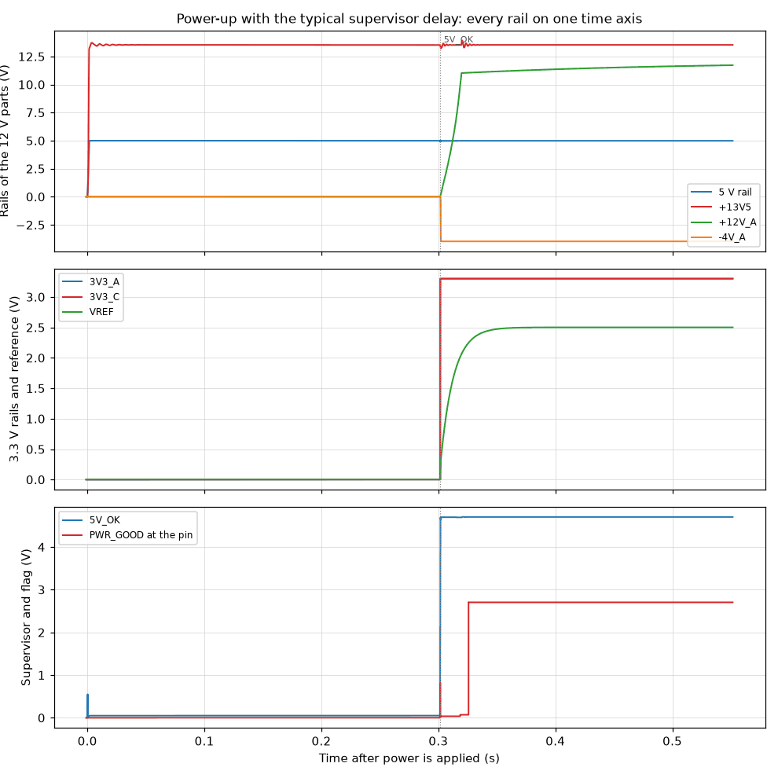

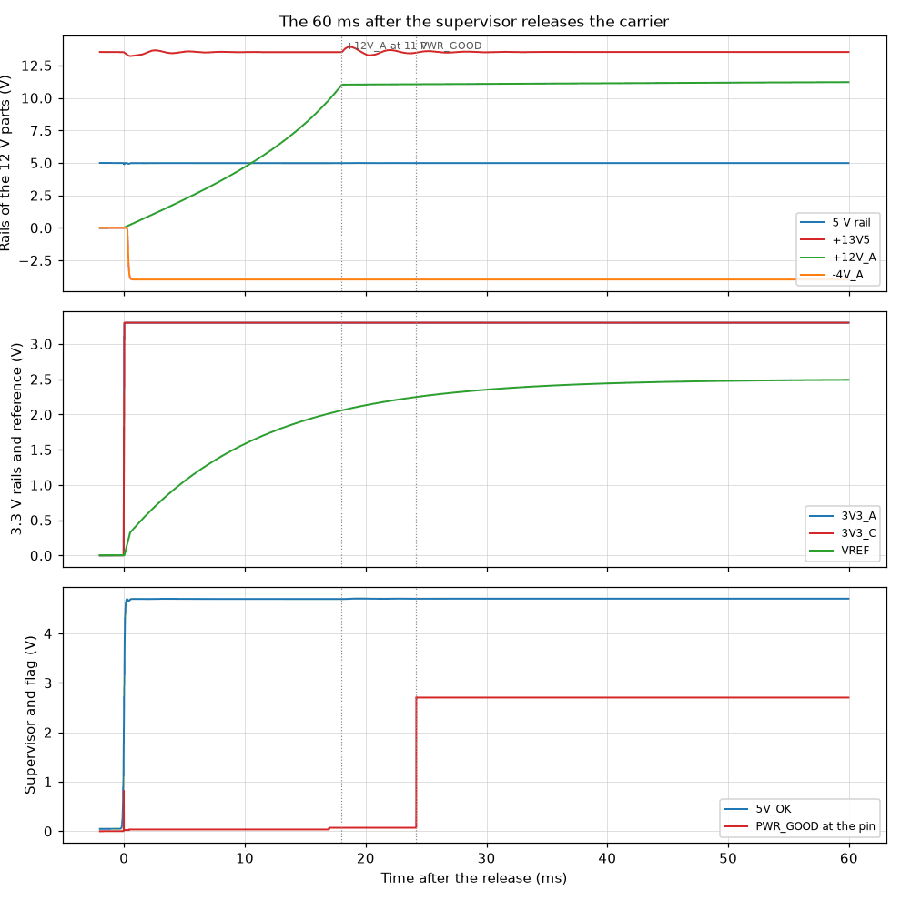

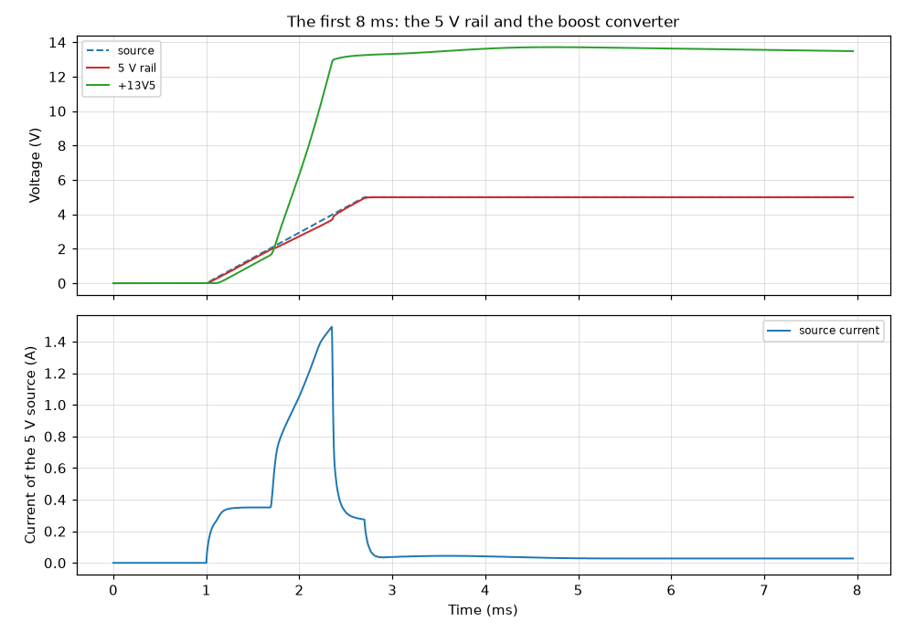

Notes:

- The source of the 5 V rail is a ramp of 1.7 ms to 5 V behind 0.2 ohm with a
  limit of 2 A and no path back; the limiters and the multiplexer of the input
  belong to the power input block. The loads are current sinks of datasheet
  supply currents: 5.1 mA from +12V_A to -4V_A, 1.5 mA from +12V_A, 10 mA from
  3V3_A, 0.5 mA and the LED from 3V3_C, 1 mA from +13V5, 25 mA of the controller
  module from the 5 V rail.
- The two converters are averaged models: no ripple, and the end of the start of
  the boost converter is that of an error amplifier that is an assumption. The
  ceramic capacitors with a bias curve lose capacitance with their voltage; the
  SET capacitor C30 of +12V_A is 4.7 uF at 0 V and 1.45 uF at 12 V, which is
  where the 18 ms and the 0.18 s of the specification come from.
- The -4V_A rail arrives later than the 0.3 ms of the specification: the
  datasheet of the charge pump shows 0.32 ms before its output moves and 0.14 ms
  of ramp (figure 5-10), and the model follows that. The order of the rails does
  not change.
- While 3V3_C rises, PWR_GOOD follows its pull-up for some microseconds until
  the comparators have enough supply to hold it low. The level it reaches
  depends on the supply from which their outputs work, which is an assumption
  (1.2 V; the datasheet begins at 1.8 V). Rule F-2 makes the pulse harmless.
- The supervisor and the 3.3 V regulators are the models of the power input
  block. Times of the regulators inside the rise of a rail are those of
  first-order models; no statement about overshoot can be taken from them.

Models. written here: B0530W, LM27761_AVG, LMR62014_AVG, LT3042, MCP6569_OD,
PWRIN_LED_GREEN, PWRIN_LP5907, PWRIN_TPS3808G01, PWRIN_WCAP_47U, RAILS_MLCC,
REF5025AID.

Decks: [power-up.typ.cir](power-up.typ.cir).

## `analog_rails/reference`

**Reference line: level under load, impedance with the capacitors as drawn,
noise.**

The reference runs from 3.3 V with every capacitor and divider of its line. The
circuit is the reference with its supply filter R31 and C20, its noise capacitor
C24, the capacitor C26 behind R35, the capacitor C89 of the converter behind
R131, C113, the diode D7 and the dividers of the line that the netlist holds. An
operating point gives the level and the head room; a current of 1 A injected at
the pin of the reference gives the impedance of the line; a noise analysis gives
the noise at that pin. A transient shows the start and what the conversions of
the converter do at 100 kSPS.

Answers: section 4.6 (reference, capacitors on the reference line), decisions
D-53 and D-75.

| Figure | Simulated | Vendor models | Specification | Limits | Verdict | Source |
| --- | --- | --- | --- | --- | --- | --- |
| VREF with the loads of its line | 2.5 V | 2.501 V | 2.5 V (+0.00 %) | 2.498 V to 2.502 V | pass | section 4.6: 2.5 V; initial accuracy of the part 0.1 % (datasheet) |
| VREF: change that the load of the line makes | -31.88 µV | 1.21 mV | | | | |
| Supply pin of the reference behind R31, 3V3_A at 3.3 V | 3.284 V | 3.284 V | | at least 2.7 V | pass | datasheet of the reference: supply of 2.7 V at least |
| Current the reference takes from 3V3_A | 1.613 mA | 1.614 mA | | | | |
| Impedance of the line at 1 Hz | 49.07 mΩ | 47.37 mΩ | | | | |
| Largest impedance of the line | 2.342 Ω | 659.7 mΩ | | | | |
| Frequency of the largest impedance | 4.732 kHz | 10.59 kHz | | | | |
| Largest impedance, output stage of the model without its change with load | 16 Ω | 16 Ω | | | | |
| Frequency of that peak | 1.778 kHz | 1.778 kHz | | | | |
| Largest impedance with R35 at 0 ohm | 2.891 Ω | 849.5 mΩ | | | | |
| Largest impedance with R35 at 1.5 ohm | 2.185 Ω | 637.2 mΩ | | | | |
| Impedance of the line at 100 kHz, the sample rate | 181.7 mΩ | 175.2 mΩ | | | | |
| Noise density of VREF at 100 Hz | 38.13 nV/√Hz | 179.8 nV/√Hz | | | | |
| Noise density of VREF at its peak over the density at 100 Hz | 2.303 | 1.476 | | | | |
| The same ratio, output stage without its change with load | 5.524 | 5.524 | | | | |
| Noise of VREF from 10 Hz to 100 kHz | 4.94 µV | 28.12 µV | | | | |
| Noise of VREF from 10 Hz to 100 kHz, output stage without its change with load | 4.711 µV | 4.711 µV | | | | |
| White noise of VREF from 0.1 Hz to 10 Hz (the 1/f noise is not in the model) | 214.6 nV | 1.196 µV | | | | |
| VREF within 0.1 % after 3V3_A is applied | 74.93 ms | 56.19 ms | 80 ms (-6.33 %) | 64 ms to 96 ms | pass | section 3, step 7 and rule F-3: about 80 ms |
| REF pin of the converter: peak to peak at 100 kSPS | 13.36 µV | 13.4 µV | | at most 38 µV | pass | one step of the converter at 2.5 V: 38 uV (limit of this bench) |
| REF pin of the converter: mean while converting against the level before | -9.722 µV | -9.648 µV | | | | |
| VREF at the reference: peak to peak at 100 kSPS | 10.49 µV | 10.34 µV | | | | |

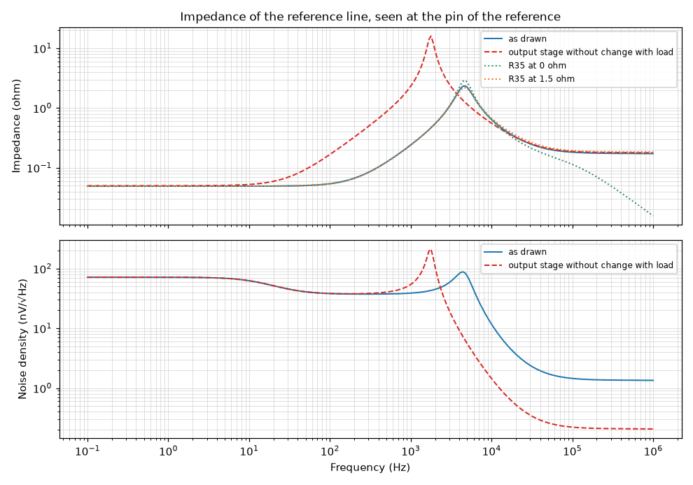

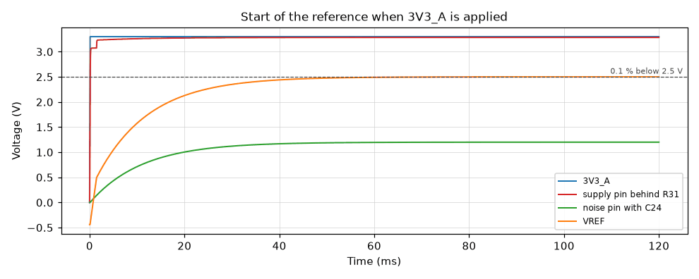

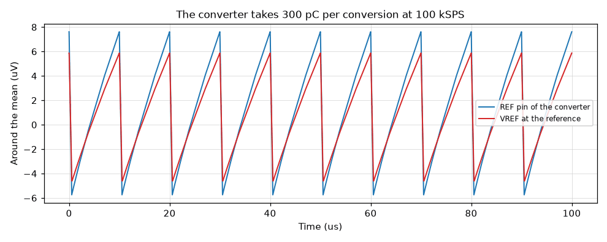

Notes:

- The output impedance of the reference model is a fit to two figures of the
  datasheet and not a datasheet curve: an inductance of 253 uH without load that
  falls as the load rises. With the 0.9 mA that the line draws it is about 33
  uH, and the capacitors of the line resonate with it. The second set of figures
  holds the inductance at 253 uH whatever the load: the cautious case.
- A peak of the noise density above the level at 100 Hz is the gain peaking that
  the datasheet of the reference warns of when the capacitor has too little
  series resistance. C89 with its 0.22 ohm is the larger capacitor of the line,
  so R35 in front of C26 changes little.
- The line carries 0.63 mA into the divider of the set-point converter, the
  dividers of the monitors and 0.15 mA for the dividers that are not in this
  circuit. C89 is linear at 22 uF here; the specification expects about 14 uF
  under bias, which moves the peak up in frequency by about a quarter.
- The noise is white only: the 0.1 Hz to 10 Hz noise of the part (3 uV peak to
  peak per volt, datasheet) is not in the model.

Models. written here: B0530W, RAILS_MLCC, REF5025AID.

Decks: [reference.conversions.cir](reference.conversions.cir),
[reference.small-signal.cir](reference.small-signal.cir).

## `analog_rails/supply-noise`

**Noise and ripple of +12V_A and -4V_A, and what passes from the rails ahead.**

Each analog rail is taken alone, at rest, with an ideal rail ahead of it. For
+12V_A the regulator runs from a 13.53 V source through R37 and C29 with 6.6 mA
of load; a noise analysis gives the noise of the rail and a test signal on the
source gives what the regulator lets through. For -4V_A the same is done with
the averaged pump on a 5 V source, and a transient with the pump switch by
switch gives the ripple. For the reference a test signal on 3V3_A gives what
reaches VREF. The supply pins of the amplifier, of the multiplexer and of the
buffers are on these rail nets without a part in between, so what the rail
carries is what the pins see.

Answers: section 3 (analog rails), section 4.6, decision D-51; the rails feed
the amplifier, the multiplexer and the buffers of sections 4.3 and 4.5.

| Figure | Simulated | Vendor models | Specification | Limits | Verdict | Source |
| --- | --- | --- | --- | --- | --- | --- |
| +12V_A at rest | 12 V | 12 V | 12 V (+0.00 %) | 11.87 V to 12.13 V | pass | section 3: 12.0 V; SET current 1 % and R38 0.1 % (datasheet, netlist) |
| +12V_A: noise density at 10 Hz | 235.1 nV/√Hz | 235.1 nV/√Hz | | | | |
| +12V_A: noise density at 10 kHz | 2.079 nV/√Hz | 2.079 nV/√Hz | | | | |
| +12V_A: noise from 10 Hz to 100 kHz | 986.8 nV | 986.8 nV | | | | |
| +12V_A: what passes from +13V5 at 120 Hz | -116.8 dB | -116.8 dB | | | | |
| +12V_A: what passes from +13V5 at 10000 Hz | -91.3 dB | -91.3 dB | | | | |
| +12V_A: what passes from +13V5 at 100000 Hz | -86.62 dB | -86.62 dB | | | | |
| +12V_A: what passes from +13V5 at 1.6e+06 Hz | -120.4 dB | -120.4 dB | | | | |
| -4V_A at rest | -3.977 V | -3.977 V | -3.977 V (-0.01 %) | -3.997 V to -3.957 V | pass | datasheet equation of the pump with R34 and R36 |
| -4V_A: noise from 10 Hz to 100 kHz | 54.47 µV | 54.47 µV | | | | |
| -4V_A: what passes from the 5 V rail at 1000 Hz | -104 dB | -104 dB | | | | |
| -4V_A: what passes from the 5 V rail at 100000 Hz | -78.22 dB | -78.19 dB | | | | |
| -4V_A: what passes from the 5 V rail at 1.6e+06 Hz | -117.3 dB | -117.3 dB | | | | |
| -4V_A: ripple that the pump lets through, peak to peak | 71.27 µV | 72.25 µV | | | | |
| Output of the pump ahead of its regulator: ripple, peak to peak | 10.87 mV | 10.95 mV | | | | |
| Supply pin of the pump behind R30: ripple, peak to peak | 3.904 mV | 3.81 mV | | | | |
| VREF: what passes from 3V3_A at 1000 Hz | -112.6 dB | -77.93 dB | | | | |
| VREF: what passes from 3V3_A at 100000 Hz | -96.99 dB | -115.9 dB | | | | |
| VREF: what passes from 3V3_A at 1.6e+06 Hz | -73.45 dB | -69.78 dB | | | | |

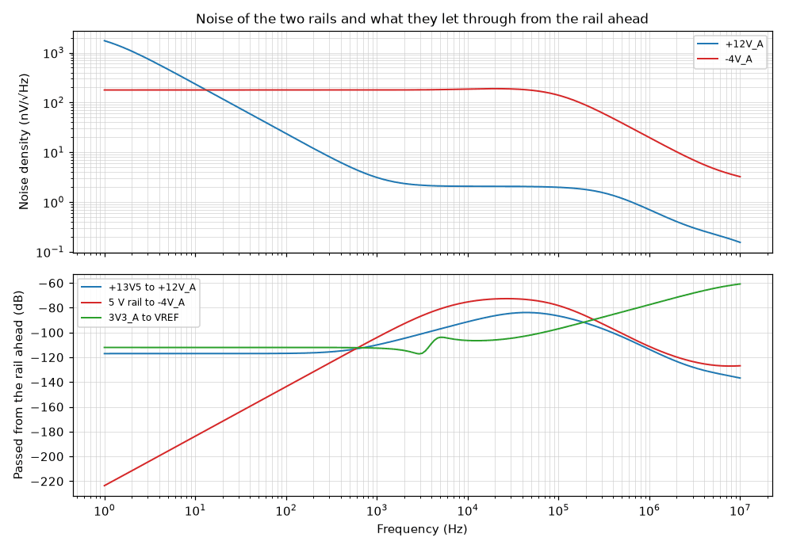

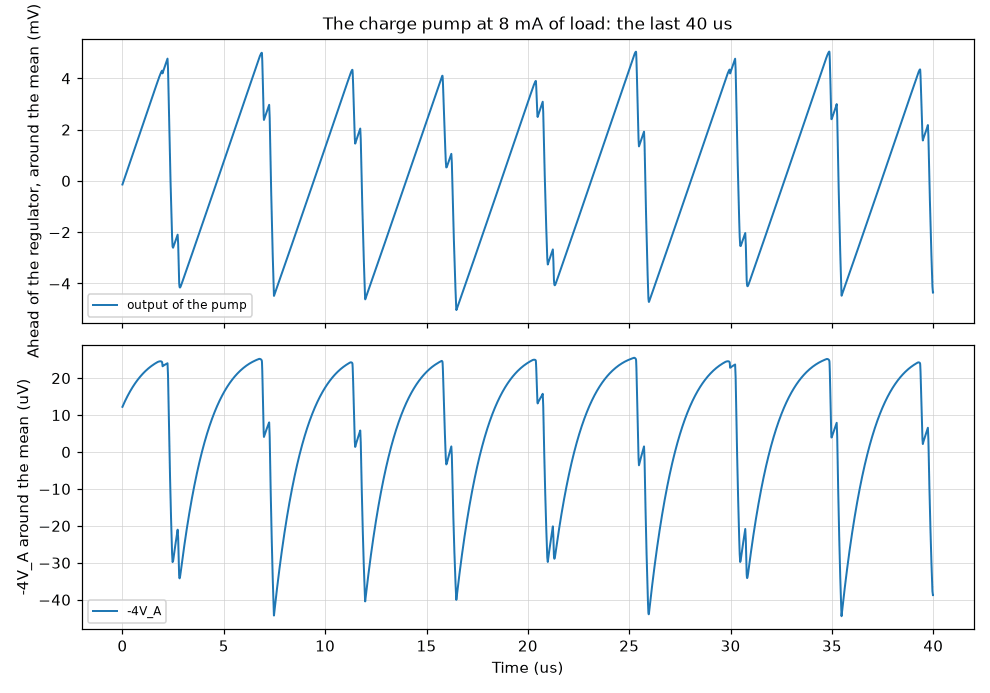

Notes:

- Noise of +12V_A: the model holds the 2 nV/rtHz of the error amplifier and the
  20 pA/rtHz of the reference current of the datasheet, white. Below 100 Hz the
  reference current into the SET capacitor decides, and that capacitor is 1.45
  uF at 12 V instead of 4.7 uF, so the rail is noisier there than the 0.8 uV RMS
  that the datasheet gives for 4.7 uF.
- What +12V_A lets through is the datasheet rejection of the regulator up to 1
  MHz with the filter R37 and C29 ahead of it. With the boost ripple of the
  boost-output bench (2.5 mV at 1.6 MHz and up to 5 mV of slow movement at a few
  kilohertz, the latter a property of the model) less than 0.2 uV reaches +12V_A
  by conduction. The edges of the switch node, which the datasheet of the
  regulator says pass it, and coupling through the board are not in a circuit
  simulation.
- Noise of -4V_A: the 20 uV RMS of the datasheet are put at the reference of the
  regulator as if measured at -1.8 V of output; at -4 V that gives the figure
  here. Read as a figure of the output itself it would be 20 uV RMS. The ripple
  of -4V_A is only what the pump ripple passes through an assumed feed-through
  that reproduces the 35 dB at 2 MHz of the datasheet; the datasheet shows 0.8
  mV to 3.2 mV of ripple on a 2.2 uF output (figure 5-1), most of which is
  coupling that a circuit simulation does not hold. Scaled to the 6.2 uF of this
  rail that would be about 1 mV: the figure to budget with until it is measured.
- The pulse skipping of the pump has a hysteresis of 10 mV that is an
  assumption; it sets the ripple ahead of the regulator and the pace of the
  bursts.

Models. written here: B0530W, LM27761, LM27761_AVG, LT3042, RAILS_MLCC,
REF5025AID.

Decks: [supply-noise.negative-ripple.cir](supply-noise.negative-ripple.cir),
[supply-noise.negative.cir](supply-noise.negative.cir),
[supply-noise.positive.cir](supply-noise.positive.cir).
