# Simulation Results: Digital Lines and Monitors

Everything on this page is a simulation result. Nothing here is measured on
hardware. The page is written by `circuit-sim report` from the result files
beside it; do not edit it by hand.

## `digital/converter-lines`

**Converter lines: edges behind 47 ohm and 220 ohm, cost in timing, reading
window.**

Three pads of the controller run the frame of rule F-34 on the converter.
Convert-start is high for 108 system clocks; then 16 clock pulses shift the
result out, with 16 system clocks per bit (9.375 MHz) and with 10 (15 MHz). The
edges are read at the pins of the converter behind 47 ohm and 220 ohm and at the
pad that reads the data behind 220 ohm. Each rate is run on a board with the
weakest pad of the 4 mA setting and long tracks and on a board with a strong pad
and short tracks, with the delays of the converter and of the registers at the
limits of their datasheets. The reading window of a board is the time in which
converter data and side data are both valid; the window that one fixed reading
instant has on every board is the part that the two boards share.

Answers: section 4.6 (D-75, D-40), section 4.7, rules F-5 and F-34.

| Figure | Simulated | Specification | Limits | Verdict | Source |
| --- | --- | --- | --- | --- | --- |
| weak pad, long tracks: clock edge valid at the converter pin after the pad command | 12.57 ns | 1 ns (+1156.53 %) | | | section 4.6: about 1 ns on the two inputs (estimate) |
| weak pad, long tracks: rise time of the clock at the converter pin, 10 % to 90 % | 21.5 ns | | | | section 4.6: the resistors damp the edges |
| weak pad, long tracks: convert-start above its high level at the converter pin for | 714 ns | | at least 710 ns | pass | section 4.6 and rule F-34: 710 ns at the least (datasheet), 108 clocks |
| weak pad, long tracks: high level of the clock at the converter pin | 3.178 V | | at least 2.31 V | pass | TI SBAS569B, page 7: 0.7 of the digital supply at the least |
| strong pad, short tracks: clock edge valid at the converter pin after the pad command | 2.251 ns | 1 ns (+125.05 %) | | | section 4.6: about 1 ns on the two inputs (estimate) |
| strong pad, short tracks: rise time of the clock at the converter pin, 10 % to 90 % | 2.906 ns | | | | section 4.6: the resistors damp the edges |
| strong pad, short tracks: convert-start above its high level at the converter pin for | 719.1 ns | | at least 710 ns | pass | section 4.6 and rule F-34: 710 ns at the least (datasheet), 108 clocks |
| strong pad, short tracks: high level of the clock at the converter pin | 3.279 V | | at least 2.31 V | pass | TI SBAS569B, page 7: 0.7 of the digital supply at the least |
| Weak pad, long tracks: converter data valid at the pad later than the 13.4 ns of the datasheet by | 11.5 ns | 4 ns (+187.57 %) | | | sections 4.6 and 4.7: about 1 ns on the clock, 3 ns on the data (estimates) |
| Middle case: converter data valid at the pad later than the converter alone gives by | 5.015 ns | 4 ns (+25.39 %) | | | sections 4.6 and 4.7: about 1 ns on the clock, 3 ns on the data (estimates) |
| 9.375 MHz, weak pad of the 4 mA setting, long tracks: window of the board | 35.14 ns | 36.9 ns (-4.77 %) | at least 13.33 ns | pass | sections 4.6 and 4.7 and rule F-34: against two system clocks, 13.3 ns |
| 9.375 MHz, weak pad of the 4 mA setting, long tracks: the window opens after the falling clock by | 24.9 ns | 17.4 ns (+43.12 %) | | | section 4.7: 13.4 ns of the converter and 4 ns of the resistors |
| 9.375 MHz, weak pad of the 4 mA setting, long tracks: the window closes after the next rising clock by | 6.709 ns | 1 ns (+570.94 %) | | | section 4.7: the smallest delay of the register, 1 ns (datasheet) |
| 9.375 MHz, strong pad, short tracks: window of the board | 39.52 ns | 36.9 ns (+7.09 %) | at least 13.33 ns | pass | sections 4.6 and 4.7 and rule F-34: against two system clocks, 13.3 ns |
| 9.375 MHz, strong pad, short tracks: the window opens after the falling clock by | 15.13 ns | 17.4 ns (-13.02 %) | | | section 4.7: 13.4 ns of the converter and 4 ns of the resistors |
| 9.375 MHz, strong pad, short tracks: the window closes after the next rising clock by | 1.318 ns | 1 ns (+31.80 %) | | | section 4.7: the smallest delay of the register, 1 ns (datasheet) |
| 9.375 MHz, long tracks: window that one reading instant has with a weak and with a strong pad, 4 mA setting | 31.15 ns | 36.9 ns (-15.58 %) | at least 13.33 ns | pass | rule F-34: the program reads at one fixed instant; against two system clocks, 13.3 ns |
| 9.375 MHz, long tracks: the same with the weakest 12 mA pad | 33.15 ns | 36.9 ns (-10.16 %) | at least 13.33 ns | pass | rule F-34: against two system clocks, 13.3 ns; rule F-5 sets 4 mA on these pads |
| 9.375 MHz, short tracks: window that one reading instant has with a weak and with a strong pad, 4 mA setting | 38.49 ns | 36.9 ns (+4.32 %) | at least 13.33 ns | pass | rule F-34: the program reads at one fixed instant; against two system clocks, 13.3 ns |
| 9.375 MHz, weak pad: side data valid at the pad after the rising clock | 25.6 ns | 18 ns (+42.19 %) | at most 78.24 ns | pass | section 4.7: 18 ns at the most (datasheet); it has to be valid when the window opens |
| 15 MHz, weak pad of the 4 mA setting, long tracks: window of the board | 15.34 ns | 16.9 ns (-9.22 %) | at least 13.33 ns | pass | sections 4.6 and 4.7 and rule F-34: against two system clocks, 13.3 ns |
| 15 MHz, weak pad of the 4 mA setting, long tracks: the window opens after the falling clock by | 24.65 ns | 17.4 ns (+41.68 %) | | | section 4.7: 13.4 ns of the converter and 4 ns of the resistors |
| 15 MHz, weak pad of the 4 mA setting, long tracks: the window closes after the next rising clock by | 6.661 ns | 1 ns (+566.14 %) | | | section 4.7: the smallest delay of the register, 1 ns (datasheet) |
| 15 MHz, strong pad, short tracks: window of the board | 19.52 ns | 16.9 ns (+15.49 %) | at least 13.33 ns | pass | sections 4.6 and 4.7 and rule F-34: against two system clocks, 13.3 ns |
| 15 MHz, strong pad, short tracks: the window opens after the falling clock by | 15.13 ns | 17.4 ns (-13.02 %) | | | section 4.7: 13.4 ns of the converter and 4 ns of the resistors |
| 15 MHz, strong pad, short tracks: the window closes after the next rising clock by | 1.318 ns | 1 ns (+31.80 %) | | | section 4.7: the smallest delay of the register, 1 ns (datasheet) |
| 15 MHz, long tracks: window that one reading instant has with a weak and with a strong pad, 4 mA setting | 11.43 ns | 16.9 ns (-32.39 %) | at least 13.33 ns | **FAIL** | rule F-34: the program reads at one fixed instant; against two system clocks, 13.3 ns |
| 15 MHz, long tracks: the same with the weakest 12 mA pad | 13.18 ns | 16.9 ns (-22.03 %) | at least 13.33 ns | **FAIL** | rule F-34: against two system clocks, 13.3 ns; rule F-5 sets 4 mA on these pads |
| 15 MHz, short tracks: window that one reading instant has with a weak and with a strong pad, 4 mA setting | 18.49 ns | 16.9 ns (+9.42 %) | at least 13.33 ns | pass | rule F-34: the program reads at one fixed instant; against two system clocks, 13.3 ns |
| 15 MHz, weak pad: side data valid at the pad after the rising clock | 25.55 ns | 18 ns (+41.96 %) | at most 57.99 ns | pass | section 4.7: 18 ns at the most (datasheet); it has to be valid when the window opens |
| Second frame, weak pad: first converter bit valid at the pad after convert-start fell | 19.59 ns | 12.3 ns (+59.28 %) | at most 33.33 ns | pass | rule F-34 at 15 MHz: the first rising clock command comes 5 system clocks later; TI SBAS569B, page 8: 12.3 ns at the converter |
| 500 kSPS: last falling clock edge to the next rising convert-start, at the converter | 207.5 ns | | at least 20 ns | pass | section 4.6 and rule F-34: 20 ns of quiet at the least (datasheet), 4 clocks |
| Converter data line between the frames, at the pad: level it is left at | 38.2 mV | | | | section 5: the line is open between frames and has no pull resistor |

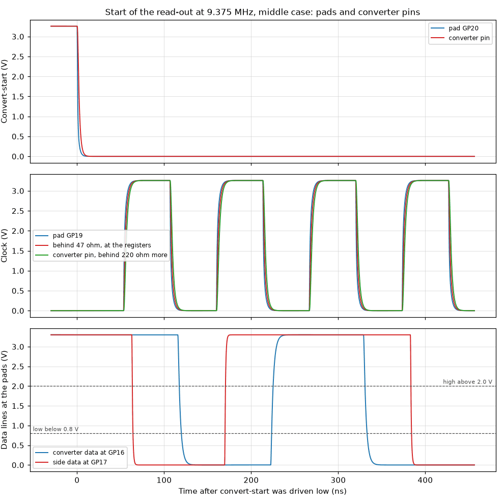

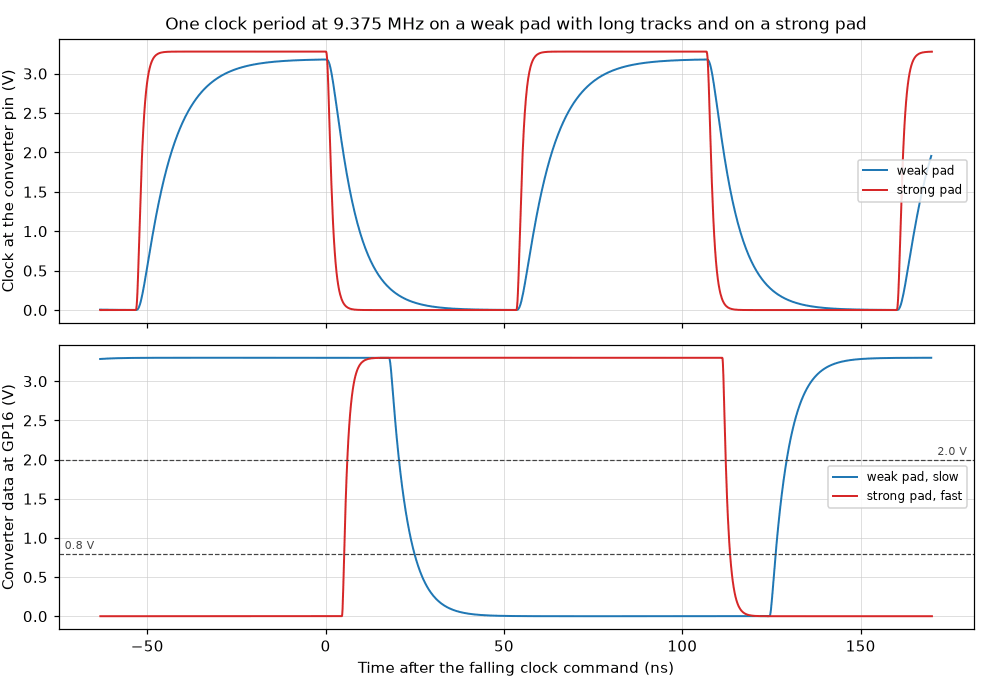

Notes:

- The frame is the one rule F-34 describes, written as ideal commands to three
  pad models; no program of the controller exists yet. Convert-start falls
  before the clocks: the converter puts its data out only while that line is low
  (datasheet, page 22), not while it is high as section 4.6 says.
- The estimates of the specification, 1 ns on the inputs and 3 ns on the data
  line, hold for the series resistors alone. The pad adds its own resistance, up
  to 170 ohm at the 4 mA setting that rule F-5 gives these pads (datasheet
  limit), into the registers, the converter pin and the track: a clock edge then
  reaches the converter up to 12 ns late.
- On one board the window keeps about the width that the specification
  calculates, because a late clock moves its opening and its closing alike. Its
  position moves with the output resistance of the pad, which differs from part
  to part: one reading instant that has to fit a weak and a strong pad on the
  same board has less. The figures give that shared window for a board with long
  tracks and for one with short tracks.
- Assumptions: the capacitance of the tracks (2 pF to 10 pF, twice that on the
  clock), of the converter pins (3 pF to 8 pF) and of the pads (3 pF to 8 pF),
  the output resistance of the converter (40 ohm) and the strong pad of 30 ohm.
  The datasheets give none of them, and the weak pad is the limit of its
  datasheet, not a typical part. No inductance and no reflection is in the
  circuit.
- Between two frames nothing drives the converter data line; the pad sees the
  level of the last bit on its capacitance. The specification gives that line no
  pull resistor.

Models. written here: DIGITAL_ADS8860_IO, DIGITAL_LV165A.

Decks: [converter-lines.two-frames.cir](converter-lines.two-frames.cir),
[converter-lines.typical-16.cir](converter-lines.typical-16.cir),
[converter-lines.weak-a-10.cir](converter-lines.weak-a-10.cir).

## `digital/logic-abuse`

**A logic input at +12 V, at -12 V and under a contact discharge of 8 kV.**

Line D0 of the logic port meets voltages outside its range. A source behind 0.1
ohm, 100 ohm and 1 kohm is stepped from -12 V to +12 V at the connector, and the
bench reads the voltage that the array leaves, the current it takes and the
voltage at the translator pin behind 330 ohm. Then a contact discharge of 8 kV
of either polarity is applied as the current of IEC 61000-4-2, once with a
translator pin that takes no current above its rating and once with a pin that
clamps at 6.5 V, as the estimate of the specification assumes.

Answers: section 4.8 (D-50), section 4.9 (protection of the terminals).

| Figure | Simulated | Specification | Limits | Verdict | Source |
| --- | --- | --- | --- | --- | --- |
| +12 V behind 0.1 ohm: current in the array | 4.069 A | | | | TI SLVSBQ9D rates the array for surges of 8/20 us only: 3 A, 45 W |
| +12 V behind 0.1 ohm: voltage at the translator pin | 11.58 V | | at most 6.5 V | **FAIL** | TI SCES584D, page 6: 6.5 V at the most; the specification states no withstand voltage for the port |
| -12 V behind 0.1 ohm: current in the array | 15.74 A | | | | TI SLVSBQ9D rates the array for surges of 8/20 us only: 3 A, 45 W |
| -12 V behind 0.1 ohm: current in the ground clamp of the translator pin | 28.64 mA | | at most 50 mA | pass | TI SCES584D, page 6: 50 mA in the clamp of an input below ground |
| +12 V behind 100 ohm: current in the array | 42.66 mA | | | | TI SLVSBQ9D rates the array for surges of 8/20 us only: 3 A, 45 W |
| +12 V behind 100 ohm: voltage at the translator pin | 7.728 V | | at most 6.5 V | **FAIL** | TI SCES584D, page 6: 6.5 V at the most; the specification states no withstand voltage for the port |
| -12 V behind 100 ohm: current in the array | 110.6 mA | | | | TI SLVSBQ9D rates the array for surges of 8/20 us only: 3 A, 45 W |
| -12 V behind 100 ohm: current in the ground clamp of the translator pin | 993.1 µA | | at most 50 mA | pass | TI SCES584D, page 6: 50 mA in the clamp of an input below ground |
| +12 V behind 1 kohm: current in the array | 4.418 mA | | | | TI SLVSBQ9D rates the array for surges of 8/20 us only: 3 A, 45 W |
| +12 V behind 1 kohm: voltage at the translator pin | 7.576 V | | at most 6.5 V | **FAIL** | TI SCES584D, page 6: 6.5 V at the most; the specification states no withstand voltage for the port |
| -12 V behind 1 kohm: current in the array | 11.18 mA | | | | TI SLVSBQ9D rates the array for surges of 8/20 us only: 3 A, 45 W |
| -12 V behind 1 kohm: current in the ground clamp of the translator pin | 669.8 µA | | at most 50 mA | pass | TI SCES584D, page 6: 50 mA in the clamp of an input below ground |
| +12 V behind 1 kohm, array breakdown at its lower limit: translator pin | 6.588 V | | at most 6.5 V | **FAIL** | TI SCES584D, page 6: 6.5 V at the most |
| +12 V behind 1 kohm, array breakdown at its upper limit: translator pin | 8.562 V | | at most 6.5 V | **FAIL** | TI SCES584D, page 6: 6.5 V at the most |
| Source voltage from which the translator pin can stand above 6.5 V | 6.518 V | | at least 5.5 V | pass | TI SLVSBQ9D, page 4: a line of the array works up to 5.5 V |
| +8 kV: voltage at the array 30 ns after the start | 22.42 V | 23.5 V (-4.58 %) | | | section 4.8, estimate behind the 50 mA: 7.5 V and 1 ohm at 16 A |
| +8 kV, pin clamps at 6.5 V: largest current through 330 ohm into the pin | 82.97 mA | 95 mA (-12.67 %) | 45 mA to 105 mA | pass | section 4.8: about 50 mA to 95 mA (estimate) |
| +8 kV, pin clamps at 6.5 V: current into the pin 30 ns after the start | 46.54 mA | 50 mA (-6.92 %) | 45 mA to 105 mA | pass | section 4.8: about 50 mA to 95 mA (estimate) |
| +8 kV, pin clamps at 6.5 V: largest current into the pin against its own rating | 82.97 mA | | at most 2.667 A | pass | TI SCES584D, page 6: 4 kV human body model, 2.7 A through 1.5 kohm |
| +8 kV, pin clamps at 6.5 V: charge into the pin in 150 ns | 3.598 nC | | at most 400 nC | pass | TI SCES584D, page 6: 4 kV human body model, 100 pF at 4 kV |
| +8 kV, pin takes no current: highest voltage at the translator pin | 23.94 V | | | | what the pin would have to stand without a clamp of its own |
| +8 kV, pin takes no current: time the pin stands above 6.5 V | 143.9 ns | | | | what the pin would have to stand without a clamp of its own |
| +8 kV at D0: highest level at the open neighbor line D1 | 2.941 V | | | | the lines of an array share one clamp |
| -8 kV: largest current in the ground clamp of the translator pin | 53.51 mA | | at most 2.667 A | pass | TI SCES584D, page 6: 4 kV human body model, 2.7 A through 1.5 kohm |
| -8 kV: lowest voltage at the translator pin | -1.237 V | | | | TI SCES584D, page 6: below -0.5 V the current counts, 50 mA steady |

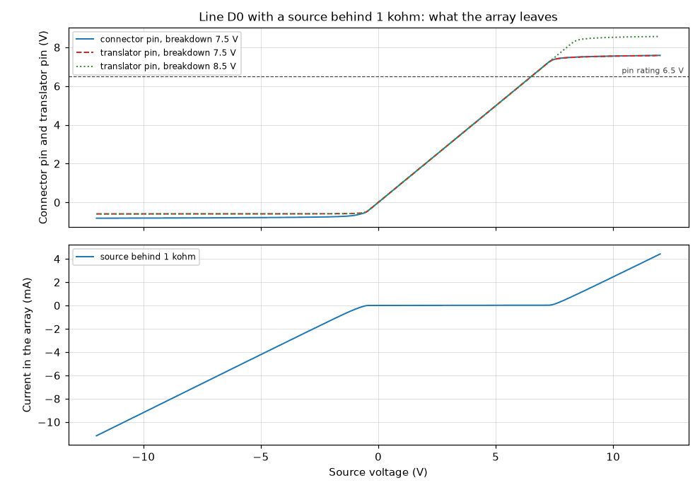

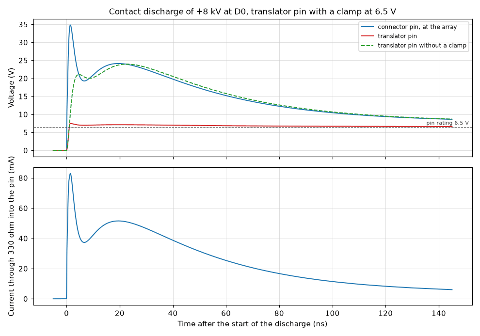

Notes:

- The specification states no withstand voltage for the logic port; the limits
  here are the ratings of the parts. A line that stands at +12 V leaves 7.5 V to
  8.5 V and more at the translator pin, above its 6.5 V rating, whatever the
  source resistance: the array starts to conduct only above the rating of the
  pin, and the 330 ohm drop nothing while the pin takes no current. The array
  itself has no rating for a steady current; from a stiff source it carries
  amperes. The range of a line is 0 V to 5.5 V.
- At -12 V the array carries the current of the source and the translator pin
  sees about -0.7 V behind 330 ohm; its clamp current stays below 50 mA.
- The discharge is the current waveform of IEC 61000-4-2 for 8 kV (30 A at the
  first peak, 16 A at 30 ns, 8 A at 60 ns), written from the figures of the
  standard as they are commonly quoted; the standard was not read for this
  bench. No inductance of the array, of its ground path or of the tracks is in
  the circuit, so the first peak at the connector is lower than the 145 V that
  the datasheet of the array shows on its test board.
- What the translator pin does above 6.5 V is not in its datasheet. With a clamp
  at 6.5 V (assumption) it takes the current that the specification estimates;
  without one it would stand at the voltage of the array for tens of
  nanoseconds. The pin has passed a human body test of 4 kV, which puts 30 times
  that current through it.

Models. written here: DIGITAL_LVC8T245, DIGITAL_TPD4E1U06.

Decks: [logic-abuse.1k.cir](logic-abuse.1k.cir),
[logic-abuse.minus.cir](logic-abuse.minus.cir),
[logic-abuse.plus-clamped.cir](logic-abuse.plus-clamped.cir).

## `digital/logic-input`

**A logic input: edge, levels, open line, load on the device under test.**

One line of the logic port is driven from the connector to the register. The
supply of the user side is set to five values from 1.65 V to 5.5 V. Line D0 gets
a clean edge of that height at the connector; the edge at the translator pin
behind 330 ohm is read with the largest pin capacitance, and the delay to the
register input with the largest delay of the translator. Lines D1 and D2 are
open and carry the leakage limit of the translator pin, 1 uA and 2 uA. Line D3
is held high and the current that the device under test gives is read. A last
run takes the supply of the user side away and holds all eight lines at 5 V.

Answers: section 4.8 (D-50, D-79), section 4.7, requirement R-10.

| Figure | Simulated | Specification | Limits | Verdict | Source |
| --- | --- | --- | --- | --- | --- |
| 1.65 V: edge at the translator pin, 10 % to 90 %, per volt | 5.5 ns/V | | at most 20 ns/V | pass | section 4.8: the translator allows 20 ns/V (datasheet) |
| 1.65 V: time between the low and the high input level, per volt | 4.126 ns/V | | at most 20 ns/V | pass | section 4.8: the translator allows 20 ns/V (datasheet) |
| 1.65 V: edge at the connector to a valid level at the register, slower edge | 10.15 ns | | at most 10 µs | pass | section 12, test of R-10: edges aligned with the current within one sample, 10 us |
| Open line with 1 uA of pin leakage: level at the translator pin | 471.7 mV | 470 mV (+0.36 %) | at most 577.5 mV | pass | section 4.8: 0.47 V against a low level of 0.58 V at 1.65 V |
| Line held high at 1.65 V: current from the device under test | 3.508 µA | 3.5 µA (+0.23 %) | 3.395 µA to 3.605 µA | pass | section 4.8: the voltage across 470 kohm (calculated) |
| 1.8 V: edge at the translator pin, 10 % to 90 %, per volt | 5.041 ns/V | 9.2 ns/V (-45.20 %) | at most 20 ns/V | pass | section 4.8: the translator allows 20 ns/V (datasheet) |
| 1.8 V: time between the low and the high input level, per volt | 3.778 ns/V | | at most 20 ns/V | pass | section 4.8: the translator allows 20 ns/V (datasheet) |
| 1.8 V: edge at the connector to a valid level at the register, slower edge | 10.15 ns | | at most 10 µs | pass | section 12, test of R-10: edges aligned with the current within one sample, 10 us |
| 3.3 V: edge at the translator pin, 10 % to 90 %, per volt | 2.752 ns/V | 5 ns/V (-44.96 %) | at most 10 ns/V | pass | section 4.8: the translator allows 10 ns/V (datasheet) |
| 3.3 V: time between the low and the high input level, per volt | 1.792 ns/V | | at most 10 ns/V | pass | section 4.8: the translator allows 10 ns/V (datasheet) |
| 3.3 V: edge at the connector to a valid level at the register, slower edge | 9.051 ns | | at most 10 µs | pass | section 12, test of R-10: edges aligned with the current within one sample, 10 us |
| Open line with 2 uA of pin leakage against the low level at 3.3 V | 942.2 mV | 940 mV (+0.24 %) | | | section 4.8 states no limit here; the low level is 0.8 V |
| Line held high at 3.3 V: current from the device under test | 7.016 µA | 7 µA (+0.23 %) | 6.79 µA to 7.21 µA | pass | section 4.8: the voltage across 470 kohm (calculated) |
| 5 V: edge at the translator pin, 10 % to 90 %, per volt | 1.814 ns/V | 3.3 ns/V (-45.02 %) | at most 5 ns/V | pass | section 4.8: the translator allows 5 ns/V (datasheet) |
| 5 V: time between the low and the high input level, per volt | 1.399 ns/V | | at most 5 ns/V | pass | section 4.8: the translator allows 5 ns/V (datasheet) |
| 5 V: edge at the connector to a valid level at the register, slower edge | 8.945 ns | | at most 10 µs | pass | section 12, test of R-10: edges aligned with the current within one sample, 10 us |
| Open line with 2 uA of pin leakage against the low level at 5 V | 942.1 mV | 940 mV (+0.22 %) | at most 1.5 V | pass | section 4.8: at 2 uA an open line reads 0 only from 4.5 V on |
| Line held high at 5 V: current from the device under test | 10.63 µA | 10.6 µA (+0.29 %) | 10.28 µA to 10.92 µA | pass | section 4.8: the voltage across 470 kohm (calculated) |
| 5.5 V: edge at the translator pin, 10 % to 90 %, per volt | 1.651 ns/V | | at most 5 ns/V | pass | section 4.8: the translator allows 5 ns/V (datasheet) |
| 5.5 V: time between the low and the high input level, per volt | 1.274 ns/V | | at most 5 ns/V | pass | section 4.8: the translator allows 5 ns/V (datasheet) |
| 5.5 V: edge at the connector to a valid level at the register, slower edge | 8.947 ns | | at most 10 µs | pass | section 12, test of R-10: edges aligned with the current within one sample, 10 us |
| User side without supply, all lines at 5 V: highest level at the register | 34.01 µV | | at most 990 mV | pass | sections 4.7 and 4.8: all eight bits read 0 |
| User side without supply: current that one line at 5 V takes | 10.63 µA | 10.6 µA (+0.28 %) | at most 12.6 µA | pass | section 4.8: 10.6 uA in the pull-down; 2 uA of pin leakage allowed (TI SCES584D, page 9), which the model does not have |

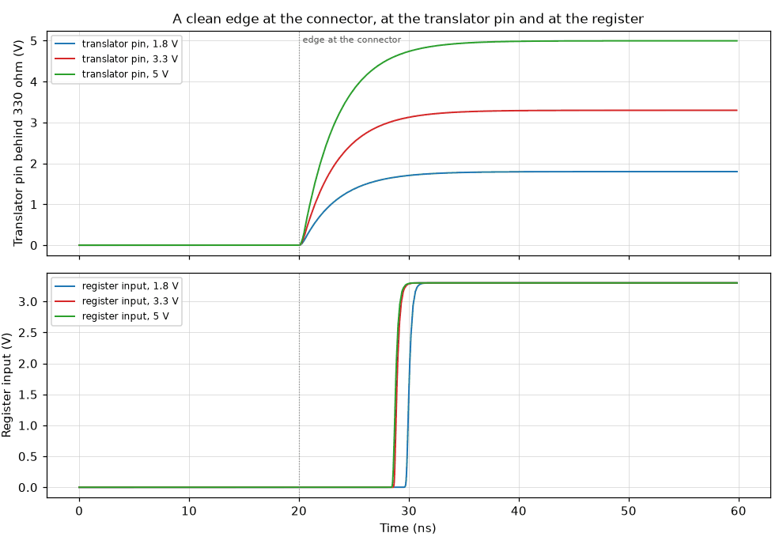

Notes:

- The device under test is an ideal source with an edge of 0.5 ns: cable, source
  resistance and ringing are not in this circuit, and a slower edge of the
  device under test adds to the figures.
- The edge rates use the largest pin capacitance, 10 pF, and the delay the
  largest delay of the translator. The specification takes four to five time
  constants for the whole swing; this bench reads the 10 % to 90 % time, which
  is 2.2 time constants over 80 % of the swing, so its figures are about half of
  the stated ones.
- The threshold of the translator model is half its supply, an assumption inside
  the input levels of the datasheet. The open-line figures are compared with the
  highest low level, which does not depend on it.
- The leakage of an open line is a source of 1 uA and 2 uA at the translator
  pin, the limits of the datasheet; the arrays have no leakage in their model,
  so the load on a device under test is the pull-down alone.

Models. written here: DIGITAL_LV165A, DIGITAL_LVC8T245, DIGITAL_TPD4E1U06.

Decks: [logic-input.3p3v.cir](logic-input.3p3v.cir),
[logic-input.unpowered.cir](logic-input.unpowered.cir).

## `digital/module-supply`

**The 5 V of the controller module against the 5 V rail: which way current
flows.**

The supply pins of the module meet the 5 V rail through JP1 and D1. The module
is its Schottky diode from VBUS to VSYS, its VBUS sense divider and a load of
0.1 W. Four cases: the USB-C input alone (the rail stands, no cable at the
module), the cable of the module alone with the rail fed through the jumper, the
same with the jumper cut, and both cables. In the second case the rail voltage
is stepped around the voltage of the cable, to show how the two diodes share the
current of the module.

Answers: section 4.11 (D-42, D-47), section 5.

| Figure | Simulated | Specification | Limits | Verdict | Source |
| --- | --- | --- | --- | --- | --- |
| USB-C alone: voltage at the VSYS pin of the module | 4.766 V | | at least 4.25 V | pass | section 4.11: the module is supplied through the diode D1; Pico 2 datasheet: 1.8 V to 5.5 V at VSYS |
| USB-C alone: voltage at the VBUS pin of the module | 17.31 µV | | at most 100 mV | pass | section 4.11: the carrier does not feed the VBUS pin |
| USB-C alone: level at the VBUS sense pin of the module, GP24 | 11.09 µV | | at most 800 mV | pass | section 4.11: expected to read low (estimate) |
| Cable alone, rail 0.1 V below the cable: current that D1 gives the module | 20.7 mA | | | | section 4.11: with the data cable alone the module is supplied from its own connector |
| Cable alone, rail 0.1 V below the cable: current through the diode of the module | 726.9 µA | | | | section 4.11: with the data cable alone the module is supplied from its own connector |
| Cable alone, rail at 4.0 V: current from the module back into the rail | 4.567 µA | | at most 50 µA | pass | section 4.11: neither input feeds the other one back; 50 uA is the largest reverse current of D1 (datasheet) |
| Jumper cut, module powered, typical reverse current of D1: level of the 5 V rail | 84.83 mV | | | | section 4.11: 0.5 V or below with the largest reverse current of 50 uA at 25 C (calculated) |
| Jumper cut, module powered, largest reverse current of D1: level of the 5 V rail | 506.8 mV | 500 mV (+1.36 %) | at most 500 mV | **FAIL** | section 4.11: 0.5 V or below with the largest reverse current of 50 uA at 25 C (calculated) |
| Both cables: smallest current through the diode of the module, cable 4.4 V to 5.5 V | -39.58 nA | | at least -1 µA | pass | section 4.11: neither input feeds the other one back |
| Both cables: smallest current through D1, cable 4.4 V to 5.5 V | -3.783 µA | | at least -50 µA | pass | section 4.11: neither input feeds the other one back; 50 uA is the largest reverse current of D1 (datasheet) |
| Both cables: cable voltage above which the module takes more from its own diode | 5.194 V | | | | the two diodes hand the module over where their drops match |

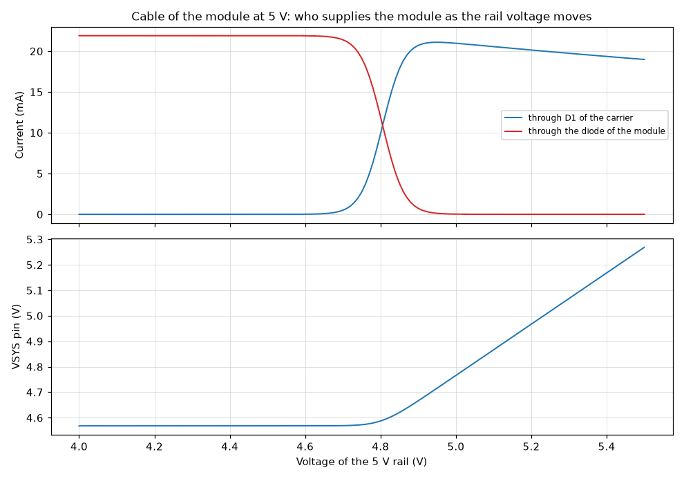

Notes:

- The module is a model of its supply side from the figure of its datasheet: a
  Schottky diode PMEG6010ELR from VBUS to VSYS, 5.6 kohm and 10 kohm from VBUS
  to ground with the sense pin between them, and a load of 0.1 W behind VSYS
  (assumption).
- The limiter U3 and the multiplexer U5 between the jumper and the rail are
  parts of the power input and are not in this circuit: the rail is an ideal
  source. The multiplexer blocks current from the rail back to the node of the
  jumper (datasheet), which this bench takes as given.
- With the cable of the module alone and the jumper closed, the diode D1 of the
  carrier has the lower drop: most of the current of the module then flows
  through the limiter and the multiplexer of the carrier and back through D1,
  not through the diode of the module. Nothing flows backward in any case; the
  module keeps its own path if the rail falls.
- The reverse current of D1 is a model fitted to the typical and to the largest
  value of its datasheet at 25 C. At 100 C the datasheet states 1 mA typical:
  with the jumper cut the rail then rises until other loads of the rail take
  that current; they are not in this circuit.

Models. written here: DIGITAL_1N5819HW, DIGITAL_PICO2_SUPPLY.

Decks: [module-supply.cable-alone.cir](module-supply.cable-alone.cir),
[module-supply.jumper-cut-largest.cir](module-supply.jumper-cut-largest.cir),
[module-supply.usbc-alone.cir](module-supply.usbc-alone.cir).

## `digital/monitor-channels`

**Monitor channels at rest: scale, tolerance, input leakage, VIN at -20 V and
+20 V.**

Every channel of the monitor converter is read at rest. The sources of the eight
channels are ideal; the dividers, the filter capacitors, the temperature sensor
and the inputs of the converter come from the schematic. The voltage at each
converter input is compared with the scale of the specification. The run is
repeated with the resistors at the limits of their tolerance, with the input of
the module as the supply (the status line low), with the leakage of the
converter inputs at the limit of the datasheet in either direction, with VIN at
-20 V and +20 V, and at -20 C and 100 C for the temperature channel.

Answers: section 4.2 (D-80), rules F-11, F-12, F-26 and F-28, section 16.

| Figure | Simulated | Specification | Limits | Verdict | Source |
| --- | --- | --- | --- | --- | --- |
| Channel 0, ladder output: scale at the converter input | 0.4545 | 0.4545 (+0.01 %) | 0.4536 to 0.4554 | pass | section 4.2, table of the channels (calculated) |
| Channel 1, VIN: scale at the converter input | 0.02273 | 0.02273 (+0.00 %) | 0.02268 to 0.02277 | pass | section 4.2, table of the channels (calculated) |
| Channel 2, 5 V rail, USB-C in use: scale at the converter input | 0.4545 | 0.4545 (+0.01 %) | 0.4536 to 0.4554 | pass | section 4.2, table of the channels (calculated) |
| Channel 6, +12 V_A: scale at the converter input | 0.1754 | 0.1754 (+0.02 %) | 0.175 to 0.1758 | pass | section 4.2, table of the channels (calculated) |
| Channel 3, CC1 at 0.92 V: converter input | 920 mV | 920 mV (+0.00 %) | 918.2 mV to 921.8 mV | pass | section 4.2: times 1 behind 10 kohm |
| Channel 7, -4 V_A at -4.00 V: converter input | 333.3 mV | 335 mV (-0.50 %) | 331.6 mV to 338.3 mV | pass | section 4.2: 0.333 x V + 1.667 V |
| Channel 5, temperature sensor at 27 C: converter input | 770 mV | 770 mV (+0.00 %) | 762.3 mV to 777.7 mV | pass | Microchip DS20001942L: 500 mV and 10 mV per kelvin |
| Channel 2 with the input of the module in use: scale | 0.2524 | 0.2524 (+0.00 %) | 0.2519 to 0.2529 | pass | section 4.2 and rule F-11 (calculated) |
| Channel 2, USB-C in use, rail at 4.25 V, resistors at their limits: lowest reading | 1.911 V | 1.93 V (-1.00 %) | at least 1.67 V | pass | section 4.2 and rule F-11: band 1.93 V to 2.50 V, separated at 1.67 V |
| Channel 2, USB-C in use, rail at 5.50 V, resistors at their limits: highest reading | 2.527 V | 2.5 V (+1.09 %) | at most 2.5 V | **FAIL** | section 4.2: band up to 2.50 V; the converter reads up to 2.5 V |
| Channel 2, input of the module in use, rail at 5.50 V: highest reading | 1.409 V | 1.39 V (+1.37 %) | at most 1.67 V | pass | section 4.2 and rule F-11: band 1.07 V to 1.39 V, separated at 1.67 V |
| Channel 2, input of the module in use, rail at 4.25 V: lowest reading | 1.057 V | 1.07 V (-1.24 %) | | | section 4.2: band from 1.07 V |
| Channel 0, ladder output: largest change of the input with resistors at 1 % | 1.092 % | | | | section 4.2: the scale factors are calculated from nominal values |
| Channel 1, VIN: largest change of the input with resistors at 1 % | 1.973 % | | | | section 4.2: the scale factors are calculated from nominal values |
| Channel 2, 5 V rail: largest change of the input with resistors at 1 % | 1.092 % | | | | section 4.2: the scale factors are calculated from nominal values |
| Channel 6, +12 V_A: largest change of the input with resistors at 1 % | 1.66 % | | | | section 4.2: the scale factors are calculated from nominal values |
| Channel 7, -4 V_A: largest change of the input with resistors at 1 % | 8.696 % | | | | section 4.2: the scale factors are calculated from nominal values |
| Channel 0, ladder output: error of the reading with 1 uA of input leakage | 120 mV | | at most 100 mV | **FAIL** | rule F-28: channel 0 within 100 mV of the set-point; Microchip DS21298E, page 3: 1 uA at the most, 1 nA typical |
| Channel 1, VIN: error of the reading with 1 uA of input leakage | 430 mV | | at most 130 mV | **FAIL** | rule F-26: a true 0.8 V may read 0.67 V before calibration; Microchip DS21298E, page 3: 1 uA at the most, 1 nA typical |
| Channel 2, 5 V rail: error of the reading with 1 uA of input leakage | 120 mV | | | | rule F-12: limits of 4.25 V and 5.50 V; Microchip DS21298E, page 3: 1 uA at the most, 1 nA typical |
| Channel 6, +12 V_A: error of the reading with 1 uA of input leakage | 47.01 mV | | at most 600 mV | pass | rule F-12: window of 11.4 V to 12.6 V; Microchip DS21298E, page 3: 1 uA at the most, 1 nA typical |
| Channel 7, -4 V_A: error of the reading with 1 uA of input leakage | 200 mV | | at most 300 mV | pass | rule F-12: window of -4.3 V to -3.7 V; Microchip DS21298E, page 3: 1 uA at the most, 1 nA typical |
| VIN at -20 V, converter supplied: voltage at its input | -436.9 mV | -454.5 mV (+3.87 %) | -500 mV to 500 mV | pass | section 16: within 0.5 V of ground with -20 V and +20 V at VIN (rating 0.6 V beyond the rails, datasheet) |
| VIN at -20 V, converter without supply: voltage at its input | -436.9 mV | -454.5 mV (+3.87 %) | -500 mV to 500 mV | pass | section 16: within 0.5 V of ground with -20 V and +20 V at VIN (rating 0.6 V beyond the rails, datasheet) |
| VIN at +20 V, converter supplied: voltage at its input | 454.5 mV | 454.5 mV (+0.00 %) | -500 mV to 500 mV | pass | section 16: within 0.5 V of ground with -20 V and +20 V at VIN (rating 0.6 V beyond the rails, datasheet) |
| VIN at +20 V, converter without supply: voltage at its input | 436.9 mV | 454.5 mV (-3.87 %) | -500 mV to 500 mV | pass | section 16: within 0.5 V of ground with -20 V and +20 V at VIN (rating 0.6 V beyond the rails, datasheet) |
| Channel 5 at -20 C: converter input | 300 mV | 300 mV (+0.00 %) | 297 mV to 303 mV | pass | rule F-12: channel 5 between 0.3 V and 1.5 V |
| Channel 5 at 100 C: converter input | 1.5 V | 1.5 V (+0.00 %) | 1.485 V to 1.515 V | pass | rule F-12: channel 5 between 0.3 V and 1.5 V |

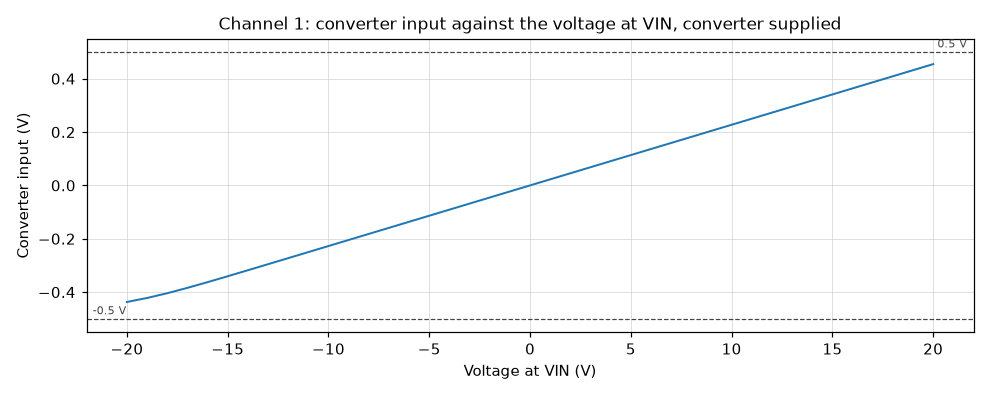

Notes:

- The converter model has the input structure of the datasheet and no error of
  its own: offset 3 LSB, gain 5 LSB and linearity 1 LSB at the most add to every
  figure here.
- The leakage of an analog input is 1 nA typical and 1 uA at the most
  (datasheet). The specification does not name it. At the limit it shifts
  channel 0 by more than the 100 mV of rule F-28 and channel 1 by more than the
  allowance of rule F-26, through the 54.5 kohm and 9.8 kohm of their dividers;
  at the typical value the shift is a thousand times smaller. Rule F-26 stores
  the offset of channel 1 at calibration; no rule does so for channel 0.
- With VIN at +20 V or -20 V the diodes of the converter input start to conduct
  a few microamperes and hold the input at about 0.42 V: the rating of 0.6 V is
  kept, and a current flows into the substrate or the supply of the converter
  that the datasheet does not rate.
- The CC pins and the status line are ideal sources; the resistors of the USB-C
  receptacle and the multiplexer are not in this circuit.

Models. written here: DIGITAL_INPUT_PIN, DIGITAL_MCP3208, DIGITAL_MCP9700A.

Decks: [monitor-channels.nominal.cir](monitor-channels.nominal.cir).

## `digital/monitor-sampling`

**Monitor converter while it samples: charge step, settling, edges of the slow
SPI bus.**

Three pads of the controller read the monitor converter over the slow SPI bus.
The frames are those of the converter datasheet at 500 kHz, through the 2.2 kohm
of RN1. First all eight channels are read in turn, 1.25 ms apart, for five
cycles of 10 ms, and the voltage that each sample holds is compared with the
voltage of its channel at rest. Then channel 0 alone is read at 100 SPS, at 1
kSPS and at 2 kSPS with a sampling capacitor that starts every sample from 0 V,
the worst case that the specification calculates with. The edges of the clock
are read at the converter.

Answers: section 4.2, section 5 (slow SPI bus), rules F-6 and F-10.

| Figure | Simulated | Specification | Limits | Verdict | Source |
| --- | --- | --- | --- | --- | --- |
| Scan of eight channels at 100 SPS: error of the sample of channel 0 | -0.8443 LSB | -0.97 LSB (+12.96 %) | -1.018 LSB to 1.018 LSB | pass | section 4.2 and rule F-10: 0.97 LSB at the sampled instant at 100 SPS (calculated for a capacitor that starts 2.5 V away) |
| Scan of eight channels at 100 SPS: error of the sample of channel 2 | -0.8412 LSB | | -1.018 LSB to 1.018 LSB | pass | section 4.2 and rule F-10: 0.97 LSB at the sampled instant at 100 SPS (calculated for a capacitor that starts 2.5 V away) |
| Scan of eight channels at 100 SPS: error of the sample of channel 7 | 0.7463 LSB | | -1.018 LSB to 1.018 LSB | pass | section 4.2 and rule F-10: 0.97 LSB at the sampled instant at 100 SPS (calculated for a capacitor that starts 2.5 V away) |
| Scan of eight channels at 100 SPS: largest sample error, channel 0 | 0.8443 LSB | | at most 1.018 LSB | pass | rule F-10: 0.97 LSB behind 54.5 kohm and 66.7 kohm |
| Clock at the converter behind 2.2 kohm, weakest pad: rise time, 10 % to 90 % | 156.6 ns | 156 ns (+0.41 %) | at most 179.4 ns | pass | section 5 and rule F-6: 156 ns (calculated); within 15 % |
| Clock at the converter, weakest pad: high level against the 4.7 kohm pull-down | 3.185 V | | at least 2.31 V | pass | Microchip DS21298E, page 3: 0.7 of the supply at the least |
| Clock at the converter at 500 kHz: time above its high level | 929.5 ns | | at least 500 ns | pass | Microchip DS21298E, page 3: 1 MHz at 2.7 V, half a period of 500 ns |
| Clock at the converter at 500 kHz: time below its low level | 944.9 ns | | at least 500 ns | pass | Microchip DS21298E, page 3: 1 MHz at 2.7 V, half a period of 500 ns |
| Channel 0 at 100 SPS, capacitor from 0 V each time: error of the sample | 0.9743 LSB | 0.97 LSB (+0.45 %) | 0.873 LSB to 1.067 LSB | pass | section 4.2 and rule F-10 (calculated); within 10 % |
| Channel 0 at 100 SPS: the same error as a voltage at the output | 1.308 mV | 1.3 mV (+0.65 %) | | | section 4.2: 1.3 mV at VOUT at 100 SPS |
| Channel 0 at 1000 SPS, capacitor from 0 V each time: error of the sample | 4.879 LSB | 4.9 LSB (-0.43 %) | 4.41 LSB to 5.39 LSB | pass | section 4.2 and rule F-10 (calculated); within 10 % |
| Channel 0 at 1000 SPS: the same error as a voltage at the output | 6.552 mV | | | | section 4.2: 1.3 mV at VOUT at 100 SPS |
| Channel 0 at 2000 SPS, capacitor from 0 V each time: error of the sample | 9.32 LSB | | | | rule F-10: more at the rate of the exception of rule F-33 (0.5 ms) |
| Channel 0 at 2000 SPS: the same error as a voltage at the output | 12.52 mV | | | | section 4.2: 1.3 mV at VOUT at 100 SPS |

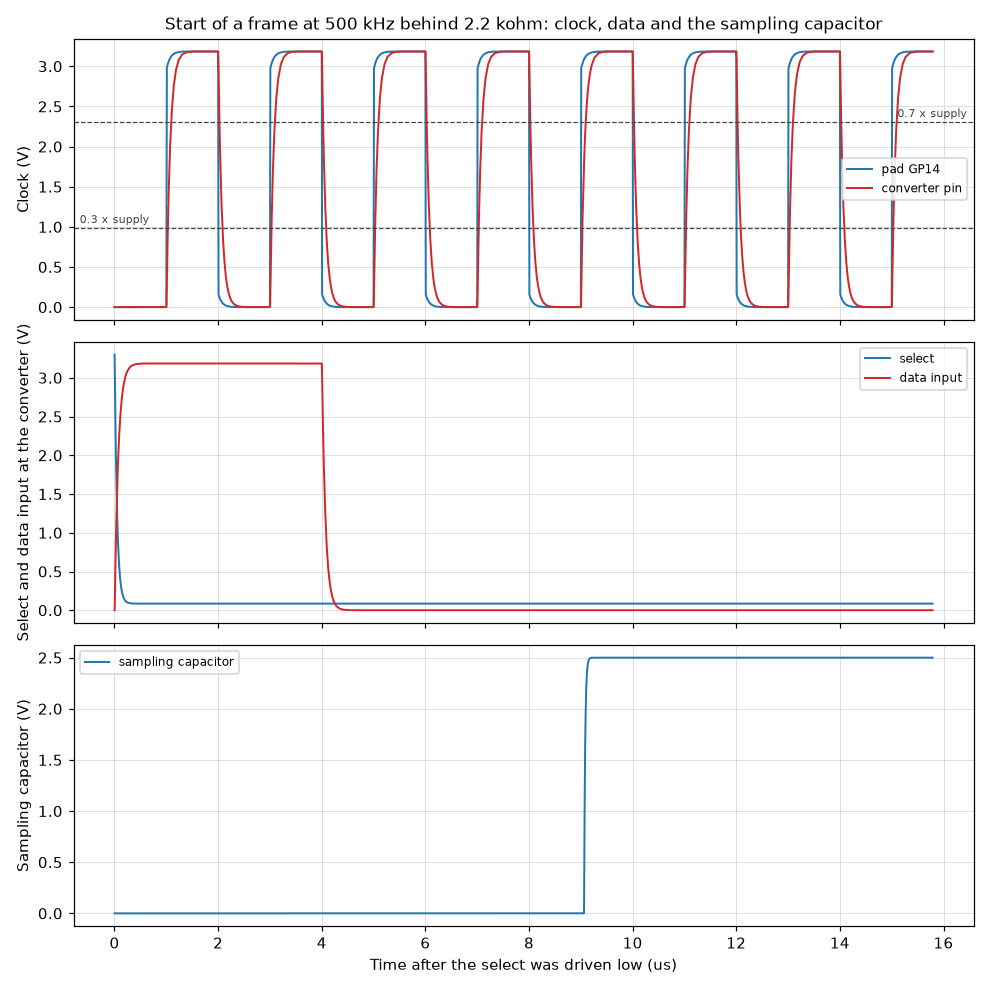

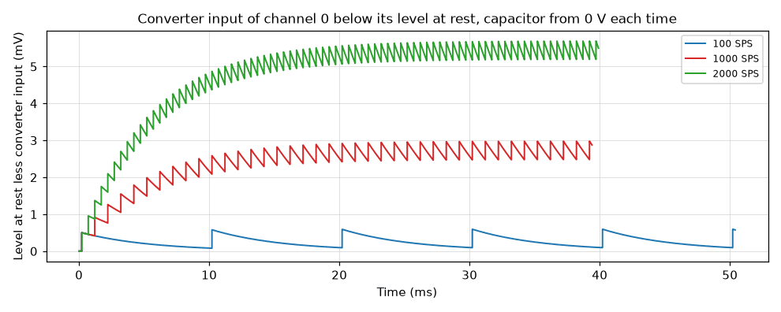

Notes:

- The sampling capacitor of the converter model keeps the voltage of the channel
  before: in a scan every sample then starts from its neighbor channel, which is
  less than the 2.5 V of the calculation of the specification. The runs with
  channel 0 alone set the capacitor to 0 V before every sample and repeat that
  calculation.
- The frames are 1.25 ms apart in the scan; the specification says 100 SPS per
  channel and not how the eight frames are placed in the 10 ms.
- The output of the converter is not in the model, so the line to the pad GP12
  is not judged. Each track of the bus has 10 pF (assumption); the pins have the
  10 pF of the datasheets.
- The pads are at the limit of the 4 mA setting, 170 ohm and 125 ohm.

Models. written here: DIGITAL_INPUT_PIN, DIGITAL_MCP3208, DIGITAL_MCP9700A.

Decks: [monitor-sampling.alone-1000sps.cir](monitor-sampling.alone-1000sps.cir),
[monitor-sampling.scan.cir](monitor-sampling.scan.cir).

## `digital/released-pins`

**Lines of the controller with its pins released, and the two status lines.**

Every line that the controller drives is left to its resistors. The circuit is
the pull resistor and the series resistor of each line, with pad models of the
controller in place of the module. First 120 uA is forced out of every released
pad, the current of erratum E9 as the specification takes it, and the level at
each receiver is read. Then pads of stepping A2 are driven high and released,
and the lines are followed as their resistors pull them through the range in
which that current flows. The two selects are read against the strongest
pull-down of a pad with the analog rail at its lower limit. PWR_GOOD is read at
the register and at the pad, and two pads that rule F-4 keeps as inputs are
driven by mistake.

Answers: section 4.11 (D-67, D-77, D-78), section 5, section 4.7, rules F-4 and
F-5.

| Figure | Simulated | Specification | Limits | Verdict | Source |
| --- | --- | --- | --- | --- | --- |
| GATE_R1 with 120 uA out of the released pad: level at the receiver | 120 mV | 120 mV (+0.00 %) | at most 800 mV | pass | section 5: still low for the receiver (calculated); the limit is the highest low level of its datasheet |
| GATE_R2 with 120 uA out of the released pad: level at the receiver | 120 mV | 120 mV (+0.00 %) | at most 800 mV | pass | section 5: still low for the receiver (calculated); the limit is the highest low level of its datasheet |
| GATE_R3 with 120 uA out of the released pad: level at the receiver | 120 mV | 120 mV (+0.00 %) | at most 800 mV | pass | section 5: still low for the receiver (calculated); the limit is the highest low level of its datasheet |
| GATE_OUT with 120 uA out of the released pad: level at the receiver | 120 mV | 120 mV (+0.00 %) | at most 800 mV | pass | section 5: still low for the receiver (calculated); the limit is the highest low level of its datasheet |
| GATE_SRC with 120 uA out of the released pad: level at the receiver | 120 mV | 120 mV (+0.00 %) | at most 800 mV | pass | section 5: still low for the receiver (calculated); the limit is the highest low level of its datasheet |
| GATE_AMP with 120 uA out of the released pad: level at the receiver | 564 mV | 560 mV (+0.71 %) | at most 800 mV | pass | section 5: still low for the receiver (calculated); the limit is the highest low level of its datasheet |
| MUX_A0 with 120 uA out of the released pad: level at the receiver | 612 mV | 610 mV (+0.33 %) | at most 800 mV | pass | section 5: still low for the receiver (calculated); the limit is the highest low level of its datasheet |
| MUX_A1 with 120 uA out of the released pad: level at the receiver | 612 mV | 610 mV (+0.33 %) | at most 800 mV | pass | section 5: still low for the receiver (calculated); the limit is the highest low level of its datasheet |
| ADC_SCK with 120 uA out of the released pad: level at the receiver | 564 mV | | at most 990 mV | pass | section 5: still low for the receiver (calculated); the limit is the highest low level of its datasheet |
| ADC_CNV with 120 uA out of the released pad: level at the receiver | 564 mV | | at most 990 mV | pass | section 5: still low for the receiver (calculated); the limit is the highest low level of its datasheet |
| SIDE_LOAD with 120 uA out of the released pad: level at the receiver | 564 mV | | at most 990 mV | pass | section 5: still low for the receiver (calculated); the limit is the highest low level of its datasheet |
| SPI_SCK with 120 uA out of the released pad: level at the receiver | 564 mV | | at most 660 mV | pass | section 5: still low for the receiver (calculated); the limit is the highest low level of its datasheet |
| SPI_MOSI with 120 uA out of the released pad: level at the receiver | 564 mV | | at most 660 mV | pass | section 5: still low for the receiver (calculated); the limit is the highest low level of its datasheet |
| SPI_MISO with 120 uA out of the released pad: level at the pad | 828 mV | 830 mV (-0.24 %) | | | section 5: the pad sees 6.9 kohm, inside the 8.2 kohm of the erratum |
| Stepping A2, pads released from high: highest level at a receiver (MUX_A0) | 16.1 nV | | at most 100 mV | pass | section 5: the gate, address and clock lines stand at 0 V |
| Stepping A2, pads released from high: slowest line is below its low level after | 47.97 ns | | | | RP2350 datasheet, erratum E9: 8.2 kohm or less overcomes the current |
| Stepping A2, SPI_MISO released from high: level left at the pad | 21.46 nV | | at most 800 mV | pass | section 5: 6.9 kohm from the pad to ground, inside the 8.2 kohm of the erratum |
| Select of the monitor converter, pad pull-down 36 kohm, rail at its lower limit | 2.861 V | 2.8 V (+2.16 %) | at least 2.8 V | pass | sections 4.11 and 5: 2.80 V or more against the strongest pad pull-down |
| Select of the DAC, pad pull-down 36 kohm, rail at its lower limit | 2.861 V | 2.8 V (+2.16 %) | at least 2.8 V | pass | sections 4.11 and 5: 2.80 V or more against the strongest pad pull-down |
| The same select against the high level that the converters ask for | 596.7 mV | | at least 0 V | pass | section 5: the converters need 0.7 of their supply (datasheet) |
| PWR_GOOD high, pad pull-down off: level at the register over the 3.3 V rail | 0.8193 | 0.82 (-0.09 %) | at least 0.7 | pass | section 4.7: 0.82 of the rail against the 0.7 that the register needs |
| PWR_GOOD high, pad pull-down of 36 kohm on: level at the register over the rail | 0.7929 | 0.79 (+0.37 %) | at least 0.7 | pass | section 4.7: 0.79 with the pad pull-down of GP28 on |
| PWR_GOOD high, pull-down on, rail at 3.234 V: level at the pad GP28 | 2.495 V | 2.5 V (-0.20 %) | at least 2 V | pass | sections 4.7 and 4.11: 2.50 V at the pin against the 2.0 V it needs |
| GP28 driven high by mistake while the flag is low: current through R4 | 2.821 mA | 3.3 mA (-14.53 %) | at most 25 mA | pass | section 4.7 and rule F-4: 3.3 mA against 25 mA at the comparator outputs |
| GP11 driven high against a low detector: the interlock node rises to | 66.4 mV | 140 mV (-52.57 %) | at most 140 mV | pass | section 4.7 and rule F-4: a pin moves the node by 0.14 V at the most |
| GP11 driven low against a high detector: the interlock node falls by | 67.01 mV | 140 mV (-52.14 %) | at most 140 mV | pass | section 4.7 and rule F-4: a pin moves the node by 0.14 V at the most |

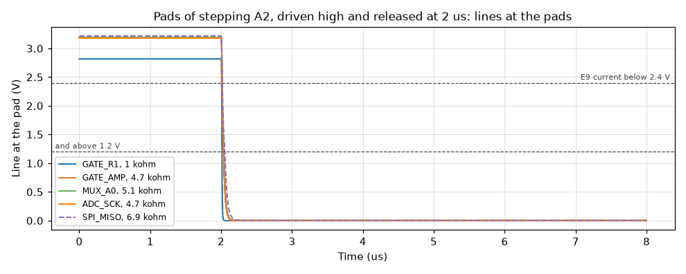

Notes:

- The receivers are not in this circuit: the gate drivers, the multiplexer, the
  converters and the registers take 1 uA to 10 uA at an input by their
  datasheets, which adds millivolts to the levels.
- The 120 uA of the first run is the worst case of the specification: the
  current flows at any pad voltage. The figure of the datasheet shows it only
  between 1.2 V and 2.4 V; with that curve a line that is released from high is
  pulled through the range and rests at 0 V, as the second run shows.
- The pad capacitance of 5 pF and the output resistance of the detector (100 ohm
  in the comparator model of this repository) are assumptions.
- SMU_ON has no resistor on the controller side of its transistor and is not in
  this bench; the console lines have none either.

Models. written here: MCP656X.

Decks: [released-pins.forced.cir](released-pins.forced.cir),
[released-pins.mistake.cir](released-pins.mistake.cir),
[released-pins.released.cir](released-pins.released.cir).

## `digital/side-data`

**Side data chain: load pulse, shift and the sixteen bits at the controller.**

The two registers are loaded and shifted by the frame of rule F-34. The load
line is low for three system clocks at the rising edge of convert-start; sixteen
clocks later shift the sixteen bits to the pad GP17 through R138, while the
converter shifts its word to GP16. The pulse widths are read at the pins of the
registers and compared with the times that their datasheet asks for. The two
words are read back at the pads, with 16 and with 10 system clocks per bit, with
everything slow, everything fast and a middle case. A last run releases the
pads.

Answers: section 4.7 (D-41), rule F-34.

| Figure | Simulated | Specification | Limits | Verdict | Source |
| --- | --- | --- | --- | --- | --- |
| 9.375 MHz: load pin of the registers below its low level for | 17.93 ns | 20 ns (-10.35 %) | at least 9 ns | pass | rule F-34: three clocks; TI SCLS402R, page 6: 9 ns at the least |
| 9.375 MHz: clock pin of the registers above its high level for | 45.02 ns | | at least 7 ns | pass | TI SCLS402R, page 6: clock pulse 7 ns at the least |
| 9.375 MHz: clock pin of the registers below its low level for | 48.96 ns | | at least 7 ns | pass | TI SCLS402R, page 6: clock pulse 7 ns at the least |
| 9.375 MHz: first side bit valid at the pad after the load began | 21.81 ns | | at most 773.3 ns | pass | rule F-34: the first rising clock edge comes after the conversion |
| 9.375 MHz: bits read wrong at the two pads in three runs, of 96 | 0 | | at most 0 | pass | section 4.7: one word per sample holds the result and its side bits |
| 9.375 MHz: the pads are read before the rising clock edge by | 13.56 ns | | | | the middle of the window that a weak and a strong board share |
| 15 MHz: load pin of the registers below its low level for | 17.93 ns | 20 ns (-10.35 %) | at least 9 ns | pass | rule F-34: three clocks; TI SCLS402R, page 6: 9 ns at the least |
| 15 MHz: clock pin of the registers above its high level for | 24.98 ns | | at least 7 ns | pass | TI SCLS402R, page 6: clock pulse 7 ns at the least |
| 15 MHz: clock pin of the registers below its low level for | 29.01 ns | | at least 7 ns | pass | TI SCLS402R, page 6: clock pulse 7 ns at the least |
| 15 MHz: first side bit valid at the pad after the load began | 21.81 ns | | at most 753.3 ns | pass | rule F-34: the first rising clock edge comes after the conversion |
| 15 MHz: bits read wrong at the two pads in three runs, of 96 | 0 | | at most 0 | pass | section 4.7: one word per sample holds the result and its side bits |
| 15 MHz: the pads are read before the rising clock edge by | 3.681 ns | | | | the middle of the window that a weak and a strong board share |
| Pads released: load line of the registers | 15.51 nV | | at most 990 mV | pass | section 4.7: its pull-down keeps the registers loading |
| Pads released: side data line shows the input D7 of U34 (high in this run) | 3.3 V | | at least 2 V | pass | section 4.7: with the load line low the registers follow their inputs |

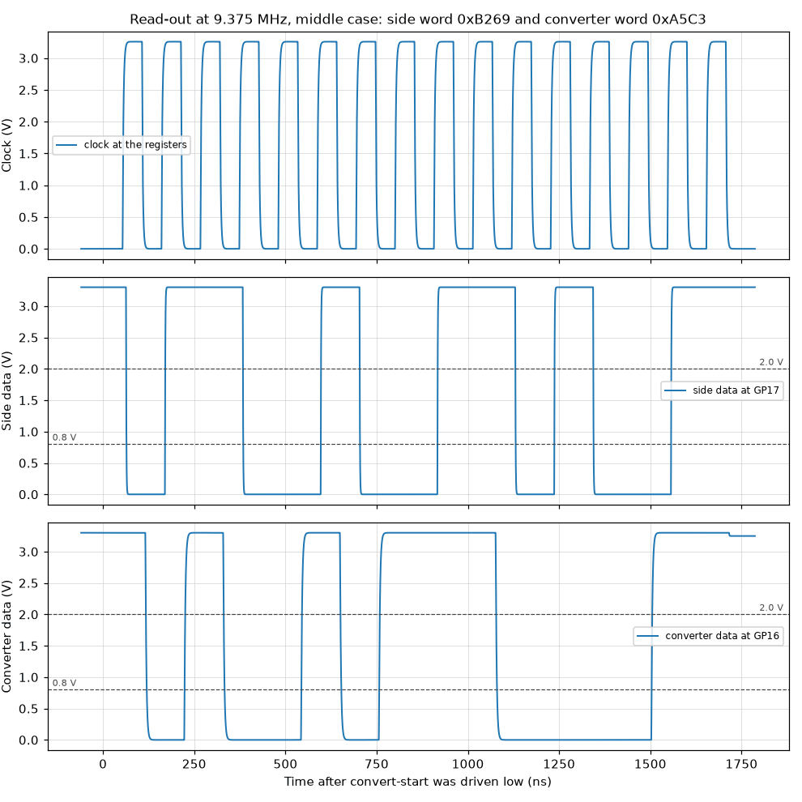

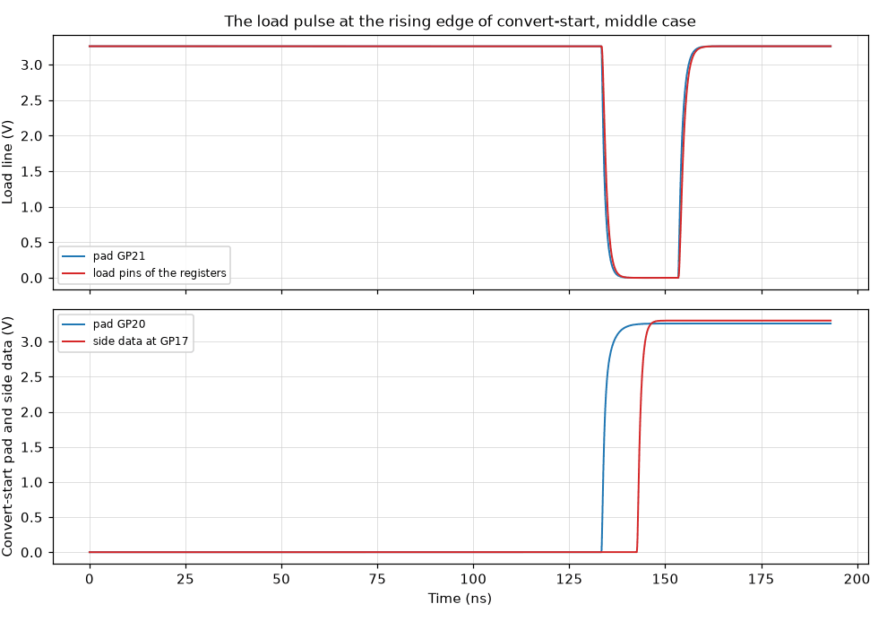

Notes:

- The first side bit is the input D7 of U34, MUX_A1; the sixteenth is D0 of U33,
  DIN0. The side word of the runs is 0xB269 and the converter word 0xA5C3, so
  that neighbors differ in both.
- The pads are read at one instant per bit, in the middle of the window that the
  bench converter-lines finds. A program of the controller reads on a grid of
  6.7 ns and through a synchronizer; where that instant falls is not decided
  yet.
- The register model does not check its own timing; the pulse widths are read at
  its pins and compared with its datasheet. Data inputs that change during a
  load are not in these runs: the inputs are held.

Models. written here: DIGITAL_ADS8860_IO, DIGITAL_LV165A.

Decks: [side-data.typical-16.cir](side-data.typical-16.cir).

## `digital/translator-supply`

**Supply of the user side of the translator: clamp levels, drop at rest, sag.**

The translator supply is taken from the buffer output through R118 and D24.
First the buffer output is stepped from -4 V to +12 V, the two rails it can
stand at, and the voltage at the supply pin of the translator is read: at 27 C
and at 0 C, with the clamp at its typical and at its largest forward voltage,
with 470 ohm in place of the 1 kohm, and with the 5 V rail at the upper end of
its clamp. The same sweep gives the drop at rest between the output voltage and
the pin. Then eight logic lines are driven in step at 1 MHz and at 10 MHz and
the sag of the pin is read.

Answers: section 4.8 (D-72), requirement R-10.

| Figure | Simulated | Specification | Limits | Verdict | Source |
| --- | --- | --- | --- | --- | --- |
| Buffer at -4 V, 27 C: supply pin of the translator | -317.9 mV | -400 mV (+20.52 %) | at least -405 mV | pass | section 4.8: not below -0.40 V (simulated at 0 C and at 27 C) |
| Buffer at -4 V, 0 C: supply pin of the translator | -355.9 mV | -400 mV (+11.02 %) | at least -405 mV | pass | section 4.8: not below -0.40 V (simulated at 0 C and at 27 C) |
| Buffer at -4 V, 0 C, clamp at its largest forward voltage: supply pin | -396 mV | | at least -500 mV | pass | section 4.8: inside the -0.5 V of the part (datasheet) |
| Buffer at -4 V, 0 C, 470 ohm in place of R118, typical clamp: supply pin | -378.5 mV | -440 mV (+13.99 %) | | | section 4.8: 470 ohm gives -0.44 V at 0 C (simulated) |
| Buffer at -4 V, 0 C, 470 ohm, clamp at its largest forward voltage: supply pin | -421.3 mV | -440 mV (+4.25 %) | -460 mV to -420 mV | pass | section 4.8: 470 ohm gives -0.44 V at 0 C (simulated); within 20 mV |
| Buffer at +12 V, 5 V rail at 5.00 V: supply pin above the rail | 336.9 mV | 400 mV (-15.78 %) | at most 405 mV | pass | section 4.8: not above the 5 V rail plus 0.4 V (simulated) |
| Buffer at +12 V, 0 C, 5 V rail at 5.00 V: supply pin above the rail | 373.6 mV | 400 mV (-6.60 %) | at most 405 mV | pass | section 4.8: not above the 5 V rail plus 0.4 V (simulated) |
| Buffer at +12 V, 5 V rail at 5.61 V: supply pin | 5.944 V | 6 V (-0.94 %) | at most 6.05 V | pass | section 4.8: 6.0 V at the most (calculated) |
| Buffer at +12 V, 0 C, clamp at its largest forward voltage, rail at 5.61 V | 6.026 V | | at most 6.5 V | pass | section 4.8: inside the 6.5 V of the part (datasheet) |
| Buffer at -4 V: current that R118 carries into the clamp | 3.682 mA | | at most 200 mA | pass | onsemi BAT54SLT1/D, page 1: 200 mA forward current |
| Buffer at +12 V: current that R118 carries into the 5 V rail | 6.663 mA | | at most 200 mA | pass | onsemi BAT54SLT1/D, page 1: 200 mA forward current |
| Output at 1.67 V, lines at rest, leakiest clamp: drop to the pin | 8 mV | 10 mV (-20.00 %) | at most 10.5 mV | pass | section 4.8 and requirement R-10: up to 10 mV (calculated) |
| Output at 3.3 V, lines at rest, leakiest clamp: drop to the pin | 8 mV | 10 mV (-20.00 %) | at most 10.5 mV | pass | section 4.8 and requirement R-10: up to 10 mV (calculated) |
| Output at 5 V, lines at rest, leakiest clamp: drop to the pin | 9.391 mV | 10 mV (-6.09 %) | at most 10.5 mV | pass | section 4.8 and requirement R-10: up to 10 mV (calculated) |
| Supply pin with the output at 1.67 V | 1.662 V | | at least 1.65 V | pass | requirement R-10: 1.65 V at the translator for an output of 1.67 V |
| Eight lines at 1 MHz from 1.8 V: sag of the supply pin | 28.21 mV | 30 mV (-5.97 %) | 21 mV to 39 mV | pass | section 4.8: about this value (calculated); limits of 30 % here |
| Eight lines at 1 MHz from 5 V: sag of the supply pin | 116.9 mV | 120 mV (-2.60 %) | 84 mV to 156 mV | pass | section 4.8: about this value (calculated); limits of 30 % here |
| Eight lines at 10 MHz from 1.8 V: sag of the supply pin | 247.2 mV | 300 mV (-17.59 %) | 210 mV to 390 mV | pass | section 4.8: about this value (calculated); limits of 30 % here |
| Eight lines at 10 MHz from 5 V: sag of the supply pin | 965.4 mV | 1.2 V (-19.55 %) | 840 mV to 1.56 V | pass | section 4.8: about this value (calculated); limits of 30 % here |

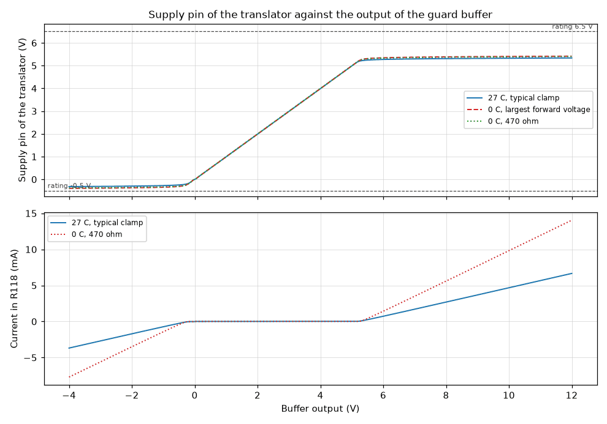

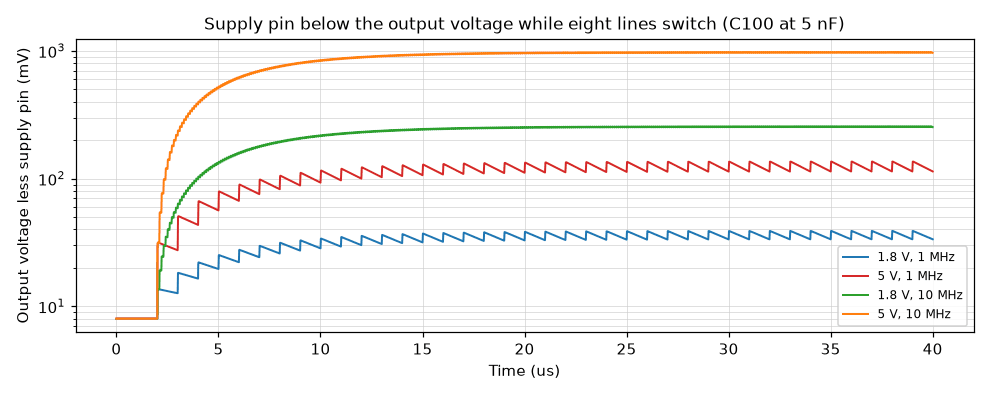

Notes:

- The guard buffer is an ideal source at the level asked: its own output
  resistance and its current limit are not in this circuit, so the clamp
  currents are upper values. The 5 V rail is an ideal source that takes the
  clamp current.
- The supply current of the translator at rest is the 8 uA maximum of its
  datasheet. The charge that an input edge costs is its typical
  power-dissipation capacitance, 2 pF at 1.8 V and 3 pF at 5 V; the datasheet
  gives no maximum.
- In the sag runs C100 is at a twentieth of its value, so that the supply
  settles within 40 us; the mean sag does not depend on it, the ripple does. At
  10 MHz from 5 V the supply settles about 1 V lower and the charge per edge
  falls with it, which the arithmetic of the specification leaves out.
- The figures of the specification were simulated with a clamp fitted to the
  largest forward voltage; the typical clamp of this bench holds the pin 40 mV
  to 80 mV closer to ground and to the rail.

Models. written here: DIGITAL_BAT54S, DIGITAL_BAT54S_HI, DIGITAL_BAT54S_LEAKY,
DIGITAL_LVC8T245.

Decks: [translator-supply.sag-5v-1mhz.cir](translator-supply.sag-5v-1mhz.cir),
[translator-supply.typical-27c.cir](translator-supply.typical-27c.cir).

## `digital/unpowered-inputs`

**Controller lines driven high into parts that have no supply.**

Pads of the controller are driven high while the supervisor holds the carrier
off. Three circuits. In the first the clock, convert-start and load lines go
high into the converter and the registers; the logic rail has only the discharge
of its regulator and its capacitors. In the second the two selects, and then
also the clock and the data line of the slow SPI bus, go high into the monitor
converter and the DAC with the analog rail dead. In the third a gate line and an
address line go high with +12 V_A at 0 V. Each is run with nominal values and at
the tolerance limits that the specification calculates with.

Answers: sections 4.6, 4.11 and 5 (D-75, D-77), rules F-2 and F-7.

| Figure | Simulated | Specification | Limits | Verdict | Source |
| --- | --- | --- | --- | --- | --- |
| weakest pad of the 4 mA setting: current into the clock pin of the converter, rail still empty | 5.736 mA | 6 mA (-4.41 %) | at most 11.3 mA | pass | sections 4.6 and 5: 6 mA to 10 mA with nominal values, 11.3 mA at the tolerance limits (calculated) |
| weakest pad of the 4 mA setting: current into the clock pin once the rail has risen | 2.877 mA | | | | rule F-7: the series resistors bound the state |
| weakest pad of the 4 mA setting: current into the convert-start pin, rail still empty | 5.736 mA | | at most 11.3 mA | pass | section 5: the two clock inputs of the converter |
| strong pad: current into the clock pin of the converter, rail still empty | 8.504 mA | 10 mA (-14.96 %) | at most 11.3 mA | pass | sections 4.6 and 5: 6 mA to 10 mA with nominal values, 11.3 mA at the tolerance limits (calculated) |
| strong pad: current into the clock pin once the rail has risen | 3.508 mA | | | | rule F-7: the series resistors bound the state |
| pad without resistance, resistors 5 % low, 3.366 V: current into the clock pin of the converter, rail still empty | 10.19 mA | 11.3 mA (-9.79 %) | at most 11.3 mA | pass | sections 4.6 and 5: 6 mA to 10 mA with nominal values, 11.3 mA at the tolerance limits (calculated) |
| pad without resistance, resistors 5 % low, 3.366 V: level to which the two lines lift the logic rail | 1.718 V | 1.6 V (+7.39 %) | 1.2 V to 2 V | pass | rule F-2: 3V3_C lifted to about 1.6 V (calculated); within 25 % |
| Both selects driven high: level at which they hold the dead analog rail | 730.1 mV | 760 mV (-3.93 %) | 680 mV to 840 mV | pass | rule F-7: 0.76 V, above the 0.7 V the converter needs before it is powered again (calculated); within 10 % |
| Clock of the slow bus high, tolerance limits: current through 2.2 kohm, rail empty | 1.338 mA | 1.39 mA (-3.74 %) | at most 1.39 mA | pass | sections 4.11 and 5 and rule F-2: 1.39 mA into a slow SPI input (calculated) |
| Select of the DAC high, tolerance limits: current into its pin, rail still empty | 1.796 mA | 1.9 mA (-5.49 %) | at most 2 mA | pass | section 5 and rule F-2: 1.90 mA against the 2 mA of the datasheet |
| Gate and address line high, nominal values: current into the two inputs together | 5.295 mA | 5.4 mA (-1.94 %) | at most 5.8 mA | pass | sections 4.11 and 5: 2.7 mA per input, 2.9 mA at the limits (calculated) |
| Gate and address line high, limit values: current into the two inputs together | 5.478 mA | 5.8 mA (-5.55 %) | at most 5.8 mA | pass | sections 4.11 and 5: 2.7 mA per input, 2.9 mA at the limits (calculated) |

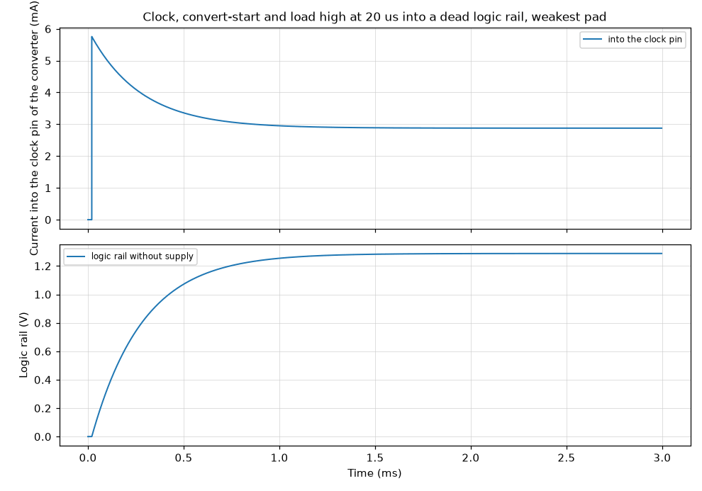

Notes:

- The inputs of the converter, of the monitor converter, of the DAC, of the gate
  driver and of the multiplexer are a capacitance and a diode to each rail, 0.6
  V at 1 mA: their datasheets rate the pins a few tenths of a volt beyond the
  supply and give no curve. The specification calculates with 0.5 V to 0.6 V; a
  softer diode gives less current.
- A rail without supply is the discharge of its regulator, 230 ohm (datasheet),
  its capacitors and, on the logic rail, the divider of PWR_GOOD. Every other
  load of the rails is left out, so the rails rise higher here than on the
  board. The registers take no current: their inputs have no diode to the
  supply.
- The first values are read 2 us after the pads went high, when the pin
  capacitances are charged and the capacitors of the rail are still empty; after
  about a millisecond the rail has risen and the currents are lower.
- These states are the ones rules F-2 and F-7 forbid; the bench shows what the
  resistors leave if firmware fails to keep them.

Models. written here: DIGITAL_ADS8860_IO, DIGITAL_INPUT_PIN, DIGITAL_LP5907_OFF,
DIGITAL_LV165A, DIGITAL_MCP3208.

Decks: [unpowered-inputs.logic-weak.cir](unpowered-inputs.logic-weak.cir),
[unpowered-inputs.selects.cir](unpowered-inputs.selects.cir).
