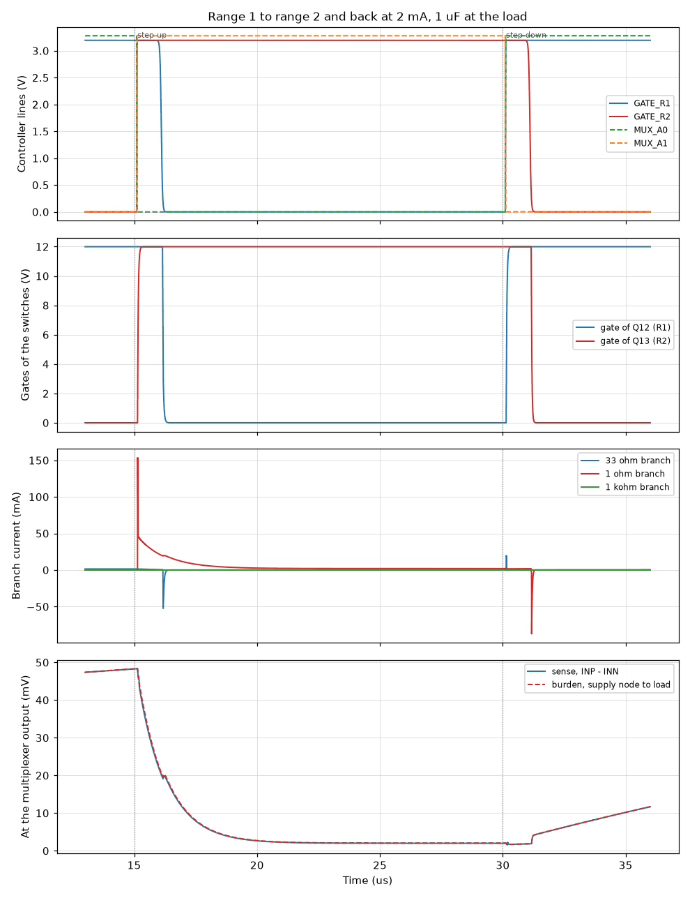
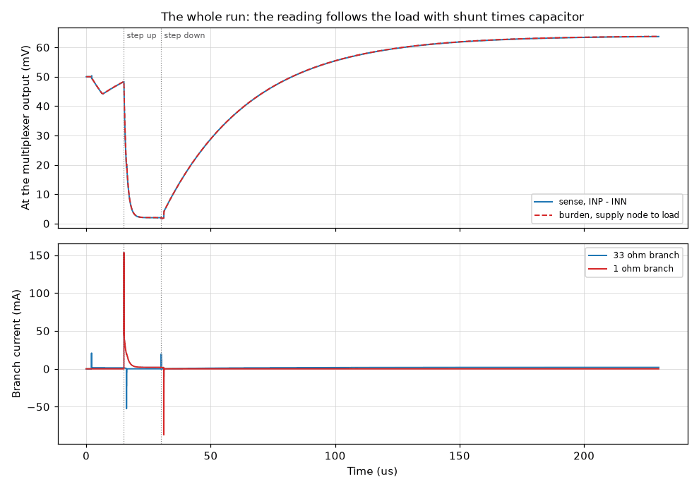
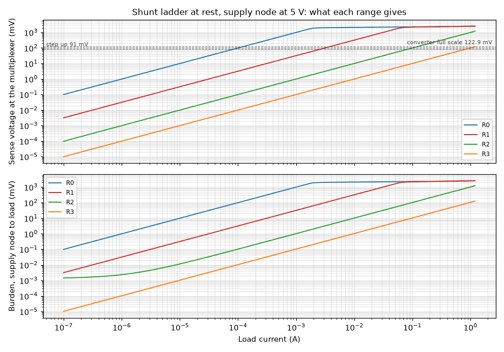

# Simulation Results: Shunt Ladder

Everything on this page is a simulation result. Nothing here is measured on
hardware. The page is written by `circuit-sim report` from the result files
beside it; do not edit it by hand.

## `ladder/change`

**A range change at the ladder: make-before-break of the range switches.**

The ladder carries 2 mA in range 1 and is stepped to range 2 and back. The model
of the sequencer is told to step up and, later, to step down again. The run
shows the lines of the controller, the gates behind the drivers, the currents of
the three branches and the voltage that the multiplexer passes to the amplifier.
The comparators and the amplifier are not in this circuit: the steps are
commanded. The load has 1 uF beside it, so after a step the shunt carries the
current that brings that capacitor to its new voltage: the reading follows the
load with the time constant of shunt and capacitor.

Answers: section 4.3 (make-before-break, gate drive), rule F-17.

| Figure | Simulated | Specification | Limits | Verdict | Source |
| --- | --- | --- | --- | --- | --- |
| Step up: both gates commanded on together for | 993.7 ns | 1 µs (-0.63 %) | 800 ns to 1.2 µs | pass | rule F-17, about 1 us |
| Step down: both gates commanded on together for | 993.7 ns | 1 µs (-0.63 %) | 800 ns to 1.2 µs | pass | rule F-17, about 1 us |
| Step up: new branch at 90 % of its current after the command | 28.2 ns | | at most 500 ns | pass | section 4.4: a branch conducts well inside 0.55 us |
| Sense voltage in range 2 at 2 mA | 1.998 mV | 1.998 mV (+0.02 %) | 1.988 mV to 2.008 mV | pass | section 4.3 |
| Sense voltage back in range 1 at 2 mA | 63.67 mV | 63.9 mV (-0.36 %) | 63.58 mV to 64.22 mV | pass | section 4.3 |
| Step up: sense voltage within 0.1 mV of its final value after | 6.996 µs | 6.116 µs (+14.39 %) | 4.281 µs to 7.951 µs | pass | 1 ohm with 1 uF: 6.4 time constants of 1 us, calculated here |
| Step down: sense voltage within 1 % of its final value after | 150.8 µs | 147.1 µs (+2.46 %) | 103 µs to 191.3 µs | pass | 31.95 ohm with 1 uF: 4.6 time constants of 32 us, calculated here |
| Largest burden from the step up to the end of the run | 63.72 mV | | at most 69.3 mV | pass | the burden of range 1 at this current, never more |

Notes:

- The sequencer is the model of rules F-16 to F-18, with a reaction time of 100
  ns; no program of the controller exists yet.
- The drivers and the multiplexer are behavioral models with typical delays (30
  ns and 92 ns); the comparators and the amplifier are not in this run.
- With a capacitor at the load the shunt current is not the load current until
  that capacitor has reached its new voltage. In range 0 the same 1 uF gives a
  time constant of 1 ms.

Models. written here: CSD17577Q3A, IRLML0030, IRLML0030_CLAMP, MUX509, TC4427CH.

Decks: [change.up-down.cir](change.up-down.cir).

## `ladder/ranges`

**The four ranges at rest: shunt seen by the amplifier and burden voltage.**

Each range is held and the load current is stepped from 100 nA to 1.2 A. The
voltage between the two outputs of the multiplexer is read. Its slope is the
shunt that the amplifier sees; the voltage from the supply node to the node
after the shunts is the burden. The run is repeated with the supply node at 0.8
V and at 5 V, because the gate drive of the range switches depends on it.

Answers: section 4.3 (range table, Kelvin sensing, one-hot selection), section 8
(shunt values).

| Figure | Simulated | Specification | Limits | Verdict | Source |
| --- | --- | --- | --- | --- | --- |
| R0: shunt seen by the amplifier, supply node at 5 V | 1 kΩ | 1 kΩ (+0.00 %) | 999 Ω to 1.001 kΩ | pass | sections 4.3 and 8, calculated |
| R0: burden at 100 µA, supply node at 5 V | 100 mV | | | | |
| R0: shunt seen by the amplifier, supply node at 0.8 V | 1 kΩ | 1 kΩ (+0.00 %) | 999 Ω to 1.001 kΩ | pass | sections 4.3 and 8, calculated |
| R0: burden at 100 µA, supply node at 0.8 V | 100 mV | | | | |
| R0 held with 1 A of load: the ladder clamp bounds the ladder at | 2.508 V | | 2.5 V to 2.9 V | pass | section 4.4 and rule F-21: 2.5 V to 2.9 V |
| R1: shunt seen by the amplifier, supply node at 5 V | 31.95 Ω | 31.95 Ω (-0.02 %) | 31.92 Ω to 31.98 Ω | pass | sections 4.3 and 8, calculated |
| R1: burden at 3 mA, supply node at 5 V | 95.9 mV | | | | |
| R1: shunt seen by the amplifier, supply node at 0.8 V | 31.95 Ω | 31.95 Ω (-0.02 %) | 31.92 Ω to 31.98 Ω | pass | sections 4.3 and 8, calculated |
| R1: burden at 3 mA, supply node at 0.8 V | 95.89 mV | | | | |
| R1: share of the current that flows through R0 | 3.197 % | 3 % (+6.56 %) | 2.5 % to 3.5 % | pass | section 4.3, about 3 % |
| R2: shunt seen by the amplifier, supply node at 5 V | 999 mΩ | 999 mΩ (+0.00 %) | 998 mΩ to 1 Ω | pass | sections 4.3 and 8, calculated |
| R2: burden at 100 mA, supply node at 5 V | 102.3 mV | | | | |
| R2: shunt seen by the amplifier, supply node at 0.8 V | 999 mΩ | 999 mΩ (+0.00 %) | 998 mΩ to 1 Ω | pass | sections 4.3 and 8, calculated |
| R2: burden at 100 mA, supply node at 0.8 V | 101.9 mV | | | | |
| R3: shunt seen by the amplifier, supply node at 5 V | 99.99 mΩ | 100 mΩ (-0.01 %) | 99.9 mΩ to 100.1 mΩ | pass | sections 4.3 and 8, calculated |
| R3: burden at 1 A, supply node at 5 V | 104.3 mV | | at most 107 mV | pass | section 4.3: 105 mV to 107 mV, calculated |
| R3: shunt seen by the amplifier, supply node at 0.8 V | 99.99 mΩ | 100 mΩ (-0.01 %) | 99.9 mΩ to 100.1 mΩ | pass | sections 4.3 and 8, calculated |
| R3: burden at 1 A, supply node at 0.8 V | 103.9 mV | | at most 107 mV | pass | section 4.3: 105 mV to 107 mV, calculated |

Notes:

- The supply node is an ideal source and the load an ideal current sink: the
  output switch and the source meter are not in this circuit.
- The multiplexer is the behavioral model with 250 ohm per channel; its
  resistance carries no current here and does not enter these figures.
- The range switches are fitted to the typical on-resistance of their
  datasheets. The burden of range 3 therefore is a typical value.

Models. written here: CSD17577Q3A, IRLML0030, IRLML0030_CLAMP, MUX509, TC4427CH.

Decks: [ranges.r0-5v.cir](ranges.r0-5v.cir),
[ranges.r1-5v.cir](ranges.r1-5v.cir), [ranges.r2-5v.cir](ranges.r2-5v.cir),
[ranges.r3-5v.cir](ranges.r3-5v.cir).
