# Simulation Results: Model Qualification

Everything on this page is a simulation result. Nothing here is measured on
hardware. The page is written by `circuit-sim report` from the result files
beside it; do not edit it by hand.

## `models/analog-rails-b0530w`

**B0530W models against the datasheet.**

Both variants of the diode model carry the currents of the datasheet table. A
forced current gives the forward voltage, a forced reverse voltage the reverse
current, and a small ramp on top of a reverse voltage the capacitance. The
variant ``B0530W_HI`` has to sit on the largest forward voltage of the
datasheet; the variant ``B0530W`` is the assumed typical part and has to stay
below it.

Answers: the models of the Schottky diodes D6 to D9.

| Figure | Simulated | Specification | Limits | Verdict | Source |
| --- | --- | --- | --- | --- | --- |
| Largest-drop variant: forward voltage at 0.1 A | 375.2 mV | 375 mV (+0.05 %) | 371.2 mV to 378.7 mV | pass | datasheet DS30139 page 2, maximum |
| Typical variant: forward voltage at 0.1 A | 335.7 mV | | at most 375 mV | pass | datasheet DS30139 page 2, maximum; the typical value is an assumption |
| Largest-drop variant: forward voltage at 0.5 A | 430.2 mV | 430 mV (+0.05 %) | 425.7 mV to 434.3 mV | pass | datasheet DS30139 page 2, maximum |
| Typical variant: forward voltage at 0.5 A | 410.6 mV | | at most 430 mV | pass | datasheet DS30139 page 2, maximum; the typical value is an assumption |
| Typical variant: forward voltage at 5 mA | 230.8 mV | | | | |
| Largest-drop variant: forward voltage at 5 mA | 291.2 mV | | | | |
| Typical variant: reverse current at 15 V | 5 µA | | at most 20 µA | pass | datasheet DS30139 page 2, maximum |
| Typical variant: reverse current at 30 V | 5 µA | | at most 130 µA | pass | datasheet DS30139 page 2, maximum |
| Capacitance at 0 V of reverse voltage | 170.4 pF | 170 pF (+0.22 %) | 144.5 pF to 195.5 pF | pass | datasheet DS30139 page 2 (0 V) and figure 4 |
| Capacitance at 5 V of reverse voltage | 69.55 pF | 65 pF (+7.00 %) | 55.25 pF to 74.75 pF | pass | datasheet DS30139 page 2 (0 V) and figure 4 |
| Capacitance at 20 V of reverse voltage | 37.84 pF | 33 pF (+14.66 %) | 28.05 pF to 37.95 pF | pass | datasheet DS30139 page 2 (0 V) and figure 4 |

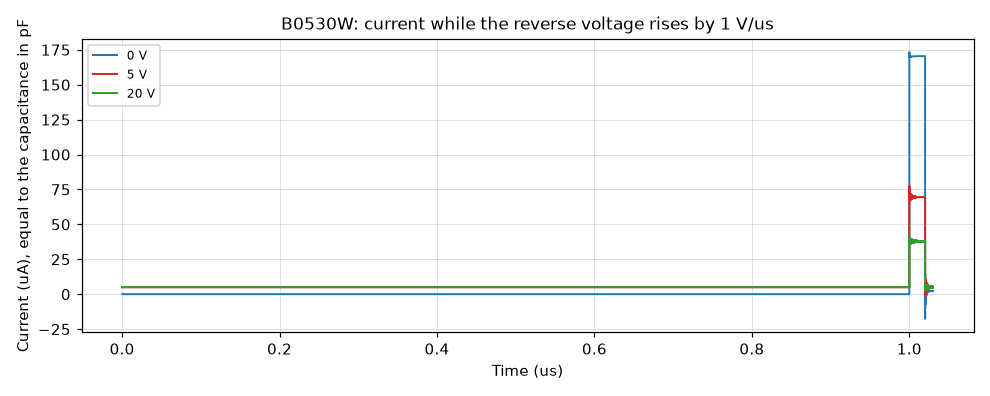

Notes:

- The typical forward voltage is an assumption 40 mV and 20 mV below the
  datasheet maximum: figure 2 of the datasheet does not agree with its table and
  was not used.
- The reverse current of the model is flat with the voltage and that of the
  largest-drop variant is far below a real part: no leakage figure may be taken
  from these models.

Decks:
[analog-rails-b0530w.capacitance.cir](analog-rails-b0530w.capacitance.cir),
[analog-rails-b0530w.static.cir](analog-rails-b0530w.static.cir).

## `models/analog-rails-detector`

**803-type voltage detector model against its datasheet.**

The supply of the detector rises, dips for 10 us, dips for 100 us and falls. The
output is pulled up to the supply through 51 kohm, as R29 does on the board. The
run gives the threshold, the time the output stays low after the supply has
returned, and shows that a dip shorter than the 20 us of the datasheet is passed
over while a longer one starts the time again.

Answers: the model of the voltage detector at the position U9, which is not
fitted.

| Figure | Simulated | Specification | Limits | Verdict | Source |
| --- | --- | --- | --- | --- | --- |
| Output released after the supply has passed 3.08 V | 247 ms | 240 ms (+2.92 %) | 228 ms to 252 ms | pass | datasheet DS39161 page 3: 240 ms typical (140 ms to 280 ms) |
| Output during a dip of 10 us to 2.9 V: lowest level | 2.895 V | | at least 2.5 V | pass | datasheet DS39161 page 3: the part takes 20 us to answer, so the output only follows its pull-up down to 2.9 V |
| Output released again after a dip of 100 us | 248 ms | 240 ms (+3.32 %) | 228 ms to 252 ms | pass | datasheet DS39161 page 3: the timer starts again |
| Supply at which the output falls | 3.08 V | 3.08 V (-0.01 %) | 3.049 V to 3.111 V | pass | datasheet DS39161 page 3: 3.08 V (3.04 V to 3.13 V) |

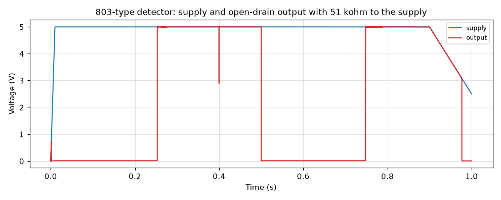

Notes:

- The figures are those of the APX803S-31; the schematic names the position "803
  type, 3.08 V" without a part number.
- The 20 us are taken for any depth of a dip; the datasheet gives them for a
  step to 100 mV below the threshold.

Decks: [analog-rails-detector.sequence.cir](analog-rails-detector.sequence.cir).

## `models/analog-rails-lm27761`

**LM27761 models against the datasheet.**

Both models of the pump run the typical application of the datasheet. The supply
is 5 V, the output is set to -1.8 V, and the load steps to 10 mA, 100 mA and 200
mA before the enable falls. The run gives the output, the level of the pump at
light load, its output resistance, the times of the start and the discharge in
shutdown. A second run takes the supply of the averaged model down to 2.2 V and
back for the lock-out.

Answers: the two models of the charge pump U11: switch by switch and averaged.

| Figure | Simulated | Specification | Limits | Verdict | Source |
| --- | --- | --- | --- | --- | --- |
| Switch by switch: output of the datasheet circuit, 10 mA | -1.798 V | -1.798 V (+0.00 %) | -1.807 V to -1.789 V | pass | SNVSA85D page 13, equation 5 |
| Switch by switch: pump output short of the supply at 10 mA | 134.9 mV | 135 mV (-0.11 %) | 101.2 mV to 168.8 mV | pass | SNVSA85D page 15, figures 7-3 and 7-4: 2.7 % of the supply |
| Switch by switch: output resistance of the pump between 100 mA and 200 mA | 2.482 Ω | 2.5 Ω (-0.70 %) | 2 Ω to 3 Ω | pass | SNVSA85D page 1: 2.5 ohm at 5 V |
| Switch by switch: output at 10 % after the enable | 334 µs | 330 µs (+1.21 %) | 231 µs to 429 µs | pass | SNVSA85D page 7, figure 5-10: 0.32 ms before the output moves |
| Switch by switch: output at 90 % after the enable | 484.3 µs | 460 µs (+5.28 %) | 322 µs to 598 µs | pass | SNVSA85D page 7, figure 5-10: 0.14 ms of ramp after that |
| Switch by switch: output from 90 % to 10 % after the enable has fallen, no load | 1.74 ms | 1.711 ms (+1.73 %) | 1.369 ms to 2.053 ms | pass | SNVSA85D page 10: the output is pulled to ground with 1.85 mA |
| Averaged: output of the datasheet circuit, 10 mA | -1.798 V | -1.798 V (+0.00 %) | -1.807 V to -1.789 V | pass | SNVSA85D page 13, equation 5 |
| Averaged: pump output short of the supply at 10 mA | 127.9 mV | 135 mV (-5.24 %) | 101.2 mV to 168.8 mV | pass | SNVSA85D page 15, figures 7-3 and 7-4: 2.7 % of the supply |
| Averaged: output resistance of the pump between 100 mA and 200 mA | 2.5 Ω | 2.5 Ω (+0.00 %) | 2.375 Ω to 2.625 Ω | pass | SNVSA85D page 1: 2.5 ohm at 5 V |
| Averaged: output at 10 % after the enable | 333.9 µs | 330 µs (+1.17 %) | 231 µs to 429 µs | pass | SNVSA85D page 7, figure 5-10: 0.32 ms before the output moves |
| Averaged: output at 90 % after the enable | 484.2 µs | 460 µs (+5.26 %) | 322 µs to 598 µs | pass | SNVSA85D page 7, figure 5-10: 0.14 ms of ramp after that |
| Averaged: output from 90 % to 10 % after the enable has fallen, no load | 1.74 ms | 1.711 ms (+1.73 %) | 1.369 ms to 2.053 ms | pass | SNVSA85D page 10: the output is pulled to ground with 1.85 mA |
| Averaged: supply at which the output goes | 2.381 V | | 2.3 V to 2.7 V | pass | SNVSA85D page 10: off at 2.4 V; the regulator runs out of head room first |
| Averaged: supply at which the output returns | 2.599 V | 2.6 V (-0.05 %) | 2.496 V to 2.704 V | pass | SNVSA85D page 10: on at 2.6 V (0.4 ms of start taken off) |

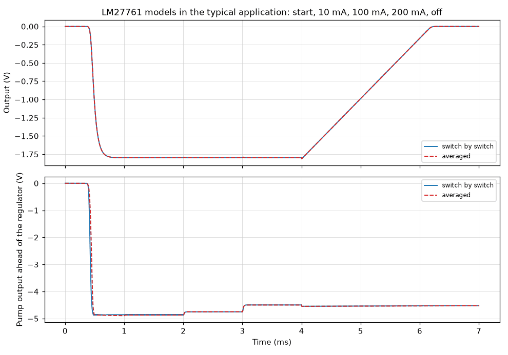

Notes:

- The limits are the fit this project asks of the models. The times of the start
  are read from a scope picture of the datasheet.
- The level of the pump at light load is read from two figures of the datasheet;
  the hysteresis of the pulse skipping in the switched model (10 mV) is an
  assumption.
- The output ripple of the datasheet (0.8 mV to 3.2 mV, figure 5-1) is not
  reproduced: the model passes only what the pump ripple leaves through a
  feed-through fitted to the 35 dB at 2 MHz.

Decks: [analog-rails-lm27761.averaged.cir](analog-rails-lm27761.averaged.cir),
[analog-rails-lm27761.lockout.cir](analog-rails-lm27761.lockout.cir),
[analog-rails-lm27761.switched.cir](analog-rails-lm27761.switched.cir).

## `models/analog-rails-lmr62014`

**LMR62014 models against the datasheet.**

The converter models at their current limit and in the datasheet application.
With the feedback pin at ground the converter asks for all the current it can;
the output is held at 12 V by a source. The highest inductor current is then the
switch current limit at the duty cycle that the supply and 12 V give, and it is
compared with the curve of the datasheet at 5 V and at 3.3 V. The current into
the 12 V source is compared between the cycle-by-cycle and the averaged model. A
third circuit is the basic application of the datasheet, from 5 V to 12 V.

Answers: the two models of the boost converter U10: cycle by cycle and averaged.

| Figure | Simulated | Specification | Limits | Verdict | Source |
| --- | --- | --- | --- | --- | --- |
| Switching frequency at 5 V | 1.6 MHz | 1.6 MHz (-0.02 %) | 1.568 MHz to 1.632 MHz | pass | SNVS735B page 4: 1.6 MHz typical |
| Share of the periods in which the switch closes at 5 V | 1 | 1 (+0.00 %) | 0.99 to 1.01 | pass | a converter at its current limit closes its switch in every period (check of the model) |
| Duty cycle at 5 V and 12 V of output | 0.6153 | | | | |
| Highest inductor current at 5 V | 2.129 A | 2.165 A (-1.67 %) | 2.057 A to 2.273 A | pass | SNVS735B page 13, figure 21, at the duty cycle of the run |
| Current into the output at 5 V, cycle-by-cycle model | 702 mA | 570 mA (+23.15 %) | 456 mA to 684 mA | **FAIL** | SNVS735B page 14, figure 22: bench data of a typical part at 12 V |
| Current into the output at 5 V, averaged model | 722.2 mA | 702 mA (+2.88 %) | 631.8 mA to 772.2 mA | pass | the cycle-by-cycle model in the same circuit |
| Current from the supply at 5 V, averaged model | 2.018 A | 2.045 A (-1.32 %) | 1.84 A to 2.249 A | pass | the cycle-by-cycle model in the same circuit |
| Switching frequency at 3.3 V | 1.599 MHz | 1.6 MHz (-0.07 %) | 1.568 MHz to 1.632 MHz | pass | SNVS735B page 4: 1.6 MHz typical |
| Share of the periods in which the switch closes at 3.3 V | 1 | 1 (+0.00 %) | 0.99 to 1.01 | pass | a converter at its current limit closes its switch in every period (check of the model) |
| Duty cycle at 3.3 V and 12 V of output | 0.719 | | | | |
| Highest inductor current at 3.3 V | 1.161 A | 1.205 A (-3.62 %) | 1.144 A to 1.265 A | pass | SNVS735B page 13, figure 21, at the duty cycle of the run |
| Current into the output at 3.3 V, cycle-by-cycle model | 245.1 mA | 160 mA (+53.21 %) | 128 mA to 192 mA | **FAIL** | SNVS735B page 14, figure 22: bench data of a typical part at 12 V |
| Current into the output at 3.3 V, averaged model | 253.7 mA | 245.1 mA (+3.51 %) | 220.6 mA to 269.6 mA | pass | the cycle-by-cycle model in the same circuit |
| Current from the supply at 3.3 V, averaged model | 1.069 A | 1.094 A (-2.28 %) | 984.4 mA to 1.203 A | pass | the cycle-by-cycle model in the same circuit |
| Output of the basic application, 50 mA | 12.05 V | 12.05 V (-0.01 %) | 11.93 V to 12.17 V | pass | SNVS735B page 11, equation 2 |

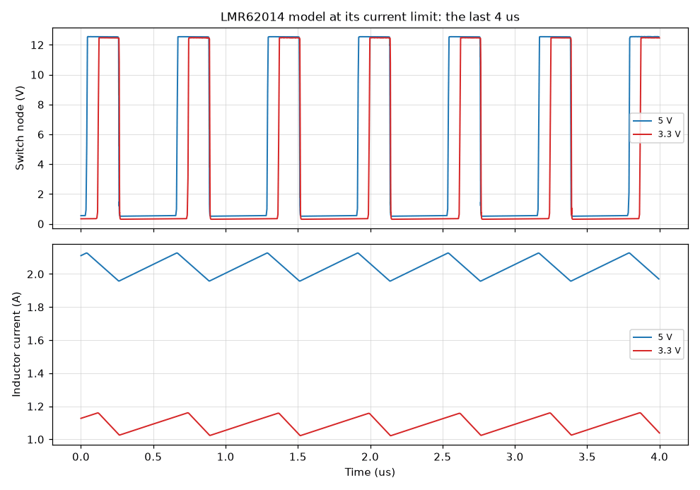

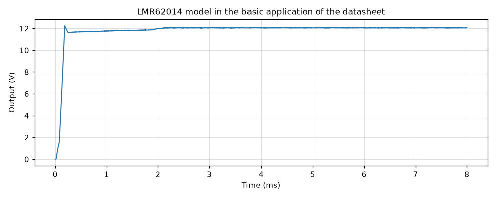

Notes:

- The current limit of the model is the curve of the datasheet by construction;
  the bench checks that the cycle-by-cycle circuit reproduces it at the duty
  cycle it runs at. The curve is typical; the datasheet gives 1.8 A at least at
  25 C and 1.4 A at least over temperature.
- The datasheet does not agree with itself: with the current limit of its figure
  21 its own equation 10 gives more load current than the bench data of its
  figure 22 and than the row of its table for the output under load, by a fifth
  at 5 V and by half at 3.3 V. The model follows figure 21, so at a low supply
  it takes and delivers more than those bench data; that figure fails here and
  is left failed.
- The error amplifier and its compensation are assumptions. The models show no
  soft start and no lock-out because the datasheet names none; they work from
  2.0 V of supply, which is an assumption as well.
- The averaged model is checked against the cycle-by-cycle model, not against
  the datasheet: it is that model without its cycles.

Decks:
[analog-rails-lmr62014.application.cir](analog-rails-lmr62014.application.cir),
[analog-rails-lmr62014.limit-3p3v.cir](analog-rails-lmr62014.limit-3p3v.cir),
[analog-rails-lmr62014.limit-5v.cir](analog-rails-lmr62014.limit-5v.cir),
[analog-rails-lmr62014.limit-averaged-3p3v.cir](analog-rails-lmr62014.limit-averaged-3p3v.cir),
[analog-rails-lmr62014.limit-averaged-5v.cir](analog-rails-lmr62014.limit-averaged-5v.cir).

## `models/analog-rails-lt3042`

**LT3042 model against its datasheet.**

The model is put in the test circuits of the datasheet table. Start-up with 4.7
uF at the SET pin, with and without the fast start-up; the thresholds of the
enable pin; the dropout at 50 mA and 200 mA; the current limit at 12 V and 20 V
across the part; the ripple rejection at four frequencies and the output noise,
both with 4.7 uF at the output and at the SET pin and 200 mA of load.

Answers: the model of the +12V_A regulator U13.

| Figure | Simulated | Specification | Limits | Verdict | Source |
| --- | --- | --- | --- | --- | --- |
| Start to 90 % of 5 V with fast start-up, 4.7 uF at SET | 10.83 ms | 10 ms (+8.27 %) | 8 ms to 12 ms | pass | datasheet rev. C page 4: 10 ms |
| Start to 90 % of 5 V without fast start-up, 4.7 uF at SET | 544.3 ms | 550 ms (-1.04 %) | 495 ms to 605 ms | pass | datasheet rev. C page 4: 550 ms |
| Enable pin at which the output comes | 1.241 V | 1.24 V (+0.04 %) | 1.203 V to 1.277 V | pass | datasheet rev. C page 4: 1.24 V rising |
| Enable pin at which the output goes | 1.055 V | 1.07 V (-1.44 %) | 1.016 V to 1.123 V | pass | datasheet rev. C page 4: 170 mV of hysteresis |
| Dropout at 50 mA | 264.7 mV | 220 mV (+20.30 %) | at most 300 mV | pass | datasheet rev. C page 3: 220 mV typical, 300 mV at most |
| Dropout at 200 mA | 310 mV | 350 mV (-11.43 %) | 280 mV to 420 mV | pass | datasheet rev. C page 3: 350 mV typical |
| Current limit with 12 V across the part | 300.1 mA | 300 mA (+0.03 %) | 285 mA to 315 mA | pass | datasheet rev. C page 4: 300 mA |
| Current limit with 20 V across the part | 180.1 mA | 180 mA (+0.05 %) | 171 mA to 189 mA | pass | datasheet rev. C page 4: 180 mA |
| Ripple rejection at 120 Hz | 116.8 dB | 117 dB (-0.19 %) | 113 dB to 121 dB | pass | datasheet rev. C page 4 (fit of the model: 4 dB) |
| Ripple rejection at 10000 Hz | 91.19 dB | 91 dB (+0.21 %) | 87 dB to 95 dB | pass | datasheet rev. C page 4 (fit of the model: 4 dB) |
| Ripple rejection at 100000 Hz | 79.21 dB | 78 dB (+1.56 %) | 74 dB to 82 dB | pass | datasheet rev. C page 4 (fit of the model: 4 dB) |
| Ripple rejection at 1e+06 Hz | 81.5 dB | 79 dB (+3.16 %) | 75 dB to 83 dB | pass | datasheet rev. C page 4 (fit of the model: 4 dB) |
| Output noise density at 10 kHz | 2.048 nV/√Hz | 2 nV/√Hz (+2.42 %) | 1.7 nV/√Hz to 2.3 nV/√Hz | pass | datasheet rev. C page 3: 2 nV/rtHz |
| Output noise density at 10 Hz, 4.7 uF at SET | 72.33 nV/√Hz | 60 nV/√Hz (+20.55 %) | 40 nV/√Hz to 90 nV/√Hz | pass | datasheet rev. C page 3: 60 nV/rtHz |
| Output noise from 10 Hz to 100 kHz, 4.7 uF at SET | 682.1 nV | 800 nV (-14.73 %) | 600 nV to 1 µV | pass | datasheet rev. C page 3: 0.8 uV RMS |

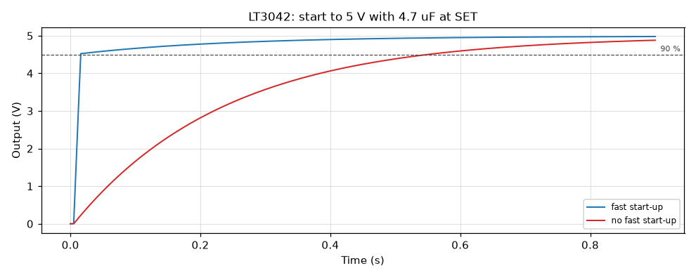

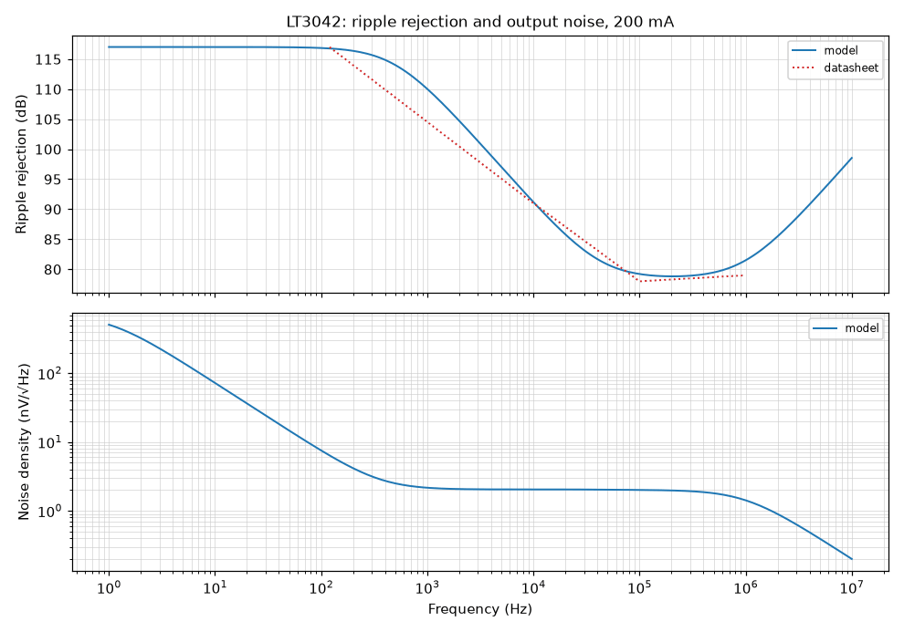

Notes:

- The limits are the fit this project asks of the model, not datasheet limits,
  except where the datasheet gives a maximum.
- Above the bandwidth of its output stage the model rejects more than the 56 dB
  that the datasheet gives at 10 MHz; that point is not checked.
- The loop of the regulator is one pole with an integral part: the model says
  nothing about stability with a given capacitor.

Decks: [analog-rails-lt3042.limits.cir](analog-rails-lt3042.limits.cir),
[analog-rails-lt3042.small-signal.cir](analog-rails-lt3042.small-signal.cir),
[analog-rails-lt3042.start.cir](analog-rails-lt3042.start.cir).

## `models/analog-rails-mcp6569`

**MCP6569 model (open-drain output) against its datasheet.**

One comparator of the model in the test circuit of the datasheet. A slow
triangle around a reference gives the two trip points, with and without an
offset. A current forced into the low output gives its level at the two supplies
of the datasheet figures. A step of 100 mV around the reference with 20 kohm to
the supply and 25 pF at the output gives the delay and the fall time.

Answers: the model of the four comparators of the rail monitor U14.

| Figure | Simulated | Specification | Limits | Verdict | Source |
| --- | --- | --- | --- | --- | --- |
| Hysteresis, typical variant | 3.496 mV | 3.5 mV (-0.12 %) | 3.325 mV to 3.675 mV | pass | DS20002143E page 7, figure 2-4: mean of 3.4 mV to 3.6 mV |
| Middle of the two trip points, no offset | 2.352 µV | | -100 µV to 100 µV | pass | DS20002143E page 3: the offset is the middle of the trip points |
| Hysteresis with the parameter at 1 mV | 994.8 µV | 1 mV (-0.52 %) | 950 µV to 1.05 mV | pass | DS20002143E page 3: 1 mV at least |
| Middle of the two trip points with an offset of 5 mV | 5.002 mV | 5 mV (+0.05 %) | 4.85 mV to 5.15 mV | pass | the parameter of the model |
| Low level at 1.8 V of supply and 3 mA | 195.1 mV | 200 mV (-2.45 %) | 180 mV to 220 mV | pass | DS20002143E page 10, figures 2-21 and 2-24 |
| Low level at 5.5 V of supply and 25 mA | 475.6 mV | 480 mV (-0.91 %) | 432 mV to 528 mV | pass | DS20002143E page 10, figures 2-21 and 2-24 |
| Delay from the step to the falling output at half the supply, 3.3 V | 36.06 ns | 45 ns (-19.87 %) | 34 ns to 80 ns | pass | DS20002143E page 4: 56 ns at 1.8 V and 34 ns at 5.5 V typical, 80 ns at most |
| Fall time of the output from 90 % to 10 % | 15.51 ns | 20 ns (-22.43 %) | at most 40 ns | pass | DS20002143E page 4: 20 ns typical |

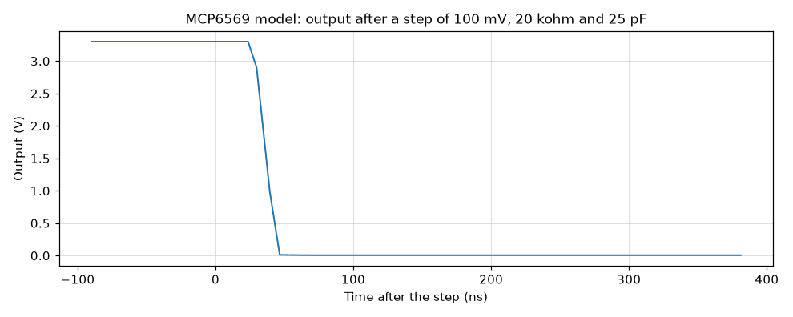

Notes:

- The delay of the model does not change with the overdrive, and the model has
  no input bias current, no limit of the common-mode range and no supply
  current.
- The output switch opens below a supply of 1.2 V, which is an assumption: the
  datasheet promises operation from 1.8 V and says nothing below.

Decks: [analog-rails-mcp6569.static.cir](analog-rails-mcp6569.static.cir),
[analog-rails-mcp6569.step.cir](analog-rails-mcp6569.step.cir).

## `models/analog-rails-mlcc`

**Ceramic capacitor with its loss under bias against the cited curves.**

A constant current charges each capacitor model and the slope gives its
capacitance. The capacitance at a voltage is the current divided by the slope of
the voltage there. It is compared with the share that the model file cites for
each part number. A second circuit charges the 4.7 uF part with the 2 mA of the
fast start-up of the +12V_A regulator, which is where the 18 ms of the
specification come from.

Answers: the model of C18 to C22 and C27 to C31 in the runs of the analog rails.

| Figure | Simulated | Specification | Limits | Verdict | Source |
| --- | --- | --- | --- | --- | --- |
| CL21B475KAFNNNE, 4.7 uF 0805: share of the capacitance left at 5 V | 0.7191 | 0.715 (+0.57 %) | 0.6578 to 0.7722 | pass | bias curve of the part as the model file cites it |
| CL21B475KAFNNNE, 4.7 uF 0805: share of the capacitance left at 10 V | 0.3902 | 0.393 (-0.70 %) | 0.3616 to 0.4244 | pass | bias curve of the part as the model file cites it |
| CL21B475KAFNNNE, 4.7 uF 0805: share of the capacitance left at 12 V | 0.3077 | 0.327 (-5.90 %) | 0.3008 to 0.3532 | pass | bias curve of the part as the model file cites it |
| CL32B106KAJNNNE, 10 uF 1210: share of the capacitance left at 5 V | 0.9433 | 0.947 (-0.39 %) | 0.8712 to 1.023 | pass | bias curve of the part as the model file cites it |
| CL32B106KAJNNNE, 10 uF 1210: share of the capacitance left at 13.5 V | 0.6955 | 0.695 (+0.07 %) | 0.6394 to 0.7506 | pass | bias curve of the part as the model file cites it |
| CL31B226KPHNNNE, 22 uF 1206: share of the capacitance left at 5 V | 0.686 | 0.686 (+0.00 %) | 0.6311 to 0.7409 | pass | bias curve of the part as the model file cites it |
| CL31B226KPHNNNE, 22 uF 1206: share of the capacitance left at 10 V | 0.3532 | 0.372 (-5.05 %) | 0.3422 to 0.4018 | pass | bias curve of the part as the model file cites it |
| 4.7 uF part charged with 2 mA: time to 11 V | 17.71 ms | 18 ms (-1.61 %) | 17.1 ms to 18.9 ms | pass | rule F-3 of the specification: +12V_A at 11 V after 18 ms |

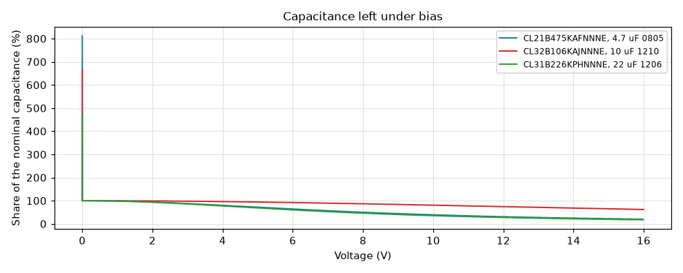

Notes:

- The model is one law, capacitance = nominal / (1 + (V / v0)^2), with v0 fitted
  per part number. The points it is compared with were read from the part pages
  of the manufacturer by the power input block; they were not read again here.
- Temperature, aging and the amplitude of the ripple are not in the model.

Decks: [analog-rails-mlcc.charge.cir](analog-rails-mlcc.charge.cir).

## `models/analog-rails-ref5025`

**REF5025 model against its datasheet.**

The model is put in the conditions of the datasheet table and figures. Level,
load and line regulation, dropout and supply current as an operating point; the
noise from 10 Hz to 1 kHz with 1 uF at the output, with and without a capacitor
at the noise pin; the start with 1 uF and with 10 uF at the output and with 1 uF
at the noise pin; a load step between -1 mA and +1 mA.

Answers: the model of the reference U12.

| Figure | Simulated | Specification | Limits | Verdict | Source |
| --- | --- | --- | --- | --- | --- |
| Output without load | 2.5 V | 2.5 V (+0.00 %) | 2.498 V to 2.502 V | pass | SBOS410O page 7: 2.5 V |
| Load regulation, sourcing 10 mA | 18.13 ppm/mA | 20 ppm/mA (-9.36 %) | 15 ppm/mA to 25 ppm/mA | pass | SBOS410O page 7: 20 ppm/mA typical |
| Load regulation, sinking 10 mA | 18.13 ppm/mA | 20 ppm/mA (-9.36 %) | 15 ppm/mA to 25 ppm/mA | pass | SBOS410O page 7: 20 ppm/mA typical |
| Line regulation, 5 V to 18 V | 1 ppm/V | 1 ppm/V (+0.00 %) | 0.75 ppm/V to 1.25 ppm/V | pass | SBOS410O page 7: 1 ppm/V typical |
| Output with 10 mA and 0.45 V of head room: fall below 2.5 V | 100 mV | | 50 mV to 150 mV | pass | SBOS410O page 11, figure 6-6: 0.55 V of dropout at 10 mA, so 0.1 V are missing here |
| Supply current without load | 800.2 µA | 800 µA (+0.03 %) | 720 µA to 880 µA | pass | SBOS410O page 8: 0.8 mA typical |
| Noise from 10 Hz to 1 kHz, no capacitor at the noise pin | 2.26 µV | 2.25 µV (+0.44 %) | 2.025 µV to 2.475 µV | pass | SBOS410O page 7: 0.9 uV RMS per volt |
| The same with 1 uF at the noise pin, as a share | 0.5245 | 0.5 (+4.91 %) | 0.4 to 0.6 | pass | SBOS410O page 26: the capacitor halves the noise |
| Peak of the noise density over the density at 1 kHz, 1 uF at the output | 2.31 | 2.1 (+9.99 %) | 1.6 to 2.7 | pass | SBOS410O page 13, figure 6-14: about 58 over 27 nV/V/rtHz |
| Frequency of that peak | 9.441 kHz | 10 kHz (-5.59 %) | 7 kHz to 14 kHz | pass | SBOS410O page 13, figure 6-14: about 10 kHz |
| Start with 1 uF: from 10 % to 90 % | 90.91 µs | 108 µs (-15.82 %) | 75.6 µs to 140.4 µs | pass | SBOS410O page 13, figure 6-15: 2.5 V in about 135 us |
| Start with 10 uF: from 10 % to 90 % | 909.1 µs | 960 µs (-5.30 %) | 672 µs to 1.248 ms | pass | SBOS410O page 13, figure 6-16: 2.5 V in about 1.2 ms |
| Start with 1 uF: within 0.1 % after the supply | 157.7 µs | 200 µs (-21.13 %) | at most 400 µs | pass | SBOS410O page 8: 200 us typical |
| Start with 1 uF at the noise pin: within 0.1 % after the supply | 74.88 ms | 75 ms (-0.16 %) | 55 ms to 110 ms | pass | SBOS410O pages 23 and 26: 11 kohm with 1 uF, a corner of 10 Hz to 20 Hz |
| Step from -1 mA to +1 mA with 1 uF: largest deviation | 11.19 mV | 8 mV (+39.91 %) | 4 mV to 16 mV | pass | SBOS410O page 13, figure 6-17: about 8 mV (read from the figure) |

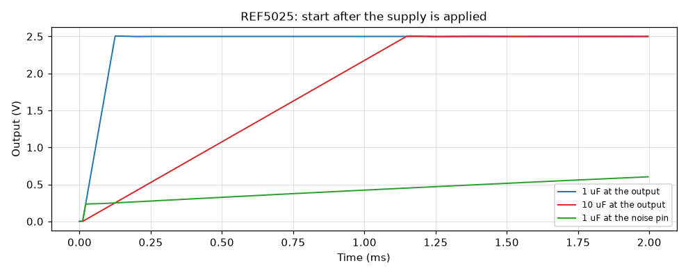

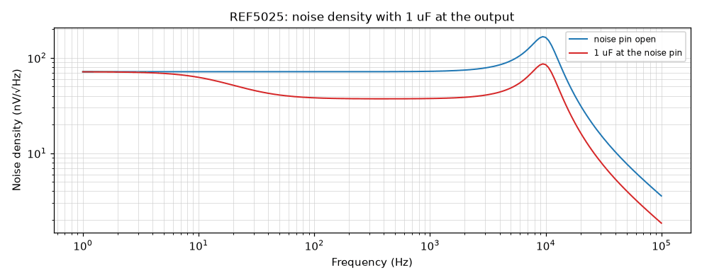

Notes:

- The limits are the fit this project asks of the model. The figures read from
  graphs of the datasheet (start, load step, noise peak) carry the reading error
  of those graphs.
- The output impedance of the model is fitted to the noise peak and to the load
  step; the datasheet has no curve of it for this grade.
- The noise below 10 Hz (3 uV peak to peak per volt in the datasheet) is not in
  the model.

Decks: [analog-rails-ref5025.static.cir](analog-rails-ref5025.static.cir),
[analog-rails-ref5025.transient.cir](analog-rails-ref5025.transient.cir).

## `models/digital-1n5819hw`

**1N5819HW model against its datasheet.**

A current is forced through the diode and a reverse voltage is stepped across
it. The forward voltage is compared with the maxima of the datasheet table and
with its typical curve. The reverse current is read from the typical variant and
from the variant whose leakage resistor is set to the maximum of the datasheet,
at 4 V and at 6 V, and from the typical variant at 100 C.

Answers: the model of the diode D1 from the 5 V rail to the module.

| Figure | Simulated | Specification | Limits | Verdict | Source |
| --- | --- | --- | --- | --- | --- |
| Forward voltage at 1 mA | 150.1 mV | 150 mV (+0.09 %) | 135 mV to 165 mV | pass | Diodes Incorporated DS30217 rev. 22-2, page 3, figure 1 (read from the graph) |
| Forward voltage at 100 mA | 282 mV | 290 mV (-2.74 %) | 261 mV to 319 mV | pass | Diodes Incorporated DS30217 rev. 22-2, page 3, figure 1 (read from the graph) |
| Forward voltage at 1000 mA | 407.9 mV | 400 mV (+1.97 %) | 360 mV to 440 mV | pass | Diodes Incorporated DS30217 rev. 22-2, page 3, figure 1 (read from the graph) |
| Forward voltage at 100 mA against the maximum | 282 mV | | at most 320 mV | pass | Diodes Incorporated DS30217 rev. 22-2, page 2, maximum |
| Forward voltage at 1000 mA against the maximum | 407.9 mV | | at most 450 mV | pass | Diodes Incorporated DS30217 rev. 22-2, page 2, maximum |
| Typical variant: reverse current at 4 V | 8 µA | 10 µA (-20.00 %) | 5 µA to 15 µA | pass | Diodes Incorporated DS30217 rev. 22-2, page 2, typical; within 50 % |
| Variant at the maximum: reverse current at 4 V | 49.98 µA | 50 µA (-0.05 %) | 45 µA to 55 µA | pass | Diodes Incorporated DS30217 rev. 22-2, page 2, maximum |
| Typical variant: reverse current at 6 V | 10 µA | 15 µA (-33.33 %) | 7.5 µA to 22.5 µA | pass | Diodes Incorporated DS30217 rev. 22-2, page 2, typical; within 50 % |
| Variant at the maximum: reverse current at 6 V | 72.97 µA | 75 µA (-2.71 %) | 67.5 µA to 82.5 µA | pass | Diodes Incorporated DS30217 rev. 22-2, page 2, maximum |
| Capacitance at 4 V and 1 MHz | 49.99 pF | 50 pF (-0.02 %) | 42.5 pF to 57.5 pF | pass | Diodes Incorporated DS30217 rev. 22-2, page 2, typical |
| Typical variant: reverse current at 4 V and 100 C | 876.5 µA | 1 mA (-12.35 %) | 500 µA to 2 mA | pass | Diodes Incorporated DS30217 rev. 22-2, page 2: 1 mA typical, 2 mA at the most |

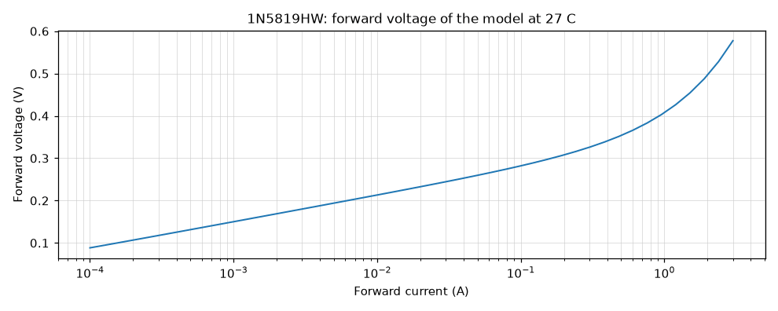

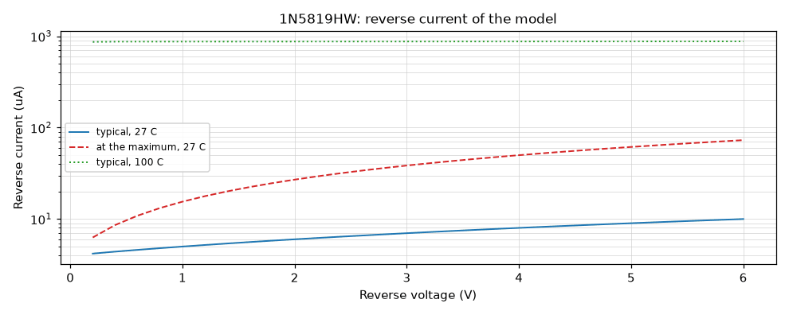

Notes:

- The forward limits are the maxima of the datasheet; the typical curve is read
  from a graph and the model has to lie within 10 % of it.
- The reverse current is a saturation current of 4 uA plus a resistor: 1 Mohm
  for the typical part, 87 kohm for a part at the maximum of 50 uA at 4 V. Its
  rise with temperature comes from the saturation current alone.

Decks: [digital-1n5819hw.27c.cir](digital-1n5819hw.27c.cir).

## `models/digital-ads8860`

**ADS8860 digital pins: model against the datasheet.**

One frame of the three-wire mode is clocked out of the model. CONVST rises,
stays high for the longest conversion and falls; sixteen clocks of 15 MHz
follow. DOUT carries 20 pF as in the load circuit of the datasheet and is held
at half the supply while it is open. The delays are read between the input
levels and the output levels of the datasheet, and the sixteen bits are compared
with the word of the model.

Answers: the model of the convert-start, clock and data pins of the converter
U30.

| Figure | Simulated | Specification | Limits | Verdict | Source |
| --- | --- | --- | --- | --- | --- |
| Bits read wrong, of 16 | 0 | | at most 0 | pass | TI SBAS569B, page 22: most significant bit first |
| DOUT while CONVST is high: level of the open line | 1.504 V | | 1.35 V to 1.65 V | pass | TI SBAS569B, page 22: DOUT is open from the rising edge of CONVST |
| CONVST low to first bit valid | 11.76 ns | 12.3 ns (-4.35 %) | 11.3 ns to 12.3 ns | pass | TI SBAS569B, page 8: 12.3 ns at the most; the model sits at the limit |
| SCLK falling to next bit valid, slowest transition | 13.33 ns | 13.4 ns (-0.50 %) | 12.4 ns to 13.4 ns | pass | TI SBAS569B, page 8: 13.4 ns at the most; the model sits at the limit |
| SCLK falling to the bit before it no longer valid, earliest | 11.52 ns | | at least 3 ns | pass | TI SBAS569B, page 8: 3 ns at the least |
| Sixteenth falling edge of SCLK to DOUT leaving its level | 14.34 ns | | at most 18.2 ns | pass | TI SBAS569B, page 8: open 13.2 ns after the edge at the most; 5 ns more for the line to move by 0.1 V with 2.5 kohm and 25 pF |

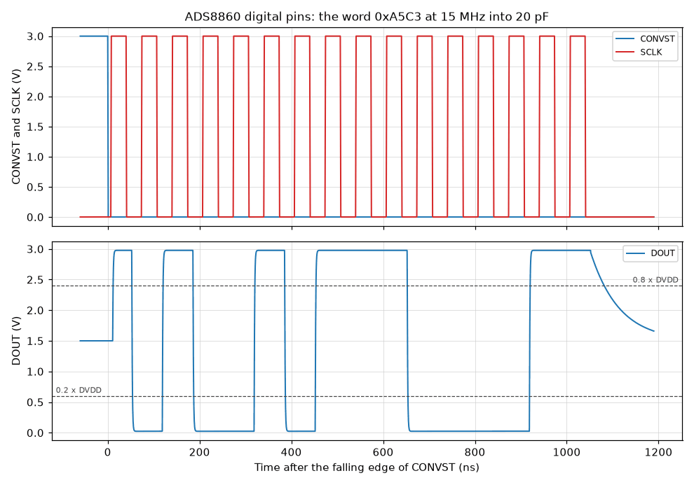

Notes:

- The datasheet gives only the largest delays and the shortest hold time; the
  model sits at the largest delays by default, and a bench that needs the
  earliest change sets its delay parameter to 3 ns.
- The output resistance of 40 ohm and the pin capacitance of 5 pF are
  assumptions: the datasheet states the output levels at 500 uA only and no
  capacitance of a digital pin.
- The conversion itself is not in the model: DOUT carries the word given as a
  parameter.

Decks: [digital-ads8860.frame.cir](digital-ads8860.frame.cir).

## `models/digital-bat54s`

**BAT54S model against its datasheet.**

A voltage is stepped across one diode of each variant of the model. The forward
voltage at the currents of the datasheet table is read from the typical variant
and from the variant fitted to the maxima. The run is repeated at -40 C and at
85 C, where the datasheet gives a curve and no table. The reverse current at 25
V and the capacitance at 1 V are read at 27 C.

Answers: the model of the clamp D24 of the translator supply.

| Figure | Simulated | Specification | Limits | Verdict | Source |
| --- | --- | --- | --- | --- | --- |
| Typical variant: forward voltage at 0.1 mA | 220.4 mV | 220 mV (+0.19 %) | 202.4 mV to 237.6 mV | pass | onsemi BAT54SLT1/D rev. 18, page 2, typical |
| Typical variant: forward voltage at 1 mA | 281.1 mV | 290 mV (-3.08 %) | 266.8 mV to 313.2 mV | pass | onsemi BAT54SLT1/D rev. 18, page 2, typical |
| Typical variant: forward voltage at 10 mA | 351.4 mV | 350 mV (+0.40 %) | 322 mV to 378 mV | pass | onsemi BAT54SLT1/D rev. 18, page 2, typical |
| Typical variant: forward voltage at 30 mA | 403.8 mV | 410 mV (-1.51 %) | 377.2 mV to 442.8 mV | pass | onsemi BAT54SLT1/D rev. 18, page 2, typical |
| Typical variant: forward voltage at 100 mA | 519 mV | 520 mV (-0.20 %) | 478.4 mV to 561.6 mV | pass | onsemi BAT54SLT1/D rev. 18, page 2, typical |
| Variant at the maximum: forward voltage at 0.1 mA | 249.8 mV | 240 mV (+4.07 %) | 220 mV to 252 mV | pass | onsemi BAT54SLT1/D rev. 18, page 2, maximum; between typical and 5 % above it |
| Variant at the maximum: forward voltage at 1 mA | 320 mV | 320 mV (+0.01 %) | 290 mV to 336 mV | pass | onsemi BAT54SLT1/D rev. 18, page 2, maximum; between typical and 5 % above it |
| Variant at the maximum: forward voltage at 10 mA | 400 mV | 400 mV (+0.01 %) | 350 mV to 420 mV | pass | onsemi BAT54SLT1/D rev. 18, page 2, maximum; between typical and 5 % above it |
| Variant at the maximum: forward voltage at 30 mA | 457.1 mV | 500 mV (-8.59 %) | 410 mV to 525 mV | pass | onsemi BAT54SLT1/D rev. 18, page 2, maximum; between typical and 5 % above it |
| Variant at the maximum: forward voltage at 100 mA | 577.3 mV | 800 mV (-27.84 %) | 520 mV to 840 mV | pass | onsemi BAT54SLT1/D rev. 18, page 2, maximum; between typical and 5 % above it |
| Typical variant: reverse current at 25 V | 20 nA | 150 nA (-86.67 %) | at most 2 µA | pass | onsemi BAT54SLT1/D rev. 18, page 2: 0.15 uA typical, 2 uA at the most |
| Leaky variant: reverse current at 25 V | 2 µA | 2 µA (+0.00 %) | 1.8 µA to 2.2 µA | pass | onsemi BAT54SLT1/D rev. 18, page 2, maximum |
| Capacitance at 1 V and 1 MHz | 7.62 pF | 7.6 pF (+0.27 %) | 6.84 pF to 8.36 pF | pass | onsemi BAT54SLT1/D rev. 18, page 2, typical |
| Typical variant: forward voltage at 0.1 mA and -40 C | 335.4 mV | 335 mV (+0.12 %) | 301.5 mV to 368.5 mV | pass | onsemi BAT54SLT1/D rev. 18, page 3, figure 2 (read from the graph) |
| Typical variant: forward voltage at 0.1 mA and 85 C | 119.4 mV | 125 mV (-4.48 %) | 112.5 mV to 137.5 mV | pass | onsemi BAT54SLT1/D rev. 18, page 3, figure 2 (read from the graph) |

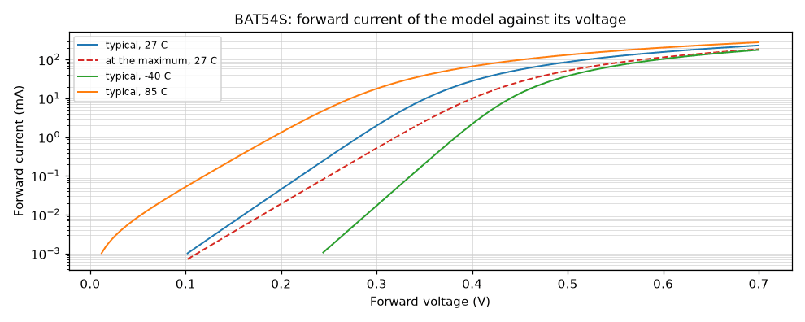

Notes:

- The limits of the typical variant are the fit this project asks of a model, 8
  % of the forward voltage; they are not datasheet limits.
- The variant at the maximum is fitted to the largest forward voltage at 1 mA
  and 10 mA, the range in which the clamp works. At 30 mA and 100 mA it stays
  below the maximum of the datasheet.
- The reverse current of the typical variant is its saturation current and does
  not rise with the voltage as the datasheet curve does: 20 nA against 0.15 uA
  at 25 V. The leaky variant carries the maximum of 2 uA; its forward voltage is
  too low and is not used.

Decks: [digital-bat54s.27c.cir](digital-bat54s.27c.cir).

## `models/digital-mcp3208`

**MCP3208 inputs: model against the datasheet.**

Nine frames select the eight channels in turn and channel 7 once more. Channels
0 to 6 stand at different voltages on stiff sources, so the voltage on the
sampling capacitor shows which channel a frame selects and when. Channel 7 is a
capacitor of 100 nF without a source: what a sample takes from it is the charge
of the sampling capacitor. A second deck forces 1 mA through the diodes of a
pin.

Answers: the model of the monitor converter U40.

| Figure | Simulated | Specification | Limits | Verdict | Source |
| --- | --- | --- | --- | --- | --- |
| Channels 0 to 6: largest distance of the held voltage from its channel | 21.11 nV | | at most 100 µV | pass | Microchip DS21298E, page 19: channel bits D2, D1, D0 |
| Sampling starts after the first rising clock edge of the frame by | 4.009 µs | 4 µs (+0.23 %) | 4 µs to 4.03 µs | pass | Microchip DS21298E, page 19: at the fourth rising edge after the start bit |
| Time constant of the sampling, from the 10 % to 90 % time | 20.2 ns | 20 ns (+1.01 %) | 17 ns to 23 ns | pass | Microchip DS21298E, page 18: 1 kohm and 20 pF |
| Step of a 100 nF capacitor at 2.5 V when it is sampled after channel 6 | 79.94 µV | 79.98 µV (-0.04 %) | 77.58 µV to 82.38 µV | pass | Microchip DS21298E, page 18: 20 pF charged from 2.1 V to 2.5 V out of 100 nF |
| Step of the same capacitor at the next sample of the same channel | 368.7 pV | | at most 1.6 µV | pass | the sampling capacitor keeps its voltage between samples (assumption) |
| Analog pin above the supply with 1 mA into it | 610.4 mV | 600 mV (+1.73 %) | 570 mV to 630 mV | pass | Microchip DS21298E, page 18: diode threshold 0.6 V |
| Analog pin below ground with 1 mA out of it | 610.4 mV | 600 mV (+1.73 %) | 570 mV to 630 mV | pass | Microchip DS21298E, page 18: diode threshold 0.6 V |

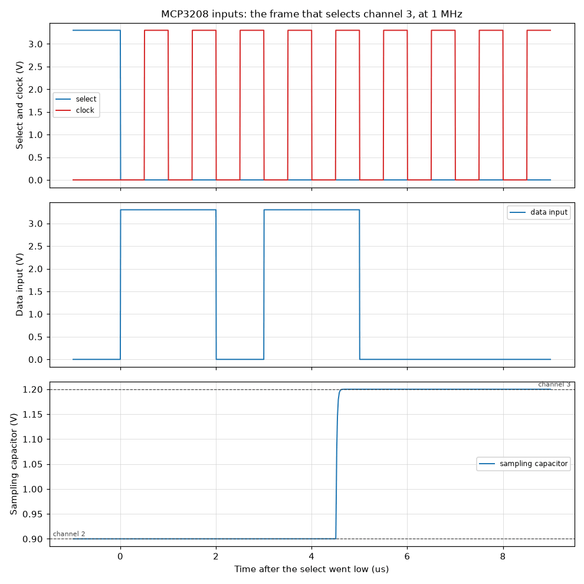

Notes:

- The model samples and holds; the conversion, the data output and the errors of
  the converter (offset 3 LSB, gain 5 LSB, linearity 1 LSB at the most) are not
  in it.
- The sampling capacitor keeps the voltage of the channel before: an assumption
  about the capacitor array, which the datasheet does not describe. The benches
  of the monitors also run the case of a capacitor that starts 2.5 V away.
- The diode drop of 0.6 V at 1 mA is the threshold that the datasheet draws; the
  current is an assumption.

Decks: [digital-mcp3208.clamp.cir](digital-mcp3208.clamp.cir),
[digital-mcp3208.frames.cir](digital-mcp3208.frames.cir).

## `models/digital-mcp9700a`

**MCP9700A model against its datasheet.**

The sensor is run at eight temperatures between -40 C and 125 C. The output
without load gives the offset and the slope, the output with 100 uA drawn from
it the output impedance, and the supply current is read at 25 C. A third sensor
has no supply.

Answers: the model of the board temperature sensor U39.

| Figure | Simulated | Specification | Limits | Verdict | Source |
| --- | --- | --- | --- | --- | --- |
| Output at 0 C | 500 mV | 500 mV (+0.00 %) | 495 mV to 505 mV | pass | Microchip DS20001942L, pages 3 and 4: 500 mV |
| Slope of the output | 10 mV | 10 mV (+0.00 %) | 9.9 mV to 10.1 mV | pass | Microchip DS20001942L, pages 3 and 4: 10.0 mV/K |
| Output at 25 C | 750 mV | 750 mV (+0.00 %) | 742.5 mV to 757.5 mV | pass | Microchip DS20001942L, pages 3 and 4: 500 mV and 10.0 mV/K |
| Output impedance, from the drop with 100 uA | 20 Ω | 20 Ω (+0.00 %) | 19 Ω to 21 Ω | pass | Microchip DS20001942L, pages 3 and 4: 20 ohm typical |
| Supply current of one sensor at 25 C | 6 µA | 6 µA (+0.00 %) | 5 µA to 12 µA | pass | Microchip DS20001942L, pages 3 and 4: 6 uA typical, 12 uA at the most |
| Output without supply | 0 V | | at most 10 mV | pass | a sensor without supply gives no voltage |

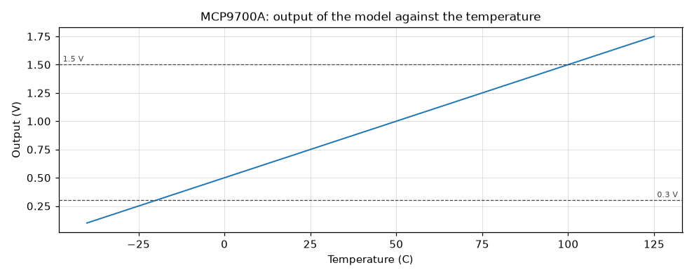

Notes:

- The model is the straight line of the datasheet. The accuracy of the part,
  +/-2 C at the most from 0 C to 70 C, is a parameter that the benches of the
  monitors set.
- The marks at 0.3 V and 1.5 V are the limits of rule F-12 of the specification
  for this channel: -20 C and 100 C.

Decks: [digital-mcp9700a.25c.cir](digital-mcp9700a.25c.cir).

## `models/digital-rp2350`

**Controller module: pad and supply models against the datasheets.**

A pad drives 4 mA, rests on its pull-down and is released onto a resistor. The
pad model is set to the limits of the 4 mA drive setting. A pad of stepping A2
has the current of erratum E9: its voltage is stepped to show that current, and
three such pads are driven high and released onto 4.7 kohm, 8.2 kohm and 47
kohm. The supply side of the module is fed once at VBUS and once at VSYS.

Answers: the pad model that the benches write for the controller, and the model
of U1.

| Figure | Simulated | Specification | Limits | Verdict | Source |
| --- | --- | --- | --- | --- | --- |
| Pad high with 4 mA at the 4 mA setting | 2.62 V | 2.62 V (+0.00 %) | 2.61 V to 2.63 V | pass | RP2350 datasheet, table 1683 (page 1336): 2.62 V at the least; the model sits at the limit |
| Pad low with 4 mA at the 4 mA setting | 500 mV | 500 mV (+0.00 %) | 490 mV to 510 mV | pass | RP2350 datasheet, table 1683 (page 1336): 0.5 V at the most; the model sits at the limit |
| Current of the strongest pull-down at 3.3 V | 91.67 µA | 91.67 µA (+0.00 %) | 89.83 µA to 93.5 µA | pass | RP2350 datasheet, table 1683 (page 1336): 36 kohm at the least |
| Standard pad above the 3.3 V of the module with 1 mA into it | 610.4 mV | 600 mV (+1.73 %) | 570 mV to 630 mV | pass | Pico 2 datasheet, section 5.2: a diode to the 3.3 V rail; 0.6 V is an assumption |
| Stepping A2: largest current out of a released pad | 115 µA | 115 µA (+0.00 %) | 109.2 µA to 120.8 µA | pass | RP2350 datasheet, erratum E9 (pages 1358 and 1359): about 120 uA; 115 uA in figure 157 |
| Stepping A2: pad voltage at which that current starts | 1.22 V | | 1.15 V to 1.3 V | pass | RP2350 datasheet, erratum E9 (pages 1358 and 1359), figure 157 (read from the graph) |
| Stepping A2: pad voltage above which that current has gone | 2.36 V | | 2.2 V to 2.45 V | pass | RP2350 datasheet, erratum E9 (pages 1358 and 1359), figure 157 (read from the graph) |
| Stepping A2: pad released from high onto 4.7 kohm ends at | 15.51 nV | | at most 100 mV | pass | RP2350 datasheet, erratum E9 (pages 1358 and 1359): 8.2 kohm or less overcomes the current |
| Stepping A2: pad released from high onto 8.2 kohm ends at | 27.06 nV | | at most 100 mV | pass | RP2350 datasheet, erratum E9 (pages 1358 and 1359): 8.2 kohm or less overcomes the current |
| Stepping A2: pad released from high onto 47 kohm ends at | 2.129 V | | 2 V to 2.4 V | pass | RP2350 datasheet, erratum E9 (pages 1358 and 1359): a weak pull-down leaves the pad at about 2.2 V |
| Module fed with 5 V at VBUS: voltage at VSYS | 4.573 V | | 4.4 V to 4.7 V | pass | Pico 2 datasheet, figure 7 (page 15): VBUS less the drop of the Schottky diode |
| Module fed at VBUS: level of the VBUS sense pin | 3.205 V | 3.205 V (+0.00 %) | 3.173 V to 3.237 V | pass | Pico 2 datasheet, figure 7 (page 15): 5.6 kohm and 10 kohm |
| Module fed with 5 V at VSYS: voltage at its VBUS pin | 53.12 µV | | at most 1 mV | pass | Nexperia PMEG6010ELR of 1 January 2023, page 4: 5 nA typical at 5 V, into 15.6 kohm |
| Diode of the module: forward voltage at 0.1 A | 474.5 mV | 475 mV (-0.10 %) | 451.2 mV to 498.8 mV | pass | Nexperia PMEG6010ELR of 1 January 2023, page 4, typical |
| Diode of the module: forward voltage at 1 A | 604.6 mV | 605 mV (-0.07 %) | 574.8 mV to 635.2 mV | pass | Nexperia PMEG6010ELR of 1 January 2023, page 4, typical |

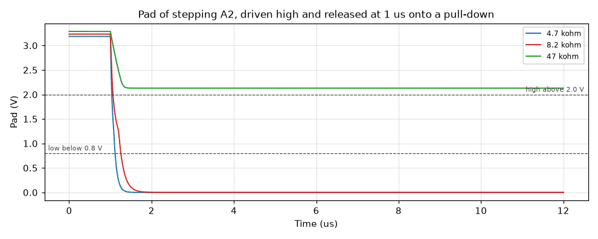

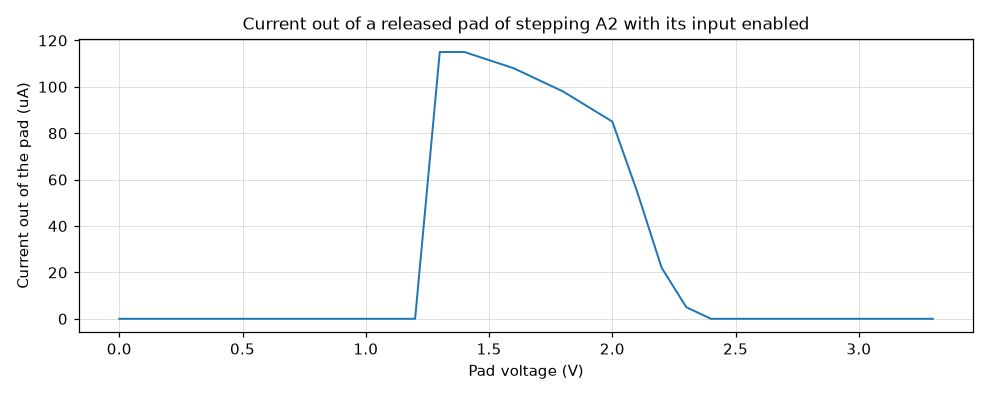

Notes:

- The datasheet gives limits for the output levels and no typical value: the pad
  model takes the limits of the 4 mA setting, 170 ohm high and 125 ohm low, and
  the benches also run a strong pad of 30 ohm, which is an assumption.
- The current of erratum E9 is the static curve of figure 157 for a typical
  part; a real pad shows it only with its input enabled, and stepping A3 does
  not have it.
- The capacitance of a pad, 5 pF with its pin and the socket, is an assumption;
  the load of the module, 0.1 W, is one as well.

Decks: [digital-rp2350.release.cir](digital-rp2350.release.cir),
[digital-rp2350.static.cir](digital-rp2350.static.cir),
[digital-rp2350.supply.cir](digital-rp2350.supply.cir).

## `models/digital-sn74lv165a`

**SN74LV165A model against its datasheet.**

A register is loaded and shifted into the load of the datasheet. While the load
pin is low the input D7 rises and the output follows it. Then the load pin goes
high and nine clocks shift the pattern out, with the serial input high. The
delays are read at half the supply, with the typical parameters and with the
parameters set to the limits of the datasheet. A second deck loads the two
outputs with 6 mA.

Answers: the model of the side data registers U33 and U34.

| Figure | Simulated | Specification | Limits | Verdict | Source |
| --- | --- | --- | --- | --- | --- |
| Bits of the pattern that come out wrong, of nine | 0 | | at most 0 | pass | TI SCLS402R, page 11: D7 first, the serial input after D0 |
| Clock to output, typical parameters | 8.692 ns | 8.6 ns (+1.07 %) | 8.17 ns to 9.03 ns | pass | TI SCLS402R, page 7: 8.6 ns typical at 3.3 V into 15 pF |
| Input D7 to output while the load pin is low, typical parameters | 8.793 ns | 8.9 ns (-1.20 %) | 8.455 ns to 9.345 ns | pass | TI SCLS402R, page 7: 8.9 ns typical; the load pin itself has 9.1 ns |
| Clock to output, parameter for the largest delay | 18.09 ns | 18 ns (+0.51 %) | 17.46 ns to 18.54 ns | pass | TI SCLS402R, page 7: 18 ns at the most |
| Clock to output, parameter for the smallest delay | 851.6 ps | 1 ns (-14.84 %) | 800 ps to 1.2 ns | pass | TI SCLS402R, page 7: 1 ns at the least |
| Output high with 6 mA at 3.0 V | 2.7 V | | at least 2.48 V | pass | TI SCLS402R, page 6: 2.48 V at the least |
| Output low with 6 mA at 3.0 V | 300 mV | | at most 440 mV | pass | TI SCLS402R, page 6: 0.44 V at the most |

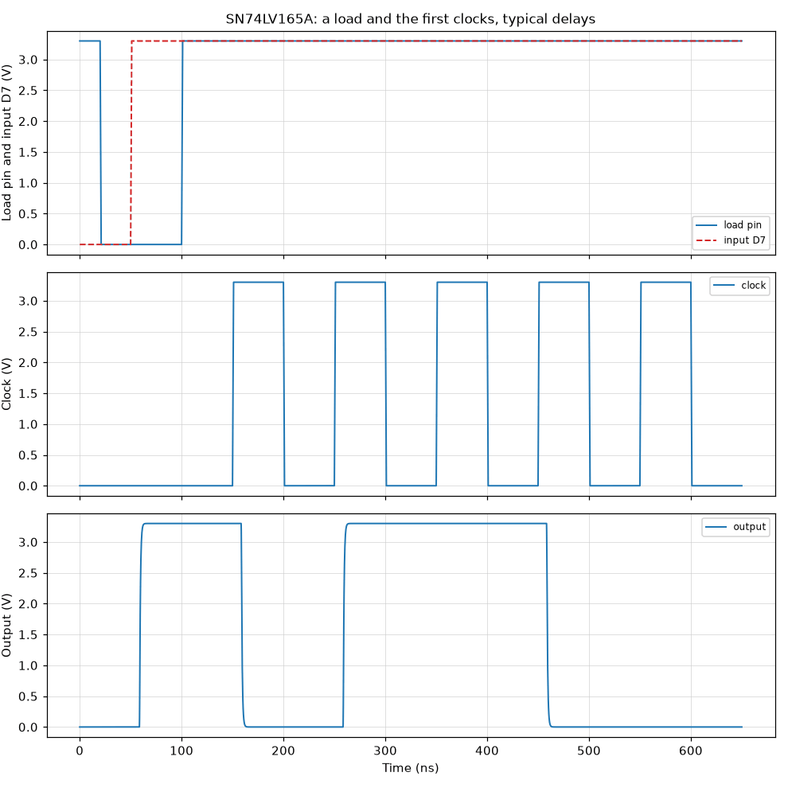

Notes:

- The delay parameters of the model are the delays of the datasheet less 1 ns,
  which the output stage adds into 15 pF.
- The threshold of the inputs is half the supply and the output resistance 50
  ohm: assumptions inside the limits of the datasheet. The model does not check
  pulse widths, setup or hold times; the benches of the side data measure them
  at the pins.

Decks: [digital-sn74lv165a.levels.cir](digital-sn74lv165a.levels.cir),
[digital-sn74lv165a.typical.cir](digital-sn74lv165a.typical.cir).

## `models/digital-sn74lvc8t245`

**SN74LVC8T245 model against its datasheet.**

One part is run with six supplies on its B side and 3.3 V on its A side. An edge
from 50 ohm into the load of the datasheet gives the delay, a slow ramp the
threshold, a square wave of 10 MHz the charge that an input edge costs the
supply of the B side, and an edge behind 330 ohm the capacitance of the pin. An
operating point gives the output levels at 24 mA, the supply current at rest and
the state of the output without supply on the B side.

Answers: the model of the level translator U38.

| Figure | Simulated | Specification | Limits | Verdict | Source |
| --- | --- | --- | --- | --- | --- |
| Input level at which the output changes, 1.65 V on the B side | 825.2 mV | | 577.5 mV to 1.073 V | pass | TI SCES584D, page 7: between the low and the high input level |
| Delay B to A into 15 pF and 2 kohm, 1.65 V on the B side | 3.503 ns | | 800 ps to 7.2 ns | pass | TI SCES584D, page 11 |
| Supply current of the B side for one input at 10 MHz, 1.65 V | 33.02 µA | 33 µA (+0.08 %) | 29.7 µA to 36.3 µA | pass | TI SCES584D, page 11: power-dissipation capacitance times voltage and frequency |
| Input level at which the output changes, 1.8 V on the B side | 900.2 mV | | 630 mV to 1.17 V | pass | TI SCES584D, page 7: between the low and the high input level |
| Delay B to A into 15 pF and 2 kohm, 1.8 V on the B side | 3.494 ns | | 800 ps to 7.2 ns | pass | TI SCES584D, page 11 |
| Supply current of the B side for one input at 10 MHz, 1.8 V | 36.03 µA | 36 µA (+0.08 %) | 32.4 µA to 39.6 µA | pass | TI SCES584D, page 11: power-dissipation capacitance times voltage and frequency |
| Input level at which the output changes, 2.5 V on the B side | 1.25 V | | 700 mV to 1.7 V | pass | TI SCES584D, page 7: between the low and the high input level |
| Delay B to A into 15 pF and 2 kohm, 2.5 V on the B side | 3.404 ns | | 800 ps to 6.2 ns | pass | TI SCES584D, page 11 |
| Supply current of the B side for one input at 10 MHz, 2.5 V | 50.04 µA | 50 µA (+0.08 %) | 45 µA to 55 µA | pass | TI SCES584D, page 11: power-dissipation capacitance times voltage and frequency |
| Input level at which the output changes, 3.3 V on the B side | 1.65 V | | 800 mV to 2 V | pass | TI SCES584D, page 7: between the low and the high input level |
| Delay B to A into 15 pF and 2 kohm, 3.3 V on the B side | 3.486 ns | | 700 ps to 6.1 ns | pass | TI SCES584D, page 11 |
| Supply current of the B side for one input at 10 MHz, 3.3 V | 66.05 µA | 66 µA (+0.08 %) | 59.4 µA to 72.6 µA | pass | TI SCES584D, page 11: power-dissipation capacitance times voltage and frequency |
| Capacitance of an input pin, from its edge behind 330 ohm | 8.494 pF | 8.5 pF (-0.07 %) | 8 pF to 10 pF | pass | TI SCES584D, page 9: 8.5 pF typical, 10 pF at the most |
| Input level at which the output changes, 5 V on the B side | 2.5 V | | 1.5 V to 3.5 V | pass | TI SCES584D, page 7: between the low and the high input level |
| Delay B to A into 15 pF and 2 kohm, 5 V on the B side | 3.503 ns | | 600 ps to 6 ns | pass | TI SCES584D, page 11 |
| Supply current of the B side for one input at 10 MHz, 5 V | 150 µA | 150 µA (-0.01 %) | 135 µA to 165 µA | pass | TI SCES584D, page 11: power-dissipation capacitance times voltage and frequency |
| Input level at which the output changes, 5.5 V on the B side | 2.75 V | | 1.65 V to 3.85 V | pass | TI SCES584D, page 7: between the low and the high input level |
| Delay B to A into 15 pF and 2 kohm, 5.5 V on the B side | 3.377 ns | | 600 ps to 6 ns | pass | TI SCES584D, page 11 |
| Supply current of the B side for one input at 10 MHz, 5.5 V | 165 µA | 165 µA (-0.01 %) | 148.5 µA to 181.5 µA | pass | TI SCES584D, page 11: power-dissipation capacitance times voltage and frequency |
| Output high with 24 mA at 3.0 V | 2.52 V | | at least 2.4 V | pass | TI SCES584D, page 9: 2.4 V at the least |
| Output low with 24 mA at 3.0 V | 480 mV | | at most 550 mV | pass | TI SCES584D, page 9: 0.55 V at the most |
| Supply current of the B side at rest | 8 µA | 8 µA (+0.00 %) | 7.6 µA to 8.4 µA | pass | TI SCES584D, page 9: 8 uA at the most |
| Output with 100 kohm to 3.0 V, input high, no supply on the B side | 3 V | | at least 2.95 V | pass | TI SCES584D, page 15: outputs open with a supply below 0.1 V |

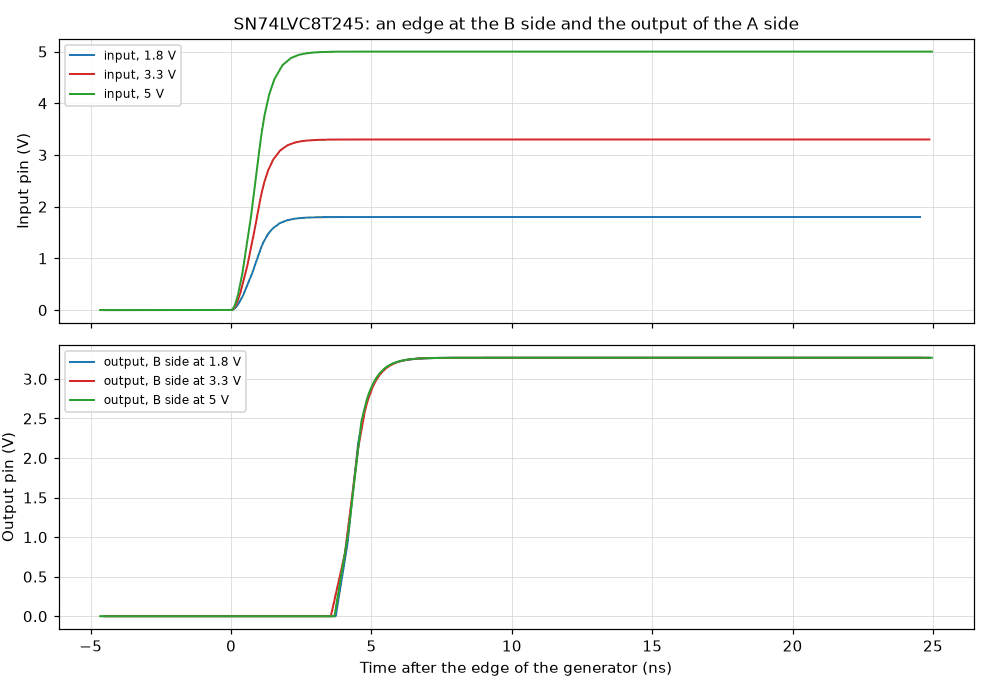

Notes:

- The threshold of the model is half the supply of the B side, an assumption
  inside the input levels of the datasheet. A real part may switch anywhere
  between the two levels; the benches of the logic inputs read both.
- The delay of the model is 3 ns plus the edge of its output, an assumption
  inside the limits of the datasheet; the benches set it to a limit where the
  result depends on it.
- The supply current at rest is set to the maximum of the datasheet, which gives
  no typical value.

Decks: [digital-sn74lvc8t245.3p3v.cir](digital-sn74lvc8t245.3p3v.cir),
[digital-sn74lvc8t245.static.cir](digital-sn74lvc8t245.static.cir).

## `models/digital-tpd4e1u06`

**TPD4E1U06 model against its datasheet.**

A current is forced into one line of the array and out of it. The breakdown at 1
mA is read for the three values of the parameter, the forward voltage at 1 mA,
and the voltages at the pulsed currents of the datasheet curves. A neighbor line
that rests at 3.3 V behind 1 kohm shows whether a line in breakdown disturbs it.
The capacitance of a line is read at 2.5 V.

Answers: the model of the arrays U35, U36 and U37 at the logic port.

| Figure | Simulated | Specification | Limits | Verdict | Source |
| --- | --- | --- | --- | --- | --- |
| Breakdown at 1 mA, parameter at the lower limit | 6.502 V | 6.5 V (+0.03 %) | 6.4 V to 6.6 V | pass | TI SLVSBQ9D, page 5: 6.5 V at the least |
| Breakdown at 1 mA, default parameter | 7.502 V | 7.5 V (+0.03 %) | 6.5 V to 8.5 V | pass | TI SLVSBQ9D, page 5: 6.5 V to 8.5 V |
| Breakdown at 1 mA, parameter at the upper limit | 8.502 V | 8.5 V (+0.02 %) | 8.4 V to 8.6 V | pass | TI SLVSBQ9D, page 5: 8.5 V at the most |
| Voltage below ground at 1 mA out of a line | 751.1 mV | 750 mV (+0.15 %) | 675 mV to 825 mV | pass | TI SLVSBQ9D, page 6, figure 5 (read from the graph) |
| Voltage of a line at 6 A into it | 13.35 V | 13 V (+2.70 %) | 11.44 V to 14.56 V | pass | TI SLVSBQ9D, page 6, figure 1 (read from the graph) |
| Voltage of a line at 12 A into it | 18.79 V | 18.5 V (+1.55 %) | 16.28 V to 20.72 V | pass | TI SLVSBQ9D, page 6, figure 1 (read from the graph) |
| Voltage of a line at 18 A into it | 24.21 V | 24 V (+0.87 %) | 21.12 V to 26.88 V | pass | TI SLVSBQ9D, page 6, figure 1 (read from the graph) |
| Voltage of a line at 27 A into it | 32.33 V | 30.5 V (+6.00 %) | 26.84 V to 34.16 V | pass | TI SLVSBQ9D, page 6, figure 1 (read from the graph) |
| Voltage below ground at 9 A out of a line | 6.386 V | 7 V (-8.77 %) | 5.95 V to 8.05 V | pass | TI SLVSBQ9D, page 6, figure 2 (read from the graph) |
| Voltage below ground at 18 A out of a line | 11.8 V | 11.5 V (+2.64 %) | 9.775 V to 13.22 V | pass | TI SLVSBQ9D, page 6, figure 2 (read from the graph) |
| Dynamic resistance between 10 A and 20 A, line to ground | 903.6 mΩ | 1 Ω (-9.64 %) | 850 mΩ to 1.15 Ω | pass | TI SLVSBQ9D, page 5 |
| Neighbor line at 3.3 V behind 1 kohm while 1 A flows into the driven line | 3.3 V | | 3.25 V to 3.35 V | pass | a line in breakdown must not move a line that rests below it |
| Capacitance of a line at 2.5 V and 1 MHz | 884.3 fF | 800 fF (+10.54 %) | 600 fF to 1 pF | pass | TI SLVSBQ9D, page 5: 0.8 pF typical, 1 pF at the most |

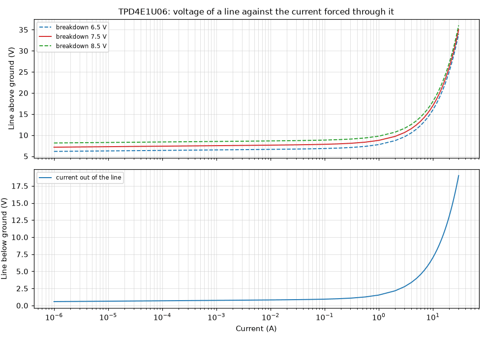

Notes:

- The pulsed curves of the datasheet are taken with pulses of 100 ns. In a surge
  of 8/20 us the part heats and clamps higher, 11 V at 1 A and 15 V at 3 A (page
  5); the model does not heat and gives lower values there.
- The model says nothing about leakage and nothing about the current or the
  energy that destroys the part: the datasheet rates 3 A and 45 W for a surge of
  8/20 us and gives no figure for a continuous current.
- The limits on the pulsed points are the fit this project asks of the model.

Decks: [digital-tpd4e1u06.lines.cir](digital-tpd4e1u06.lines.cir).

## `models/mosfet-csd17577q3a`

**CSD17577Q3A model against its datasheet.**

The model is put in the test circuits of a datasheet. A forced drain current
with the gate held gives the on-resistance, the gate tied to the drain the
threshold, and a constant current into the gate with a clamped current as load
the gate charge. The element is one part of the schematic of this type, so the
model map decides the model.

Answers: the model of Q4, Q5, Q8, Q9, Q14, Q15 and Q16.

| Figure | Simulated | Vendor models | Specification | Limits | Verdict | Source |
| --- | --- | --- | --- | --- | --- | --- |
| On-resistance at 4.5 V on the gate and 16 A | 5.34 mΩ | 6.053 mΩ | 5.3 mΩ (+0.75 %) | 4.77 mΩ to 5.83 mΩ | pass | TI SLPS515A page 1, typical |
| On-resistance at 10 V on the gate and 16 A | 4.002 mΩ | 5.21 mΩ | 4 mΩ (+0.05 %) | 3.6 mΩ to 4.4 mΩ | pass | TI SLPS515A page 1, typical |
| Gate threshold at 250 uA | 1.376 V | 1.394 V | 1.4 V (-1.70 %) | 1 V to 2 V | pass | TI SLPS515A page 1, typical |
| Gate charge to 4.5 V | 12.32 nC | 9.289 nC | 12 nC (+2.66 %) | 9 nC to 15 nC | pass | TI SLPS515A page 1, typical |
| Gate voltage while the drain falls | 2.79 V | 2.732 V | | | | |
| Gate charge while the drain falls from 90 % to 10 % | 2.695 nC | 1.41 nC | | | | |

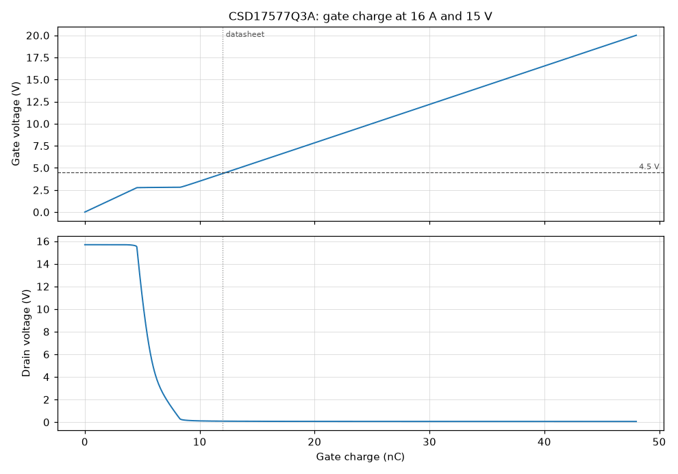

Notes:

- The limits here are the fit this project asks of a model: 10 % on the
  on-resistance, 25 % on the gate charge. They are not datasheet limits.
- The model is a typical part at 25 C. It says nothing about leakage.

Models. written here: CSD17577Q3A.

Decks: [mosfet-csd17577q3a.charge.cir](mosfet-csd17577q3a.charge.cir).

## `models/mosfet-irlml0030`

**IRLML0030 model against its datasheet.**

The model is put in the test circuits of a datasheet. A forced drain current
with the gate held gives the on-resistance, the gate tied to the drain the
threshold, and a constant current into the gate with a clamped current as load
the gate charge. The element is one part of the schematic of this type, so the
model map decides the model.

Answers: the model of the range switches Q12 and Q13.

| Figure | Simulated | Specification | Limits | Verdict | Source |
| --- | --- | --- | --- | --- | --- |
| On-resistance at 4.5 V on the gate and 4 A | 33.42 mΩ | 33 mΩ (+1.27 %) | 29.7 mΩ to 36.3 mΩ | pass | Infineon PD-96278B page 2, typical |
| On-resistance at 10 V on the gate and 4 A | 20.44 mΩ | 22 mΩ (-7.11 %) | 19.8 mΩ to 24.2 mΩ | pass | Infineon PD-96278B page 2, typical |
| Gate threshold at 25 uA | 1.613 V | 1.7 V (-5.10 %) | 1.3 V to 2.3 V | pass | Infineon PD-96278B page 2, typical |
| Gate charge to 4.5 V | 3.001 nC | 2.6 nC (+15.43 %) | 1.95 nC to 3.25 nC | pass | Infineon PD-96278B page 2, typical |
| Gate voltage while the drain falls | 2.36 V | | | | |
| Gate charge while the drain falls from 90 % to 10 % | 780.7 pC | | | | |

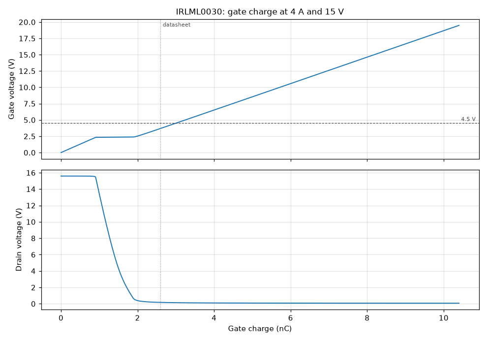

Notes:

- The limits here are the fit this project asks of a model: 10 % on the
  on-resistance, 25 % on the gate charge. They are not datasheet limits.
- The model is a typical part at 25 C. It says nothing about leakage.

Models. written here: IRLML0030.

Decks: [mosfet-irlml0030.charge.cir](mosfet-irlml0030.charge.cir).

## `models/output-stage-buffer`

**OPA197 model with a capacitive load behind an isolation resistor.**

The buffer of the schematic drives the loads of table 3 of its datasheet. The
datasheet gives, for a capacitor behind an isolation resistor, the resistor that
leaves 45 degrees and the one that leaves 60 degrees of phase margin, with the
overshoot measured for a step of 100 mV. The guard buffer works in that circuit,
with 47 ohm and 100 nF, so this is the property of the model that the output
stage rests on. The loop gain is taken by double injection at the output of the
amplifier, with the feedback closed, and the step is run in the same circuit.
The last row is the load of the board, for which the table has no entry.

Answers: the model of the guard buffer U25 in the use the output stage makes of
it.

| Figure | Simulated | Vendor models | Specification | Limits | Verdict | Source |
| --- | --- | --- | --- | --- | --- | --- |
| 1 nF behind 24 ohm: phase margin | 44.27 ° | 78.55 ° | 45 ° (-1.63 %) | 35 ° to 55 ° | pass | TI SBOS737C, table 3, page 23 |
| 1 nF behind 24 ohm: overshoot of a 100 mV step | 29.27 % | 11.99 % | 22.5 % (+30.09 %) | 14.5 % to 30.5 % | pass | TI SBOS737C, table 3, page 23, measured |
| 1 nF behind 100 ohm: phase margin | 81.74 ° | 98.84 ° | 60 ° (+36.23 %) | 50 ° to 70 ° | **FAIL** | TI SBOS737C, table 3, page 23 |
| 1 nF behind 100 ohm: overshoot of a 100 mV step | 4.514 % | 2.909 % | 9 % (-49.84 %) | 1 % to 17 % | pass | TI SBOS737C, table 3, page 23, measured |
| 10 nF behind 20 ohm: phase margin | 54.61 ° | 74.76 ° | 45 ° (+21.36 %) | 35 ° to 55 ° | pass | TI SBOS737C, table 3, page 23 |
| 10 nF behind 20 ohm: overshoot of a 100 mV step | 18.09 % | 13.21 % | 22.1 % (-18.14 %) | 14.1 % to 30.1 % | pass | TI SBOS737C, table 3, page 23, measured |
| 10 nF behind 51 ohm: phase margin | 89.08 ° | 123 ° | 60 ° (+48.47 %) | 50 ° to 70 ° | **FAIL** | TI SBOS737C, table 3, page 23 |
| 10 nF behind 51 ohm: overshoot of a 100 mV step | 0 % | 0.046 % | 8.7 % (-100.00 %) | 0.7 % to 16.7 % | **FAIL** | TI SBOS737C, table 3, page 23, measured |
| 100 nF behind 6.2 ohm: phase margin | 48.03 ° | 54.39 ° | 45 ° (+6.74 %) | 35 ° to 55 ° | pass | TI SBOS737C, table 3, page 23 |
| 100 nF behind 6.2 ohm: overshoot of a 100 mV step | 21.62 % | 19.38 % | 23.1 % (-6.39 %) | 15.1 % to 31.1 % | pass | TI SBOS737C, table 3, page 23, measured |
| 100 nF behind 15.8 ohm: phase margin | 82.1 ° | 93.64 ° | 60 ° (+36.84 %) | 50 ° to 70 ° | **FAIL** | TI SBOS737C, table 3, page 23 |
| 100 nF behind 15.8 ohm: overshoot of a 100 mV step | 0 % | 0 % | 8.6 % (-100.00 %) | 0.6 % to 16.6 % | **FAIL** | TI SBOS737C, table 3, page 23, measured |
| 1000 nF behind 2 ohm: phase margin | 46.77 ° | 48.6 ° | 45 ° (+3.94 %) | 35 ° to 55 ° | pass | TI SBOS737C, table 3, page 23 |
| 1000 nF behind 2 ohm: overshoot of a 100 mV step | 21.93 % | 21.34 % | 21 % (+4.43 %) | 13 % to 29 % | pass | TI SBOS737C, table 3, page 23, measured |
| 1000 nF behind 4.7 ohm: phase margin | 77.88 ° | 81.29 ° | 60 ° (+29.81 %) | 50 ° to 70 ° | **FAIL** | TI SBOS737C, table 3, page 23 |
| 1000 nF behind 4.7 ohm: overshoot of a 100 mV step | 0 % | 0 % | 8.6 % (-100.00 %) | 0.6 % to 16.6 % | **FAIL** | TI SBOS737C, table 3, page 23, measured |
| Load of the board, 100 nF behind 47 ohm: phase margin | 98.07 ° | 127.5 ° | | | | |
| Load of the board, 100 nF behind 47 ohm: crossover | 1.273 MHz | 1.922 MHz | | | | |
| Load of the board, 100 nF behind 47 ohm: overshoot | 0 % | 0 % | | | | |
| Without a capacitor: frequency at which the loop gain is 1 | 8.712 MHz | 9.978 MHz | 10 MHz (-12.88 %) | 8 MHz to 12 MHz | pass | TI SBOS737C, page 8: unity gain bandwidth 10 MHz |
| Without a capacitor: phase margin | 57.21 ° | 64.27 ° | | | | |

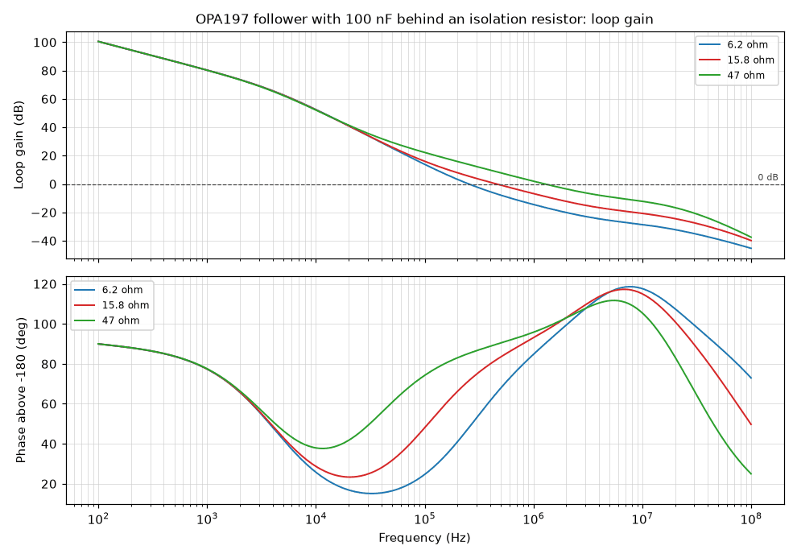

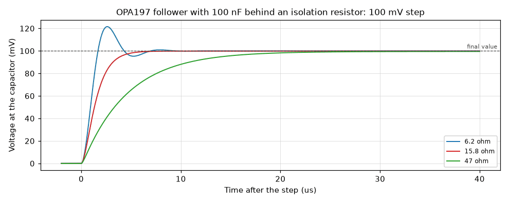

Notes:

- The limits are the fit this project asks of the model: 10 degrees around the
  phase margin of the table and 8 points around its overshoot. They are not
  datasheet limits.
- What fails is a limit of the model, not of the board. Where the table gives 45
  degrees the model is close. Where the table gives 60 degrees the model leaves
  15 to 30 degrees more, and no overshoot where 9 % were measured: an output
  impedance that is a resistance up to 1 MHz, as figure 26 of the datasheet
  shows it, does not reproduce that column. The model is too optimistic once the
  isolation resistor is larger than the value for 45 degrees.
- The guard buffer has 47 ohm in front of 100 nF, three times the resistor of
  the 60 degree row of the table. Its margin is therefore above 60 degrees by
  the table itself; the figure that the model gives for the board is too high by
  what the 60 degree rows show. In the vendor tier the model of the manufacturer
  is further from the table than the one written here, on the optimistic side in
  every row.
- The rails are those of the board, +12 V and -4 V; the datasheet states the
  table for +18 V and -18 V. The model does not depend on its rails.

Models. written here: OUTPUT_OPA197_PROBE.

Decks:
[output-stage-buffer.series-100n-15p8r.cir](output-stage-buffer.series-100n-15p8r.cir).

## `models/output-stage-suppressor`

**PTVS15VS1UR model against its datasheet.**

The suppressor of the schematic is put in the test circuits of its datasheet. A
current is forced through it backward and forward and the voltage is read: the
breakdown voltage at 1 mA, the clamping voltage at the rated peak current and
the forward voltage. The stand-off voltage is applied and the current is read,
and a small signal gives the capacitance. The datasheet has neither a forward
curve nor a capacitance, so those figures carry no limit: they are what the
benches of the output stage assume. With the model written here the run is
repeated for a part at each limit of the breakdown voltage and for the larger
forward resistance that the benches also use.

Answers: the model of the suppressor D21 of the output terminal.

| Figure | Simulated | Vendor models | Specification | Limits | Verdict | Source |
| --- | --- | --- | --- | --- | --- | --- |
| Breakdown voltage at 1 mA | 17.61 V | 17.59 V | 17.6 V (+0.06 %) | 16.7 V to 18.5 V | pass | Nexperia PTVSxS1UR series, 1 December 2025, table 8, page 4 |
| Clamping voltage at 16.4 A | 23.49 V | 18.08 V | | at most 24.4 V | pass | Nexperia PTVSxS1UR series, 1 December 2025, table 8, page 4: at most 24.4 V (10/1000 us pulse) |
| Reverse current at the stand-off voltage of 15 V | 1.013 nA | 23.58 nA | 1 nA (+1.34 %) | at most 100 nA | pass | Nexperia PTVSxS1UR series, 1 December 2025, table 8, page 4: 0.001 uA typical, 0.1 uA at most |
| Forward voltage at 0.1 A (assumption) | 750.4 mV | 790.8 mV | | | | |
| Forward voltage at 1 A (assumption) | 842.9 mV | 864.8 mV | | | | |
| Forward voltage at 10 A (assumption) | 1.178 V | 1.052 V | | | | |
| Capacitance at 0 V and 1 MHz (assumption) | 800 pF | 787 pF | | | | |
| Capacitance at 5 V and 1 MHz (assumption) | 384 pF | 379.2 pF | | | | |
| Part with the lowest breakdown voltage: at 1 mA | 16.7 V | | 16.7 V (+0.01 %) | 16.65 V to 16.75 V | pass | Nexperia PTVSxS1UR series, 1 December 2025, table 8, page 4 |
| Part with the highest breakdown voltage: at 1 mA | 18.51 V | | 18.5 V (+0.06 %) | 18.45 V to 18.55 V | pass | Nexperia PTVSxS1UR series, 1 December 2025, table 8, page 4 |
| Part with the highest breakdown voltage: clamping voltage at 16.4 A | 24.39 V | | 24.4 V (-0.03 %) | at most 24.4 V | pass | Nexperia PTVSxS1UR series, 1 December 2025, table 8, page 4 |
| Forward voltage at 10 A with 0.15 ohm of forward resistance (assumption) | 2.378 V | | | | | |

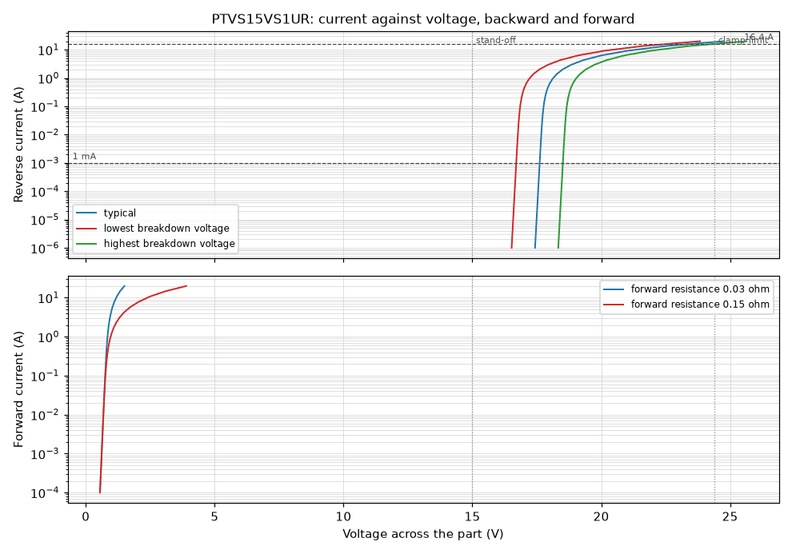

Notes:

- The datasheet states the clamping voltage for a pulse of a millisecond, in
  which the part heats. The model has no temperature: for microseconds it clamps
  too high, which is the cautious side for the parts behind it.
- The datasheet has no forward curve. The forward voltage of the model, 0.75 V
  at 0.1 A, and its forward resistance, 0.03 ohm with a second run at 0.15 ohm,
  are assumptions; so is the capacitance.
- The reverse current below the breakdown is a resistor that gives the typical 1
  nA at 15 V. No leakage figure may be taken from this model: the datasheet
  gives none at 5 V or above 25 C.

Models. written here: OUTPUT_PTVS15V.

Decks: [output-stage-suppressor.curve.cir](output-stage-suppressor.curve.cir),
[output-stage-suppressor.standoff.cir](output-stage-suppressor.standoff.cir).

## `models/output-stage-transistor`

**CSD17577Q3A at the limits of its datasheet: the variants of the output
stage.**

The variants of the transistor model are put in the test circuits of the
datasheet. The benches of the output stage use the typical model of the shared
file and three variants of it written for this block: the gate threshold at its
lower and at its upper limit, and the on-resistance at its upper limit. Here
each variant stands in the circuit in which the datasheet states that limit. The
transfer curves show what the shifted threshold does at the currents of an
in-rush, 0.1 A to 1 A.

Answers: the models that stand for a transistor of the output pair at a limit.

| Figure | Simulated | Vendor models | Specification | Limits | Verdict | Source |
| --- | --- | --- | --- | --- | --- | --- |
| Typical model: gate threshold at 250 uA | 1.376 V | 1.394 V | 1.4 V (-1.70 %) | 1.3 V to 1.5 V | pass | TI SLPS515A, page 3: 1.4 V typical |
| Variant LO: gate threshold at 250 uA | 1.077 V | 1.077 V | 1.1 V (-2.14 %) | 1.045 V to 1.155 V | pass | TI SLPS515A, page 3: 1.1 V, the lower limit |
| Variant HI: gate threshold at 250 uA | 1.776 V | 1.776 V | 1.8 V (-1.34 %) | 1.71 V to 1.89 V | pass | TI SLPS515A, page 3: 1.8 V, the upper limit |
| Variant RMAX: on-resistance at 4.5 V on the gate and 10 A | 6.453 mΩ | 6.453 mΩ | 6.4 mΩ (+0.83 %) | 6.208 mΩ to 6.592 mΩ | pass | TI SLPS515A, page 3: 6.4 mohm at most |
| Typical model: on-resistance at 4.5 V on the gate and 10 A | 5.325 mΩ | 6.042 mΩ | | | | |
| Variant RMAX: on-resistance at 10 V on the gate and 16 A | 4.819 mΩ | 4.819 mΩ | 4.8 mΩ (+0.39 %) | 4.656 mΩ to 4.944 mΩ | pass | TI SLPS515A, page 3: 4.8 mohm at most |
| Typical model: on-resistance at 10 V on the gate and 16 A | 4.002 mΩ | 5.21 mΩ | | | | |
| Model typical: gate voltage for 0.1 A at 5 V on the drain | 1.989 V | 2.058 V | | | | |
| Model typical: gate voltage for 1 A at 5 V on the drain | 2.265 V | 2.361 V | | | | |
| Model LO: gate voltage for 0.1 A at 5 V on the drain | 1.689 V | 1.689 V | | | | |
| Model LO: gate voltage for 1 A at 5 V on the drain | 1.965 V | 1.965 V | | | | |
| Model HI: gate voltage for 0.1 A at 5 V on the drain | 2.389 V | 2.389 V | | | | |
| Model HI: gate voltage for 1 A at 5 V on the drain | 2.665 V | 2.665 V | | | | |

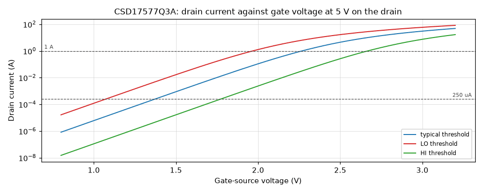

Notes:

- The variants are the typical model of the shared file with one property moved.
  The limits of 5 % and 3 % around the datasheet figures are the fit asked of a
  variant here; they are not datasheet limits.
- Between 250 uA and some amperes the datasheet gives one typical curve
  (figure 3) and no spread. The slope of the models below the threshold is a fit
  to those two ends; currents of microamperes and below taken from them are not
  datasheet values.
- The datasheet gives 1.4 ohm typical for the gate resistance (page 3); the
  shared model has 1 ohm.

Models. written here: CSD17577Q3A, OUTPUT_CSD17577_HI, OUTPUT_CSD17577_LO,
OUTPUT_CSD17577_RMAX.

## `models/path-switching-bc847b`

**BC847B model against its datasheet.**

The transistor Q7 of the schematic is put in the test circuits of its datasheet.
A forced collector current at 5 V gives the gain and the base-emitter voltage,
forced collector and base currents give the saturation voltages, and two
small-signal runs give the output capacitance and the transition frequency. The
last saturation point has equal base and collector current, which is how the
transistor works when it holds a mode pair open.

Answers: the model of the hold-off transistors Q6 and Q7.

| Figure | Simulated | Vendor models | Specification | Limits | Verdict | Source |
| --- | --- | --- | --- | --- | --- | --- |
| Current gain at 2 mA and 5 V | 289.8 | 241.9 | 290 (-0.06 %) | 200 to 450 | pass | Diodes Incorporated DS11108 Rev. 28-2, page 4 |
| Base-emitter voltage at 2 mA and 5 V | 660 mV | 705.1 mV | 660 mV (-0.01 %) | 580 mV to 700 mV | pass | Diodes Incorporated DS11108 Rev. 28-2, page 4 |
| Saturation voltage at 10 mA with 0.5 mA of base current | 92.21 mV | 80.75 mV | 90 mV (+2.46 %) | at most 250 mV | pass | Diodes Incorporated DS11108 Rev. 28-2, page 4: 90 mV typical, 250 mV at most |
| Saturation voltage at 100 mA with 5 mA of base current | 212.6 mV | 228.6 mV | 200 mV (+6.29 %) | at most 600 mV | pass | Diodes Incorporated DS11108 Rev. 28-2, page 4: 200 mV typical, 600 mV at most |
| Base-emitter voltage at 10 mA with 0.5 mA of base current | 720.1 mV | 775.5 mV | 700 mV (+2.87 %) | 665 mV to 735 mV | pass | Diodes Incorporated DS11108 Rev. 28-2, page 4, typical; 5 % asked of the fit |
| Base-emitter voltage at 100 mA with 5 mA of base current | 905.8 mV | 964.9 mV | 900 mV (+0.64 %) | 855 mV to 945 mV | pass | Diodes Incorporated DS11108 Rev. 28-2, page 4, typical; 5 % asked of the fit |
| Output capacitance at 10 V, emitter open | 2.985 pF | 3.001 pF | 3 pF (-0.50 %) | 2.25 pF to 3.75 pF | pass | Diodes Incorporated DS11108 Rev. 28-2, page 4, typical; 25 % asked of the fit |
| Transition frequency at 10 mA and 5 V | 302.8 MHz | 253.5 MHz | 300 MHz (+0.95 %) | at least 100 MHz | pass | Diodes Incorporated DS11108 Rev. 28-2, page 4: 300 MHz typical, 100 MHz at least |
| Current gain at 100 mA and 5 V | 126.2 | 108.1 | 100 (+26.22 %) | | | Diodes Incorporated DS11108 Rev. 28-2, page 5, figure 5, read from the curve of the type family |
| Current gain at 10 uA and 5 V | 213.9 | 22.92 | | | | not in the datasheet: an assumption of the model |
| Saturation voltage with 0.2 mA in the base and in the collector | 25.73 mV | 12.44 mV | | | | the state of the hold-off of a mode pair at -20 V |

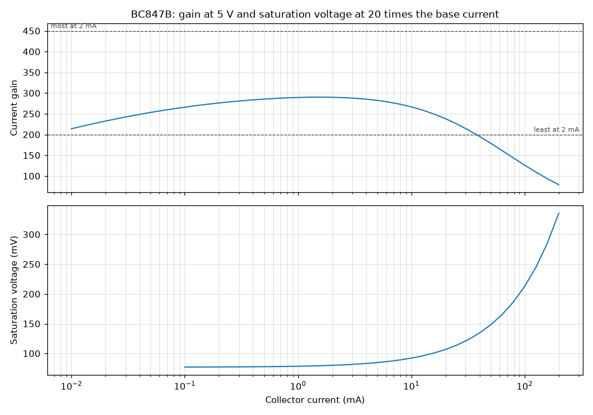

Notes:

- The limits of the gain, of the base-emitter voltage and of the saturation
  voltages are those of the datasheet; the limits of the typical figures are the
  fit this project asks of a model.
- The gain below 1 mA is an assumption: the datasheet states the gain at 2 mA
  only. The benches of the reversed supply run the two variants of the model
  with the least and the highest gain of the datasheet as well.
- The model has no breakdown and no leakage: the benches compare the simulated
  voltages with the ratings (45 V collector to emitter, 6 V emitter to base).

Models. written here: PATH_BC847B.

Decks: [path-switching-bc847b.active.cir](path-switching-bc847b.active.cir),
[path-switching-bc847b.capacitance.cir](path-switching-bc847b.capacitance.cir),
[path-switching-bc847b.saturation.cir](path-switching-bc847b.saturation.cir),
[path-switching-bc847b.transit.cir](path-switching-bc847b.transit.cir).

## `models/path-switching-bss138`

**BSS138 model of the path switching sheet against its datasheet.**

The transistor Q2 of the schematic is put in the test circuits of its datasheet.
The gate tied to the drain gives the threshold, a forced drain current the
on-resistance, swept drain and gate voltages the output characteristics and the
transconductance, and two small-signal runs the capacitances. One more point is
the state of the interlock: 3.3 V on the gate and the 3.3 mA that the series
resistor of the ampere request delivers.

Answers: the model of the interlock transistors Q2 and Q3.

| Figure | Simulated | Specification | Limits | Verdict | Source |
| --- | --- | --- | --- | --- | --- |
| Gate threshold at 250 uA | 1.099 V | 1.2 V (-8.43 %) | 500 mV to 1.5 V | pass | Diodes Incorporated DS30144 Rev. 25-2, page 2 |
| On-resistance at 10 V on the gate and 0.22 A | 1.416 Ω | 1.4 Ω (+1.15 %) | at most 3.5 Ω | pass | Diodes Incorporated DS30144 Rev. 25-2, page 2: 1.4 ohm typical, 3.5 ohm at most |
| Transconductance at 0.2 A and 25 V | 0.2755 S | | at least 0.1 S | pass | Diodes Incorporated DS30144 Rev. 25-2, page 2: 100 mS at least |
| Drain current at 2.5 V on the gate and 5 V on the drain | 182 mA | 200 mA (-9.01 %) | 170 mA to 230 mA | pass | Diodes Incorporated DS30144 Rev. 25-2, page 3, figure 1, read from the curve; 15 % asked of the fit |
| Drain current at 3 V on the gate and 5 V on the drain | 328.9 mA | 360 mA (-8.63 %) | 306 mA to 414 mA | pass | Diodes Incorporated DS30144 Rev. 25-2, page 3, figure 1, read from the curve; 15 % asked of the fit |
| Drain current at 3.5 V on the gate and 5 V on the drain | 518.9 mA | 545 mA (-4.79 %) | 463.2 mA to 626.8 mA | pass | Diodes Incorporated DS30144 Rev. 25-2, page 3, figure 1, read from the curve; 15 % asked of the fit |
| Input capacitance at 10 V | 47.7 pF | | at most 50 pF | pass | Diodes Incorporated DS30144 Rev. 25-2, page 2: 50 pF at most |
| Output capacitance at 10 V | 23.48 pF | | at most 25 pF | pass | Diodes Incorporated DS30144 Rev. 25-2, page 2: 25 pF at most |
| Reverse transfer capacitance at 10 V | 7.698 pF | | at most 8 pF | pass | Diodes Incorporated DS30144 Rev. 25-2, page 2: 8 pF at most |
| Drain voltage with 3.3 V on the gate and 3.3 mA | 11.17 mV | | | | the state of the interlock node with both requests high |

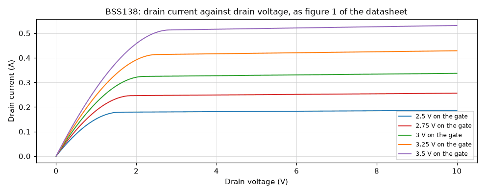

Notes:

- The table and the typical curves of the datasheet do not agree on the
  threshold; the model lies between them, at 1.1 V and 250 uA.
- The capacitances of the model are the upper limits of the datasheet. The
  benches of the interlock also run the variants with the threshold at 0.5 V and
  at 1.5 V.
- The gate resistance and the body diode are assumptions; the model has no
  breakdown and says nothing about leakage.

Models. written here: PATH_BSS138.

Decks:
[path-switching-bss138.capacitance.cir](path-switching-bss138.capacitance.cir),
[path-switching-bss138.curves.cir](path-switching-bss138.curves.cir),
[path-switching-bss138.gain.cir](path-switching-bss138.gain.cir),
[path-switching-bss138.static.cir](path-switching-bss138.static.cir),
[path-switching-bss138.threshold.cir](path-switching-bss138.threshold.cir).

## `models/path-switching-fuse`

**Model of the fuse 0466004.NR against its datasheet.**

The fuse F1 of the schematic carries a current from zero to its rated 4 A. The
model is the cold resistance of the datasheet and nothing else, so the run shows
where it agrees with the datasheet and where it does not.

Answers: the model of the fuse F1 of the VIN terminal.

| Figure | Simulated | Specification | Limits | Verdict | Source |
| --- | --- | --- | --- | --- | --- |
| Resistance at 10 % of the rated current | 14 mΩ | 14 mΩ (+0.00 %) | 13.9 mΩ to 14.1 mΩ | pass | Littelfuse 466 series, revised 05/18/15, page 1: nominal cold resistance |
| Voltage drop at 1 A, the largest current of the instrument | 14 mV | | | | |
| Voltage drop at the rated current of 4 A | 56 mV | 74.5 mV (-24.83 %) | | | Littelfuse 466 series, revised 05/18/15, page 1: nominal voltage drop, with the fuse warm |

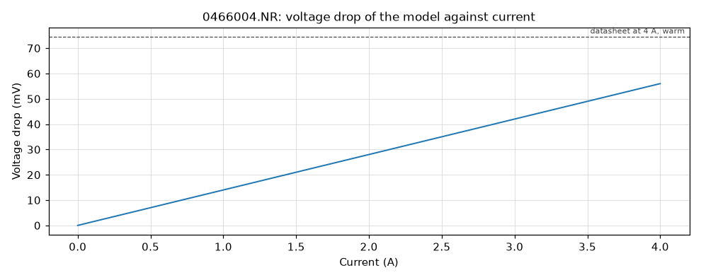

Notes:

- The figures were read in the copy of the datasheet that a distributor holds;
  the site of the manufacturer did not answer.
- The model does not heat: at the rated current it reads a quarter less than the
  datasheet. At 1 A the heating is one sixteenth of that at 4 A, so the cold
  resistance is the right figure for the path drop of this instrument.
- The datasheet states no tolerance of the resistance, and the model does not
  open: the benches compare the simulated I2t with the melting figure of 1.764
  A2s.

Models. written here: PATH_FUSE_0466004.

Decks: [path-switching-fuse.drop.cir](path-switching-fuse.drop.cir).

## `models/path-switching-smaj20ca`

**SMAJ20CA model against its datasheet.**

The suppressor D14 of the schematic carries a forced current in both directions.
The run is made with the three variants of the model: the middle of the
breakdown voltage and its two limits. The voltage at 1 mA is the breakdown
voltage and the voltage at 12.3 A the clamping voltage of the datasheet. A
second run holds the stand-off voltage of 20 V and reads the capacitance.

Answers: the model of the suppressor D14 of the VIN terminal.

| Figure | Simulated | Specification | Limits | Verdict | Source |
| --- | --- | --- | --- | --- | --- |
| Breakdown voltage at 1 mA, typical variant | 23.36 V | 23.35 V (+0.03 %) | 22.15 V to 24.55 V | pass | Vishay 88390 of 09-Jan-2024, page 2: 22.2 V to 24.5 V |
| Clamping voltage at 12.3 A, typical variant | 31.25 V | | at most 32.45 V | pass | Vishay 88390 of 09-Jan-2024, page 2: 32.4 V at most |
| Difference between the two directions at 12.3 A | 2.369 µV | | at most 10 mV | pass | Vishay 88390 of 09-Jan-2024, page 1: the characteristics apply in both directions |
| Breakdown voltage at 1 mA, low variant | 22.21 V | 22.2 V (+0.03 %) | 22.15 V to 24.55 V | pass | Vishay 88390 of 09-Jan-2024, page 2: 22.2 V to 24.5 V |
| Clamping voltage at 12.3 A, low variant | 30.1 V | | at most 32.45 V | pass | Vishay 88390 of 09-Jan-2024, page 2: 32.4 V at most |
| Breakdown voltage at 1 mA, high variant | 24.51 V | 24.5 V (+0.03 %) | 22.15 V to 24.55 V | pass | Vishay 88390 of 09-Jan-2024, page 2: 22.2 V to 24.5 V |
| Clamping voltage at 12.3 A, high variant | 32.4 V | | at most 32.45 V | pass | Vishay 88390 of 09-Jan-2024, page 2: 32.4 V at most |
| Current at the stand-off voltage of 20 V | 19.81 nA | | at most 1 µA | pass | Vishay 88390 of 09-Jan-2024, page 2: 1 uA at most |
| Capacitance at 20 V and 1 MHz | 311.7 pF | 300 pF (+3.89 %) | 225 pF to 375 pF | pass | Vishay 88390 of 09-Jan-2024, page 4, figure 4, read from the curve; 25 % asked of the fit |

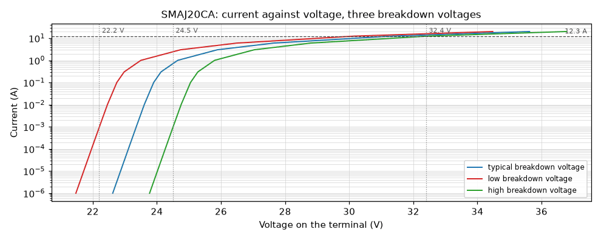

Notes:

- The datasheet states the clamping voltage as a maximum after a pulse of a
  millisecond, which heats the part. Every variant rises by the same 7.9 V from
  1 mA to 12.3 A, so the variant with the highest breakdown voltage clamps at
  the datasheet maximum; in a pulse of microseconds a real part clamps lower
  than these models.
- The current at the stand-off voltage is set by two resistors that keep the
  middle node of the model defined: it is no leakage figure.
- The models have no heating and no limit of pulse power; the benches compare
  the simulated pulses with figure 1 of the datasheet.

Models. written here: PATH_SMAJ20CA, PATH_SMAJ20CA_HI, PATH_SMAJ20CA_LO.

Decks:
[path-switching-smaj20ca.curve-typical.cir](path-switching-smaj20ca.curve-typical.cir),
[path-switching-smaj20ca.standoff.cir](path-switching-smaj20ca.standoff.cir).

## `models/power-input-capacitors`

**Capacitor models of the power input against their datasheets.**

The capacitors that set the transients of the 5 V rail are put on a current. A
small signal gives the impedance of the aluminum capacitor at 120 Hz and 100
kHz. A constant current charges four ceramic capacitors from 0 V with the bias
model that the benches of the power input give them; the slope of the voltage is
the capacitance that is left at that voltage.

Answers: the aluminum capacitor C11 and the ceramic capacitors under bias.

| Figure | Simulated | Specification | Limits | Verdict | Source |
| --- | --- | --- | --- | --- | --- |
| C11: capacitance at 120 Hz | 47 µF | 47 µF (+0.00 %) | 37.6 µF to 56.4 µF | pass | Wurth 865060343004, page 1: 47 uF, 20 % |
| C11: impedance at 100 kHz | 441.3 mΩ | | at most 444.4 mΩ | pass | Wurth 865060343004, page 1: 440 mohm at most |
| C2 (4.7 uF 25 V X7R 0805): share of its capacitance at 5 V | 0.7191 | 0.715 (+0.57 %) | 0.6578 to 0.7722 | pass | bias curve of Samsung Electro-Mechanics for the part, 25 C |
| C2 (4.7 uF 25 V X7R 0805): share of its capacitance at 10 V | 0.3902 | 0.393 (-0.70 %) | 0.3616 to 0.4244 | pass | bias curve of Samsung Electro-Mechanics for the part, 25 C |
| C2 (4.7 uF 25 V X7R 0805): share of its capacitance at 12 V | 0.3077 | 0.327 (-5.90 %) | 0.3008 to 0.3532 | pass | bias curve of Samsung Electro-Mechanics for the part, 25 C |
| C9 (22 uF 10 V X7R 1206): share of its capacitance at 2.5 V | 0.8973 | 0.917 (-2.15 %) | 0.8436 to 0.9904 | pass | bias curve of Samsung Electro-Mechanics for the part, 25 C |
| C9 (22 uF 10 V X7R 1206): share of its capacitance at 5 V | 0.686 | 0.686 (+0.00 %) | 0.6311 to 0.7409 | pass | bias curve of Samsung Electro-Mechanics for the part, 25 C |
| C9 (22 uF 10 V X7R 1206): share of its capacitance at 10 V | 0.3532 | 0.372 (-5.05 %) | 0.3422 to 0.4018 | pass | bias curve of Samsung Electro-Mechanics for the part, 25 C |
| C39 (10 uF 25 V X5R 0805): share of its capacitance at 2.5 V | 0.7981 | 0.807 (-1.11 %) | 0.7424 to 0.8716 | pass | bias curve of Samsung Electro-Mechanics for the part, 25 C |
| C39 (10 uF 25 V X5R 0805): share of its capacitance at 5 V | 0.497 | 0.497 (+0.00 %) | 0.4572 to 0.5368 | pass | bias curve of Samsung Electro-Mechanics for the part, 25 C |
| C39 (10 uF 25 V X5R 0805): share of its capacitance at 10 V | 0.1981 | 0.225 (-11.96 %) | 0.207 to 0.243 | **FAIL** | bias curve of Samsung Electro-Mechanics for the part, 25 C |
| C27 (10 uF 25 V X7R 1210): share of its capacitance at 5 V | 0.9433 | 0.947 (-0.39 %) | 0.8712 to 1.023 | pass | bias curve of Samsung Electro-Mechanics for the part, 25 C |
| C27 (10 uF 25 V X7R 1210): share of its capacitance at 12 V | 0.7429 | 0.74 (+0.40 %) | 0.6808 to 0.7992 | pass | bias curve of Samsung Electro-Mechanics for the part, 25 C |
| C27 (10 uF 25 V X7R 1210): share of its capacitance at 13.5 V | 0.6955 | 0.695 (+0.07 %) | 0.6394 to 0.7506 | pass | bias curve of Samsung Electro-Mechanics for the part, 25 C |

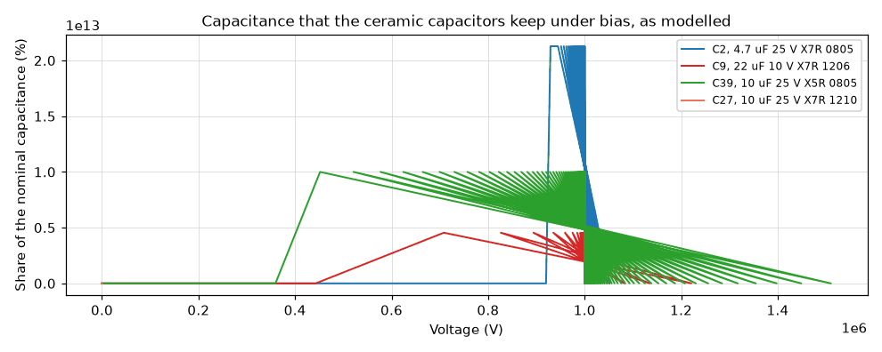

Notes:

- The series resistance of C11 is the impedance that its datasheet states as the
  maximum at 100 kHz and 20 C; a typical part has less, a cold one more, and the
  datasheet gives neither.
- The bias model is one curve per part number with one parameter, the voltage at
  which half the capacitance is left; 8 % is the fit this project asks of it.
  The 10 uF 25 V part in 0805 (C39, C40) is 12 % below its curve at 10 V and
  fails that fit there; it stands on the 5 V rail, where the limiters hold it at
  5.6 V or less. The model is used by the benches of the power input; the model
  map leaves the capacitors of the schematic at their nominal value.
- The 1 uF and 100 nF capacitors in 0603 have no bias model: no curve of theirs
  was read.

Models. written here: PWRIN_MLCC, PWRIN_WCAP_47U.

Decks: [power-input-capacitors.bias.cir](power-input-capacitors.bias.cir),
[power-input-capacitors.bulk.cir](power-input-capacitors.bulk.cir).

## `models/power-input-diodes`

**1N5819HW, SMAJ10A, TPD4E1U06 and LED models against their datasheets.**

Each diode of the schematic is put, alone, on forced currents and voltages. The
Schottky diode across a limiter: forward voltage from 1 mA to 3 A and reverse
current at 4 V and 10 V. The suppressor: breakdown at 1 mA, clamping voltage at
23.5 A, current at its stand-off voltage and forward voltage. One channel of the
protection array: breakdown and clamping voltages. The LED: forward voltage at
20 mA and its current behind 1 kohm on 3.3 V.

Answers: the models of D3 and D4, of the suppressor D2, of the protection array
U2 and of the LED D5.

| Figure | Simulated | Vendor models | Specification | Limits | Verdict | Source |
| --- | --- | --- | --- | --- | --- | --- |
| 1N5819HW: forward voltage at 0.001 A | 150.1 mV | | 150 mV (+0.07 %) | 127.5 mV to 172.5 mV | pass | Diodes DS30217 Rev. 22-2, figure 1 (typical) and page 2 (limits) |
| 1N5819HW: forward voltage at 0.01 A | 212.8 mV | | 212 mV (+0.39 %) | 180.2 mV to 243.8 mV | pass | Diodes DS30217 Rev. 22-2, figure 1 (typical) and page 2 (limits) |
| 1N5819HW: forward voltage at 0.1 A | 283.6 mV | | 282 mV (+0.56 %) | 239.7 mV to 320 mV | pass | Diodes DS30217 Rev. 22-2, figure 1 (typical) and page 2 (limits) |
| 1N5819HW: forward voltage at 1 A | 433.7 mV | | 434 mV (-0.06 %) | 368.9 mV to 450 mV | pass | Diodes DS30217 Rev. 22-2, figure 1 (typical) and page 2 (limits) |
| 1N5819HW: forward voltage at 3 A | 659.3 mV | | 670 mV (-1.60 %) | 569.5 mV to 750 mV | pass | Diodes DS30217 Rev. 22-2, figure 1 (typical) and page 2 (limits) |
| 1N5819HW: reverse current at 4 V | 5.8 µA | | 10 µA (-42.00 %) | at most 50 µA | pass | Diodes DS30217 Rev. 22-2, page 2: 10 uA typical, 50 uA at most (figure 2 shows 6 uA) |
| 1N5819HW: reverse current at 10 V | 8.8 µA | | 9 µA (-2.22 %) | | | Diodes DS30217 Rev. 22-2, figure 2 |
| SMAJ10A: breakdown voltage at 1 mA | 11.7 V | 11.7 V | 11.7 V (+0.00 %) | 11.1 V to 12.3 V | pass | Vishay 88390, page 2 |
| SMAJ10A: clamping voltage at 23.5 A | 16.66 V | 16.66 V | | at most 17 V | pass | Vishay 88390, page 2 |
| SMAJ10A: forward voltage at 25 A | 2.562 V | 2.562 V | | at most 3.5 V | pass | Vishay 88390, page 2, note 6 |
| SMAJ10A: current at the stand-off voltage of 10 V | 967.2 nA | 967.2 nA | | at most 1.01 µA | pass | Vishay 88390, page 2: 1 uA at most |
| TPD4E1U06: breakdown voltage at 1 mA | 7.5 V | 7.5 V | 7.5 V (+0.00 %) | 6.5 V to 8.5 V | pass | TI SLVSBQ9D, page 5 |
| TPD4E1U06: clamping voltage at 1 A | 10.28 V | 10.28 V | 11 V (-6.58 %) | 9.9 V to 12.1 V | pass | TI SLVSBQ9D, page 5 |
| TPD4E1U06: clamping voltage at 3 A | 15.5 V | 15.5 V | 15 V (+3.36 %) | 13.5 V to 16.5 V | pass | TI SLVSBQ9D, page 5 |
| TPD4E1U06: voltage below ground at 1 A | 1.434 V | 1.434 V | | | | |
| LED: forward voltage at 20 mA | 1.995 V | 1.995 V | 2 V (-0.24 %) | at most 2.4 V | pass | Wurth 150060VS75000, page 2 |
| LED: forward voltage behind 1 kohm on 3.3 V | 1.874 V | 1.874 V | | | | |
| LED: current behind 1 kohm on 3.3 V | 1.426 mA | 1.426 mA | | | | |

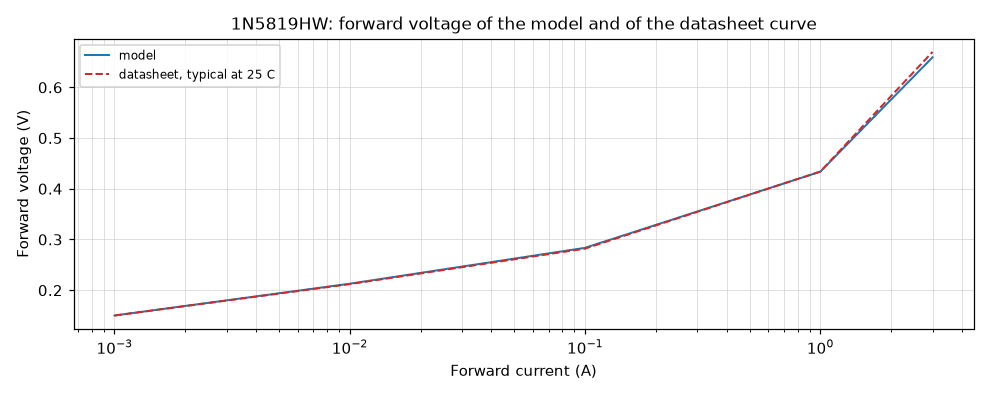

Notes:

- The fit this project asks of a model is 15 % on a typical value; where the
  datasheet states limits, the limits are the ones of the datasheet.
- The typical forward curve of the Schottky diode is read from figure 1 of its
  datasheet. Its reverse current doubles every 9 K (figure 2); the model stands
  at 25 C.
- The suppressor and the protection array are static models: their capacitance
  is in the models and is not tested here.
- In the vendor tier the Schottky diode is the model of its manufacturer; the
  other parts of this bench have none. That file holds a line of plain text, the
  wrapped end of a comment, on which the simulator stops, so its two decks do
  not run.

Models. written here: PWRIN_1N5819HW, PWRIN_LED_GREEN, PWRIN_SMAJ10A,
PWRIN_TPD4E1U06_CH.

Decks:
[power-input-diodes.schottky-forward.cir](power-input-diodes.schottky-forward.cir),
[power-input-diodes.suppressor.cir](power-input-diodes.suppressor.cir).

## `models/power-input-limiter`

**TPS259621 model against its datasheet.**

The limiter of the schematic is put, alone, into the test circuits of its
datasheet. The start with and without a capacitor at the dVdt pin, the current
limit with four resistors and its fold-back at an output of 0 V, the response to
an overload and to a short circuit, the clamp with a light and with a heavy
load, the thresholds of the enable pin and of the input, the on-resistance and
the gain of the current monitor.

Answers: the model of the current limiters U3 and U4.

| Figure | Simulated | Vendor models | Specification | Limits | Verdict | Source |
| --- | --- | --- | --- | --- | --- | --- |
| Start, dVdt pin open: turn-on delay to 10 % | 76.27 µs | 57.88 µs | 78.9 µs (-3.33 %) | 67.06 µs to 90.74 µs | pass | TI SLVSET8A page 8, typical |
| Start, dVdt pin open: rise from 10 % to 90 % | 94.08 µs | 53.27 µs | 94.1 µs (-0.02 %) | 79.98 µs to 108.2 µs | pass | TI SLVSET8A page 8, typical |
| Start, dVdt pin open: slope of the output | 4.252e+04 V/s | 7.508e+04 V/s | 4.27e+04 V/s (-0.43 %) | 3.63e+04 V/s to 4.91e+04 V/s | pass | TI SLVSET8A page 8, typical |
| Start, 3300 pF at the dVdt pin: turn-on delay to 10 % | 246.6 µs | 167.9 µs | 247.3 µs (-0.29 %) | 210.2 µs to 284.4 µs | pass | TI SLVSET8A page 8, typical |
| Start, 3300 pF at the dVdt pin: rise from 10 % to 90 % | 301 µs | 309.9 µs | 311 µs (-3.23 %) | 264.4 µs to 357.7 µs | pass | TI SLVSET8A page 8, typical |
| Start, 3300 pF at the dVdt pin: slope of the output | 1.329e+04 V/s | 1.291e+04 V/s | 1.31e+04 V/s (+1.46 %) | 1.114e+04 V/s to 1.506e+04 V/s | pass | TI SLVSET8A page 8, typical |
| Current limit with 7870 ohm, 0.5 V across the part | 125.9 mA | | 125 mA (+0.68 %) | 113 mA to 139 mA | pass | TI SLVSET8A page 6 |
| Current limit with 7870 ohm, output at 0 V | 101.5 mA | | 105 mA (-3.30 %) | 89.25 mA to 120.8 mA | pass | TI SLVSET8A page 13, figures 22 and 23, 12 V and 25 C |
| Current limit with 3830 ohm, 0.5 V across the part | 246.9 mA | | 247 mA (-0.03 %) | 224 mA to 269 mA | pass | TI SLVSET8A page 6 |
| Current limit with 909 ohm, 0.5 V across the part | 1.005 A | | 1.005 A (-0.04 %) | 949 mA to 1.051 A | pass | TI SLVSET8A page 6 |
| Current limit with 453 ohm, 0.5 V across the part | 2.005 A | | 2.004 A (+0.03 %) | 1.83 A to 2.147 A | pass | TI SLVSET8A page 6 |
| Current limit with 453 ohm, output at 0 V | 811.8 mA | | 800 mA (+1.47 %) | 680 mA to 920 mA | pass | TI SLVSET8A page 13, figures 22 and 23, 12 V and 25 C |
| Overload of 32 %: load current within 2 % of the limit after | 96.26 µs | 41.32 µs | 87 µs (+10.64 %) | 60.9 µs to 113.1 µs | pass | TI SLVSET8A page 8: 87 us typical |
| Short circuit with 20 mohm: output 10 us after the short | 16.47 mV | 715.9 pV | | at most 64.41 mV | pass | TI SLVSET8A page 8: 5 us to the limit; 1.5 times the limit in 20 mohm is 64 mV |
| Clamp: output with 7 V at the input and 10 mA | 5.45 V | 5.21 V | 5.45 V (-0.01 %) | 5.28 V to 5.61 V | pass | TI SLVSET8A page 6 |
| Clamp: input voltage at which the output is highest | 5.69 V | 5.774 V | 5.69 V (+0.00 %) | 5.54 V to 5.83 V | pass | TI SLVSET8A page 6 |
| Clamp: output with 7 V at the input and 1 A | 5.27 V | 5.21 V | 5.23 V (+0.76 %) | 5.073 V to 5.387 V | pass | TI SLVSET8A page 12, figure 16 at 25 C |
| Enable pin: voltage at which the output starts | 1.199 V | 1.2 V | 1.2 V (-0.07 %) | 1.18 V to 1.22 V | pass | TI SLVSET8A page 7 |
| Enable pin: voltage at which the output ends | 1.101 V | 1.1 V | 1.1 V (+0.05 %) | 1.08 V to 1.13 V | pass | TI SLVSET8A page 7 |
| Input: voltage at which the output starts | 2.529 V | 2.529 V | 2.53 V (-0.05 %) | 2.46 V to 2.58 V | pass | TI SLVSET8A page 6 |
| Input: voltage at which the output ends | 2.421 V | 2.42 V | 2.42 V (+0.02 %) | 2.36 V to 2.46 V | pass | TI SLVSET8A page 6 |
| On-resistance at 0.2 A and 5 V | 89 mΩ | 87.96 mΩ | 89 mΩ (+0.00 %) | at most 92.6 mΩ | pass | TI SLVSET8A page 7, 25 C |
| Current monitor gain at 0.13 A | 0.000656 A/A | 0.00066 A/A | 0.0006532 A/A (+0.43 %) | 0.0005312 A/A to 0.0008 A/A | pass | TI SLVSET8A page 6 |
| Current monitor gain at 1.5 A | 0.000656 A/A | 0.00066 A/A | 0.0006572 A/A (-0.18 %) | 0.0006358 A/A to 0.000684 A/A | pass | TI SLVSET8A page 6 (stated at 2 A) |

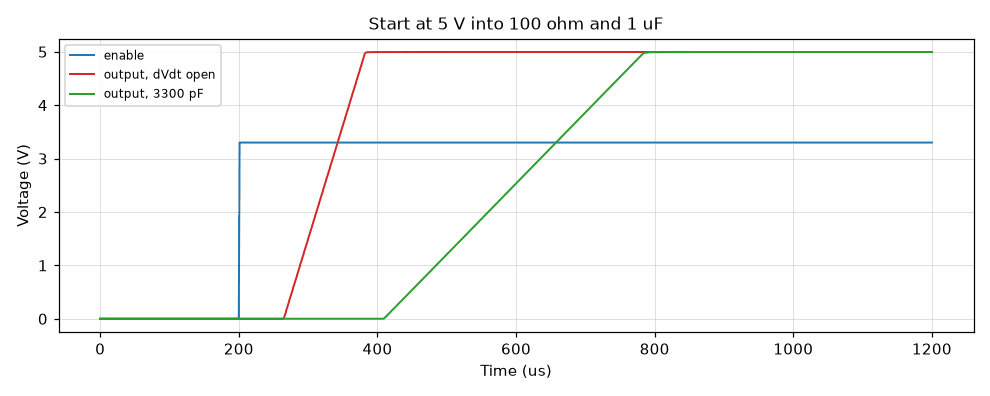

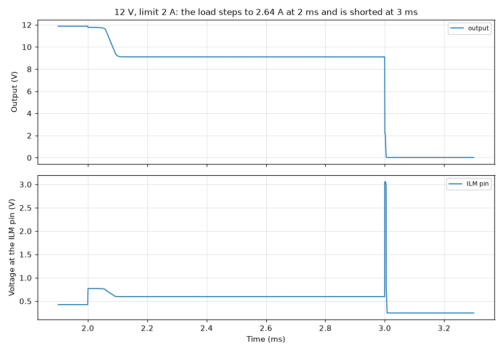

Notes:

- The fit this project asks of the model is 15 % on a typical value; where the
  datasheet states limits, the limits are the ones of the datasheet.
- The model is a typical part at 25 C without thermal shutdown. The fold-back of
  its limit between an output of 0 V and the full limit is an assumption: the
  datasheet gives the two ends only.
- The short circuit is judged by the output voltage, because the current of the
  first microseconds depends on a saturation current that the datasheet does not
  give and the model does not have.

Models. written here: PWRIN_TPS259621.

Decks: [power-input-limiter.clamp-10m.cir](power-input-limiter.clamp-10m.cir),
[power-input-limiter.overload.cir](power-input-limiter.overload.cir),
[power-input-limiter.start-3n3.cir](power-input-limiter.start-3n3.cir).

## `models/power-input-multiplexer`

**TPS2116 model against its datasheet.**

The multiplexer of the schematic is put, alone, into the test circuits of its
datasheet. The soft start at three input voltages, the change of input with the
threshold of the priority pin and the time without a channel, the on-resistance,
the two levels of the reverse current blocking and the status output.

Answers: the model of the power multiplexer U5.

| Figure | Simulated | Vendor models | Specification | Limits | Verdict | Source |
| --- | --- | --- | --- | --- | --- | --- |
| Soft start at 5 V: delay to 10 % | 1.01 ms | 1.03 ms | 1 ms (+1.03 %) | 850 µs to 1.15 ms | pass | TI SLVSFG1A page 7, typical |
| Soft start at 5 V: 10 % to 90 % | 1.702 ms | 1.707 ms | 1.7 ms (+0.14 %) | 1.445 ms to 1.955 ms | pass | TI SLVSFG1A page 7, typical |
| Soft start at 3.3 V: delay to 10 % | 1.128 ms | 1.214 ms | 1.2 ms (-6.02 %) | 1.02 ms to 1.38 ms | pass | TI SLVSFG1A page 7, typical |
| Soft start at 3.3 V: 10 % to 90 % | 1.353 ms | 1.304 ms | 1.3 ms (+4.07 %) | 1.105 ms to 1.495 ms | pass | TI SLVSFG1A page 7, typical |
| Soft start at 1.8 V: delay to 10 % | 1.279 ms | 1.43 ms | 1.4 ms (-8.65 %) | 1.19 ms to 1.61 ms | pass | TI SLVSFG1A page 7, typical |
| Soft start at 1.8 V: 10 % to 90 % | 899.5 µs | 914.2 µs | 900 µs (-0.06 %) | 765 µs to 1.035 ms | pass | TI SLVSFG1A page 7, typical |
| Priority pin: voltage at which input 1 is taken | 1.005 V | | 1 V (+0.48 %) | 920 mV to 1.08 V | pass | TI SLVSFG1A page 6 |
| Priority pin: voltage at which input 1 is left | 995.2 mV | | 1 V (-0.48 %) | 920 mV to 1.08 V | pass | TI SLVSFG1A page 6 |
| Change of input at 5 V with 10 ohm and 10 uF: output at its lowest after the priority pin has stepped | 8.43 µs | | 8 µs (+5.37 %) | 4.8 µs to 11.2 µs | pass | TI SLVSFG1A page 7: 8 us typical |
| The same: dip of the output | 329.8 mV | | | | | |
| Status output at 1 mA while input 2 supplies | 100 mV | | | at most 100 mV | pass | TI SLVSFG1A page 6 |
| Status output while input 1 supplies | 3.397 V | | | at least 3.3 V | pass | TI SLVSFG1A page 11: pulled high while input 1 is used |
| On-resistance at 5 V, from the drop and the current of input 1 | 37 mΩ | 37.23 mΩ | 37 mΩ (+0.00 %) | at most 46 mΩ | pass | TI SLVSFG1A page 6, 25 C |
| Reverse blocking: output above the input when the channel opens | 41.74 mV | 42.13 mV | 42 mV (-0.62 %) | at most 70 mV | pass | TI SLVSFG1A page 6 |
| Reverse blocking: current back into the input before that | 1.128 A | 1.132 A | 1.4 A (-19.42 %) | at most 4 A | pass | TI SLVSFG1A page 6 |
| Reverse blocking: output above the input when the channel closes again | 20.14 mV | 19.58 mV | 17 mV (+18.45 %) | at most 40 mV | pass | TI SLVSFG1A page 6 |
| Current back into the input while the channel is open | 1.515 nA | 496.4 µA | | at most 150 nA | pass | TI SLVSFG1A page 6: 1 nA typical, 0.15 uA at 105 C |

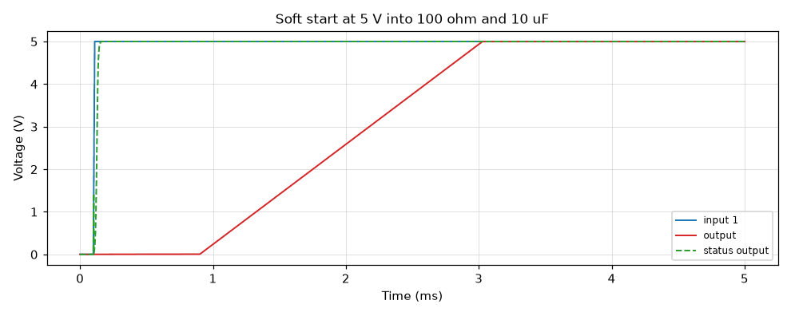

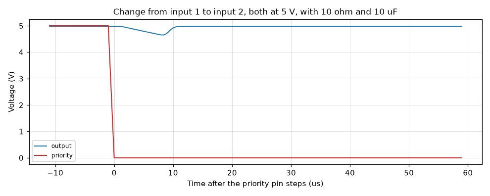

Notes:

- The fit this project asks of the model is 15 % on a typical value; where the
  datasheet states limits, the limits are the ones of the datasheet.
- The model is a typical part at 25 C. Its leakage is a resistor that keeps the
  matrix regular: the leakage figure is no statement about the part.
- The time of the change is read at the lowest point of the output; the
  datasheet does not say how it measures its 8 us, so the limit is wide.

Models. written here: PWRIN_TPS2116.

Decks: [power-input-multiplexer.change.cir](power-input-multiplexer.change.cir),
[power-input-multiplexer.reverse.cir](power-input-multiplexer.reverse.cir),
[power-input-multiplexer.start-5v.cir](power-input-multiplexer.start-5v.cir).

## `models/power-input-regulator`

**LP5907-3.3 model against its datasheet.**

A regulator of the schematic is put, alone, into the test circuits of its
datasheet. The start from the enable pin and the discharge of the output, the
load regulation and the current limit, the dropout at 100 mA and at 250 mA, the
thresholds of the enable pin, and the supply rejection from 100 Hz to 100 kHz.

Answers: the model of the 3.3 V regulators U7 and U8.

| Figure | Simulated | Vendor models | Specification | Limits | Verdict | Source |
| --- | --- | --- | --- | --- | --- | --- |
| Output with 4.3 V at the input and 1 mA | 3.3 V | 3.307 V | 3.3 V (+0.00 %) | 3.234 V to 3.366 V | pass | TI SNVS798Q page 5 |
| Output at 95 % after the enable | 80.66 µs | 108.5 µs | 80 µs (+0.83 %) | at most 150 µs | pass | TI SNVS798Q page 6 |
| Overshoot of the start | 3.401e-05 | 0.00223 | | at most 0.01 | pass | TI SNVS798Q page 6: 1 % with the enable |
| Output at 36.8 % after the enable has fallen (1 uF, 3.3 kohm beside the 230 ohm) | 215.3 µs | 215.3 µs | 215 µs (+0.13 %) | 182.8 µs to 247.3 µs | pass | TI SNVS798Q page 5: 230 ohm typical |
| Load regulation from 1 mA to 250 mA | 33.37 µV | 26.22 µV | 33 µV (+1.11 %) | 26.4 µV to 39.6 µV | pass | TI SNVS798Q page 5: 0.001 % per mA, which is 33 uV per mA |
| Current with the output held at ground | 500.5 mA | 500 mA | 500 mA (+0.10 %) | at least 250 mA | pass | TI SNVS798Q page 5: 250 mA at least |
| Dropout at 0.1 A | 49.9 mV | 52.06 mV | 50 mV (-0.21 %) | 42.5 mV to 57.5 mV | pass | TI SNVS798Q page 5: 50 mV typical |
| Dropout at 0.25 A | 124.9 mV | 69.36 mV | | at most 250 mV | pass | TI SNVS798Q page 5: 250 mV at most in SOT-23 |
| Enable voltage at which the output starts | 869.1 mV | 1.19 V | 870 mV (-0.10 %) | 400 mV to 1.2 V | pass | TI SNVS798Q page 6 and figure 5-2 |
| Enable voltage at which the output ends | 840.3 mV | 389 mV | 840 mV (+0.03 %) | 400 mV to 1.2 V | pass | TI SNVS798Q page 6 and figure 5-2 |
| Supply rejection at 100 Hz | 89.74 dB | 137.9 dB | 90 dB (-0.29 %) | 87 dB to 93 dB | pass | TI SNVS798Q page 5, typical at 20 mA |
| Supply rejection at 1000 Hz | 83.74 dB | 155 dB | 82 dB (+2.12 %) | 79 dB to 85 dB | pass | TI SNVS798Q page 5, typical at 20 mA |
| Supply rejection at 10000 Hz | 65.89 dB | 158 dB | 65 dB (+1.38 %) | 62 dB to 68 dB | pass | TI SNVS798Q page 5, typical at 20 mA |
| Supply rejection at 100000 Hz | 59.09 dB | 161.2 dB | 60 dB (-1.51 %) | 57 dB to 63 dB | pass | TI SNVS798Q page 5, typical at 20 mA |

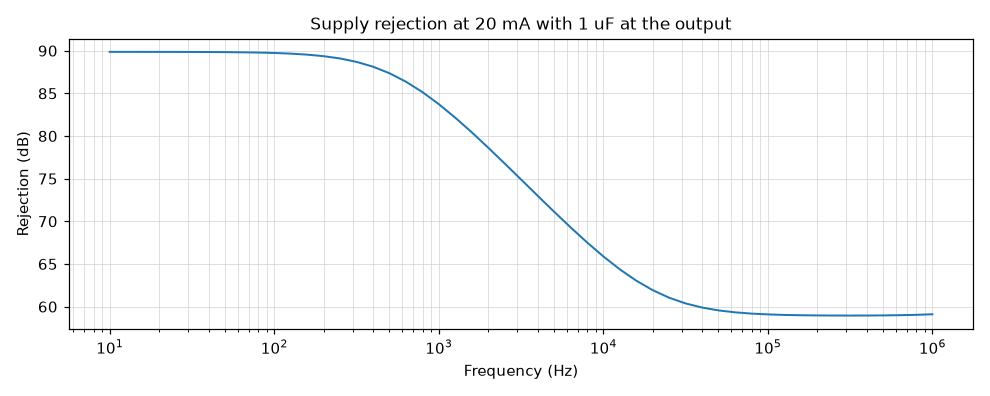

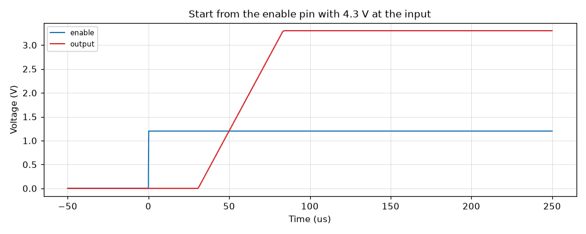

Notes:

- The fit this project asks of the model is 15 % on a typical value, and 3 dB on
  the supply rejection; where the datasheet states limits, the limits are the
  ones of the datasheet.
- The model follows the supply rejection up to 100 kHz only, and it has no
  response of its own to a load step: the 40 mV of the datasheet for 250 mA are
  not in it.
- The supply rejection is a small-signal analysis around an operating point that
  the solver finds with the regulator on.

Models. written here: PWRIN_LP5907.

Decks:
[power-input-regulator.rejection.cir](power-input-regulator.rejection.cir),
[power-input-regulator.start.cir](power-input-regulator.start.cir).

## `models/power-input-supervisor`

**TPS3808G01 model against its datasheet.**

The supervisor of the schematic is put, alone, into the test circuit of its
datasheet. A slow rise and fall of the SENSE pin gives the two thresholds and
the release delay, with the CT pin tied to the supply and open. Steps of 5 % to
50 % below the threshold give the reaction time, and a current of 1 mA into the
output its low level.

Answers: the model of the supervisor U6.

| Figure | Simulated | Specification | Limits | Verdict | Source |
| --- | --- | --- | --- | --- | --- |
| Release delay with CT tied to the supply | 300.2 ms | 300 ms (+0.07 %) | 285 ms to 315 ms | pass | TI SBVS050N page 7: 180 ms to 420 ms |
| SENSE voltage at which the output falls | 405.1 mV | 405 mV (+0.02 %) | 396.9 mV to 413.1 mV | pass | TI SBVS050N page 6: 0.405 V, 2 % |
| Release delay with CT open | 19.97 ms | 20 ms (-0.15 %) | 18 ms to 22 ms | pass | TI SBVS050N page 7: 12 ms to 28 ms |
| SENSE voltage at which the delay starts (output high 20 ms later, CT open) | 411 mV | 411.1 mV (-0.01 %) | 405 mV to 417.2 mV | pass | TI SBVS050N page 6: hysteresis 1.5 % typical, 3 % at most |
| Output low after a step from 5 % above to 5 % below | 19.73 µs | 20 µs (-1.35 %) | 15 µs to 25 µs | pass | TI SBVS050N page 7: 20 us typical |
| Output low after a step to 10 % below | 11.95 µs | | | | |
| Output low after a step to 20 % below | 6.957 µs | | | | |
| Output low after a step to 50 % below | 3.557 µs | | | | |
| Output voltage at 1 mA with a supply of 3.3 V | 103.2 mV | | at most 400 mV | pass | TI SBVS050N page 6 |

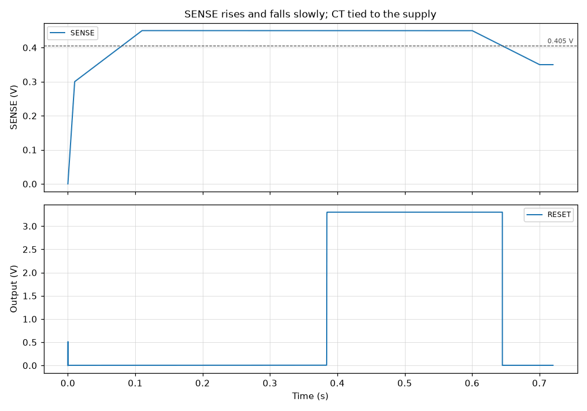

Notes:

- The limits of the delay figures are the fit this project asks of the model
  around the typical value; the limits of the thresholds are the ones of the
  datasheet.
- Figure 6-5 of the datasheet shows about 8 us for a step of 10 %, 4 us for 20 %
  and 2 us for 50 %; the model, a single filter in front of the comparator, is
  slower than that for the larger steps.
- A capacitor at the CT pin is not modelled.

Models. written here: PWRIN_TPS3808G01.

Decks: [power-input-supervisor.step-5.cir](power-input-supervisor.step-5.cir),
[power-input-supervisor.tied.cir](power-input-supervisor.tied.cir).

## `models/range-logic-mcp6561`

**MCP6561 model against its datasheet: thresholds, hysteresis and delay.**

The comparator of the schematic is put on a bench of its own. One input rests at
0.5 V. The other is moved slowly through it and back, which gives the two
thresholds, their middle as the offset and their distance as the hysteresis.
Then it is stepped from 100 mV below to 5 mV, 20 mV and 100 mV above, with an
edge of 1 ns, and the delay to the middle of the output edge is read for the
rising and for the falling output. The benches of the range control logic use
this model for all three comparators.

Answers: the model of the comparators U21, U31 and U32.

| Figure | Simulated | Vendor models | Specification | Limits | Verdict | Source |
| --- | --- | --- | --- | --- | --- | --- |
| Hysteresis: distance of the two thresholds | 2.13 mV | 422.9 µV | 3 mV (-28.98 %) | 1 mV to 5 mV | pass | 1 mV to 5 mV; datasheet figure as the head of the model in logic.lib quotes it (Microchip DS20002139E, pages 3 and 4) |
| Offset: middle of the two thresholds | -129.2 nV | 2.703 mV | | -10 mV to 10 mV | pass | 10 mV at the most; datasheet figure as the head of the model in logic.lib quotes it (Microchip DS20002139E, pages 3 and 4) |
| Output high without load | 3.305 V | 3.301 V | | | | |
| Output low without load | -2.661 µV | 288.2 µV | | | | |
| Delay to a rising output, 5 mV of overdrive | 48.49 ns | 373.3 ns | | | | |
| Delay to a falling output after 5 mV of overdrive | 47.56 ns | 28.05 ns | | | | |
| Delay to a rising output, 20 mV of overdrive | 48.37 ns | 50.25 ns | | | | |
| Delay to a falling output after 20 mV of overdrive | 47.67 ns | 28.14 ns | | | | |
| Delay to a rising output, 100 mV of overdrive | 48.03 ns | 14.34 ns | 47 ns (+2.19 %) | at most 80 ns | pass | 47 ns typical, 80 ns at the most; datasheet figure as the head of the model in logic.lib quotes it (Microchip DS20002139E, pages 3 and 4) |
| Delay to a falling output after 100 mV of overdrive | 47.85 ns | 28.33 ns | 47 ns (+1.80 %) | at most 80 ns | pass | 47 ns typical, 80 ns at the most; datasheet figure as the head of the model in logic.lib quotes it (Microchip DS20002139E, pages 3 and 4) |

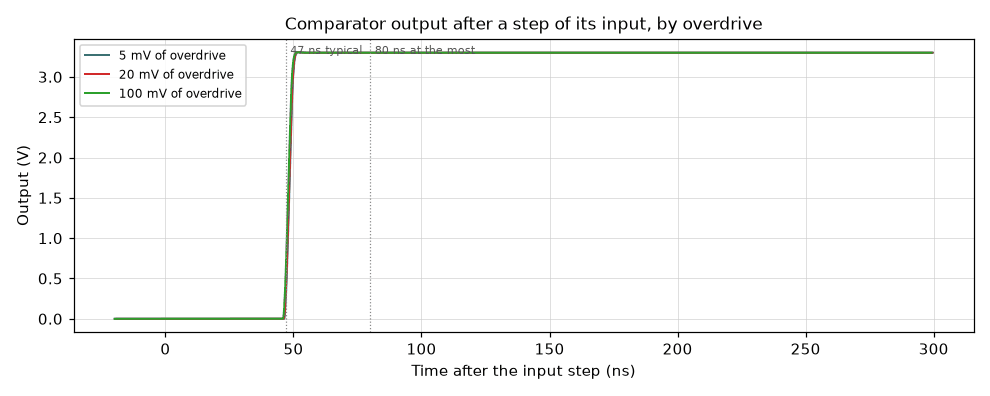

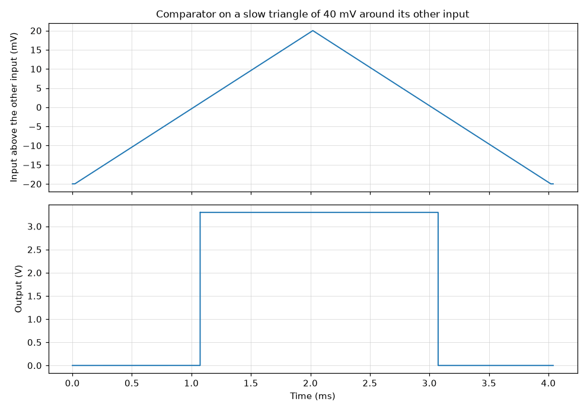

Notes:

- The datasheet figures are the ones the head of the model in logic.lib quotes;
  the datasheet was not read again for this bench.
- The model written here has one delay for every overdrive and no offset unless
  a bench gives it one. Its hysteresis parameter is 3 mV; the thresholds lie 2.1
  mV apart, because the switching curve of the model is 0.2 mV wide and rounds
  the corners of the loop.
- The delay is counted from the middle of an input edge of 1 ns to the middle of
  the output edge.
- In the vendor tier the same bench runs the model of the manufacturer, which
  the benches of the range control logic do not use: it shows how the delay of
  that model grows at small overdrive.

Models. written here: MCP656X.

Decks: [range-logic-mcp6561.delay.cir](range-logic-mcp6561.delay.cir),
[range-logic-mcp6561.hysteresis.cir](range-logic-mcp6561.hysteresis.cir).

## `models/signal-chain-ad8421`

**AD8421 model against its datasheet.**

The model is put in the test circuits of its datasheet. On +/-15 V with 2 kohm
at the output, as the tables of the datasheet are taken, the model runs at gains
of 1, 10, 100 and 1000: response, noise density and noise from 0.1 Hz to 10 Hz,
common-mode rejection with the parameter at the limit of the A grade. Operating
points give the offsets, the bias currents, the reference pin, the supply
current, the input current with 6 V between the inputs and the short-circuit
current. Sweeps give the output swing and the common mode at which the first
stage leaves its range, and a step of 10 V the slew rate and the settling time.

Answers: the model of the instrumentation amplifier U27.

| Figure | Simulated | Specification | Limits | Verdict | Source |
| --- | --- | --- | --- | --- | --- |
| G = 1: gain at 10 Hz | 1 | 1 (+0.00 %) | 0.9995 to 1 | pass | Analog Devices AD8421 Rev. A, page 22: G = 1 + 9.9 kohm / RG |
| G = 1: small-signal bandwidth | 9.951 MHz | 10 MHz (-0.49 %) | 8 MHz to 12 MHz | pass | Analog Devices AD8421 Rev. A, page 4 |
| G = 1: voltage noise at 1 kHz, referred to the input | 60.23 nV/√Hz | 60.1 nV/√Hz (+0.22 %) | 54.09 nV/√Hz to 66.11 nV/√Hz | pass | Analog Devices AD8421 Rev. A, pages 3 and 26 |
| G = 1: noise from 0.1 Hz to 10 Hz, peak to peak, referred to the input | 2.272 µV | 2 µV (+13.59 %) | 1.5 µV to 2.5 µV | pass | Analog Devices AD8421 Rev. A, page 3 |
| G = 10: gain at 10 Hz | 10 | 10 (+0.00 %) | 9.995 to 10.01 | pass | Analog Devices AD8421 Rev. A, page 22: G = 1 + 9.9 kohm / RG |
| G = 10: small-signal bandwidth | 8.357 MHz | 10 MHz (-16.43 %) | 8 MHz to 12 MHz | pass | Analog Devices AD8421 Rev. A, page 4 |
| G = 10: voltage noise at 1 kHz, referred to the input | 7.744 nV/√Hz | 8 nV/√Hz (-3.20 %) | 7.2 nV/√Hz to 8.8 nV/√Hz | pass | Analog Devices AD8421 Rev. A, pages 3 and 26 |
| G = 10: noise from 0.1 Hz to 10 Hz, peak to peak, referred to the input | 254 nV | 500 nV (-49.21 %) | 375 nV to 625 nV | **FAIL** | Analog Devices AD8421 Rev. A, page 3 |
| G = 100: gain at 10 Hz | 100 | 100 (+0.00 %) | 99.95 to 100 | pass | Analog Devices AD8421 Rev. A, page 22: G = 1 + 9.9 kohm / RG |
| G = 100: small-signal bandwidth | 1.923 MHz | 2 MHz (-3.87 %) | 1.6 MHz to 2.4 MHz | pass | Analog Devices AD8421 Rev. A, page 4 |
| G = 100: voltage noise at 1 kHz, referred to the input | 3.317 nV/√Hz | 3.5 nV/√Hz (-5.24 %) | 3.15 nV/√Hz to 3.85 nV/√Hz | pass | Analog Devices AD8421 Rev. A, pages 3 and 26 |
| G = 1000: gain at 10 Hz | 999.9 | 1000 (-0.01 %) | 999.5 to 1000 | pass | Analog Devices AD8421 Rev. A, page 22: G = 1 + 9.9 kohm / RG |
| G = 1000: small-signal bandwidth | 199.5 kHz | 200 kHz (-0.27 %) | 160 kHz to 240 kHz | pass | Analog Devices AD8421 Rev. A, page 4 |
| G = 1000: voltage noise at 1 kHz, referred to the input | 3.03 nV/√Hz | 3 nV/√Hz (+1.01 %) | 2.7 nV/√Hz to 3.3 nV/√Hz | pass | Analog Devices AD8421 Rev. A, pages 3 and 26 |
| G = 1000: noise from 0.1 Hz to 10 Hz, peak to peak, referred to the input | 81.6 nV | 70 nV (+16.57 %) | 52.5 nV to 87.5 nV | pass | Analog Devices AD8421 Rev. A, page 3 |
| Current noise of an input at 1 kHz | 204.1 fA/√Hz | 200 fA/√Hz (+2.03 %) | 180 fA/√Hz to 220 fA/√Hz | pass | Analog Devices AD8421 Rev. A, page 3 |
| Current noise of an input from 0.1 Hz to 10 Hz, peak to peak | 18.46 pA | 18 pA (+2.58 %) | 13.5 pA to 22.5 pA | pass | Analog Devices AD8421 Rev. A, page 3 |
| G = 1: common-mode rejection at 1 Hz with the parameter at 86 dB | 86 dB | 86 dB (+0.00 %) | 85.14 dB to 86.86 dB | pass | Analog Devices AD8421 Rev. A, page 3: limit of the A grade |
| G = 1: common-mode rejection at 20 kHz with the parameter at 86 dB | 79.88 dB | 80 dB (-0.15 %) | 78.4 dB to 81.6 dB | pass | Analog Devices AD8421 Rev. A, page 3: limit of the A grade |
| G = 10: common-mode rejection at 1 Hz with the parameter at 86 dB | 106 dB | 106 dB (+0.00 %) | 104.9 dB to 107.1 dB | pass | Analog Devices AD8421 Rev. A, page 3: limit of the A grade |
| G = 10: common-mode rejection at 20 kHz with the parameter at 86 dB | 99.88 dB | 90 dB (+10.98 %) | | | Analog Devices AD8421 Rev. A, page 3: 90 dB at the least; the model does not have this fall |
| G = 100: common-mode rejection at 1 Hz with the parameter at 86 dB | 126 dB | 126 dB (+0.00 %) | 124.7 dB to 127.3 dB | pass | Analog Devices AD8421 Rev. A, page 3: limit of the A grade |
| G = 100 with vosi at -60 uV and voso at 350 uV: output | 6.35 mV | 6.35 mV (+0.00 %) | 6.287 mV to 6.413 mV | pass | Analog Devices AD8421 Rev. A, page 5: input offset times the gain plus output offset; a positive vosi lowers the output of this model, a positive voso raises it |
| Bias 1 nA, offset current 0.5 nA: current into the positive input | 1.25 nA | 1.25 nA (+0.03 %) | 1.225 nA to 1.275 nA | pass | definition of the parameters ib and ios |
| Bias 1 nA, offset current 0.5 nA: current into the negative input | 750.4 pA | 750 pA (+0.05 %) | 735 pA to 765 pA | pass | definition of the parameters ib and ios |
| Current of the reference pin with all inputs at 0 V | 20 µA | 20 µA (+0.00 %) | at most 24 µA | pass | Analog Devices AD8421 Rev. A, page 4: 20 uA, 24 uA at the most |
| Input resistance of the reference pin | 20 kΩ | 20 kΩ (+0.00 %) | 19.6 kΩ to 20.4 kΩ | pass | Analog Devices AD8421 Rev. A, page 4 |
| Supply current without load | 2 mA | 2 mA (+0.00 %) | at most 2.3 mA | pass | Analog Devices AD8421 Rev. A, page 5: 2 mA, 2.3 mA at the most |
| G = 100, 6 V between the inputs: current into the positive input | 10.79 mA | 10 mA (+7.94 %) | 7 mA to 13 mA | pass | Analog Devices AD8421 Rev. A, page 14, figure 18 (read from the curve) |
| G = 100, 1 V between the inputs: current into the positive input | 70.86 µA | | at most 1 mA | pass | Analog Devices AD8421 Rev. A, page 14, figure 18: no visible current below about 2 V |
| Current into a short circuit at the output | 70 mA | 65 mA (+7.69 %) | 58.5 mA to 71.5 mA | pass | Analog Devices AD8421 Rev. A, page 4 |
| Output swing into 2 kohm on +/-15 V: highest output | 13.6 V | 13.6 V (+0.00 %) | at least 13.4 V | pass | Analog Devices AD8421 Rev. A, page 4: +Vs - 1.6 V at the least; figure 36: +Vs - 1.4 V |
| Output swing into 2 kohm on +/-15 V: lowest output | -13.9 V | -13.9 V (+0.00 %) | at most -13.8 V | pass | Analog Devices AD8421 Rev. A, page 4: -Vs + 1.2 V at the least; figure 36: -Vs + 1.1 V |
| G = 100 on +/-15 V, output near 0 V: lowest common mode | -12.96 V | -13 V (+0.31 %) | -13.3 V to -12.7 V | pass | Analog Devices AD8421 Rev. A, page 13, figure 13 (read from the curve) |
| G = 100 on +/-15 V, output at 10 V: lowest common mode | -8.04 V | -8 V (-0.50 %) | -8.5 V to -7.5 V | pass | Analog Devices AD8421 Rev. A, page 13, figure 13 (read from the curve) |
| G = 1 on +/-5 V, output near 0 V: lowest common mode | -3.02 V | -2.7 V (-11.85 %) | -3 V to -2.4 V | **FAIL** | Analog Devices AD8421 Rev. A, page 4: -Vs + 2.3 V; page 13, figure 12 |
| Slew rate, step of 10 V at G = 1 | 35.01 V/us | 35 V/us (+0.02 %) | 31.5 V/us to 38.5 V/us | pass | Analog Devices AD8421 Rev. A, page 4 |
| G = 10, step of 10 V: within 0.01 % after | 371.3 ns | 400 ns (-7.18 %) | at most 800 ns | pass | Analog Devices AD8421 Rev. A, page 4: 0.4 us typical; twice that is the fit asked here |

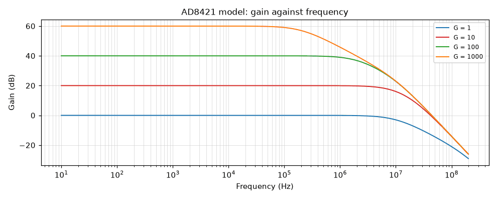

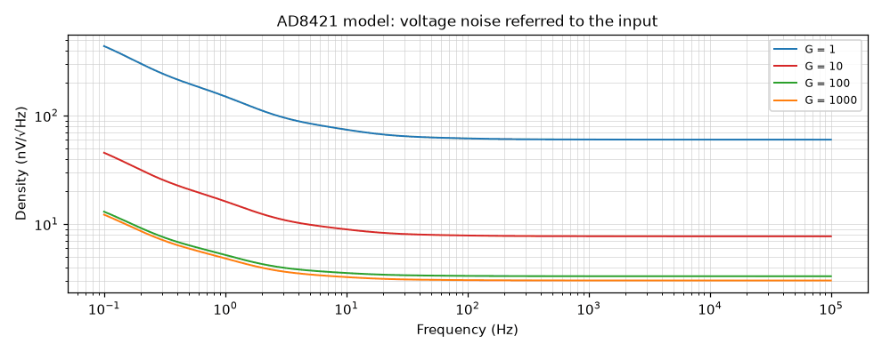

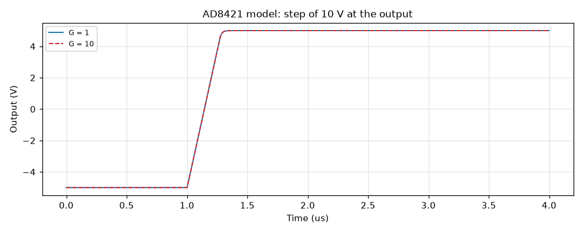

Notes:

- The limits of the dynamic figures are the fit this project asks of a model: 20
  % on a bandwidth, 10 % on a noise density, 25 % on the noise from 0.1 Hz to 10
  Hz. They are not datasheet limits.
- The model is a typical part at 25 C. Its offsets, its bias currents and its
  common-mode error are parameters that are zero unless a bench sets them; the
  figures here show that a parameter gives what the datasheet defines.
- The model has no peaking: the datasheet shows 8 dB near 8 MHz at a gain of 1
  (figure 22). The rejection at 20 kHz is right at a gain of 1 only.
- At low gain the table limits the inputs to -Vs + 2.3 V; the model only has the
  limit of its first-stage outputs, which lies 0.3 V lower. On this board the
  inputs stay 4 V above the negative supply.
- The input current in overdrive is a fit to one figure at a gain of 100.
- The noise from 0.1 Hz to 10 Hz at a gain of 10 fails and stays failed. The
  model has the two sources of the datasheet, one at the input and one at the
  output, fitted to the table at a gain of 1 (2 uV peak to peak) and at a gain
  of 100 and more (0.07 uV). The two together give 0.21 uV at a gain of 10
  (calculated), where the table states 0.5 uV: that value does not follow from
  the other two, and the model was not bent to it. This board works at a gain of
  19.93. If the table is right, the amplifier has up to twice the noise of the
  model below 10 Hz.

Decks:
[signal-chain-ad8421.response-g10.cir](signal-chain-ad8421.response-g10.cir),
[signal-chain-ad8421.static.cir](signal-chain-ad8421.static.cir).

## `models/signal-chain-ads8860`

**ADS8860 analog input and reference pin: model against the datasheet.**

The input model samples 1 V from a source of 1 kohm, with a reference of 5 V.
One conversion is run. The time for which the sampling switch is open is the
conversion time; the current of the reference pin in that time is the reference
current of the datasheet; after it the sampling capacitor, which the model
empties, charges again through the source and the switch. A small-signal run
with the converter acquiring gives the input capacitance, an operating point the
leakage of the reference pin and the current of a protection diode with the
input 0.3 V above the reference.

Answers: the model of the analog side of the converter U30.

| Figure | Simulated | Specification | Limits | Verdict | Source |
| --- | --- | --- | --- | --- | --- |
| Input capacitance while the converter acquires | 59 pF | 59 pF (+0.00 %) | 57.23 pF to 60.77 pF | pass | TI SBAS569B, page 6; figure 45 on page 20: 4 pF and 55 pF |
| Voltage on the sampling capacitor when the switch opens | 1 V | 1 V (+0.00 %) | 999 mV to 1.001 V | pass | the input voltage |
| Time for which the sampling switch is open | 710.2 ns | 710 ns (+0.03 %) | 695.8 ns to 724.2 ns | pass | TI SBAS569B, page 6: 710 ns at the most |
| Part of its voltage that the sampling capacitor keeps over a conversion | 0.009901 | 0.009901 (+0.00 %) | at most 0.02 | pass | the model: charge shared with 5.5 nF, the bounding case of an empty capacitor |
| Sampling capacitor back to 63 % of the step through 1 kohm and the switch | 60.93 ns | 64.28 ns (-5.21 %) | 57.85 ns to 70.71 ns | pass | TI SBAS569B, figure 45: 96 ohm, 55 pF and 4 pF, calculated here |
| Current of the reference pin during the conversion, reference at 5 V | 300.2 µA | 300 µA (+0.08 %) | 291 µA to 309 µA | pass | TI SBAS569B, page 6 |
| Current of the reference pin while the converter acquires | 250 nA | 250 nA (+0.00 %) | 242.5 nA to 257.5 nA | pass | TI SBAS569B, page 6 |
| Current of the protection diode with the input 0.3 V above the reference | 1.1 nA | | | | |

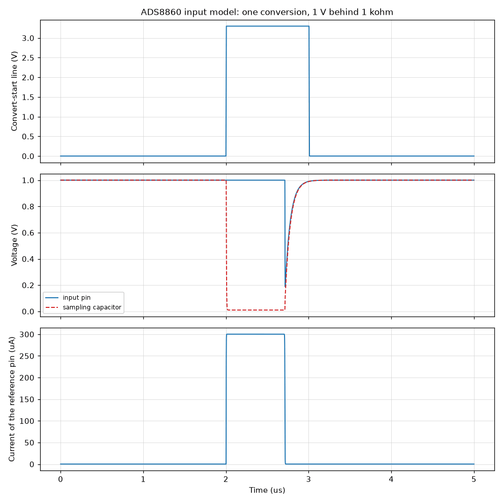

Notes:

- The model is the equivalent circuit of the datasheet with the timing of the
  three-wire mode. It does not convert: no code comes out of it.
- What the sampling capacitor keeps over a conversion is not in the datasheet.
  The model empties it, the bounding case for the kick at the input.
- The reference current is a constant current during the conversion, in
  proportion to the reference voltage (assumption); the datasheet states it at 5
  V and mid-code. The real current comes as one packet per bit.
- The protection diodes are an assumed junction: the datasheet gives the rating
  of 0.3 V beyond the reference and no curve. The figure of the diode current is
  not a figure to rely on.

Decks: [signal-chain-ads8860.acquiring.cir](signal-chain-ads8860.acquiring.cir),
[signal-chain-ads8860.conversion.cir](signal-chain-ads8860.conversion.cir).

## `models/signal-chain-opa197`

**OPA197 model against its datasheet.**

The model is put in the test circuits of its datasheet, on +/-18 V. An open-loop
run gives the gain, the gain-bandwidth product, the phase margin and the noise;
a current into the output gives the open-loop output impedance. Followers driven
beyond the rails give the output swing with each load of the table, others the
supply current, the short-circuit current and the input capacitances. Steps of a
follower give the slew rate, the settling time and the overshoot with a
capacitive load. The datasheet has a table of isolation resistors for capacitive
loads as well; the bench of the output stage for its guard buffer compares the
model with it.

Answers: the model of the pedestal buffer U26 (and of U17 and U25).

| Figure | Simulated | Specification | Limits | Verdict | Source |
| --- | --- | --- | --- | --- | --- |
| Open-loop gain at 0.1 Hz into 10 kohm | 133.8 dB | 134 dB (-0.18 %) | 120 dB to 144 dB | pass | TI SBOS737C: typical value and least value |
| Gain-bandwidth product, from the gain at a hundredth of it | 10.6 MHz | 10 MHz (+6.02 %) | 8.5 MHz to 11.5 MHz | pass | TI SBOS737C |
| Frequency at which the open-loop gain falls through 1 | 8.37 MHz | 10 MHz (-16.30 %) | 8 MHz to 12 MHz | pass | TI SBOS737C |
| Phase margin of a follower with 15 pF | 56.82 ° | 50 ° (+13.63 %) | 40 ° to 60 ° | pass | TI SBOS737C: read from the open-loop curve |
| Voltage noise at 100 Hz | 10.71 nV/√Hz | 10.5 nV/√Hz (+2.01 %) | 9.24 nV/√Hz to 11.76 nV/√Hz | pass | TI SBOS737C |
| Voltage noise at 1000 Hz | 5.828 nV/√Hz | 5.5 nV/√Hz (+5.96 %) | 4.84 nV/√Hz to 6.16 nV/√Hz | pass | TI SBOS737C |
| Noise from 0.1 Hz to 10 Hz, peak to peak | 1.308 µV | 1.3 µV (+0.64 %) | 975 nV to 1.625 µV | pass | TI SBOS737C |
| Open-loop output impedance at 1 MHz | 364.9 Ω | 375 Ω (-2.70 %) | 337.5 Ω to 412.5 Ω | pass | TI SBOS737C |
| Output without load: distance from the positive supply | 4.988 mV | 5 mV (-0.24 %) | at most 25 mV | pass | TI SBOS737C: typical value and limit |
| Output without load: distance from the negative supply | 4.988 mV | 5 mV (-0.24 %) | at most 25 mV | pass | TI SBOS737C: typical value and limit |
| Output into 10 kohm: distance from the positive supply | 90.92 mV | 95 mV (-4.30 %) | at most 125 mV | pass | TI SBOS737C: typical value and limit |
| Output into 10 kohm: distance from the negative supply | 90.92 mV | 95 mV (-4.30 %) | at most 125 mV | pass | TI SBOS737C: typical value and limit |
| Output into 2 kohm: distance from the positive supply | 426.6 mV | 430 mV (-0.80 %) | at most 500 mV | pass | TI SBOS737C: typical value and limit |
| Output into 2 kohm: distance from the negative supply | 426.6 mV | 430 mV (-0.80 %) | at most 500 mV | pass | TI SBOS737C: typical value and limit |
| Supply current without load | 1 mA | 1 mA (+0.00 %) | 900 µA to 1.3 mA | pass | TI SBOS737C: typical value and limit |
| Current into a short circuit at the output | 65.04 mA | 65 mA (+0.07 %) | 58.5 mA to 71.5 mA | pass | TI SBOS737C |
| Output of a follower on 1 V of supply with 0.5 V at its input | 10.01 mV | | at most 20 mV | pass | the model: no output below 1.5 V of supply (assumption) |
| Input capacitance from each input | 6.4 pF | 6.4 pF (+0.00 %) | 6.08 pF to 6.72 pF | pass | TI SBOS737C |
| Input capacitance between the inputs | 1.6 pF | 1.6 pF (+0.00 %) | 1.52 pF to 1.68 pF | pass | TI SBOS737C |
| Slew rate, step of 10 V | 19.25 V/us | 20 V/us (-3.77 %) | 18 V/us to 22 V/us | pass | TI SBOS737C |
| Step of 10 V: within 0.01 % after | 656.2 ns | 1.4 µs (-53.13 %) | at most 2.8 µs | pass | TI SBOS737C: typical value; twice that is the fit asked here |
| Follower with 100 pF: overshoot of a 100 mV step | 19.22 % | 15 % (+28.14 %) | | | TI SBOS737C: read from the overshoot curve |
| Follower with 1000 pF: overshoot of a 100 mV step | 46.79 % | 40 % (+16.98 %) | | | TI SBOS737C: read from the overshoot curve |

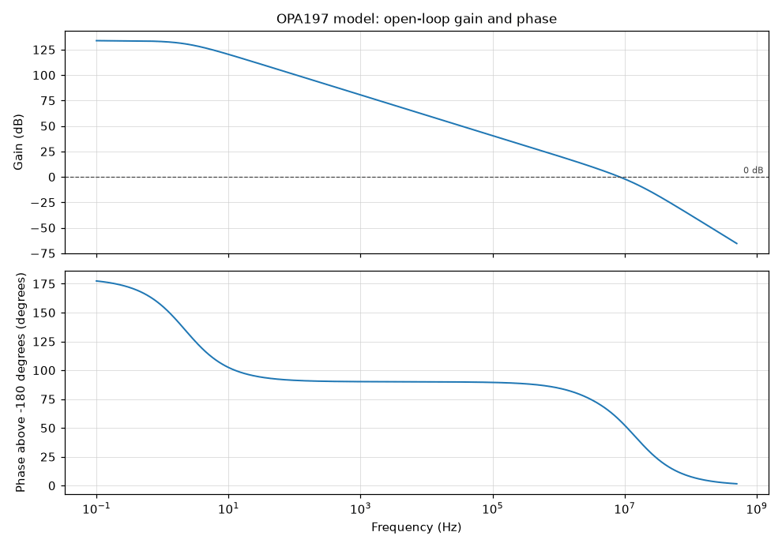

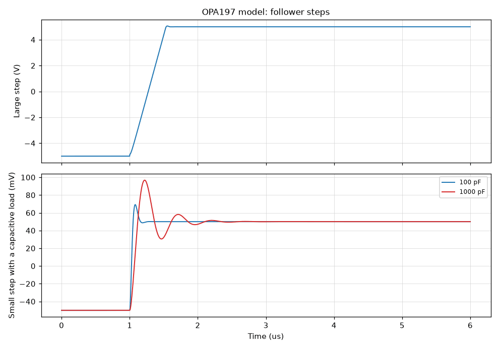

Notes:

- The limits of the dynamic figures are the fit this project asks of a model: 15
  % on the gain-bandwidth product, 20 % on the crossover, 10 degrees on the
  phase margin, 12 % on a noise density, 25 % on the noise from 0.1 Hz to 10 Hz.
  They are not datasheet limits.
- The model is a typical part at 25 C without offset; the offset and the bias
  current are parameters.
- The overshoot with a capacitive load carries no limit: the open-loop output
  impedance of the model is a resistance, with a capacitor across it for the
  OPA197, and the real parts differ from that above 1 MHz.

Decks: [signal-chain-opa197.open-loop.cir](signal-chain-opa197.open-loop.cir),
[signal-chain-opa197.static.cir](signal-chain-opa197.static.cir).

## `models/signal-chain-opa365`

**OPA365 model against its datasheet.**

The model is put in the test circuits of its datasheet, on 5 V. An open-loop run
gives the gain, the gain-bandwidth product, the phase margin and the noise; a
current into the output gives the open-loop output impedance. Followers driven
beyond the rails give the output swing into 10 kohm, others the supply current,
the short-circuit current and the input capacitances. Steps of a follower give
the slew rate, the settling time and the overshoot with a capacitive load.

Answers: the model of the rail buffer U28 and of the converter driver U29 (and
of U19).

| Figure | Simulated | Specification | Limits | Verdict | Source |
| --- | --- | --- | --- | --- | --- |
| Open-loop gain at 0.1 Hz into 10 kohm | 120 dB | 120 dB (+0.00 %) | 100 dB to 130 dB | pass | TI SBOS365G: typical value and least value |
| Gain-bandwidth product, from the gain at a hundredth of it | 49.85 MHz | 50 MHz (-0.30 %) | 42.5 MHz to 57.5 MHz | pass | TI SBOS365G |
| Frequency at which the open-loop gain falls through 1 | 42.59 MHz | 50 MHz (-14.83 %) | 40 MHz to 60 MHz | pass | TI SBOS365G |
| Phase margin of a follower | 58.68 ° | 50 ° (+17.37 %) | 40 ° to 60 ° | pass | TI SBOS365G: read from the open-loop curve |
| Voltage noise at 1000 Hz | 12.22 nV/√Hz | 13 nV/√Hz (-6.02 %) | 11.44 nV/√Hz to 14.56 nV/√Hz | pass | TI SBOS365G |
| Voltage noise at 100000 Hz | 4.485 nV/√Hz | 4.5 nV/√Hz (-0.33 %) | 3.96 nV/√Hz to 5.04 nV/√Hz | pass | TI SBOS365G |
| Noise from 0.1 Hz to 10 Hz, peak to peak | 4.973 µV | 5 µV (-0.54 %) | 3.75 µV to 6.25 µV | pass | TI SBOS365G |
| Open-loop output impedance at 1 MHz | 30 Ω | 30 Ω (+0.00 %) | 27 Ω to 33 Ω | pass | TI SBOS365G |
| Output into 10 kohm: distance from the positive supply | 9.214 mV | 10 mV (-7.86 %) | at most 20 mV | pass | TI SBOS365G: typical value and limit |
| Output into 10 kohm: distance from the negative supply | 9.214 mV | 10 mV (-7.86 %) | at most 20 mV | pass | TI SBOS365G: typical value and limit |
| Supply current without load | 4.6 mA | 4.6 mA (+0.00 %) | 4.14 mA to 5 mA | pass | TI SBOS365G: typical value and limit |
| Current into a short circuit at the output | 65 mA | 65 mA (+0.01 %) | 58.5 mA to 71.5 mA | pass | TI SBOS365G |
| Output of a follower on 1 V of supply with 0.5 V at its input | 10.02 mV | | at most 20 mV | pass | the model: no output below 1.5 V of supply (assumption) |
| Input capacitance from each input | 2 pF | 2 pF (+0.00 %) | 1.9 pF to 2.1 pF | pass | TI SBOS365G |
| Input capacitance between the inputs | 6 pF | 6 pF (+0.00 %) | 5.7 pF to 6.3 pF | pass | TI SBOS365G |
| Slew rate, step of 4 V | 24.92 V/us | 25 V/us (-0.30 %) | 22.5 V/us to 27.5 V/us | pass | TI SBOS365G |
| Step of 4 V: within 0.01 % after | 182.7 ns | 300 ns (-39.10 %) | at most 600 ns | pass | TI SBOS365G: typical value; twice that is the fit asked here |
| Follower with 100 pF: overshoot of a 100 mV step | 43.34 % | 30 % (+44.47 %) | | | TI SBOS365G: read from the overshoot curve |

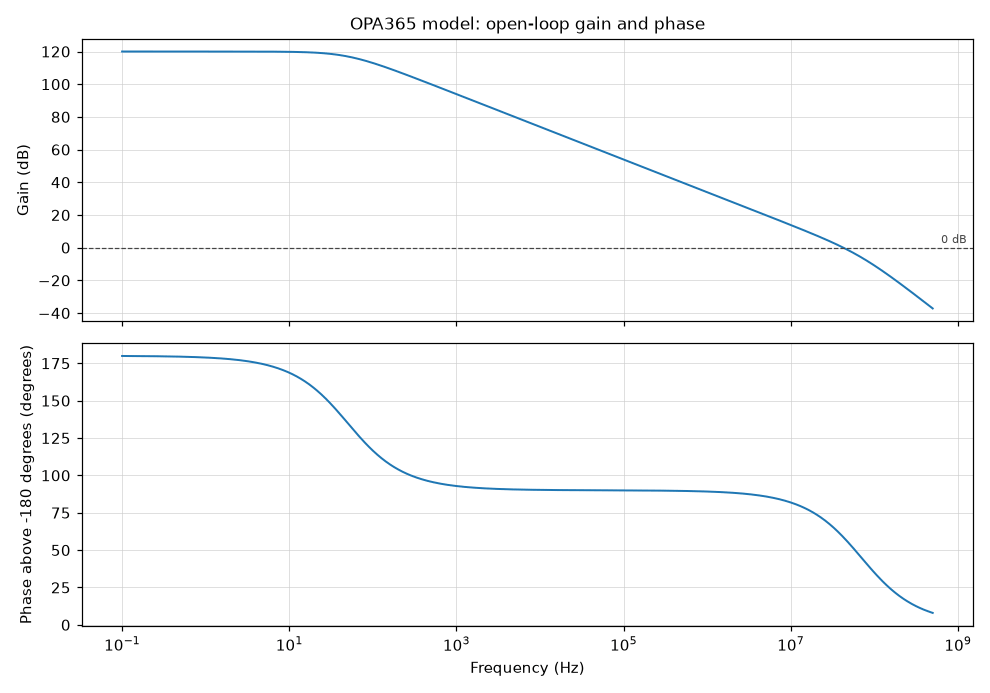

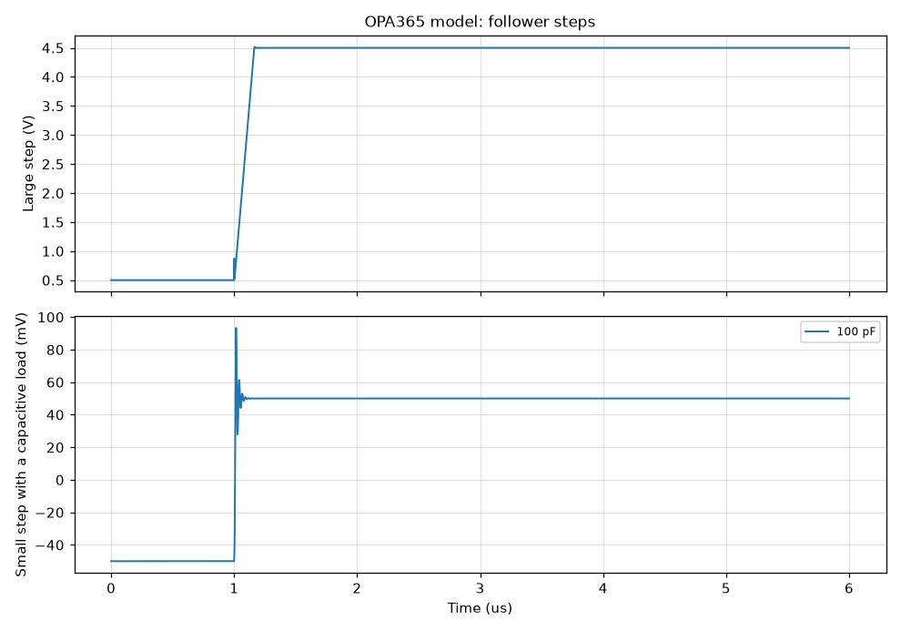

Notes:

- The limits of the dynamic figures are the fit this project asks of a model: 15
  % on the gain-bandwidth product, 20 % on the crossover, 10 degrees on the
  phase margin, 12 % on a noise density, 25 % on the noise from 0.1 Hz to 10 Hz.
  They are not datasheet limits.
- The model is a typical part at 25 C without offset; the offset and the bias
  current are parameters.
- The overshoot with a capacitive load carries no limit: the open-loop output
  impedance of the model is a resistance, with a capacitor across it for the
  OPA197, and the real parts differ from that above 1 MHz.

Decks: [signal-chain-opa365.open-loop.cir](signal-chain-opa365.open-loop.cir),
[signal-chain-opa365.static.cir](signal-chain-opa365.static.cir).

## `models/source-meter-lt3080`

**LT3080 model of the source meter against its datasheet.**

The regulator U18 of the schematic is put in the test circuits of its datasheet.
Static runs give the SET current, the offset over the load, the current of the
VCONTROL pin, the dropout of both supply pins, the current limit and the output
without load. Three load steps and the response from SET to OUT are the curves
that the loop of the model was fitted to; the phase margin that follows from
that fit is reported without a limit, because the datasheet states none.

Answers: the model of the linear regulator U18.

| Figure | Simulated | Specification | Limits | Verdict | Source |
| --- | --- | --- | --- | --- | --- |
| SET current | 10 µA | 10 µA (+0.00 %) | 9.9 µA to 10.1 µA | pass | Analog Devices LT3080 Rev. E, page 4 |
| Fall of the output from 1 mA to 1.1 A | 601.2 µV | 600 µV (+0.20 %) | at most 1.3 mV | pass | Analog Devices LT3080 Rev. E, page 4: 0.6 mV typical, 1.3 mV at the most |
| Current of the VCONTROL pin at 100 mA | 4.015 mA | 4 mA (+0.38 %) | 2.8 mA to 6 mA | pass | Analog Devices LT3080 Rev. E, page 4: 4 mA typical, 6 mA at the most |
| Current of the VCONTROL pin at 1.1 A | 17.95 mA | 17 mA (+5.57 %) | 14 mA to 30 mA | pass | Analog Devices LT3080 Rev. E, page 4: 17 mA typical, 30 mA at the most |
| Output with SET at 0 V and 1 kohm as the only load, 5 V in | 322.9 mV | 300 mV (+7.64 %) | 200 mV to 500 mV | pass | Analog Devices LT3080 Rev. E, page 7, curve G21; page 4: 0.5 mA at the most at 10 V |
| Dropout at the IN pin at 100 mA | 75.73 mV | 100 mV (-24.27 %) | 60 mV to 200 mV | pass | Analog Devices LT3080 Rev. E, page 4: 100 mV typical, 200 mV at the most; curve G10: 70 mV |
| Dropout at the IN pin at 1.1 A | 348.8 mV | 350 mV (-0.34 %) | 300 mV to 400 mV | pass | Analog Devices LT3080 Rev. E, page 4: 350 mV typical; curve G09: 318 mV |
| Dropout at 100 mA with the parameters of the guaranteed limits | 199.6 mV | 200 mV (-0.19 %) | 190 mV to 210 mV | pass | Analog Devices LT3080 Rev. E, page 4: 200 mV at the most |
| Dropout at 1.1 A with the parameters of the guaranteed limits | 496.6 mV | 500 mV (-0.68 %) | 475 mV to 525 mV | pass | Analog Devices LT3080 Rev. E, page 4: 500 mV at the most |
| Dropout at 1.0 A with those parameters | 465.4 mV | 470 mV (-0.97 %) | | | section 4.2: 170 mV + 0.300 ohm x I, an estimate between the two limits |
| Dropout at the VCONTROL pin at 100 mA | 1.2 V | 1.2 V (-0.02 %) | 1.1 V to 1.3 V | pass | Analog Devices LT3080 Rev. E, page 4: 1.2 V typical |
| Dropout at the VCONTROL pin at 1.1 A | 1.363 V | 1.35 V (+0.97 %) | 1.25 V to 1.6 V | pass | Analog Devices LT3080 Rev. E, page 4: 1.35 V typical, 1.6 V at the most |
| Current limit, 5 V on both pins, output at -0.1 V | 1.396 A | 1.4 A (-0.25 %) | 1.3 A to 1.5 A | pass | Analog Devices LT3080 Rev. E, page 4: 1.4 A typical |
| Current limit with the parameter of the least limit | 1.112 A | 1.1 A (+1.05 %) | 1.045 A to 1.155 A | pass | Analog Devices LT3080 Rev. E, page 4: 1.1 A at the least |
| Load step 0.1 A to 1.1 A with 10 uF: lowest point | -79.34 mV | -95 mV (+16.48 %) | -123.5 mV to -66.5 mV | pass | Analog Devices LT3080 Rev. E, page 6, read from the curve |
| Load step 0.1 A to 1.1 A with 10 uF: highest point after the release | 61.06 mV | 88 mV (-30.61 %) | 61.6 mV to 114.4 mV | **FAIL** | Analog Devices LT3080 Rev. E, page 6, read from the curve |
| Load step 50 mA to 250 mA with 2.2 uF: lowest point | -38.57 mV | -48 mV (+19.64 %) | -62.4 mV to -33.6 mV | pass | Analog Devices LT3080 Rev. E, page 6, read from the curve |
| Load step 50 mA to 250 mA with 2.2 uF: highest point after the release | 31.7 mV | 38 mV (-16.59 %) | 26.6 mV to 49.4 mV | pass | Analog Devices LT3080 Rev. E, page 6, read from the curve |
| Load step 50 mA to 250 mA with 10 uF: lowest point | -22.12 mV | -12 mV (-84.31 %) | -15.6 mV to -8.4 mV | **FAIL** | Analog Devices LT3080 Rev. E, page 6, read from the curve |
| Load step 50 mA to 250 mA with 10 uF: highest point after the release | 17.95 mV | 8 mV (+124.37 %) | 5.6 mV to 10.4 mV | **FAIL** | Analog Devices LT3080 Rev. E, page 6, read from the curve |
| From SET to OUT at 1.1 A with 2.2 uF: peak above the level at 10 Hz | 2.046 dB | 3 dB (-31.81 %) | | | Analog Devices LT3080 Rev. E, page 8, curve G28; its capacitor is not stated |
| From SET to OUT at 1.1 A with 2.2 uF: 3 dB below the level at 10 Hz | 700.9 kHz | 700 kHz (+0.13 %) | | | Analog Devices LT3080 Rev. E, page 8, curve G28; its capacitor is not stated |
| From SET to OUT at 0.1 A with 2.2 uF: peak above the level at 10 Hz | 2.921 dB | 0 dB | | | Analog Devices LT3080 Rev. E, page 8, curve G28; its capacitor is not stated |
| From SET to OUT at 0.1 A with 2.2 uF: 3 dB below the level at 10 Hz | 424.3 kHz | 300 kHz (+41.42 %) | | | Analog Devices LT3080 Rev. E, page 8, curve G28; its capacitor is not stated |
| Phase margin of the model at 4 mA with 22 uF | 18.63 ° | | | | |
| Crossover of the loop at 4 mA with 22 uF | 12.03 kHz | | | | |
| Phase margin of the model at 100 mA with 2.2 uF | 42.51 ° | | | | |
| Crossover of the loop at 100 mA with 2.2 uF | 259.4 kHz | | | | |
| Phase margin of the model at 100 mA with 22 uF | 49.86 ° | | | | |
| Crossover of the loop at 100 mA with 22 uF | 62.72 kHz | | | | |
| Phase margin of the model at 1100 mA with 2.2 uF | 48.11 ° | | | | |
| Crossover of the loop at 1100 mA with 2.2 uF | 413.2 kHz | | | | |
| Phase margin of the model at 1100 mA with 22 uF | 50.91 ° | | | | |
| Crossover of the loop at 1100 mA with 22 uF | 135.1 kHz | | | | |
| Output noise density at 1 kHz | 125.1 nV/√Hz | 125 nV/√Hz (+0.06 %) | 112.5 nV/√Hz to 137.5 nV/√Hz | pass | Analog Devices LT3080 Rev. E, page 7, curve G26 |
| Output noise from 10 Hz to 100 kHz, 1.1 A, 10 uF, 0.1 uF on SET | 38.3 µV | 40 µV (-4.25 %) | 34 µV to 46 µV | pass | Analog Devices LT3080 Rev. E, page 4 |

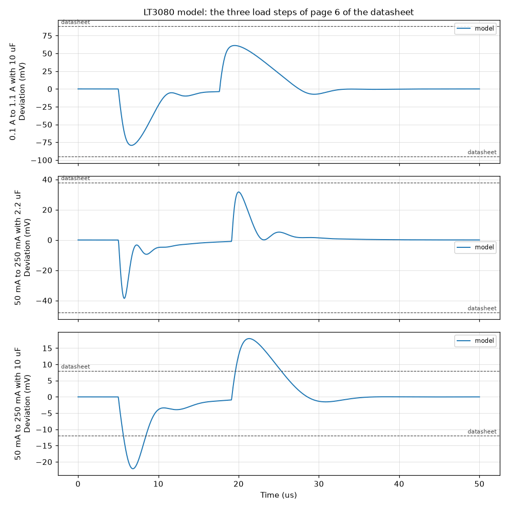

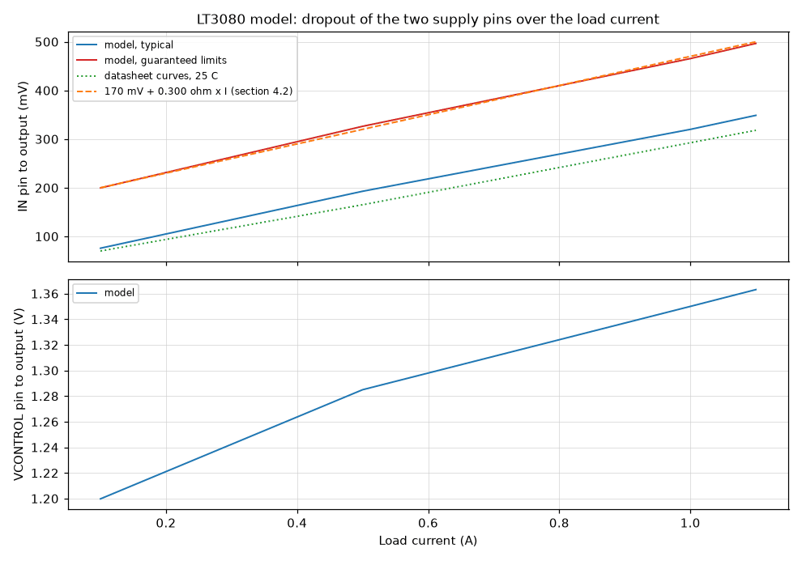

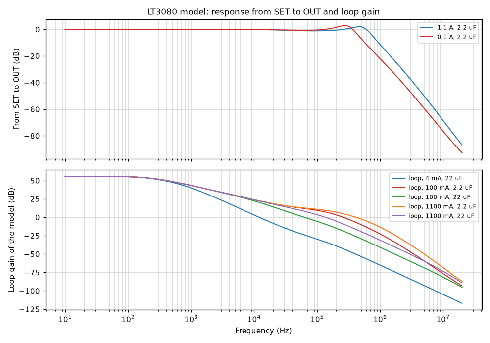

Notes:

- The limits are the fit this project asks of the model, not datasheet limits,
  except where the source names a limit of the datasheet. A supply pin counts as
  in dropout when the output has fallen by 10 mV; the datasheet does not define
  it.
- The loop of the model is a fit to the three load steps and to the response
  from SET to OUT. The step of 50 mA to 250 mA with 10 uF is not followed: the
  model dips about twice as far as the datasheet shows. The edge of the load
  steps (100 ns) and the capacitor of curve G28 (2.2 uF) are assumptions.
- The phase margin is a property of that fit and not a datasheet value. The
  datasheet shows no load step below 50 mA and no capacitor above 10 uF; the low
  margin of the model at 4 mA with 22 uF is an extrapolation.
- The model is a typical part at 27 C. It has no thermal limit, no fold-back of
  the current limit above 6 V and no fitted rejection of ripple on the IN pin.

Models. written here: LT3080.

Decks:
[source-meter-lt3080.dropout-in-limit.cir](source-meter-lt3080.dropout-in-limit.cir),
[source-meter-lt3080.dropout-in.cir](source-meter-lt3080.dropout-in.cir),
[source-meter-lt3080.dropout-vcontrol.cir](source-meter-lt3080.dropout-vcontrol.cir),
[source-meter-lt3080.limit-least.cir](source-meter-lt3080.limit-least.cir),
[source-meter-lt3080.limit.cir](source-meter-lt3080.limit.cir),
[source-meter-lt3080.noise.cir](source-meter-lt3080.noise.cir),
[source-meter-lt3080.response-0p1a.cir](source-meter-lt3080.response-0p1a.cir),
[source-meter-lt3080.response-1p1a.cir](source-meter-lt3080.response-1p1a.cir),
[source-meter-lt3080.set.cir](source-meter-lt3080.set.cir),
[source-meter-lt3080.static.cir](source-meter-lt3080.static.cir),
[source-meter-lt3080.step-g15-10u.cir](source-meter-lt3080.step-g15-10u.cir),
[source-meter-lt3080.step-g15-2u2.cir](source-meter-lt3080.step-g15-2u2.cir),
[source-meter-lt3080.step-g16.cir](source-meter-lt3080.step-g16.cir).

## `models/source-meter-mcp4921`

**MCP4921 model of the source meter against its datasheet.**

The DAC U15 of the schematic is put in the test conditions of its datasheet.
With 5 V of supply, a reference of 2.048 V, gain 2 and a load of 5 kohm with 100
pF, operating points give the transfer at four codes and at gain 1, the
short-circuit current, the output after power-on and the current of the buffered
reference input. One transient run steps the code from one quarter to three
quarters of the range and gives the slew rate and the settling time.

Answers: the model of the set-point DAC U15.

| Figure | Simulated | Specification | Limits | Verdict | Source |
| --- | --- | --- | --- | --- | --- |
| Output at code 0: the lower end of the swing | 9.998 mV | 10 mV (-0.02 %) | 0 V to 11 mV | pass | Microchip DS22248A, page 4: output swing from 0.01 V |
| Step from code 100 to code 101 | 0.9998 mV | 1 mV (-0.02 %) | 999 µV to 1.001 mV | pass | Microchip DS22248A, page 19: VREF x G / 4096 |
| Output at code 2048, gain 2 | 2.048 V | 2.048 V (-0.02 %) | 2.047 V to 2.049 V | pass | Microchip DS22248A, page 19 |
| Output at code 4095, gain 2 | 4.094 V | 4.095 V (-0.02 %) | 4.093 V to 4.097 V | pass | Microchip DS22248A, page 19 |
| Output at code 4095, gain 1 | 2.047 V | 2.047 V (-0.02 %) | 2.046 V to 2.049 V | pass | Microchip DS22248A, pages 19 and 24: the frame bit GA |
| Current into a short circuit at code 4095 | 15 mA | 15 mA (+0.00 %) | 13 mA to 24 mA | pass | Microchip DS22248A, page 4: 15 mA typical, 24 mA at the most |
| Resistance of the output after power-on | 500 kΩ | 500 kΩ (+0.00 %) | 490 kΩ to 510 kΩ | pass | Microchip DS22248A, page 20: 500 kohm, typical |
| Current of the buffered reference input | 2.048 pA | | at most 1 nA | pass | Microchip DS22248A, page 20: a very high input impedance, no figure |
| Mid-scale with -0.1 % of gain, 0.8 mV of offset and a bow of 2 steps | 751.8 µV | 752 µV (-0.02 %) | 744.5 µV to 759.5 µV | pass | Microchip DS22248A, pages 3 and 4: the typical errors, as parameters of the model |
| Slew rate, 20 % to 80 % of the step | 5.499e+05 V/s | 5.5e+05 V/s (-0.02 %) | 4.95e+05 V/s to 6.05e+05 V/s | pass | Microchip DS22248A, page 4: 0.55 V/us |
| Settling to half a step, one quarter to three quarters of the range | 4.346 µs | 4.5 µs (-3.42 %) | 3.6 µs to 5.4 µs | pass | Microchip DS22248A, page 4: 4.5 us |

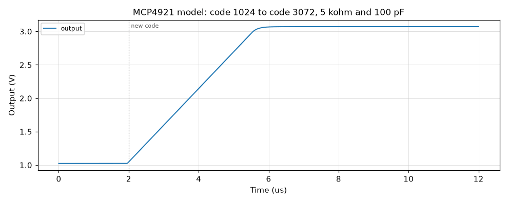

Notes:

- The serial interface is not modelled: the code is a parameter of the model,
  and a code change is a step without the glitch of the real part.
- The limits are the fit this project asks of the model. The bandwidth of the
  output amplifier is fitted to the settling time, so that figure is not an
  independent check.
- The datasheet states no output resistance and no noise; the model has 1 ohm
  (assumption) and no noise.

Models. written here: MCP4921.

Decks: [source-meter-mcp4921.settling.cir](source-meter-mcp4921.settling.cir).

## `models/source-meter-parts`

**Diode, transistor, bead and inductor of the source meter against their
datasheets.**

Four parts of the schematic are put in the test conditions of their datasheets.
The Schottky diode D11 carries a forced current, which gives its forward voltage
from 0.1 mA to 1 A, and stands at 4 V in reverse for its capacitance. The
transistor Q1 gives its threshold, its on-resistance and its current in
saturation. The bead FB1 and the inductor L2 carry a test current over the
frequency, which gives their impedance.

Answers: the models of D11 and D12, Q1, FB1 and L2.

| Figure | Simulated | Specification | Limits | Verdict | Source |
| --- | --- | --- | --- | --- | --- |
| 1N5819HW: forward voltage at 0.1 mA | 88.49 mV | 92 mV (-3.81 %) | 82.8 mV to 101.2 mV | pass | Diodes Incorporated DS30217 Rev. 22-2, page 3, figure 1, typical at 25 C |
| 1N5819HW: forward voltage at 1 mA | 150.1 mV | 150 mV (+0.10 %) | 135 mV to 165 mV | pass | Diodes Incorporated DS30217 Rev. 22-2, page 3, figure 1, typical at 25 C |
| 1N5819HW: forward voltage at 10 mA | 213.3 mV | 222 mV (-3.90 %) | 199.8 mV to 244.2 mV | pass | Diodes Incorporated DS30217 Rev. 22-2, page 3, figure 1, typical at 25 C |
| 1N5819HW: forward voltage at 100 mA | 283.5 mV | 289 mV (-1.90 %) | 260.1 mV to 317.9 mV | pass | Diodes Incorporated DS30217 Rev. 22-2, page 3, figure 1, typical at 25 C |
| 1N5819HW: forward voltage at 1000 mA | 422.6 mV | 420 mV (+0.61 %) | 378 mV to 462 mV | pass | Diodes Incorporated DS30217 Rev. 22-2, page 3, figure 1, typical at 25 C |
| 1N5819HW: capacitance at 4 V in reverse | 49.86 pF | 50 pF (-0.28 %) | 40 pF to 60 pF | pass | Diodes Incorporated DS30217 Rev. 22-2, page 2: 50 pF typical, 60 pF at the most |
| 1N5819HW, variant at the limit: forward voltage at 100 mA | 319.6 mV | 320 mV (-0.13 %) | 304 mV to 336 mV | pass | Diodes Incorporated DS30217 Rev. 22-2, page 2: 0.32 V at the most |
| BSS138: on-resistance at 10 V and 0.22 A | 1.42 Ω | 1.4 Ω (+1.46 %) | 1.2 Ω to 3.5 Ω | pass | Diodes Incorporated DS30144 Rev. 25-2, page 2: 1.4 ohm typical, 3.5 ohm at the most |
| BSS138, typical: gate voltage at 250 uA | 1.09 V | 1.2 V (-9.18 %) | 1.04 V to 1.25 V | pass | Diodes Incorporated DS30144 Rev. 25-2, page 2: 0.5 / 1.2 / 1.5 V; figure 4: 1.05 V typical |
| BSS138, typical: gate voltage at 3.3 mA, the current of R53 | 1.248 V | | | | |
| BSS138, lower limit: gate voltage at 250 uA | 500.3 mV | 500 mV (+0.06 %) | 340 mV to 550 mV | pass | Diodes Incorporated DS30144 Rev. 25-2, page 2: 0.5 / 1.2 / 1.5 V; figure 4: 1.05 V typical |
| BSS138, upper limit: gate voltage at 250 uA | 1.5 V | 1.5 V (-0.03 %) | 1.34 V to 1.55 V | pass | Diodes Incorporated DS30144 Rev. 25-2, page 2: 0.5 / 1.2 / 1.5 V; figure 4: 1.05 V typical |
| BSS138: drain current in saturation at 2.5 V on the gate | 187.1 mA | 190 mA (-1.54 %) | 171 mA to 209 mA | pass | Diodes Incorporated DS30144 Rev. 25-2, page 3, figure 1 |
| BSS138: drain current in saturation at 3 V on the gate | 327.8 mA | 360 mA (-8.95 %) | 324 mA to 396 mA | pass | Diodes Incorporated DS30144 Rev. 25-2, page 3, figure 1 |
| BSS138: drain current in saturation at 3.5 V on the gate | 501.1 mA | 545 mA (-8.05 %) | 490.5 mA to 599.5 mA | pass | Diodes Incorporated DS30144 Rev. 25-2, page 3, figure 1 |
| BLM31SN500: impedance at 100 MHz | 46.46 Ω | 50 Ω (-7.09 %) | 37.5 Ω to 62.5 Ω | pass | Murata JENF243A-0006Z-01, page 1: 50 ohm +/-25 % |
| BLM31SN500: resistance at 100 Hz | 1.605 mΩ | | at most 1.632 mΩ | pass | Murata JENF243A-0006Z-01, page 1: 1.6 mohm at the most |
| XFL4020-152: inductance at 100 kHz | 1.5 µH | 1.5 µH (+0.00 %) | 1.47 µH to 1.53 µH | pass | Coilcraft document 745-1, page 1: 1.5 uH +/-20 % |
| XFL4020-152: resistance at 100 Hz | 14.43 mΩ | 14.4 mΩ (+0.21 %) | 14.11 mΩ to 14.69 mΩ | pass | Coilcraft document 745-1, page 1: 14.4 mohm typical, 15.8 mohm at the most |
| XFL4020-152: self-resonance | 59.83 MHz | 59 MHz (+1.40 %) | 53.1 MHz to 64.9 MHz | pass | Coilcraft document 745-1, page 1: 59 MHz typical |

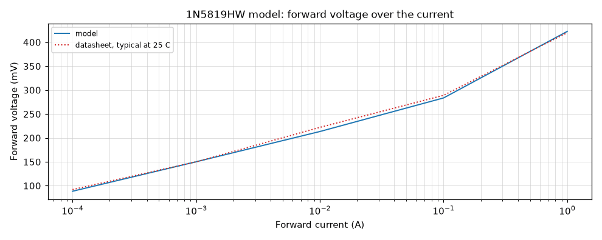

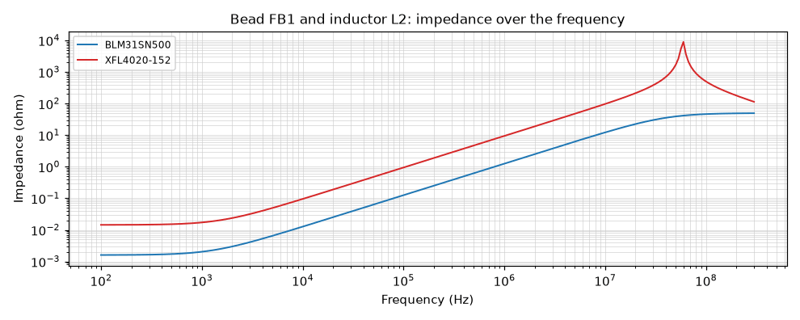

Notes:

- The limits are the fit this project asks of a model: 10 % on a forward voltage
  and on a drain current. Limits of a datasheet are named as such.
- The diode model has 4 uA of reverse current where the datasheet states 10 uA
  typical at 4 V and up to 2 mA at 100 C: no leakage figure may be taken from
  it.
- The inductance of the bead below the frequency at which it turns resistive
  (0.2 uH) is an assumption: its reference specification has no curve.
- The BSS138 model is fitted for the use of Q1, a source follower at a few
  milliamperes; it is not fitted to the on-resistance at low gate voltage.

Models. written here: BLM31SN500, SOURCE_METER_1N5819HW,
SOURCE_METER_1N5819HW_HI, SOURCE_METER_BSS138, SOURCE_METER_BSS138_HI,
SOURCE_METER_BSS138_LO, XFL4020_152.

Decks: [source-meter-parts.bead.cir](source-meter-parts.bead.cir),
[source-meter-parts.diode.cir](source-meter-parts.diode.cir),
[source-meter-parts.fet-curve.cir](source-meter-parts.fet-curve.cir),
[source-meter-parts.fet-on.cir](source-meter-parts.fet-on.cir),
[source-meter-parts.inductor.cir](source-meter-parts.inductor.cir).

## `models/source-meter-tps63020`

**TPS63020 model of the source meter against its datasheet.**

The converter U16 and its inductor are put in the application circuit of the
datasheet. A divider of 1 Mohm over 180 kohm sets 3.28 V. The run starts the
converter, steps the load from 0.5 A to 1.5 A and back, and gives the start
time, the dip and the load regulation. Runs that end at rest give the efficiency
in forced PWM, the current limit above and below 1.2 V of output, and the
current that the part takes back when its output is held above the target. With
the model of the manufacturer only the first run from 4.2 V is made: it switches
at 2.4 MHz and a millisecond takes minutes.

Answers: the model of the tracking pre-regulator U16 with its inductor L2.

| Figure | Simulated | Vendor models | Specification | Limits | Verdict | Source |
| --- | --- | --- | --- | --- | --- | --- |
| Output from 4.2 V with 1 Mohm over 180 kohm | 3.276 V | 3.277 V | 3.278 V (-0.06 %) | 3.245 V to 3.311 V | pass | Texas Instruments SLVS916I, page 6: reference 0.5 V, 495 mV to 505 mV |
| Load step of 0.5 A to 1.5 A from 4.2 V: lowest point | -108.1 mV | -110.3 mV | -100 mV (-8.10 %) | -130 mV to -70 mV | pass | Texas Instruments SLVS916I, page 20, figures 21 and 22: about -75 mV to -115 mV |
| Release of that step from 4.2 V: highest point | 103.7 mV | 101.5 mV | 100 mV (+3.74 %) | 70 mV to 130 mV | pass | Texas Instruments SLVS916I, page 20, figures 21 and 22 |
| Fall of the output for 1 A more from 4.2 V | 4.36 mV | 4.508 mV | | at most 16.39 mV | pass | Texas Instruments SLVS916I, page 6: load regulation 0.5 % |
| Start from 4.2 V into 6.6 ohm: 90 % of the output after the enable | 159.7 µs | 132.2 µs | 250 µs (-36.14 %) | 100 µs to 400 µs | pass | Texas Instruments SLVS916I, page 20, figures 24 and 25, into 2.2 ohm |
| Start from 4.2 V: highest output before the load step | 7.985 mV | 169.1 mV | | | | |
| Output from 2.4 V with 1 Mohm over 180 kohm | 3.275 V | | 3.278 V (-0.09 %) | 3.245 V to 3.311 V | pass | Texas Instruments SLVS916I, page 6: reference 0.5 V, 495 mV to 505 mV |
| Load step of 0.5 A to 1.5 A from 2.4 V: lowest point | -149.6 mV | | -100 mV (-49.57 %) | -130 mV to -70 mV | **FAIL** | Texas Instruments SLVS916I, page 20, figures 21 and 22: about -75 mV to -115 mV |
| Release of that step from 2.4 V: highest point | 143 mV | | 100 mV (+43.05 %) | 70 mV to 130 mV | **FAIL** | Texas Instruments SLVS916I, page 20, figures 21 and 22 |
| Fall of the output for 1 A more from 2.4 V | 6.714 mV | | | at most 16.39 mV | pass | Texas Instruments SLVS916I, page 6: load regulation 0.5 % |
| Start from 2.4 V into 6.6 ohm: 90 % of the output after the enable | 248.3 µs | | 250 µs (-0.68 %) | 100 µs to 400 µs | pass | Texas Instruments SLVS916I, page 20, figures 24 and 25, into 2.2 ohm |
| Start from 2.4 V: highest output before the load step | 9.695 mV | | | | | |
| Efficiency in forced PWM, 3.6 V to 2.5 V at 10 mA | 36.44 % | | 40 % (-8.91 %) | 35 % to 45 % | pass | Texas Instruments SLVS916I, page 18, figure 9, read from the curve |
| Efficiency in forced PWM, 3.6 V to 2.5 V at 1000 mA | 91.23 % | | 91 % (+0.25 %) | 86 % to 96 % | pass | Texas Instruments SLVS916I, page 18, figure 9, read from the curve |
| Efficiency in forced PWM, 3.6 V to 4.5 V at 10 mA | 39.77 % | | 42 % (-5.31 %) | 37 % to 47 % | pass | Texas Instruments SLVS916I, page 18, figure 9, read from the curve |
| Efficiency in forced PWM, 3.6 V to 4.5 V at 1000 mA | 91.92 % | | 92 % (-0.09 %) | 87 % to 97 % | pass | Texas Instruments SLVS916I, page 18, figure 9, read from the curve |
| Average inductor current into 0.5 ohm, output above 1.2 V | 3.998 A | | 4 A (-0.04 %) | 3.5 A to 4.5 A | pass | Texas Instruments SLVS916I, page 6: 3.5 A to 4.5 A |
| Average inductor current into a short circuit | 478.7 mA | | 400 mA (+19.67 %) | 300 mA to 600 mA | pass | Texas Instruments SLVS916I, page 10, 7.4.1: the limit starts at 400 mA |
| Inductor current with the output held at 3.6 V, above the target | -699.7 mA | | -700 mA (+0.04 %) | -800 mA to -600 mA | pass | Texas Instruments SLVA726, page 3: 0.6 A to 0.8 A, typical |
| Power returned to the input in that state | 2.313 W | | | | | |
| Output with the enable pin at 0.4 V, 6.6 ohm of load | 613.7 fV | | | at most 10 mV | pass | Texas Instruments SLVS916I, page 6: low below 0.4 V; page 9: the load is disconnected |

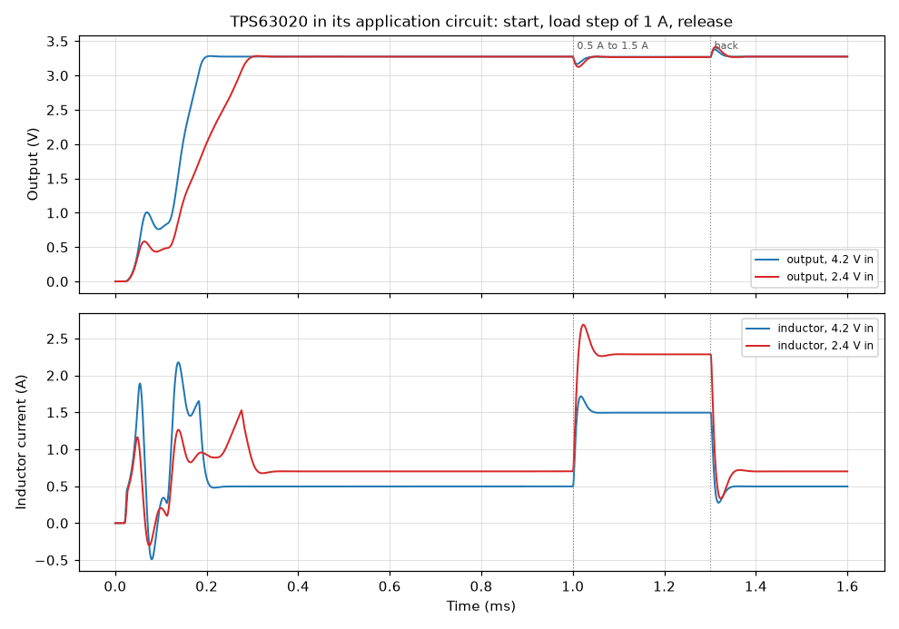

Notes:

- The model is averaged over the switching period: the graph shows no ripple,
  and the limits of the load step are the span that the datasheet figures show,
  not datasheet limits.
- The loop gains of the model are fitted to this load step, and its losses to
  the four efficiency points; both are therefore not independent checks. The run
  with the model of the manufacturer is the second opinion.
- The output capacitance of 40 uF, the straight line of the current limit below
  1.2 V and the hold of the least duty cycle are assumptions.

Models. written here: TPS63020_AVG, XFL4020_152.

Decks:
[source-meter-tps63020.step-2p4v.cir](source-meter-tps63020.step-2p4v.cir),
[source-meter-tps63020.step-4p2v.cir](source-meter-tps63020.step-4p2v.cir).
