# Simulation Results: Output Stage

Everything on this page is a simulation result. Nothing here is measured on
hardware. The page is written by `circuit-sim report` from the result files
beside it; do not edit it by hand.

## `output_stage/guard`

**The guard buffer: stability with the guard ring, static error, range change,
output off.**

The buffer copies the node after the shunts onto the guard ring through R119.
The loop gain of the buffer is taken by double injection at the output of the
amplifier, with the measured node behind the 1 kohm of range 0 and C71, which is
its highest impedance: without a ring, with the ring assumed for the board, with
ten times that ring, with C73 at half its value and with C73 left out. One
injection at the inverting input checks the method. A small-signal run gives the
frequency up to which the guard follows the node. Then the node is driven: a
step of 100 mV as a range change gives it, a dip to 1.1 V for 15 us as a short
circuit gives it, and a fall to 0 V at 0.8 V/ms as a released output gives it;
and it rests at 5 V and at 0.8 V, where the difference that is left between
guard and node is read.

Answers: sections 4.3, 4.8 and 10.3 (node after the shunts, buffer, guard ring),
D-32 and D-72.

| Figure | Simulated | Vendor models | Specification | Limits | Verdict | Source |
| --- | --- | --- | --- | --- | --- | --- |
| Phase margin, no ring capacitance | 92.06 ° | 117.8 ° | | at least 45 ° | pass | limit set here: 45 degrees; the specification states none |
| Crossover, no ring capacitance | 1.157 MHz | 1.507 MHz | | | | |
| Phase margin, assumed ring: 100 pF, 10 pF, 2 pF | 92.72 ° | 118.6 ° | | at least 45 ° | pass | limit set here: 45 degrees; the specification states none |
| Crossover, assumed ring: 100 pF, 10 pF, 2 pF | 1.147 MHz | 1.489 MHz | | | | |
| Phase margin, ten times the assumed ring | 96.84 ° | 123.9 ° | | at least 45 ° | pass | limit set here: 45 degrees; the specification states none |
| Crossover, ten times the assumed ring | 1.147 MHz | 1.549 MHz | | | | |
| Phase margin, assumed ring, C73 at half its value | 91.36 ° | 117.5 ° | | at least 45 ° | pass | limit set here: 45 degrees; the specification states none |
| Crossover, assumed ring, C73 at half its value | 1.144 MHz | 1.479 MHz | | | | |
| Phase margin, assumed ring, C73 not fitted | 55.61 ° | 72.97 ° | | | | |
| Crossover, assumed ring, C73 not fitted | 3.96 MHz | 4.986 MHz | | | | |
| Assumed ring: phase margin by one injection at the inverting input, less the one by double injection | -0.1481 ° | -0.02715 ° | | -3 ° to 3 ° | pass | check of the method; limit set here |
| Frequency up to which the guard follows the node within 3 dB | 34.73 kHz | 34.73 kHz | 33.83 kHz (+2.67 %) | 30.45 kHz to 37.21 kHz | pass | R119 with C73 and the ring, calculated here; limit 10 % around it |
| Peaking of the guard over the node | 0 dB | 0 dB | | at most 1 dB | pass | limit set here |
| Node at 5 V and at rest: guard less node | -1.069 mV | -1.048 mV | -1.068 mV (-0.10 %) | -1.282 mV to -854.4 µV | pass | the current of the monitor divider in R119, calculated here; limit 20 % around it; the amplifier model has no offset |
| Node at 5 V and at rest: translator supply less node | -8.001 mV | -7.98 mV | | at least -10 mV | pass | section 4.8: up to 10 mV below the output voltage at rest |
| Node at 0.8 V and at rest: guard less node | -171.1 µV | -150 µV | -170.9 µV (-0.12 %) | -205 µV to -136.7 µV | pass | the current of the monitor divider in R119, calculated here; limit 20 % around it; the amplifier model has no offset |
| Node at 0.8 V and at rest: translator supply less node | -8 mV | -7.979 mV | | at least -10 mV | pass | section 4.8: up to 10 mV below the output voltage at rest |
| Step of 100 mV: overshoot at the output of the amplifier | 2.462 % | 2.294 % | | at most 25 % | pass | limit set here: the overshoot that goes with 45 degrees |
| Step of 100 mV: overshoot at the guard | 0 % | 0 % | | | | |
| Step of 100 mV: guard within 1 mV of its final value after | 21.18 µs | 21.17 µs | 21.67 µs (-2.26 %) | | | 4.6 time constants of R119 with C73, calculated here |
| Dip to 1.1 V for 15 us: largest distance of the guard from the node | 3.898 V | 3.898 V | | | | |
| Dip to 1.1 V: distance of the guard from the node at the end of the dip | 182.7 mV | 176.4 mV | | | | |
| Dip to 1.1 V: guard within 10 mV of the node after the node is back | 27.67 µs | 27.54 µs | | | | |
| Dip to 1.1 V: largest current of the amplifier into R119 | 65.81 mA | 66.42 mA | 65 mA (+1.24 %) | | | TI SBOS737C, page 8: short-circuit current 65 mA, which the amplifier may deliver without a time limit (page 5) |
| Dip to 1.1 V: lowest voltage at the input of the buffer | 1.046 V | 1.043 V | | at least -4.5 V | pass | TI SBOS737C, page 5: inputs to 0.5 V beyond the rails |
| Released output, 5 V to 0 V at 0.8 V/ms: largest distance of the guard | 4.343 mV | 4.365 mV | | | | |
| Node at 0 V with the output off: guard less node | -19.39 nV | 21 µV | | -1 mV to 1 mV | pass | limit set here: 1 mV, the size of the error at 5 V |

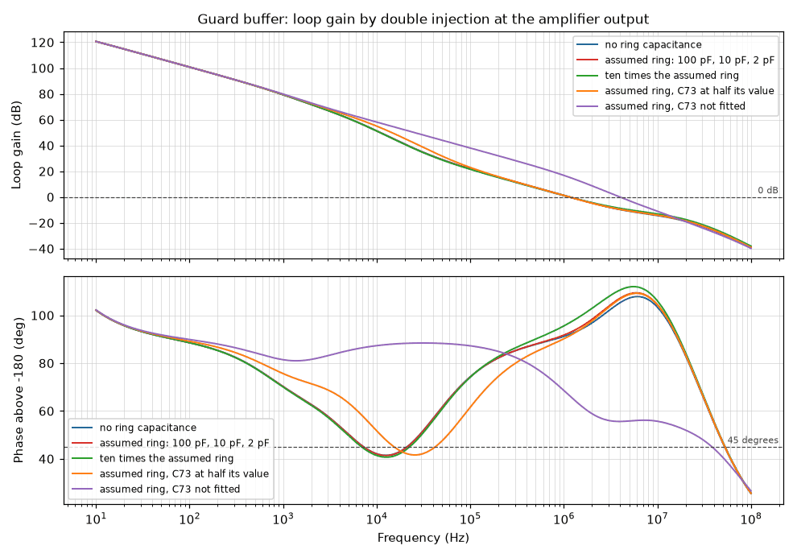

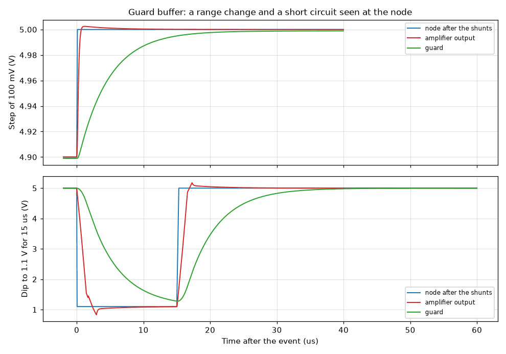

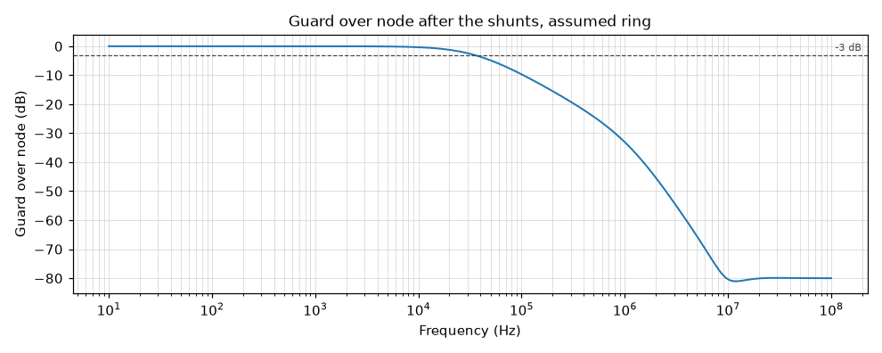

Notes:

- The ring is an assumption: 100 pF from the guard copper to the ground plane,
  10 pF to the measured node and 2 pF to the input of the buffer. C73, 100 nF
  behind R119, holds the guard still above 34 kHz, so the ring cannot feed the
  buffer back at the frequencies at which its loop closes; ten times the ring
  changes nothing.
- The margin rests on the output impedance of the amplifier model. Against table
  3 of its datasheet that model is close where the table gives 45 degrees and 15
  to 30 degrees too optimistic where it gives 60 degrees (bench
  output-stage-buffer of the model block), so the margins here are too high by
  about that much. The table itself gives 60 degrees for 100 nF behind 15.8 ohm;
  the board has three times that resistance.
- One injection at the inverting input agrees with the double injection at the
  crossover and above. Below about 10 kHz it does not: the ring also feeds the
  non-inverting input, and an injection in one branch leaves that path closed.
  The double injection at the amplifier output cuts both.
- The guard follows the node up to 34 kHz. A faster change of the node leaves
  the guard behind for some microseconds; what flows through the ring
  capacitance then is charge of picocoulombs beside the 100 nF of C71.
- In the dip the amplifier model delivers about 25 mA at most, because its
  output resistance stands between its rails and its output at every level; the
  datasheet gives 65 mA, and the model of the manufacturer delivers that in the
  vendor tier. The guard of the board comes back faster than the model written
  here shows.
- The static difference is the current of the monitor divider (R140, R149) in
  R119. The model has no offset voltage; the datasheet gives 25 uV typical and
  100 uV at most, which adds to it.
- The clamp D24 of the translator supply is left out: it does not conduct
  between 0 V and the 5 V rail. The translator takes 8 uA. Its branch belongs to
  the digital inputs block.
- The input bias current of the buffer flows out of the measured node. The model
  has 5 pA; no leakage figure may be taken from it.

Models. written here: OPA197, OUTPUT_OPA197_PROBE.

Decks: [guard.dip.cir](guard.dip.cir),
[guard.series-assumed.cir](guard.series-assumed.cir),
[guard.shunt-assumed.cir](guard.shunt-assumed.cir),
[guard.step.cir](guard.step.cir).

## `output_stage/on-resistance`

**The closed output pair at 1 A: burden behind the shunts, over the output
range.**

The output is on in range 3 and the terminal takes 1 A; the output voltage is
stepped. The gates of the pair rest at +12 V_A and the two sources at the output
voltage, so the gate drive falls as the output rises: 11.2 V at 0.8 V and 7 V at
5 V. The drop from the node after the shunts to the terminal is burden that the
shunt does not measure. Each point is the end of a run that starts from zero and
settles. The sweep is repeated with +12 V_A at its lower limit and, with the
models written here, with both transistors at the upper limit of the
on-resistance.

Answers: requirement R-06 and D-64 (drop of the path), section 4.2 (output
switch).

| Figure | Simulated | Vendor models | Specification | Limits | Verdict | Source |
| --- | --- | --- | --- | --- | --- | --- |
| Typical parts, 0.8 V: drop of the pair at 1 A and 25 C | 7.849 mV | 10.33 mV | 8.727 mV (-10.07 %) | at most 9.6 mV | pass | requirement R-06: 144 mV typical from the regulator at 50 C, of which two of five transistors, taken to 25 C; limit set here, 10 % above |
| Typical parts, 0.8 V: gate-source voltage of the pair | 11.32 V | 11.32 V | | | | |
| Typical parts, 0.8 V: drop from the supply node to the terminal | 111.8 mV | 114.3 mV | | | | |
| Typical parts, 3.3 V: drop of the pair at 1 A and 25 C | 8.189 mV | 10.53 mV | 8.727 mV (-6.16 %) | at most 9.6 mV | pass | requirement R-06: 144 mV typical from the regulator at 50 C, of which two of five transistors, taken to 25 C; limit set here, 10 % above |
| Typical parts, 3.3 V: gate-source voltage of the pair | 8.818 V | 8.819 V | | | | |
| Typical parts, 3.3 V: drop from the supply node to the terminal | 112.3 mV | 114.6 mV | | | | |
| Typical parts, 5 V: drop of the pair at 1 A and 25 C | 8.623 mV | 10.78 mV | 8.727 mV (-1.19 %) | at most 9.6 mV | pass | requirement R-06: 144 mV typical from the regulator at 50 C, of which two of five transistors, taken to 25 C; limit set here, 10 % above |
| Typical parts, 5 V: gate-source voltage of the pair | 7.119 V | 7.119 V | | | | |
| Typical parts, 5 V: drop from the supply node to the terminal | 112.9 mV | 115.1 mV | | | | |
| +12 V_A at 11.4 V, 5 V: drop of the pair at 1 A and 25 C | 8.86 mV | 10.92 mV | | | | |
| +12 V_A at 11.4 V, 5.5 V: drop of the pair at 1 A and 25 C | 9.115 mV | 11.08 mV | | | | |
| Largest on-resistance, +12 V_A at 11.4 V: largest drop of the pair up to 5 V, taken to 50 C | 11.76 mV | | 14.4 mV (-18.34 %) | at most 14.4 mV | pass | requirement R-06: 161 mV at the bounds from the regulator at 50 C, of which two of five transistors |

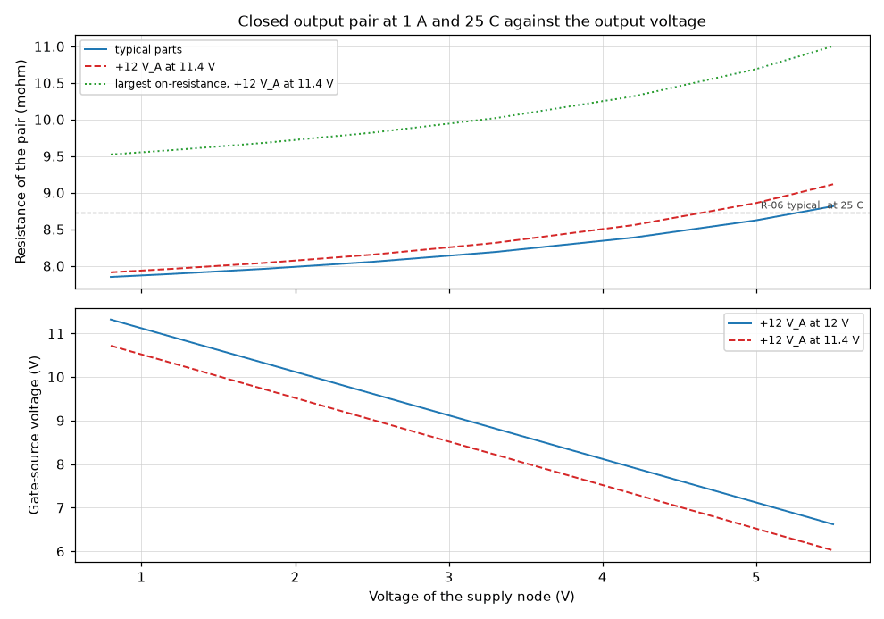

Notes:

- The transistor model has no temperature: every value is at 25 C. The
  specification counts the path at 50 C, where the datasheet shows 1.1 times the
  resistance (figure 8); the limits here are taken to 25 C with that factor, and
  the figure at the bounds is taken to 50 C with it.
- The specification states the drop of the whole path, not of one transistor.
  The share of the pair is derived here: the total less the shunt and the
  copper, over five transistors, times two.
- An ideal source behind 10 mohm stands for the source meter and its closed mode
  pair; the drop from the supply node to the terminal therefore leaves out the
  mode pair, the copper and the contacts.
- The values are the end of a run that starts from zero and has settled; the
  gate node is tied to +12 V_A while the circuit comes up.
- In the vendor tier the pair drops 10.3 mV to 10.8 mV. The model of the
  manufacturer has 5.2 mohm at 10 V on the gate, where the datasheet of the same
  part gives 4.0 mohm typical and 4.8 mohm at most: it is not a typical part by
  its own datasheet.

Models. written here: BAV199, CSD17577Q3A, IRLML0030, IRLML0030_CLAMP, MUX509,
OPA197, OUTPUT_CSD17577_RMAX, OUTPUT_PTVS15V, TC4427CH.

Decks: [on-resistance.typical-5.cir](on-resistance.typical-5.cir).

## `output_stage/short-circuit`

**A short circuit at the closed output: current, trip, energy and voltages.**

The output is on in range 3 and a short circuit closes at the end of the cable.
The current rises as the inductance of the cable and the resistance of the path
allow. The model of the sequencer sees the over-current through ideal
comparators on the shunt voltage and lets GATE_OUT fall after the qualification
time; the gate then leaves through D20 and R116, the pair brings the current
down, and the suppressor carries what the cable still holds. The cases differ in
the inductance of the cable (0.2 uH, 1 uH, 3 uH), in the qualification time (12
us and the 20 us that rule F-18 allows at most), in the output voltage and in
the forward resistance of the suppressor. One case takes a regulator that limits
its current, with the output capacitor of the schematic, in place of the stiff
source; one starts in range 0, so that the jump to range 3 comes first.

Answers: sections 4.2 and 4.9 (output switch, suppressor, D-70, D-71), section
4.4 (over-current trip), rules F-18 and F-19, section 4.3 (pulse in R110).

| Figure | Simulated | Vendor models | Specification | Limits | Verdict | Source |
| --- | --- | --- | --- | --- | --- | --- |
| 5 V, 1 uH, trip after 12 us: short circuit to the fall of GATE_OUT | 12.44 µs | 12.44 µs | | | | |
| 5 V, 1 uH, trip after 12 us: 1.15 A in the shunt to the fall of GATE_OUT | 12.2 µs | 12.2 µs | | 10 µs to 20.5 µs | pass | rule F-18: qualification 10 us to 20 us; the upper limit here adds 0.5 us for the comparator stand-in and the sequencer model |
| 5 V, 1 uH, trip after 12 us: short circuit to less than 1 A in the pair | 23.42 µs | 21.42 µs | | | | |
| 5 V, 1 uH, trip after 12 us: largest current in the 0.1 ohm shunt | 24.59 A | 24.44 A | | at most 27 A | pass | section 4.3: R3 carries up to 27 A for microseconds |
| 5 V, 1 uH, trip after 12 us: current in the shunt 12 us after the short circuit | 23.7 A | 23.55 A | | | | |
| 5 V, 1 uH, trip after 12 us: current in the shunt 20 us after the short circuit | 9.721 A | 5.366 A | | | | |
| 5 V, 1 uH, trip after 12 us: energy in the 0.1 ohm shunt R110 | 782.7 µJ | 752.7 µJ | 1 mJ (-21.73 %) | at most 200 mJ | pass | section 4.3: about 1 mJ against 200 mJ |
| 5 V, 1 uH, trip after 12 us: energy in Q15 | 336.7 µJ | 274.8 µJ | | at most 39 mJ | pass | TI SLPS515A, page 1: 39 mJ of avalanche energy, taken as the scale |
| 5 V, 1 uH, trip after 12 us: largest power in Q15 | 68.03 W | 68.03 W | | | | |
| 5 V, 1 uH, trip after 12 us: largest forward current in the suppressor D21 | 11.43 A | 14.43 A | 11.6 A (-1.46 %) | at most 50 A | pass | section 4.9: at most 11.6 A against a surge rating of 50 A |
| 5 V, 1 uH, trip after 12 us: lowest voltage at the terminal | -1.225 V | -1.124 V | | at least -1.7 V | pass | section 4.9: the terminal goes to -0.8 V to -1.7 V |
| 5 V, 1 uH, trip after 12 us: time for which the terminal is below -0.5 V | 14.72 µs | 15.09 µs | | | | |
| 5 V, 1 uH, trip after 20 us: short circuit to the fall of GATE_OUT | 20.44 µs | 20.44 µs | | | | |
| 5 V, 1 uH, trip after 20 us: 1.15 A in the shunt to the fall of GATE_OUT | 20.2 µs | 20.2 µs | | 10 µs to 20.5 µs | pass | rule F-18: qualification 10 us to 20 us; the upper limit here adds 0.5 us for the comparator stand-in and the sequencer model |
| 5 V, 1 uH, trip after 20 us: short circuit to less than 1 A in the pair | 31.68 µs | 29.54 µs | | | | |
| 5 V, 1 uH, trip after 20 us: largest current in the 0.1 ohm shunt | 25.52 A | 25.34 A | | at most 27 A | pass | section 4.3: R3 carries up to 27 A for microseconds |
| 5 V, 1 uH, trip after 20 us: current in the shunt 12 us after the short circuit | 23.7 A | 23.55 A | | | | |
| 5 V, 1 uH, trip after 20 us: current in the shunt 20 us after the short circuit | 25.31 A | 25.12 A | | | | |
| 5 V, 1 uH, trip after 20 us: energy in the 0.1 ohm shunt R110 | 1.312 mJ | 1.271 mJ | 1 mJ (+31.16 %) | at most 200 mJ | pass | section 4.3: about 1 mJ against 200 mJ |
| 5 V, 1 uH, trip after 20 us: energy in Q15 | 376.5 µJ | 313.1 µJ | | at most 39 mJ | pass | TI SLPS515A, page 1: 39 mJ of avalanche energy, taken as the scale |
| 5 V, 1 uH, trip after 20 us: largest power in Q15 | 69.4 W | 69.31 W | | | | |
| 5 V, 1 uH, trip after 20 us: largest forward current in the suppressor D21 | 12.18 A | 15.42 A | 11.6 A (+5.00 %) | at most 50 A | pass | section 4.9: at most 11.6 A against a surge rating of 50 A |
| 5 V, 1 uH, trip after 20 us: lowest voltage at the terminal | -1.249 V | -1.14 V | | at least -1.7 V | pass | section 4.9: the terminal goes to -0.8 V to -1.7 V |
| 5 V, 1 uH, trip after 20 us: time for which the terminal is below -0.5 V | 15.28 µs | 15.68 µs | | | | |
| 5 V, 0.2 uH, trip after 20 us: short circuit to the fall of GATE_OUT | 20.26 µs | 20.27 µs | | | | |
| 5 V, 0.2 uH, trip after 20 us: 1.15 A in the shunt to the fall of GATE_OUT | 20.2 µs | 20.21 µs | | 10 µs to 20.5 µs | pass | rule F-18: qualification 10 us to 20 us; the upper limit here adds 0.5 us for the comparator stand-in and the sequencer model |
| 5 V, 0.2 uH, trip after 20 us: short circuit to less than 1 A in the pair | 28.36 µs | 27.97 µs | | | | |
| 5 V, 0.2 uH, trip after 20 us: largest current in the 0.1 ohm shunt | 26.08 A | 25.84 A | | at most 27 A | pass | section 4.3: R3 carries up to 27 A for microseconds |
| 5 V, 0.2 uH, trip after 20 us: current in the shunt 12 us after the short circuit | 26.07 A | 25.83 A | | | | |
| 5 V, 0.2 uH, trip after 20 us: current in the shunt 20 us after the short circuit | 26.07 A | 25.84 A | | | | |
| 5 V, 0.2 uH, trip after 20 us: energy in the 0.1 ohm shunt R110 | 1.629 mJ | 1.594 mJ | 1 mJ (+62.93 %) | at most 200 mJ | pass | section 4.3: about 1 mJ against 200 mJ |
| 5 V, 0.2 uH, trip after 20 us: energy in Q15 | 256 µJ | 263.6 µJ | | at most 39 mJ | pass | TI SLPS515A, page 1: 39 mJ of avalanche energy, taken as the scale |
| 5 V, 0.2 uH, trip after 20 us: largest power in Q15 | 55.48 W | 55.9 W | | | | |
| 5 V, 0.2 uH, trip after 20 us: largest forward current in the suppressor D21 | 412.4 mA | 1.172 A | 11.6 A (-96.44 %) | at most 50 A | pass | section 4.9: at most 11.6 A against a surge rating of 50 A |
| 5 V, 0.2 uH, trip after 20 us: lowest voltage at the terminal | -800.1 mV | -871.4 mV | | at least -1.7 V | pass | section 4.9: the terminal goes to -0.8 V to -1.7 V |
| 5 V, 0.2 uH, trip after 20 us: time for which the terminal is below -0.5 V | 2.669 µs | 2.625 µs | | | | |
| 5 V, 3 uH, trip after 20 us: short circuit to the fall of GATE_OUT | 20.86 µs | 20.86 µs | | | | |
| 5 V, 3 uH, trip after 20 us: 1.15 A in the shunt to the fall of GATE_OUT | 20.2 µs | 20.2 µs | | 10 µs to 20.5 µs | pass | rule F-18: qualification 10 us to 20 us; the upper limit here adds 0.5 us for the comparator stand-in and the sequencer model |
| 5 V, 3 uH, trip after 20 us: short circuit to less than 1 A in the pair | 33.14 µs | 29.94 µs | | | | |
| 5 V, 3 uH, trip after 20 us: largest current in the 0.1 ohm shunt | 20.98 A | 20.81 A | | at most 27 A | pass | section 4.3: R3 carries up to 27 A for microseconds |
| 5 V, 3 uH, trip after 20 us: current in the shunt 12 us after the short circuit | 14.23 A | 14.17 A | | | | |
| 5 V, 3 uH, trip after 20 us: current in the shunt 20 us after the short circuit | 19.3 A | 19.18 A | | | | |
| 5 V, 3 uH, trip after 20 us: energy in the 0.1 ohm shunt R110 | 651.8 µJ | 625.5 µJ | 1 mJ (-34.82 %) | at most 200 mJ | pass | section 4.3: about 1 mJ against 200 mJ |
| 5 V, 3 uH, trip after 20 us: energy in Q15 | 358.9 µJ | 270 µJ | | at most 39 mJ | pass | TI SLPS515A, page 1: 39 mJ of avalanche energy, taken as the scale |
| 5 V, 3 uH, trip after 20 us: largest power in Q15 | 65.86 W | 65.98 W | | | | |
| 5 V, 3 uH, trip after 20 us: largest forward current in the suppressor D21 | 14.37 A | 16.51 A | 11.6 A (+23.91 %) | at most 50 A | pass | section 4.9: at most 11.6 A against a surge rating of 50 A |
| 5 V, 3 uH, trip after 20 us: lowest voltage at the terminal | -1.32 V | -1.157 V | | at least -1.7 V | pass | section 4.9: the terminal goes to -0.8 V to -1.7 V |
| 5 V, 3 uH, trip after 20 us: time for which the terminal is below -0.5 V | 39.24 µs | 40.68 µs | | | | |
| 5 V, short circuit across the terminals (5 mohm, 50 nH), trip after 20 us: short circuit to the fall of GATE_OUT | 20.23 µs | 20.23 µs | | | | |
| 5 V, short circuit across the terminals (5 mohm, 50 nH), trip after 20 us: 1.15 A in the shunt to the fall of GATE_OUT | 20.21 µs | 20.21 µs | | 10 µs to 20.5 µs | pass | rule F-18: qualification 10 us to 20 us; the upper limit here adds 0.5 us for the comparator stand-in and the sequencer model |
| 5 V, short circuit across the terminals (5 mohm, 50 nH), trip after 20 us: short circuit to less than 1 A in the pair | 27.44 µs | 27.12 µs | | | | |
| 5 V, short circuit across the terminals (5 mohm, 50 nH), trip after 20 us: largest current in the 0.1 ohm shunt | 32.33 A | 31.84 A | | at most 27 A | **FAIL** | section 4.3: R3 carries up to 27 A for microseconds |
| 5 V, short circuit across the terminals (5 mohm, 50 nH), trip after 20 us: current in the shunt 12 us after the short circuit | 32.33 A | 31.84 A | | | | |
| 5 V, short circuit across the terminals (5 mohm, 50 nH), trip after 20 us: current in the shunt 20 us after the short circuit | 32.33 A | 31.84 A | | | | |
| 5 V, short circuit across the terminals (5 mohm, 50 nH), trip after 20 us: energy in the 0.1 ohm shunt R110 | 2.609 mJ | 2.528 mJ | 1 mJ (+160.92 %) | at most 200 mJ | pass | section 4.3: about 1 mJ against 200 mJ |
| 5 V, short circuit across the terminals (5 mohm, 50 nH), trip after 20 us: energy in Q15 | 385.1 µJ | 418.7 µJ | | at most 39 mJ | pass | TI SLPS515A, page 1: 39 mJ of avalanche energy, taken as the scale |
| 5 V, short circuit across the terminals (5 mohm, 50 nH), trip after 20 us: largest power in Q15 | 62.15 W | 62.36 W | | | | |
| 5 V, short circuit across the terminals (5 mohm, 50 nH), trip after 20 us: largest forward current in the suppressor D21 | 4.351 mA | 30.26 mA | 11.6 A (-99.96 %) | at most 50 A | pass | section 4.9: at most 11.6 A against a surge rating of 50 A |
| 5 V, short circuit across the terminals (5 mohm, 50 nH), trip after 20 us: lowest voltage at the terminal | -555.2 mV | -649.9 mV | | at least -1.7 V | pass | section 4.9: the terminal goes to -0.8 V to -1.7 V |
| 5 V, short circuit across the terminals (5 mohm, 50 nH), trip after 20 us: time for which the terminal is below -0.5 V | 1.19 µs | 1.5 µs | | | | |
| 5 V, 3 uH, trip after 20 us, suppressor with 0.15 ohm: short circuit to the fall of GATE_OUT | 20.86 µs | | | | | |
| 5 V, 3 uH, trip after 20 us, suppressor with 0.15 ohm: 1.15 A in the shunt to the fall of GATE_OUT | 20.2 µs | | | 10 µs to 20.5 µs | pass | rule F-18: qualification 10 us to 20 us; the upper limit here adds 0.5 us for the comparator stand-in and the sequencer model |
| 5 V, 3 uH, trip after 20 us, suppressor with 0.15 ohm: short circuit to less than 1 A in the pair | 44.83 µs | | | | | |
| 5 V, 3 uH, trip after 20 us, suppressor with 0.15 ohm: largest current in the 0.1 ohm shunt | 20.97 A | | | at most 27 A | pass | section 4.3: R3 carries up to 27 A for microseconds |
| 5 V, 3 uH, trip after 20 us, suppressor with 0.15 ohm: current in the shunt 12 us after the short circuit | 14.23 A | | | | | |
| 5 V, 3 uH, trip after 20 us, suppressor with 0.15 ohm: current in the shunt 20 us after the short circuit | 19.3 A | | | | | |
| 5 V, 3 uH, trip after 20 us, suppressor with 0.15 ohm: energy in the 0.1 ohm shunt R110 | 746.6 µJ | | 1 mJ (-25.34 %) | at most 200 mJ | pass | section 4.3: about 1 mJ against 200 mJ |
| 5 V, 3 uH, trip after 20 us, suppressor with 0.15 ohm: energy in Q15 | 842.5 µJ | | | at most 39 mJ | pass | TI SLPS515A, page 1: 39 mJ of avalanche energy, taken as the scale |
| 5 V, 3 uH, trip after 20 us, suppressor with 0.15 ohm: largest power in Q15 | 68.98 W | | | | | |
| 5 V, 3 uH, trip after 20 us, suppressor with 0.15 ohm: largest forward current in the suppressor D21 | 6.279 A | | 11.6 A (-45.87 %) | at most 50 A | pass | section 4.9: at most 11.6 A against a surge rating of 50 A |
| 5 V, 3 uH, trip after 20 us, suppressor with 0.15 ohm: lowest voltage at the terminal | -1.807 V | | | at least -1.7 V | **FAIL** | section 4.9: the terminal goes to -0.8 V to -1.7 V |
| 5 V, 3 uH, trip after 20 us, suppressor with 0.15 ohm: time for which the terminal is below -0.5 V | 31.69 µs | | | | | |
| 0.8 V, 1 uH, trip after 20 us: short circuit to the fall of GATE_OUT | 21.74 µs | 21.75 µs | | | | |
| 0.8 V, 1 uH, trip after 20 us: 1.15 A in the shunt to the fall of GATE_OUT | 20.19 µs | 20.19 µs | | 10 µs to 20.5 µs | pass | rule F-18: qualification 10 us to 20 us; the upper limit here adds 0.5 us for the comparator stand-in and the sequencer model |
| 0.8 V, 1 uH, trip after 20 us: short circuit to less than 1 A in the pair | 30.92 µs | 30.03 µs | | | | |
| 0.8 V, 1 uH, trip after 20 us: largest current in the 0.1 ohm shunt | 4.35 A | 4.297 A | | at most 27 A | pass | section 4.3: R3 carries up to 27 A for microseconds |
| 0.8 V, 1 uH, trip after 20 us: current in the shunt 12 us after the short circuit | 3.916 A | 3.876 A | | | | |
| 0.8 V, 1 uH, trip after 20 us: current in the shunt 20 us after the short circuit | 4.289 A | 4.236 A | | | | |
| 0.8 V, 1 uH, trip after 20 us: energy in the 0.1 ohm shunt R110 | 41.52 µJ | 39.65 µJ | 1 mJ (-95.85 %) | at most 200 mJ | pass | section 4.3: about 1 mJ against 200 mJ |
| 0.8 V, 1 uH, trip after 20 us: energy in Q15 | 10.62 µJ | 9.652 µJ | | at most 39 mJ | pass | TI SLPS515A, page 1: 39 mJ of avalanche energy, taken as the scale |
| 0.8 V, 1 uH, trip after 20 us: largest power in Q15 | 3.449 W | 3.585 W | | | | |
| 0.8 V, 1 uH, trip after 20 us: largest forward current in the suppressor D21 | 961.1 mA | 1.388 A | 11.6 A (-91.71 %) | at most 50 A | pass | section 4.9: at most 11.6 A against a surge rating of 50 A |
| 0.8 V, 1 uH, trip after 20 us: lowest voltage at the terminal | -840.6 mV | -878.9 mV | | at least -1.7 V | pass | section 4.9: the terminal goes to -0.8 V to -1.7 V |
| 0.8 V, 1 uH, trip after 20 us: time for which the terminal is below -0.5 V | 4.238 µs | 4.096 µs | | | | |
| Source mode stand-in, 5 V, 1 uH, trip after 12 us: short circuit to the fall of GATE_OUT | 12.44 µs | 12.44 µs | | | | |
| Source mode stand-in, 5 V, 1 uH, trip after 12 us: 1.15 A in the shunt to the fall of GATE_OUT | 12.2 µs | 12.2 µs | | 10 µs to 20.5 µs | pass | rule F-18: qualification 10 us to 20 us; the upper limit here adds 0.5 us for the comparator stand-in and the sequencer model |
| Source mode stand-in, 5 V, 1 uH, trip after 12 us: short circuit to less than 1 A in the pair | 17.48 µs | 17.2 µs | | | | |
| Source mode stand-in, 5 V, 1 uH, trip after 12 us: largest current in the 0.1 ohm shunt | 13.48 A | 13.33 A | | at most 27 A | pass | section 4.3: R3 carries up to 27 A for microseconds |
| Source mode stand-in, 5 V, 1 uH, trip after 12 us: current in the shunt 12 us after the short circuit | 4.897 A | 4.752 A | | | | |
| Source mode stand-in, 5 V, 1 uH, trip after 12 us: current in the shunt 20 us after the short circuit | -267.1 mA | -303.6 mA | | | | |
| Source mode stand-in, 5 V, 1 uH, trip after 12 us: energy in the 0.1 ohm shunt R110 | 131 µJ | 127.7 µJ | 1 mJ (-86.90 %) | at most 200 mJ | pass | section 4.3: about 1 mJ against 200 mJ |
| Source mode stand-in, 5 V, 1 uH, trip after 12 us: energy in Q15 | 5.314 µJ | 6.725 µJ | | at most 39 mJ | pass | TI SLPS515A, page 1: 39 mJ of avalanche energy, taken as the scale |
| Source mode stand-in, 5 V, 1 uH, trip after 12 us: largest power in Q15 | 733.8 mW | 933.6 mW | | | | |
| Source mode stand-in, 5 V, 1 uH, trip after 12 us: largest forward current in the suppressor D21 | 1.787 A | 1.729 A | 11.6 A (-84.60 %) | at most 50 A | pass | section 4.9: at most 11.6 A against a surge rating of 50 A |
| Source mode stand-in, 5 V, 1 uH, trip after 12 us: lowest voltage at the terminal | -883.1 mV | -889.6 mV | | at least -1.7 V | pass | section 4.9: the terminal goes to -0.8 V to -1.7 V |
| Source mode stand-in, 5 V, 1 uH, trip after 12 us: time for which the terminal is below -0.5 V | 10.51 µs | 10.51 µs | | | | |
| 5 V, 1 uH, from range 0, trip after 12 us: short circuit to the fall of GATE_OUT | 12.39 µs | 12.39 µs | | | | |
| 5 V, 1 uH, from range 0, trip after 12 us: 1.15 A in the shunt to the fall of GATE_OUT | 11.96 µs | 11.96 µs | | 10 µs to 20.5 µs | pass | rule F-18: qualification 10 us to 20 us; the upper limit here adds 0.5 us for the comparator stand-in and the sequencer model |
| 5 V, 1 uH, from range 0, trip after 12 us: short circuit to less than 1 A in the pair | 23.37 µs | 21.37 µs | | | | |
| 5 V, 1 uH, from range 0, trip after 12 us: largest current in the 0.1 ohm shunt | 24.56 A | 24.4 A | | at most 27 A | pass | section 4.3: R3 carries up to 27 A for microseconds |
| 5 V, 1 uH, from range 0, trip after 12 us: current in the shunt 12 us after the short circuit | 23.65 A | 23.5 A | | | | |
| 5 V, 1 uH, from range 0, trip after 12 us: current in the shunt 20 us after the short circuit | 9.454 A | 5.089 A | | | | |
| 5 V, 1 uH, from range 0, trip after 12 us: energy in the 0.1 ohm shunt R110 | 771.6 µJ | 741.8 µJ | 1 mJ (-22.84 %) | at most 200 mJ | pass | section 4.3: about 1 mJ against 200 mJ |
| 5 V, 1 uH, from range 0, trip after 12 us: energy in Q15 | 335.7 µJ | 273.9 µJ | | at most 39 mJ | pass | TI SLPS515A, page 1: 39 mJ of avalanche energy, taken as the scale |
| 5 V, 1 uH, from range 0, trip after 12 us: largest power in Q15 | 67.99 W | 67.99 W | | | | |
| 5 V, 1 uH, from range 0, trip after 12 us: largest forward current in the suppressor D21 | 11.4 A | 14.39 A | 11.6 A (-1.70 %) | at most 50 A | pass | section 4.9: at most 11.6 A against a surge rating of 50 A |
| 5 V, 1 uH, from range 0, trip after 12 us: lowest voltage at the terminal | -1.224 V | -1.123 V | | at least -1.7 V | pass | section 4.9: the terminal goes to -0.8 V to -1.7 V |
| 5 V, 1 uH, from range 0, trip after 12 us: time for which the terminal is below -0.5 V | 14.7 µs | 15.07 µs | | | | |
| 5 V, 1 uH, from range 0, trip after 12 us: short circuit to range 3 selected | 385.7 ns | 385.5 ns | | | | |
| Largest drain-source voltage of Q15 in any case | 6.382 V | 6.053 V | | at most 30 V | pass | section 4.9: the transistors are rated 30 V (datasheet value) |
| Largest drain-source voltage of Q16 in any case, either sign | 1.115 V | 1.265 V | | at most 30 V | pass | section 4.9: the transistors are rated 30 V (datasheet value) |
| Largest gate-source voltage of the pair in any case, either sign | 11.55 V | 11.56 V | | at most 20 V | pass | TI SLPS515A, page 1: gate-source voltage 20 V at most |
| Largest energy in Q16 in any case | 254 µJ | 296.6 µJ | | at most 39 mJ | pass | TI SLPS515A, page 1: 39 mJ of avalanche energy, taken as the scale |
| Lowest voltage at the node after the shunts, stiff source | 304.4 mV | 310.5 mV | | | | |
| Lowest voltage at the node after the shunts, source mode stand-in | -845.8 mV | -845.1 mV | | | | |
| Highest voltage at the node after the shunts in any case | 5.01 V | 5.002 V | | at most 11.5 V | pass | section 4.3: the ladder stays below 11.5 V, under +12 V_A |
| Largest current in the pair 60 us after a trip | 7.721 µA | 47.41 µA | | at most 1 mA | pass | rule F-19: GATE_OUT stays low after a trip |

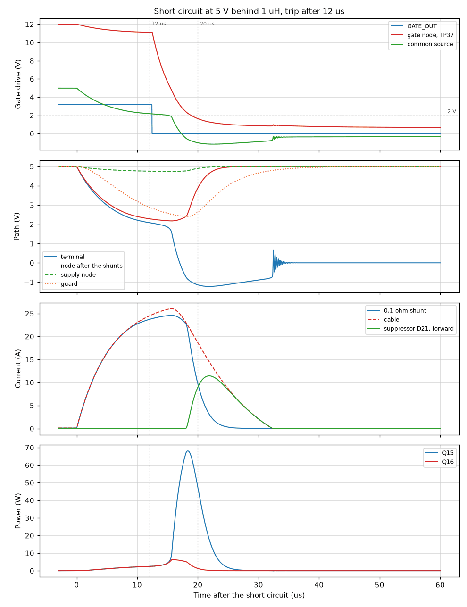

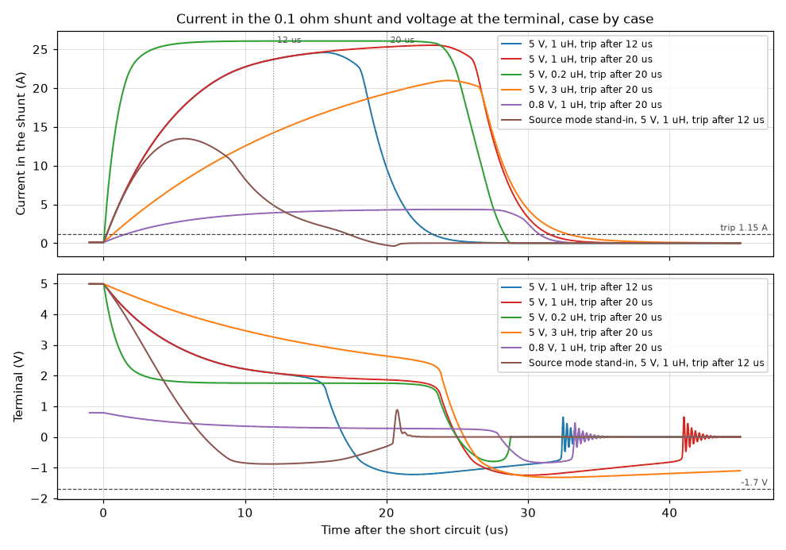

Notes:

- The stiff source is an ideal source behind 10 mohm: the ampere mode on a
  supply without lead inductance, which is the largest current the path can see.
  The inductance of supply leads is left out here: at a trip it lifts the supply
  node, which the ampere pair and the suppressor of the VIN terminal bound, and
  those belong to the path switching block.
- The source mode stand-in is a current source that limits at 1.4 A on C53 and
  C54 of the schematic, with C53 at the 13.6 uF that the specification gives for
  5 V, and 10 mohm for the source pair. The regulator itself belongs to the
  source meter block.
- The cable has 50 mohm and the short circuit 10 mohm; both are assumptions, and
  the largest current follows them directly. With them the shunt carries up to
  26 A, inside the 27 A of the specification. A short circuit across the
  terminals themselves (5 mohm, 50 nH) gives 32 A on this stiff source: the 27 A
  are not a bound of the circuit. The energy in the shunt stays at 2.6 mJ, far
  below the 200 mJ on which the specification accepts the pulse.
- The source mode stand-in has no diode from ground to the regulator output (D12
  of the source meter sheet). Its output capacitors ring against the cable and
  take the supply node and the node after the shunts below ground, to -0.85 V,
  within 8 us of the short circuit and before the trip acts. On the board D12
  has to carry that current.
- The suppressor carries up to 14 A forward (17 A with the model of its
  manufacturer), more than the 11.6 A of section 4.9 and well inside its rating
  of 50 A.
- Q15 takes up to 70 W for about 5 us at 6.4 V or less. The safe operating area
  of its datasheet (figure 10) allows more than 100 A at that voltage for 10 us.
- The trip is the model of rule F-18 behind ideal comparators with 0.2 us of
  delay. No program of the controller exists yet.
- Every run starts with all voltages at zero and its sources rising in 20 us; a
  switch ties the gate node to 12 V until 60 us, and the short circuit closes at
  200 us.
- The forward curve of the suppressor is an assumption (0.75 V at 0.1 A; 0.03
  ohm, and 0.15 ohm in one case); its datasheet has none. The lowest voltage of
  the terminal follows that assumption.
- The ladder clamp conducts while the shunt drops more than about 2.5 V, so the
  cable carries more than the shunt; the clamp belongs to the ladder block.
- Typical transistors at 25 C; nothing here is thermal.

Models. written here: BAV199, CSD17577Q3A, IRLML0030, IRLML0030_CLAMP, MUX509,
OPA197, OUTPUT_PTVS15V, TC4427CH.

Decks: [short-circuit.far.cir](short-circuit.far.cir),
[short-circuit.nominal.cir](short-circuit.nominal.cir).

## `output_stage/terminal`

**The output terminal under abuse: reversed source, live source on the open
output, charged capacitor on a lower output.**

Three things that a user can do to the terminal are simulated. With the output
off, a reversed source draws a current out of the terminal that rises to 2 A:
the suppressor carries it forward, and the run shows the voltage it leaves at
the terminal and whether the open pair begins to conduct from the side of the
instrument. With the output off, a live source of 5 V and of 15 V is connected
through a short lead, and one of 24 V behind 1 ohm: the run shows the voltage at
the terminal, across the transistor on the terminal side and between gate and
source of the pair, which has to stay off. The source of 5 V is connected once
more to an instrument without supply. With the output on at 0.8 V, a capacitor
of 100 uF charged to 5.5 V is plugged in: the current runs backward through the
pair and the ladder, in range 3, in range 0, and with a source that cannot take
current back.

Answers: section 4.9 (VOUT, D-70, D-71; source output, D-57), section 4.3
(charged device).

| Figure | Simulated | Vendor models | Specification | Limits | Verdict | Source |
| --- | --- | --- | --- | --- | --- | --- |
| Output off: terminal with 0.5 A drawn by a reversed source | -808.1 mV | -839.2 mV | -800 mV (-1.02 %) | -900 mV to -700 mV | pass | section 4.9: -0.8 V from a source limited to 0.5 A; limit set here, 0.1 V around it |
| Output off: power in the suppressor D21 at 0.5 A | 404.1 mW | 419.6 mW | | | | |
| Output off: current through Q15 from the instrument at 0.5 A | 192.2 nA | | | | | |
| Output off: terminal with 2 A drawn by a reversed source | -892.6 mV | -897.2 mV | | | | |
| Output off: current through Q15 from the instrument at 2 A | 797 nA | | | | | |
| Output off, suppressor with 0.15 ohm: terminal with 0.5 A drawn by a reversed source | -868 mV | | | | | |
| Output off, suppressor with 0.15 ohm: power in the suppressor D21 at 0.5 A | 434 mW | | | | | |
| Output off, suppressor with 0.15 ohm: current through Q15 from the instrument at 0.5 A | 321.5 nA | | | | | |
| Output off, suppressor with 0.15 ohm: terminal with 2 A drawn by a reversed source | -1.132 V | | | | | |
| Output off, suppressor with 0.15 ohm: current through Q15 from the instrument at 2 A | 5.559 µA | | | | | |
| Output off, 5 V connected: highest voltage at the terminal | 10.57 V | 10.61 V | | | | |
| Output off, 5 V connected: largest drain-source voltage of Q16 | 8.415 V | 8.845 V | | at most 30 V | pass | section 4.9: the transistors are rated 30 V (datasheet value) |
| Output off, 5 V connected: largest gate-source voltage of the pair | -104.9 mV | -134.2 mV | | at most 1.1 V | pass | the pair stays off: lowest threshold 1.1 V (TI SLPS515A, page 3) |
| Output off, 5 V connected: largest move of the node after the shunts | 4.206 mV | 3.266 mV | | | | |
| Output off, 15 V connected: highest voltage at the terminal | 18.1 V | 17.78 V | | | | |
| Output off, 15 V connected: largest drain-source voltage of Q16 | 15.84 V | 16.2 V | | at most 30 V | pass | section 4.9: the transistors are rated 30 V (datasheet value) |
| Output off, 15 V connected: largest gate-source voltage of the pair | -104.9 mV | -134.2 mV | | at most 1.1 V | pass | the pair stays off: lowest threshold 1.1 V (TI SLPS515A, page 3) |
| Output off, 15 V connected: largest move of the node after the shunts | 12.4 mV | 9.231 mV | | | | |
| Output off, 24 V behind 1 ohm: highest voltage at the terminal | 19.4 V | 17.91 V | | | | |
| Output off, 24 V behind 1 ohm: largest drain-source voltage of Q16 | 17.38 V | 16.42 V | | at most 30 V | pass | section 4.9: the transistors are rated 30 V (datasheet value) |
| Output off, 24 V behind 1 ohm: largest gate-source voltage of the pair | -104.9 mV | -134.2 mV | | at most 1.1 V | pass | the pair stays off: lowest threshold 1.1 V (TI SLPS515A, page 3) |
| Output off, 24 V behind 1 ohm: largest move of the node after the shunts | 17.36 mV | 13.36 mV | | | | |
| Output off, 24 V behind 1 ohm: current in the suppressor D21 | 4.6 A | 6.092 A | | | | |
| Output off, 24 V behind 1 ohm: power in the suppressor D21 | 89.24 W | 109.1 W | | at most 400 W | pass | Nexperia PTVSxS1UR, page 3: 400 W for a pulse of a millisecond |
| Instrument without supply, 5 V connected: highest voltage at the terminal | 11.4 V | 11.38 V | | | | |
| Instrument without supply, 5 V connected: largest drain-source voltage of Q16 | 10.87 V | 10.81 V | | at most 30 V | pass | section 4.9: the transistors are rated 30 V (datasheet value) |
| Instrument without supply, 5 V connected: largest gate-source voltage of the pair | 479.4 mV | 446.8 mV | | at most 1.1 V | pass | the pair stays off: lowest threshold 1.1 V (TI SLPS515A, page 3) |
| Instrument without supply, 5 V connected: largest move of the node after the shunts | 37.55 mV | 31.13 mV | | | | |
| Instrument without supply, 5 V connected: highest voltage of the gate node, TP37 | 180.1 mV | 168.1 mV | | at most 300 mV | pass | section 16: every gate at or below 0.3 V with 5 V on VOUT and the instrument off |
| Range 3, source that cannot sink: largest current backward through the pair | 22.04 A | 21.76 A | | at most 239 A | pass | TI SLPS515A, page 1: pulsed drain current 239 A |
| Range 3, source that cannot sink: time for which more than 1 A flows backward | 8.56 µs | 8.787 µs | | | | |
| Range 3, source that cannot sink: energy in the pair | 13.28 µJ | 16.8 µJ | | at most 39 mJ | pass | TI SLPS515A, page 1: 39 mJ of avalanche energy, taken as the scale |
| Range 3, source that cannot sink: highest voltage at the node after the shunts | 5.002 V | 4.969 V | | | | |
| Range 3, source that cannot sink: supply node 100 us after the plug | 4.475 V | 4.475 V | | | | |
| Range 3, source that cannot sink: lowest gate-source voltage of the pair | 8.035 V | 8.022 V | | | | |
| Range 0, source that cannot sink: largest current backward through the pair | 21.74 A | 21.46 A | | at most 239 A | pass | TI SLPS515A, page 1: pulsed drain current 239 A |
| Range 0, source that cannot sink: time for which more than 1 A flows backward | 7.24 µs | 7.311 µs | | | | |
| Range 0, source that cannot sink: energy in the pair | 12.81 µJ | 16.2 µJ | | at most 39 mJ | pass | TI SLPS515A, page 1: 39 mJ of avalanche energy, taken as the scale |
| Range 0, source that cannot sink: highest voltage at the node after the shunts | 5.106 V | 5.078 V | | | | |
| Range 0, source that cannot sink: supply node 100 us after the plug | 4.233 V | 4.211 V | | | | |
| Range 0, source that cannot sink: lowest gate-source voltage of the pair | 7.941 V | 7.932 V | | | | |
| Range 3, stiff source: largest current backward through the pair | 30.94 A | 30.39 A | | at most 239 A | pass | TI SLPS515A, page 1: pulsed drain current 239 A |
| Range 3, stiff source: time for which more than 1 A flows backward | 52.22 µs | 53.02 µs | | | | |
| Range 3, stiff source: energy in the pair | 66.57 µJ | 84.93 µJ | | at most 39 mJ | pass | TI SLPS515A, page 1: 39 mJ of avalanche energy, taken as the scale |
| Range 3, stiff source: highest voltage at the node after the shunts | 2.084 V | 2.074 V | | | | |
| Range 3, stiff source: supply node 100 us after the plug | 800.7 mV | 800.8 mV | | | | |
| Range 3, stiff source: lowest gate-source voltage of the pair | 10.24 V | 10.2 V | | | | |

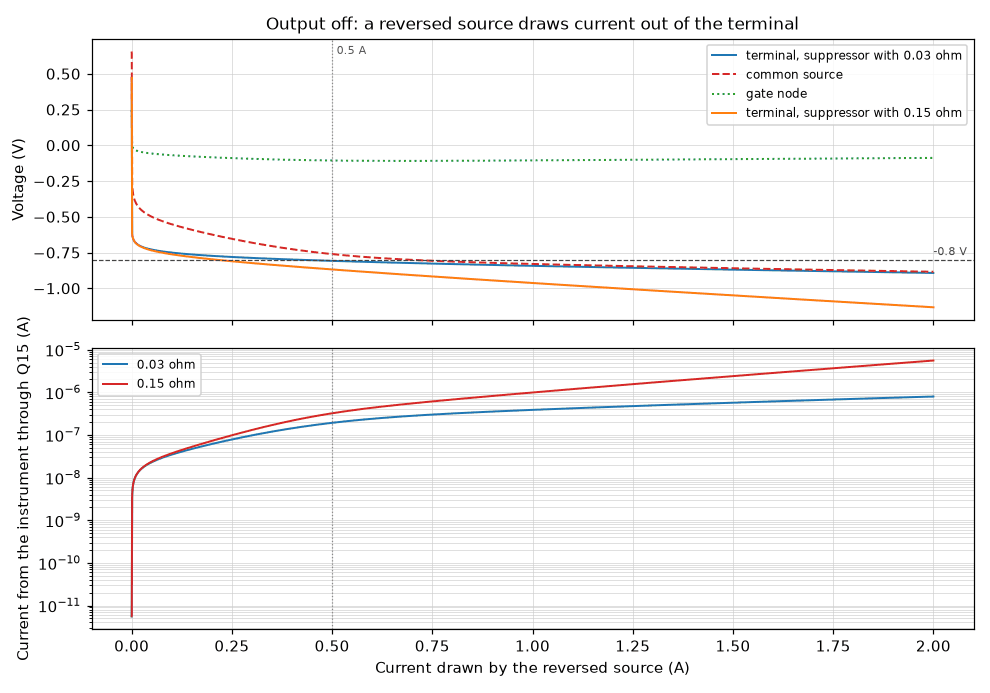

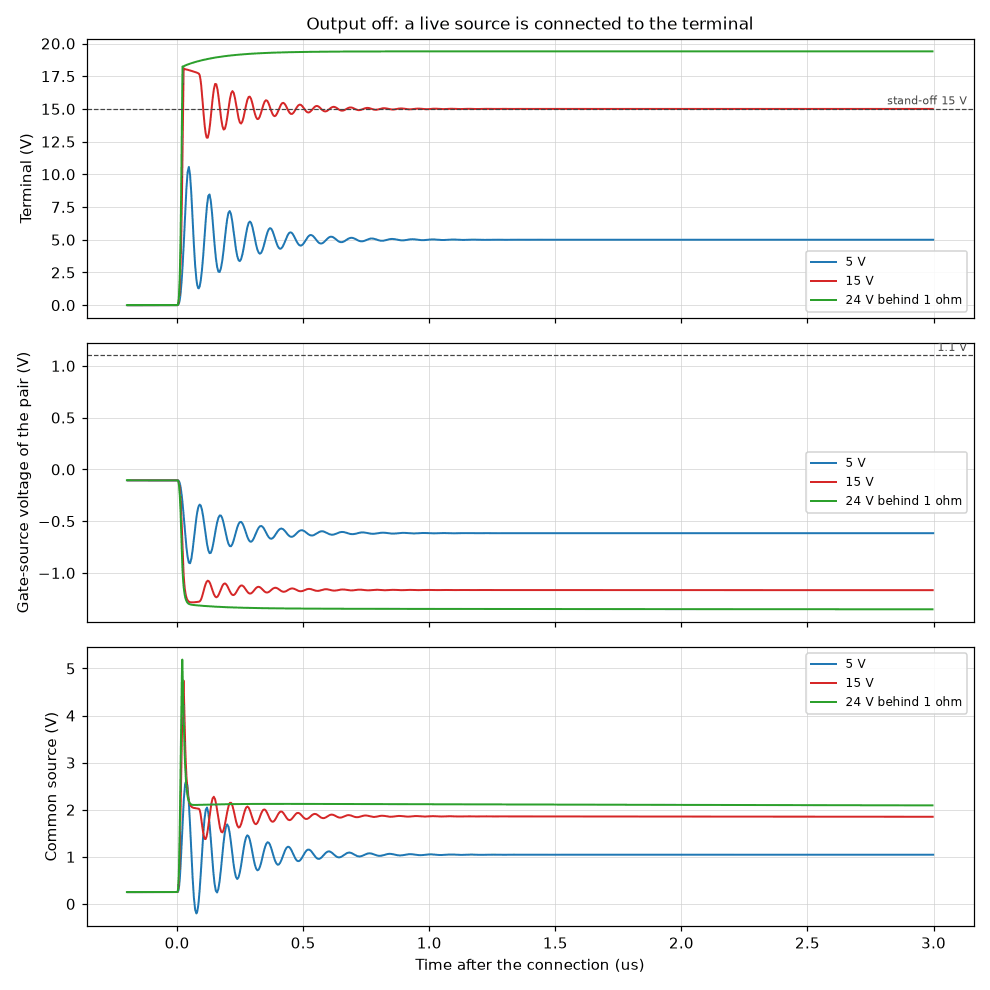

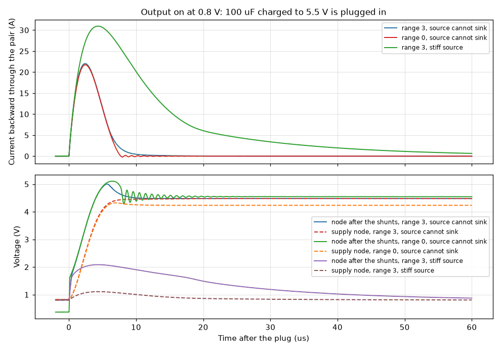

Notes:

- The forward curve of the suppressor is an assumption (0.75 V at 0.1 A, 0.03
  ohm, and 0.15 ohm in a second run); its datasheet has none. With it the
  terminal stands at -0.8 V with 0.5 A, which is 0.4 W in the suppressor: about
  50 K to 90 K of rise by the thermal resistance of its datasheet (130 K/W on 1
  cm2 of copper, 220 K/W on the standard footprint). That is why the reversed
  source has to be limited.
- With the output off the gate node rests at 0 V and the common source follows
  the terminal one body diode above it. The current that the open pair passes
  from the instrument is taken from the transistor model below its threshold; it
  shows that the pair stays off, and no value of nanoamperes may be taken from
  it.
- A live source on the open output lifts the gates through the drain of Q16. C74
  and the 10 ohm of R120 hold them; the figure is the gate-source voltage
  against the lowest threshold of the datasheet.
- Without supply every rail and line is at 0 V and the gate driver U22 is left
  out of the circuit, so that R115 alone holds the gate network: what the output
  of the unpowered driver does is in no datasheet and is an open check of
  section 16.
- The live source is ideal behind 50 mohm and 0.2 uH (1 ohm for the 24 V case);
  the terminal rings against that inductance, and the suppressor bounds the ring
  from 16.7 V to 18.5 V.
- The source that cannot sink is a current source limited to 1.4 A on C53 and
  C54 of the schematic, with 10 mohm for the source pair. On the board the
  regulator and its diode D11 see this event too; they belong to the source
  meter block. The stiff source is ideal behind 10 mohm and takes current back,
  as an external supply in ampere mode may.
- The plugged capacitor has 20 mohm in series, behind 50 mohm and 0.2 uH of
  cable; these are assumptions. In range 0 the current passes the body diodes of
  the ladder clamp, which belong to the ladder block.

Models. written here: BAV199, CSD17577Q3A, IRLML0030, IRLML0030_CLAMP, MUX509,
OPA197, OUTPUT_PTVS15V, TC4427CH.

Decks: [terminal.charged-3.cir](terminal.charged-3.cir),
[terminal.hot-15.cir](terminal.hot-15.cir),
[terminal.reverse.cir](terminal.reverse.cir).

## `output_stage/turn-off`

**The output switch opens under load: gate, current, terminal and suppressor.**

The output is switched off while 1 A flows into a resistor, in range 3. The gate
is discharged through one diode of D20 and R116 into the gate driver. The run is
repeated with inductance in the cable to the device, with a capacitor at the
device and inductance in supply leads, at 0.8 V, in the corner in which the gate
falls latest (R116 and C74 at their upper limits, D20 with the highest forward
voltage, transistors with the lowest threshold), and with the pin of the
controller released by a reset instead of driven low. Each run gives the time to
a gate node below 2 V, the time after which the pair carries less than a tenth
of its current, and what the terminal, the node after the shunts and the
suppressor see. A long run follows the gate after the opening: the level it
rests at, the time constant with which it leaves it, and the current that the
pair still passes into a device that holds the terminal at 0 V.

Answers: section 4.2 (output switch, D-71), section 4.9 (VOUT, D-70), rules F-8,
F-23 and F-36.

| Figure | Simulated | Vendor models | Specification | Limits | Verdict | Source |
| --- | --- | --- | --- | --- | --- | --- |
| 5 V, no inductance: command to the gate node below 2 V | 6.288 µs | 6.115 µs | | at most 7 µs | pass | section 4.2, D-71 and rule F-8: below 2 V within 7 us |
| 5 V, no inductance: command to less than 10 % of the current in the pair | 5.344 µs | 4.986 µs | | | | |
| 5 V, no inductance: lowest voltage at the terminal | -1.699 mV | -524.1 µV | | | | |
| 5 V, no inductance: highest voltage at the node after the shunts | 5 V | 5 V | | at most 11.5 V | pass | section 4.3: the ladder stays below 11.5 V, under +12 V_A |
| 5 V, no inductance: largest forward current in the suppressor D21 | 2.266 mA | 1.25 mA | | at most 50 A | pass | section 4.9: surge rating 50 A (datasheet value) |
| 5 V, 1 uH of cable: command to the gate node below 2 V | 6.282 µs | 6.112 µs | | at most 7 µs | pass | section 4.2, D-71 and rule F-8: below 2 V within 7 us |
| 5 V, 1 uH of cable: command to less than 10 % of the current in the pair | 5.516 µs | 5.155 µs | | | | |
| 5 V, 1 uH of cable: lowest voltage at the terminal | -1.91 mV | -574.1 µV | | | | |
| 5 V, 1 uH of cable: highest voltage at the node after the shunts | 5 V | 5 V | | at most 11.5 V | pass | section 4.3: the ladder stays below 11.5 V, under +12 V_A |
| 5 V, 1 uH of cable: largest forward current in the suppressor D21 | 2.451 mA | 1.314 mA | | at most 50 A | pass | section 4.9: surge rating 50 A (datasheet value) |
| 5 V, 3 uH of cable: command to the gate node below 2 V | 6.258 µs | 6.086 µs | | at most 7 µs | pass | section 4.2, D-71 and rule F-8: below 2 V within 7 us |
| 5 V, 3 uH of cable: command to less than 10 % of the current in the pair | 5.932 µs | 5.569 µs | | | | |
| 5 V, 3 uH of cable: lowest voltage at the terminal | -52.73 mV | -50.99 mV | | | | |
| 5 V, 3 uH of cable: highest voltage at the node after the shunts | 5 V | 5 V | | at most 11.5 V | pass | section 4.3: the ladder stays below 11.5 V, under +12 V_A |
| 5 V, 3 uH of cable: largest forward current in the suppressor D21 | 2.448 mA | 1.32 mA | | at most 50 A | pass | section 4.9: surge rating 50 A (datasheet value) |
| 5 V, 3 uH of cable, 2 uH of supply leads, 10 uF at the device: command to the gate node below 2 V | 6.769 µs | 6.31 µs | | at most 7 µs | pass | section 4.2, D-71 and rule F-8: below 2 V within 7 us |
| 5 V, 3 uH of cable, 2 uH of supply leads, 10 uF at the device: command to less than 10 % of the current in the pair | 3.715 µs | 3.505 µs | | | | |
| 5 V, 3 uH of cable, 2 uH of supply leads, 10 uF at the device: lowest voltage at the terminal | 982.9 mV | 978.7 mV | | | | |
| 5 V, 3 uH of cable, 2 uH of supply leads, 10 uF at the device: highest voltage at the node after the shunts | 5.516 V | 5.515 V | | at most 11.5 V | pass | section 4.3: the ladder stays below 11.5 V, under +12 V_A |
| 5 V, 3 uH of cable, 2 uH of supply leads, 10 uF at the device: largest forward current in the suppressor D21 | 18.58 mA | 19.72 mA | | at most 50 A | pass | section 4.9: surge rating 50 A (datasheet value) |
| 0.8 V, no inductance: command to the gate node below 2 V | 7.448 µs | 7.14 µs | | at most 7 µs | **FAIL** | section 4.2, D-71 and rule F-8: below 2 V within 7 us |
| 0.8 V, no inductance: command to less than 10 % of the current in the pair | 7.278 µs | 6.597 µs | | | | |
| 0.8 V, no inductance: lowest voltage at the terminal | -236.2 µV | -98.08 µV | | | | |
| 0.8 V, no inductance: highest voltage at the node after the shunts | 800 mV | 800 mV | | at most 11.5 V | pass | section 4.3: the ladder stays below 11.5 V, under +12 V_A |
| 0.8 V, no inductance: largest forward current in the suppressor D21 | 580.8 µA | 401.2 µA | | at most 50 A | pass | section 4.9: surge rating 50 A (datasheet value) |
| 0.8 V, 3 uH of cable: command to the gate node below 2 V | 7.274 µs | 6.968 µs | | at most 7 µs | **FAIL** | section 4.2, D-71 and rule F-8: below 2 V within 7 us |
| 0.8 V, 3 uH of cable: command to less than 10 % of the current in the pair | 9.593 µs | 8.819 µs | | | | |
| 0.8 V, 3 uH of cable: lowest voltage at the terminal | -654.7 mV | -744.3 mV | | | | |
| 0.8 V, 3 uH of cable: highest voltage at the node after the shunts | 800 mV | 800 mV | | at most 11.5 V | pass | section 4.3: the ladder stays below 11.5 V, under +12 V_A |
| 0.8 V, 3 uH of cable: largest forward current in the suppressor D21 | 3.835 mA | 18.32 mA | | at most 50 A | pass | section 4.9: surge rating 50 A (datasheet value) |
| 5 V, slow corner: command to the gate node below 2 V | 6.833 µs | 6.661 µs | | at most 7 µs | pass | section 4.2, D-71 and rule F-8: below 2 V within 7 us |
| 5 V, slow corner: command to less than 10 % of the current in the pair | 6.367 µs | 5.364 µs | | | | |
| 5 V, slow corner: lowest voltage at the terminal | 9.157 µV | -313.7 µV | | | | |
| 5 V, slow corner: highest voltage at the node after the shunts | 5 V | 5 V | | at most 11.5 V | pass | section 4.3: the ladder stays below 11.5 V, under +12 V_A |
| 5 V, slow corner: largest forward current in the suppressor D21 | 1.791 mA | 1.148 mA | | at most 50 A | pass | section 4.9: surge rating 50 A (datasheet value) |
| 0.8 V, slow corner: command to the gate node below 2 V | 8.109 µs | 7.733 µs | | at most 7 µs | **FAIL** | section 4.2, D-71 and rule F-8: below 2 V within 7 us |
| 0.8 V, slow corner: command to less than 10 % of the current in the pair | 8.897 µs | 7.1 µs | | | | |
| 0.8 V, slow corner: lowest voltage at the terminal | 850.1 nV | -63.55 µV | | | | |
| 0.8 V, slow corner: highest voltage at the node after the shunts | 800 mV | 800 mV | | at most 11.5 V | pass | section 4.3: the ladder stays below 11.5 V, under +12 V_A |
| 0.8 V, slow corner: largest forward current in the suppressor D21 | 430 µA | 360.3 µA | | at most 50 A | pass | section 4.9: surge rating 50 A (datasheet value) |
| 5 V, pin released by a reset: command to the gate node below 2 V | 6.287 µs | 6.116 µs | | at most 7 µs | pass | section 4.2, D-71 and rule F-8: below 2 V within 7 us |
| 5 V, pin released by a reset: command to less than 10 % of the current in the pair | 5.343 µs | 4.986 µs | | | | |
| 5 V, pin released by a reset: lowest voltage at the terminal | -1.699 mV | -524.1 µV | | | | |
| 5 V, pin released by a reset: highest voltage at the node after the shunts | 5 V | 5 V | | at most 11.5 V | pass | section 4.3: the ladder stays below 11.5 V, under +12 V_A |
| 5 V, pin released by a reset: largest forward current in the suppressor D21 | 2.241 mA | 1.261 mA | | at most 50 A | pass | section 4.9: surge rating 50 A (datasheet value) |
| Largest energy in Q15 during an opening | 5.003 µJ | 4.776 µJ | | at most 39 mJ | pass | TI SLPS515A, page 1: 39 mJ of avalanche energy, taken as the scale |
| Largest energy in Q16 during an opening | 121.4 nJ | 140.4 nJ | | at most 39 mJ | pass | TI SLPS515A, page 1: 39 mJ of avalanche energy, taken as the scale |
| Largest drain-source voltage of Q15 | 5.405 V | 5.448 V | | at most 30 V | pass | section 4.9: the transistors are rated 30 V (datasheet value) |
| Largest drain-source voltage of Q16, either sign | 4.449 V | 4.385 V | | at most 30 V | pass | section 4.9: the transistors are rated 30 V (datasheet value) |
| Largest gate-source voltage of the pair, either sign | 11.32 V | 11.32 V | | at most 20 V | pass | TI SLPS515A, page 1: gate-source voltage 20 V at most |
| Highest voltage at the terminal after an opening | 7.6 V | 7.343 V | | at most 15 V | pass | section 4.9: stand-off voltage of the suppressor D21 |
| Largest distance of the guard from the node after the shunts | 479.2 mV | 479 mV | | | | |
| Gate node 100 us after the command: the diode drop it rests at | 594.2 mV | 588.8 mV | | 300 mV to 900 mV | pass | section 4.2: the gate rests at a diode drop |
| Time constant of the gate node from 10 ms to 60 ms after the command | 28.22 ms | 26.49 ms | 31 ms (-8.95 %) | 26 ms to 36 ms | pass | section 4.2 and rule F-36: 31 ms; limit set here, 15 % around it |
| Gate node 200 ms after the command | 3.56 mV | 3.288 mV | | at most 110 mV | pass | rule F-36: readings 200 ms after GATE_OUT fell; limit set here, a tenth of the lowest threshold of 1.1 V |
| Typical transistors: current through Q15 0.03 ms after the command | 5.559 µA | | | | | |
| Typical transistors: current through Q15 0.1 ms after the command | 1.698 µA | | | | | |
| Typical transistors: current through Q15 1 ms after the command | 179 nA | | | | | |
| Typical transistors: current through Q15 10 ms after the command | 16.85 nA | | | | | |
| Lowest threshold: current through Q15 0.03 ms after the command | 7.83 µA | | | | | |
| Lowest threshold: current through Q15 0.1 ms after the command | 2.116 µA | | | | | |
| Lowest threshold: current through Q15 1 ms after the command | 604.4 nA | | | | | |
| Lowest threshold: current through Q15 10 ms after the command | 115.5 nA | | | | | |

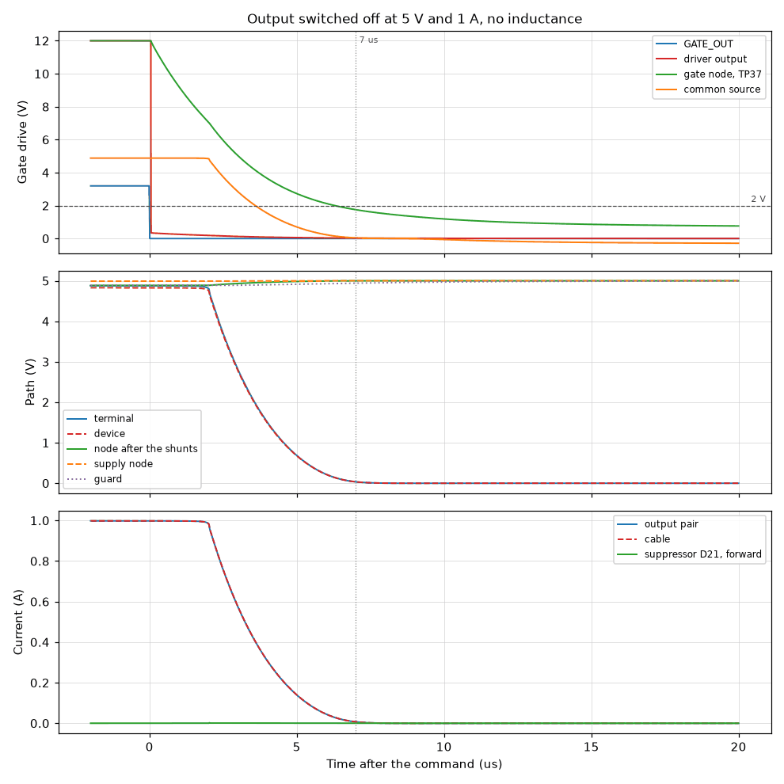

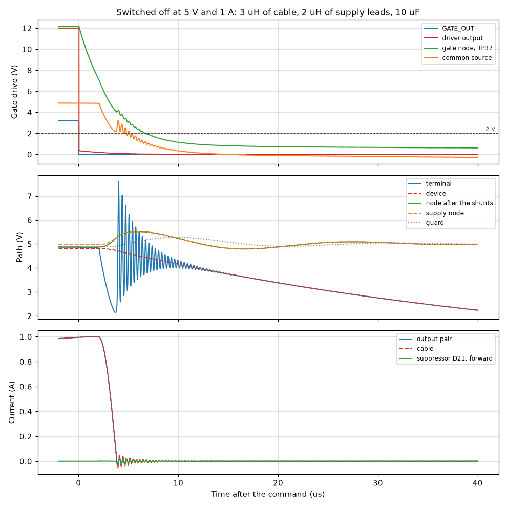

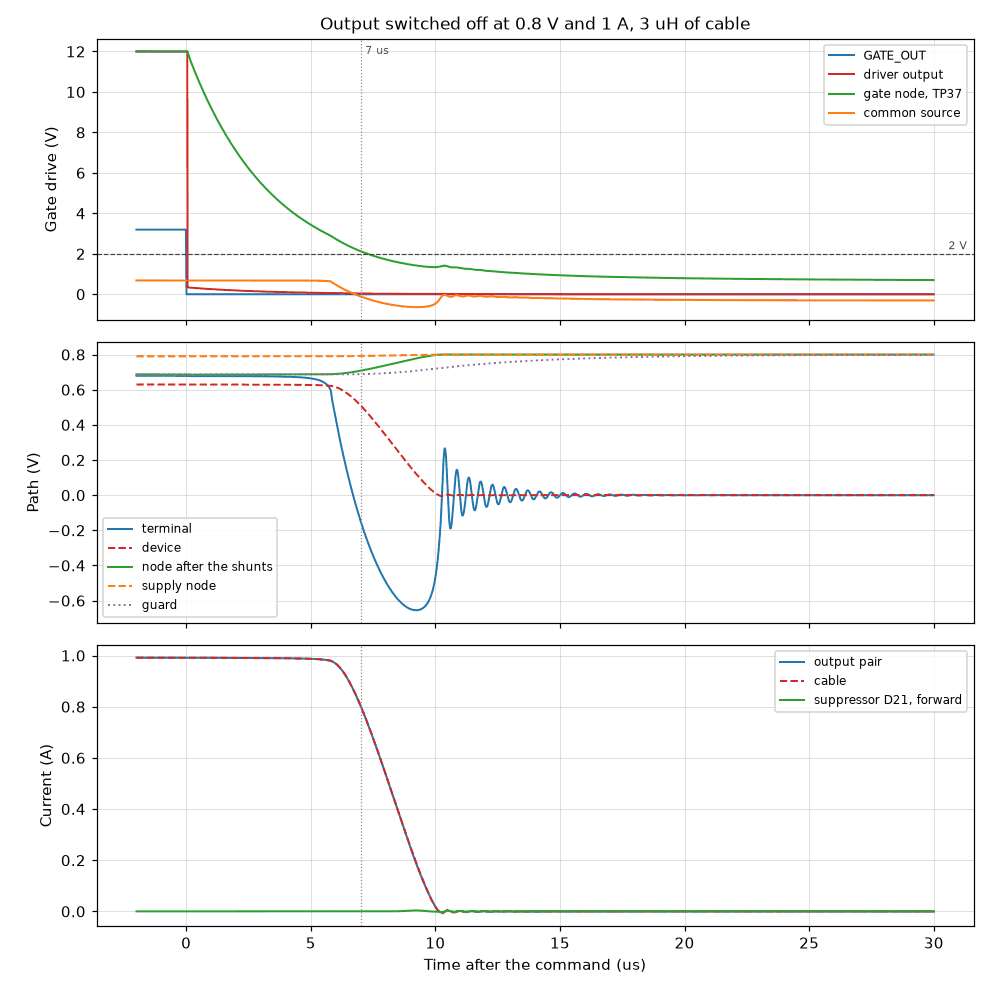

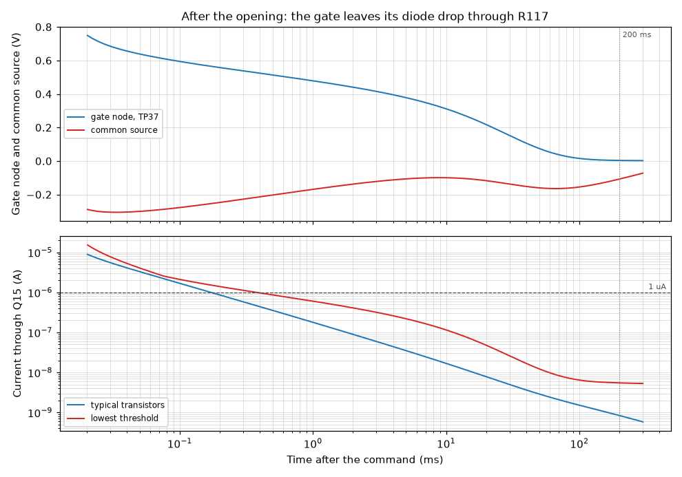

Notes:

- An ideal source behind 10 mohm stands for the source meter and its closed mode
  pair. In the case with supply leads their inductance sits between that source
  and the supply node; the ampere pair and the suppressor of the VIN terminal,
  which bound that node at a trip, belong to the path switching block and are
  not in this circuit.
- Every run starts with all voltages at zero and its sources rising in 20 us. A
  switch ties the gate node to 12 V until 60 us, because through R117 alone the
  gate needs a quarter of a second; the command comes at 200 us.
- The suppressor carries the cable current only while the terminal is below
  ground. With a resistor as device and little inductance the pair itself brings
  the current down as a follower, and the suppressor stays off.
- The forward curve of the suppressor is an assumption (0.75 V at 0.1 A, 0.03
  ohm); its datasheet has none.
- The current that the pair passes after the opening comes from the slope of the
  transistor model below its threshold, which is a fit between 250 uA and
  amperes. The figures show that it is microamperes for milliseconds; no value
  of nanoamperes may be taken from them, and none is quoted at 200 ms.
- With the pin released the line falls through R93 into 20 pF, which is an
  assumption for the pad, the track and the input of the side register.

Models. written here: BAV199, BAV199_HI, CSD17577Q3A, IRLML0030,
IRLML0030_CLAMP, MUX509, OPA197, OUTPUT_CSD17577_LO, OUTPUT_PTVS15V, TC4427CH.

Decks: [turn-off.leads.cir](turn-off.leads.cir),
[turn-off.plain.cir](turn-off.plain.cir),
[turn-off.rest.cir](turn-off.rest.cir).

## `output_stage/turn-on`

**The output switch closes: gate ramp, output ramp and in-rush into a
capacitor.**

The output is switched on into a capacitor that starts empty, behind the ladder
in range 3. The pair closes as a source follower behind R117 and C74, so the
output follows the gate and the capacitor of the device takes a current that the
slope of the gate sets. The capacitance is swept and the largest current in the
0.1 ohm shunt is compared with the over-current level; the sweep is repeated for
the corner in which the in-rush is highest: R117 and C74 at their lower limits,
+12 V_A at the upper end of its window and both transistors at their lowest
threshold. A long run follows the gate to its rest and reads the current that
charges it, which reaches the device without passing the shunts. Two runs with
the model of the sequencer show a start into a short circuit and a start into a
capacitor that is too large.

Answers: section 4.2 (output switch, D-71), section 4.4 (trip at power on),
rules F-19, F-24 and F-36, section 10.6 (dissipation of Q15).

| Figure | Simulated | Vendor models | Specification | Limits | Verdict | Source |
| --- | --- | --- | --- | --- | --- | --- |
| 5 V, 100 uF: command to 10 % of the voltage at the device | 6.458 ms | 6.562 ms | | 6 ms to 7 ms | pass | section 4.2 and rule F-24: starts to rise 6 ms to 7 ms after the request |
| 5 V, 100 uF: command to the first 50 mV at the device | 5.052 ms | 5.04 ms | | | | |
| 0.8 V, 100 uF: command to 10 % of the voltage at the device | 5.381 ms | 5.465 ms | | 6 ms to 7 ms | **FAIL** | section 4.2 and rule F-24: starts to rise 6 ms to 7 ms after the request |
| 0.8 V, 100 uF, fast corner: command to the first 50 mV at the device | 3.888 ms | 4.784 ms | | | | |
| 5 V, 2200 uF, slow corner: command to 10 % of the voltage at the device | 10.03 ms | 8.723 ms | | | | |
| 5 V, 100 uF: largest slope of the output | 420.3 V/s | 410.2 V/s | 440 V/s (-4.47 %) | 396 V/s to 484 V/s | pass | section 4.2: 0.44 V/ms; limit set here, 10 % around it |
| 5 V, 100 uF: slope of the output at 98 % of 5 V | 229.3 V/s | 206.1 V/s | 210 V/s (+9.21 %) | 180 V/s to 240 V/s | pass | section 4.2: 0.21 V/ms near 5 V; limit set here, 15 % around it |
| 5 V, 100 uF: command to 90 % of the voltage at the device | 18.56 ms | 18.77 ms | 20 ms (-7.20 %) | 17 ms to 23 ms | pass | section 4.2 and D-71: about 20 ms; limit set here, 15 % around it |
| 5 V, 2200 uF: command to 90 % of the voltage at the device | 20.52 ms | 20.82 ms | 20 ms (+2.61 %) | 17 ms to 23 ms | pass | section 4.2 and D-71: about 20 ms; limit set here, 15 % around it |
| 5 V, 2200 uF, slow corner: command to 90 % of the voltage at the device | 25.78 ms | 23.69 ms | | at most 50 ms | pass | rule F-24: the output counts as on 50 ms after GATE_OUT |
| 5 V, 1000 uF: largest current in the 0.1 ohm shunt | 400.8 mA | 394.8 mA | 390 mA (+2.77 %) | at most 1.114 A | pass | section 4.2: 0.39 A; limit: lowest trip level, section 4.4 |
| 5 V, 2200 uF: largest current in the 0.1 ohm shunt | 856.1 mA | 850.1 mA | 850 mA (+0.72 %) | at most 1.114 A | pass | section 4.2: 0.85 A; limit: lowest trip level, section 4.4 |
| 5 V, 2200 uF, fast corner: largest current in the 0.1 ohm shunt | 994 mA | 959 mA | | at most 1.114 A | pass | sections 4.2 and 4.4: about 2200 uF starts without a trip |
| 0.8 V, 2200 uF: largest current in the 0.1 ohm shunt | 795.6 mA | 757.6 mA | | at most 1.114 A | pass | lowest trip level, section 4.4 |
| Largest capacitance below the trip level of 1.15 A, nominal parts | 3.003 mF | 3.014 mF | 2.2 mF (+36.49 %) | at least 2.2 mF | pass | sections 4.2 and 4.4, rule F-19: about 2200 uF nominal |
| Largest capacitance below the lowest trip level of 1.114 A, fast corner | 2.481 mF | 2.571 mF | 2.16 mF (+14.85 %) | at least 2.16 mF | pass | sections 4.2 and 11: 1800 uF with a capacitor 20 % high, which is 2160 uF |
| 5 V, 2200 uF: energy in the transistor on the ladder side, Q15 | 25.78 mJ | 25.57 mJ | 25 mJ (+3.11 %) | 20 mJ to 30 mJ | pass | section 10.6: about 25 mJ; limit set here, 20 % around it |
| 5 V, 2200 uF: largest power in Q15 | 3.531 W | 3.514 W | 3.5 W (+0.89 %) | 2.8 W to 4.2 W | pass | section 10.6: about 3.5 W; limit set here, 20 % around it |
| Current into the two gates 30 ms after the command | 544.7 nA | 515.8 nA | 500 nA (+8.95 %) | 250 nA to 1 µA | pass | sections 4.2 and 4.10; limit set here, a factor of two around it |
| Current into the two gates 50 ms after the command | 293.1 nA | 272.3 nA | 300 nA (-2.31 %) | 150 nA to 600 nA | pass | sections 4.2 and 4.10; limit set here, a factor of two around it |
| Current into the two gates 100 ms after the command | 61.82 nA | 56.12 nA | 60 nA (+3.03 %) | 30 nA to 120 nA | pass | sections 4.2 and 4.10; limit set here, a factor of two around it |
| Current into the two gates 200 ms after the command | 2.748 nA | 2.483 nA | 4 nA (-31.29 %) | 2 nA to 8 nA | pass | sections 4.2 and 4.10; limit set here, a factor of two around it |
| Current into the two gates 300 ms after the command | 122.1 pA | 172.7 pA | | at most 1.9 nA | pass | rule F-36: zero with the output on 300 ms after GATE_OUT; one code of range 0 is 1.9 nA (section 4.3) |
| Start into a short circuit: the trip is latched at the end of the run (1 is yes) | 1 | 1 | | at least 0.5 | pass | rules F-18 and F-19 |
| Start into a short circuit: command to the trip | 6.792 ms | 6.899 ms | | | | |
| Start into a short circuit: largest current in the 0.1 ohm shunt | 1.17 A | 1.172 A | | | | |
| Start into a short circuit: energy in Q15 | 2.932 mJ | 2.73 mJ | | at most 39 mJ | pass | TI SLPS515A, page 1: 39 mJ of avalanche energy, taken as the scale |
| Start into a short circuit: current in the shunt 1 ms after the trip | 174.8 nA | 166.6 nA | | at most 1 mA | pass | rule F-19: GATE_OUT stays low after a trip |
| Start into 4700 uF: the trip is latched at the end of the run (1 is yes) | 1 | 1 | | at least 0.5 | pass | rules F-18 and F-19 |
| Start into 4700 uF: command to the trip | 7.299 ms | 7.381 ms | | | | |
| Start into 4700 uF: largest current in the 0.1 ohm shunt | 1.157 A | 1.159 A | | | | |
| Start into 4700 uF: energy in Q15 | 4.579 mJ | 4.255 mJ | | at most 39 mJ | pass | TI SLPS515A, page 1: 39 mJ of avalanche energy, taken as the scale |
| Start into 4700 uF: current in the shunt 1 ms after the trip | 172.4 nA | 161.1 nA | | at most 1 mA | pass | rule F-19: GATE_OUT stays low after a trip |

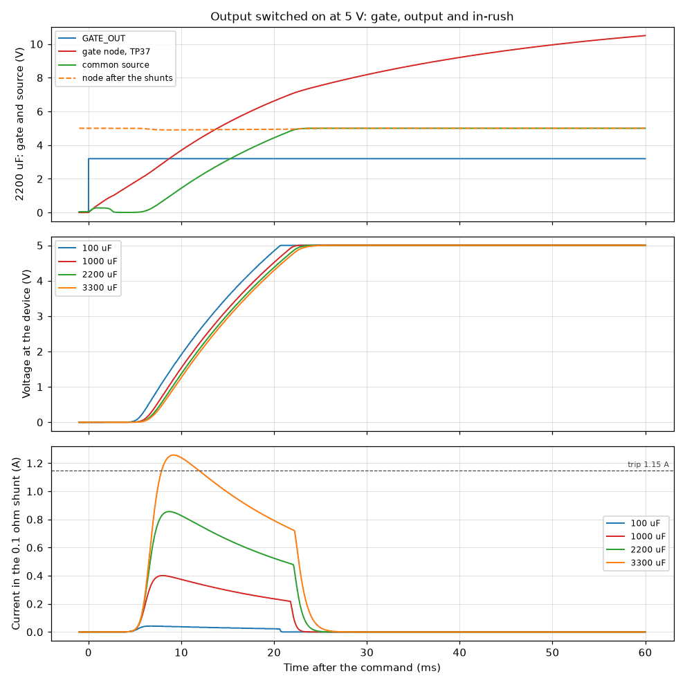

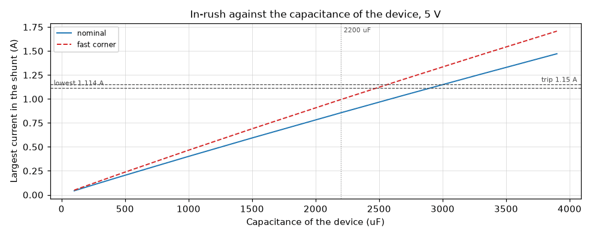

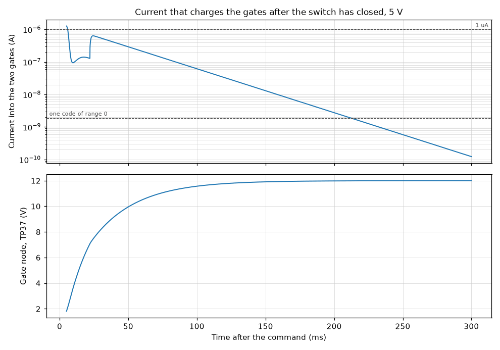

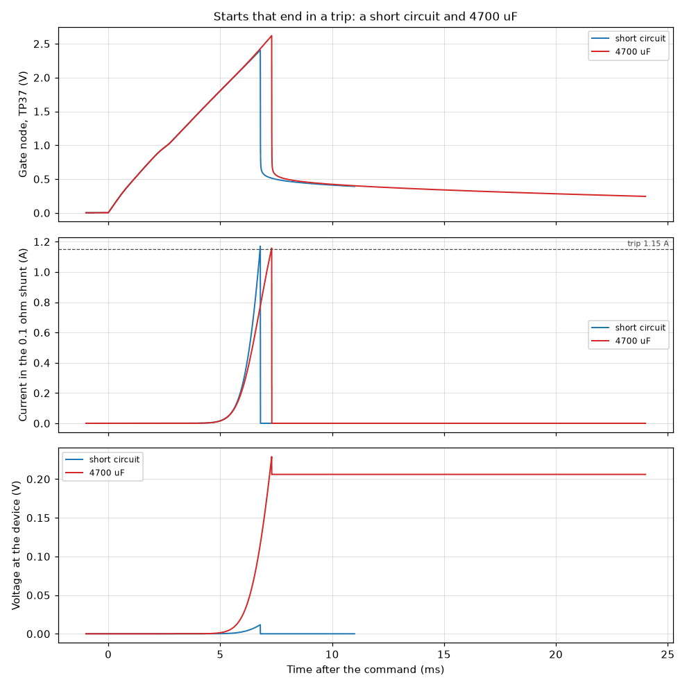

Notes:

- An ideal source behind 10 mohm stands for the source meter and its closed mode
  pair, which belong to other blocks. The device under test is a capacitor with
  20 mohm in series and 1 Mohm beside it, behind a cable of 50 mohm; these three
  values are assumptions.
- The fast corner: R117 at -1 %, C74 at -5 % (its value string gives no
  tolerance; 5 % is the grade of its part number), +12 V_A at 12.6 V, both
  transistors with the threshold at the lower limit of the datasheet. The slow
  corner is the opposite. In the vendor tier the transistors stay typical in
  both corners.
- Every run starts with all voltages at zero and its sources rising in 200 us;
  the command comes 100 ms later, when the charge that this rise leaves on the
  gate node has gone. On the board the mode pair closes 40 ms before the command
  (rule F-24), which leaves a quarter of that charge and moves the start by less
  than 0.1 ms.
- The specification gives 6 ms to 7 ms from the command to the rise of the
  output. That holds at 5 V with a small capacitor and typical parts. The time
  follows the output voltage, the capacitance and the threshold of the
  transistors: 3.9 ms to the first 50 mV at 0.8 V in the fast corner, 10 ms to
  10 % at 5 V with 2200 uF in the slow corner.
- The in-rush is the slope of the gate times the capacitance, so it does not
  depend on the output voltage; the time to the first rise does, because the
  gate has less way to go at 0.8 V.
- With nominal parts 3000 uF stay below the trip level of 1.15 A, and 2480 uF
  stay below its lowest value in the fast corner. The 2200 uF and the 1800 uF
  with a capacitor 20 % high of the specification are inside that.
- The current into the gates is the current in R120. It reaches the device
  through the gate capacitances and is not measured by the shunts.
- The two starts with a trip use the model of the sequencer with ideal
  comparators on the shunt voltage, 0.2 us of delay and 12 us of qualification,
  and 1 uH in the cable. No program of the controller exists yet.
- The transistors are typical parts at 25 C; nothing here is thermal.

Models. written here: BAV199, CSD17577Q3A, IRLML0030, IRLML0030_CLAMP, MUX509,
OPA197, OUTPUT_CSD17577_HI, OUTPUT_CSD17577_LO, OUTPUT_PTVS15V, TC4427CH.

Decks: [turn-on.5v-2200u.cir](turn-on.5v-2200u.cir),
[turn-on.into-4700u.cir](turn-on.into-4700u.cir),
[turn-on.into-short.cir](turn-on.into-short.cir).
