# Simulation Results: Path Switching

Everything on this page is a simulation result. Nothing here is measured on
hardware. The page is written by `circuit-sim report` from the result files
beside it; do not edit it by hand.

## `path_switching/close`

**A mode pair closes on a live supply: gate ramp and source follower.**

Each mode pair closes on a supply that is already there, at 5 V and at 0.8 V.
The request of the pair goes high with the output pair open and range 3
selected, as rule F-24 orders it. The run shows the gate behind its network, the
common source of the pair, the supply node of the ladder and the current that
the pair takes from the supply while the capacitors of that node charge. The
ampere pair closes on an external supply behind 1 uH of leads, the source pair
on a voltage source that stands for the regulator.

Answers: sections 4.2 and 4.9 (mode switches, D-61), rule F-24, the open check
of section 16.

| Figure | Simulated | Vendor models | Specification | Limits | Verdict | Source |
| --- | --- | --- | --- | --- | --- | --- |
| First step of the gate, ampere pair on 5 V | 714.6 mV | 701 mV | 760 mV (-5.97 %) | at most 1.1 V | pass | sections 4.2 and 4.9: 0.76 V, below the lowest threshold of 1.1 V, calculated |
| Gate at 63 % of its way after, ampere pair on 5 V | 10.41 ms | 10.35 ms | 10.7 ms (-2.68 %) | 9.6 ms to 11.8 ms | pass | sections 4.2 and 4.9: the gate rises with 10.7 ms, calculated; 10 % asked here |
| Supply node at 5 % after, ampere pair on 5 V | 1.244 ms | 1.277 ms | 1 ms (+24.40 %) | | | section 16: conduction after about 1 ms on 5 V |
| Largest slope of the supply node, ampere pair on 5 V | 919.3 V/s | 900.7 V/s | 900 V/s (+2.15 %) | 700 V/s to 1100 V/s | pass | section 4.2: about 0.9 V/ms; 0.7 V/ms to 1.1 V/ms taken as about |
| Supply node at 95 % after, ampere pair on 5 V | 7.566 ms | 7.722 ms | 9 ms (-15.94 %) | | | section 16: 95 % after about 9 ms on 5 V |
| Gate-source voltage 40 ms after the request, share of its final value, ampere pair on 5 V | 96.8 % | 96.83 % | | at least 95 % | pass | rule F-24: the path counts as closed after 40 ms; 95 % asked here |
| Final gate-source voltage, ampere pair on 5 V | 6.655 V | 6.655 V | 6.699 V (-0.66 %) | at least 6.2 V | pass | section 4.9: 95.7 % of the drive, at least 6.2 V |
| Largest current into the pair while it closes, ampere pair on 5 V | 5.38 mA | 5.27 mA | | | | |
| Supply node above its final value at the most, ampere pair on 5 V | 263.1 pV | 206.6 pV | | at most 10 mV | pass | section 4.9: the supply node does not ring, simulated; 10 mV asked here |
| Largest current in the ladder clamp, ampere pair on 5 V | 3.563e-06 fA | 3.563e-06 fA | | at most 1 µA | pass | section 4.9: no current in the ladder clamp, simulated; 1 uA asked here |
| First step of the gate, ampere pair on 0.8 V | 714.3 mV | 699.3 mV | 760 mV (-6.02 %) | at most 1.1 V | pass | sections 4.2 and 4.9: 0.76 V, below the lowest threshold of 1.1 V, calculated |
| Gate at 63 % of its way after, ampere pair on 0.8 V | 10.56 ms | 10.51 ms | 10.7 ms (-1.29 %) | 9.6 ms to 11.8 ms | pass | sections 4.2 and 4.9: the gate rises with 10.7 ms, calculated; 10 % asked here |
| Supply node at 5 % after, ampere pair on 0.8 V | 928.9 µs | 980.7 µs | | | | |
| Largest slope of the supply node, ampere pair on 0.8 V | 914 V/s | 862 V/s | 900 V/s (+1.55 %) | 700 V/s to 1100 V/s | pass | section 4.2: about 0.9 V/ms; 0.7 V/ms to 1.1 V/ms taken as about |
| Supply node at 95 % after, ampere pair on 0.8 V | 1.819 ms | 1.954 ms | | | | |
| Gate-source voltage 40 ms after the request, share of its final value, ampere pair on 0.8 V | 98.01 % | 98.03 % | | at least 95 % | pass | rule F-24: the path counts as closed after 40 ms; 95 % asked here |
| Final gate-source voltage, ampere pair on 0.8 V | 10.67 V | 10.67 V | 10.72 V (-0.43 %) | at least 6.2 V | pass | section 4.9: 95.7 % of the drive, at least 6.2 V |
| Largest current into the pair while it closes, ampere pair on 0.8 V | 5.317 mA | 5.019 mA | | | | |
| Supply node above its final value at the most, ampere pair on 0.8 V | 42.95 pV | 34.09 pV | | at most 10 mV | pass | section 4.9: the supply node does not ring, simulated; 10 mV asked here |
| Largest current in the ladder clamp, ampere pair on 0.8 V | 3.563e-06 fA | 3.563e-06 fA | | at most 1 µA | pass | section 4.9: no current in the ladder clamp, simulated; 1 uA asked here |
| First step of the gate, source pair on 5 V | 713.9 mV | 701.1 mV | 760 mV (-6.07 %) | at most 1.1 V | pass | sections 4.2 and 4.9: 0.76 V, below the lowest threshold of 1.1 V, calculated |
| Gate at 63 % of its way after, source pair on 5 V | 10.42 ms | 10.35 ms | 10.7 ms (-2.66 %) | 9.6 ms to 11.8 ms | pass | sections 4.2 and 4.9: the gate rises with 10.7 ms, calculated; 10 % asked here |
| Supply node at 5 % after, source pair on 5 V | 1.244 ms | 1.277 ms | 1 ms (+24.39 %) | | | section 16: conduction after about 1 ms on 5 V |
| Largest slope of the supply node, source pair on 5 V | 919.3 V/s | 900.7 V/s | 900 V/s (+2.14 %) | 700 V/s to 1100 V/s | pass | section 4.2: about 0.9 V/ms; 0.7 V/ms to 1.1 V/ms taken as about |
| Supply node at 95 % after, source pair on 5 V | 7.566 ms | 7.722 ms | 9 ms (-15.94 %) | | | section 16: 95 % after about 9 ms on 5 V |
| Gate-source voltage 40 ms after the request, share of its final value, source pair on 5 V | 96.81 % | 96.83 % | | at least 95 % | pass | rule F-24: the path counts as closed after 40 ms; 95 % asked here |
| Final gate-source voltage, source pair on 5 V | 6.655 V | 6.655 V | 6.699 V (-0.66 %) | at least 6.2 V | pass | section 4.9: 95.7 % of the drive, at least 6.2 V |
| Largest current into the pair while it closes, source pair on 5 V | 5.649 mA | 5.235 mA | | | | |
| Supply node above its final value at the most, source pair on 5 V | 950.5 nV | 38.71 pV | | at most 10 mV | pass | section 4.9: the supply node does not ring, simulated; 10 mV asked here |
| Largest current in the ladder clamp, source pair on 5 V | 3.563e-06 fA | 3.563e-06 fA | | at most 1 µA | pass | section 4.9: no current in the ladder clamp, simulated; 1 uA asked here |
| First step of the gate, source pair on 0.8 V | 714.4 mV | 699.5 mV | 760 mV (-6.00 %) | at most 1.1 V | pass | sections 4.2 and 4.9: 0.76 V, below the lowest threshold of 1.1 V, calculated |
| Gate at 63 % of its way after, source pair on 0.8 V | 10.56 ms | 10.51 ms | 10.7 ms (-1.29 %) | 9.6 ms to 11.8 ms | pass | sections 4.2 and 4.9: the gate rises with 10.7 ms, calculated; 10 % asked here |
| Supply node at 5 % after, source pair on 0.8 V | 928.7 µs | 980.6 µs | | | | |
| Largest slope of the supply node, source pair on 0.8 V | 914 V/s | 862.1 V/s | 900 V/s (+1.55 %) | 700 V/s to 1100 V/s | pass | section 4.2: about 0.9 V/ms; 0.7 V/ms to 1.1 V/ms taken as about |
| Supply node at 95 % after, source pair on 0.8 V | 1.819 ms | 1.953 ms | | | | |
| Gate-source voltage 40 ms after the request, share of its final value, source pair on 0.8 V | 98.01 % | 98.03 % | | at least 95 % | pass | rule F-24: the path counts as closed after 40 ms; 95 % asked here |
| Final gate-source voltage, source pair on 0.8 V | 10.67 V | 10.67 V | 10.72 V (-0.43 %) | at least 6.2 V | pass | section 4.9: 95.7 % of the drive, at least 6.2 V |
| Largest current into the pair while it closes, source pair on 0.8 V | 5.311 mA | 5.014 mA | | | | |
| Supply node above its final value at the most, source pair on 0.8 V | 33.99 µV | 4.149 pV | | at most 10 mV | pass | section 4.9: the supply node does not ring, simulated; 10 mV asked here |
| Largest current in the ladder clamp, source pair on 0.8 V | 3.563e-06 fA | 3.563e-06 fA | | at most 1 µA | pass | section 4.9: no current in the ladder clamp, simulated; 1 uA asked here |

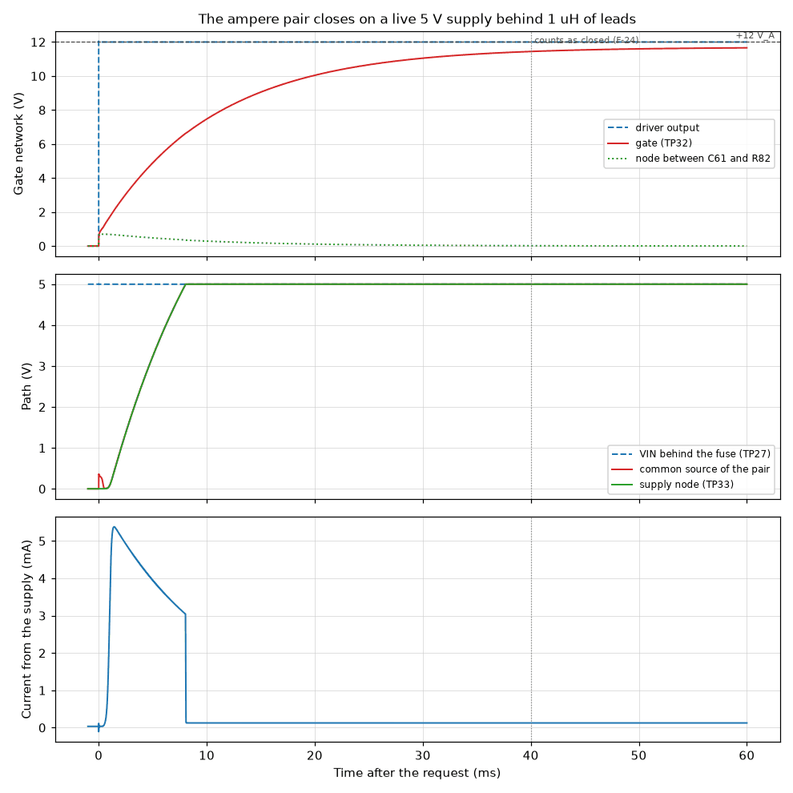

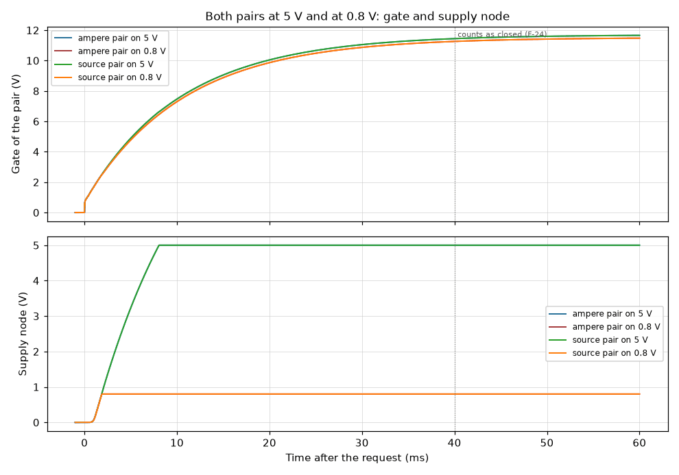

Notes:

- The regulator is a voltage source behind 20 mohm and the external supply a
  voltage source behind 1 uH and 40 mohm of leads: neither sags, and the
  response of the regulator is not in these runs.
- The transistors are the typical model at 25 C and the driver a behavioral
  model; the first step of the gate is taken from the ramp carried back to the
  instant of the request.
- The capacitors have their nominal values: an X7R part of 4.7 uF keeps less
  under bias, which makes the in-rush smaller, not larger.
- The limit of 6.2 V for the gate-source voltage is the figure of the
  specification; at 0.8 V the drive is larger and the limit is not at stake.

Models. written here: BAV199, CSD17577Q3A, IRLML0030, IRLML0030_CLAMP, MCP656X,
MUX509, PATH_BC847B, PATH_BSS138, PATH_FUSE_0466004, PATH_SMAJ20CA, TC4427CH.

Decks: [close.ampere_5v.cir](close.ampere_5v.cir).

## `path_switching/detector`

**The over-voltage detector of VIN: levels with tolerances and reaction time.**

VIN ramps slowly through the two levels of the detector, then steps above them.
The slow ramp, 5 V/s up and down, gives the level at which the output VIN_OV
rises and the one at which it falls. It is run with nominal parts and with four
sets of tolerances: the divider resistors at 0.1 %, the feedback resistor at 1
%, the reference at 0.1 %, the offset of the comparator at 10 mV either way, its
own hysteresis at 1 mV and 5 mV, and the 3.3 V rail, which is the high level of
the output, at 3 %. The steps show how long the detector needs: its input has a
filter of 53 us, so the time depends on how far the step passes the level. The
ampere request is high in the step runs, with nothing connected behind the pair.

Answers: section 4.9 (over-voltage detector, D-60, D-43), requirement R-09,
section 16.

| Figure | Simulated | Vendor models | Specification | Limits | Verdict | Source |
| --- | --- | --- | --- | --- | --- | --- |
| VIN at which the detector output rises, nominal parts | 5.465 V | 5.465 V | 5.46 V (+0.09 %) | 5.41 V to 5.51 V | pass | section 4.9: 5.46 V (5.41 V to 5.51 V), calculated |
| VIN at which the detector output falls, nominal parts | 5.345 V | 5.345 V | 5.35 V (-0.10 %) | 5.3 V to 5.4 V | pass | section 4.9: 5.35 V (5.30 V to 5.40 V), calculated |
| Hysteresis at the terminal, nominal parts | 120.1 mV | 120 mV | 110 mV (+9.19 %) | | | section 4.9: 5.46 V less 5.35 V |
| Highest trip level with the tolerances | 5.501 V | 5.501 V | | at most 5.51 V | pass | section 4.9: 5.51 V at the most |
| Lowest trip level with the tolerances | 5.429 V | 5.429 V | | at least 5.41 V | pass | section 4.9: 5.41 V at the least |
| Highest release level with the tolerances | 5.383 V | 5.383 V | | at most 5.4 V | pass | section 4.9: 5.40 V at the most |
| Lowest release level with the tolerances | 5.306 V | 5.306 V | | at least 5.3 V | pass | section 4.9: 5.30 V at the least |
| Smallest hysteresis at the terminal with the tolerances | 112.1 mV | 111.8 mV | | at least 0 V | pass | limit of this bench: the detector must not chatter |
| Step to 5.6 V: output high after the terminal passes the trip level | 78.23 µs | 81.79 µs | | | | |
| Step to 5.6 V: gate-source voltage of the ampere pair below 1.5 V after | 78.34 µs | 81.81 µs | | 4 µs to 45 µs | **FAIL** | section 4.9: the detector opens the switch 4 us to 45 us after the terminal passes the threshold |
| Step to 6 V: output high after the terminal passes the trip level | 32.99 µs | 34.27 µs | | | | |
| Step to 6 V: gate-source voltage of the ampere pair below 1.5 V after | 33.09 µs | 34.34 µs | | 4 µs to 45 µs | pass | section 4.9: the detector opens the switch 4 us to 45 us after the terminal passes the threshold |
| Step to 8 V: output high after the terminal passes the trip level | 9.368 µs | 9.706 µs | | | | |
| Step to 8 V: gate-source voltage of the ampere pair below 1.5 V after | 9.472 µs | 9.762 µs | | 4 µs to 45 µs | pass | section 4.9: the detector opens the switch 4 us to 45 us after the terminal passes the threshold |
| Step to 12 V: output high after the terminal passes the trip level | 4.155 µs | 4.323 µs | | | | |
| Step to 12 V: gate-source voltage of the ampere pair below 1.5 V after | 4.172 µs | 4.357 µs | | 4 µs to 45 µs | pass | section 4.9: the detector opens the switch 4 us to 45 us after the terminal passes the threshold |
| Step to 20 V: output high after the terminal passes the trip level | 2.156 µs | 2.283 µs | | | | |
| Step to 20 V: gate-source voltage of the ampere pair below 1.5 V after | 2.199 µs | 2.32 µs | | 4 µs to 45 µs | **FAIL** | section 4.9: the detector opens the switch 4 us to 45 us after the terminal passes the threshold |
| Step to 20 V: current of the clamp D15 into 3V3_A at the end | 98.95 µA | 98.95 µA | | at most 170 µA | pass | section 4.9: 0.17 mA at 20 V, calculated, which is the whole current of R73 |
| Step to 20 V: detector input above 3V3_A at the most | 698.5 mV | 698.5 mV | | at most 1 V | pass | rating of the comparator input, supply plus 1.0 V (Microchip DS20002139E, page 3) |

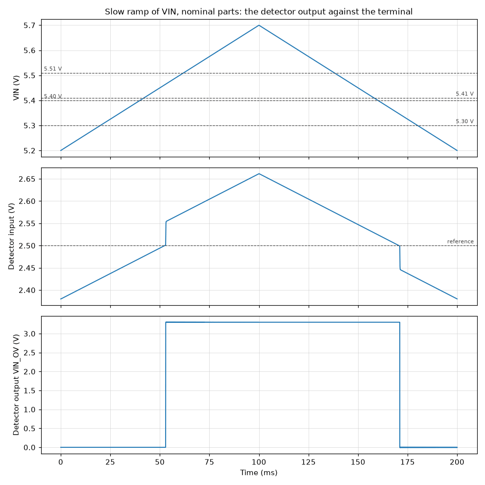

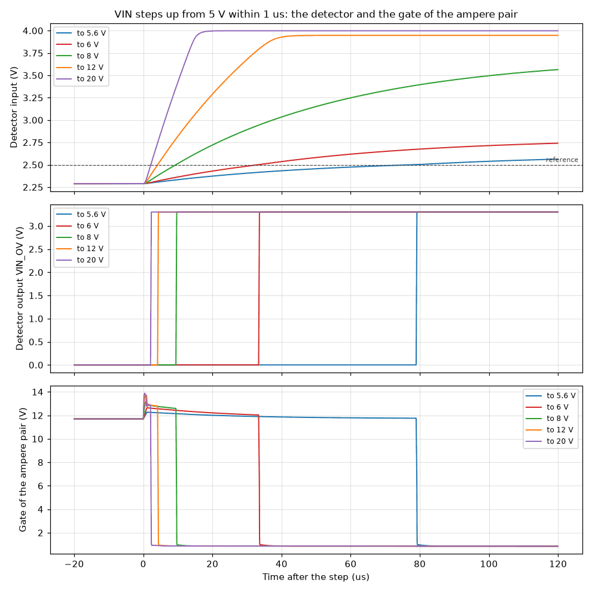

Notes:

- The comparator is a behavioral model with a delay of 47 ns whatever the
  overdrive; its offset and its hysteresis are set to the limits of its
  datasheet in the tolerance runs. Drift with temperature is not in them.
- The tolerance of the 3.3 V rail, 3 %, is an assumption; it moves the release
  level by 3.5 mV. The reference is taken at 0.1 %.
- The reaction time is set by the filter at the detector input (53 us with the
  divider) and by how far the step passes the level. The specification states 4
  us to 45 us without the step it holds for: a step to 5.6 V takes longer, a
  step to 20 V less. The 45 us hold for steps to about 5.8 V or more. Neither
  end is a hazard by itself: the slow case is the one that passes the level by
  little. In these runs nothing is connected behind the pair and the supply has
  no leads; the bench overvoltage shows what reaches a load.
- The clamp current is the current in the diode toward 3V3_A; the rest of the
  0.14 mA that R73 carries at 20 V flows through R74.

Models. written here: BAV199, CSD17577Q3A, MCP656X, PATH_BC847B, PATH_BSS138,
PATH_FUSE_0466004, PATH_SMAJ20CA, TC4427CH.

Decks: [detector.ramp.cir](detector.ramp.cir),
[detector.step-5p6.cir](detector.step-5p6.cir).

## `path_switching/drop`

**The two paths at rest: drop at 1 A, gate drive and current taken from VIN.**

Each mode is held with the output pair closed and the load is stepped to 1 A.
The run gives the voltage from the feeding point, the VIN terminal or the
regulator output, to the output terminal, and the share of each part of the
path: fuse, mode pair, range 3 with its shunt, output pair. It is made with
typical transistors and with every transistor of the path at its largest
on-resistance while +12 V_A stands at its lower limit. The step without load
gives the gate-source voltage of the pair and the current that the instrument
itself takes from the VIN terminal.

Answers: requirement R-06 (D-64), sections 4.9 (gate drive, current of the
terminal) and 11.

| Figure | Simulated | Vendor models | Specification | Limits | Verdict | Source |
| --- | --- | --- | --- | --- | --- | --- |
| Drop at 1 A from the feeding point to the output terminal, parts alone: ampere mode at 5 V | 135.7 mV | 141 mV | | | | |
| The same with the 20 mohm that the specification allows for copper and contacts: ampere mode at 5 V | 155.7 mV | 161 mV | 158 mV (-1.45 %) | at most 200 mV | pass | requirement R-06: 200 mV at 1 A; 158 mV calculated at 50 C |
| Drop of the mode pair at 1 A: ampere mode at 5 V | 8.776 mV | 10.87 mV | | | | |
| Gate-source voltage of the pair without load: ampere mode at 5 V | 6.696 V | 6.696 V | 6.699 V (-0.05 %) | at least 6.2 V | pass | section 4.9: 95.7 % of the drive, at least 6.2 V, calculated |
| Drop of the fuse at 1 A: ampere mode at 5 V | 14 mV | 14 mV | | | | |
| Current the instrument takes from the terminal, pair closed, no load: ampere mode at 5 V | 125.3 µA | 125.3 µA | 125 µA (+0.22 %) | 115 µA to 135 µA | pass | section 4.9: about 125 uA at 5 V, simulated; 8 % asked here |
| Drop at 1 A from the feeding point to the output terminal, parts alone: ampere mode at 5 V, largest on-resistance and +12 V_A at 11.4 V | 141 mV | 141 mV | | | | |
| The same with the 25 mohm that the specification allows for copper and contacts: ampere mode at 5 V, largest on-resistance and +12 V_A at 11.4 V | 166 mV | 166 mV | 181 mV (-8.31 %) | at most 200 mV | pass | requirement R-06: 200 mV at 1 A; 181 mV calculated at 50 C |
| Drop of the mode pair at 1 A: ampere mode at 5 V, largest on-resistance and +12 V_A at 11.4 V | 10.92 mV | 10.92 mV | | | | |
| Gate-source voltage of the pair without load: ampere mode at 5 V, largest on-resistance and +12 V_A at 11.4 V | 6.122 V | 6.122 V | | at least 6.2 V | **FAIL** | section 4.9: 95.7 % of the drive, at least 6.2 V, calculated |
| Drop at 1 A from the feeding point to the output terminal, parts alone: ampere mode at 3.3 V | 134.6 mV | 140.4 mV | | | | |
| The same with the 20 mohm that the specification allows for copper and contacts: ampere mode at 3.3 V | 154.6 mV | 160.4 mV | | at most 200 mV | pass | requirement R-06: 200 mV at 1 A |
| Drop of the mode pair at 1 A: ampere mode at 3.3 V | 8.287 mV | 10.58 mV | | | | |
| Drop of the fuse at 1 A: ampere mode at 3.3 V | 14 mV | 14 mV | | | | |
| Current the instrument takes from the terminal, pair closed, no load: ampere mode at 3.3 V | 78.87 µA | 78.88 µA | | | | |
| Drop at 1 A from the feeding point to the output terminal, parts alone: ampere mode at 0.8 V | 133.7 mV | 139.9 mV | | | | |
| The same with the 20 mohm that the specification allows for copper and contacts: ampere mode at 0.8 V | 153.7 mV | 159.9 mV | | at most 200 mV | pass | requirement R-06: 200 mV at 1 A |
| Drop of the mode pair at 1 A: ampere mode at 0.8 V | 7.911 mV | 10.37 mV | | | | |
| Drop of the fuse at 1 A: ampere mode at 0.8 V | 14 mV | 14 mV | | | | |
| Current the instrument takes from the terminal, pair closed, no load: ampere mode at 0.8 V | 11.33 µA | 11.33 µA | | | | |
| Drop at 1 A from the feeding point to the output terminal, parts alone: source mode at 5 V | 121.7 mV | 127 mV | | | | |
| The same with the 20 mohm that the specification allows for copper and contacts: source mode at 5 V | 141.7 mV | 147 mV | 144 mV (-1.58 %) | at most 200 mV | pass | requirement R-06: 200 mV at 1 A; 144 mV calculated at 50 C |
| Drop of the mode pair at 1 A: source mode at 5 V | 8.782 mV | 10.87 mV | | | | |
| Gate-source voltage of the pair without load: source mode at 5 V | 6.696 V | 6.696 V | 6.699 V (-0.05 %) | at least 6.2 V | pass | section 4.9: 95.7 % of the drive, at least 6.2 V, calculated |
| Drop at 1 A from the feeding point to the output terminal, parts alone: source mode at 5 V, largest on-resistance and +12 V_A at 11.4 V | 127 mV | 127 mV | | | | |
| The same with the 25 mohm that the specification allows for copper and contacts: source mode at 5 V, largest on-resistance and +12 V_A at 11.4 V | 152 mV | 152 mV | 161 mV (-5.60 %) | at most 200 mV | pass | requirement R-06: 200 mV at 1 A; 161 mV calculated at 50 C |
| Drop of the mode pair at 1 A: source mode at 5 V, largest on-resistance and +12 V_A at 11.4 V | 10.93 mV | 10.93 mV | | | | |
| Gate-source voltage of the pair without load: source mode at 5 V, largest on-resistance and +12 V_A at 11.4 V | 6.122 V | 6.122 V | | at least 6.2 V | **FAIL** | section 4.9: 95.7 % of the drive, at least 6.2 V, calculated |
| Drop at 1 A from the feeding point to the output terminal, parts alone: source mode at 0.8 V | 119.7 mV | 125.9 mV | | | | |
| The same with the 20 mohm that the specification allows for copper and contacts: source mode at 0.8 V | 139.7 mV | 145.9 mV | | at most 200 mV | pass | requirement R-06: 200 mV at 1 A |
| Drop of the mode pair at 1 A: source mode at 0.8 V | 7.912 mV | 10.37 mV | | | | |
| Gate-source voltage of the pair without load: ampere mode at 5.4 V | 6.313 V | 6.313 V | | at least 6.2 V | pass | section 4.9: at least 6.2 V of gate-source voltage, calculated |
| Gate-source voltage of the pair without load: ampere mode at 5.4 V, largest on-resistance and +12 V_A at 11.4 V | 5.739 V | 5.739 V | | at least 6.2 V | **FAIL** | section 4.9: at least 6.2 V of gate-source voltage, calculated |
| Share of the 200 mV of requirement R-06 at 1 A, ampere mode at 5 V: fuse F1 | 7.001 % | 7.001 % | | | | |
| Share of the 200 mV of requirement R-06 at 1 A, ampere mode at 5 V: ampere pair Q5, Q9 | 4.388 % | 5.435 % | | | | |
| Share of the 200 mV of requirement R-06 at 1 A, ampere mode at 5 V: range 3: Q14 and the 0.1 ohm shunt | 52.16 % | 52.69 % | | | | |
| Share of the 200 mV of requirement R-06 at 1 A, ampere mode at 5 V: output pair Q15, Q16 | 4.309 % | 5.388 % | | | | |
| Resistance of the two mode pairs in series at 5 V, from their drops at 1 A | 17.56 mΩ | 21.74 mΩ | 17 mΩ (+3.28 %) | | | section 15, D-62: with both pairs on, VIN would be tied to the regulator output through 17 mohm, calculated |
| Copper and contacts that the 200 mV leave in ampere mode, parts at their largest on-resistance | 59.04 mΩ | 59.04 mΩ | 44 mΩ (+34.17 %) | | | section 11: the margin is lost if copper and contacts pass about 44 mohm, calculated at 50 C |
| Voltage at the output terminal with 5.0 V at the VIN terminal and 1 A, parts alone | 4.864 V | 4.859 V | | | | |
| Current the instrument takes from the terminal at 5 V, pair open | 34.95 µA | 34.95 µA | 35 µA (-0.15 %) | 33 µA to 37 µA | pass | section 4.9: 35 uA, calculated; 5 % asked here |

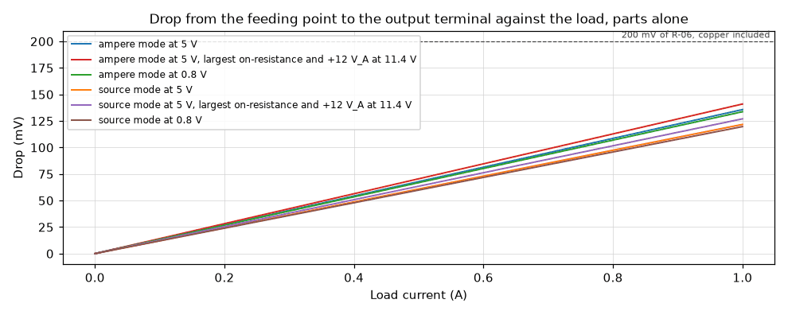

Notes:

- The circuit holds no copper and no contacts: the board is not in the netlist.
  The specification allows 20 mohm to 25 mohm for them, without a source; that
  allowance is added to the simulated drop before it is compared with
  requirement R-06. The layout calculation of the board gives 10.4 mohm and 12.3
  mohm for the copper alone.
- The transistors are typical parts at 25 C, or parts at the largest
  on-resistance of their datasheet at 25 C. The specification calculates with 50
  C, where the on-resistance is about 9 % higher (datasheet curve), and with
  allowances for the fuse that this run does not have: its bounds are 15 mV
  higher than the ones here, and the copper that the budget leaves is 44 mohm in
  its calculation against 59 mohm here. The fuse is its cold resistance of 14
  mohm; its datasheet states no tolerance.
- The range 3 switch, the shunt and the output pair are parts of other sheets,
  taken from the netlist to close the path.
- The detector comparator is left out and its output held low, because a
  comparator with hysteresis has two stable states inside its band. The runs at
  5.4 V stand just below the lowest trip level of 5.41 V: there the pair has the
  least gate drive it can have while it is closed.

Models. written here: BAV199, CSD17577Q3A, IRLML0030, IRLML0030_CLAMP, MUX509,
OUTPUT_PTVS15V, PATH_BC847B, PATH_BSS138, PATH_CSD17577_RMAX, PATH_FUSE_0466004,
PATH_SMAJ20CA, TC4427CH.

Decks: [drop.ampere_5v.cir](drop.ampere_5v.cir).

## `path_switching/hand-over`

**A pair closes while the supply node still holds a higher voltage.**

A mode pair closes on a supply that stands below the voltage left on the node.
With the output open the supply node keeps its voltage for a long time. In the
first run source mode at 5 V ends and, 5 ms later, the ampere pair closes on a
supply of 0.8 V that has 4.7 uF at its output and cannot take current back: the
example of the specification. In the second run the node holds only 0.1 V more
than that supply, which is what rule F-25 allows. The third run is the other
direction, which no rule names: ampere mode at 5 V ends and the source pair
closes on a regulator at 0.8 V that cannot take current back either, with its
output capacitors and its minimum load from the schematic.

Answers: section 4.2 (charge of the supply node), rule F-25, the test of
section 11.

| Figure | Simulated | Vendor models | Specification | Limits | Verdict | Source |
| --- | --- | --- | --- | --- | --- | --- |
| Supply of the user at 0.8 V with 4.7 uF, node at 5 V: highest voltage at the terminal | 3.067 V | 3.065 V | 3.1 V (-1.08 %) | 2.9 V to 3.3 V | pass | section 4.2: 3.1 V on a 0.8 V supply with 4.7 uF, calculated; 0.2 V asked here |
| Time from the ampere request to 90 % of that rise | 4.411 ms | 4.506 ms | | | | |
| Largest current pushed back into the leads | 3.97 mA | 3.871 mA | | | | |
| Node at 0.9 V, supply of the user at 0.8 V: rise of the terminal | 51.13 mV | 50.81 mV | | at most 100 mV | pass | rule F-25 and section 11: the VIN terminal rises by less than 0.1 V |
| Regulator at 0.8 V, node at 5 V: highest voltage at the regulator output | 1.487 V | 1.468 V | | | | no rule of the specification names this direction |
| Time from the source request until the regulator output is within 0.1 V again | 7.057 ms | 7.087 ms | | | | |

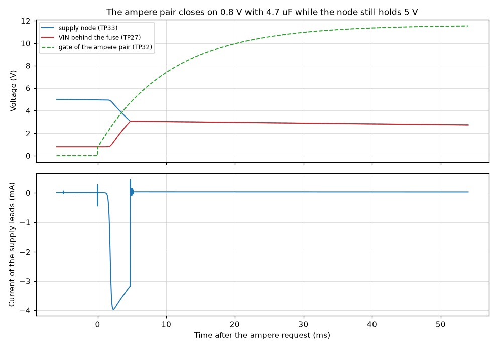

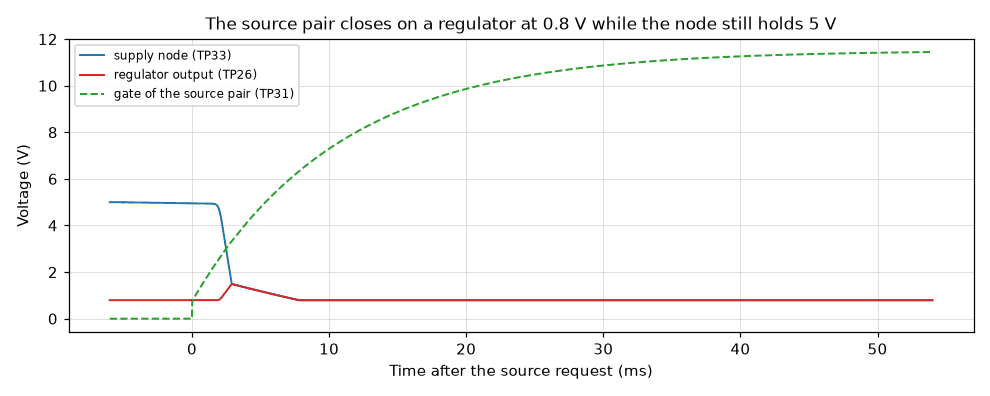

Notes:

- The supply of the user and the regulator are sources that deliver current and
  take none back, which is the case the specification describes. A supply that
  sinks current is not lifted.
- The charge moves at the pace of the gate ramp once the gate has passed the
  lower voltage by a threshold: some milliseconds after the request, with tens
  of milliamperes at the most.
- In the other direction the regulator output is lifted above its set-point
  until its minimum load of 1.3 kohm to -4 V_A has taken the charge away. The
  specification tolerates an output above the set-point (section 4.9, source
  output) and its start sequence checks the output 60 ms after the pair has
  closed; it has no rule like F-25 for the source pair. In the start sequence of
  rule F-28 at least 285 ms pass before the source pair closes, in which the
  node falls to about 60 % of its voltage.

Models. written here: BAV199, CSD17577Q3A, IRLML0030, IRLML0030_CLAMP, MCP656X,
MUX509, PATH_BC847B, PATH_BSS138, PATH_FUSE_0466004, PATH_SMAJ20CA, TC4427CH.

Decks: [hand-over.to-ampere.cir](hand-over.to-ampere.cir),
[hand-over.to-source.cir](hand-over.to-source.cir).

## `path_switching/idle`

**The supply node with every path switch open: idle level and decay.**

Every path switch is open and the supply node rests on its bleed resistor. The
first run opens the source pair on 5 V with the output open and follows the node
for 1.6 s: it falls through R90 alone. The other runs hold every switch open
with 20 V on the VIN terminal, the regulator at its highest output and a device
under test that holds 5 V on the output terminal, and give each blocking
transistor a leakage, stepped up to the 1 uA that its datasheet allows at 24 V.
The leakage is a current source across the transistor, because no transistor
model gives a leakage that can be believed.

Answers: sections 4.2 and 4.3 (idle level, bleed resistor R90, D-63), rule F-25.

| Figure | Simulated | Vendor models | Specification | Limits | Verdict | Source |
| --- | --- | --- | --- | --- | --- | --- |
| Supply node at 37 % of its voltage after the source pair has opened | 580.2 ms | 580.1 ms | 570 ms (+1.78 %) | 540 ms to 600 ms | pass | sections 4.2 and 4.3: 0.57 s, calculated; 5 % asked here |
| Time constant from 80 % to 20 % of the voltage | 580.4 ms | 580.4 ms | 570 ms (+1.83 %) | | | sections 4.2 and 4.3: 0.57 s, calculated |
| Share of its voltage that the node keeps 5 ms after the pair has opened | 99.1 % | 99.1 % | | | | |
| Supply node at idle without leakage | 81.8 µV | 50.63 µV | | -1 mV to 1 mV | pass | section 4.3: the ladder rests at 0 V; within 1 mV asked here |
| Supply node at idle with 1 uA in the blocking transistor of each pair | 209.6 mV | 192.3 mV | | at most 300 mV | pass | section 4.3: below 0.3 V with every blocking MOSFET at its leakage limit, calculated |
| Supply node at idle with 1 uA in the blocking transistor of the ampere pair alone | 82.06 mV | 77.51 mV | | | | |
| Supply node at idle with 1 uA in the blocking transistor of the source pair alone | 82.06 mV | 77.39 mV | | | | |
| Supply node at idle with 1 uA in the blocking transistor of the output pair alone | 99.94 mV | 100 mV | | | | |

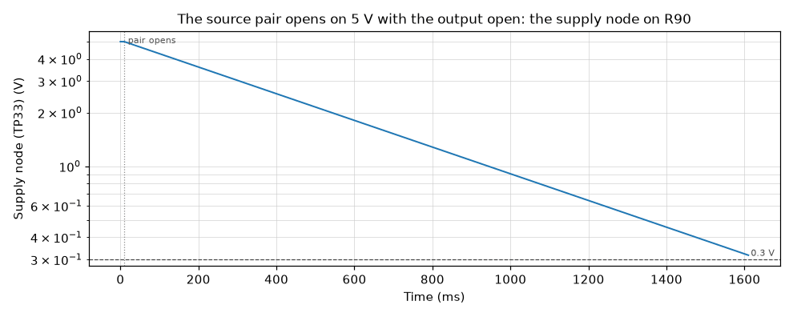

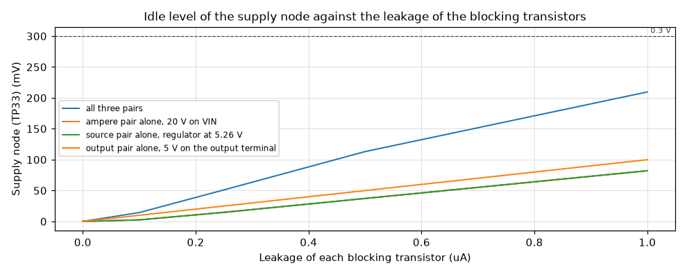

Notes:

- The leakage is not simulated: it is a current source of the datasheet maximum
  across the transistor that faces the outer voltage in each open pair (1 uA at
  24 V and 25 C). The datasheet states no figure at a higher temperature, where
  leakage is larger.
- The current of such a source reaches the common source of its pair and leaves
  it two ways: through the body diode of the second transistor into the supply
  node and R90, or through the diode at the base of the hold-off transistor and
  its 100 kohm. How it divides rests on the forward voltage of two diode models
  at a microampere, which no datasheet states; if all of it reached R90, three
  pairs at 1 uA would give exactly 0.3 V.
- The decay counts what the netlist holds on the node: C62, C63, the 100 nF
  behind the 1 kohm shunt, and R90. Leakage of the capacitors and of the
  amplifier inputs is not in the circuit.

Models. written here: BAV199, CSD17577Q3A, IRLML0030, IRLML0030_CLAMP, MCP656X,
MUX509, OUTPUT_PTVS15V, PATH_BC847B, PATH_BSS138, PATH_FUSE_0466004,
PATH_SMAJ20CA, TC4427CH.

Decks: [idle.decay.cir](idle.decay.cir), [idle.level.cir](idle.level.cir).

## `path_switching/interlock`

**The interlock of the two mode pairs and a change of mode.**

Both supplies are present, at different voltages, and the requests change. The
external supply stands at 5 V and the stand-in for the regulator at 3.3 V, so
that a current between the two would show at once. In the first runs both
requests end high: together from idle, with the interlock transistor at its
highest threshold, and with the source request added while ampere mode runs. In
the others the mode changes in either direction, without dead time and with the
5 ms of rule F-23. A pair counts as conducting above 10 mA. The output pair is
open in every run, as rule F-23 orders it for a change of mode.

Answers: sections 4.2 and 4.9 (interlock, D-62), rule F-23, the open check of
section 16.

| Figure | Simulated | Vendor models | Specification | Limits | Verdict | Source |
| --- | --- | --- | --- | --- | --- | --- |
| Input of the ampere driver at the most, 1 us after the edge: both requests raised together from idle | 11.11 mV | 11.11 mV | | at most 100 mV | pass | section 16: input of the ampere driver below 0.1 V |
| Input of the ampere driver at the most, at the edge: both requests raised together from idle | 207.5 mV | 216.2 mV | | at most 800 mV | pass | the driver reads 0.8 V or less as low (Microchip DS20001422G, page 3) |
| Gate-source voltage of the ampere pair at the most, 10 us after the edge: both requests raised together from idle | -149.1 µV | -1.158 mV | | at most 1.1 V | pass | lowest threshold of the transistors, 1.1 V (TI SLPS515A, page 3) |
| Current at the VIN terminal at the most, 5 ms after the edge: both requests raised together from idle | 35.06 µA | 34.95 µA | | at most 50 µA | pass | section 16: less than 50 uA at the VIN terminal |
| Supply node at the end, which follows the regulator at 3.3 V: both requests raised together from idle | 3.3 V | 3.3 V | | 3.28 V to 3.32 V | pass | section 4.9: with both requests high the source pair is closed; within 20 mV asked here |
| Input of the ampere driver at the most, 1 us after the edge: both requests raised together, interlock transistor with the highest threshold | 13.12 mV | 13.12 mV | | at most 100 mV | pass | section 16: input of the ampere driver below 0.1 V |
| Input of the ampere driver at the most, at the edge: both requests raised together, interlock transistor with the highest threshold | 274 mV | 293.2 mV | | at most 800 mV | pass | the driver reads 0.8 V or less as low (Microchip DS20001422G, page 3) |
| Gate-source voltage of the ampere pair at the most, 10 us after the edge: both requests raised together, interlock transistor with the highest threshold | -149.1 µV | -1.158 mV | | at most 1.1 V | pass | lowest threshold of the transistors, 1.1 V (TI SLPS515A, page 3) |
| Current at the VIN terminal at the most, 5 ms after the edge: both requests raised together, interlock transistor with the highest threshold | 35 µA | 34.95 µA | | at most 50 µA | pass | section 16: less than 50 uA at the VIN terminal |
| Supply node at the end, which follows the regulator at 3.3 V: both requests raised together, interlock transistor with the highest threshold | 3.3 V | 3.3 V | | 3.28 V to 3.32 V | pass | section 4.9: with both requests high the source pair is closed; within 20 mV asked here |
| Input of the ampere driver at the most, 1 us after the edge: ampere mode running, source request added | 11.11 mV | 11.11 mV | | at most 100 mV | pass | section 16: input of the ampere driver below 0.1 V |
| Input of the ampere driver at the most, at the edge: ampere mode running, source request added | 3.395 V | 3.42 V | | | | |
| Gate-source voltage of the ampere pair at the most, 10 us after the edge: ampere mode running, source request added | 645.3 mV | 923.3 mV | | at most 1.1 V | pass | lowest threshold of the transistors, 1.1 V (TI SLPS515A, page 3) |
| Current at the VIN terminal at the most, 5 ms after the edge: ampere mode running, source request added | 35.76 µA | 35.02 µA | | at most 50 µA | pass | section 16: less than 50 uA at the VIN terminal |
| Supply node at the end, which follows the regulator at 3.3 V: ampere mode running, source request added | 3.3 V | 3.3 V | | 3.28 V to 3.32 V | pass | section 4.9: with both requests high the source pair is closed; within 20 mV asked here |
| Time with both pairs conducting: ampere mode running, source request added | 0 s | 0 s | | at most 0 s | pass | section 4.9: no time with both pairs conducting, also with no dead time |
| Old pair below 2 V of gate-source voltage after the edge: ampere mode running, source request added | 137.8 ns | 110.4 ns | | at most 1 µs | pass | section 4.2: a pair opens within 1 us |
| From there to the lowest threshold at the gate of the new pair: ampere mode running, source request added | 4.276 ms | 2.729 ms | | at least 0 s | pass | section 4.2: break-before-make from the slow closing and the fast opening |
| Time with both pairs conducting: ampere to source with no dead time | 0 s | 0 s | | at most 0 s | pass | section 4.9: no time with both pairs conducting, also with no dead time |
| Old pair below 2 V of gate-source voltage after the edge: ampere to source with no dead time | 137.4 ns | 109.8 ns | | at most 1 µs | pass | section 4.2: a pair opens within 1 us |
| From there to the lowest threshold at the gate of the new pair: ampere to source with no dead time | 4.276 ms | 2.729 ms | | at least 0 s | pass | section 4.2: break-before-make from the slow closing and the fast opening |
| Time with both pairs conducting: ampere to source with 5 ms of dead time | 0 s | 0 s | | at most 0 s | pass | section 4.9: no time with both pairs conducting, also with no dead time |
| Old pair below 2 V of gate-source voltage after the edge: ampere to source with 5 ms of dead time | 197.5 ns | 164 ns | | at most 1 µs | pass | section 4.2: a pair opens within 1 us |
| From there to the lowest threshold at the gate of the new pair: ampere to source with 5 ms of dead time | 9.276 ms | 7.724 ms | | at least 0 s | pass | section 4.2: break-before-make from the slow closing and the fast opening |
| Time with both pairs conducting: source to ampere with no dead time | 0 s | 0 s | | at most 0 s | pass | section 4.9: no time with both pairs conducting, also with no dead time |
| Old pair below 2 V of gate-source voltage after the edge: source to ampere with no dead time | 178.2 ns | 146.2 ns | | at most 1 µs | pass | section 4.2: a pair opens within 1 us |
| From there to the lowest threshold at the gate of the new pair: source to ampere with no dead time | 4.235 ms | 2.729 ms | | at least 0 s | pass | section 4.2: break-before-make from the slow closing and the fast opening |
| Time with both pairs conducting: source to ampere with 5 ms of dead time | 0 s | 0 s | | at most 0 s | pass | section 4.9: no time with both pairs conducting, also with no dead time |
| Old pair below 2 V of gate-source voltage after the edge: source to ampere with 5 ms of dead time | 177.9 ns | 146.4 ns | | at most 1 µs | pass | section 4.2: a pair opens within 1 us |
| From there to the lowest threshold at the gate of the new pair: source to ampere with 5 ms of dead time | 9.196 ms | 7.725 ms | | at least 0 s | pass | section 4.2: break-before-make from the slow closing and the fast opening |

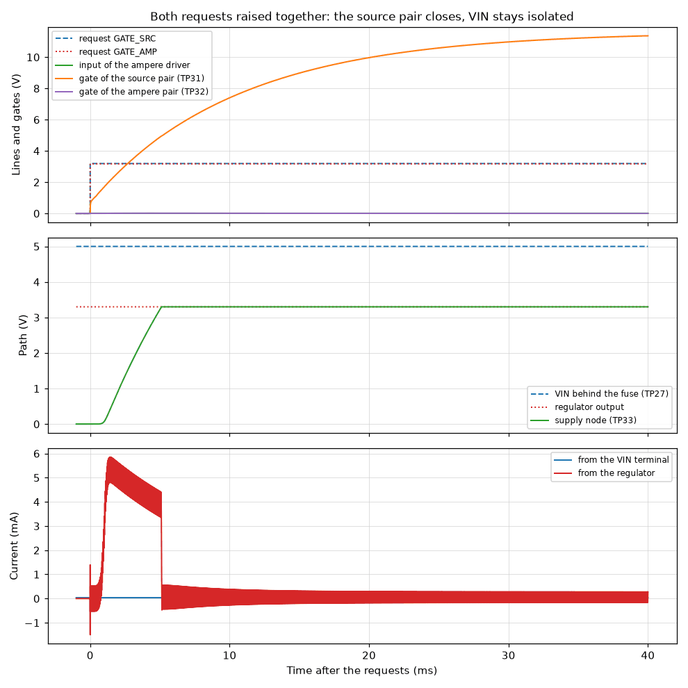

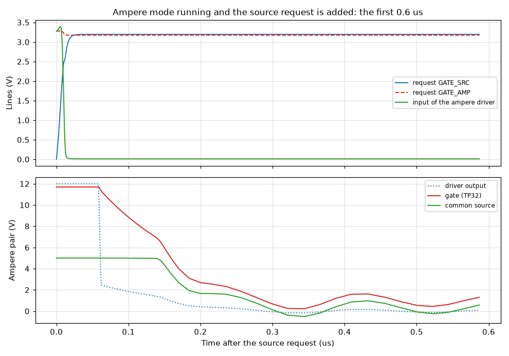

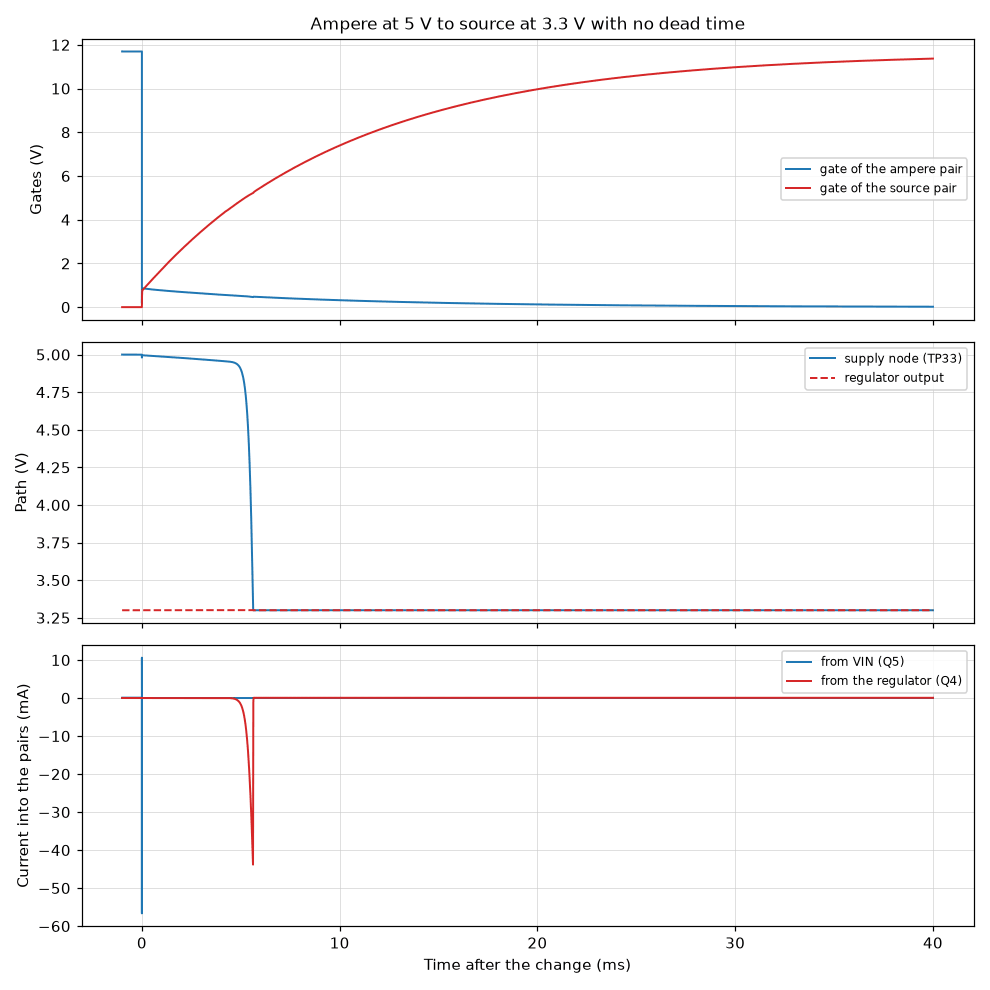

Notes:

- The requests are pins behind 33 ohm with edges of 10 ns that arrive together;
  a request at a level between the logic levels is not covered, as the
  specification says.
- The driver is a behavioral model with a threshold of 1.5 V and no input
  current. The interlock transistors carry the largest capacitances of their
  datasheet, which delays the input of the ampere driver by about 40 ns.
- The regulator is a voltage source that also takes current. After a change to a
  lower voltage the charge of the supply node flows back through the new pair,
  at the pace of its gate ramp: some milliamperes, shown as a negative current.
  What a regulator that cannot take current does with it is the matter of the
  bench hand-over.
- With no dead time the new pair begins to carry current about 4 ms after the
  old pair has opened: its gate has to pass the voltage of its supply first. The
  pair that opened rests near its lowest threshold for about 3 ms (bench open),
  without a path to conduct into.

Models. written here: BAV199, CSD17577Q3A, IRLML0030, IRLML0030_CLAMP, MCP656X,
MUX509, PATH_BC847B, PATH_BSS138, PATH_BSS138_HI, PATH_FUSE_0466004,
PATH_SMAJ20CA, TC4427CH.

Decks: [interlock.both.cir](interlock.both.cir).

## `path_switching/open`

**A mode pair opens under load: time to block and the kick of the supply
leads.**

A closed pair carries a load current and its request goes low. The driver pulls
the gate down through one diode of the pair of diodes and 22 ohm. The run shows
the gate, the current in the transistors and, for the ampere pair, the VIN line:
the current of the supply leads has nowhere to go once the pair blocks, and the
suppressor takes it. The load is a resistor on the node after the shunts, so the
supply node falls after the pair has opened. This is not the order of normal
operation, in which the output pair opens first (rule F-23); it is what the
paths of rules F-7, F-26 and F-27 do. Two corners are run: the slowest opening
that the datasheets of the driver, the diodes and the transistors allow, and the
suppressor at its highest breakdown voltage.

Answers: sections 4.2 and 4.9 (opening through a diode, D-61), rule F-23.

| Figure | Simulated | Vendor models | Specification | Limits | Verdict | Source |
| --- | --- | --- | --- | --- | --- | --- |
| Current below 10 % after the request falls: ampere pair, 5 V, 1 A, 1 uH | 206.3 ns | 178.4 ns | | at most 1 µs | pass | section 4.2: within 1 us (0.1 us to 0.3 us simulated before) |
| Largest voltage across the transistor on the supply side: ampere pair, 5 V, 1 A, 1 uH | 23.13 V | 23.57 V | | at most 30 V | pass | rating of the CSD17577Q3A, 30 V (TI SLPS515A, page 1) |
| Largest voltage across the transistor on the ladder side: ampere pair, 5 V, 1 A, 1 uH | 14.83 V | 13.49 V | | at most 30 V | pass | rating of the CSD17577Q3A, 30 V (TI SLPS515A, page 1) |
| Largest current in the turn-off diode: ampere pair, 5 V, 1 A, 1 uH | 355.2 mA | 348.2 mA | | at most 500 mA | pass | repetitive peak current of the BAV199, 0.5 A (Nexperia, page 2) |
| Gate-source voltage 20 us after the request fell: ampere pair, 5 V, 1 A, 1 uH | 1.075 V | 1.112 V | | | | for comparison: the lowest threshold of the transistors is 1.1 V at 250 uA and 25 C (TI SLPS515A, page 3) |
| Highest voltage on VIN behind the fuse: ampere pair, 5 V, 1 A, 1 uH | 24.31 V | 24.2 V | | | | |
| Lowest voltage on VIN behind the fuse after the kick: ampere pair, 5 V, 1 A, 1 uH | -10.28 V | -8.906 V | | | | |
| Largest current back through the pair after it blocked: ampere pair, 5 V, 1 A, 1 uH | 885 mA | 683.1 mA | | | | |
| Largest current in the suppressor: ampere pair, 5 V, 1 A, 1 uH | 1.004 A | 700.4 mA | | at most 12.3 A | pass | peak pulse current of the SMAJ20CA, 12.3 A (Vishay 88390, page 2) |
| Current below 10 % after the request falls: ampere pair, 5 V, 0.5 A, 0.5 uH | 200.2 ns | 188.5 ns | | at most 1 µs | pass | section 4.2: within 1 us (0.1 us to 0.3 us simulated before) |
| Largest voltage across the transistor on the supply side: ampere pair, 5 V, 0.5 A, 0.5 uH | 11.8 V | 13.94 V | | at most 30 V | pass | rating of the CSD17577Q3A, 30 V (TI SLPS515A, page 1) |
| Largest voltage across the transistor on the ladder side: ampere pair, 5 V, 0.5 A, 0.5 uH | 8.959 V | 9.086 V | | at most 30 V | pass | rating of the CSD17577Q3A, 30 V (TI SLPS515A, page 1) |
| Largest current in the turn-off diode: ampere pair, 5 V, 0.5 A, 0.5 uH | 355.3 mA | 347.6 mA | | at most 500 mA | pass | repetitive peak current of the BAV199, 0.5 A (Nexperia, page 2) |
| Gate-source voltage 20 us after the request fell: ampere pair, 5 V, 0.5 A, 0.5 uH | 1.026 V | 1.088 V | | | | for comparison: the lowest threshold of the transistors is 1.1 V at 250 uA and 25 C (TI SLPS515A, page 3) |
| Highest voltage on VIN behind the fuse: ampere pair, 5 V, 0.5 A, 0.5 uH | 16.01 V | 16.93 V | | 20 V to 24 V | **FAIL** | rule F-23: 20 V to 24 V at 0.5 A to 1 A with 0.5 uH, estimate |
| Lowest voltage on VIN behind the fuse after the kick: ampere pair, 5 V, 0.5 A, 0.5 uH | -3.208 V | -4.151 V | | | | |
| Largest current back through the pair after it blocked: ampere pair, 5 V, 0.5 A, 0.5 uH | -592.7 nA | 141.7 mA | | | | |
| Largest current in the suppressor: ampere pair, 5 V, 0.5 A, 0.5 uH | 236.4 mA | 261.6 mA | | at most 12.3 A | pass | peak pulse current of the SMAJ20CA, 12.3 A (Vishay 88390, page 2) |
| Current below 10 % after the request falls: ampere pair, 5 V, 1 A, 0.5 uH | 205 ns | 178.7 ns | | at most 1 µs | pass | section 4.2: within 1 us (0.1 us to 0.3 us simulated before) |
| Largest voltage across the transistor on the supply side: ampere pair, 5 V, 1 A, 0.5 uH | 20.87 V | 22.29 V | | at most 30 V | pass | rating of the CSD17577Q3A, 30 V (TI SLPS515A, page 1) |
| Largest voltage across the transistor on the ladder side: ampere pair, 5 V, 1 A, 0.5 uH | 14.64 V | 13.79 V | | at most 30 V | pass | rating of the CSD17577Q3A, 30 V (TI SLPS515A, page 1) |
| Largest current in the turn-off diode: ampere pair, 5 V, 1 A, 0.5 uH | 355.3 mA | 348.3 mA | | at most 500 mA | pass | repetitive peak current of the BAV199, 0.5 A (Nexperia, page 2) |
| Gate-source voltage 20 us after the request fell: ampere pair, 5 V, 1 A, 0.5 uH | 1.068 V | 1.113 V | | | | for comparison: the lowest threshold of the transistors is 1.1 V at 250 uA and 25 C (TI SLPS515A, page 3) |
| Highest voltage on VIN behind the fuse: ampere pair, 5 V, 1 A, 0.5 uH | 24.05 V | 24.01 V | | 20 V to 24 V | **FAIL** | rule F-23: 20 V to 24 V at 0.5 A to 1 A with 0.5 uH, estimate |
| Lowest voltage on VIN behind the fuse after the kick: ampere pair, 5 V, 1 A, 0.5 uH | -9.977 V | -9.165 V | | | | |
| Largest current back through the pair after it blocked: ampere pair, 5 V, 1 A, 0.5 uH | 615.9 mA | 645.2 mA | | | | |
| Largest current in the suppressor: ampere pair, 5 V, 1 A, 0.5 uH | 580.3 mA | 521 mA | | at most 12.3 A | pass | peak pulse current of the SMAJ20CA, 12.3 A (Vishay 88390, page 2) |
| Current below 10 % after the request falls: ampere pair, 5 V, 1 A, 0.5 uH, suppressor at its upper limit | 205 ns | 180 ns | | at most 1 µs | pass | section 4.2: within 1 us (0.1 us to 0.3 us simulated before) |
| Largest voltage across the transistor on the supply side: ampere pair, 5 V, 1 A, 0.5 uH, suppressor at its upper limit | 21.77 V | 23.26 V | | at most 30 V | pass | rating of the CSD17577Q3A, 30 V (TI SLPS515A, page 1) |
| Largest voltage across the transistor on the ladder side: ampere pair, 5 V, 1 A, 0.5 uH, suppressor at its upper limit | 14.9 V | 13.89 V | | at most 30 V | pass | rating of the CSD17577Q3A, 30 V (TI SLPS515A, page 1) |
| Largest current in the turn-off diode: ampere pair, 5 V, 1 A, 0.5 uH, suppressor at its upper limit | 355.3 mA | 348.3 mA | | at most 500 mA | pass | repetitive peak current of the BAV199, 0.5 A (Nexperia, page 2) |
| Gate-source voltage 20 us after the request fell: ampere pair, 5 V, 1 A, 0.5 uH, suppressor at its upper limit | 1.063 V | 1.113 V | | | | for comparison: the lowest threshold of the transistors is 1.1 V at 250 uA and 25 C (TI SLPS515A, page 3) |
| Highest voltage on VIN behind the fuse: ampere pair, 5 V, 1 A, 0.5 uH, suppressor at its upper limit | 25.12 V | 25.13 V | | 20 V to 24 V | **FAIL** | rule F-23: 20 V to 24 V at 0.5 A to 1 A with 0.5 uH, estimate |
| Lowest voltage on VIN behind the fuse after the kick: ampere pair, 5 V, 1 A, 0.5 uH, suppressor at its upper limit | -10.17 V | -9.265 V | | | | |
| Largest current back through the pair after it blocked: ampere pair, 5 V, 1 A, 0.5 uH, suppressor at its upper limit | 519.9 mA | 661.6 mA | | | | |
| Largest current in the suppressor: ampere pair, 5 V, 1 A, 0.5 uH, suppressor at its upper limit | 535.9 mA | 529.9 mA | | at most 12.3 A | pass | peak pulse current of the SMAJ20CA, 12.3 A (Vishay 88390, page 2) |
| Current below 10 % after the request falls: ampere pair, 5 V, 1 A, 3 uH | 208.7 ns | 179.9 ns | | at most 1 µs | pass | section 4.2: within 1 us (0.1 us to 0.3 us simulated before) |
| Largest voltage across the transistor on the supply side: ampere pair, 5 V, 1 A, 3 uH | 24.04 V | 24.16 V | | at most 30 V | pass | rating of the CSD17577Q3A, 30 V (TI SLPS515A, page 1) |
| Largest voltage across the transistor on the ladder side: ampere pair, 5 V, 1 A, 3 uH | 11.35 V | 10.59 V | | at most 30 V | pass | rating of the CSD17577Q3A, 30 V (TI SLPS515A, page 1) |
| Largest current in the turn-off diode: ampere pair, 5 V, 1 A, 3 uH | 355.1 mA | 348.1 mA | | at most 500 mA | pass | repetitive peak current of the BAV199, 0.5 A (Nexperia, page 2) |
| Gate-source voltage 20 us after the request fell: ampere pair, 5 V, 1 A, 3 uH | 1.066 V | 1.104 V | | | | for comparison: the lowest threshold of the transistors is 1.1 V at 250 uA and 25 C (TI SLPS515A, page 3) |
| Highest voltage on VIN behind the fuse: ampere pair, 5 V, 1 A, 3 uH | 24.45 V | 24.37 V | | | | |
| Lowest voltage on VIN behind the fuse after the kick: ampere pair, 5 V, 1 A, 3 uH | -6.498 V | -6.088 V | | | | |
| Largest current back through the pair after it blocked: ampere pair, 5 V, 1 A, 3 uH | 411.5 mA | 427.7 mA | | | | |
| Largest current in the suppressor: ampere pair, 5 V, 1 A, 3 uH | 1.03 A | 845.3 mA | | at most 12.3 A | pass | peak pulse current of the SMAJ20CA, 12.3 A (Vishay 88390, page 2) |
| Current below 10 % after the request falls: ampere pair, 0.8 V, 1 A, 1 uH | 423.2 ns | 358.2 ns | | at most 1 µs | pass | section 4.2: within 1 us (0.1 us to 0.3 us simulated before) |
| Largest voltage across the transistor on the supply side: ampere pair, 0.8 V, 1 A, 1 uH | 21.56 V | 20.46 V | | at most 30 V | pass | rating of the CSD17577Q3A, 30 V (TI SLPS515A, page 1) |
| Largest voltage across the transistor on the ladder side: ampere pair, 0.8 V, 1 A, 1 uH | 7.156 V | 6.722 V | | at most 30 V | pass | rating of the CSD17577Q3A, 30 V (TI SLPS515A, page 1) |
| Largest current in the turn-off diode: ampere pair, 0.8 V, 1 A, 1 uH | 348.9 mA | 342.4 mA | | at most 500 mA | pass | repetitive peak current of the BAV199, 0.5 A (Nexperia, page 2) |
| Gate-source voltage 20 us after the request fell: ampere pair, 0.8 V, 1 A, 1 uH | 1.071 V | 1.129 V | | | | for comparison: the lowest threshold of the transistors is 1.1 V at 250 uA and 25 C (TI SLPS515A, page 3) |
| Highest voltage on VIN behind the fuse: ampere pair, 0.8 V, 1 A, 1 uH | 22.22 V | 21.3 V | | | | |
| Lowest voltage on VIN behind the fuse after the kick: ampere pair, 0.8 V, 1 A, 1 uH | -6.732 V | -6.195 V | | | | |
| Largest current back through the pair after it blocked: ampere pair, 0.8 V, 1 A, 1 uH | 539.4 mA | 559.7 mA | | | | |
| Largest current in the suppressor: ampere pair, 0.8 V, 1 A, 1 uH | 289.7 mA | 295.4 mA | | at most 12.3 A | pass | peak pulse current of the SMAJ20CA, 12.3 A (Vishay 88390, page 2) |
| Current below 10 % after the request falls: ampere pair, 0.8 V, 1 A, 1 uH, slowest parts | 492.2 ns | 493.2 ns | | at most 1 µs | pass | section 4.2: within 1 us (0.1 us to 0.3 us simulated before) |
| Largest voltage across the transistor on the supply side: ampere pair, 0.8 V, 1 A, 1 uH, slowest parts | 17.88 V | 17.8 V | | at most 30 V | pass | rating of the CSD17577Q3A, 30 V (TI SLPS515A, page 1) |
| Largest voltage across the transistor on the ladder side: ampere pair, 0.8 V, 1 A, 1 uH, slowest parts | 6.266 V | 6.129 V | | at most 30 V | pass | rating of the CSD17577Q3A, 30 V (TI SLPS515A, page 1) |
| Largest current in the turn-off diode: ampere pair, 0.8 V, 1 A, 1 uH, slowest parts | 313.8 mA | 314.4 mA | | at most 500 mA | pass | repetitive peak current of the BAV199, 0.5 A (Nexperia, page 2) |
| Gate-source voltage 20 us after the request fell: ampere pair, 0.8 V, 1 A, 1 uH, slowest parts | 888.9 mV | 888.7 mV | | | | for comparison: the lowest threshold of the transistors is 1.1 V at 250 uA and 25 C (TI SLPS515A, page 3) |
| Highest voltage on VIN behind the fuse: ampere pair, 0.8 V, 1 A, 1 uH, slowest parts | 18.59 V | 18.52 V | | | | |
| Lowest voltage on VIN behind the fuse after the kick: ampere pair, 0.8 V, 1 A, 1 uH, slowest parts | -5.779 V | -5.6 V | | | | |
| Largest current back through the pair after it blocked: ampere pair, 0.8 V, 1 A, 1 uH, slowest parts | 462.2 mA | 445.5 mA | | | | |
| Largest current in the suppressor: ampere pair, 0.8 V, 1 A, 1 uH, slowest parts | 246.4 mA | 238.5 mA | | at most 12.3 A | pass | peak pulse current of the SMAJ20CA, 12.3 A (Vishay 88390, page 2) |
| Current below 10 % after the request falls: source pair, 5 V, 1 A | 130.8 ns | 104.6 ns | | at most 1 µs | pass | section 4.2: within 1 us (0.1 us to 0.3 us simulated before) |
| Largest voltage across the transistor on the supply side: source pair, 5 V, 1 A | 5.103 V | 5.213 V | | at most 30 V | pass | rating of the CSD17577Q3A, 30 V (TI SLPS515A, page 1) |
| Largest voltage across the transistor on the ladder side: source pair, 5 V, 1 A | 4.492 V | 4.837 V | | at most 30 V | pass | rating of the CSD17577Q3A, 30 V (TI SLPS515A, page 1) |
| Largest current in the turn-off diode: source pair, 5 V, 1 A | 344.2 mA | 351 mA | | at most 500 mA | pass | repetitive peak current of the BAV199, 0.5 A (Nexperia, page 2) |
| Gate-source voltage 20 us after the request fell: source pair, 5 V, 1 A | 824.3 mV | 1.051 V | | | | for comparison: the lowest threshold of the transistors is 1.1 V at 250 uA and 25 C (TI SLPS515A, page 3) |
| Current below 10 % after the request falls: source pair, 0.8 V, 1 A | 299.4 ns | 243.8 ns | | at most 1 µs | pass | section 4.2: within 1 us (0.1 us to 0.3 us simulated before) |
| Largest voltage across the transistor on the supply side: source pair, 0.8 V, 1 A | 1.1 V | 1.213 V | | at most 30 V | pass | rating of the CSD17577Q3A, 30 V (TI SLPS515A, page 1) |
| Largest voltage across the transistor on the ladder side: source pair, 0.8 V, 1 A | 897 mV | 1.081 V | | at most 30 V | pass | rating of the CSD17577Q3A, 30 V (TI SLPS515A, page 1) |
| Largest current in the turn-off diode: source pair, 0.8 V, 1 A | 341 mA | 345.1 mA | | at most 500 mA | pass | repetitive peak current of the BAV199, 0.5 A (Nexperia, page 2) |
| Gate-source voltage 20 us after the request fell: source pair, 0.8 V, 1 A | 1.067 V | 1.128 V | | | | for comparison: the lowest threshold of the transistors is 1.1 V at 250 uA and 25 C (TI SLPS515A, page 3) |
| Current below 10 % after the request falls: source pair, 0.8 V, 1 A, slowest parts | 356.6 ns | 357.5 ns | | at most 1 µs | pass | section 4.2: within 1 us (0.1 us to 0.3 us simulated before) |
| Largest voltage across the transistor on the supply side: source pair, 0.8 V, 1 A, slowest parts | 799 mV | 799 mV | | at most 30 V | pass | rating of the CSD17577Q3A, 30 V (TI SLPS515A, page 1) |
| Largest voltage across the transistor on the ladder side: source pair, 0.8 V, 1 A, slowest parts | 581.1 mV | 581.2 mV | | at most 30 V | pass | rating of the CSD17577Q3A, 30 V (TI SLPS515A, page 1) |
| Largest current in the turn-off diode: source pair, 0.8 V, 1 A, slowest parts | 312.6 mA | 312.2 mA | | at most 500 mA | pass | repetitive peak current of the BAV199, 0.5 A (Nexperia, page 2) |
| Gate-source voltage 20 us after the request fell: source pair, 0.8 V, 1 A, slowest parts | 885.5 mV | 885.3 mV | | | | for comparison: the lowest threshold of the transistors is 1.1 V at 250 uA and 25 C (TI SLPS515A, page 3) |

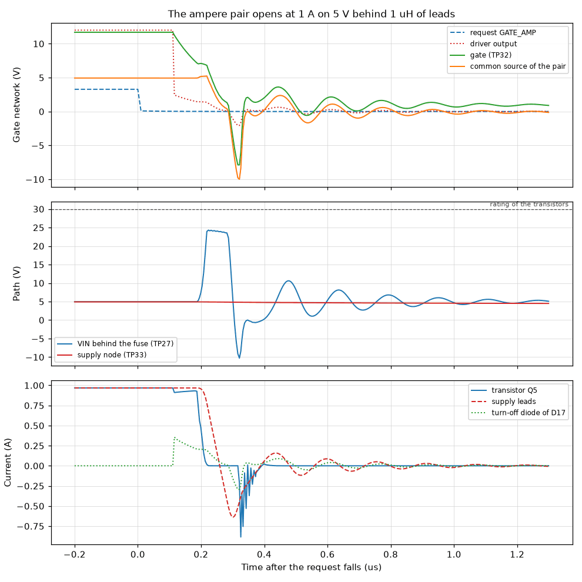

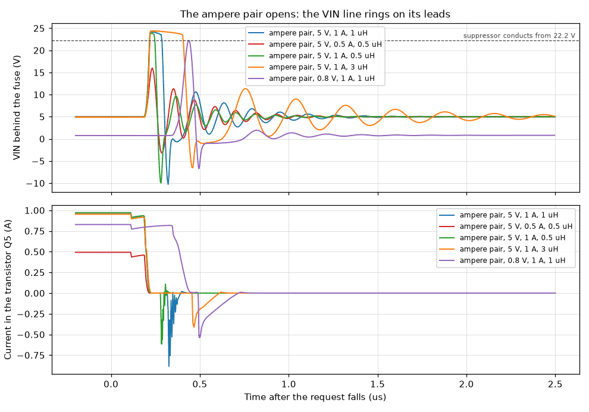

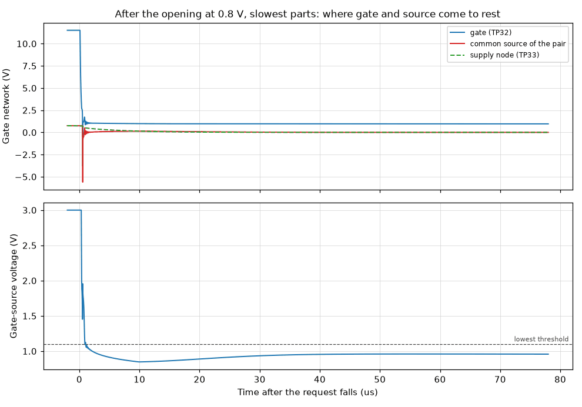

Notes:

- The load is a resistor on the node after the shunts; the output pair, the
  cable and the device under test belong to another block. The regulator is a
  voltage source and the external supply a voltage source behind its leads.
- The capacitance on the VIN line that the leads ring against is that of the
  models of the suppressor and of the transistor, about 1 nF; the capacitance of
  the leads themselves and of the supply is not in the circuit. The height of
  the kick depends on it: rule F-23 states 20 V to 24 V as an estimate, the runs
  give 16 V at 0.5 A and 24 V to 25 V at 1 A, all below what the transistors and
  the suppressor bear.
- After the kick the line swings below ground on its leads. The transistor on
  the supply side then conducts through its body diode and the one on the ladder
  side as a follower, for some tens of nanoseconds: a current flows back from
  the supply node. The lead model has no loss but its resistance, so a real line
  rings less.
- After the opening the gate rests one diode drop above ground for as long as
  the ramp capacitor discharges through that diode, about 3 ms, and the common
  source floats near ground: 0.86 V to 1.08 V of gate-source voltage in these
  runs, against a lowest threshold of 1.1 V at 250 uA and 25 C that falls by
  about 4.6 mV/K (datasheet). The pair is a follower in both directions and can
  lift neither side above its gate less a threshold, which is near 0 V, so
  nothing follows from it for a load; no model here gives the current that flows
  meanwhile. The specification describes the same state for the output pair and
  not for the mode pairs.
- The forward recovery of the turn-off diode (1.75 V at the most at 10 mA,
  datasheet) is not modelled. The driver is a behavioral model; the slow corner
  gives it 50 ns and 10 ohm, the datasheet limits at 25 C. The transistor model
  has no avalanche: the figures are the voltages it would have to block.

Models. written here: BAV199, BAV199_HI, CSD17577Q3A, IRLML0030,
IRLML0030_CLAMP, MCP656X, MUX509, PATH_BC847B, PATH_BSS138, PATH_CSD17577_LO,
PATH_FUSE_0466004, PATH_SMAJ20CA, PATH_SMAJ20CA_HI, TC4427CH.

Decks: [open.ampere_5v_1a_1uh.cir](open.ampere_5v_1a_1uh.cir).

## `path_switching/overvoltage`

**The supply rises above its range while the ampere pair is closed.**

Ampere mode runs on a supply that rises above the trip level of the detector.
The pair and the output pair are closed, range 3 is selected and a device under
test of 10 uF with 100 ohm hangs on the output terminal. The supply steps from 5
V to 6 V, 8 V and 20 V within 1 us, and rises more slowly. The detector opens
the pair; the run shows what has reached the device under test by then and what
the transistors have to block when the pair opens with the current of the leads
flowing. A last run takes the supply to 6 V for 0.3 ms and back with the request
still high: the detector releases and the pair closes again, as rule F-27
describes.

Answers: section 4.9 (over-voltage detector, D-43, D-60), rule F-27, sections 14
and 16.

| Figure | Simulated | Vendor models | Specification | Limits | Verdict | Source |
| --- | --- | --- | --- | --- | --- | --- |
| Gate-source voltage below 1 V after the terminal passes the trip level: 5 V to 20 V | 3.227 µs | 3.161 µs | | 4 µs to 45 µs | **FAIL** | section 4.9: the detector opens the switch 4 us to 45 us after the terminal passes the threshold |
| Highest voltage at the device under test: 5 V to 20 V | 8.828 V | 8.751 V | 9.2 V (-4.04 %) | | | section 4.9: 9.2 V for a supply that steps to 20 V in 1 us, simulated |
| Largest current of the supply leads: 5 V to 20 V | 27.94 A | 27.4 A | | | | |
| Largest voltage across the transistor on the supply side: 5 V to 20 V | 34.44 V | 31.12 V | | at most 30 V | **FAIL** | rating of the CSD17577Q3A, 30 V (TI SLPS515A, page 1) |
| Energy in that transistor while it blocks more than 20 V: 5 V to 20 V | 25.29 µJ | 8.169 µJ | | at most 39 mJ | pass | single-pulse avalanche energy of the CSD17577Q3A, 39 mJ at 28 A (TI SLPS515A, page 1) |
| Highest voltage on VIN behind the fuse: 5 V to 20 V | 35.29 V | 35.33 V | | | | |
| Largest current in the suppressor: 5 V to 20 V | 19.57 A | 19.66 A | | | | for comparison: 12.3 A for the 10/1000 us wave (Vishay 88390, page 2) |
| Largest pulse power of the suppressor as a share of its rating at that width: 5 V to 20 V | 6.651 % | 6.543 % | | at most 100 % | pass | Vishay 88390, page 4, figure 1, read from the curve |
| I2t of the event as a share of the melting figure of the fuse: 5 V to 20 V | 0.0848 % | 0.08164 % | | at most 100 % | pass | Littelfuse 466 series, page 1: 1.764 A2s nominal |
| Highest voltage of the supply node: 5 V to 20 V | 10.63 V | 10.6 V | | at most 11.5 V | pass | limit of this bench, taken from section 4.3: the node stays below 11.5 V because the multiplexer runs from +12 V_A |
| Gate-source voltage below 1 V after the terminal passes the trip level: 5 V to 8 V | 9.958 µs | 9.989 µs | | 4 µs to 45 µs | pass | section 4.9: the detector opens the switch 4 us to 45 us after the terminal passes the threshold |
| Highest voltage at the device under test: 5 V to 8 V | 8.893 V | 8.872 V | | | | |
| Largest current of the supply leads: 5 V to 8 V | 7.732 A | 7.674 A | | | | |
| Largest voltage across the transistor on the supply side: 5 V to 8 V | 24.33 V | 24.57 V | | at most 30 V | pass | rating of the CSD17577Q3A, 30 V (TI SLPS515A, page 1) |
| Energy in that transistor while it blocks more than 20 V: 5 V to 8 V | 2.581 pJ | 20.88 nJ | | at most 39 mJ | pass | single-pulse avalanche energy of the CSD17577Q3A, 39 mJ at 28 A (TI SLPS515A, page 1) |
| Highest voltage on VIN behind the fuse: 5 V to 8 V | 25.37 V | 25.24 V | | | | |
| Largest current in the suppressor: 5 V to 8 V | 2.666 A | 2.293 A | | | | for comparison: 12.3 A for the 10/1000 us wave (Vishay 88390, page 2) |
| Largest pulse power of the suppressor as a share of its rating at that width: 5 V to 8 V | 0.2225 % | 0.1904 % | | at most 100 % | pass | Vishay 88390, page 4, figure 1, read from the curve |
| I2t of the event as a share of the melting figure of the fuse: 5 V to 8 V | 0.02135 % | 0.02109 % | | at most 100 % | pass | Littelfuse 466 series, page 1: 1.764 A2s nominal |
| Highest voltage of the supply node: 5 V to 8 V | 9.031 V | 9.013 V | | at most 11.5 V | pass | limit of this bench, taken from section 4.3: the node stays below 11.5 V because the multiplexer runs from +12 V_A |
| Gate-source voltage below 1 V after the terminal passes the trip level: 5 V to 6 V | 31.59 µs | 31.55 µs | | 4 µs to 45 µs | pass | section 4.9: the detector opens the switch 4 us to 45 us after the terminal passes the threshold |
| Highest voltage at the device under test: 5 V to 6 V | 6.333 V | 6.325 V | | | | |
| Largest current of the supply leads: 5 V to 6 V | 2.614 A | 2.593 A | | | | |
| Largest voltage across the transistor on the supply side: 5 V to 6 V | 11.19 V | 13.22 V | | at most 30 V | pass | rating of the CSD17577Q3A, 30 V (TI SLPS515A, page 1) |
| Energy in that transistor while it blocks more than 20 V: 5 V to 6 V | 0 J | 0 J | | at most 39 mJ | pass | single-pulse avalanche energy of the CSD17577Q3A, 39 mJ at 28 A (TI SLPS515A, page 1) |
| Highest voltage on VIN behind the fuse: 5 V to 6 V | 13.79 V | 14.6 V | | | | |
| Largest current in the suppressor: 5 V to 6 V | 106.3 mA | 143 mA | | | | for comparison: 12.3 A for the 10/1000 us wave (Vishay 88390, page 2) |
| Largest pulse power of the suppressor as a share of its rating at that width: 5 V to 6 V | 0.005441 % | 0.005646 % | | at most 100 % | pass | Vishay 88390, page 4, figure 1, read from the curve |
| I2t of the event as a share of the melting figure of the fuse: 5 V to 6 V | 0.002744 % | 0.002692 % | | at most 100 % | pass | Littelfuse 466 series, page 1: 1.764 A2s nominal |
| Highest voltage of the supply node: 5 V to 6 V | 6.35 V | 6.342 V | | at most 11.5 V | pass | limit of this bench, taken from section 4.3: the node stays below 11.5 V because the multiplexer runs from +12 V_A |
| Gate-source voltage below 1 V after the terminal passes the trip level: 5 V to 20 V in 100 us | 14.72 µs | 14.71 µs | | 4 µs to 45 µs | pass | section 4.9: the detector opens the switch 4 us to 45 us after the terminal passes the threshold |
| Highest voltage at the device under test: 5 V to 20 V in 100 us | 7.91 V | 7.895 V | | | | |
| Largest current of the supply leads: 5 V to 20 V in 100 us | 3.209 A | 3.192 A | | | | |
| Largest voltage across the transistor on the supply side: 5 V to 20 V in 100 us | 24.36 V | 24.58 V | | at most 30 V | pass | rating of the CSD17577Q3A, 30 V (TI SLPS515A, page 1) |
| Energy in that transistor while it blocks more than 20 V: 5 V to 20 V in 100 us | 9.29 pJ | 21.03 nJ | | at most 39 mJ | pass | single-pulse avalanche energy of the CSD17577Q3A, 39 mJ at 28 A (TI SLPS515A, page 1) |
| Highest voltage on VIN behind the fuse: 5 V to 20 V in 100 us | 25.24 V | 25.21 V | | | | |
| Largest current in the suppressor: 5 V to 20 V in 100 us | 2.383 A | 2.232 A | | | | for comparison: 12.3 A for the 10/1000 us wave (Vishay 88390, page 2) |
| Largest pulse power of the suppressor as a share of its rating at that width: 5 V to 20 V in 100 us | 0.198 % | 0.1853 % | | at most 100 % | pass | Vishay 88390, page 4, figure 1, read from the curve |
| I2t of the event as a share of the melting figure of the fuse: 5 V to 20 V in 100 us | 0.007096 % | 0.007036 % | | at most 100 % | pass | Littelfuse 466 series, page 1: 1.764 A2s nominal |
| Highest voltage of the supply node: 5 V to 20 V in 100 us | 8.071 V | 8.062 V | | at most 11.5 V | pass | limit of this bench, taken from section 4.3: the node stays below 11.5 V because the multiplexer runs from +12 V_A |
| Gate-source voltage below 1 V after the terminal passes the trip level: 5 V to 6 V in 1000 us | 52.28 µs | 52.25 µs | | 4 µs to 45 µs | **FAIL** | section 4.9: the detector opens the switch 4 us to 45 us after the terminal passes the threshold |
| Highest voltage at the device under test: 5 V to 6 V in 1000 us | 5.509 V | 5.509 V | | | | |
| Largest current of the supply leads: 5 V to 6 V in 1000 us | 80.53 mA | 76.69 mA | | | | |
| Largest voltage across the transistor on the supply side: 5 V to 6 V in 1000 us | 6.734 V | 7.352 V | | at most 30 V | pass | rating of the CSD17577Q3A, 30 V (TI SLPS515A, page 1) |
| Energy in that transistor while it blocks more than 20 V: 5 V to 6 V in 1000 us | 0 J | 0 J | | at most 39 mJ | pass | single-pulse avalanche energy of the CSD17577Q3A, 39 mJ at 28 A (TI SLPS515A, page 1) |
| Highest voltage on VIN behind the fuse: 5 V to 6 V in 1000 us | 7.624 V | 7.74 V | | | | |
| Largest current in the suppressor: 5 V to 6 V in 1000 us | 33.24 mA | 36.15 mA | | | | for comparison: 12.3 A for the 10/1000 us wave (Vishay 88390, page 2) |
| Largest pulse power of the suppressor as a share of its rating at that width: 5 V to 6 V in 1000 us | 0 % | 0 % | | at most 100 % | pass | Vishay 88390, page 4, figure 1, read from the curve |
| I2t of the event as a share of the melting figure of the fuse: 5 V to 6 V in 1000 us | 0.0001383 % | 0.0001382 % | | at most 100 % | pass | Littelfuse 466 series, page 1: 1.764 A2s nominal |
| Highest voltage of the supply node: 5 V to 6 V in 1000 us | 5.516 V | 5.516 V | | at most 11.5 V | pass | limit of this bench, taken from section 4.3: the node stays below 11.5 V because the multiplexer runs from +12 V_A |
| Largest slope of the supply node when the pair closes again without its ramp | 1.517e+04 V/s | 1.392e+04 V/s | | | | for comparison: about 0.9 V/ms with the full ramp (section 4.2); rule F-27 says that this case closes without the ramp |
| Largest current of the supply leads when the pair closes again | 323.9 mA | 271.5 mA | | | | for comparison: 5 mA with the full ramp and no device under test |
| Voltage left on the ramp capacitor when the detector releases | 7.626 V | 7.626 V | | | | |

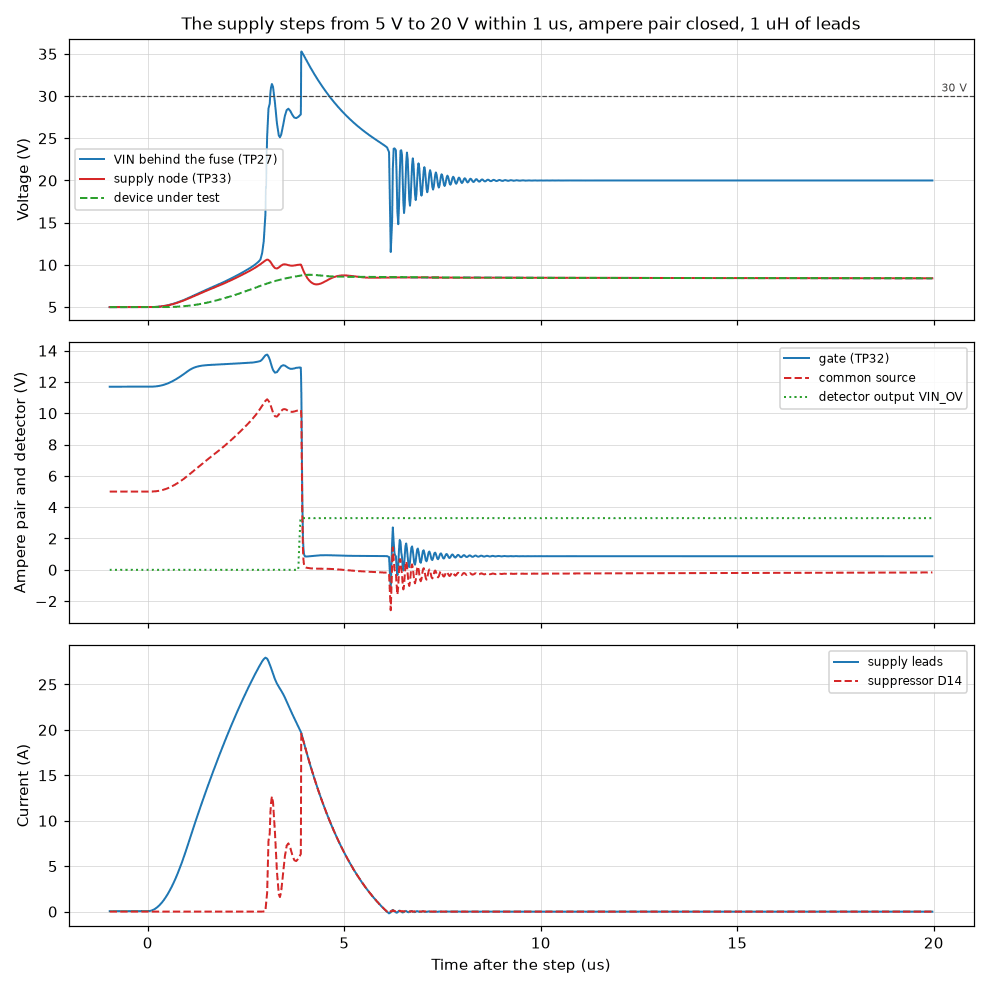

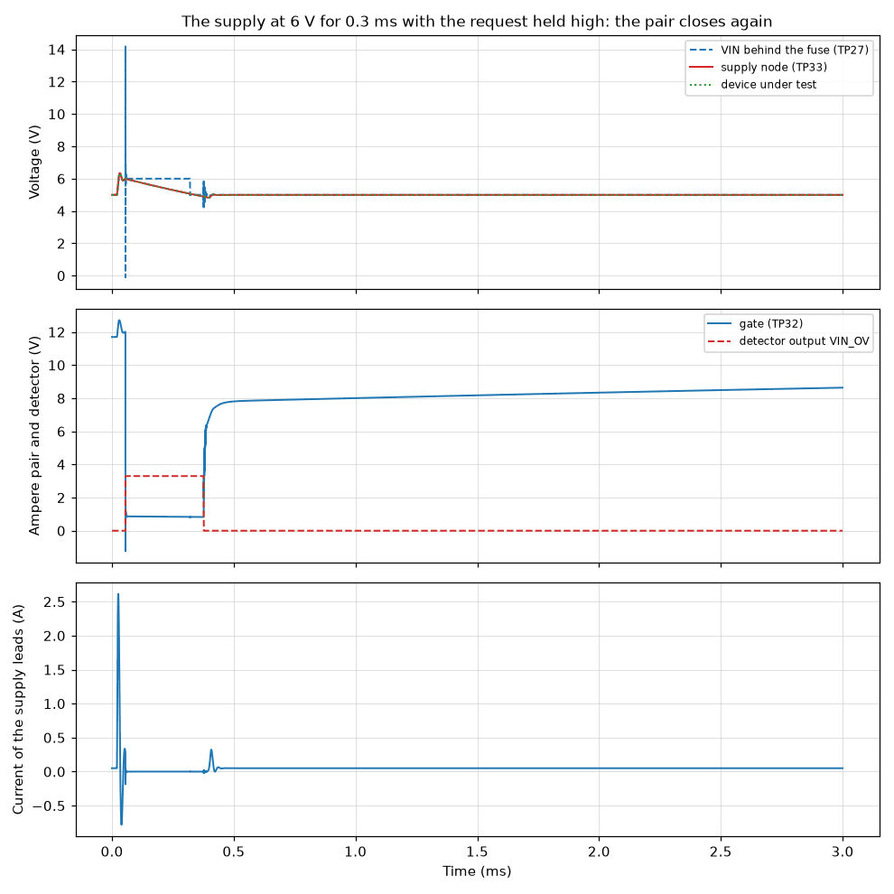

Notes:

- The supply is a voltage source behind 1 uH and 50 mohm, and the device under
  test is 10 uF behind 20 mohm with 100 ohm beside it, at the output terminal
  behind the closed output pair: the assumptions of the earlier simulations
  behind the 9.2 V of the specification. A larger capacitor at the device under
  test sees less voltage and more current.
- After a fast step to 20 V the detector opens the pair while the leads carry
  tens of amperes. Their kick drives the VIN line into the suppressor, and the
  transistor on the supply side has to block that voltage less the voltage of
  its source, which falls to ground once the gate is pulled down. The transistor
  model written here has no avalanche: a figure above 30 V is the voltage the
  part would have to block and does not. The model of the manufacturer breaks
  down near 31 V and clamps there in the run with those models. The suppressor
  model clamps at the datasheet maximum for a millisecond pulse, which is the
  cautious side.
- The time to open is counted from the instant the line behind the fuse passes
  5.465 V. It depends on how far the step passes the trip level: the 4 us to 45
  us of the specification hold for steps to about 5.8 V or more.
- Rule F-27 exists for the last run: the detector is not latched, and when it
  releases with the request still high the pair closes on what is left on its
  ramp capacitor. Firmware has to lower the request within the time the
  over-voltage lasts.

Models. written here: BAV199, CSD17577Q3A, IRLML0030, IRLML0030_CLAMP, MCP656X,
MUX509, OUTPUT_PTVS15V, PATH_BC847B, PATH_BSS138, PATH_FUSE_0466004,
PATH_SMAJ20CA, TC4427CH.

Decks: [overvoltage.5v_to_20v.cir](overvoltage.5v_to_20v.cir),
[overvoltage.bump.cir](overvoltage.bump.cir).

## `path_switching/plug`

**A supply of +20 V or -20 V is plugged into VIN with the ampere pair open.**

A supply is plugged into the VIN terminal within 100 ns while the ampere pair is
open. The supply stands behind 0.2 uH or 1 uH of leads, so the line rings
against its own capacitance until the suppressor or the losses stop it. The
instrument is idle, or source mode runs at the highest output the set-point path
can command; in that state the transistor on the ladder side blocks the sum of
both voltages. A last run takes the terminal slowly from 20 V to 26 V and shows
what the suppressor and the fuse carry there.

Answers: requirement R-09, section 4.9 (VIN, D-60: plug-in edge, suppressor and
fuse).

| Figure | Simulated | Vendor models | Specification | Limits | Verdict | Source |
| --- | --- | --- | --- | --- | --- | --- |
| Largest voltage across the transistor on the ladder side: -20 V behind 0.2 uH, source mode at 5.26 V | 28.51 V | 28.35 V | | at most 30 V | pass | rating of the CSD17577Q3A, 30 V (TI SLPS515A, page 1); section 4.9 states that it is reached for tens of nanoseconds at the plug-in edge |
| Time above 27 V across that transistor: -20 V behind 0.2 uH, source mode at 5.26 V | 180.3 ns | 77.06 ns | | | | |
| Largest voltage on VIN behind the fuse, as a magnitude: -20 V behind 0.2 uH, source mode at 5.26 V | 23.75 V | 23.67 V | | | | |
| Largest gate-source voltage of the ampere pair: -20 V behind 0.2 uH, source mode at 5.26 V | 558.6 mV | 555.3 mV | | | | for comparison: the lowest threshold of the transistors is 1.1 V |
| Largest change of the supply node: -20 V behind 0.2 uH, source mode at 5.26 V | 2.085 mV | 2.399 mV | | at most 100 mV | pass | section 11: TP33 unchanged (limit of this bench: 0.1 V) |
| Largest current in the suppressor: -20 V behind 0.2 uH, source mode at 5.26 V | 271.5 mA | 277 mA | | at most 12.3 A | pass | peak pulse current of the SMAJ20CA, 12.3 A (Vishay 88390, page 2) |
| Largest voltage across the transistor on the ladder side: -20 V behind 0.2 uH, idle | 23.27 V | 23.1 V | | at most 30 V | pass | rating of the CSD17577Q3A, 30 V (TI SLPS515A, page 1); section 4.9 states that it is reached for tens of nanoseconds at the plug-in edge |
| Time above 27 V across that transistor: -20 V behind 0.2 uH, idle | 0 s | 0 s | | | | |
| Largest voltage on VIN behind the fuse, as a magnitude: -20 V behind 0.2 uH, idle | 23.78 V | 23.68 V | | | | |
| Largest gate-source voltage of the ampere pair: -20 V behind 0.2 uH, idle | 781.6 mV | 835.2 mV | | | | for comparison: the lowest threshold of the transistors is 1.1 V |
| Largest change of the supply node: -20 V behind 0.2 uH, idle | 6.369 mV | 5.233 mV | | at most 100 mV | pass | section 11: TP33 unchanged (limit of this bench: 0.1 V) |
| Largest current in the suppressor: -20 V behind 0.2 uH, idle | 307.2 mA | 302.6 mA | | at most 12.3 A | pass | peak pulse current of the SMAJ20CA, 12.3 A (Vishay 88390, page 2) |
| Largest voltage across the transistor on the ladder side: -20 V behind 1 uH, idle | 23.55 V | 23.52 V | | at most 30 V | pass | rating of the CSD17577Q3A, 30 V (TI SLPS515A, page 1); section 4.9 states that it is reached for tens of nanoseconds at the plug-in edge |
| Time above 27 V across that transistor: -20 V behind 1 uH, idle | 0 s | 0 s | | | | |
| Largest voltage on VIN behind the fuse, as a magnitude: -20 V behind 1 uH, idle | 24.05 V | 24.03 V | | | | |
| Largest gate-source voltage of the ampere pair: -20 V behind 1 uH, idle | 806.2 mV | 817.3 mV | | | | for comparison: the lowest threshold of the transistors is 1.1 V |
| Largest change of the supply node: -20 V behind 1 uH, idle | 6.98 mV | 5.715 mV | | at most 100 mV | pass | section 11: TP33 unchanged (limit of this bench: 0.1 V) |
| Largest current in the suppressor: -20 V behind 1 uH, idle | 383.5 mA | 359.6 mA | | at most 12.3 A | pass | peak pulse current of the SMAJ20CA, 12.3 A (Vishay 88390, page 2) |
| Largest voltage across the transistor on the ladder side: -20 V behind 1 uH, source mode at 5.26 V | 28.77 V | 28.7 V | | at most 30 V | pass | rating of the CSD17577Q3A, 30 V (TI SLPS515A, page 1); section 4.9 states that it is reached for tens of nanoseconds at the plug-in edge |
| Time above 27 V across that transistor: -20 V behind 1 uH, source mode at 5.26 V | 554.7 ns | 411.5 ns | | | | |
| Largest voltage on VIN behind the fuse, as a magnitude: -20 V behind 1 uH, source mode at 5.26 V | 24.01 V | 23.98 V | | | | |
| Largest gate-source voltage of the ampere pair: -20 V behind 1 uH, source mode at 5.26 V | 565.3 mV | 506.3 mV | | | | for comparison: the lowest threshold of the transistors is 1.1 V |
| Largest change of the supply node: -20 V behind 1 uH, source mode at 5.26 V | 2.298 mV | 2.629 mV | | at most 100 mV | pass | section 11: TP33 unchanged (limit of this bench: 0.1 V) |
| Largest current in the suppressor: -20 V behind 1 uH, source mode at 5.26 V | 325.1 mA | 293.1 mA | | at most 12.3 A | pass | peak pulse current of the SMAJ20CA, 12.3 A (Vishay 88390, page 2) |
| Largest voltage across the transistor on the ladder side: -20 V behind 1 uH, source mode at 5.26 V, suppressor at its upper limit | 29.89 V | 29.82 V | | at most 30 V | pass | rating of the CSD17577Q3A, 30 V (TI SLPS515A, page 1); section 4.9 states that it is reached for tens of nanoseconds at the plug-in edge |
| Time above 27 V across that transistor: -20 V behind 1 uH, source mode at 5.26 V, suppressor at its upper limit | 814.3 ns | 485.6 ns | | | | |
| Largest voltage on VIN behind the fuse, as a magnitude: -20 V behind 1 uH, source mode at 5.26 V, suppressor at its upper limit | 25.13 V | 25.11 V | | | | |
| Largest gate-source voltage of the ampere pair: -20 V behind 1 uH, source mode at 5.26 V, suppressor at its upper limit | 587.6 mV | 524.6 mV | | | | for comparison: the lowest threshold of the transistors is 1.1 V |
| Largest change of the supply node: -20 V behind 1 uH, source mode at 5.26 V, suppressor at its upper limit | 2.451 mV | 2.649 mV | | at most 100 mV | pass | section 11: TP33 unchanged (limit of this bench: 0.1 V) |
| Largest current in the suppressor: -20 V behind 1 uH, source mode at 5.26 V, suppressor at its upper limit | 316.3 mA | 287.1 mA | | at most 12.3 A | pass | peak pulse current of the SMAJ20CA, 12.3 A (Vishay 88390, page 2) |
| Largest voltage across the transistor on the supply side: +20 V behind 0.2 uH, idle | 23.3 V | 23.15 V | | at most 30 V | pass | rating of the CSD17577Q3A, 30 V (TI SLPS515A, page 1); section 4.9 states that it is reached for tens of nanoseconds at the plug-in edge |
| Time above 27 V across that transistor: +20 V behind 0.2 uH, idle | 0 s | 0 s | | | | |
| Largest voltage on VIN behind the fuse, as a magnitude: +20 V behind 0.2 uH, idle | 23.77 V | 23.69 V | | | | |
| Largest gate-source voltage of the ampere pair: +20 V behind 0.2 uH, idle | 735.4 mV | 701.9 mV | | | | for comparison: the lowest threshold of the transistors is 1.1 V |
| Largest change of the supply node: +20 V behind 0.2 uH, idle | 6.034 mV | 4.855 mV | | at most 100 mV | pass | section 11: TP33 unchanged (limit of this bench: 0.1 V) |
| Largest current in the suppressor: +20 V behind 0.2 uH, idle | 306.4 mA | 305.1 mA | | at most 12.3 A | pass | peak pulse current of the SMAJ20CA, 12.3 A (Vishay 88390, page 2) |
| Largest voltage across the transistor on the supply side: +20 V behind 1 uH, idle | 23.69 V | 23.7 V | | at most 30 V | pass | rating of the CSD17577Q3A, 30 V (TI SLPS515A, page 1); section 4.9 states that it is reached for tens of nanoseconds at the plug-in edge |
| Time above 27 V across that transistor: +20 V behind 1 uH, idle | 0 s | 0 s | | | | |
| Largest voltage on VIN behind the fuse, as a magnitude: +20 V behind 1 uH, idle | 24.06 V | 24.03 V | | | | |
| Largest gate-source voltage of the ampere pair: +20 V behind 1 uH, idle | 747.7 mV | 731.9 mV | | | | for comparison: the lowest threshold of the transistors is 1.1 V |
| Largest change of the supply node: +20 V behind 1 uH, idle | 6.599 mV | 5.345 mV | | at most 100 mV | pass | section 11: TP33 unchanged (limit of this bench: 0.1 V) |
| Largest current in the suppressor: +20 V behind 1 uH, idle | 392.3 mA | 357.5 mA | | at most 12.3 A | pass | peak pulse current of the SMAJ20CA, 12.3 A (Vishay 88390, page 2) |
| Largest voltage across the transistor on the supply side: +20 V behind 1 uH, source mode at 5.26 V | 21.65 V | 22.2 V | | at most 30 V | pass | rating of the CSD17577Q3A, 30 V (TI SLPS515A, page 1); section 4.9 states that it is reached for tens of nanoseconds at the plug-in edge |
| Time above 27 V across that transistor: +20 V behind 1 uH, source mode at 5.26 V | 0 s | 0 s | | | | |
| Largest voltage on VIN behind the fuse, as a magnitude: +20 V behind 1 uH, source mode at 5.26 V | 24.02 V | 24 V | | | | |
| Largest gate-source voltage of the ampere pair: +20 V behind 1 uH, source mode at 5.26 V | 1.385 mV | -1.215 mV | | | | for comparison: the lowest threshold of the transistors is 1.1 V |
| Largest change of the supply node: +20 V behind 1 uH, source mode at 5.26 V | 966.7 µV | 965.5 µV | | at most 100 mV | pass | section 11: TP33 unchanged (limit of this bench: 0.1 V) |
| Largest current in the suppressor: +20 V behind 1 uH, source mode at 5.26 V | 332.4 mA | 319.4 mA | | at most 12.3 A | pass | peak pulse current of the SMAJ20CA, 12.3 A (Vishay 88390, page 2) |
| Current of a steady 24 V supply into the terminal, suppressor with its lowest breakdown voltage | 1.786 A | 1.786 A | | | | |
| Power in the suppressor at a steady 24 V, lowest breakdown voltage | 42.87 W | 42.87 W | | | | for comparison: the SMAJ20CA bears 3.3 W on an infinite heat sink (Vishay 88390, page 1) |
| Current of a steady 24 V supply into the terminal, suppressor with its typical breakdown voltage | 175.3 mA | 175.3 mA | | | | |
| Power in the suppressor at a steady 24 V, typical breakdown voltage | 4.206 W | 4.206 W | | | | for comparison: the SMAJ20CA bears 3.3 W on an infinite heat sink (Vishay 88390, page 1) |

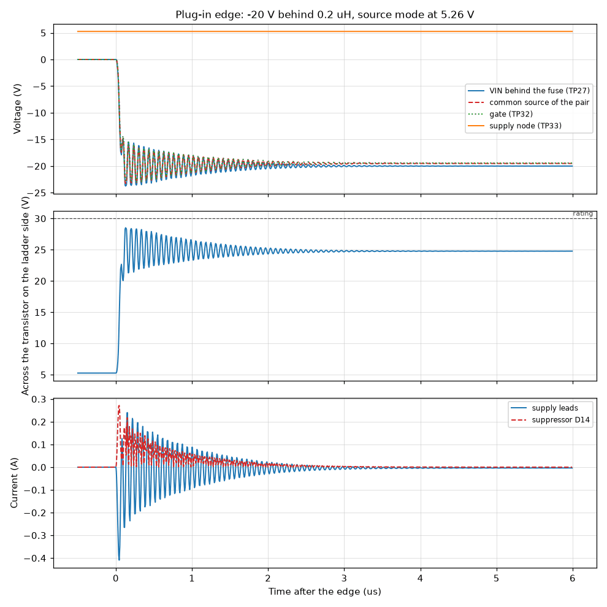

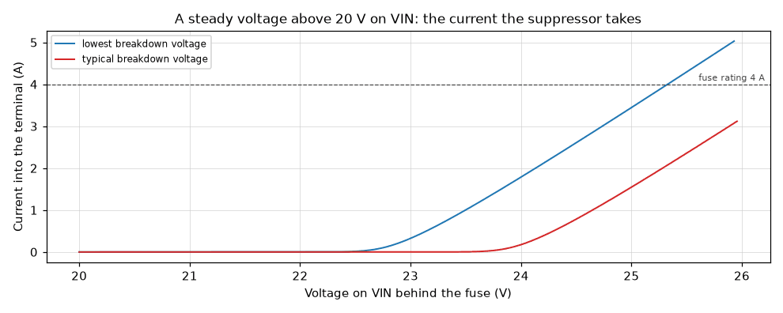

Notes:

- The supply is a voltage source that rises within 100 ns behind 20 mohm and its
  leads; the line rings against the capacitance of the suppressor and of the
  transistor, about 1 nF in the models. A plug with bouncing contacts is not
  simulated. The current of the suppressor at these edges is mostly the current
  of its own capacitance.
- At the negative edge the common source of the pair follows the terminal
  through the body diode of the transistor on the supply side, and the gate
  follows it through the gate capacitance before the hold-off transistor
  conducts. The figure for the gate-source voltage shows how far the gate lags;
  the change of the supply node shows what that costs.
- The transistor models have no avalanche: a voltage above 30 V in a figure is
  the voltage the part would have to block and does not.
- Above its breakdown voltage the suppressor takes amperes from a steady supply:
  tens of watts in a part made for 3.3 W, at a current below the 4 A of the
  fuse, which therefore does not open. This is what the specification says: 24 V
  destroys the suppressor and the fuse does not protect it.

Models. written here: BAV199, CSD17577Q3A, IRLML0030, IRLML0030_CLAMP, MCP656X,
MUX509, PATH_BC847B, PATH_BSS138, PATH_FUSE_0466004, PATH_SMAJ20CA,
PATH_SMAJ20CA_HI, PATH_SMAJ20CA_LO, TC4427CH.

Decks: [plug.minus20v_0p2uh_source.cir](plug.minus20v_0p2uh_source.cir).

## `path_switching/reversal`

**The supply reverses while the ampere pair is closed.**

Ampere mode runs on a supply that reverses within 1 us. The pair and the output
pair are closed, range 3 is selected and a device under test of 10 uF with 100
ohm hangs on the output terminal. Nothing but the hold-off transistor opens the
pair: it joins gate and common source once the common source is a base-emitter
voltage below ground, and it has to empty the ramp capacitor through 6.8 kohm
with the base current that 100 kohm leave it. The run shows how long that takes
from 5 V and from low supply voltages, what reaches the device under test
meanwhile, and what the transistors of the pair have to block when the pair
opens with the current of the leads still flowing.

Answers: section 4.9 (VIN: a reversal with the switch closed; hold-off below
ground, D-61), sections 14 and 16.

| Figure | Simulated | Vendor models | Specification | Limits | Verdict | Source |
| --- | --- | --- | --- | --- | --- | --- |
| Pair open after the step: 5 V to -20 V | 6.738 µs | 10.63 µs | | 5 µs to 35 µs | pass | section 4.9: within 5 us to 35 us from 5 V |
| Lowest voltage at the device under test: 5 V to -20 V | -3.721 V | -3.325 V | -2.4 V (-55.06 %) | | | section 4.9: -2.4 V for a supply that steps to -20 V, simulated |
| Largest current drawn backward through the leads: 5 V to -20 V | 85.36 A | 87.6 A | | | | |
| Largest voltage across the transistor on the ladder side: 5 V to -20 V | 65.74 V | 31.43 V | | at most 30 V | **FAIL** | rating of the CSD17577Q3A, 30 V (TI SLPS515A, page 1) |
| Energy in that transistor while it blocks more than 20 V: 5 V to -20 V | 237.5 µJ | 3.84 mJ | | at most 39 mJ | pass | single-pulse avalanche energy of the CSD17577Q3A, 39 mJ at 28 A (TI SLPS515A, page 1) |
| Lowest voltage on VIN behind the fuse: 5 V to -20 V | -68.1 V | -35.98 V | | | | |
| Largest current in the suppressor: 5 V to -20 V | 77.65 A | 20.74 A | | | | for comparison: 12.3 A for the 10/1000 us wave (Vishay 88390, page 2) |
| Largest pulse power of the suppressor as a share of its rating at that width: 5 V to -20 V | 51.12 % | 13.77 % | | at most 100 % | pass | Vishay 88390, page 4, figure 1, read from the curve |
| I2t of the event as a share of the melting figure of the fuse: 5 V to -20 V | 1.444 % | 1.862 % | | at most 100 % | pass | Littelfuse 466 series, page 1: 1.764 A2s nominal |
| Pair open after the step: 5 V to -5 V | 11.96 µs | 12.67 µs | | 5 µs to 35 µs | pass | section 4.9: within 5 us to 35 us from 5 V |
| Lowest voltage at the device under test: 5 V to -5 V | -2.151 V | -2.042 V | | | | |
| Largest current drawn backward through the leads: 5 V to -5 V | 28.08 A | 29.01 A | | | | |
| Largest voltage across the transistor on the ladder side: 5 V to -5 V | 34.48 V | 31.24 V | | at most 30 V | **FAIL** | rating of the CSD17577Q3A, 30 V (TI SLPS515A, page 1) |
| Energy in that transistor while it blocks more than 20 V: 5 V to -5 V | 42.32 µJ | 73.08 µJ | | at most 39 mJ | pass | single-pulse avalanche energy of the CSD17577Q3A, 39 mJ at 28 A (TI SLPS515A, page 1) |
| Lowest voltage on VIN behind the fuse: 5 V to -5 V | -36.43 V | -33.82 V | | | | |
| Largest current in the suppressor: 5 V to -5 V | 21.46 A | 16.93 A | | | | for comparison: 12.3 A for the 10/1000 us wave (Vishay 88390, page 2) |
| Largest pulse power of the suppressor as a share of its rating at that width: 5 V to -5 V | 5.155 % | 4.27 % | | at most 100 % | pass | Vishay 88390, page 4, figure 1, read from the curve |
| I2t of the event as a share of the melting figure of the fuse: 5 V to -5 V | 0.3913 % | 0.4201 % | | at most 100 % | pass | Littelfuse 466 series, page 1: 1.764 A2s nominal |
| Pair open after the step: 5 V to -5 V, hold-off transistor with a gain of 25 at 10 uA | 11.82 µs | 12.67 µs | | 5 µs to 35 µs | pass | section 4.9: within 5 us to 35 us from 5 V |
| Lowest voltage at the device under test: 5 V to -5 V, hold-off transistor with a gain of 25 at 10 uA | -2.151 V | -2.042 V | | | | |
| Largest current drawn backward through the leads: 5 V to -5 V, hold-off transistor with a gain of 25 at 10 uA | 28.08 A | 29.01 A | | | | |
| Largest voltage across the transistor on the ladder side: 5 V to -5 V, hold-off transistor with a gain of 25 at 10 uA | 34.75 V | 31.24 V | | at most 30 V | **FAIL** | rating of the CSD17577Q3A, 30 V (TI SLPS515A, page 1) |
| Energy in that transistor while it blocks more than 20 V: 5 V to -5 V, hold-off transistor with a gain of 25 at 10 uA | 23.51 µJ | 73.08 µJ | | at most 39 mJ | pass | single-pulse avalanche energy of the CSD17577Q3A, 39 mJ at 28 A (TI SLPS515A, page 1) |
| Lowest voltage on VIN behind the fuse: 5 V to -5 V, hold-off transistor with a gain of 25 at 10 uA | -36.73 V | -33.82 V | | | | |
| Largest current in the suppressor: 5 V to -5 V, hold-off transistor with a gain of 25 at 10 uA | 22.42 A | 16.93 A | | | | for comparison: 12.3 A for the 10/1000 us wave (Vishay 88390, page 2) |
| Largest pulse power of the suppressor as a share of its rating at that width: 5 V to -5 V, hold-off transistor with a gain of 25 at 10 uA | 5.394 % | 4.27 % | | at most 100 % | pass | Vishay 88390, page 4, figure 1, read from the curve |
| I2t of the event as a share of the melting figure of the fuse: 5 V to -5 V, hold-off transistor with a gain of 25 at 10 uA | 0.3858 % | 0.4201 % | | at most 100 % | pass | Littelfuse 466 series, page 1: 1.764 A2s nominal |
| Pair open after the step: 3 V to -3 V | 17.83 µs | 19.61 µs | | | | |
| Lowest voltage at the device under test: 3 V to -3 V | -1.584 V | -1.538 V | | | | |
| Pair open after the step: 3 V to -3 V, hold-off transistor with a gain of 25 at 10 uA | 18.47 µs | 19.6 µs | | | | |
| Lowest voltage at the device under test: 3 V to -3 V, hold-off transistor with a gain of 25 at 10 uA | -1.582 V | -1.534 V | | | | |
| Pair open after the step: 2 V to -2 V | 28.41 µs | 37.04 µs | | | | |
| Lowest voltage at the device under test: 2 V to -2 V | -1.292 V | -1.273 V | | | | |
| Pair open after the step: 2 V to -2 V, hold-off transistor with a gain of 25 at 10 uA | 39.41 µs | 37.04 µs | | | | |
| Lowest voltage at the device under test: 2 V to -2 V, hold-off transistor with a gain of 25 at 10 uA | -1.292 V | -1.273 V | | | | |
| Pair open after the step: 1.5 V to -1.5 V | 67.94 µs | 303.3 µs | | at most 2 ms | pass | section 4.9: within 2 ms from 1.5 V |
| Lowest voltage at the device under test: 1.5 V to -1.5 V | -1.154 V | -1.147 V | | | | |
| Pair open after the step: 1.5 V to -1.5 V, hold-off transistor with the least gain at 2 mA | 299.9 µs | 303.3 µs | | at most 2 ms | pass | section 4.9: within 2 ms from 1.5 V |
| Lowest voltage at the device under test: 1.5 V to -1.5 V, hold-off transistor with the least gain at 2 mA | -1.154 V | -1.147 V | | | | |
| Pair open after the step: 1.5 V to -1.5 V, hold-off transistor with a gain of 25 at 10 uA | 325.9 µs | 303.3 µs | | at most 2 ms | pass | section 4.9: within 2 ms from 1.5 V |
| Lowest voltage at the device under test: 1.5 V to -1.5 V, hold-off transistor with a gain of 25 at 10 uA | -1.154 V | -1.147 V | | | | |
| Pair open after the step: 1 V to -1 V | 778.2 µs | 2.927 ms | | | | |
| Lowest voltage at the device under test: 1 V to -1 V | -1.013 V | -1.019 V | | | | |
| Pair open after the step: 1 V to -1 V, hold-off transistor with a gain of 25 at 10 uA | 2.438 ms | 2.927 ms | | | | |
| Lowest voltage at the device under test: 1 V to -1 V, hold-off transistor with a gain of 25 at 10 uA | -1.013 V | -1.019 V | | | | |
| Reversed 5 V supply limited to 1 A, request high: pair open after | 19.83 µs | | | | | |
| Reversed 5 V supply limited to 1 A, request high: lowest voltage of the supply node | -3.044 V | | | | | |
| Reversed 5 V supply limited to 1 A, request high: supply node 35 us after the plug-in | -2.556 V | | | at least -100 mV | **FAIL** | section 16: TP33 above -0.1 V after 35 us |

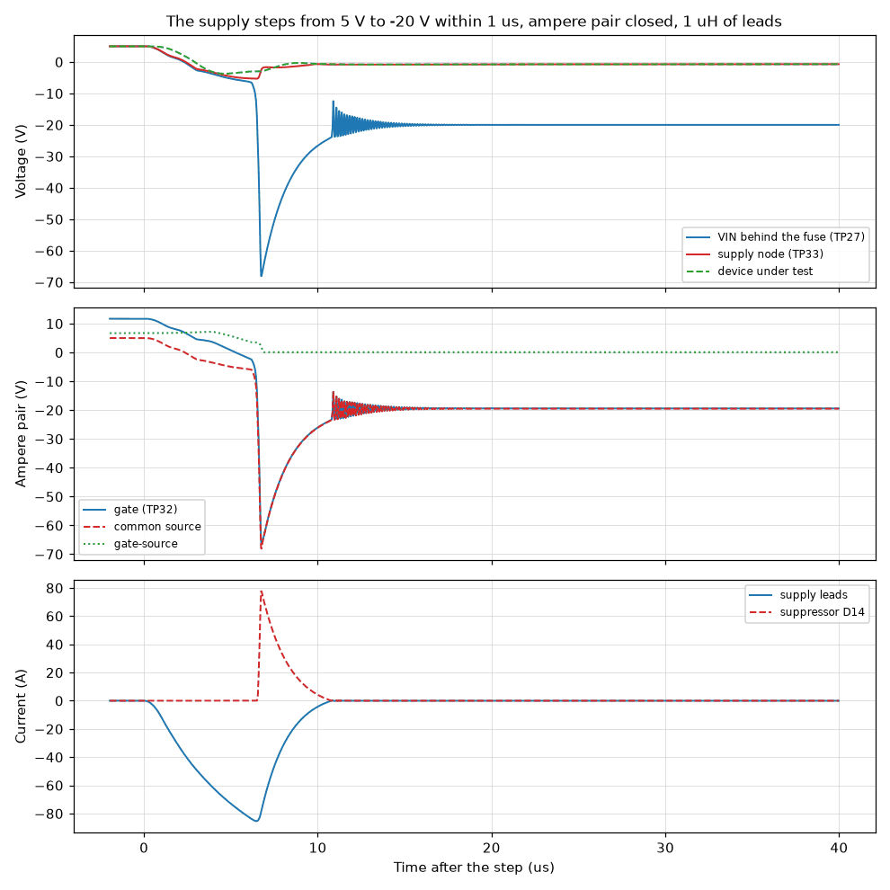

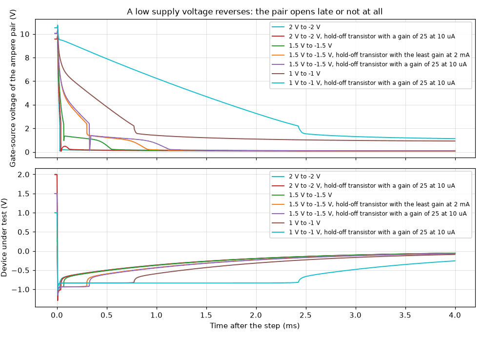

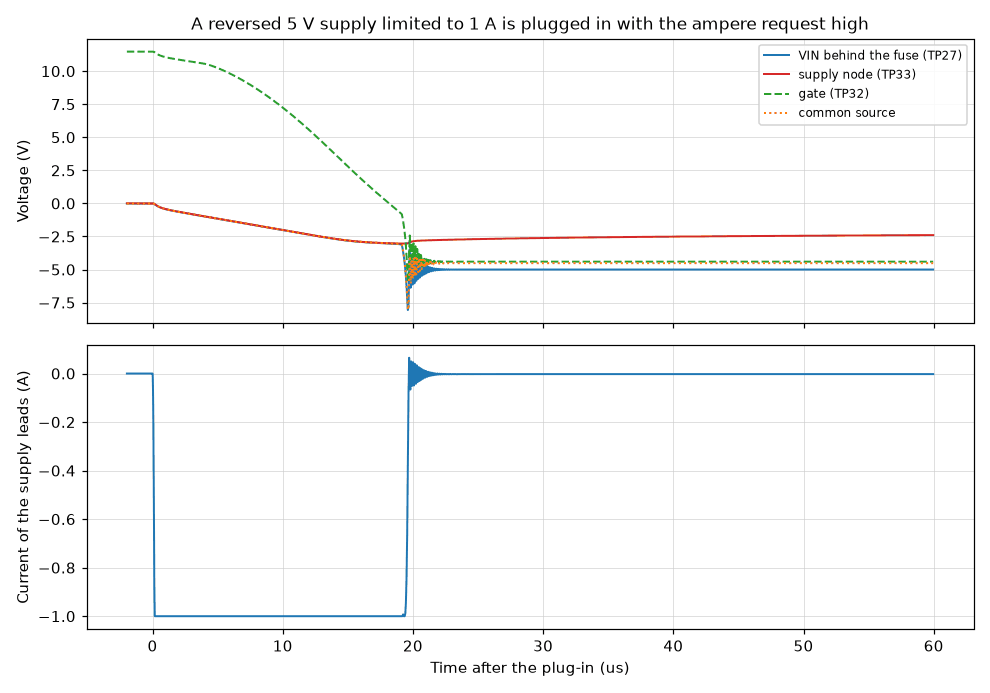

Notes:

- The supply is a voltage source that reverses within 1 us behind 1 uH and 50
  mohm, and it takes any current. The device under test is 10 uF behind 20 mohm
  with 100 ohm beside it. Both are the assumptions of the earlier simulations
  behind the figures of the specification. The output pair and the suppressor of
  the output terminal are the parts of the schematic with the models of their
  block; below ground that suppressor conducts forward and bounds what the
  device under test sees.
- Until the pair opens, the reversed supply draws current backward through the
  ladder: the capacitor of the device under test, the capacitors of the supply
  node and, once a node is below ground, the body diodes on the way. When the
  pair then opens, the leads carry that current and their kick adds to the
  reversed voltage. The transistor on the ladder side has to block the
  difference between the supply node and the terminal. The model written here
  has no avalanche, so a figure above 30 V is the voltage the part would have to
  block and does not. The model of the manufacturer breaks down near 31 V: in
  the run with those models the transistor clamps there and takes the energy
  that the suppressor leaves, at a current that can pass the 28 A of its
  avalanche rating.
- How fast the pair opens from a low voltage rests on the gain of the hold-off
  transistor at microamperes, which its datasheet does not state. The model
  assumes about 220 at 10 uA and 160 for the part with the least gain at 2 mA.
  The variant with a gain of 25 at 10 uA is the other reading: the model that
  the manufacturer publishes for this transistor puts the gain there. Which one
  a real part follows is a measurement.
- In the last run the supply is a source that limits at 1 A and has no output
  capacitor. A real supply delivers the first microseconds from its output
  capacitor without any limit.

Models. written here: BAV199, CSD17577Q3A, IRLML0030, IRLML0030_CLAMP, MCP656X,
MUX509, OUTPUT_PTVS15V, PATH_BC847B, PATH_BC847B_LO, PATH_BC847B_WEAK,
PATH_BSS138, PATH_FUSE_0466004, PATH_SMAJ20CA, TC4427CH.

Decks: [reversal.5v_to_m20v.cir](reversal.5v_to_m20v.cir),
[reversal.limited.cir](reversal.limited.cir).

## `path_switching/ring`

**Ampere mode: a load step to 1 A rings on the supply leads against the
capacitor at the load.**

Ampere mode runs on 5 V behind supply leads and the load steps from 10 mA to 1
A. The load has a capacitor beside it, so the step is first served by that
capacitor and the current in the shunt then rings up on the supply leads and
passes the load current. The run measures for how long the current in the 0.1
ohm shunt stays above the over-current level without interruption: the trip acts
when that lasts 12 us. It is repeated with 100 uF across the VIN terminals,
which the user documentation asks for with long leads. Range 3 is held from the
start, so this is the part of the event that the leads cause by themselves: the
recharge of the capacitor after a range change, which the figures of the
specification include, is not in it.

Answers: sections 4.4 and 4.9 (ampere mode with long supply leads; 100 uF at the
VIN terminals).

| Figure | Simulated | Vendor models | Specification | Limits | Verdict | Source |
| --- | --- | --- | --- | --- | --- | --- |
| Longest time above 1.15 A in the shunt: 3 uH of leads, 100 uF at the load | 0 s | 0 s | | | | for comparison: the trip acts after 12 us; section 4.4 states 12 us to 29 us for the whole event, with the range change |
| Longest time above the lowest level of 1.114 A: 3 uH of leads, 100 uF at the load | 0 s | 0 s | | | | |
| Largest current in the shunt: 3 uH of leads, 100 uF at the load | 1.015 A | 1.012 A | | | | |
| Longest time above 1.15 A in the shunt: 1 uH of leads, 10 uF at the load | 7.283 µs | 7.129 µs | | | | for comparison: the trip acts after 12 us; section 4.4 states 12 us to 29 us for the whole event, with the range change |
| Longest time above the lowest level of 1.114 A: 1 uH of leads, 10 uF at the load | 8.744 µs | 8.646 µs | | | | |
| Largest current in the shunt: 1 uH of leads, 10 uF at the load | 1.244 A | 1.238 A | | | | |
| Longest time above 1.15 A in the shunt: 1 uH of leads, 100 uF at the load | 0 s | 0 s | | | | for comparison: the trip acts after 12 us; section 4.4 states 12 us to 29 us for the whole event, with the range change |
| Longest time above the lowest level of 1.114 A: 1 uH of leads, 100 uF at the load | 0 s | 0 s | | | | |
| Largest current in the shunt: 1 uH of leads, 100 uF at the load | 0.9999 A | 0.9999 A | | | | |
| Longest time above 1.15 A in the shunt: 2 uH of leads, 47 uF at the load | 0 s | 0 s | | | | for comparison: the trip acts after 12 us; section 4.4 states 12 us to 29 us for the whole event, with the range change |
| Longest time above the lowest level of 1.114 A: 2 uH of leads, 47 uF at the load | 0 s | 0 s | | | | |
| Largest current in the shunt: 2 uH of leads, 47 uF at the load | 1.107 A | 1.1 A | | | | |
| Longest time above 1.15 A in the shunt: 3 uH of leads, 10 uF at the load | 13.5 µs | 13.37 µs | | | | for comparison: the trip acts after 12 us; section 4.4 states 12 us to 29 us for the whole event, with the range change |
| Longest time above the lowest level of 1.114 A: 3 uH of leads, 10 uF at the load | 15.74 µs | 15.66 µs | | | | |
| Largest current in the shunt: 3 uH of leads, 10 uF at the load | 1.266 A | 1.262 A | | | | |
| Longest time above 1.15 A in the shunt: 3 uH of leads, 100 uF at the load, 100 uF at the VIN terminals | 0 s | 0 s | | at most 10 µs | pass | rule F-18: the trip never acts before 10 us (section 4.4 states 2.1 us at the most for the whole event, with the range change) |
| Longest time above the lowest level of 1.114 A: 3 uH of leads, 100 uF at the load, 100 uF at the VIN terminals | 0 s | 0 s | | | | |
| Largest current in the shunt: 3 uH of leads, 100 uF at the load, 100 uF at the VIN terminals | 1.014 A | 1.013 A | | | | |
| Longest time above 1.15 A in the shunt: 1 uH of leads, 10 uF at the load, 100 uF at the VIN terminals | 0 s | 0 s | | at most 10 µs | pass | rule F-18: the trip never acts before 10 us (section 4.4 states 2.1 us at the most for the whole event, with the range change) |
| Longest time above the lowest level of 1.114 A: 1 uH of leads, 10 uF at the load, 100 uF at the VIN terminals | 0 s | 0 s | | | | |
| Largest current in the shunt: 1 uH of leads, 10 uF at the load, 100 uF at the VIN terminals | 1.024 A | 1.024 A | | | | |
| Longest time above 1.15 A in the shunt: 1 uH of leads, 100 uF at the load, 100 uF at the VIN terminals | 0 s | 0 s | | at most 10 µs | pass | rule F-18: the trip never acts before 10 us (section 4.4 states 2.1 us at the most for the whole event, with the range change) |
| Longest time above the lowest level of 1.114 A: 1 uH of leads, 100 uF at the load, 100 uF at the VIN terminals | 0 s | 0 s | | | | |
| Largest current in the shunt: 1 uH of leads, 100 uF at the load, 100 uF at the VIN terminals | 1.009 A | 1.006 A | | | | |
| Longest time above 1.15 A in the shunt: 3 uH of leads, 10 uF at the load, 100 uF at the VIN terminals | 0 s | 0 s | | at most 10 µs | pass | rule F-18: the trip never acts before 10 us (section 4.4 states 2.1 us at the most for the whole event, with the range change) |
| Longest time above the lowest level of 1.114 A: 3 uH of leads, 10 uF at the load, 100 uF at the VIN terminals | 0 s | 0 s | | | | |
| Largest current in the shunt: 3 uH of leads, 10 uF at the load, 100 uF at the VIN terminals | 1.015 A | 1.015 A | | | | |

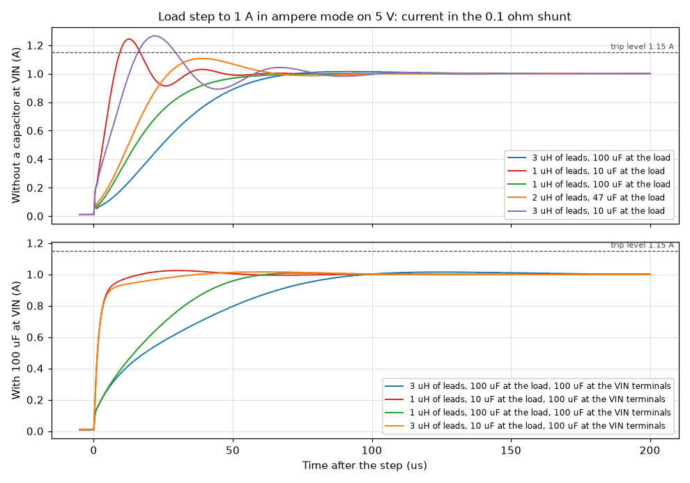

Notes:

- The load is a current sink that steps within 100 ns beside its capacitor,
  which has 20 mohm in series; the supply is a voltage source behind its leads,
  40 mohm per uH. These resistances set the damping and are assumptions. The
  capacitor across the VIN terminals has 50 mohm in series (assumption).
- The trip itself is not in the circuit: the figure is the time the over-current
  comparator would see, without the delay of the amplifier chain.
- The range is held at range 3. In the instrument such a step starts in a lower
  range: the capacitor at the load sags until the jump comparator has selected
  range 3, and its recharge then adds to the current in the shunt. The 12 us to
  29 us and the 2.1 us of the specification are figures of that whole event,
  which needs the range logic in the loop and belongs to its block. With the
  range held, the leads alone keep the current above the level for 7 us to 14 us
  with 10 uF at the load and not at all with 47 uF or more.
- The output pair is the part of the schematic with the model of its block.

Models. written here: BAV199, CSD17577Q3A, IRLML0030, IRLML0030_CLAMP, MCP656X,
MUX509, OUTPUT_PTVS15V, PATH_BC847B, PATH_BSS138, PATH_FUSE_0466004,
PATH_SMAJ20CA, TC4427CH.

Decks: [ring.3uh_100uf.cir](ring.3uh_100uf.cir).

## `path_switching/sag`

**Ampere mode: the supply node after a load step of 500 mA behind supply
leads.**

The ampere pair is closed on 5 V behind supply leads and the load steps to 500
mA. The step has an edge of 100 ns and is drawn from the node after the shunts,
with range 3 selected. Until the current of the leads has risen, the capacitor
of the supply node and its damped branch deliver the load. The run is repeated
for 0.5 uH to 3 uH of leads, with the two capacitors at 40 % of their value, and
without the damped branch.

Answers: section 4.3 (supply node, D-63).

| Figure | Simulated | Vendor models | Specification | Limits | Verdict | Source |
| --- | --- | --- | --- | --- | --- | --- |
| Deepest sag of the supply node: 1 uH, 0.5 A | 209.6 mV | 209.7 mV | | 170 mV to 210 mV | pass | section 4.3: 0.17 V to 0.21 V behind 0.5 uH to 1 uH, simulated |
| Drop of the supply node once the leads carry the load: 1 uH, 0.5 A | 31.39 mV | 32.43 mV | | | | |
| Deepest sag of the supply node: 0.5 uH, 0.5 A | 170.5 mV | 170.7 mV | | 170 mV to 210 mV | pass | section 4.3: 0.17 V to 0.21 V behind 0.5 uH to 1 uH, simulated |
| Deepest sag of the supply node: 0.75 uH, 0.5 A | 192.1 mV | 192.2 mV | | 170 mV to 210 mV | pass | section 4.3: 0.17 V to 0.21 V behind 0.5 uH to 1 uH, simulated |
| Deepest sag of the supply node: 3 uH, 0.5 A | 324.3 mV | 324.5 mV | | | | |
| Deepest sag of the supply node: 1 uH, 0.5 A, capacitors at 40 % | 290.9 mV | 291.2 mV | | | | |
| Deepest sag of the supply node: 1 uH, 0.5 A, without the damper | 482.1 mV | 482.6 mV | | | | |

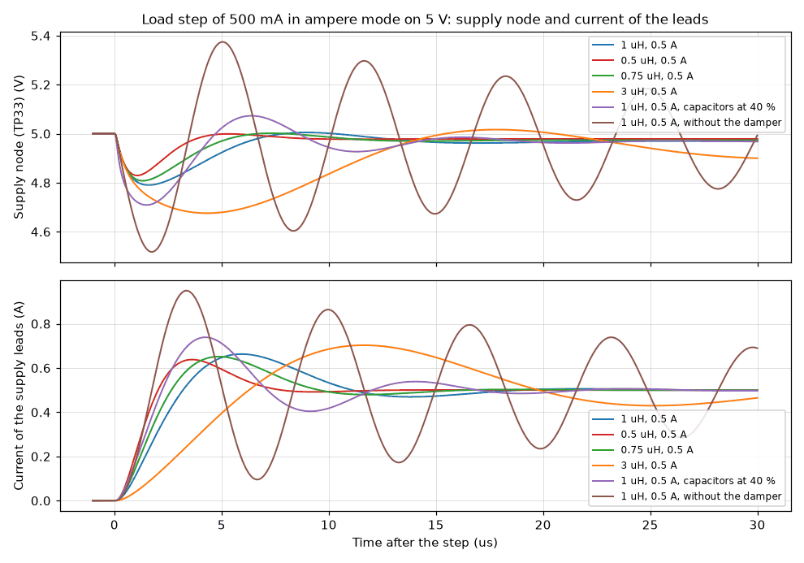

Notes:

- The load is a current sink that steps within 100 ns, drawn from the node after
  the shunts with range 3 held: no capacitor at the device under test softens
  the step, and the range logic is not in the circuit.
- The external supply is a voltage source behind its leads, 40 mohm per uH; the
  sag is measured from the level before the step, so it includes the drop of
  leads, fuse and pair, about 30 mV.
- An X7R capacitor keeps less than its nominal value under bias; the run with
  both capacitors at 40 % shows the direction, the share itself is an
  assumption.

Models. written here: BAV199, CSD17577Q3A, IRLML0030, IRLML0030_CLAMP, MCP656X,
MUX509, PATH_BC847B, PATH_BSS138, PATH_FUSE_0466004, PATH_SMAJ20CA, TC4427CH.

Decks: [sag.1uh_0p5a.cir](sag.1uh_0p5a.cir).

## `path_switching/short`

**A short circuit in ampere mode: the trip opens the output and the supply leads
kick.**

Ampere mode on a stiff 5 V supply, and the output terminal is shorted. The
ampere pair and the output pair are closed, range 3 is selected and the load
takes 100 mA. Then a short circuit of 5 mohm closes at the terminal. The current
rises as fast as the supply leads allow until the over-current trip opens the
output pair: 12 us after the shunt passes 1.15 A, plus 0.3 us for the amplifier
and the comparator. From then on the current of the leads has to go somewhere:
into the capacitor of the supply node and its damped branch, and, once the
ampere pair works as a follower against its bounded gate, into the suppressor of
the VIN terminal. The run is made with 0.5 uH to 3 uH of leads, with the longest
qualification time of rule F-18, with the parts that let the node and the
terminal rise highest, with a short behind 1 m of cable and, for comparison,
without the damped branch.

Answers: sections 4.3 and 4.9 (supply node, D-63; bound of the gate, D-61;
suppressor, D-60), section 4.4 and rule F-18 (trip), the tests of sections 11
and 16.

| Figure | Simulated | Vendor models | Specification | Limits | Verdict | Source |
| --- | --- | --- | --- | --- | --- | --- |
| Largest current of the supply leads: 2 uH | 18.93 A | 18.57 A | | | | section 15, D-63: 15 A to 34 A of lead current |
| Highest voltage of the supply node: 2 uH | 10.94 V | 10.86 V | | at most 11.5 V | pass | sections 4.3 and 11: the node stays below 11.5 V |
| Highest voltage on VIN behind the fuse: 2 uH | 29.44 V | 29.47 V | | at most 36 V | pass | section 11: TP27 below 36 V (section 16 expects below 34 V) |
| Largest current of the supply leads: 0.5 uH | 32.74 A | 31.48 A | | | | section 15, D-63: 15 A to 34 A of lead current |
| Highest voltage of the supply node: 0.5 uH | 10.75 V | 10.73 V | | at most 11.5 V | pass | sections 4.3 and 11: the node stays below 11.5 V |
| Highest voltage on VIN behind the fuse: 0.5 uH | 27.75 V | 27.7 V | | at most 36 V | pass | section 11: TP27 below 36 V (section 16 expects below 34 V) |
| Largest current of the supply leads: 1 uH | 26 A | 25.32 A | | | | section 15, D-63: 15 A to 34 A of lead current |
| Highest voltage of the supply node: 1 uH | 10.92 V | 10.96 V | | at most 11.5 V | pass | sections 4.3 and 11: the node stays below 11.5 V |
| Highest voltage on VIN behind the fuse: 1 uH | 29.75 V | 30.75 V | | at most 36 V | pass | section 11: TP27 below 36 V (section 16 expects below 34 V) |
| Largest current of the supply leads: 3 uH | 14.78 A | 14.54 A | | | | section 15, D-63: 15 A to 34 A of lead current |
| Highest voltage of the supply node: 3 uH | 10.69 V | 10.52 V | | at most 11.5 V | pass | sections 4.3 and 11: the node stays below 11.5 V |
| Highest voltage on VIN behind the fuse: 3 uH | 27.55 V | 26.4 V | | at most 36 V | pass | section 11: TP27 below 36 V (section 16 expects below 34 V) |
| Largest current of the supply leads: 0.5 uH, trip after 20 us | 33.89 A | 32.37 A | | | | section 15, D-63: 15 A to 34 A of lead current |
| Highest voltage of the supply node: 0.5 uH, trip after 20 us | 10.75 V | 10.74 V | | at most 11.5 V | pass | sections 4.3 and 11: the node stays below 11.5 V |
| Highest voltage on VIN behind the fuse: 0.5 uH, trip after 20 us | 27.94 V | 27.93 V | | at most 36 V | pass | section 11: TP27 below 36 V (section 16 expects below 34 V) |
| Largest current of the supply leads: 2 uH, trip after 20 us | 20.85 A | 20.42 A | | | | section 15, D-63: 15 A to 34 A of lead current |
| Highest voltage of the supply node: 2 uH, trip after 20 us | 10.98 V | 10.99 V | | at most 11.5 V | pass | sections 4.3 and 11: the node stays below 11.5 V |
| Highest voltage on VIN behind the fuse: 2 uH, trip after 20 us | 30.31 V | 30.82 V | | at most 36 V | pass | section 11: TP27 below 36 V (section 16 expects below 34 V) |
| Largest current of the supply leads: 0.5 uH, corner parts | 32.72 A | 32.04 A | | | | section 15, D-63: 15 A to 34 A of lead current |
| Highest voltage of the supply node: 0.5 uH, corner parts | 11.19 V | 11.23 V | | at most 11.5 V | pass | sections 4.3 and 11: the node stays below 11.5 V |
| Highest voltage on VIN behind the fuse: 0.5 uH, corner parts | 27.88 V | 27.96 V | | at most 36 V | pass | section 11: TP27 below 36 V (section 16 expects below 34 V) |
| Largest current of the supply leads: 1 uH, corner parts | 25.95 A | 25.56 A | | | | section 15, D-63: 15 A to 34 A of lead current |
| Highest voltage of the supply node: 1 uH, corner parts | 11.39 V | 11.4 V | | at most 11.5 V | pass | sections 4.3 and 11: the node stays below 11.5 V |
| Highest voltage on VIN behind the fuse: 1 uH, corner parts | 30.21 V | 29.91 V | | at most 36 V | pass | section 11: TP27 below 36 V (section 16 expects below 34 V) |
| Largest current of the supply leads: 2 uH, corner parts | 18.92 A | 18.69 A | | | | section 15, D-63: 15 A to 34 A of lead current |
| Highest voltage of the supply node: 2 uH, corner parts | 11.54 V | 11.58 V | | at most 11.5 V | **FAIL** | sections 4.3 and 11: the node stays below 11.5 V |
| Highest voltage on VIN behind the fuse: 2 uH, corner parts | 30.44 V | 30.59 V | | at most 36 V | pass | section 11: TP27 below 36 V (section 16 expects below 34 V) |
| Largest current of the supply leads: 3 uH, corner parts | 14.81 A | 14.64 A | | | | section 15, D-63: 15 A to 34 A of lead current |
| Highest voltage of the supply node: 3 uH, corner parts | 11.54 V | 11.57 V | | at most 11.5 V | **FAIL** | sections 4.3 and 11: the node stays below 11.5 V |
| Highest voltage on VIN behind the fuse: 3 uH, corner parts | 29.88 V | 29.74 V | | at most 36 V | pass | section 11: TP27 below 36 V (section 16 expects below 34 V) |
| Largest current of the supply leads: 2 uH, corner parts, trip after 20 us | 20.81 A | 20.55 A | | | | section 15, D-63: 15 A to 34 A of lead current |
| Highest voltage of the supply node: 2 uH, corner parts, trip after 20 us | 11.52 V | 11.54 V | | at most 11.5 V | **FAIL** | sections 4.3 and 11: the node stays below 11.5 V |
| Highest voltage on VIN behind the fuse: 2 uH, corner parts, trip after 20 us | 30.88 V | 31.07 V | | at most 36 V | pass | section 11: TP27 below 36 V (section 16 expects below 34 V) |
| Largest current of the supply leads: 2 uH, transistors with the lowest threshold | 18.93 A | 18.7 A | | | | section 15, D-63: 15 A to 34 A of lead current |
| Highest voltage of the supply node: 2 uH, transistors with the lowest threshold | 11.2 V | 11.18 V | | at most 11.5 V | pass | sections 4.3 and 11: the node stays below 11.5 V |
| Highest voltage on VIN behind the fuse: 2 uH, transistors with the lowest threshold | 29.27 V | 29.27 V | | at most 36 V | pass | section 11: TP27 below 36 V (section 16 expects below 34 V) |
| Largest current of the supply leads: 2 uH, gate bound with the highest forward voltage | 18.93 A | 18.57 A | | | | section 15, D-63: 15 A to 34 A of lead current |
| Highest voltage of the supply node: 2 uH, gate bound with the highest forward voltage | 11.01 V | 10.91 V | | at most 11.5 V | pass | sections 4.3 and 11: the node stays below 11.5 V |
| Highest voltage on VIN behind the fuse: 2 uH, gate bound with the highest forward voltage | 29.58 V | 29.38 V | | at most 36 V | pass | section 11: TP27 below 36 V (section 16 expects below 34 V) |
| Largest current of the supply leads: 2 uH, capacitors at 40 % | 18.91 A | 18.56 A | | | | section 15, D-63: 15 A to 34 A of lead current |
| Highest voltage of the supply node: 2 uH, capacitors at 40 % | 11.12 V | 11.16 V | | at most 11.5 V | pass | sections 4.3 and 11: the node stays below 11.5 V |
| Highest voltage on VIN behind the fuse: 2 uH, capacitors at 40 % | 29.31 V | 29.72 V | | at most 36 V | pass | section 11: TP27 below 36 V (section 16 expects below 34 V) |
| Largest current of the supply leads: 2 uH, suppressor at its lower limit | 18.93 A | 18.57 A | | | | section 15, D-63: 15 A to 34 A of lead current |
| Highest voltage of the supply node: 2 uH, suppressor at its lower limit | 10.93 V | 10.84 V | | at most 11.5 V | pass | sections 4.3 and 11: the node stays below 11.5 V |
| Highest voltage on VIN behind the fuse: 2 uH, suppressor at its lower limit | 28.34 V | 28.32 V | | at most 36 V | pass | section 11: TP27 below 36 V (section 16 expects below 34 V) |
| Largest current of the supply leads: 0.5 uH, short behind 1 m of cable | 22.31 A | 21.85 A | | | | section 15, D-63: 15 A to 34 A of lead current |
| Highest voltage of the supply node: 0.5 uH, short behind 1 m of cable | 7.931 V | 8.705 V | | at most 11.5 V | pass | sections 4.3 and 11: the node stays below 11.5 V |
| Highest voltage on VIN behind the fuse: 0.5 uH, short behind 1 m of cable | 8.03 V | 8.805 V | | at most 36 V | pass | section 11: TP27 below 36 V (section 16 expects below 34 V) |
| Largest current of the supply leads: 2 uH, short behind 1 m of cable | 15.19 A | 14.95 A | | | | section 15, D-63: 15 A to 34 A of lead current |
| Highest voltage of the supply node: 2 uH, short behind 1 m of cable | 10.49 V | 10.44 V | | at most 11.5 V | pass | sections 4.3 and 11: the node stays below 11.5 V |
| Highest voltage on VIN behind the fuse: 2 uH, short behind 1 m of cable | 24.79 V | 25.01 V | | at most 36 V | pass | section 11: TP27 below 36 V (section 16 expects below 34 V) |
| Largest current of the supply leads: 0.5 uH, without the damper | 32.68 A | 31.41 A | | | | |
| Highest voltage of the supply node: 0.5 uH, without the damper | 11.02 V | 11.11 V | | | | |
| Highest voltage on VIN behind the fuse: 0.5 uH, without the damper | 30.83 V | 29.45 V | | | | |
| Largest current of the supply leads: 2 uH, without the damper | 18.91 A | 18.56 A | | | | |
| Highest voltage of the supply node: 2 uH, without the damper | 11.39 V | 11.42 V | | | | |
| Highest voltage on VIN behind the fuse: 2 uH, without the damper | 32.74 V | 31.86 V | | | | |
| Largest current of the supply leads: 2 uH, corner parts, without the damper | 18.88 A | 18.65 A | | | | |
| Highest voltage of the supply node: 2 uH, corner parts, without the damper | 11.83 V | 11.8 V | | | | |
| Highest voltage on VIN behind the fuse: 2 uH, corner parts, without the damper | 34.21 V | 32.56 V | | | | |
| Largest voltage across the transistor on the supply side (Q5) | 20.05 V | 20.21 V | | at most 30 V | pass | rating of the CSD17577Q3A (TI SLPS515A, page 1): 30 V |
| Largest voltage across the transistor on the ladder side (Q9) | 52.24 mV | 36.4 mV | | at most 30 V | pass | rating of the CSD17577Q3A (TI SLPS515A, page 1): 30 V |
| Largest gate-source voltage of the ampere pair | 8.366 V | 8.403 V | | at most 20 V | pass | rating of the CSD17577Q3A (TI SLPS515A, page 1): 20 V |
| Largest energy in the transistor on the supply side while it limits | 166 µJ | 172.9 µJ | | at most 39 mJ | pass | single-pulse avalanche energy of the CSD17577Q3A, 39 mJ, taken as the measure of what the part bears in microseconds (TI SLPS515A, page 1) |
| Highest voltage of the gate of the ampere pair | 14.12 V | 14.14 V | | | | |
| Largest current in the suppressor D14 | 10.68 A | 11.59 A | 16.9 A (-36.81 %) | | | section 16: up to 16.9 A for microseconds, simulated before; the datasheet rates 12.3 A for the 10/1000 us wave |
| Largest pulse power of the suppressor as a share of its rating at that width | 2.221 % | 2.296 % | | at most 100 % | pass | Vishay 88390, page 4, figure 1, read from the curve |
| Largest energy in the suppressor per event | 168.6 µJ | 173.1 µJ | | | | |
| Largest I2t of the event as a share of the melting figure of the fuse F1 | 1.305 % | 1.201 % | | at most 100 % | pass | Littelfuse 466 series, page 1: 1.764 A2s nominal |
| Largest power in the resistor R87 of the damped branch | 66.79 W | 70.88 W | | at most 600 W | pass | Vishay 20019, page 3: single pulse of 10 us, read from the curve |
| Largest energy in the resistor R87 per event | 185.5 µJ | 186.9 µJ | | | | |
| Largest current in a diode of the gate bound (D17) | 135 mA | 138.9 mA | | at most 1 A | pass | BAV199: 1 A for 1 ms, 4 A for 1 us (Nexperia, page 2) |
| Largest current from the gate network back into the driver output (R79) | 34.65 mA | 35.01 mA | | at most 500 mA | pass | the driver withstands 0.5 A of reverse current (Microchip DS20001422G, page 3) |
| Largest collector current of the hold-off transistor Q7 | 1.051 mA | 55.87 µA | | at most 200 mA | pass | peak collector current of the BC847B, 200 mA (Diodes DS11108, page 2) |
| Supply node below +12 V_A at the least, runs with the damper | 458.5 mV | 422.3 mV | | at least 500 mV | **FAIL** | section 4.9: 0.5 V or more below the supply of the multiplexer |

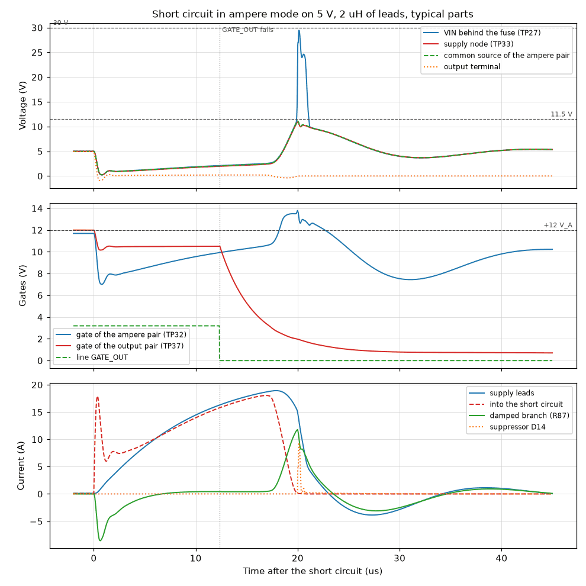

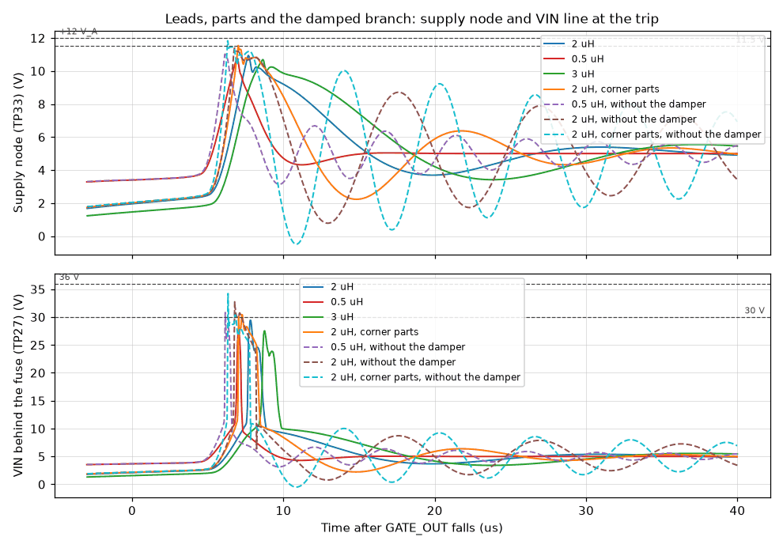

Notes:

- The external supply is a voltage source behind its leads, 40 mohm per uH: a
  supply that limits its current at 10 A still delivers the surge from its
  output capacitor, which this stands for. The short circuit is 5 mohm behind 50
  nH, or behind 1 uH and 40 mohm for 1 m of cable.
- The trip is not simulated as a program: a first pass finds the instant at
  which the 0.1 ohm shunt passes 115 mV, and the line GATE_OUT falls 0.3 us plus
  the qualification time after it. The 0.3 us for amplifier, filter and
  comparator are an assumption. The output pair, its gate network and the
  suppressor of the output terminal are the parts of the schematic with the
  models of their block; this bench does not judge them.
- The voltage on VIN behind the fuse is the voltage across the suppressor D14,
  the detector divider and the monitor divider. The transistor Q5 blocks that
  voltage less the voltage of its source, which stands near 10 V at that moment:
  that difference, not the terminal voltage, is what its 30 V rating limits.
- The suppressor model clamps at the datasheet maximum for a pulse of a
  millisecond; in microseconds a real part clamps lower. The corner parts are:
  transistors with the lowest threshold, the diodes of the gate bound with the
  highest forward voltage, the suppressor at its upper limit and both capacitors
  of the node at 40 % of their value (an assumption for their loss under bias).
- The transistor models have no avalanche and no heating. The energy in the
  transistor on the supply side is compared with its avalanche rating for want
  of a better figure: the datasheet gives the safe operating area from 10 us on,
  where 20 V allow about 60 A.
- The gate of the ampere pair is bound through two diodes in series: one diode
  into the driver output behind 22 ohm, and from there the second one to +12
  V_A. It therefore rises to about two diode drops above the rail while the
  bound carries current.

Models. written here: BAV199, BAV199_HI, CSD17577Q3A, IRLML0030,
IRLML0030_CLAMP, MCP656X, MUX509, OUTPUT_PTVS15V, PATH_BC847B, PATH_BSS138,
PATH_CSD17577_LO, PATH_FUSE_0466004, PATH_SMAJ20CA, PATH_SMAJ20CA_HI,
PATH_SMAJ20CA_LO, TC4427CH.

Decks: [short.2uh.cir](short.2uh.cir).

## `path_switching/trip`

**Ampere mode: the output opens at 0.5 A to 1.2 A behind 0.5 uH to 3 uH of
supply leads.**

The ampere pair carries 0.5 A to 1.2 A and the output opens. The load current
stops within 0.1 us, faster than the output pair opens, or within 5 us. The
current of the supply leads then has to go into the capacitor of the supply node
and its damped branch, drawn as on the final schematic. The run shows the supply
node, the VIN line behind the fuse and the parts between them, each against its
rating. It is repeated with the two capacitors at 40 % of their value and, for
comparison, without the damped branch.

Answers: sections 4.3 and 4.9 (supply node, D-63; bound of the gate, D-61),
section 4.4 (trip).

| Figure | Simulated | Vendor models | Specification | Limits | Verdict | Source |
| --- | --- | --- | --- | --- | --- | --- |
| Highest voltage of the supply node: 3 uH, 1.2 A, released in 0.1 us | 5.607 V | 5.605 V | | at most 11.5 V | pass | section 4.3: the node stays below 11.5 V |
| Highest voltage on VIN behind the fuse: 3 uH, 1.2 A, released in 0.1 us | 5.61 V | 5.609 V | | | | |
| Highest voltage of the supply node: 0.5 uH, 1.2 A, released in 0.1 us | 5.358 V | 5.356 V | | at most 11.5 V | pass | section 4.3: the node stays below 11.5 V |
| Highest voltage on VIN behind the fuse: 0.5 uH, 1.2 A, released in 0.1 us | 5.363 V | 5.362 V | | | | |
| Highest voltage of the supply node: 1 uH, 1.2 A, released in 0.1 us | 5.428 V | 5.426 V | | at most 11.5 V | pass | section 4.3: the node stays below 11.5 V |
| Highest voltage on VIN behind the fuse: 1 uH, 1.2 A, released in 0.1 us | 5.433 V | 5.432 V | | | | |
| Highest voltage of the supply node: 2 uH, 1.2 A, released in 0.1 us | 5.522 V | 5.52 V | | at most 11.5 V | pass | section 4.3: the node stays below 11.5 V |
| Highest voltage on VIN behind the fuse: 2 uH, 1.2 A, released in 0.1 us | 5.527 V | 5.525 V | | | | |
| Highest voltage of the supply node: 3 uH, 0.5 A, released in 0.1 us | 5.253 V | 5.252 V | | at most 11.5 V | pass | section 4.3: the node stays below 11.5 V |
| Highest voltage on VIN behind the fuse: 3 uH, 0.5 A, released in 0.1 us | 5.254 V | 5.254 V | | | | |
| Highest voltage of the supply node: 3 uH, 1 A, released in 0.1 us | 5.506 V | 5.504 V | | at most 11.5 V | pass | section 4.3: the node stays below 11.5 V |
| Highest voltage on VIN behind the fuse: 3 uH, 1 A, released in 0.1 us | 5.509 V | 5.508 V | | | | |
| Highest voltage of the supply node: 3 uH, 1.2 A, released in 5 us | 5.569 V | 5.568 V | | at most 11.5 V | pass | section 4.3: the node stays below 11.5 V |
| Highest voltage on VIN behind the fuse: 3 uH, 1.2 A, released in 5 us | 5.573 V | 5.571 V | | | | |
| Highest voltage of the supply node: 3 uH, 1.2 A, released in 0.1 us, capacitors at 40 % | 6.046 V | 6.045 V | | at most 11.5 V | pass | section 4.3: the node stays below 11.5 V |
| Highest voltage on VIN behind the fuse: 3 uH, 1.2 A, released in 0.1 us, capacitors at 40 % | 6.049 V | 6.047 V | | | | |
| Highest voltage of the supply node: 3 uH, 1.2 A, released in 0.1 us, without the damper | 6.84 V | 6.839 V | | | | |
| Highest voltage on VIN behind the fuse: 3 uH, 1.2 A, released in 0.1 us, without the damper | 6.84 V | 6.839 V | | | | |
| Highest voltage of the supply node: 3 uH, 1.2 A, released in 0.1 us, without the damper, capacitors at 40 % | 7.777 V | 7.776 V | | | | |
| Highest voltage on VIN behind the fuse: 3 uH, 1.2 A, released in 0.1 us, without the damper, capacitors at 40 % | 7.777 V | 7.776 V | | | | |
| Largest voltage across the transistor on the supply side, runs with the damper | 5.26 mV | 6.519 mV | | at most 30 V | pass | rating of the CSD17577Q3A, 30 V (TI SLPS515A, page 1) |
| Largest voltage across the transistor on the ladder side, runs with the damper | 2.991 mV | 3.686 mV | | at most 30 V | pass | rating of the CSD17577Q3A, 30 V (TI SLPS515A, page 1) |
| Largest gate-source voltage of the pair, runs with the damper | 6.854 V | 6.856 V | | at most 20 V | pass | rating of the CSD17577Q3A, 20 V (TI SLPS515A, page 1) |
| Highest voltage of the gate, runs with the damper | 12.73 V | 12.73 V | | | | |
| Largest current in the diode from the gate to +12 V_A, runs with the damper | 26.4 nA | 23.54 nA | | at most 500 mA | pass | repetitive peak current of the BAV199, 0.5 A (Nexperia, page 2) |
| Largest current in the suppressor of VIN, runs with the damper | 873.2 µA | 894 µA | | at most 12.3 A | pass | peak pulse current of the SMAJ20CA, 12.3 A (Vishay 88390, page 2) |
| Highest voltage on the capacitor of the damped branch, runs with the damper | 5.988 V | 5.986 V | | at most 25 V | pass | rated voltage of C62 and C63, 25 V |
| Largest current in the resistor of the damped branch, runs with the damper | 872.4 mA | 872.7 mA | | | | |
| Largest energy in the resistor of the damped branch per release | 1.499 µJ | 1.494 µJ | | | | |

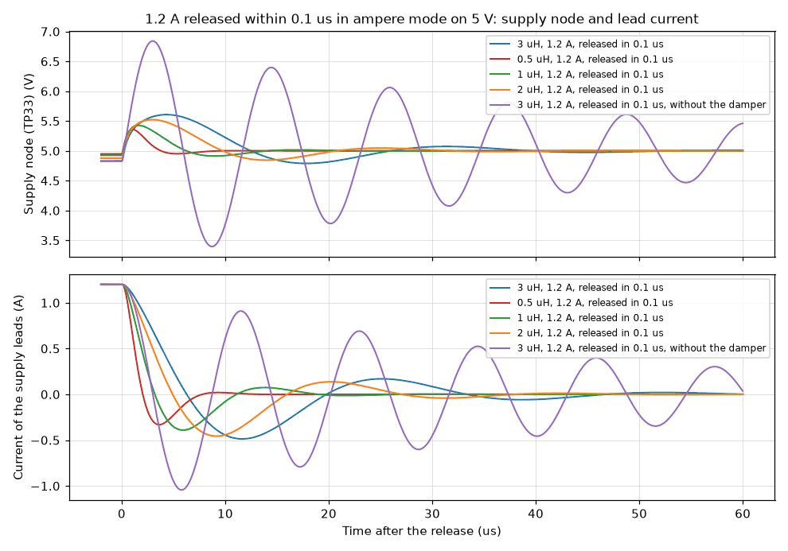

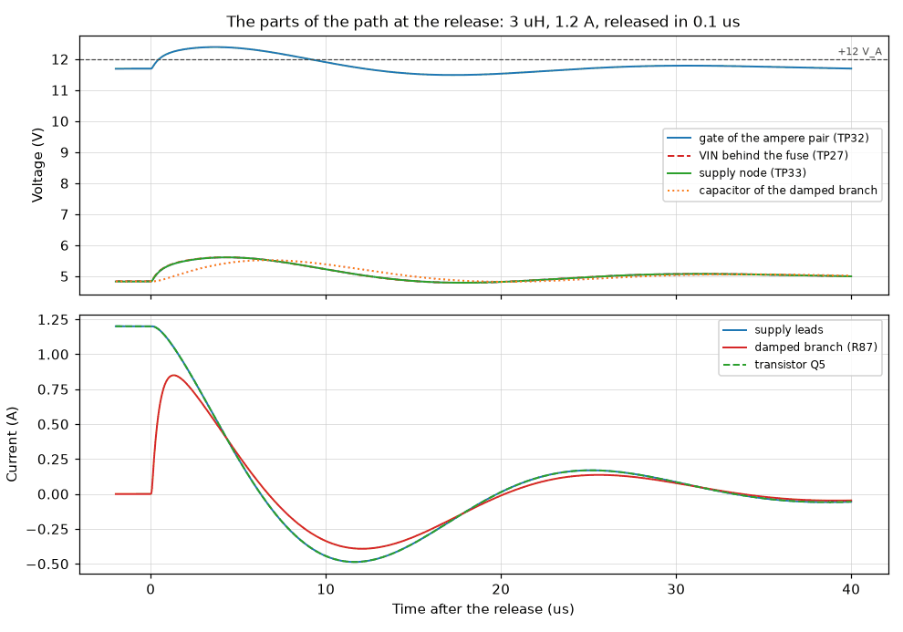

Notes:

- The output pair and the device under test belong to another block. A current
  sink on the node after the shunts stands for them; it stops within 0.1 us,
  which is faster than the output pair opens (its gate is below 2 V within 7 us,
  specification), or within 5 us.
- At these currents the leads hold microjoules: 2.2 uJ at 1.2 A and 3 uH. The
  node rises by 0.4 V to 1.1 V with the damped branch and by 1.9 V to 2.8 V
  without it, and neither the bound of the gate nor the suppressor takes part.
  Voltages of 10 V to 11 V on the node and of 30 V and more on the VIN line
  belong to a short circuit, in which the leads carry 15 A to 34 A when the trip
  acts, and to a supply that leaves its range while the pair is closed: the
  benches short, overvoltage and reversal run those cases.
- The external supply is a voltage source behind its leads, 40 mohm per uH, and
  it takes current back: after the release the node rings against the leads
  through the closed pair.
- The share of 40 % for the capacitors under bias is an assumption.

Models. written here: BAV199, CSD17577Q3A, IRLML0030, IRLML0030_CLAMP, MCP656X,
MUX509, PATH_BC847B, PATH_BSS138, PATH_FUSE_0466004, PATH_SMAJ20CA, TC4427CH.

Decks: [trip.3uh_1p2a_0p1us.cir](trip.3uh_1p2a_0p1us.cir).

## `path_switching/withstand`

**The VIN terminal from -20 V to +20 V with the ampere pair open.**

The VIN terminal is taken slowly to +20 V and to -20 V with the ampere pair
open. Three states of the instrument are run: idle with its rails present,
without any supply, and with source mode running at the highest output the
set-point path can command. The run shows the current that the terminal takes,
where it flows, and the voltages across the two transistors of the pair. The
sweep moves at 0.5 V/ms and rests 10 ms at each end, where the values are read.

Answers: requirement R-09, section 4.9 (VIN, D-60; hold-off below ground, D-61),
sections 11 and 16.

| Figure | Simulated | Vendor models | Specification | Limits | Verdict | Source |
| --- | --- | --- | --- | --- | --- | --- |
| Current into the terminal at +20 V, instrument idle | 184.6 µA | 184.6 µA | 190 µA (-2.83 %) | at most 1 mA | pass | section 4.9: less than 1 mA; 0.19 mA at +20 V, simulated |
| Current out of the terminal at -20 V, instrument idle | 597.9 µA | 596.6 µA | 640 µA (-6.57 %) | at most 1 mA | pass | section 4.9: less than 1 mA; 0.64 mA at -20 V, simulated |
| Gate-source voltage of the ampere pair at -20 V, instrument idle | 25.97 mV | 12.54 mV | | at most 300 mV | pass | section 4.9: the hold-off transistor joins gate and common source (limit of this bench: well below the lowest threshold of 1.1 V) |
| Detector input at -20 V, instrument idle | -719.6 mV | -719.6 mV | | at least -1 V | pass | section 16: input pin above -1.0 V with -20 V |
| Detector input above its supply at +20 V, instrument idle | 698.5 mV | 698.5 mV | | at most 1 V | pass | rating of the comparator input, supply plus 1.0 V (Microchip DS20002139E, page 3) |
| Voltage across the transistor on the supply side at +20 V, instrument idle | 19.95 V | 19.96 V | | at most 30 V | pass | rating of the CSD17577Q3A, 30 V (TI SLPS515A, page 1) |
| Voltage across the transistor on the ladder side at -20 V, instrument idle | 19.57 V | 19.52 V | | at most 30 V | pass | rating of the CSD17577Q3A, 30 V (TI SLPS515A, page 1) |
| Largest change of the supply node over the sweep, instrument idle | 1.044 mV | 983.8 µV | | at most 10 mV | pass | section 11: TP33 unchanged; 10 mV asked here |
| Detector output at +20 V, instrument idle | 3.3 V | 3.3 V | | at least 3 V | pass | section 16: TP30 steady high with +20 V on VIN and power on; 3.0 V asked here |
| Current into the terminal at 5 V with the pair open, instrument idle | 35.61 µA | 35.59 µA | 35 µA (+1.74 %) | 33 µA to 37 µA | pass | section 4.9: 35 uA from a 5 V supply, calculated; 5 % asked here |
| Collector current of the hold-off transistor at -20 V, instrument idle | 195.4 µA | 195.1 µA | | | | |
| Current into the terminal at +20 V, instrument without supply | 213.1 µA | 213.1 µA | | at most 1 mA | pass | section 4.9: less than 1 mA; 0.19 mA at +20 V, simulated |
| Current out of the terminal at -20 V, instrument without supply | 597.9 µA | 596.6 µA | | at most 1 mA | pass | section 4.9: less than 1 mA; 0.64 mA at -20 V, simulated |
| Gate-source voltage of the ampere pair at -20 V, instrument without supply | 25.97 mV | 12.54 mV | | at most 300 mV | pass | section 4.9: the hold-off transistor joins gate and common source (limit of this bench: well below the lowest threshold of 1.1 V) |
| Detector input at -20 V, instrument without supply | -719.6 mV | -719.6 mV | | at least -1 V | pass | section 16: input pin above -1.0 V with -20 V |
| Detector input above its supply at +20 V, instrument without supply | 719.6 mV | 719.6 mV | | at most 1 V | pass | rating of the comparator input, supply plus 1.0 V (Microchip DS20002139E, page 3) |
| Voltage across the transistor on the supply side at +20 V, instrument without supply | 19.95 V | 19.96 V | | at most 30 V | pass | rating of the CSD17577Q3A, 30 V (TI SLPS515A, page 1) |
| Voltage across the transistor on the ladder side at -20 V, instrument without supply | 19.57 V | 19.52 V | | at most 30 V | pass | rating of the CSD17577Q3A, 30 V (TI SLPS515A, page 1) |
| Largest change of the supply node over the sweep, instrument without supply | 1.044 mV | 983.8 µV | | at most 10 mV | pass | section 11: TP33 unchanged; 10 mV asked here |
| Current into the terminal at 5 V, instrument without supply | 49.77 µA | 49.75 µA | 49 µA (+1.57 %) | 44 µA to 54 µA | pass | section 4.9: about 49 uA, the clamp of the detector conducts into the dead 3V3_A, calculated; 10 % asked here |
| Current into the terminal at +20 V, source mode running at 5.26 V | 184.6 µA | 184.6 µA | 190 µA (-2.83 %) | at most 1 mA | pass | section 4.9: less than 1 mA; 0.19 mA at +20 V, simulated |
| Current out of the terminal at -20 V, source mode running at 5.26 V | 597.9 µA | 596.6 µA | 640 µA (-6.57 %) | at most 1 mA | pass | section 4.9: less than 1 mA; 0.64 mA at -20 V, simulated |
| Gate-source voltage of the ampere pair at -20 V, source mode running at 5.26 V | 25.97 mV | 12.54 mV | | at most 300 mV | pass | section 4.9: the hold-off transistor joins gate and common source (limit of this bench: well below the lowest threshold of 1.1 V) |
| Detector input at -20 V, source mode running at 5.26 V | -719.6 mV | -719.6 mV | | at least -1 V | pass | section 16: input pin above -1.0 V with -20 V |
| Detector input above its supply at +20 V, source mode running at 5.26 V | 698.5 mV | 698.5 mV | | at most 1 V | pass | rating of the comparator input, supply plus 1.0 V (Microchip DS20002139E, page 3) |
| Voltage across the transistor on the supply side at +20 V, source mode running at 5.26 V | 19.95 V | 19.96 V | | at most 30 V | pass | rating of the CSD17577Q3A, 30 V (TI SLPS515A, page 1) |
| Voltage across the transistor on the ladder side at -20 V, source mode running at 5.26 V | 24.83 V | 24.78 V | 25.3 V (-1.86 %) | at most 30 V | pass | section 4.9: 25.3 V with source mode at its ceiling, calculated |
| Largest change of the supply node over the sweep, source mode running at 5.26 V | 11.41 nV | 10.34 nV | | at most 10 mV | pass | section 11: TP33 unchanged; 10 mV asked here |

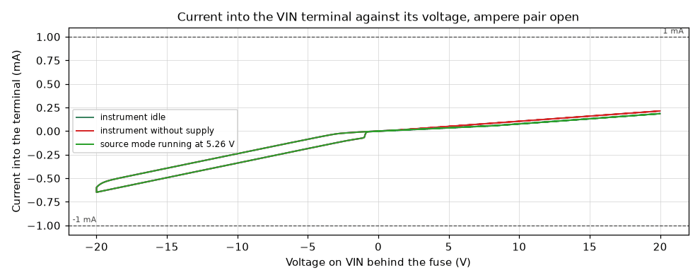

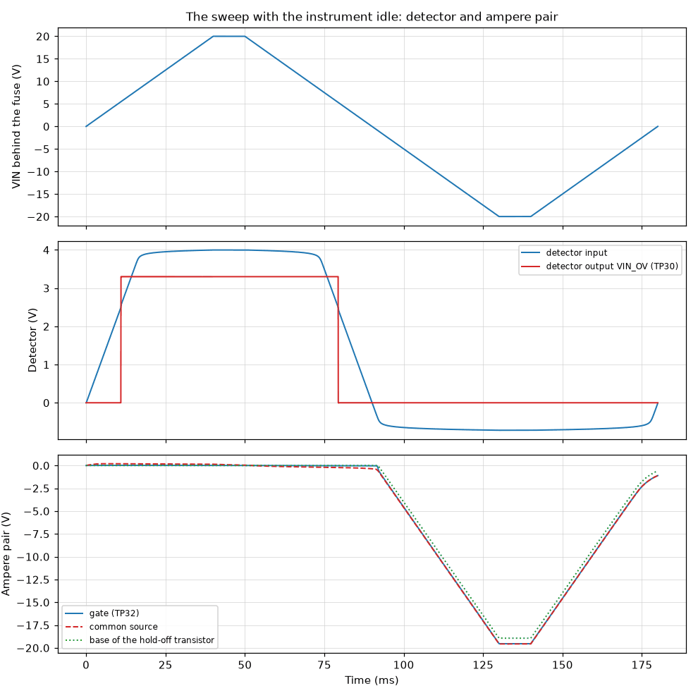

Notes:

- What takes the current at +20 V: the divider of the detector with its clamp
  D15 into 3V3_A (0.14 mA) and the divider of the VIN monitor (0.05 mA). At -20
  V the hold-off transistor adds its base current through R86 and the current of
  R80 from the driver output, about 0.2 mA each.
- No rail has a load in these runs: a dead rail is a source of 0 V, which stands
  for the loads that hold it there. A live 3V3_A takes the clamp current of 0.1
  mA without rising, which a real regulator does only while its loads take more
  than that.
- The models say nothing about leakage: the currents here are those of the
  resistors. The transistor models have no breakdown; the voltages across them
  are compared with the 30 V rating.
- The suppressor D14 does not conduct at 20 V in the model (breakdown at 23.35
  V, 22.2 V at the least by its datasheet).

Models. written here: BAV199, CSD17577Q3A, MCP656X, PATH_BC847B, PATH_BSS138,
PATH_FUSE_0466004, PATH_SMAJ20CA, TC4427CH.

Decks: [withstand.idle.cir](withstand.idle.cir).
