# Simulation Results: Power Input and Logic Supplies

Everything on this page is a simulation result. Nothing here is measured on
hardware. The page is written by `circuit-sim report` from the result files
beside it; do not edit it by hand.

## `power_input/contact-bounce`

**A contact of the USB-C cable opens and closes again: what reaches the
multiplexer.**

The carrier is on a 5.5 V source when a contact of the cable opens and closes.
In the first runs the carrier is running. While the contact is open the
capacitors of the board feed it and every node falls with them; when the contact
closes, the cable and the capacitor at the receptacle ring, and the limiter
passes what reaches it until its current limit acts. The rail hangs on input 1
through the multiplexer and takes part. In the other runs the contact bounces
during the start, when the limiter has charged its output and the multiplexer
begins to charge the rail from the capacitors behind the limiter alone: input 1
then falls fast, and the rail does not help to damp the ring. The corner is a
limiter that clamps as late as its datasheet allows behind a short cable.

Answers: section 4.1 (limits of the USB-C input: a contact that opens and closes
again), section 14, section 16 (contact interrupted for 20 us to 20 ms).

| Figure | Simulated | Specification | Limits | Verdict | Source |
| --- | --- | --- | --- | --- | --- |
| Running at idle, late clamp, cable of 0.08 ohm and 0.3 uH: contact open for 20 us: highest level of input 1 after the contact has closed | 5.475 V | | at most 5.8 V | pass | section 16: contact interrupted for 20 us to 20 ms, TP2 below 5.8 V |
| Running at idle, late clamp, cable of 0.08 ohm and 0.3 uH: contact open for 100 us: highest level of input 1 after the contact has closed | 5.475 V | | at most 5.8 V | pass | section 16: contact interrupted for 20 us to 20 ms, TP2 below 5.8 V |
| Running at idle, late clamp, cable of 0.08 ohm and 0.3 uH: contact open for 300 us: highest level of input 1 after the contact has closed | 5.475 V | | at most 5.8 V | pass | section 16: contact interrupted for 20 us to 20 ms, TP2 below 5.8 V |
| Running at idle, late clamp, cable of 0.08 ohm and 0.3 uH: contact open for 1 ms: highest level of input 1 after the contact has closed | 5.475 V | | at most 5.8 V | pass | section 16: contact interrupted for 20 us to 20 ms, TP2 below 5.8 V |
| Running at idle, late clamp, cable of 0.08 ohm and 0.3 uH: contact open for 3 ms: highest level of input 1 after the contact has closed | 5.496 V | | at most 5.8 V | pass | section 16: contact interrupted for 20 us to 20 ms, TP2 below 5.8 V |
| Running at idle, late clamp, cable of 0.08 ohm and 0.3 uH: contact open for 20 ms: highest level of input 1 after the contact has closed | 5.491 V | | at most 5.8 V | pass | section 16: contact interrupted for 20 us to 20 ms, TP2 below 5.8 V |
| Running at idle, typical limiter, cable of 0.15 ohm and 0.5 uH: contact open for 100 us: highest level of input 1 after the contact has closed | 5.465 V | | at most 5.8 V | pass | section 16: contact interrupted for 20 us to 20 ms, TP2 below 5.8 V |
| Running at idle, typical limiter, cable of 0.15 ohm and 0.5 uH: contact open for 3 ms: highest level of input 1 after the contact has closed | 5.495 V | | at most 5.8 V | pass | section 16: contact interrupted for 20 us to 20 ms, TP2 below 5.8 V |
| Running at full output, late clamp, cable of 0.08 ohm and 0.3 uH: contact open for 20 us: highest level of input 1 after the contact has closed | 5.263 V | | at most 5.8 V | pass | section 16: contact interrupted for 20 us to 20 ms, TP2 below 5.8 V |
| Running at full output, late clamp, cable of 0.08 ohm and 0.3 uH: contact open for 100 us: highest level of input 1 after the contact has closed | 5.263 V | | at most 5.8 V | pass | section 16: contact interrupted for 20 us to 20 ms, TP2 below 5.8 V |
| Running at full output, late clamp, cable of 0.08 ohm and 0.3 uH: contact open for 300 us: highest level of input 1 after the contact has closed | 5.495 V | | at most 5.8 V | pass | section 16: contact interrupted for 20 us to 20 ms, TP2 below 5.8 V |
| During the start, late clamp, cable of 0.08 ohm and 0.3 uH: contact open from 0.9 ms to 1.45 ms after the plug: highest level of input 1 after the contact has closed | 5.441 V | | at most 5.8 V | pass | section 16: contact interrupted for 20 us to 20 ms, TP2 below 5.8 V |
| During the start, late clamp, cable of 0.08 ohm and 0.3 uH: contact open from 0.9 ms to 1.5 ms after the plug: highest level of input 1 after the contact has closed | 5.44 V | | at most 5.8 V | pass | section 16: contact interrupted for 20 us to 20 ms, TP2 below 5.8 V |
| During the start, late clamp, cable of 0.08 ohm and 0.3 uH: contact open from 0.9 ms to 1.55 ms after the plug: highest level of input 1 after the contact has closed | 5.44 V | | at most 5.8 V | pass | section 16: contact interrupted for 20 us to 20 ms, TP2 below 5.8 V |
| During the start, late clamp, cable of 0.08 ohm and 0.3 uH: contact open from 0.9 ms to 1.6 ms after the plug: highest level of input 1 after the contact has closed | 5.44 V | | at most 5.8 V | pass | section 16: contact interrupted for 20 us to 20 ms, TP2 below 5.8 V |
| During the start, late clamp, cable of 0.08 ohm and 0.3 uH: contact open from 0.9 ms to 1.65 ms after the plug: highest level of input 1 after the contact has closed | 5.44 V | | at most 5.8 V | pass | section 16: contact interrupted for 20 us to 20 ms, TP2 below 5.8 V |
| During the start, late clamp, cable of 0.08 ohm and 0.3 uH: contact open from 0.9 ms to 1.75 ms after the plug: highest level of input 1 after the contact has closed | 5.5 V | | at most 5.8 V | pass | section 16: contact interrupted for 20 us to 20 ms, TP2 below 5.8 V |
| During the start, typical limiter, cable of 0.15 ohm and 0.5 uH: contact open from 0.9 ms to 1.6 ms after the plug: highest level of input 1 after the contact has closed | 5.417 V | | at most 5.8 V | pass | section 16: contact interrupted for 20 us to 20 ms, TP2 below 5.8 V |
| Running at idle, late clamp, cable of 0.08 ohm and 0.3 uH: contact open for 20 us: input 1 when the contact closes | 5.435 V | | | | |
| Running at idle, late clamp, cable of 0.08 ohm and 0.3 uH: contact open for 100 us: input 1 when the contact closes | 5.344 V | | | | |
| Running at idle, late clamp, cable of 0.08 ohm and 0.3 uH: contact open for 300 us: input 1 when the contact closes | 5.123 V | | | | |
| Running at idle, late clamp, cable of 0.08 ohm and 0.3 uH: contact open for 1 ms: input 1 when the contact closes | 4.353 V | | | | |
| Running at idle, late clamp, cable of 0.08 ohm and 0.3 uH: contact open for 3 ms: input 1 when the contact closes | 3.86 V | | | | |
| Running at idle, late clamp, cable of 0.08 ohm and 0.3 uH: contact open for 20 ms: input 1 when the contact closes | 2.245 V | | | | |
| During the start, late clamp, cable of 0.08 ohm and 0.3 uH: contact open from 0.9 ms to 1.45 ms after the plug: input 1 when the contact closes | 4.782 V | | | | |
| During the start, late clamp, cable of 0.08 ohm and 0.3 uH: contact open from 0.9 ms to 1.5 ms after the plug: input 1 when the contact closes | 4.353 V | | | | |
| During the start, late clamp, cable of 0.08 ohm and 0.3 uH: contact open from 0.9 ms to 1.55 ms after the plug: input 1 when the contact closes | 3.919 V | | | | |
| During the start, late clamp, cable of 0.08 ohm and 0.3 uH: contact open from 0.9 ms to 1.6 ms after the plug: input 1 when the contact closes | 3.503 V | | | | |
| During the start, late clamp, cable of 0.08 ohm and 0.3 uH: contact open from 0.9 ms to 1.65 ms after the plug: input 1 when the contact closes | 3.106 V | | | | |
| During the start, late clamp, cable of 0.08 ohm and 0.3 uH: contact open from 0.9 ms to 1.75 ms after the plug: input 1 when the contact closes | 2.326 V | | | | |
| Highest level of input 1 after the contact has closed, in all runs | 5.5 V | 5.945 V (-7.49 %) | at most 6 V | pass | section 4.1: within 25 mV to 85 mV of the 6 V rating in the worst corners (simulated before); TPS2116 datasheet, page 4: 6 V |
| Highest level of the 5 V rail after the contact has closed, in all runs | 5.496 V | | at most 6 V | pass | TPS2116 and LP5907 datasheets, page 4 of each: 6 V |
| Highest level of the 5 V rail above the source, in all runs | -4.485 mV | | at most 0 V | pass | section 4.1: the rail never rises above the source |
| Highest voltage at the receptacle after the contact has closed, in all runs | 7.37 V | | at most 11.1 V | pass | section 4.1: the suppressor conducts from 11.1 V |
| Largest current of the cable when the contact closes, in all runs | 8.489 A | | | | |

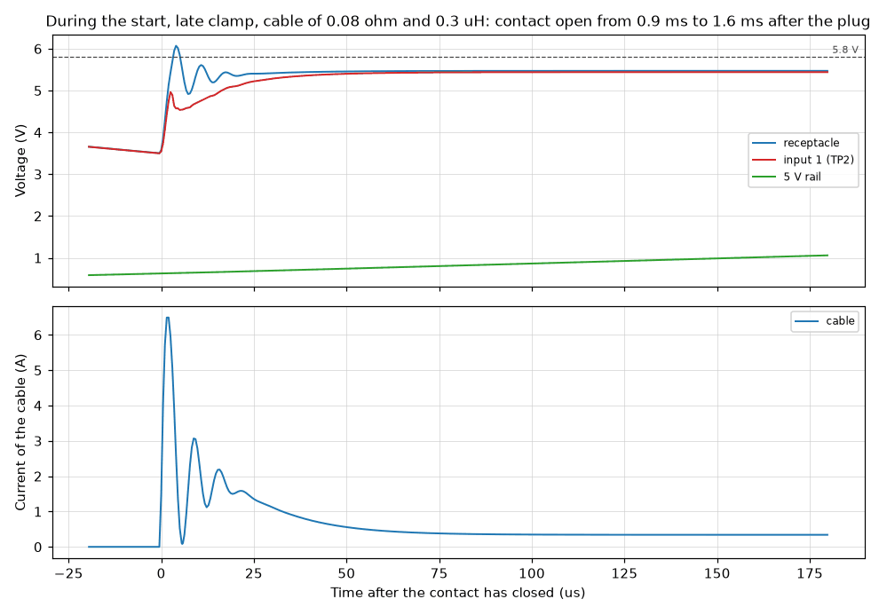

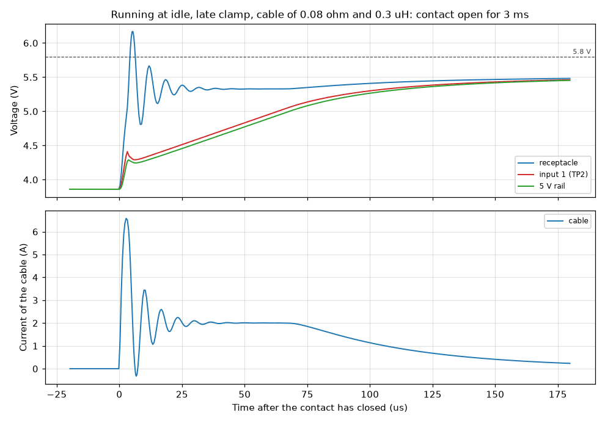

Notes:

- The source is an ideal 5.5 V behind its cable, and the contact is a
  conductance that opens within 1 us and closes within 50 ns: assumptions. A
  real contact bounces several times; one opening is simulated.
- The cable values are assumptions. The late clamp is the datasheet limit of
  5.83 V at the input with an output level of 5.61 V; the reaction time of the
  clamp is the typical 5 us, for which the datasheet states no limit.
- The cable of the module is not plugged, so the module is fed from the rail and
  empties the board: after a gap of 20 ms input 1 stands at 2.2 V, the limiter
  has turned off (2.76 V at the receptacle) and the run ends with a new start.
  After the shorter gaps the limiter is still on.
- The current through the limiter in the first microseconds after the contact
  has closed is bounded by resistances alone in the model, which has no
  saturation of the pass transistor; the ring at the receptacle that follows
  when the limiter cuts that current back is an upper bound for the same reason.
- The ceramic capacitors have the capacitance they keep at 5 V; at a lower
  voltage they have more, which these runs do not show.
- The supervisor has its release delay shortened to 1 ms, and each run ends
  before it would release the carrier again.

Models. written here: B0530W, DIGITAL_1N5819HW, DIGITAL_PICO2_SUPPLY,
L_74438357100, PWRIN_1N5819HW, PWRIN_LED_GREEN, PWRIN_LP5907, PWRIN_SMAJ10A,
PWRIN_TPD4E1U06_CH, PWRIN_TPS2116, PWRIN_TPS259621, PWRIN_TPS3808G01,
PWRIN_WCAP_47U.

Decks: [contact-bounce.run-3ms.cir](contact-bounce.run-3ms.cir),
[contact-bounce.start-1p6ms.cir](contact-bounce.start-1p6ms.cir).

## `power_input/current-limit`

**The current limits of the two inputs and a short circuit of the 5 V rail.**

Each input supplies the carrier alone under a rising load; then the rail is
shorted. The carrier runs at idle on a stiff 5 V source. A load on the 5 V rail
rises within 5 ms to more than the limiter of that input gives, so the rail
gives way and ends near ground, where the limiter folds its limit back. The
current into the limiter while the rail falls is the limit that the resistor at
its ILM pin sets. In two more runs the rail of the idle carrier is shorted to
ground with 10 mohm.

Answers: section 2 (R-14), section 4.1 (limiters, power budget, bring-up),
section 3 (power tree).

| Figure | Simulated | Specification | Limits | Verdict | Source |
| --- | --- | --- | --- | --- | --- |
| Module input: current into the limiter while it limits | 758.5 mA | 760 mA (-0.19 %) | 670 mA to 850 mA | pass | section 4.1: limit with the tolerances (calculated) |
| Module input: mean current into the limiter after the rail has collapsed | 67.09 mA | | | | |
| USB-C input: current into the limiter while it limits | 2.006 A | 2 A (+0.31 %) | 1.81 A to 2.17 A | pass | section 4.1: limit with the tolerances (calculated) |
| USB-C input: mean current into the limiter after the rail has collapsed | 302.1 mA | | | | |
| USB-C input: voltage at TP3 per ampere, at 1 A | 0.297 V/A | 0.297 V/A (+0.01 %) | 0.2822 V/A to 0.3119 V/A | pass | section 4.1: 0.297 V per ampere (calculated from the datasheet gain) |
| Short circuit, USB-C input: largest current through the multiplexer | 30.5 A | | at most 4 A | **FAIL** | TPS2116 datasheet, page 4: 4 A for a pulse; the specification states no figure for a short circuit of the rail |
| Short circuit, USB-C input: time the multiplexer carries more than 4 A | 1.429 µs | | | | |
| Short circuit, USB-C input: charge through the multiplexer in the first 20 us | 30.82 µC | | | | |
| Short circuit, USB-C input: largest current from the source | 7.607 A | | | | |
| Short circuit, USB-C input: source current back at the limit after | 4.299 µs | | | | |
| Short circuit, USB-C input: mean source current from 20 us to 200 us | 57.39 mA | | at most 2.17 A | pass | section 4.1: the limiters regulate the current in an overload |
| Short circuit, USB-C input: highest level of 3V3_A above the rail | 1.539 V | | at most 300 mV | **FAIL** | LP5907 datasheet, page 4: output at most 0.3 V above the input; the specification states no figure |
| Short circuit, Module input: largest current through the multiplexer | 8.863 A | | at most 4 A | **FAIL** | TPS2116 datasheet, page 4: 4 A for a pulse; the specification states no figure for a short circuit of the rail |
| Short circuit, Module input: time the multiplexer carries more than 4 A | 592.6 ns | | | | |
| Short circuit, Module input: charge through the multiplexer in the first 20 us | 4.003 µC | | | | |
| Short circuit, Module input: largest current from the source | 5.686 A | | | | |
| Short circuit, Module input: source current back at the limit after | 1.536 µs | | | | |
| Short circuit, Module input: mean source current from 20 us to 200 us | 6.676 mA | | at most 850 mA | pass | section 4.1: the limiters regulate the current in an overload |
| Short circuit, Module input: highest level of 3V3_A above the rail | 1.331 V | | at most 300 mV | **FAIL** | LP5907 datasheet, page 4: output at most 0.3 V above the input; the specification states no figure |

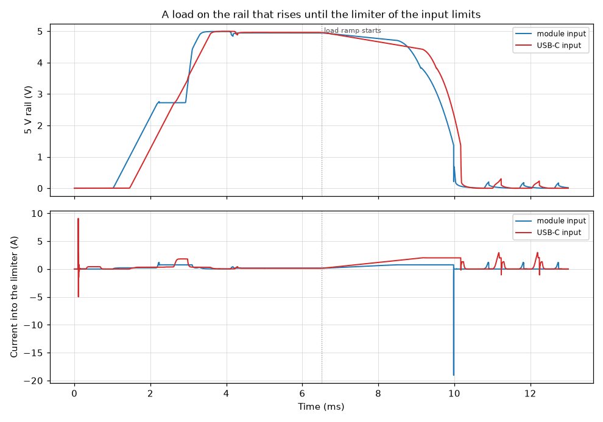

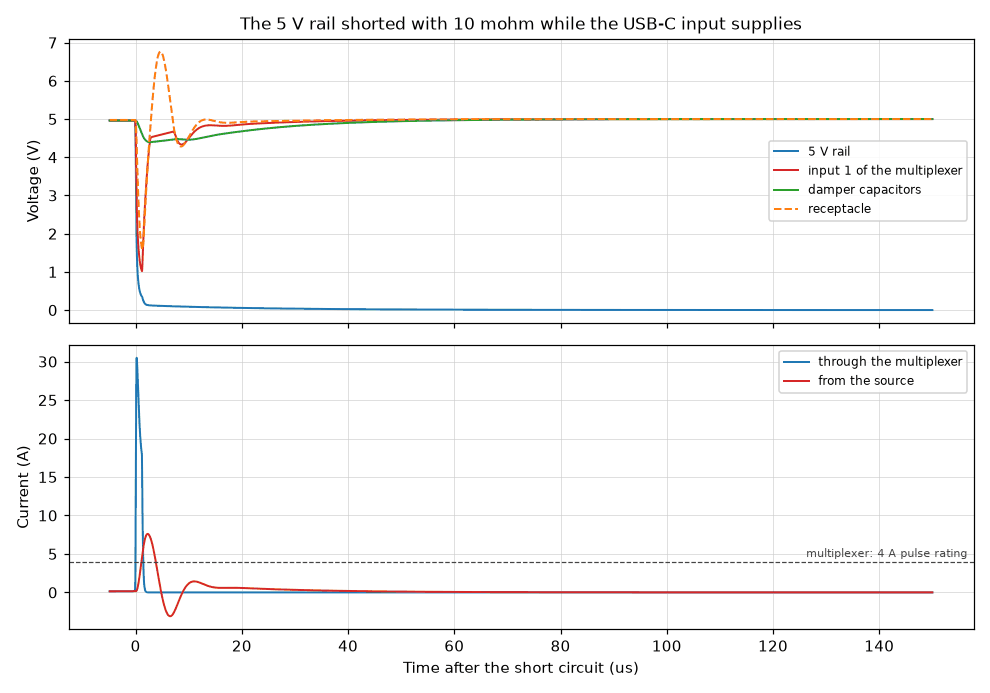

Notes:

- The sources are stiff: 5.0 V behind 0.15 ohm and 0.5 uH on USB-C, behind 0.25
  ohm and 0.8 uH on the module input. The supervisor has its delay shortened to
  1 ms in these runs, which changes nothing in the figures.
- The limit is that of typical parts: the model follows the equation of the
  datasheet with the resistor of the schematic. The band of the specification
  comes from the tolerances of the datasheet, which the run does not vary.
- The fold-back current of the module input (0.34 A) is an interpolation between
  the two resistor values that the datasheet shows, and so an assumption.
- In a short circuit the damper capacitors (2 x 22 uF behind 0.33 ohm) and the 1
  uF at the input discharge through the multiplexer, which has no current limit
  of its own. The peak of that current is set by 0.33 ohm, the on-resistance and
  the short itself, not by a model limit.
- The peak of the source current in a short circuit is an upper bound: the model
  of the limiter has no saturation current, and the datasheet gives none.
- The multiplexer model opens its channel when its input has fallen below 1.4 V,
  which a short circuit of the rail does within a microsecond, and starts again
  with its soft start: the levels are assumptions for the reset that the
  datasheet describes without figures. A part that stays on carries the
  discharge of the damper, 13 A at first with a time constant of 11 us
  (calculated from 0.33 ohm, the on-resistance and 30 uF), and then the current
  of the limiter.
- With the rail at ground the 3.3 V rails stand above their input, by the
  forward voltage of a body diode that the regulator model assumes, until the
  2.4 uF and 3.8 uF on them are empty.
- The thermal shutdown of the limiters and its retry after 95 ms are not
  modelled: a sustained overload ends there, not at the fold-back current.

Models. written here: B0530W, DIGITAL_1N5819HW, DIGITAL_PICO2_SUPPLY,
L_74438357100, PWRIN_1N5819HW, PWRIN_LED_GREEN, PWRIN_LP5907, PWRIN_SMAJ10A,
PWRIN_TPD4E1U06_CH, PWRIN_TPS2116, PWRIN_TPS259621, PWRIN_TPS3808G01,
PWRIN_WCAP_47U.

Decks: [current-limit.ramp-module.cir](current-limit.ramp-module.cir),
[current-limit.ramp-usbc.cir](current-limit.ramp-usbc.cir),
[current-limit.short-usbc.cir](current-limit.short-usbc.cir).

## `power_input/load-step`

**A load step of 1 A on the 5 V rail: the dip and its recovery with the
capacitors as drawn.**

The idle carrier runs from USB-C and takes 1 A more from the rail within a
microsecond. The step stands for the source meter when its output steps to full
current. The rail holds 47 uF of aluminum capacitor with its series resistance
and about 15 uF of ceramic capacitance under bias; the supply comes through the
multiplexer, the limiter with its damper, and the cable. The run is repeated
with half the series resistance, with a cable of four times the inductance, and
with an edge of 50 us.

Answers: section 3 (capacitance of the 5 V rail), section 4.1 (thresholds of the
rail), rule F-35.

| Figure | Simulated | Specification | Limits | Verdict | Source |
| --- | --- | --- | --- | --- | --- |
| ESR 0.44 ohm, cable 0.5 uH, edge 1 us: lowest level of the rail | 4.677 V | | at least 4.25 V | pass | section 4.1: firmware limit of the rail, 4.25 V (F-14) |
| ESR 0.44 ohm, cable 0.5 uH, edge 1 us: dip below the level before the step | 282.3 mV | | | | |
| ESR 0.44 ohm, cable 0.5 uH, edge 1 us: dip below the level the rail settles at | 9.213 µV | | | | |
| ESR 0.44 ohm, cable 0.5 uH, edge 1 us: rail within 20 mV of its new level after | 111.9 µs | | | | |
| ESR 0.44 ohm, cable 0.5 uH, edge 1 us: largest excursion of 3V3_A | 773.3 µV | | at most 66 mV | pass | LP5907 datasheet, page 5: 2 % |
| ESR 0.22 ohm, cable 0.5 uH, edge 1 us: lowest level of the rail | 4.677 V | | at least 4.25 V | pass | section 4.1: firmware limit of the rail, 4.25 V (F-14) |
| ESR 0.22 ohm, cable 0.5 uH, edge 1 us: dip below the level before the step | 282.3 mV | | | | |
| ESR 0.22 ohm, cable 0.5 uH, edge 1 us: dip below the level the rail settles at | 9.308 µV | | | | |
| ESR 0.22 ohm, cable 0.5 uH, edge 1 us: rail within 20 mV of its new level after | 103.2 µs | | | | |
| ESR 0.22 ohm, cable 0.5 uH, edge 1 us: largest excursion of 3V3_A | 758.6 µV | | at most 66 mV | pass | LP5907 datasheet, page 5: 2 % |
| ESR 0.44 ohm, cable 2 uH, edge 1 us: lowest level of the rail | 4.677 V | | at least 4.25 V | pass | section 4.1: firmware limit of the rail, 4.25 V (F-14) |
| ESR 0.44 ohm, cable 2 uH, edge 1 us: dip below the level before the step | 282.3 mV | | | | |
| ESR 0.44 ohm, cable 2 uH, edge 1 us: dip below the level the rail settles at | 9.526 µV | | | | |
| ESR 0.44 ohm, cable 2 uH, edge 1 us: rail within 20 mV of its new level after | 97.13 µs | | | | |
| ESR 0.44 ohm, cable 2 uH, edge 1 us: largest excursion of 3V3_A | 783.8 µV | | at most 66 mV | pass | LP5907 datasheet, page 5: 2 % |
| ESR 0.44 ohm, cable 0.5 uH, edge 50 us: lowest level of the rail | 4.677 V | | at least 4.25 V | pass | section 4.1: firmware limit of the rail, 4.25 V (F-14) |
| ESR 0.44 ohm, cable 0.5 uH, edge 50 us: dip below the level before the step | 281.7 mV | | | | |
| ESR 0.44 ohm, cable 0.5 uH, edge 50 us: dip below the level the rail settles at | 9.335 µV | | | | |
| ESR 0.44 ohm, cable 0.5 uH, edge 50 us: rail within 20 mV of its new level after | 113.5 µs | | | | |
| ESR 0.44 ohm, cable 0.5 uH, edge 50 us: largest excursion of 3V3_A | 725.1 µV | | at most 66 mV | pass | LP5907 datasheet, page 5: 2 % |
| Rail before the step (0.12 A at idle) | 4.959 V | | | | |
| Rail after the step (1.12 A) | 4.677 V | | at least 4.25 V | pass | section 4.1: firmware limit of the rail, 4.25 V (F-14) |
| Fall of the rail from before the step to its new level | 282.3 mV | | at most 300 mV | pass | rule F-35: a step of more than 0.3 V marks samples as not valid |
| Lowest level of 5V_OK | 4.412 V | | at least 1.2 V | pass | the carrier keeps running; 1.2 V is the enable level of the regulators |
| Lowest voltage at the receptacle | 4.821 V | | | | |

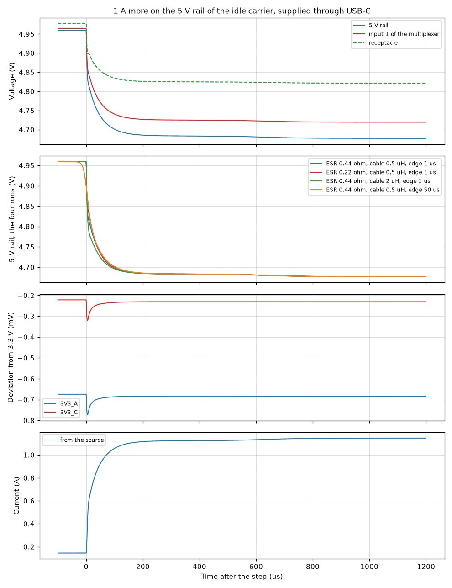

Notes:

- The source is 5.0 V behind 0.15 ohm of cable: an assumption. The new level of
  the rail is the old one less the step times the cable and the path, about 0.28
  V per ampere; without the cable it is 0.13 V per ampere.
- The first part of the dip is the step in the series resistance of the aluminum
  capacitor, which carries most of it until the ceramic capacitors and the
  supply take over. The ceramic capacitors have the capacitance they keep at 5
  V.
- The step is a current sink. The source meter is a converter and takes constant
  power, which draws a little more current as the rail falls.
- The regulators of the 3.3 V rails follow their datasheet in supply rejection
  up to 100 kHz; their response to load steps of their own is not modelled.
- The supervisor has its release delay shortened to 1 ms.

Models. written here: B0530W, DIGITAL_1N5819HW, DIGITAL_PICO2_SUPPLY,
L_74438357100, PWRIN_1N5819HW, PWRIN_LED_GREEN, PWRIN_LP5907, PWRIN_SMAJ10A,
PWRIN_TPD4E1U06_CH, PWRIN_TPS2116, PWRIN_TPS259621, PWRIN_TPS3808G01,
PWRIN_WCAP_47U.

Decks: [load-step.typical.cir](load-step.typical.cir).

## `power_input/logic-rails`

**The supervisor of the 5 V rail and the two 3.3 V rails: thresholds, delay,
start and trip.**

The 5 V rail is a source; the supervisor and the two regulators are the circuit.
In the first run the rail rises within 50 ms, stays at 5 V until the supervisor
has released the carrier, and falls slowly to 3 V: this gives the two levels of
the supervisor, its delay, the start of the 3.3 V rails and their end. Two more
runs of that kind have the supervisor and its divider at the two ends of their
tolerances. A further run lets the rail fall at 20 V/ms down to 0 V: as fast as
it falls when the supply is pulled at full output, and all the way down, which
only a short circuit of the rail does. Twelve short runs dip the rail to 3.7 V
and to 3.0 V for 5 us to 100 us to find the shortest dip that trips the
supervisor.

Answers: section 3 (supervisor, order of the rails steps 3 and 4, power-off),
section 4.1 (thresholds of the 5 V rail, enforcement), section 4.11 (LED).

| Figure | Simulated | Vendor models | Specification | Limits | Verdict | Source |
| --- | --- | --- | --- | --- | --- | --- |
| 5V_OK high after the rail has passed 3.97 V, rising | 300.2 ms | 300.2 ms | 300 ms (+0.05 %) | 180 ms to 420 ms | pass | section 3: 0.18 s to 0.42 s (calculated from datasheet limits) |
| Level of the rail at which the supervisor starts its delay | 3.973 V | | 3.971 V (+0.05 %) | at most 4.12 V | pass | section 3: back above 4.12 V at most (calculated) |
| Level of the rail at which 5V_OK falls, rail falling slowly | 3.914 V | 3.914 V | 3.912 V (+0.04 %) | 3.83 V to 4 V | pass | section 3: 3.83 V to 4.00 V (calculated; nominal 3.91 V) |
| 3V3_C at 95 % after 5V_OK has passed 1.2 V | 62.82 µs | 99.84 µs | 40 µs (+57.06 %) | at most 150 µs | pass | section 3, step 4: 0.04 ms after 5V_OK; LP5907 datasheet: 80 us typical, 150 us at most |
| 3V3_A at 95 % after 5V_OK has passed 1.2 V | 62.88 µs | 99.46 µs | 40 µs (+57.19 %) | at most 150 µs | pass | section 3, step 4: 0.04 ms after 5V_OK; LP5907 datasheet: 80 us typical, 150 us at most |
| Highest level of a 3.3 V rail before 5V_OK rises | 2.917 µV | 53.82 nV | | at most 100 mV | pass | section 3: the 3.3 V rails come 0.04 ms after 5V_OK, not before |
| 3V3_C with 10 mA of load and 5 V on the rail | 3.3 V | 3.308 V | 3.3 V (-0.01 %) | 3.234 V to 3.366 V | pass | LP5907 datasheet, page 5: 2 % |
| 3V3_A with 25 mA of load and 5 V on the rail | 3.299 V | 3.309 V | 3.3 V (-0.02 %) | 3.234 V to 3.366 V | pass | LP5907 datasheet, page 5: 2 % |
| 3V3_A just before the supervisor trips (rail at 3.93 V) | 3.299 V | 3.307 V | | at least 3.234 V | pass | the regulator needs 3.3 V plus its dropout; LP5907 datasheet, page 5 |
| High level of 5V_OK with 5 V on the rail | 4.715 V | 4.715 V | | at least 1.2 V | pass | LP5907 datasheet, page 6: enable high from 1.2 V |
| Current of the LED | 1.426 mA | 1.434 mA | 1.3 mA (+9.69 %) | | | section 4.11: 1.3 mA (calculated) |
| Highest level of 5V_OK while the rail rises, before the release | 549.7 mV | 549.7 mV | | | | |
| Level of the rail at which 5V_OK falls, supervisor with the lowest threshold | 3.828 V | 3.829 V | 3.83 V (-0.04 %) | 3.82 V to 3.84 V | pass | section 3: 3.83 V to 4.00 V (calculated from datasheet limits and the 0.1 % divider) |
| Level of the rail at which 5V_OK falls, supervisor with the highest threshold | 3.999 V | 3.998 V | 4 V (-0.02 %) | 3.99 V to 4.01 V | pass | section 3: 3.83 V to 4.00 V (calculated from datasheet limits and the 0.1 % divider) |
| 5V_OK high after the rail has passed 4.12 V, supervisor with the highest threshold and the longest delay | 420.2 ms | 420.2 ms | 420 ms (+0.05 %) | 180 ms to 422 ms | pass | section 3: 0.18 s to 0.42 s after the rail is back above 4.12 V at most |
| Level of the rail at which the supervisor with the highest threshold starts its delay | 4.121 V | | 4.12 V (+0.01 %) | at most 4.13 V | pass | section 3: back above 4.12 V at most (calculated) |
| Rail falling at 20 V/ms: 5V_OK below 1.2 V after the rail has passed 3.91 V | 35.8 µs | 35.4 µs | | at most 100 µs | pass | section 4.1: the pre-regulator is off within 0.1 ms (estimate) |
| Rail falling at 20 V/ms: 3V3_C below 3.0 V after 5V_OK has fallen | 27.23 µs | 21.41 µs | 20 µs (+36.17 %) | | | section 3: 3V3_C is below 3.0 V after 0.02 ms (simulated) |
| Rail falling at 20 V/ms: 3V3_A below 1.0 V after 5V_OK has fallen | 142.6 µs | 373 µs | 5 ms (-97.15 %) | | | section 3: 3V3_A is below 1.0 V after 4 ms to 6 ms (simulated, with the reference and its capacitors, which are not in this run) |
| Rail falling at 20 V/ms: highest level of 3V3_A above the rail | 649.7 mV | 1.949 V | | at most 300 mV | **FAIL** | LP5907 datasheet, page 4: output at most 0.3 V above the input; the specification states no figure |
| Rail falling at 20 V/ms: highest level of 3V3_C above the rail | 637.3 mV | 1.93 V | | at most 300 mV | **FAIL** | LP5907 datasheet, page 4: output at most 0.3 V above the input; the specification states no figure |
| Shortest dip to 3.7 V that takes 5V_OK low (of 5, 10, 20, 30, 50, 100 us) | 100 µs | 100 µs | 30 µs (+233.33 %) | | | section 4.1: any dip below that level for more than about 30 us |
| Shortest dip to 3 V that takes 5V_OK low (of 5, 10, 20, 30, 50, 100 us) | 30 µs | 30 µs | 30 µs (+0.00 %) | | | section 4.1: any dip below that level for more than about 30 us |

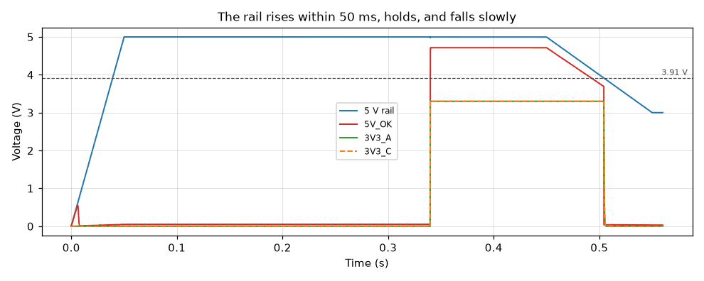

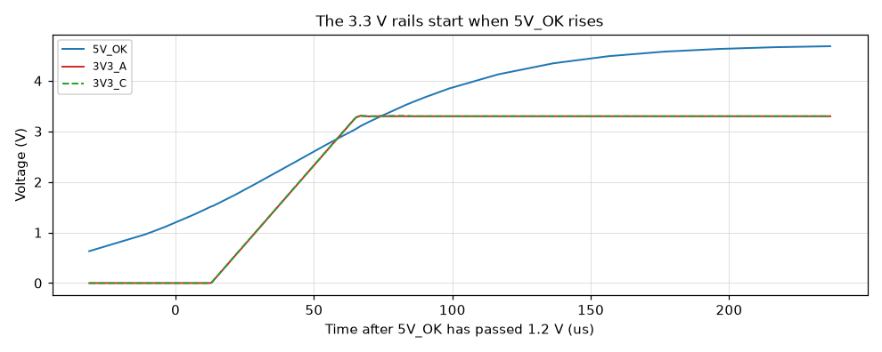

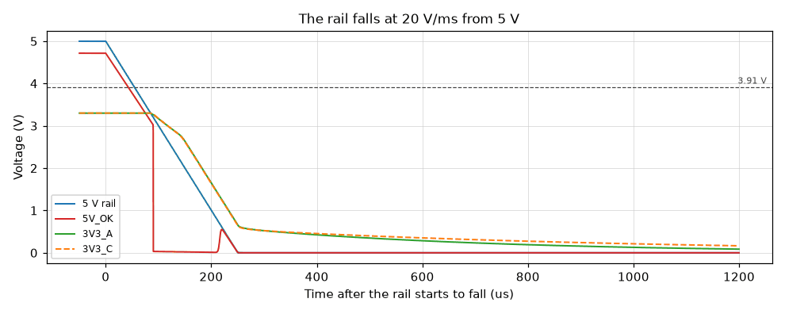

Notes:

- The rail is a source behind 50 mohm, not the input stage: the levels of the
  supervisor do not depend on what feeds the rail.
- The supervisor is a typical part: 0.405 V at its input, 1.5 % of hysteresis,
  300 ms. The two corner runs take the 2 % of the datasheet, 3 % of hysteresis,
  180 ms and 420 ms, with the 0.1 % divider against them; their limits are the
  figures of the specification with half a digit of rounding. In the fast runs
  the delay is shortened to 1 ms, which does not change the reaction to a
  falling rail.
- The regulators start 80 us after their enable, the typical value of the
  datasheet, which is twice what the specification writes in step 4.
- The loads of the rails are assumptions: 10 mA on 3V3_C beside the LED and 25
  mA on 3V3_A. The capacitors of the rails are the ones of the schematic, also
  the ones drawn on other sheets. The reference and its capacitors, which feed
  3V3_A back through D7 at power-off, are not in this circuit.
- When the rail falls faster than the 3.3 V rails are discharged (230 ohm in the
  regulator), the output of a regulator stands above its input. The body diode
  that then conducts is an assumption of the model; the datasheet only gives the
  0.3 V of the absolute maximum. The run in which this happens takes the rail to
  0 V at 20 V/ms, which is a short circuit of the rail; when the supply is
  pulled at full output the rail stops falling once the load is shed, and the
  bench of the unplug finds 30 mV.
- 5V_OK is pulled up to the rail through R25, so its high level is the rail less
  what the inputs on the line take.

Models. written here: PWRIN_LED_GREEN, PWRIN_LP5907, PWRIN_TPS3808G01.

Decks: [logic-rails.fall.cir](logic-rails.fall.cir),
[logic-rails.slow.cir](logic-rails.slow.cir).

## `power_input/overload`

**A load beyond what the source gives: the rail falls and the supervisor sheds
the carrier.**

The running carrier is asked for 6.3 W more than a current-limited supply gives.
The load stands for the pre-regulator of the source meter: a constant power that
follows 5V_OK, so that it is shed when the supervisor trips. Three runs: on the
module input with its limiter of 0.76 A, the same with a limiter whose fold-back
reaches over the whole output range, and on the USB-C input from a source that
gives no more than 0.9 A. The load is asked for during 0.6 ms; firmware, which
would latch the fault (rule F-7), is not in the circuit.

Answers: section 4.1 (thresholds of the 5 V rail, enforcement), section 3
(supervisor), rule F-7.

| Figure | Simulated | Specification | Limits | Verdict | Source |
| --- | --- | --- | --- | --- | --- |
| Module input: lowest level of the rail | 3.327 V | | 2.99 V to 3.97 V | pass | section 4.1: a minimum of 2.99 V to 3.97 V (estimate, 96 cases) |
| Module input: 5V_OK low after the load has stepped | 193.9 µs | | | | |
| Module input: 5V_OK low after the rail has passed 3.91 V | 34.15 µs | | at most 100 µs | pass | section 4.1: the pre-regulator is off within 0.1 ms (estimate) |
| Module input: time the rail spends below 3.91 V | 217.7 µs | | | | |
| Module input: lowest VSYS of the module | 4.528 V | 3.46 V (+30.87 %) | at least 1.8 V | pass | section 4.1: VSYS stays at 3.46 V or above (estimate); the module works from 1.8 V |
| Module input: 3V3_A when 5V_OK falls | 3.299 V | | at least 3.234 V | pass | the regulator holds 3.3 V within 2 % until it is switched off (LP5907 datasheet, page 5) |
| Module input, fold-back up to 4.5 V: lowest level of the rail | 3.222 V | | 2.99 V to 3.97 V | pass | section 4.1: a minimum of 2.99 V to 3.97 V (estimate, 96 cases) |
| Module input, fold-back up to 4.5 V: 5V_OK low after the load has stepped | 191.3 µs | | | | |
| Module input, fold-back up to 4.5 V: 5V_OK low after the rail has passed 3.91 V | 33.92 µs | | at most 100 µs | pass | section 4.1: the pre-regulator is off within 0.1 ms (estimate) |
| Module input, fold-back up to 4.5 V: time the rail spends below 3.91 V | 246.2 µs | | | | |
| Module input, fold-back up to 4.5 V: lowest VSYS of the module | 4.517 V | 3.46 V (+30.55 %) | at least 1.8 V | pass | section 4.1: VSYS stays at 3.46 V or above (estimate); the module works from 1.8 V |
| Module input, fold-back up to 4.5 V: 3V3_A when 5V_OK falls | 3.299 V | | at least 3.234 V | pass | the regulator holds 3.3 V within 2 % until it is switched off (LP5907 datasheet, page 5) |
| USB-C source of 0.9 A: lowest level of the rail | 3.598 V | | 2.99 V to 3.97 V | pass | section 4.1: a minimum of 2.99 V to 3.97 V (estimate, 96 cases) |
| USB-C source of 0.9 A: 5V_OK low after the load has stepped | 253.7 µs | | | | |
| USB-C source of 0.9 A: 5V_OK low after the rail has passed 3.91 V | 35.06 µs | | at most 100 µs | pass | section 4.1: the pre-regulator is off within 0.1 ms (estimate) |
| USB-C source of 0.9 A: time the rail spends below 3.91 V | 203.9 µs | | | | |
| USB-C source of 0.9 A: lowest VSYS of the module | 4.515 V | 3.46 V (+30.48 %) | at least 1.8 V | pass | section 4.1: VSYS stays at 3.46 V or above (estimate); the module works from 1.8 V |
| USB-C source of 0.9 A: 3V3_A when 5V_OK falls | 3.299 V | | at least 3.234 V | pass | the regulator holds 3.3 V within 2 % until it is switched off (LP5907 datasheet, page 5) |
| USB-C source of 0.9 A: lowest voltage at the receptacle | 3.715 V | | at least 2.87 V | pass | section 4.1: a limiter turns off at 2.67 V to 2.87 V |

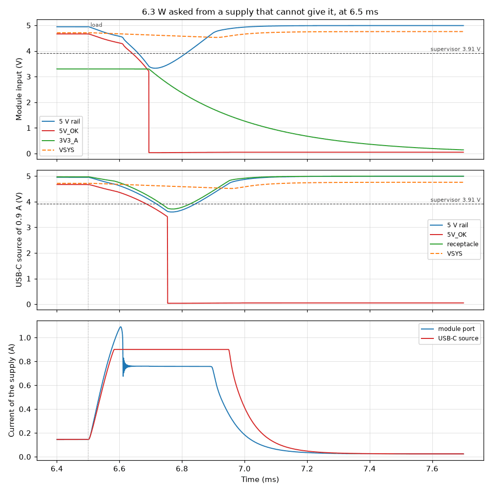

Notes:

- The load of 6.3 W is the one of the estimate in section 4.1. It follows 5V_OK
  with a delay of 50 us, which stands for the transistor at the enable pin and
  the converter: an assumption. With a longer delay the rail falls further.
- The supervisor has its release delay shortened to 1 ms so that the carrier
  runs at 6.5 ms; its reaction to the falling rail is that of the model, with
  the filter of the schematic at its input. The load is not asked for again when
  5V_OK returns: the run ends before.
- The source of 0.9 A limits without switching off: an assumption. A port that
  switches off at its limit ends the run differently.
- On the module input the module has its own supply through its diode, so VSYS
  does not follow the rail there. On USB-C alone it does, through D1.
- The idle loads are assumptions (0.12 A in all); they are shed with 5V_OK too.

Models. written here: B0530W, DIGITAL_1N5819HW, DIGITAL_PICO2_SUPPLY,
L_74438357100, PWRIN_1N5819HW, PWRIN_LED_GREEN, PWRIN_LP5907, PWRIN_SMAJ10A,
PWRIN_TPD4E1U06_CH, PWRIN_TPS2116, PWRIN_TPS259621, PWRIN_TPS3808G01,
PWRIN_WCAP_47U.

Decks: [overload.module.cir](overload.module.cir),
[overload.usbc-weak.cir](overload.usbc-weak.cir).

## `power_input/overvoltage`

**Too much voltage and the wrong polarity at the USB-C receptacle.**

The source at the USB-C receptacle rises from 5 V to 12.5 V; another one is
reversed. The carrier runs at idle when the source starts to rise by 1 V per
millisecond. The limiter lets the rail follow up to its clamp threshold and then
holds its output at the clamp level; from 11.1 V to 12.3 V the suppressor
conducts. The run is repeated with the highest and the lowest clamp of the
datasheet of the limiter. In a last run a source of 5 V and 3 A is connected
with the wrong polarity.

Answers: section 4.1 (limits of the USB-C input, thresholds of the 5 V rail),
section 11.

| Figure | Simulated | Specification | Limits | Verdict | Source |
| --- | --- | --- | --- | --- | --- |
| Typical limiter: rail with 5.5 V at the source | 5.416 V | | at most 5.5 V | pass | section 4.1: 5.50 V is the highest rail in operation |
| Typical limiter: highest level of the rail while the source rises | 5.654 V | 5.69 V (-0.63 %) | at most 5.83 V | pass | section 4.1: a source up to 5.83 V can reach the rail without being clamped |
| Limiter with the highest clamp threshold: highest level of the rail | 5.794 V | | at most 5.83 V | pass | section 4.1: a source up to 5.83 V can reach the rail without being clamped |
| Typical limiter: rail with 8 V at the source | 5.389 V | 5.45 V (-1.11 %) | 5.28 V to 5.61 V | pass | section 4.1: output clamped at 5.28 V to 5.61 V (datasheet) |
| Typical limiter: rail with 10 V at the source | 5.389 V | 5.45 V (-1.11 %) | 5.28 V to 5.61 V | pass | section 4.1: output clamped at 5.28 V to 5.61 V (datasheet) |
| Limiter with the lowest clamp: rail with 10 V at the source | 5.219 V | | at least 4.25 V | pass | section 4.1: the rail has to stay above the firmware limit, 4.25 V |
| Typical limiter: dissipation of the limiter with 10 V at the source, idle carrier | 650.1 mW | | | | |
| Typical limiter: 3V3_A with 10 V at the source | 3.299 V | | 3.234 V to 3.366 V | pass | LP5907 datasheet, page 5: 2 % |
| Typical suppressor: current of its breakdown path with 10 V at the source | -1.078 pA | | at most 1.1 µA | pass | suppressor datasheet: 1 uA at most at 10 V |
| Typical suppressor: its current with 12.5 V at the source | 1.646 A | | | | |
| Typical suppressor: its dissipation with 12.5 V at the source | 20.11 W | | at most 3.3 W | **FAIL** | suppressor datasheet, page 1: 3.3 W on an infinite heat sink; section 4.1: a source that delivers amperes destroys it |
| Current from the source with 12.5 V | 1.79 A | | | | |
| Reversed source of 3 A: voltage at the receptacle and at the input of the limiter | -961.8 mV | | at least -300 mV | **FAIL** | TPS2596 datasheet, page 5: -0.3 V at the input; the specification states no figure |
| Reversed source of 3 A: voltage at input 1 of the multiplexer | -816.1 mV | | at least -300 mV | **FAIL** | TPS2116 datasheet, page 4: -0.3 V at an input; the specification states no figure |
| Reversed source of 3 A: lowest level of the rail | -3.927 nV | | at least -300 mV | pass | LP5907 datasheet, page 4: -0.3 V at the input |
| Reversed source of 3 A: current in the cable | -3 A | | | | |

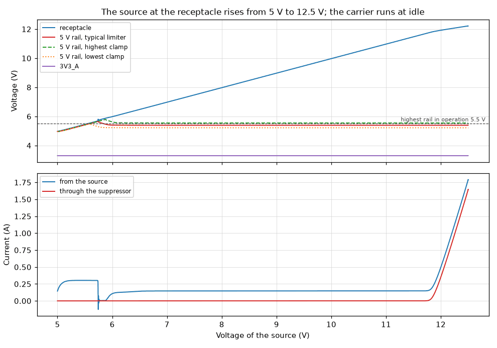

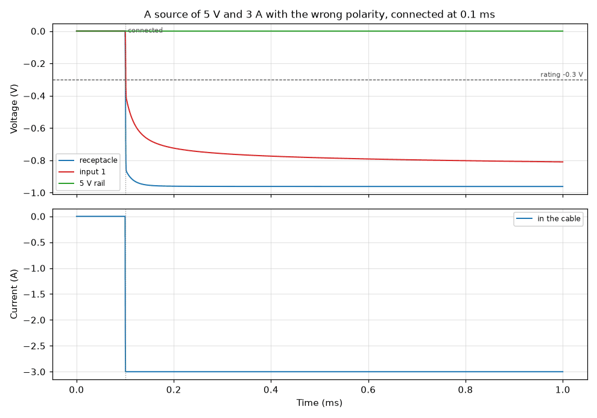

Notes:

- The source rises by 1 V per millisecond: the levels are static ones. The
  response of the clamp to a fast edge (5 us in the datasheet) is not what this
  run shows.
- Between its clamp level and its clamp threshold the limiter lets the rail
  follow the source: with a typical part the rail reaches 5.69 V, with the
  highest threshold 5.83 V, before it falls back to the clamp level.
- The suppressor is a typical part with a breakdown of 11.7 V at 1 mA; the
  datasheet allows 11.1 V to 12.3 V. Its dissipation is the product of its
  current and the receptacle voltage; nothing here heats up or fails.
- The thermal shutdown of the limiter is not modelled. With the idle carrier it
  dissipates little; with a load of 1 A and 10 V at its input it would take 4.5
  W and cycle, as the specification says.
- With the wrong polarity the suppressor conducts in its forward direction. Its
  forward voltage (0.8 V at 3 A in the model) is an assumption: the datasheet
  gives only 3.5 V at most at 25 A. The diode across the limiter and the body
  diode of the limiter (an assumption) take input 1 down with the receptacle. A
  USB-C plug cannot be turned to reverse VBUS; a reversed source is a faulty
  cable or charger.

Models. written here: B0530W, DIGITAL_1N5819HW, DIGITAL_PICO2_SUPPLY,
L_74438357100, PWRIN_1N5819HW, PWRIN_LED_GREEN, PWRIN_LP5907, PWRIN_SMAJ10A,
PWRIN_TPD4E1U06_CH, PWRIN_TPS2116, PWRIN_TPS259621, PWRIN_TPS3808G01,
PWRIN_WCAP_47U.

Decks: [overvoltage.reverse.cir](overvoltage.reverse.cir),
[overvoltage.typical.cir](overvoltage.typical.cir).

## `power_input/path-drop`

**The drop from each connector to the 5 V rail at the loads of the
specification.**

A supply stands at one connector without a cable and the rail carries a static
load. The run brings the carrier up, lets the supervisor release it and then
asks for the load of the case; the levels are read when the rail has settled.
Five cases: typical parts with the load that 5 V at 1 A at the output needs, the
two cases with 4.5 V at the receptacle and the largest on-resistances that the
specification calculates, the dissipation at the largest budget, and the module
input at its budget.

Answers: section 2 (R-14), section 4.1 (path from either connector to the rail,
power budget).

| Figure | Simulated | Specification | Limits | Verdict | Source |
| --- | --- | --- | --- | --- | --- |
| USB-C, typical parts: resistance from the receptacle to the rail | 125.9 mΩ | 126 mΩ (-0.07 %) | at most 170 mΩ | pass | section 4.1: 0.126 ohm typical and 0.170 ohm at most (calculated) |
| USB-C 5.0 V, typical parts, 6.7 W on the rail: drop to the rail | 177.6 mV | | | | |
| The same: current from the supply | 1.411 A | 1.34 A (+5.27 %) | | | section 4.1: 6.7 W at 5.0 V on the rail is 1.34 A (calculated); here the 5.0 V stand at the receptacle |
| The same: level of the rail | 4.821 V | | at least 4.25 V | pass | section 4.1: firmware limit of the rail, 4.25 V (F-14) |
| USB-C 4.5 V, largest resistance, 4.2 W on the rail: level of the rail | 4.332 V | 4.34 V (-0.17 %) | at least 4.25 V | pass | section 4.1: 4.34 V on the rail (calculated); firmware limit 4.25 V |
| Largest resistance: resistance from the receptacle to the rail | 170.1 mΩ | 170 mΩ (+0.09 %) | at most 171.7 mΩ | pass | section 4.1: 0.170 ohm at most (calculated) |
| USB-C 4.53 V, largest resistance, 7.0 W on the rail: level of the rail | 4.247 V | 4.25 V (-0.08 %) | at least 4 V | pass | section 4.1: 5 V at 1 A needs about 4.53 V at the connector (calculated); highest supervisor threshold 4.00 V |
| The same: current from the supply | 1.656 A | 1.65 A (+0.34 %) | | | |
| Largest budget: current from the supply | 1.726 A | 1.7 A (+1.53 %) | | | |
| Largest budget, largest resistance: dissipation of the limiter | 343.3 mW | 330 mW (+4.03 %) | at most 346.5 mW | pass | section 4.1: 0.33 W at 1.7 A (calculated) |
| Largest budget, largest resistance: dissipation of the multiplexer | 163.7 mW | 160 mW (+2.33 %) | at most 168 mW | pass | section 4.1: 0.16 W at 1.7 A (calculated) |
| Module input, typical parts: resistance from pin 40 to the rail | 126.8 mΩ | 126 mΩ (+0.61 %) | at most 170 mΩ | pass | section 4.1: 0.126 ohm typical and 0.170 ohm at most (calculated) |
| Module input at its budget: current into the carrier | 474.5 mA | | | | |
| Module input 5.0 V at its budget of 0.45 A: level of the rail | 4.939 V | | at least 4.25 V | pass | section 4.1: firmware limit of the rail, 4.25 V (F-14) |

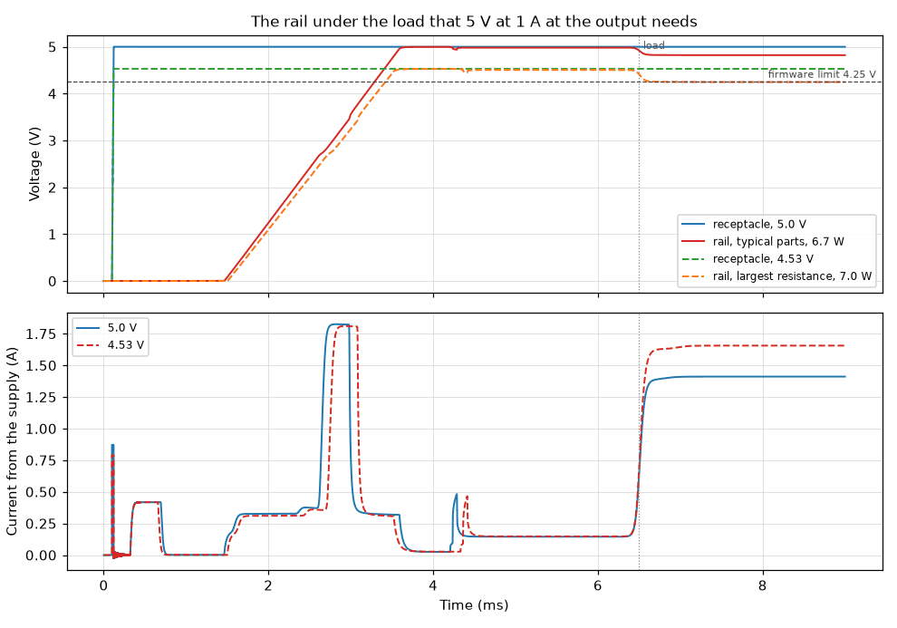

Notes:

- The supply stands at the pads of the connector: no cable, no contact
  resistance and no copper, as in the calculation of section 4.1. A cable of
  0.15 ohm takes another 0.2 V at 1.34 A.
- The loads are constant power on the rail, as the converters behind it are; the
  idle carrier of 0.6 W is an assumption and part of each load.
- The specification states no limit for the drop itself. Its budget is the level
  of the rail, 4.25 V, and the resistance of the path.
- With 5.0 V at the receptacle the rail stands 0.18 V lower, and the 6.7 W of
  the first case take 1.41 A with the 0.1 W of the module, which runs from the
  rail when its own cable is not plugged. That is 11 mA more than the 1.4 A that
  firmware allows on a 1.5 A source; the 1.34 A of the specification belong to
  5.0 V on the rail, which asks for about 5.17 V at the receptacle.
- The largest resistance is the datasheet limit up to 85 C; the typical one is
  at 25 C. Nothing here has a temperature.
- The supervisor has its release delay shortened to 1 ms.

Models. written here: B0530W, DIGITAL_1N5819HW, DIGITAL_PICO2_SUPPLY,
L_74438357100, PWRIN_1N5819HW, PWRIN_LED_GREEN, PWRIN_LP5907, PWRIN_SMAJ10A,
PWRIN_TPD4E1U06_CH, PWRIN_TPS2116, PWRIN_TPS259621, PWRIN_TPS3808G01,
PWRIN_WCAP_47U.

Decks: [path-drop.low-1a.cir](path-drop.low-1a.cir),
[path-drop.typ-1a.cir](path-drop.typ-1a.cir).

## `power_input/plug-module`

**Plugging the cable of the controller module: in-rush on the port of a
computer.**

The cable of the controller module is plugged into the port of a computer.
Nothing is plugged into the USB-C receptacle. The port is a 5 V supply behind a
power switch that limits at 1 A, with 120 uF. The module takes its own spike
through its diode; the carrier follows through the jumper, the limiter of 0.76 A
and the multiplexer. The boost converter starts as soon as the rail allows it
and asks for more than the limiter gives. The run is repeated with the limiter
at the two ends of its tolerance, with the boost converter taking 2 A, and with
the jumper open, which leaves the module alone.

Answers: section 4.1 (limits of the input: in-rush on a computer port, start of
the boost converter), section 14, section 16.

| Figure | Simulated | Specification | Limits | Verdict | Source |
| --- | --- | --- | --- | --- | --- |
| Largest port current after the spike of the module, typical limiter, 0.76 A | 1.144 A | | at most 900 mA | **FAIL** | section 4.1: 0.71 A to 0.87 A (simulated); section 16: 0.9 A or less |
| Time the port current is above 0.9 A after the spike, typical limiter, 0.76 A | 24.18 µs | | | | |
| Port current while the limiter limits, typical limiter, 0.76 A | 776.1 mA | | at most 900 mA | pass | section 4.1: 0.71 A to 0.87 A (simulated); section 16: 0.9 A or less |
| Lowest voltage of the port after the spike, typical limiter, 0.76 A | 4.921 V | | at least 4.94 V | **FAIL** | section 4.1: the port stays at 4.94 V or above (simulated) |
| Voltage of the port while the limiter limits, typical limiter, 0.76 A | 4.944 V | 4.94 V (+0.08 %) | at least 4.935 V | pass | section 4.1: the port stays at 4.94 V or above (simulated); the limit is that figure less half its last digit |
| Charge above 100 mA, typical limiter, 0.76 A | 1.189 mC | | 440 µC to 960 µC | **FAIL** | section 4.1: 0.44 mC to 0.96 mC (simulated) |
| Output of the boost converter at 13.4 V after the plug, typical limiter, 0.76 A | 2.969 ms | | at most 7.8 ms | pass | the converter has to start on this input (section 4.1: an open check) |
| Rail at the end of the run, typical limiter, 0.76 A | 4.989 V | | at least 4.12 V | pass | section 4.1: highest release level of the supervisor, 4.12 V |
| Largest port current after the spike of the module, limiter at 0.67 A | 1.018 A | | 710 mA to 900 mA | **FAIL** | section 4.1: 0.71 A to 0.87 A (simulated); section 16: 0.9 A or less |
| Time the port current is above 0.9 A after the spike, limiter at 0.67 A | 16.3 µs | | | | |
| Port current while the limiter limits, limiter at 0.67 A | 690.7 mA | | at most 900 mA | pass | section 4.1: 0.71 A to 0.87 A (simulated); section 16: 0.9 A or less |
| Lowest voltage of the port after the spike, limiter at 0.67 A | 4.935 V | | at least 4.94 V | **FAIL** | section 4.1: the port stays at 4.94 V or above (simulated) |
| Voltage of the port while the limiter limits, limiter at 0.67 A | 4.951 V | 4.94 V (+0.21 %) | at least 4.935 V | pass | section 4.1: the port stays at 4.94 V or above (simulated); the limit is that figure less half its last digit |
| Charge above 100 mA, limiter at 0.67 A | 1.179 mC | | 440 µC to 960 µC | **FAIL** | section 4.1: 0.44 mC to 0.96 mC (simulated) |
| Output of the boost converter at 13.4 V after the plug, limiter at 0.67 A | 3.085 ms | | at most 7.8 ms | pass | the converter has to start on this input (section 4.1: an open check) |
| Rail at the end of the run, limiter at 0.67 A | 4.989 V | | at least 4.12 V | pass | section 4.1: highest release level of the supervisor, 4.12 V |
| Largest port current after the spike of the module, limiter at 0.85 A | 1.275 A | | at most 900 mA | **FAIL** | section 4.1: 0.71 A to 0.87 A (simulated); section 16: 0.9 A or less |
| Time the port current is above 0.9 A after the spike, limiter at 0.85 A | 33.04 µs | | | | |
| Port current while the limiter limits, limiter at 0.85 A | 865.3 mA | | at most 900 mA | pass | section 4.1: 0.71 A to 0.87 A (simulated); section 16: 0.9 A or less |
| Lowest voltage of the port after the spike, limiter at 0.85 A | 4.883 V | | at least 4.94 V | **FAIL** | section 4.1: the port stays at 4.94 V or above (simulated) |
| Voltage of the port while the limiter limits, limiter at 0.85 A | 4.936 V | 4.94 V (-0.07 %) | at least 4.935 V | pass | section 4.1: the port stays at 4.94 V or above (simulated); the limit is that figure less half its last digit |
| Charge above 100 mA, limiter at 0.85 A | 1.193 mC | | 440 µC to 960 µC | **FAIL** | section 4.1: 0.44 mC to 0.96 mC (simulated) |
| Output of the boost converter at 13.4 V after the plug, limiter at 0.85 A | 2.873 ms | | at most 7.8 ms | pass | the converter has to start on this input (section 4.1: an open check) |
| Rail at the end of the run, limiter at 0.85 A | 4.989 V | | at least 4.12 V | pass | section 4.1: highest release level of the supervisor, 4.12 V |
| Largest port current after the spike of the module, typical limiter, boost converter takes 2 A | 1.165 A | | at most 900 mA | **FAIL** | section 4.1: 0.71 A to 0.87 A (simulated); section 16: 0.9 A or less |
| Time the port current is above 0.9 A after the spike, typical limiter, boost converter takes 2 A | 20.74 µs | | | | |
| Port current while the limiter limits, typical limiter, boost converter takes 2 A | 776 mA | | at most 900 mA | pass | section 4.1: 0.71 A to 0.87 A (simulated); section 16: 0.9 A or less |
| Lowest voltage of the port after the spike, typical limiter, boost converter takes 2 A | 4.923 V | | at least 4.94 V | **FAIL** | section 4.1: the port stays at 4.94 V or above (simulated) |
| Voltage of the port while the limiter limits, typical limiter, boost converter takes 2 A | 4.944 V | 4.94 V (+0.08 %) | at least 4.935 V | pass | section 4.1: the port stays at 4.94 V or above (simulated); the limit is that figure less half its last digit |
| Charge above 100 mA, typical limiter, boost converter takes 2 A | 1.192 mC | | 440 µC to 960 µC | **FAIL** | section 4.1: 0.44 mC to 0.96 mC (simulated) |
| Output of the boost converter at 13.4 V after the plug, typical limiter, boost converter takes 2 A | 2.971 ms | | at most 7.8 ms | pass | the converter has to start on this input (section 4.1: an open check) |
| Rail at the end of the run, typical limiter, boost converter takes 2 A | 4.989 V | | at least 4.12 V | pass | section 4.1: highest release level of the supervisor, 4.12 V |
| Typical limiter: largest fall-back of the rail during its rise | 40.07 mV | | | | |
| Typical limiter: lowest voltage at the input of the limiter after the spike | 4.497 V | | at least 3.09 V | pass | section 4.1: a limiter turns off at 2.67 V to 2.87 V and on at up to 3.09 V |
| Typical limiter: largest dissipation of the limiter while it limits | 2.205 W | | | | |
| Charge above 100 mA with the jumper open (the module alone) | 192.2 µC | 120 µC (+60.20 %) | | | section 4.1: the module alone draws 0.12 mC (simulated) |
| Charge above 100 mA against the USB in-rush test, typical limiter | 1.189 mC | | at most 50 µC | **FAIL** | the 50 uC of the USB in-rush test (section 4.1 states that it is not met) |
| Peak of the port current in the spike of the module | 8.566 A | | | | |

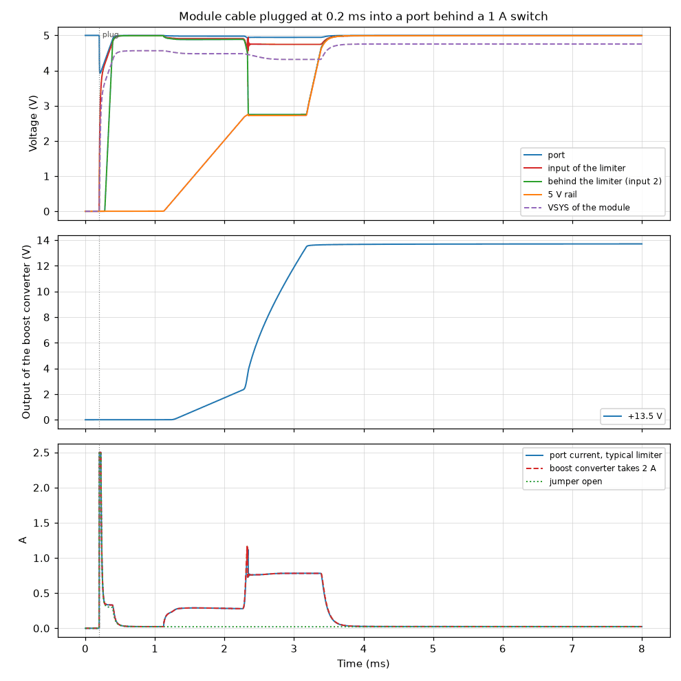

Notes:

- The port, its switch (70 mohm, 1 A) and its 120 uF are assumptions, the ones
  of the earlier estimate of the specification; so is the cable of 0.25 ohm and
  0.8 uH.
- The module is the model of the digital block: its diode, 47 uF at their
  nominal value on VSYS and a load of 0.1 W. The real capacitor has less under
  bias, so the spike and the charge of the module are upper bounds.
- The boost converter is a load that takes 1.5 A (2 A in one run) from 2.7 V on
  the rail until its output is at 13.5 V: an assumption. With the limiter giving
  less, the rail stops rising near 2.7 V until the converter has charged its
  output. A real converter at the edge of its input range can behave less evenly
  than this load: the run shows that the energy balance allows the start, not
  how the converter behaves while it starves.
- The fold-back of the limiter does not act here, because its output stays above
  1 V; with a fold-back over the whole output range (the datasheet gives no
  curve) the limiter would give less at 2.7 V and the start would take longer.
- The supervisor holds the carrier off during these runs.
- The charge above 100 mA is larger than the 0.44 mC to 0.96 mC of the
  specification because the limiter holds the rail near 2.7 V while the boost
  converter charges its output: the energy of that output is then taken at 2.7 V
  and not at 5 V, for about 0.9 ms at the limit. The figure rests on the load
  that stands for the converter. The lowest voltage of the port belongs to the
  short peak; while the limiter holds its limit the port is at 4.94 V.
- The largest port current after the spike is a peak of some tens of
  microseconds at the moment the boost converter starts: the limiter needs its
  reaction time (87 us typical for an overload below 1.5 times the limit,
  datasheet) to find its limit, and passes up to 1.5 times the limit until then.
  The current while it holds the limit is the second figure. The earlier
  simulation of the specification had a limiter without that reaction time.

Models. written here: B0530W, DIGITAL_1N5819HW, DIGITAL_PICO2_SUPPLY,
L_74438357100, PWRIN_1N5819HW, PWRIN_LED_GREEN, PWRIN_LP5907, PWRIN_MLCC,
PWRIN_SMAJ10A, PWRIN_TPD4E1U06_CH, PWRIN_TPS2116, PWRIN_TPS259621,
PWRIN_TPS3808G01, PWRIN_WCAP_47U.

Decks: [plug-module.module-alone.cir](plug-module.module-alone.cir),
[plug-module.typical.cir](plug-module.typical.cir).

## `power_input/plug-usbc`

**Plugging a live USB-C source: peak at the receptacle, in-rush, soft start, the
5 V rail.**

A live source is plugged into the USB-C receptacle of a carrier without power.
The circuit is the whole power input with the logic supplies, the capacitors of
the other sheets on the rails, the passive parts of the boost converter and the
controller module on its diode. The cable of the module is not plugged. The run
with a 5.0 V source shows the delay and the ramp of the limiter, the delay and
the soft start of the multiplexer and the current that the source has to give. A
run with 5.5 V looks for the highest voltages behind the limiter, a run on a
source that gives no more than 0.9 A for a start on a weak port, and six short
runs for the peak that the cable and the capacitors at the receptacle ring up
to.

Answers: section 3 (order of the rails, steps 1 and 2), section 4.1 (input
stage, hot plug), section 11.

| Figure | Simulated | Specification | Limits | Verdict | Source |
| --- | --- | --- | --- | --- | --- |
| Limiter: from the plug to 10 % at its output | 257.9 µs | 250 µs (+3.18 %) | | | section 4.1: turn-on delay of about 0.25 ms |
| Limiter: slope of its output between 10 % and 90 % | 1.339e+04 V/s | 1.3e+04 V/s (+3.01 %) | | | section 4.1: 13 V/ms with C4 |
| Largest source current while the limiter ramps (damper and its own capacitor) | 590.1 mA | | 300 mA to 900 mA | pass | section 14: ramps of 0.3 A to 0.9 A |
| Priority input of the multiplexer at 1.0 V after the output of the limiter has passed 2.37 V on its ramp | 157.4 µs | | | | |
| Time constant with which the priority input follows the output of the limiter | 191 µs | 190 µs (+0.50 %) | 180.5 µs to 199.5 µs | pass | section 4.1: C8 delays it by 0.19 ms (the limits are the fit of the bench) |
| Rail at 10 % after the output of the limiter is at 10 % | 1.318 ms | 1 ms (+31.77 %) | | | section 3, step 1: about 1 ms after the limiter has turned on |
| Rail from 10 % to 90 % | 1.731 ms | 1.7 ms (+1.82 %) | | | section 3, step 1: ramp of 1.7 ms |
| Source current while the rail rises, before the boost converter runs | 371.9 mA | | 300 mA to 900 mA | pass | section 14: ramps of 0.3 A to 0.9 A |
| Largest source current after the first microseconds (the boost converter starts) | 1.837 A | | | | |
| Output of the boost converter at 13.4 V after the plug | 2.934 ms | 3 ms (-2.20 %) | | | section 3, step 2: charged about 3 ms after the start |
| Largest fall-back of the rail during its rise | 0 V | | | | |
| Charge that the source gives above 100 mA | 1.329 mC | | at most 50 µC | **FAIL** | the 50 uC of the USB in-rush test (section 4.1 states that it is not met) |
| Rail at the end of the run | 4.993 V | | | | |
| Highest level of 5V_OK during the run (the supervisor holds the carrier off) | 549.7 mV | | | | |
| 5V_OK at the end of the run | 49.41 mV | | at most 400 mV | pass | section 3, step 3: hold-off of 0.18 s to 0.42 s |
| Peak at the receptacle, 5.25 V source, cable 0.15 ohm, 0.5 uH | 8.778 V | | at most 21 V | pass | section 4.1: 11.4 V and 12.2 V (simulated); limiter rated for 21 V |
| Peak at the receptacle, 5.25 V source, cable 0.08 ohm, 0.5 uH | 10.37 V | 11.4 V (-9.07 %) | at most 21 V | pass | section 4.1: 11.4 V and 12.2 V (simulated); limiter rated for 21 V |
| Peak at the receptacle, 5.25 V source, cable 0.08 ohm, 1.5 uH | 11.43 V | | at most 21 V | pass | section 4.1: 11.4 V and 12.2 V (simulated); limiter rated for 21 V |
| Peak at the receptacle, 5.5 V source, cable 0.15 ohm, 0.5 uH | 9.313 V | | at most 21 V | pass | section 4.1: 11.4 V and 12.2 V (simulated); limiter rated for 21 V |
| Peak at the receptacle, 5.5 V source, cable 0.08 ohm, 0.5 uH | 11.03 V | 12.2 V (-9.55 %) | at most 21 V | pass | section 4.1: 11.4 V and 12.2 V (simulated); limiter rated for 21 V |
| Peak at the receptacle, 5.5 V source, cable 0.08 ohm, 1.5 uH | 12.03 V | | at most 21 V | pass | section 4.1: 11.4 V and 12.2 V (simulated); limiter rated for 21 V |
| Largest current of the suppressor, 5.5 V source, cable 0.08 ohm, 1.5 uH | 781.5 mA | | | | |
| Highest voltage behind the limiter, 5.5 V source, whole start | 5.5 V | | at most 5.51 V | pass | section 4.1: 5.51 V or below |
| Highest rail voltage above the source, 5.5 V source, whole start | -6.054 mV | | at most 0 V | pass | section 4.1: the rail never rises above the source |
| Source of 0.9 A: output of the boost converter at 13.4 V after the plug | 3.225 ms | | | | |
| Source of 0.9 A: largest fall-back of the rail during its rise | 152.1 mV | | | | |
| Source of 0.9 A: lowest voltage at the receptacle once the limiter is on | 2.842 V | | at least 3.09 V | **FAIL** | section 4.1: a limiter turns off at 2.67 V to 2.87 V and on at up to 3.09 V |
| Source of 0.9 A: rail at the end of the run | 4.992 V | | at least 4.12 V | pass | section 4.1: highest release level of the supervisor |

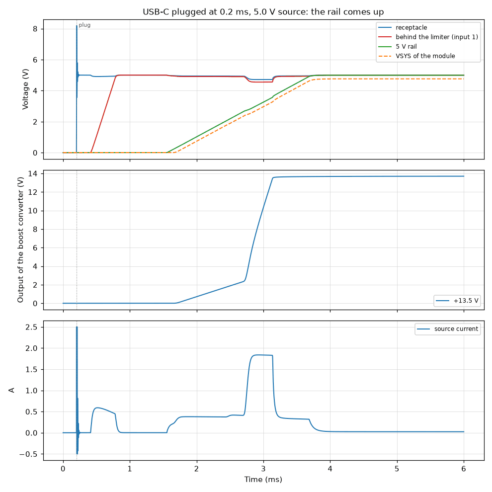

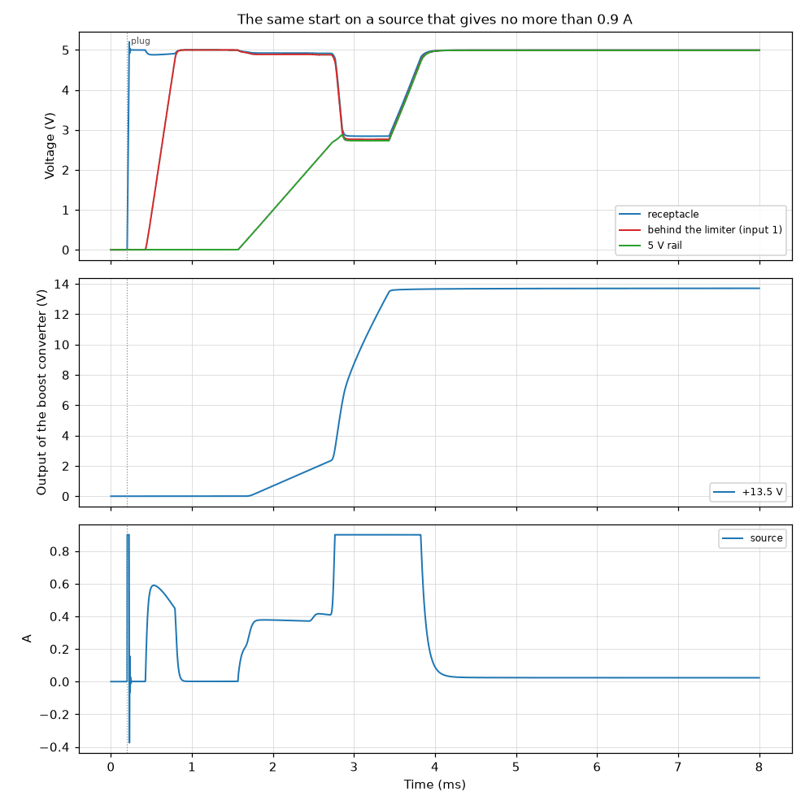

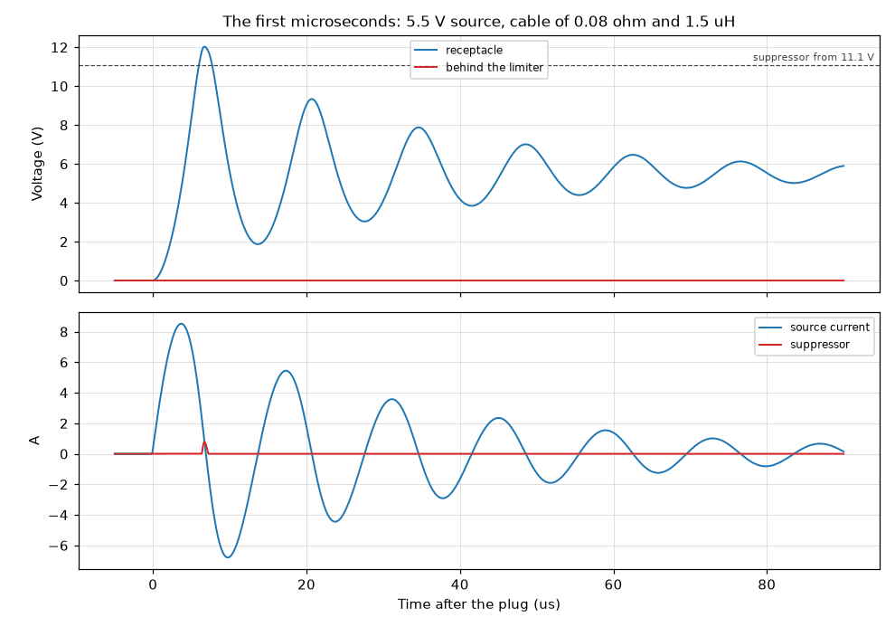

Notes:

- The source is ideal behind its cable, with 100 ohm across the inductance of
  the cable. The cable values are assumptions; the peak at the receptacle
  depends on them more than on anything on the board, so three cables are shown.
- The ceramic capacitors lose capacitance with voltage as the curves of their
  manufacturer show; the 4.7 uF at the receptacle has 39 % left at 10 V. The
  suppressor is a typical part: breakdown 11.7 V at 1 mA.
- The boost converter is a load that takes 1.5 A from 2.7 V on the rail until
  its output is at 13.5 V: an assumption. Its inductor, diode and capacitors are
  the ones of the schematic. The largest source current after the first
  microseconds is that load on top of the charging of the rail.
- The limiter and the multiplexer are typical parts at 25 C; the supervisor
  holds the carrier off during these runs, so the loads of the other blocks are
  zero.
- 5V_OK rises to about 0.5 V while the rail passes 0.8 V: below that supply the
  output of the supervisor is not defined (datasheet) and the model lets go of
  it. The regulators have no input voltage to work with at that moment.
- The charge above 100 mA is compared with the USB in-rush test although that
  test belongs to a USB 2.0 port; the specification says the same of the module
  input.
- The source of 0.9 A stands for a port that gives no more than USB 3 asks of it
  and limits without switching off: an assumption.

Models. written here: B0530W, DIGITAL_1N5819HW, DIGITAL_PICO2_SUPPLY,
L_74438357100, PWRIN_1N5819HW, PWRIN_LED_GREEN, PWRIN_LP5907, PWRIN_MLCC,
PWRIN_SMAJ10A, PWRIN_TPD4E1U06_CH, PWRIN_TPS2116, PWRIN_TPS259621,
PWRIN_TPS3808G01, PWRIN_WCAP_47U.

Decks: [plug-usbc.peak-5p5v-0p08r-1p5u.cir](plug-usbc.peak-5p5v-0p08r-1p5u.cir),
[plug-usbc.plug-5v0.cir](plug-usbc.plug-5v0.cir),
[plug-usbc.plug-5v5.cir](plug-usbc.plug-5v5.cir),
[plug-usbc.plug-weak.cir](plug-usbc.plug-weak.cir).

## `power_input/replug-module`

**The cable of the module is plugged again: what reaches input 2 of the
multiplexer.**

The cable of the module is pulled and plugged again with its limiter still on.
The limiter of the module input has 100 nF at its input and 1 uF at its output,
which is input 2 of the multiplexer. While USB-C supplies the rail, input 2
carries no load: with the cable pulled, the two capacitors empty through the
enable divider and the dividers of the module within milliseconds, and the
limiter stays on down to 2.76 V at its input. A contact that closes in that time
puts the port voltage on the cable with the limiter conducting: the cable rings
with the two capacitors, and the diode of the module to its VSYS capacitor is
what bounds the peak. In the last runs the cable of the module is alone and its
contact bounces while the multiplexer charges the rail, which empties the
capacitors within microseconds.

Answers: section 4.1 (a contact that opens and closes again), section 14 (inputs
of the multiplexer near their rating), section 16 (data cable plugged again, TP4
below 6.0 V), decision D-84.

| Figure | Simulated | Specification | Limits | Verdict | Source |
| --- | --- | --- | --- | --- | --- |
| 5.5 V, cable of 0.08 ohm and 0.3 uH: highest level of input 2 after a gap of 20 us | 5.514 V | | at most 6 V | pass | section 16: data cable plugged again, TP4 below 6.0 V; TPS2116 datasheet, page 4: 6 V |
| 5.5 V, cable of 0.08 ohm and 0.3 uH: highest level of input 2 after a gap of 500 us | 5.772 V | | at most 6 V | pass | section 16: data cable plugged again, TP4 below 6.0 V; TPS2116 datasheet, page 4: 6 V |
| 5.5 V, cable of 0.08 ohm and 0.3 uH: highest level of input 2 after a gap of 1 ms | 5.851 V | | at most 6 V | pass | section 16: data cable plugged again, TP4 below 6.0 V; TPS2116 datasheet, page 4: 6 V |
| 5.5 V, cable of 0.08 ohm and 0.3 uH: highest level of input 2 after a gap of 1.5 ms | 5.906 V | | at most 6 V | pass | section 16: data cable plugged again, TP4 below 6.0 V; TPS2116 datasheet, page 4: 6 V |
| 5.5 V, cable of 0.08 ohm and 0.3 uH: highest level of input 2 after a gap of 2 ms | 5.941 V | | at most 6 V | pass | section 16: data cable plugged again, TP4 below 6.0 V; TPS2116 datasheet, page 4: 6 V |
| 5.5 V, cable of 0.08 ohm and 0.3 uH: highest level of input 2 after a gap of 2.3 ms | 5.888 V | | at most 6 V | pass | section 16: data cable plugged again, TP4 below 6.0 V; TPS2116 datasheet, page 4: 6 V |
| 5.5 V, cable of 0.08 ohm and 0.3 uH: highest level of input 2 after a gap of 2.6 ms | 5.779 V | | at most 6 V | pass | section 16: data cable plugged again, TP4 below 6.0 V; TPS2116 datasheet, page 4: 6 V |
| 5.5 V, cable of 0.08 ohm and 0.3 uH: highest level of input 2 after a gap of 3 ms | 5.505 V | | at most 6 V | pass | section 16: data cable plugged again, TP4 below 6.0 V; TPS2116 datasheet, page 4: 6 V |
| 5.5 V, cable of 0.08 ohm and 0.3 uH: highest level of input 2 after a gap of 5 ms | 5.505 V | | at most 6 V | pass | section 16: data cable plugged again, TP4 below 6.0 V; TPS2116 datasheet, page 4: 6 V |
| 5.5 V, cable of 0.08 ohm and 0.3 uH, limiter reacts in 15 us: highest level of input 2 after a gap of 2 ms | 5.956 V | | at most 6 V | pass | section 16: data cable plugged again, TP4 below 6.0 V; TPS2116 datasheet, page 4: 6 V |
| 5.5 V, cable of 0.08 ohm and 0.3 uH, limiter reacts in 15 us: highest level of input 2 after a gap of 2.3 ms | 5.98 V | | at most 6 V | pass | section 16: data cable plugged again, TP4 below 6.0 V; TPS2116 datasheet, page 4: 6 V |
| 5.5 V, cable of 0.08 ohm and 0.3 uH, limiter reacts in 15 us: highest level of input 2 after a gap of 2.6 ms | 6.002 V | | at most 6 V | **FAIL** | section 16: data cable plugged again, TP4 below 6.0 V; TPS2116 datasheet, page 4: 6 V |
| 5.5 V, cable of 0.15 ohm and 1.5 uH: highest level of input 2 after a gap of 2 ms | 5.891 V | | at most 6 V | pass | section 16: data cable plugged again, TP4 below 6.0 V; TPS2116 datasheet, page 4: 6 V |
| 5.5 V, cable of 0.15 ohm and 1.5 uH: highest level of input 2 after a gap of 2.3 ms | 5.664 V | | at most 6 V | pass | section 16: data cable plugged again, TP4 below 6.0 V; TPS2116 datasheet, page 4: 6 V |
| 5.5 V, cable of 0.15 ohm and 1.5 uH: highest level of input 2 after a gap of 2.6 ms | 5.61 V | | at most 6 V | pass | section 16: data cable plugged again, TP4 below 6.0 V; TPS2116 datasheet, page 4: 6 V |
| 5.25 V, cable of 0.08 ohm and 0.3 uH: highest level of input 2 after a gap of 2 ms | 5.689 V | | at most 6 V | pass | section 16: data cable plugged again, TP4 below 6.0 V; TPS2116 datasheet, page 4: 6 V |
| 5.25 V, cable of 0.08 ohm and 0.3 uH: highest level of input 2 after a gap of 2.3 ms | 5.691 V | | at most 6 V | pass | section 16: data cable plugged again, TP4 below 6.0 V; TPS2116 datasheet, page 4: 6 V |
| 5.25 V, cable of 0.08 ohm and 0.3 uH: highest level of input 2 after a gap of 2.6 ms | 5.613 V | | at most 6 V | pass | section 16: data cable plugged again, TP4 below 6.0 V; TPS2116 datasheet, page 4: 6 V |
| 5.0 V, cable of 0.25 ohm and 0.8 uH: highest level of input 2 after a gap of 2 ms | 5.359 V | | at most 6 V | pass | section 16: data cable plugged again, TP4 below 6.0 V; TPS2116 datasheet, page 4: 6 V |
| 5.0 V, cable of 0.25 ohm and 0.8 uH: highest level of input 2 after a gap of 2.3 ms | 5.329 V | | at most 6 V | pass | section 16: data cable plugged again, TP4 below 6.0 V; TPS2116 datasheet, page 4: 6 V |
| 5.0 V, cable of 0.25 ohm and 0.8 uH: highest level of input 2 after a gap of 2.6 ms | 5.012 V | | at most 6 V | pass | section 16: data cable plugged again, TP4 below 6.0 V; TPS2116 datasheet, page 4: 6 V |
| 5.5 V, cable of 0.08 ohm and 0.3 uH, damper fitted: highest level of input 2 after a gap of 2 ms | 5.502 V | | at most 6 V | pass | section 16: data cable plugged again, TP4 below 6.0 V; TPS2116 datasheet, page 4: 6 V |
| 5.5 V, cable of 0.08 ohm and 0.3 uH, damper fitted: highest level of input 2 after a gap of 2.3 ms | 5.502 V | | at most 6 V | pass | section 16: data cable plugged again, TP4 below 6.0 V; TPS2116 datasheet, page 4: 6 V |
| 5.5 V, cable of 0.08 ohm and 0.3 uH, damper fitted: highest level of input 2 after a gap of 2.6 ms | 5.502 V | | at most 6 V | pass | section 16: data cable plugged again, TP4 below 6.0 V; TPS2116 datasheet, page 4: 6 V |
| Module cable alone, 5.5 V, cable of 0.08 ohm and 0.3 uH: highest level of input 2 after a gap of 4 us | 5.59 V | | at most 6 V | pass | section 16: data cable plugged again, TP4 below 6.0 V; TPS2116 datasheet, page 4: 6 V |
| Module cable alone, 5.5 V, cable of 0.08 ohm and 0.3 uH: highest level of input 2 after a gap of 7 us | 5.664 V | | at most 6 V | pass | section 16: data cable plugged again, TP4 below 6.0 V; TPS2116 datasheet, page 4: 6 V |
| Module cable alone, 5.5 V, cable of 0.08 ohm and 0.3 uH: highest level of input 2 after a gap of 10 us | 5.728 V | | at most 6 V | pass | section 16: data cable plugged again, TP4 below 6.0 V; TPS2116 datasheet, page 4: 6 V |
| Module cable alone, 5.5 V, cable of 0.08 ohm and 0.3 uH: highest level of input 2 after a gap of 14 us | 5.8 V | | at most 6 V | pass | section 16: data cable plugged again, TP4 below 6.0 V; TPS2116 datasheet, page 4: 6 V |
| 5.5 V, cable of 0.08 ohm and 0.3 uH: input of the limiter when the contact closes after 20 us | 5.478 V | | | | |
| 5.5 V, cable of 0.08 ohm and 0.3 uH: input of the limiter when the contact closes after 500 us | 4.919 V | | | | |
| 5.5 V, cable of 0.08 ohm and 0.3 uH: input of the limiter when the contact closes after 1 ms | 4.389 V | | | | |
| 5.5 V, cable of 0.08 ohm and 0.3 uH: input of the limiter when the contact closes after 1.5 ms | 3.906 V | | | | |
| 5.5 V, cable of 0.08 ohm and 0.3 uH: input of the limiter when the contact closes after 2 ms | 3.466 V | | | | |
| 5.5 V, cable of 0.08 ohm and 0.3 uH: input of the limiter when the contact closes after 2.3 ms | 3.221 V | | | | |
| 5.5 V, cable of 0.08 ohm and 0.3 uH: input of the limiter when the contact closes after 2.6 ms | 2.99 V | | | | |
| 5.5 V, cable of 0.08 ohm and 0.3 uH: input of the limiter when the contact closes after 3 ms | 2.593 V | | | | |
| 5.5 V, cable of 0.08 ohm and 0.3 uH: input of the limiter when the contact closes after 5 ms | 1.734 V | | | | |
| Module cable alone, 5.5 V, cable of 0.08 ohm and 0.3 uH: input of the limiter when the contact closes after 4 us | 5.071 V | | | | |
| Module cable alone, 5.5 V, cable of 0.08 ohm and 0.3 uH: input of the limiter when the contact closes after 7 us | 4.459 V | | | | |
| Module cable alone, 5.5 V, cable of 0.08 ohm and 0.3 uH: input of the limiter when the contact closes after 10 us | 3.858 V | | | | |
| Module cable alone, 5.5 V, cable of 0.08 ohm and 0.3 uH: input of the limiter when the contact closes after 14 us | 3.074 V | | | | |
| Highest level of input 2 with a limiter of typical reaction time, USB-C supplies | 5.941 V | 5.945 V (-0.06 %) | at most 6 V | pass | section 4.1: within 25 mV to 85 mV of the 6 V rating in the worst corners (simulated before); TPS2116 datasheet, page 4: 6 V |
| Highest level of input 2 with a limiter that reacts in 15 us, USB-C supplies | 6.002 V | | at most 6 V | **FAIL** | section 16: data cable plugged again, TP4 below 6.0 V; TPS2116 datasheet, page 4: 6 V; the 15 us are an assumption |
| Highest level of input 2 with the damper fitted (limiter that reacts in 15 us) | 5.502 V | | at most 6 V | pass | decision D-84: a damper of 0.33 ohm with 10 uF on the input from the controller module; TPS2116 datasheet, page 4: 6 V |
| Highest level of input 2 with the cable of the module alone, bouncing while the multiplexer charges the rail | 5.8 V | | at most 6 V | pass | section 16: data cable plugged again, TP4 below 6.0 V; TPS2116 datasheet, page 4: 6 V |
| Highest voltage at the input of the limiter in the run with the highest input 2 | 6.011 V | | at most 21 V | pass | section 4.1: input of the limiter rated 21 V |
| Highest level of VSYS of the module in all runs | 5.343 V | | at most 5.5 V | pass | Pico 2 datasheet, section 4.5: VSYS from 1.8 V to 5.5 V |
| Largest current of the cable in the run with the highest input 2 | 3.817 A | | | | |
| 5.5 V, cable of 0.08 ohm and 0.3 uH: highest level of input 2 at the first plug, with this input empty | 5.505 V | | at most 6 V | pass | TPS2116 datasheet, page 4: 6 V |
| 5.5 V, cable of 0.08 ohm and 0.3 uH: highest voltage at the input of the limiter at the first plug | 5.545 V | | at most 21 V | pass | section 4.1: input of the limiter rated 21 V |
| Largest change of the 5 V rail while the cable of the module is plugged again and USB-C supplies | 3.401 mV | | at most 300 mV | pass | rule F-35: a step of the rail of more than 0.3 V marks samples |

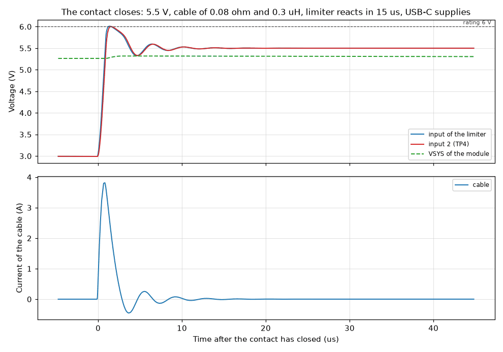

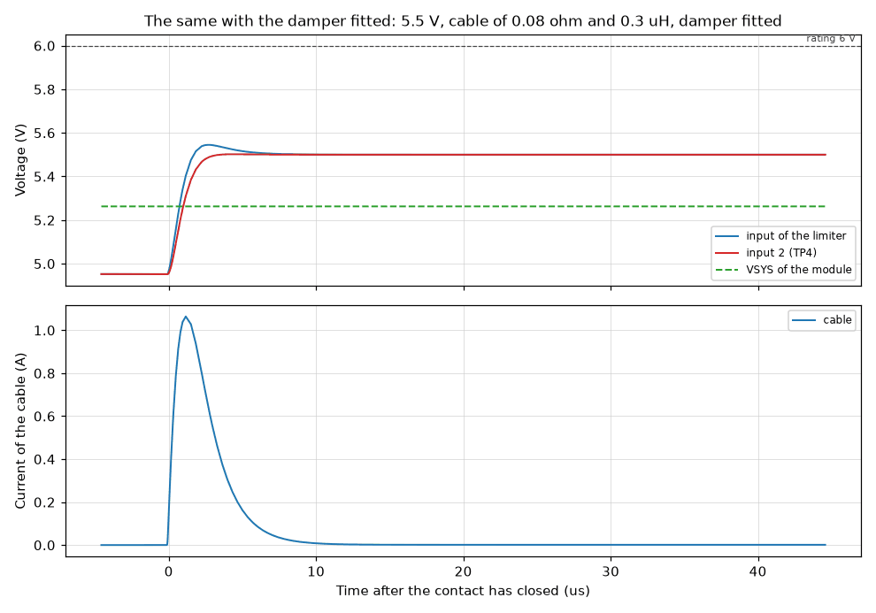

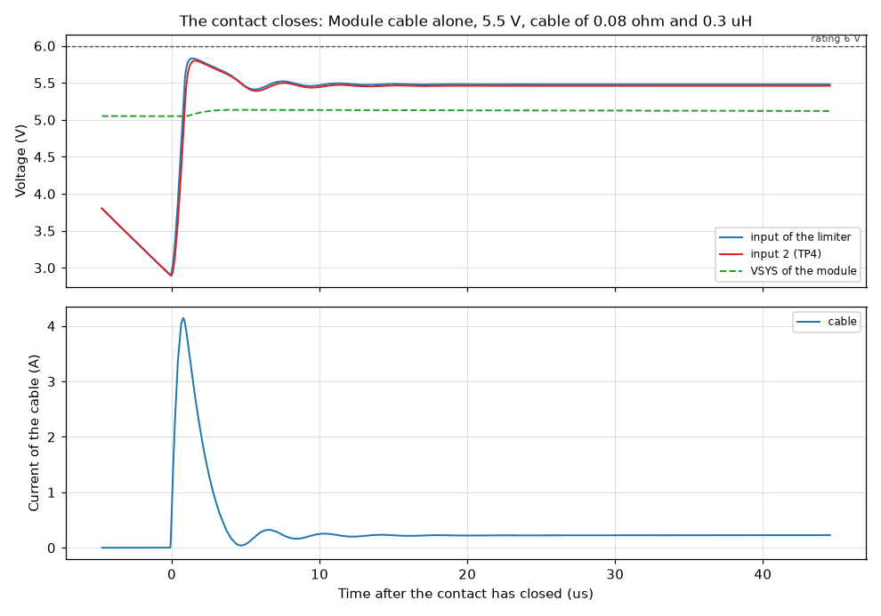

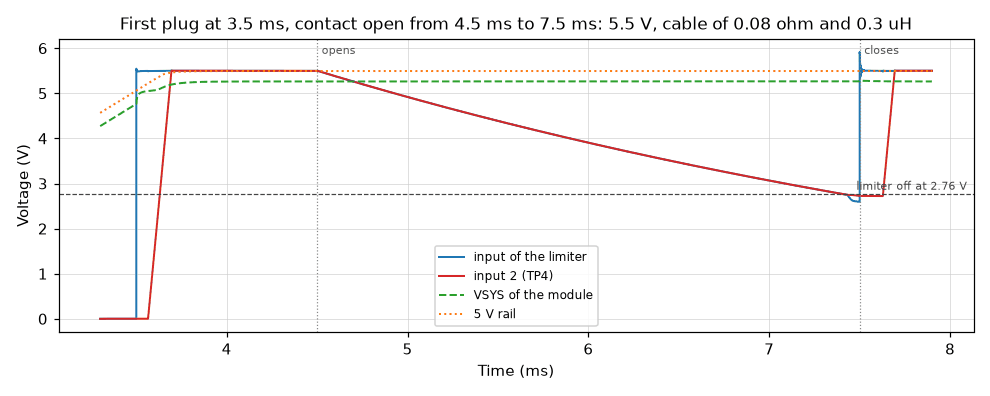

Notes:

- The port is an ideal source behind its cable, and the contact a conductance
  that opens within 1 us and closes within 50 ns: assumptions, as are the
  cables. The USB-C source has the same voltage as the port.
- The module is the model of the digital block: the diode of the module from
  VBUS to VSYS (475 mV at 0.1 A, 605 mV at 1 A), 47 uF at their nominal value on
  VSYS, 5.6 kohm and 10 kohm from VBUS to ground, and a load of 0.1 W. The peak
  at input 2 rests on that diode and on the level of VSYS, which the carrier
  holds through its own diode from the rail.
- The limiter is ohmic when the contact closes. Its clamp and its reaction to a
  short circuit need 5 us (typical; the datasheet states no limit), which is
  about as long as the first peak of the ring takes: after the longest gaps the
  typical reaction cuts the peak, a slower one does not. A limiter that clamps
  from 5.54 V or 5.69 V instead of 5.83 V gives the same peak within 20 mV.
- The 100 nF and the 1 uF on this input are in 0603 and stay at their nominal
  value: no bias curve of theirs was read. Less capacitance gives a faster ring.
- The position for a damper on this input (R14, 0.33 ohm, and C5, 10 uF;
  decision D-84) is without parts, as the schematic has it, except in the runs
  that say otherwise. There the capacitor has half its value, an assumption for
  what a 10 uF 25 V part in 0805 keeps at 5 V; the position names no part
  number.
- While USB-C supplies, the supervisor holds the carrier off during these runs
  (its delay is 0.3 s), so the rail carries no load; input 2 does not depend on
  it.

Models. written here: B0530W, DIGITAL_1N5819HW, DIGITAL_PICO2_SUPPLY,
L_74438357100, PWRIN_1N5819HW, PWRIN_LED_GREEN, PWRIN_LP5907, PWRIN_SMAJ10A,
PWRIN_TPD4E1U06_CH, PWRIN_TPS2116, PWRIN_TPS259621, PWRIN_TPS3808G01,
PWRIN_WCAP_47U.

Decks: [replug-module.damped-2p6ms.cir](replug-module.damped-2p6ms.cir),
[replug-module.short-2ms.cir](replug-module.short-2ms.cir),
[replug-module.slow-2p6ms.cir](replug-module.slow-2p6ms.cir).

## `power_input/switch-over`

**USB-C plugged while the module input supplies: the change of input and the dip
of the rail.**

The carrier runs from the cable of the module when a USB-C source is plugged in.
The limiter of the USB-C input starts and ramps its output up; when the priority
input of the multiplexer has followed, the multiplexer opens the module input
and closes USB-C as soon as the rail is no higher than that input. The rail is
without supply in between. Four runs: at idle and with the input current that
firmware allows on the module input, each with a typical limiter and with the
slowest output ramp inside its datasheet limits.

Answers: section 4.1 (when a cable is pulled or plugged), section 16, rule F-35.

| Figure | Simulated | Specification | Limits | Verdict | Source |
| --- | --- | --- | --- | --- | --- |
| Idle, typical ramp: lowest level of the rail during the change | 4.867 V | 4.54 V (+7.20 %) | at least 4 V | pass | section 4.1: 4.0 V to 4.5 V (simulated), against the highest supervisor threshold of 4.00 V |
| Idle, typical ramp: rail before the plug | 4.945 V | | | | |
| Idle, typical ramp: lowest level of 5V_OK during the change | 4.591 V | | at least 1.2 V | pass | the carrier keeps running (section 4.1); 1.2 V is the enable level of the regulators |
| Idle, typical ramp: lowest level of 3V3_A during the change | 3.299 V | | at least 3.234 V | pass | LP5907 datasheet, page 5: 2 % |
| Idle, slowest ramp: lowest level of the rail during the change | 4.808 V | 4.28 V (+12.33 %) | at least 4 V | pass | section 4.1: 4.0 V to 4.5 V (simulated), against the highest supervisor threshold of 4.00 V |
| Idle, slowest ramp: rail before the plug | 4.945 V | | | | |
| Idle, slowest ramp: lowest level of 5V_OK during the change | 4.536 V | | at least 1.2 V | pass | the carrier keeps running (section 4.1); 1.2 V is the enable level of the regulators |
| Idle, slowest ramp: lowest level of 3V3_A during the change | 3.299 V | | at least 3.234 V | pass | LP5907 datasheet, page 5: 2 % |
| 0.45 A, typical ramp: lowest level of the rail during the change | 4.652 V | | at least 4 V | pass | section 4.1: 4.0 V to 4.5 V (simulated), against the highest supervisor threshold of 4.00 V |
| 0.45 A, typical ramp: rail before the plug | 4.818 V | | | | |
| 0.45 A, typical ramp: lowest level of 5V_OK during the change | 4.389 V | | at least 1.2 V | pass | the carrier keeps running (section 4.1); 1.2 V is the enable level of the regulators |
| 0.45 A, typical ramp: lowest level of 3V3_A during the change | 3.299 V | | at least 3.234 V | pass | LP5907 datasheet, page 5: 2 % |
| 0.45 A, slowest ramp: lowest level of the rail during the change | 4.507 V | | at least 4 V | pass | section 4.1: 4.0 V to 4.5 V (simulated), against the highest supervisor threshold of 4.00 V |
| 0.45 A, slowest ramp: rail before the plug | 4.818 V | | | | |
| 0.45 A, slowest ramp: lowest level of 5V_OK during the change | 4.252 V | | at least 1.2 V | pass | the carrier keeps running (section 4.1); 1.2 V is the enable level of the regulators |
| 0.45 A, slowest ramp: lowest level of 3V3_A during the change | 3.299 V | | at least 3.234 V | pass | LP5907 datasheet, page 5: 2 % |
| Idle, typical ramp: the multiplexer opens the module input after the plug | 557.1 µs | | | | |
| Idle, typical ramp: time without a closed channel | 28.55 µs | | | | |
| Idle, typical ramp: input 1 when the module input opens | 4.517 V | | | | |
| Idle, typical ramp: largest current back into the port of the module while its cable rings | 70.65 mA | | | | |
| Idle, typical ramp: mean current of the port of the module after the change | 1.325 mA | | at least 0 A | pass | section 4.11: neither connector feeds the other one back |
| Idle, typical ramp: largest current back into the USB-C source after its first 0.1 ms | -873 µA | | at most 1 mA | pass | section 4.11: neither connector feeds the other one back |
| Idle, typical ramp: largest current of the USB-C source after its first 0.1 ms | 417.8 mA | | at most 1.81 A | pass | section 4.1: least current limit of the USB-C input, 1.81 A |
| SRC_ST while the module input supplies | 1.423 mV | | at most 100 mV | pass | section 4.1: low while the input of the module supplies |

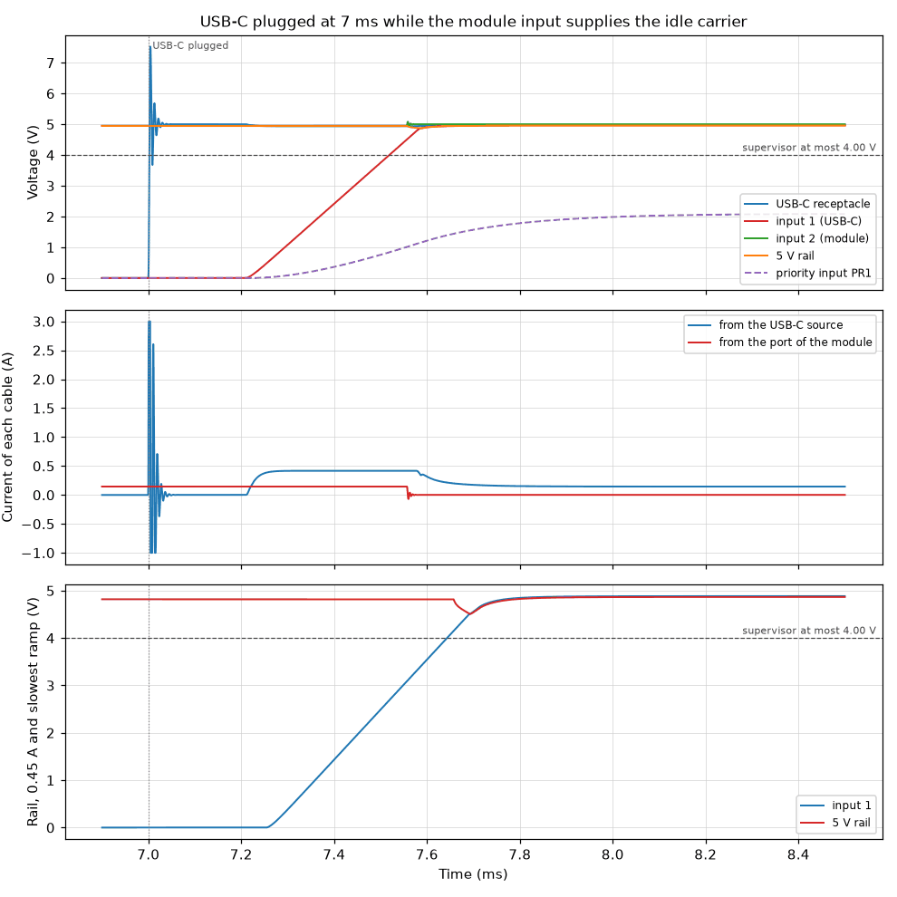

Notes:

- Both sources are stiff: 5.0 V behind their cables (assumptions: 0.15 ohm and
  0.5 uH on USB-C, 0.25 ohm and 0.8 uH on the module input). A higher voltage on
  the module port than on USB-C makes the dip deeper by the difference.
- The dip is set by where the output of the USB-C limiter stands when the
  priority input, behind R18, R19 and C8, passes 1.0 V: the rail falls to that
  level. The slower the ramp of the limiter, the lower that level.
- The multiplexer is a typical part: reference 1.0 V, 8 us without a channel.
  Its reference has a tolerance of 8 %, which moves the level at which it
  changes.
- The aluminum capacitor has the series resistance of its datasheet maximum at
  20 C; the ceramic capacitors have the capacitance they keep at 5 V. The run
  with a ramp slower than the datasheet allows and a cold capacitor, which the
  specification quotes with 4.02 V, was not repeated: neither is a datasheet
  value.
- The supervisor has its release delay shortened to 1 ms; its trip level and its
  filter are the ones of the model and of the schematic.

Models. written here: B0530W, DIGITAL_1N5819HW, DIGITAL_PICO2_SUPPLY,
L_74438357100, PWRIN_1N5819HW, PWRIN_LED_GREEN, PWRIN_LP5907, PWRIN_SMAJ10A,
PWRIN_TPD4E1U06_CH, PWRIN_TPS2116, PWRIN_TPS259621, PWRIN_TPS3808G01,
PWRIN_WCAP_47U.

Decks: [switch-over.idle.cir](switch-over.idle.cir).

## `power_input/thresholds`

**The levels at which the limiter and the multiplexer switch, and what the
monitor reads.**

The voltage at the USB-C receptacle rises to 5 V within 0.1 s and falls again.
The dVdt pin of the limiter shows when the limiter is on, the status output when
the multiplexer has left USB-C. The run is done without and with a supply on the
module input; with it, the monitor channel of the rail shows both of its scales.
A third run puts the pull-ups of the three kinds of USB-C source on CC1, at the
ends of their tolerance.

Answers: section 4.1 (input stage, thresholds of the 5 V rail, what firmware
reads), rules F-11, F-13 and F-14.

| Figure | Simulated | Specification | Limits | Verdict | Source |
| --- | --- | --- | --- | --- | --- |
| Receptacle voltage at which the limiter turns on | 3.01 V | 3.005 V (+0.16 %) | 2.92 V to 3.09 V | pass | section 4.1: on at 2.92 V to 3.09 V (calculated) |
| Receptacle voltage at which the limiter turns off | 2.757 V | 2.755 V (+0.06 %) | 2.67 V to 2.87 V | pass | section 4.1: off at 2.67 V to 2.87 V (calculated) |
| Input 1 of the multiplexer when it leaves USB-C for the module input | 2.355 V | 2.37 V (-0.64 %) | 2.15 V to 2.59 V | pass | section 4.1: 2.15 V to 2.59 V (calculated) |
| Receptacle voltage at which the multiplexer leaves, less the one at which the limiter turns off | -594.7 mV | | at most 0 V | pass | section 4.1: the multiplexer threshold is below every other threshold |
| Monitor channel of the rail as a share of the rail, USB-C supplies | 0.4545 | 0.4545 (+0.01 %) | 0.4454 to 0.4636 | pass | section 4.1: 0.4545 x the rail (calculated; 1 % resistors) |
| Monitor channel of the rail as a share of the rail, the module input supplies | 0.2526 | 0.2524 (+0.06 %) | 0.2474 to 0.2574 | pass | section 4.1: 0.2524 x the rail (calculated; 1 % resistors) |
| Monitor channel of the rail, USB-C supplies | 2.264 V | | at least 1.67 V | pass | rule F-11: above 1.67 V means USB-C |
| Monitor channel of the rail, the module input supplies | 1.258 V | | at most 1.67 V | pass | rule F-11: at or below 1.67 V means the module input |
| Status output while USB-C supplies | 2.264 V | | | | |
| Status output while the module input supplies | 1.845 mV | | at most 100 mV | pass | section 4.1: low while the input of the module supplies |
| CC reading, default, nominal (56 kohm to 5 V) | 417.3 mV | | at most 610 mV | pass | section 4.1 and rule F-14: windows of the CC voltage |
| CC reading, default, highest (44.8 kohm to 5.5 V) | 562.1 mV | | at most 610 mV | pass | section 4.1 and rule F-14: windows of the CC voltage |
| CC reading, default, lowest (67.2 kohm to 4.75 V) | 335.1 mV | | at most 610 mV | pass | section 4.1 and rule F-14: windows of the CC voltage |
| CC reading, 1.5 A, nominal (22 kohm to 5 V) | 941 mV | | 700 mV to 1.16 V | pass | section 4.1 and rule F-14: windows of the CC voltage |
| CC reading, 1.5 A, highest (20.9 kohm to 5.5 V) | 1.079 V | | 700 mV to 1.16 V | pass | section 4.1 and rule F-14: windows of the CC voltage |
| CC reading, 1.5 A, lowest (23.1 kohm to 4.75 V) | 859 mV | | 700 mV to 1.16 V | pass | section 4.1 and rule F-14: windows of the CC voltage |
| CC reading, 3 A, nominal (10 kohm to 5 V) | 1.689 V | | 1.31 V to 2.04 V | pass | section 4.1 and rule F-14: windows of the CC voltage |
| CC reading, 3 A, highest (9.5 kohm to 5.5 V) | 1.921 V | | 1.31 V to 2.04 V | pass | section 4.1 and rule F-14: windows of the CC voltage |
| CC reading, 3 A, lowest (10.5 kohm to 4.75 V) | 1.553 V | | 1.31 V to 2.04 V | pass | section 4.1 and rule F-14: windows of the CC voltage |

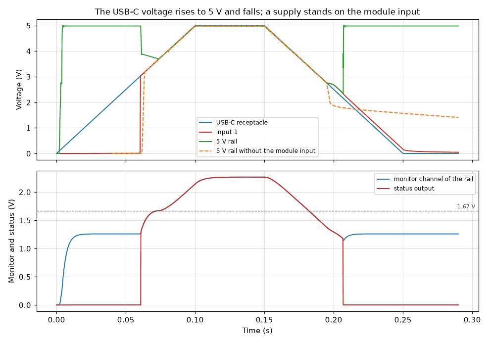

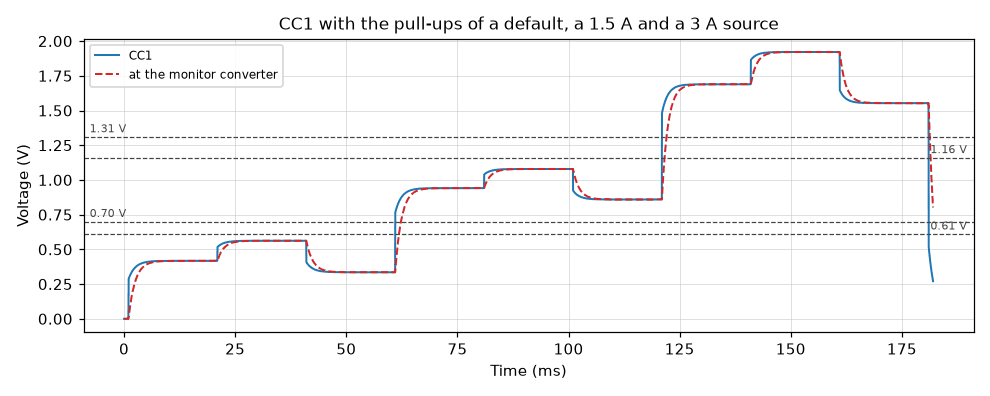

Notes:

- The supply at the receptacle has no cable and can take current back, so that
  the receptacle follows it down; with a cable that is pulled the receptacle
  follows the capacitors behind the limiter instead.
- The limiter and the multiplexer are typical parts with nominal resistors; the
  bands of the specification come from their tolerances. The multiplexer model
  has 10 mV of hysteresis at its priority input, which the datasheet does not
  state.
- On the way up the multiplexer finds its priority input above the threshold as
  soon as the limiter has turned on, so only the way down shows its threshold.
- The monitor converter is not in the circuit: the channel is the voltage on its
  filter capacitor. The share of the rail is read 48 ms after USB-C has taken
  over and 38 ms after the module input has; the filter has 5 ms.
- The protection array on the CC pins is in the circuit; its leakage is not
  modelled, and the 51 uV that the specification calculates from it cannot be
  confirmed by a simulation.

Models. written here: B0530W, DIGITAL_1N5819HW, DIGITAL_PICO2_SUPPLY,
L_74438357100, PWRIN_1N5819HW, PWRIN_LED_GREEN, PWRIN_LP5907, PWRIN_SMAJ10A,
PWRIN_TPD4E1U06_CH, PWRIN_TPS2116, PWRIN_TPS259621, PWRIN_TPS3808G01,
PWRIN_WCAP_47U.

Decks: [thresholds.both.cir](thresholds.both.cir),
[thresholds.cc.cir](thresholds.cc.cir).

## `power_input/unplug`

**The USB-C cable is pulled: the rail falls, the multiplexer changes to the
module input.**

The idle carrier runs from USB-C when that cable is pulled. In the first run the
cable of the module is in. The rail falls with the load, the supervisor sheds
the carrier, and the rail and the output of the USB-C limiter go on falling
together until the priority input of the multiplexer has passed its threshold.
The multiplexer then closes the module input onto a rail of about 2.4 V without
soft start. In the second run the cable of the module is not in, and the
question is how long the pins of the receptacle keep a voltage. In the third run
the cable is pulled while the source meter takes its full power, again without
the cable of the module: the rail then falls faster than the 3.3 V rails are
discharged.

Answers: section 4.1 (when a cable is pulled or plugged), section 16.

| Figure | Simulated | Specification | Limits | Verdict | Source |
| --- | --- | --- | --- | --- | --- |
| 5V_OK low after the pull, idle carrier | 969.1 µs | | | | |
| Rail when 5V_OK falls | 3.88 V | | 3.7 V to 4 V | pass | section 3: 5V_OK falls at 3.83 V to 4.00 V; the rail goes on falling while the supervisor reacts |
| The multiplexer closes the module input after the pull | 107.3 ms | 200 ms (-46.35 %) | | | section 4.1: up to about 0.2 s later at idle (estimate) |
| Output of the USB-C limiter when the multiplexer changes | 2.357 V | 2.37 V (-0.53 %) | 2.15 V to 2.59 V | pass | section 4.1: 2.15 V to 2.59 V (calculated) |
| Rail when the multiplexer changes | 2.357 V | | at least 1 V | pass | section 4.1: without soft start, because the rail is above 1 V |
| Largest current from the port of the module in the recharge | 4.378 A | | | | |
| Time the port current is above 0.85 A in the recharge | 4.616 µs | | | | |
| Largest current through the multiplexer in the recharge | 4.103 A | | at most 4 A | **FAIL** | TPS2116 datasheet, page 4: 4 A for a pulse; the specification says several amperes for some microseconds |
| Time the multiplexer carries more than 4 A in the recharge | 345.2 ns | | | | |
| Rail back at 4.5 V after the change | 213.6 µs | | | | |
| Lowest level of the module input of the multiplexer in the recharge | 2.655 V | | | | |
| Without the cable of the module: receptacle below 0.8 V after the pull | 206.6 ms | 400 ms (-48.36 %) | | | section 4.1: about 0.4 s after the unplug (estimate) |
| Without the cable of the module: largest output of the USB-C limiter above its input | 116.6 mV | | at most 300 mV | pass | section 4.1: within 0.3 V of the input, the rating of the part |
| Pulled at full output: fall of the rail until the supervisor trips | 1.843e+04 V/s | | | | |
| Pulled at full output: 5V_OK low after the rail has passed 3.91 V | 34.22 µs | | at most 100 µs | pass | section 4.1: the pre-regulator is off within 0.1 ms (estimate) |
| Pulled at full output: level of the rail 0.2 ms after 5V_OK has fallen | 2.628 V | | | | |
| Pulled at full output: highest level of 3V3_A above the rail | 27.61 mV | | at most 300 mV | pass | LP5907 datasheet, page 4: output at most 0.3 V above the input; the specification states no figure |
| Pulled at full output: highest level of 3V3_C above the rail | 25.35 mV | | at most 300 mV | pass | LP5907 datasheet, page 4: output at most 0.3 V above the input; the specification states no figure |
| Pulled at full output: VSYS of the module 1 ms after the pull | 3.85 V | | | | |

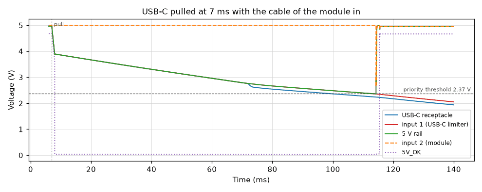

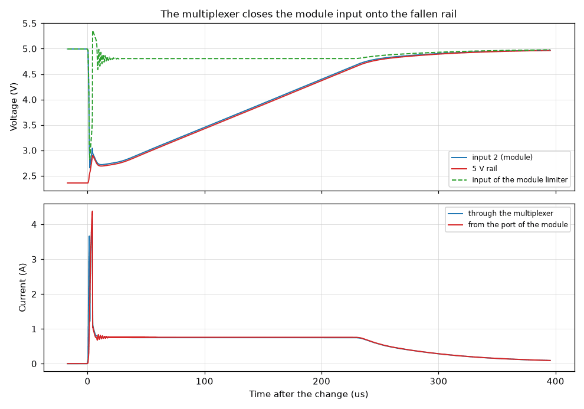

Notes:

- After the supervisor has shed the carrier, the rail falls with what is left on
  it: the 10 kohm load, the dividers, the supply current of the limiter and what
  the boost converter needs to hold its output. The boost converter here is a
  load that only refills its output; its own supply current (2 mA while it
  switches, datasheet) is not in the run, so the real decay is faster than this
  one.
- The pulse of the recharge is the charge of the 1 uF at the module input and
  what the limiter lets through before it acts. Its peak through the multiplexer
  is set by ideal capacitors without series inductance and by a limiter model
  without saturation current: an upper bound.
- The supervisor has its release delay shortened to 1 ms; after the change it
  releases the carrier again 1 ms after the rail is back, not 0.3 s.
- Sources and cables as in the other benches; the port of the module is stiff.

Models. written here: B0530W, DIGITAL_1N5819HW, DIGITAL_PICO2_SUPPLY,
L_74438357100, PWRIN_1N5819HW, PWRIN_LED_GREEN, PWRIN_LP5907, PWRIN_SMAJ10A,
PWRIN_TPD4E1U06_CH, PWRIN_TPS2116, PWRIN_TPS259621, PWRIN_TPS3808G01,
PWRIN_WCAP_47U.

Decks: [unplug.alone.cir](unplug.alone.cir), [unplug.both.cir](unplug.both.cir),
[unplug.loaded.cir](unplug.loaded.cir).
