# Simulation Results: Range Control Logic

Everything on this page is a simulation result. Nothing here is measured on
hardware. The page is written by `circuit-sim report` from the result files
beside it; do not edit it by hand.

## `range_logic/blanking`

**The blanking time: the old voltage after a change and the pulse of a step
down.**

Two things that the step-up comparator must not act on are measured. First the
old voltage. After a jump to range 3 the comparators still see what the
amplifier held before: the capacitors at its inputs discharge through the
multiplexer, and its output comes back from a voltage far above the thresholds.
The run steps the load from 1 uA to 500 mA and to 20 mA, with and without a
capacitor at the terminals, and reads how long CMP_UP stays high after the
address changed. Second the pulse of a step down. The sequencer is in range 3
with 59 mA and no capacitor at the terminals, firmware asks for one step down,
and the gate of the range 3 switch falls 1 us after range 2 took over. Below its
threshold that gate pulls its charge out of the load node through the 1 ohm
shunt. The run reads the pulse at the ladder, at the amplifier inputs and at the
comparator inputs, with the step-up threshold at the lower limit of its band, at
5.0 V, 5.5 V and 0.8 V and with the multiplexer at 125 ohm, 250 ohm and 430 ohm.

Answers: section 4.4 (blanking), rule F-17, decision D-76, section 11 (step down
at 59 mA).

| Figure | Simulated | Vendor models | Specification | Limits | Verdict | Source |
| --- | --- | --- | --- | --- | --- | --- |
| CMP_UP high after the address changed, shortest of the load steps | 258.6 ns | 257.6 ns | 600 ns (-56.90 %) | at most 3 µs | pass | section 4.4: 0.6 us to 1.0 us, simulated; rule F-17: blanked for 3 us |
| CMP_UP high after the address changed, longest of the load steps | 832.9 ns | 831 ns | 1 µs (-16.71 %) | at most 3 µs | pass | section 4.4: 0.6 us to 1.0 us, simulated; rule F-17: blanked for 3 us |
| The same: 500 mA, 1 uF, 125 ohm | 418.7 ns | 423.6 ns | | | | |
| The same: 500 mA, 1 uF, 250 ohm | 523.5 ns | 526.3 ns | | | | |
| The same: 500 mA, 1 uF, 430 ohm | 665.2 ns | 668.3 ns | | | | |
| The same: 500 mA, 1 uF, worst delays | 731.4 ns | 734 ns | | | | |
| The same: 500 mA, no capacitor, 125 ohm | 451.9 ns | 451 ns | | | | |
| The same: 500 mA, no capacitor, 250 ohm | 542.5 ns | 541.1 ns | | | | |
| The same: 500 mA, no capacitor, 430 ohm | 764.7 ns | 763.1 ns | | | | |
| The same: 500 mA, no capacitor, worst delays | 832.9 ns | 831 ns | | | | |
| The same: 500 mA, 100 nF, 250 ohm | 487.1 ns | 486.6 ns | | | | |
| The same: 20 mA, no capacitor, 250 ohm | 258.6 ns | 257.6 ns | | | | |
| The same: 20 mA, no capacitor, 430 ohm | 321.8 ns | 320.7 ns | | | | |
| Range changes after one step-down request, most of the nine runs | 1 | 1 | 1 (+0.00 %) | 1 to 1 | pass | section 11: one change of the range bits, no step back up |
| Pulse over after the gate line fell, longest of the nine runs | 783.4 ns | 807.3 ns | | at most 2 µs | pass | rule F-17: blanked until 2.0 us after the last change |
| 5.0 V, 125 ohm: largest ladder voltage in the pulse | 95.6 mV | 104.2 mV | | | | |
| 5.0 V, 125 ohm: largest voltage at the amplifier inputs | 79.21 mV | 86.93 mV | | | | |
| 5.0 V, 125 ohm: largest voltage at the comparator inputs | 402 mV | 439.5 mV | | | | |
| 5.5 V, 125 ohm: largest ladder voltage in the pulse | 99.65 mV | 109.2 mV | | | | |
| 5.5 V, 125 ohm: largest voltage at the amplifier inputs | 81.83 mV | 90.43 mV | 87.5 mV (-6.48 %) | | | section 4.4: reaches the lowest step-up threshold, simulated |
| 5.5 V, 125 ohm: largest voltage at the comparator inputs | 414.5 mV | 456.3 mV | 447.4 mV (-7.34 %) | | | the same threshold at the comparator input |
| 0.8 V, 125 ohm: largest ladder voltage in the pulse | 62.66 mV | 63.3 mV | | | | |
| 0.8 V, 125 ohm: largest voltage at the amplifier inputs | 59.71 mV | 60.06 mV | | | | |
| 0.8 V, 125 ohm: largest voltage at the comparator inputs | 309.1 mV | 310.7 mV | | | | |
| 5.5 V, 250 ohm: largest voltage at the amplifier inputs | 70.04 mV | 76.71 mV | | | | |
| 5.5 V, 430 ohm: largest voltage at the amplifier inputs | 61.34 mV | 65.53 mV | | | | |
| CMP_UP high after the request, threshold at its lowest, longest of the runs | 0 s | 35.81 ns | | | | |

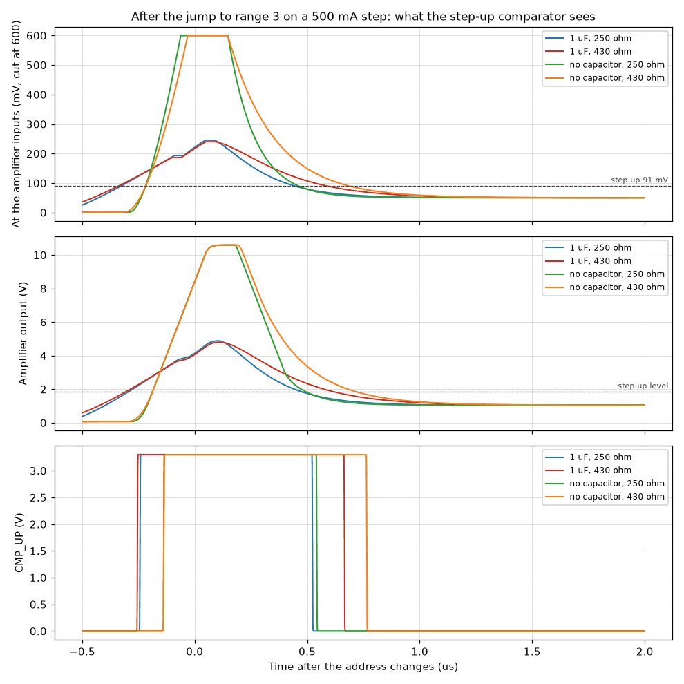

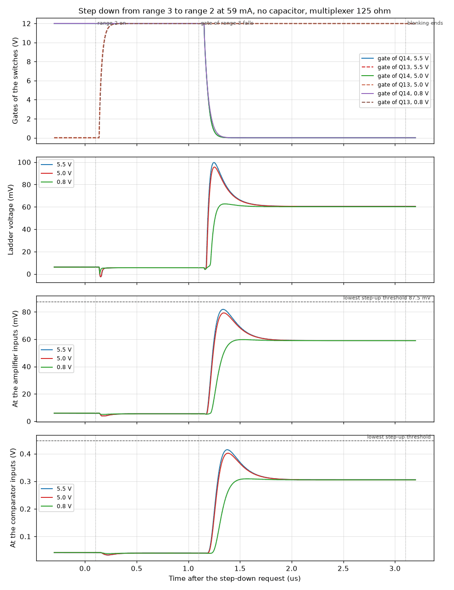

Notes:

- Old voltage: the amplifier model returns from its output limit at its slew
  rate. The overload recovery of the real part is not in its datasheet and not
  in the model; it adds to these times, and the specification allows 5 us for it
  elsewhere (section 4.5), which is longer than the 3 us from the first change
  to the end of the blanking. After a jump that does no harm, because range 3
  has no step up left.
- Step down: the size of the pulse follows the gate charge of the range 3 switch
  below its threshold. The model of that switch is fitted to the typical gate
  charge curve of its datasheet (12 nC at 4.5 V) and has a fixed gate-source
  capacitance; a part at the upper end of its gate charge gives a larger pulse.
- With the transistor model written here the pulse stays 6 mV below the lowest
  step-up threshold at 5.5 V with the multiplexer at 125 ohm. With the model of
  the manufacturer, in the vendor tier, it is a tenth larger and passes that
  threshold by 3 mV at 5.5 V, as the specification says, and comes within 1 mV
  of it at 5.0 V. The two models differ in how they split the gate charge, which
  the datasheet does not settle. The blanking covers the pulse in either case.
- The comparator model passes no pulse shorter than its delay of 47 ns, and the
  model of the sequencer none shorter than its reaction time: whether a short
  pulse above a threshold would move a real sequencer cannot be read from them.
  The figures to rely on are the voltages.
- The source holds its voltage behind 20 mohm; 5.5 V is above the 5.00 V that
  firmware allows as a set-point and stands for the worst case of section 11.
- Vendor tier: the range 3 switch and the two transistors of the output switch
  take the model of their manufacturer. The comparators keep the model written
  here, because the loop finds its operating point only with their hysteresis
  held, and the model of the manufacturer offers no node for that. The bench
  models/range-logic-mcp6561 puts the two comparator models side by side.

Models. written here: AD8421, BAV199, CSD17577Q3A, IRLML0030, IRLML0030_CLAMP,
MCP656X, MUX509, OPA197, OPA365, OUTPUT_PTVS15V, RL_MCP6562, TC4427CH.

Decks: [blanking.1uf-250.cir](blanking.1uf-250.cir),
[blanking.5p5v-125.cir](blanking.5p5v-125.cir),
[blanking.5v-125.cir](blanking.5v-125.cir),
[blanking.none-250.cir](blanking.none-250.cir).

## `range_logic/hot-plug`

**Hot plug of 100 uF and a short circuit at the output: the surge in the
ladder.**

The output is on at 5 V and a contact closes on it. Behind 30 mohm and 50 nH of
lead the contact connects a discharged 100 uF capacitor, or a short circuit. The
ladder is in range 0 or in range 2. Its voltage rises until the two clamp
transistors carry the current; the jump comparator forces range 3, the 0.1 ohm
branch takes over, and the over-current trip opens the output 12 us later. The
run reads the current in each clamp transistor, the time it spends above 5 A,
the ladder voltage, and current and energy in the 0.1 ohm shunt. It is made with
the worst delays and with the two clamp transistors at their typical curve, both
at the low end of the threshold, both at the high end, and one at each end.
Further runs change the lead to 20 nH and 150 nH and the output voltage to 5.5
V.

Answers: section 4.3 (ladder clamp, decision D-66), section 4.4 (jump, trip),
section 11 (pulses).

| Figure | Simulated | Vendor models | Specification | Limits | Verdict | Source |
| --- | --- | --- | --- | --- | --- | --- |
| Largest current in a clamp transistor, both at the same threshold | 7.235 A | 7.095 A | 8.8 A (-17.79 %) | at most 21 A | pass | section 4.3: 8.8 A in each part, simulated; section 4.3: pulsed rating 21 A (datasheet value) |
| Largest current in one clamp transistor, thresholds at opposite ends | 12.16 A | 11.97 A | 14.2 A (-14.35 %) | at most 21 A | pass | section 4.3: 14.2 A in one part, simulated; section 4.3: pulsed rating 21 A (datasheet value) |
| Hot plug: longest time a clamp transistor carries more than 5 A | 285.6 ns | 285.6 ns | 540 ns (-47.11 %) | at most 540 ns | pass | section 4.3: above 5 A for at most 0.54 us, simulated |
| Short circuit: longest time a clamp transistor carries more than 5 A | 14.79 µs | 14.63 µs | 540 ns (+2639.59 %) | at most 540 ns | **FAIL** | section 4.3: above 5 A for at most 0.54 us, simulated |
| The same with both clamp transistors at their typical curve | 152.6 ns | 145.6 ns | 540 ns (-71.74 %) | at most 540 ns | pass | section 4.3: above 5 A for at most 0.54 us, simulated |
| Largest ladder voltage | 3.822 V | 3.813 V | 3.9 V (-2.00 %) | at most 3.9 V | pass | section 4.3: ladder at most 3.9 V, simulated |
| Largest current in the 0.1 ohm shunt | 29.52 A | 29.16 A | 27 A (+9.35 %) | | | section 4.3: up to 27 A for microseconds; accepted on the energy |
| Largest energy in the 0.1 ohm shunt in one event | 1.36 mJ | 1.304 mJ | 1 mJ (+35.99 %) | at most 200 mJ | pass | section 4.3: about 1 mJ against 200 mJ, calculated |
| Largest current in the 1 ohm shunt, events in range 2 | 3.505 A | 3.497 A | | | | |
| Contact closed to the line of the output switch low, longest | 12.32 µs | 12.32 µs | | at most 21 µs | pass | rule F-18: at most 20 us of qualification; 1 us for the jump |
| Events after which the output stayed on, of 16 | 0 | 0 | | | | |
| Lowest voltage at the output terminal | -228.3 mV | -321.9 mV | | at least -2.5 V | pass | section 11: VOUT above -2.5 V in a short circuit |
| Short, 20 nH of lead, both low: current in a clamp transistor | 11.03 A | 10.69 A | | at most 21 A | pass | section 4.3: pulsed rating 21 A (datasheet value) |
| Short, 20 nH of lead, opposite ends: current in one | 16.56 A | 16.17 A | | at most 21 A | pass | section 4.3: pulsed rating 21 A (datasheet value) |
| Short, 150 nH of lead, both low: current in a clamp transistor | 4.491 A | 4.279 A | | at most 21 A | pass | section 4.3: pulsed rating 21 A (datasheet value) |
| Short at 5.5 V, both low: current in a clamp transistor | 8.454 A | 8.301 A | | at most 21 A | pass | section 4.3: pulsed rating 21 A (datasheet value) |
| Short at 5.5 V, opposite ends: current in one | 13.89 A | 13.67 A | | at most 21 A | pass | section 4.3: pulsed rating 21 A (datasheet value) |
| Short at 5.5 V, 20 nH, opposite ends: current in one | 19.26 A | 18.79 A | | at most 21 A | pass | section 4.3: pulsed rating 21 A (datasheet value) |
| Hot plug, typical clamp: current with the nominal delays | 5.772 A | 5.673 A | | | | |
| Hot plug, typical clamp: current with the worst delays | 6.184 A | 6.071 A | | | | |

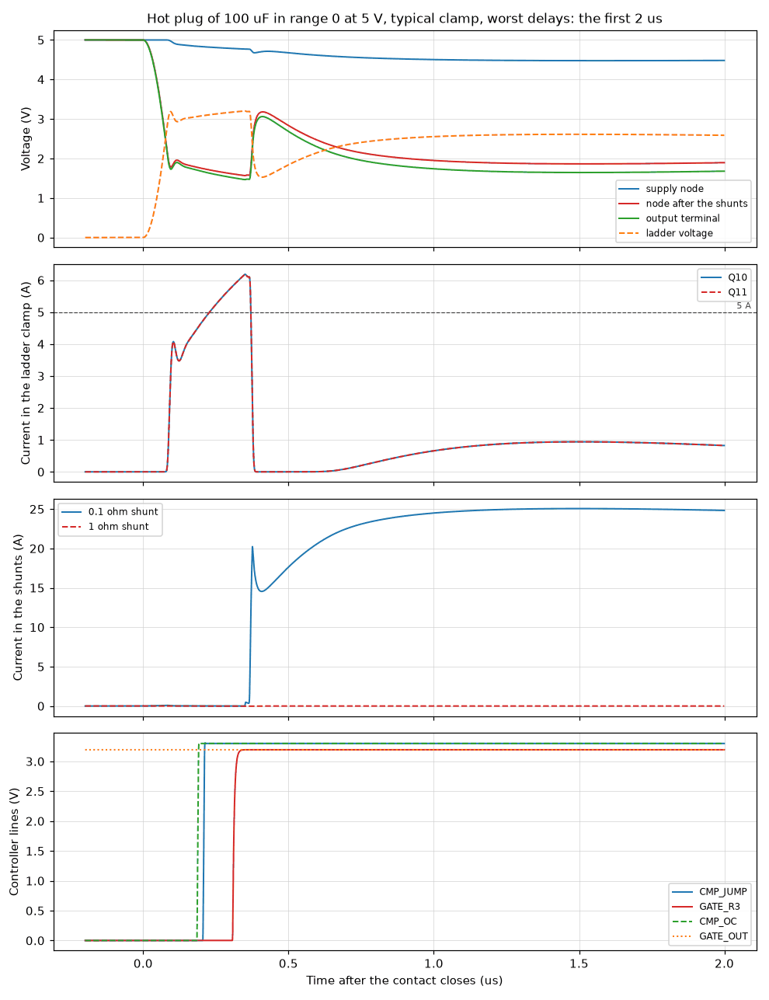

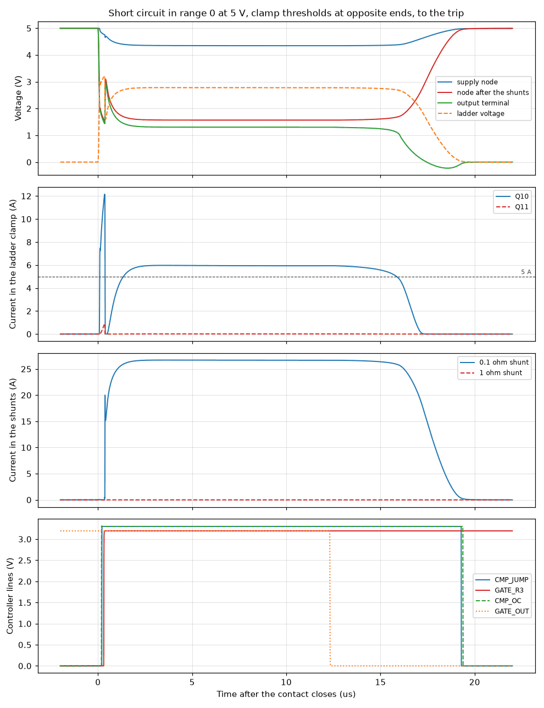

Notes:

- The surge is set by what stands around the instrument, and the specification
  does not say what its figures assumed. Here: a source that holds its voltage
  behind 20 mohm, 30 mohm and 50 nH of lead, a contact of 10 mohm that closes
  within 5 ns, and 10 mohm in the capacitor. The earlier simulations of the
  design had the same lead and 5.6 V; the runs at 5.5 V come close to their 8.8
  A and 14.2 A.
- The lead inductance sets how far the current rises before range 3 conducts: 20
  nH in place of 50 nH adds about half to the clamp current.
- A source that holds 5 V through a short circuit is an external supply in
  ampere mode with short leads. The source meter cannot do that: its regulator
  limits its current, and the 22 uF at its output hold the charge of about 4 us
  at 27 A. For it the figures of the first microsecond hold and the ones up to
  the trip are an upper bound.
- In the short circuit the 0.1 ohm branch carries about 27 A until the trip, and
  the ladder stands at about 2.8 V. A clamp transistor at the low end of its
  threshold conducts at that voltage: it carries 5 A to 8 A for the whole 15 us,
  not for the 0.54 us of the specification. The peak stays below the pulsed
  rating; the energy in that transistor is about 0.3 mJ.
- The clamp model is fitted to the typical output curve of the datasheet up to
  10 A; the low and high variants move its threshold by the spread the datasheet
  states at 25 uA, which is an assumption about amperes. The transistors heat in
  such a pulse and the model does not.
- The amplifier sees up to 3.8 V between its inputs in these events. Its model
  has no input protection and no overload recovery; the datasheet limits of its
  inputs are not checked here.
- Vendor tier: the range 3 switch and the two transistors of the output switch
  take the model of their manufacturer. The comparators keep the model written
  here, because the loop finds its operating point only with their hysteresis
  held, and the model of the manufacturer offers no node for that. The bench
  models/range-logic-mcp6561 puts the two comparator models side by side.

Models. written here: AD8421, BAV199, CSD17577Q3A, IRLML0030, IRLML0030_CLAMP,
IRLML0030_CLAMP_HI, IRLML0030_CLAMP_LO, MCP656X, MUX509, OPA197, OPA365,
OUTPUT_PTVS15V, RL_MCP6562, TC4427CH.

Decks: [hot-plug.plug-r0-typical.cir](hot-plug.plug-r0-typical.cir),
[hot-plug.short-r0-opposite.cir](hot-plug.short-r0-opposite.cir).

## `range_logic/input-clamp`

**The comparator inputs with 3V3_A off and the amplifier output at 10 V.**

The supply of the comparators is at 0 V and the amplifier output rises to 12 V.
The amplifier runs from +12 V and can hold its output high while 3V3_A is off:
after a failed part, or with the negative rail missing. The divider R136 and
R137 and the diode pair D23 then have to keep the comparator inputs within 1.0 V
of their supply. The run takes the comparator sheet alone with a source in the
place of the amplifier output, ramps that source from 0 V to 12 V, and reads the
node of the comparator inputs and the currents in R136 and in the diode at 10 V,
at 10.4 V, which is the highest output of the amplifier, and at 12 V. It is
repeated with the diode at the forward voltage that its datasheet gives as the
maximum, and with 3V3_A present.

Answers: section 4.5 (comparator inputs, limiter), decision D-76, section 16
(comparators).

| Figure | Simulated | Vendor models | Specification | Limits | Verdict | Source |
| --- | --- | --- | --- | --- | --- | --- |
| Node above 3V3_A, amplifier at 10 V, diode at its datasheet maximum | 933.1 mV | 933.1 mV | 950 mV (-1.78 %) | at most 950 mV | pass | section 4.5: the node cannot pass 3V3_A + 0.95 V at 25 C |
| The same with the amplifier at its highest output, 10.4 V | 935.9 mV | 935.9 mV | | at most 1 V | pass | section 4.5: rating of the comparator inputs, 1.0 V beyond the supply |
| The same with the amplifier output at its 12 V rail | 945.7 mV | 945.7 mV | | at most 1 V | pass | section 4.5: rating of the comparator inputs, 1.0 V beyond the supply |
| Node above 3V3_A, amplifier at 10 V, typical diode | 836.2 mV | 836.2 mV | | | | |
| Node above 3V3_A, amplifier at 10 V, diode with a low forward voltage | 739 mV | 739 mV | | | | |
| Current in the clamp diode, amplifier at 10 V, typical diode | 2.208 mA | 2.208 mA | 2.3 mA (-3.99 %) | at most 2.85 mA | pass | section 4.5: limited to 2.3 mA to 2.8 mA, calculated; 2.8 mA to its last digit |
| The same with the amplifier at its highest output, 10.4 V | 2.338 mA | 2.338 mA | 2.3 mA (+1.64 %) | at most 2.85 mA | pass | section 4.5: limited to 2.3 mA to 2.8 mA, calculated; 2.8 mA to its last digit |
| The same with a diode of low forward voltage | 2.467 mA | 2.467 mA | | at most 2.85 mA | pass | section 4.5: limited to 2.3 mA to 2.8 mA, calculated; 2.8 mA to its last digit |
| Typical diode, amplifier output at its 12 V rail, which it cannot reach | 2.857 mA | 2.857 mA | 2.8 mA (+2.03 %) | | | |
| Current in R136, amplifier at 10.4 V, typical diode | 3.176 mA | 3.176 mA | | | | |
| Power in R136 with the amplifier output at its 12 V rail | 41.32 mW | 41.32 mW | | at most 100 mW | pass | limit of this bench: 0.1 W, the usual rating of a 0603 resistor (assumption) |
| 3V3_A present, amplifier at 10.4 V: node of the comparator inputs | 2.594 V | 2.593 V | 2.594 V (+0.00 %) | at most 3.3 V | pass | section 4.5: the divider keeps the inputs inside the supply |
| 3V3_A present, amplifier at 12 V: current in the clamp diode | 5.21 nA | 5.209 nA | | at most 1 µA | pass | limit of this bench: no clamp current while the rail is present |

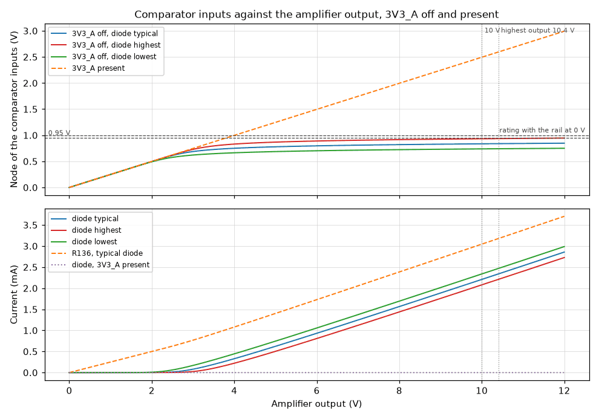

Notes:

- The amplifier is not in this circuit: a source stands for its output, so the
  run says nothing about how that output gets high. The rail is held at 0 V by a
  source; a rail that is merely unpowered is lifted by the clamp current through
  whatever loads it, and the node rises with it by the same amount.
- The diode model is fitted to the maximum forward voltage of its datasheet at
  25 C (0.9 V at 1 mA, 1.0 V at 10 mA). The typical and the low curve are
  assumptions: the datasheet gives a maximum only. Near 0 C the forward voltage
  is about 50 mV higher, which uses up the margin to the rating that these
  figures show.
- The comparator model draws no input current and has no input protection of its
  own. The real part has protection structures at its inputs that take a share
  of the current once the node stands a diode drop above its rail; how the
  current divides between them and D23 is not in this run.
- The current in the diode is the current of R136 less what R137 takes. It grows
  with the amplifier output and with a lower forward voltage: the 2.3 mA and 2.8
  mA of the specification are met at 10.4 V and just passed, by 0.06 mA, with
  the output at the 12 V rail itself.
- With 3V3_A present the node follows the divider and stays below the rail up to
  an amplifier output of 13.2 V, more than its supply.

Models. written here: BAV199, BAV199_HI, BAV199_LO, MCP656X.

Decks: [input-clamp.off-highest.cir](input-clamp.off-highest.cir),
[input-clamp.off-lowest.cir](input-clamp.off-lowest.cir),
[input-clamp.off-typical.cir](input-clamp.off-typical.cir),
[input-clamp.present.cir](input-clamp.present.cir).

## `range_logic/jump`

**The jump path: from the jump threshold at the ladder to range 3 conducting.**

A load steps from 1 uA to 500 mA in range 0 with 1 uF at the terminals. The
capacitor supplies the step, so the ladder voltage rises at about 0.45 V per
microsecond. The run measures the time from the instant the ladder voltage
passes the jump threshold, 151 mV, to the instant the 0.1 ohm branch carries 50
mA. The loop is closed through the real comparators and the model of the
sequencer. The delays on the way are varied one at a time and together: the
on-resistance of the multiplexer, which with the capacitors at the amplifier
inputs delays the sense voltage, the delay of the comparators, the reaction of
the sequencer, and the delay and output resistance of the gate driver.

Answers: section 4.4 (jump up, reaction time), rule F-16, requirement R-07.

| Figure | Simulated | Vendor models | Specification | Limits | Verdict | Source |
| --- | --- | --- | --- | --- | --- | --- |
| Threshold to conducting branch, nominal delays | 360.8 ns | 362 ns | 350 ns (+3.08 %) | at most 550 ns | pass | section 4.4, simulated; target 0.55 us at the most |
| Threshold to conducting branch, best delays | 215.1 ns | 217.1 ns | 200 ns (+7.57 %) | at most 550 ns | pass | section 4.4, simulated; target 0.55 us at the most |
| Threshold to conducting branch, worst delays | 480.3 ns | 481.8 ns | 510 ns (-5.82 %) | at most 550 ns | pass | section 4.4, simulated; target 0.55 us at the most |
| The same at 0.8 V, nominal delays | 340.8 ns | 339.6 ns | | at most 550 ns | pass | section 4.4, simulated; target 0.55 us at the most |
| The same at 0.8 V, worst delays | 457.4 ns | 456.4 ns | | at most 550 ns | pass | section 4.4, simulated; target 0.55 us at the most |
| Multiplexer at 125 ohm, the rest nominal | 304 ns | 305 ns | | at most 550 ns | pass | section 4.4, simulated; target 0.55 us at the most |
| Multiplexer at 430 ohm, the rest nominal | 433.1 ns | 434.4 ns | | at most 550 ns | pass | section 4.4, simulated; target 0.55 us at the most |
| Comparators at 80 ns, the rest nominal | 393.4 ns | 394.8 ns | | at most 550 ns | pass | section 4.4, simulated; target 0.55 us at the most |
| Sequencer at 20 ns, the rest nominal | 284.4 ns | 285.9 ns | | at most 550 ns | pass | section 4.4, simulated; target 0.55 us at the most |
| Gate driver at 20 ns, the rest nominal | 350.8 ns | 352 ns | | at most 550 ns | pass | section 4.4, simulated; target 0.55 us at the most |
| Gate driver at 40 ns and 10 ohm, the rest nominal | 375.4 ns | 376.4 ns | | at most 550 ns | pass | section 4.4, simulated; target 0.55 us at the most |
| Worst delays and the amplifier at half the bandwidth of its model | 511.6 ns | 513 ns | | | | no limit: the datasheet of the amplifier gives no spread of its bandwidth |
| Nominal, of which: input filter and amplifier | 148.3 ns | 148.1 ns | | | | |
| Nominal, of which: divider and comparator | 50.14 ns | 50.13 ns | | | | |
| Nominal, of which: sequencer | 103.3 ns | 103.4 ns | 100 ns (+3.32 %) | at most 110 ns | pass | rule F-16: within 100 ns; a parameter of the model, read between the middles of two edges, hence 10 % of allowance |
| Nominal, of which: driver, gate resistor and switch | 59.05 ns | 60.42 ns | | | | |
| Nominal: ladder voltage when the branch conducts | 299.3 mV | 304.7 mV | | | | |

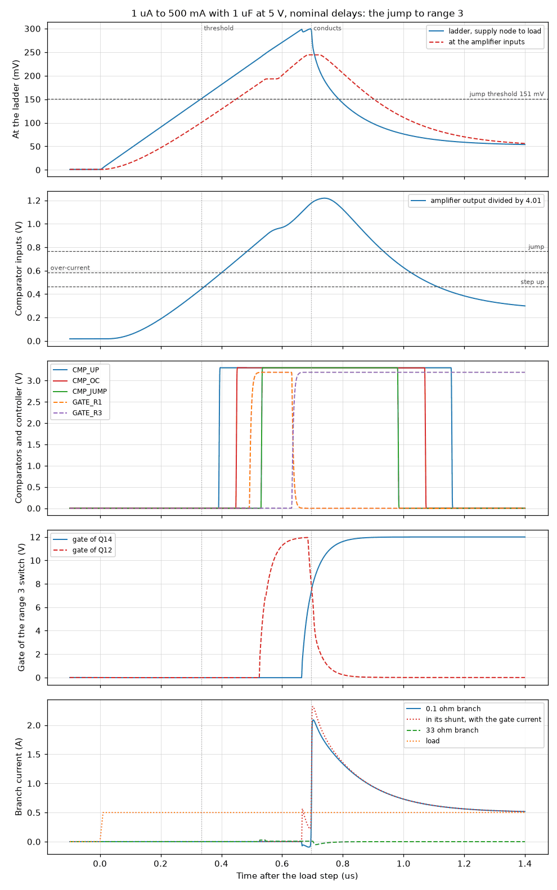

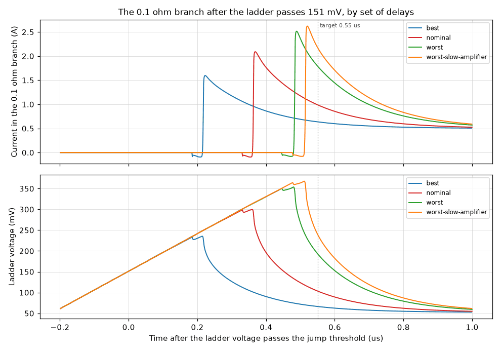

Notes:

- The branch counts as conducting from 50 mA, the level of the earlier
  simulations of the design; the specification names none. The charging current
  of the gate of the range 3 switch flows through the same shunt, about 0.6 A
  for 30 ns, before the channel conducts; it is taken out of the branch current
  with the current of the gate resistor. Counted in, the branch would seem to
  conduct about 30 ns earlier.
- Nominal: multiplexer 250 ohm, comparators 47 ns, sequencer 100 ns, driver 30
  ns and 7 ohm. Best: 125 ohm, 47 ns, 20 ns, 20 ns. Worst: 430 ohm, 80 ns, 100
  ns, 40 ns and 10 ohm. The driver figures are the limits of its datasheet at 18
  V; at 12 V with a 3.3 V input it is slower by an amount the datasheet shows in
  a curve only.
- The sequencer is the model of rule F-16 with its reaction time as a parameter:
  the 100 ns are an input of this bench, not a result.
- The comparator model has one delay whatever the overdrive. Here the input
  rises by about 2.2 V per microsecond, so the overdrive passes 100 mV, the
  condition of the datasheet figure, within 45 ns.
- The amplifier model has 6.4 MHz of bandwidth at this gain and no spread; the
  last delay figure halves it to show what a slower part would cost.
- The source is 5 V or 0.8 V behind 20 mohm and holds its voltage; the load is a
  current sink with an edge of 10 ns beside 1 uF with 5 mohm.
- Vendor tier: the range 3 switch and the two transistors of the output switch
  take the model of their manufacturer. The comparators keep the model written
  here, because the loop finds its operating point only with their hysteresis
  held, and the model of the manufacturer offers no node for that. The bench
  models/range-logic-mcp6561 puts the two comparator models side by side.

Models. written here: AD8421, BAV199, CSD17577Q3A, IRLML0030, IRLML0030_CLAMP,
MCP656X, MUX509, OPA197, OPA365, OUTPUT_PTVS15V, RL_MCP6562, TC4427CH.

Decks: [jump.best.cir](jump.best.cir), [jump.nominal.cir](jump.nominal.cir),
[jump.worst.cir](jump.worst.cir).

## `range_logic/landing`

**Load steps with a capacitor at the load: the range reached and the time to a
true reading.**

The load steps from 1 uA to 150 uA, 5 mA and 80 mA beside a capacitor. A
capacitor at the load supplies a step at first, and the ladder sees the voltage
by which that capacitor has sagged, not the load current times a shunt. The
sequencer therefore acts on the sag. The runs take 100 nF, 1 uF, 10 uF and 100
uF and read which ranges the sequencer passes, where it stays, and how long it
takes until the current that the amplifier output stands for is the load current
within 1 %. No request to step down is made: what firmware does afterwards is
not in these runs.

Answers: sections 4.3 and 4.4 (step up, blanking, jump), requirement R-07.

| Figure | Simulated | Specification | Limits | Verdict | Source |
| --- | --- | --- | --- | --- | --- |
| 150 uA with 100 nF: range at the end | 1 | 1 (+0.00 %) | | | |
| 150 uA with 100 nF: ranges passed, as digits in their order | 1 | | | | |
| 150 uA with 100 nF: reading within 1 % of the load after | 243 µs | | | | |
| 150 uA with 1 uF: range at the end | 1 | 1 (+0.00 %) | | | |
| 150 uA with 1 uF: ranges passed, as digits in their order | 1 | | | | |
| 150 uA with 1 uF: reading within 1 % of the load after | 1.295 ms | | | | |
| 150 uA with 10 uF: range at the end | 1 | 1 (+0.00 %) | | | |
| 150 uA with 10 uF: ranges passed, as digits in their order | 1 | | | | |
| 150 uA with 10 uF: reading within 1 % of the load after | 11.81 ms | | | | |
| 150 uA with 100 uF: range at the end | 2 | 1 (+100.00 %) | | | |
| 150 uA with 100 uF: ranges passed, as digits in their order | 12 | | | | |
| 150 uA with 100 uF: reading within 1 % of the load after | 94.16 ms | | | | |
| 5 mA with 100 nF: range at the end | 2 | 2 (+0.00 %) | | | |
| 5 mA with 100 nF: ranges passed, as digits in their order | 12 | | | | |
| 5 mA with 100 nF: reading within 1 % of the load after | 9.555 µs | | | | |
| 5 mA with 1 uF: range at the end | 2 | 2 (+0.00 %) | | | |
| 5 mA with 1 uF: ranges passed, as digits in their order | 12 | | | | |
| 5 mA with 1 uF: reading within 1 % of the load after | 32.43 µs | | | | |
| 5 mA with 10 uF: range at the end | 2 | 2 (+0.00 %) | | | |
| 5 mA with 10 uF: ranges passed, as digits in their order | 12 | | | | |
| 5 mA with 10 uF: reading within 1 % of the load after | 266.5 µs | | | | |
| 5 mA with 100 uF: range at the end | 2 | 2 (+0.00 %) | | | |
| 5 mA with 100 uF: ranges passed, as digits in their order | 12 | | | | |
| 5 mA with 100 uF: reading within 1 % of the load after | 2.607 ms | | | | |
| 80 mA with 100 nF: range at the end | 3 | 2 (+50.00 %) | | | |
| 80 mA with 100 nF: ranges passed, as digits in their order | 13 | | | | |
| 80 mA with 100 nF: reading within 1 % of the load after | 1.775 µs | | | | |
| 80 mA with 1 uF: range at the end | 3 | 2 (+50.00 %) | | | |
| 80 mA with 1 uF: ranges passed, as digits in their order | 13 | | | | |
| 80 mA with 1 uF: reading within 1 % of the load after | 3.847 µs | | | | |
| 80 mA with 10 uF: range at the end | 3 | 2 (+50.00 %) | | | |
| 80 mA with 10 uF: ranges passed, as digits in their order | 123 | | | | |
| 80 mA with 10 uF: reading within 1 % of the load after | 27.36 µs | | | | |
| 80 mA with 100 uF: range at the end | 2 | 2 (+0.00 %) | | | |
| 80 mA with 100 uF: ranges passed, as digits in their order | 12 | | | | |
| 80 mA with 100 uF: reading within 1 % of the load after | 367.2 µs | | | | |
| Runs that end above the range of their current, of 12 | 4 | | | | |
| Largest distance of the reading from the load at the end of a run | 0.04615 % | | at most 1 % | pass | limit of this bench: every run is long enough to settle |
| Shortest time between two steps in the runs without a jump | 2.968 µs | 3 µs (-1.06 %) | at least 3 µs | **FAIL** | rule F-17: 1 us of overlap and 2 us of blanking between two steps |

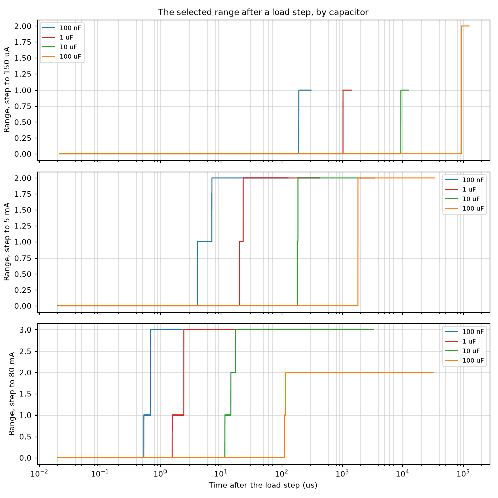

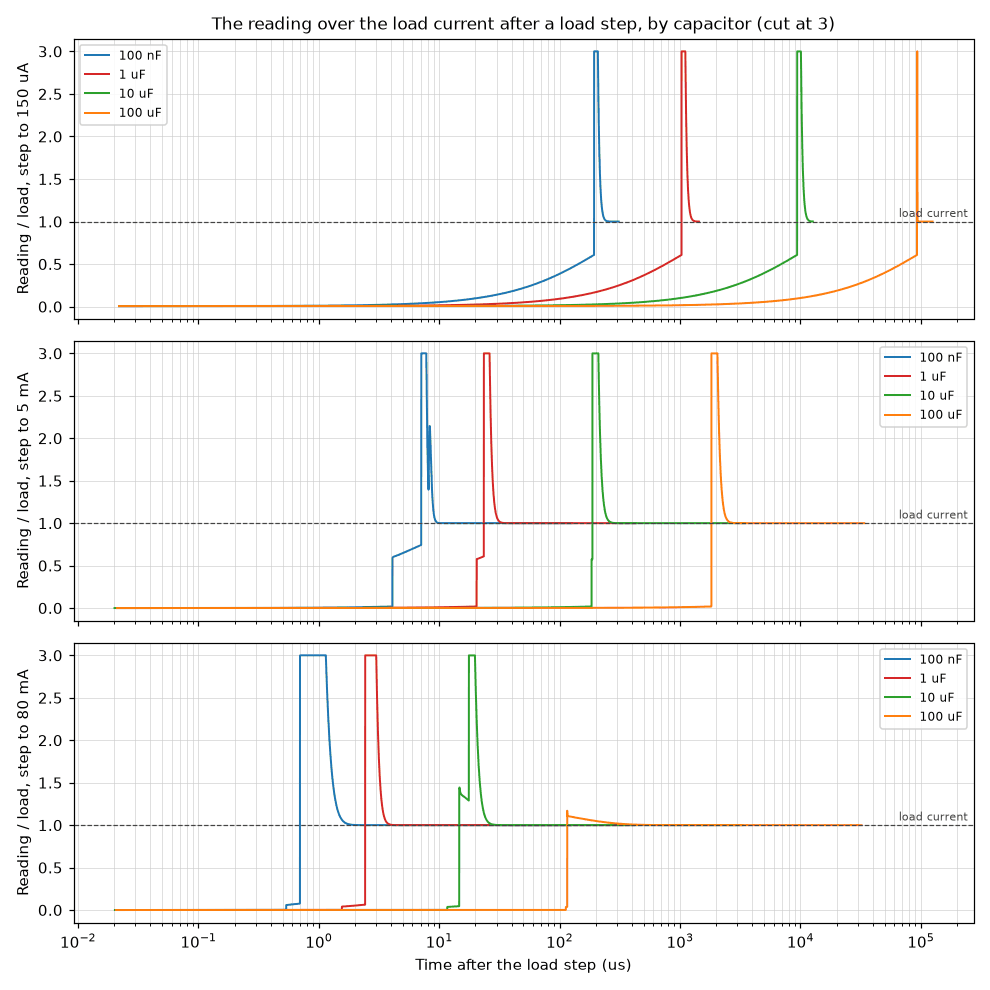

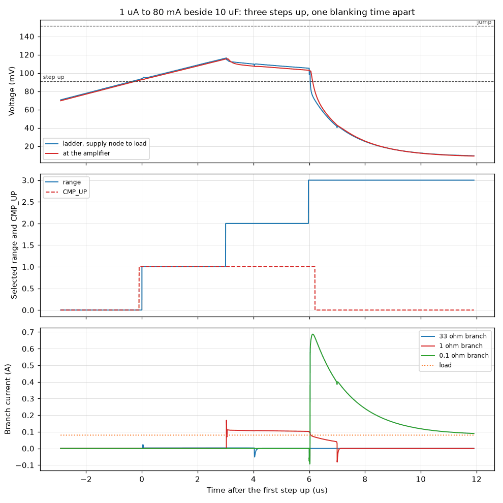

Notes:

- The range of a current is the lowest one whose full scale lies above it: range
  1 for 150 uA, range 2 for 5 mA and for 80 mA. The specification promises no
  range after a step; the figures carry that range as the expected value and no
  limit.
- A step up comes when the capacitor has sagged by 91 mV, whatever the current.
  The new shunt then sees those 91 mV as well and recharges the capacitor with
  them; while its voltage stays above the threshold after the blanking time, the
  sequencer takes the next step. With enough capacitance it so passes the range
  of the current.
- Until the capacitor is back at its voltage the shunt carries the load and the
  recharge. The reading is the current into the node, which is what a shunt can
  measure; in range 0 with 100 uF that takes a tenth of a second.
- Firmware would step down again 100 samples after the current fell below the
  level of the range (60 mA, 1.8 mA, 60 uA). A current between the step-down
  level of a range and the step-up level of the one below stays where the step
  left it: 80 mA in range 3 reads with a resolution of 19 uA and an offset
  allowance of 1 mA, where range 2 gives 1.9 uA and 0.1 mA.
- The model of the sequencer takes the next step 2.96 us after the one before,
  1.2 % short of the 3 us that its parameters ask for: its delay element
  switches a little before its time has passed. That is a property of the model
  and says nothing about a program.
- The amplifier and the comparators have no noise here, and the comparator
  hysteresis is the 2 mV of the model. A real comparator that rests within its
  hysteresis of the threshold after a step may or may not ask for the next one.
- The load is a current sink beside the capacitor (5 mohm in series); the source
  holds 5 V behind 20 mohm.
- Vendor tier: the range 3 switch and the two transistors of the output switch
  take the model of their manufacturer. The comparators keep the model written
  here, because the loop finds its operating point only with their hysteresis
  held, and the model of the manufacturer offers no node for that. The bench
  models/range-logic-mcp6561 puts the two comparator models side by side.

Models. written here: AD8421, BAV199, CSD17577Q3A, IRLML0030, IRLML0030_CLAMP,
MCP656X, MUX509, OPA197, OPA365, OUTPUT_PTVS15V, RL_MCP6562, TC4427CH.

Decks: [landing.80ma-10uf.cir](landing.80ma-10uf.cir).

## `range_logic/load-step`

**Requirement R-07: the drop on a step from 1 uA to 500 mA, and the ladder
clamp.**

The load steps from 1 uA to 500 mA in range 0 with 1 uF and with 10 uF. Until
range 3 conducts the capacitor at the terminals supplies the step, and the
voltage between the supply node and the output terminal, which is what the
requirement limits, grows with it. The run is made with the nominal delays at 5
V, 3.3 V and 0.8 V, and with everything against the limit at once: the worst
delays with the sequencer at its 100 ns, the jump threshold at the upper end of
its band, the capacitor 10 % low and 20 nH of lead to it. Two more runs give the
sequencer 300 ns, which rule F-16 forbids. The last runs take less capacitance
and 1 A, to see when the ladder clamp begins to conduct.

Answers: requirement R-07, sections 4.3 (ladder clamp) and 4.4 (jump up),
decision D-65.

| Figure | Simulated | Vendor models | Specification | Limits | Verdict | Source |
| --- | --- | --- | --- | --- | --- | --- |
| 1 uF, nominal, 5 V: largest drop | 301.9 mV | 302 mV | 312 mV (-3.24 %) | at most 500 mV | pass | requirement R-07; simulated value of section 2 |
| 1 uF, nominal, 5 V: time above 0.2 V | 302 ns | 308.5 ns | | at most 1 µs | pass | requirement R-07: 1 us |
| 1 uF, nominal, 5 V: from the final value after 5 us | 2.417 µV | 2.479 µV | | at most 50 mV | pass | section 11, test of R-07: within 50 mV |
| 1 uF, nominal, 3.3 V: largest drop | 301.2 mV | 302 mV | 312 mV (-3.45 %) | at most 500 mV | pass | requirement R-07; simulated value of section 2 |
| 1 uF, nominal, 0.8 V: largest drop | 299.6 mV | 302.4 mV | 312 mV (-3.97 %) | at most 500 mV | pass | requirement R-07; simulated value of section 2 |
| 0.9 uF, worst case, 5 V: largest drop | 388.2 mV | 387.2 mV | 422 mV (-8.02 %) | at most 500 mV | pass | requirement R-07; simulated value of section 2 |
| 0.9 uF, worst case, 5 V: time above 0.2 V | 390 ns | 407 ns | | at most 1 µs | pass | requirement R-07: 1 us |
| 0.9 uF, worst case, 5 V: from the final value after 5 us | 2.141 µV | 2.135 µV | | at most 50 mV | pass | section 11, test of R-07: within 50 mV |
| 0.9 uF, worst case, 3.3 V: largest drop | 387.4 mV | 386.2 mV | 422 mV (-8.19 %) | at most 500 mV | pass | requirement R-07; simulated value of section 2 |
| 0.9 uF, worst case, 0.8 V: largest drop | 386.5 mV | 385.4 mV | 422 mV (-8.41 %) | at most 500 mV | pass | requirement R-07; simulated value of section 2 |
| 0.9 uF, worst case, 0.8 V: time above 0.2 V | 366 ns | 365 ns | | at most 1 µs | pass | requirement R-07: 1 us |
| 0.9 uF, worst case, amplifier at half its bandwidth: largest drop | 400.3 mV | 402.3 mV | 422 mV (-5.15 %) | at most 500 mV | pass | requirement R-07; simulated value of section 2 |
| 0.9 uF, worst case, amplifier at half its bandwidth: time above 0.2 V | 500 ns | 506.5 ns | | at most 1 µs | pass | requirement R-07: 1 us |
| 10 uF, nominal, 5 V: largest drop | 168.3 mV | 168.1 mV | 169 mV (-0.42 %) | at most 250 mV | pass | requirement R-07; simulated value of section 2 |
| 10 uF, nominal, 5 V: from the final value after 10 us | 704.5 µV | 750.4 µV | | at most 50 mV | pass | section 11, test of R-07: within 50 mV |
| 10 uF, nominal, 0.8 V: largest drop | 167.9 mV | 168.1 mV | 169 mV (-0.68 %) | at most 250 mV | pass | requirement R-07; simulated value of section 2 |
| 9 uF, worst case, 5 V: largest drop | 179.2 mV | 179.1 mV | 186 mV (-3.67 %) | at most 250 mV | pass | requirement R-07; simulated value of section 2 |
| 9 uF, worst case, 5 V: from the final value after 10 us | 293.3 µV | 321.3 µV | | at most 50 mV | pass | section 11, test of R-07: within 50 mV |
| 9 uF, worst case, amplifier at half its bandwidth: largest drop | 180.8 mV | 180.6 mV | 186 mV (-2.78 %) | at most 250 mV | pass | requirement R-07; simulated value of section 2 |
| 1 uF, sequencer of 300 ns: largest drop | 445.1 mV | 443.5 mV | 472 mV (-5.71 %) | | | risk register, section 14 |
| 0.9 uF, worst case, sequencer of 300 ns: drop | 472.5 mV | 468.2 mV | 519 mV (-8.96 %) | | | risk register, section 14 |
| 1 uF, nominal: time from the jump threshold to 0.5 V across the ladder | 769.4 ns | 770.4 ns | 770 ns (-0.08 %) | 720 ns to 820 ns | pass | section 4.4: 0.5 V corresponds to 0.77 us with 1 uF, calculated |
| Range at the end of every run | 3 | 3 | 3 (+0.00 %) | 3 to 3 | pass | section 4.4: the jump comparator forces range 3 |
| 470 nF, 500 mA, worst delays: ladder voltage | 522.5 mV | 539.4 mV | | at most 1.3 V | pass | section 4.3: no conduction with 470 nF or more; threshold 1.3 V at 25 uA |
| 470 nF, 1 A, worst delays: ladder voltage | 863.1 mV | 871.6 mV | | at most 1.3 V | pass | section 4.3: no conduction with 470 nF or more; threshold 1.3 V at 25 uA |
| 470 nF, 1 A: current in a clamp transistor | 137.1 pA | 129.1 pA | | | | |
| 100 nF, 1 A, worst delays: ladder voltage | 1.907 V | 1.914 V | | | | |
| 100 nF, 1 A: current in a clamp transistor | 52.04 mA | 52.73 mA | | | | |
| No capacitor, 1 A, worst delays: ladder voltage | 2.114 V | 2.114 V | | | | |
| No capacitor, 1 A: current in a clamp transistor | 498 mA | 497.1 mA | | | | |

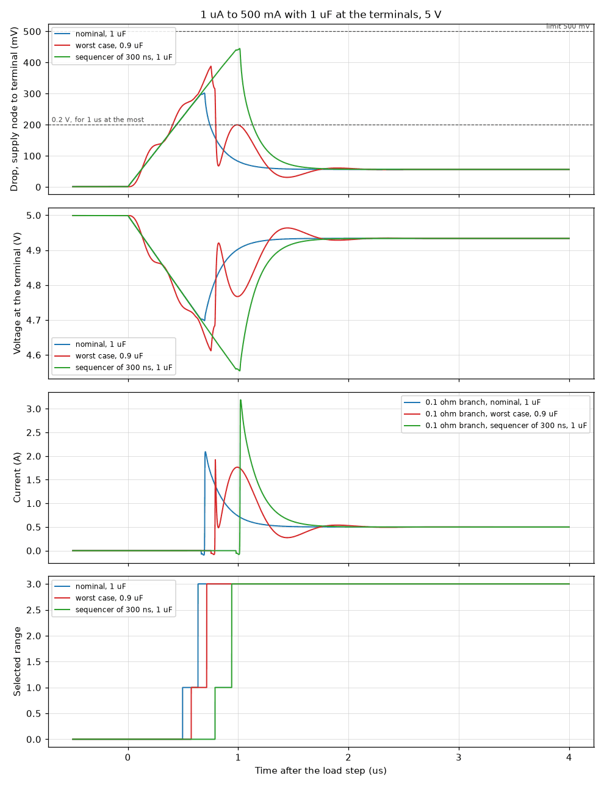

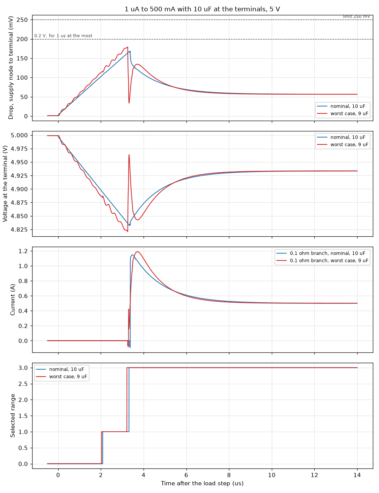

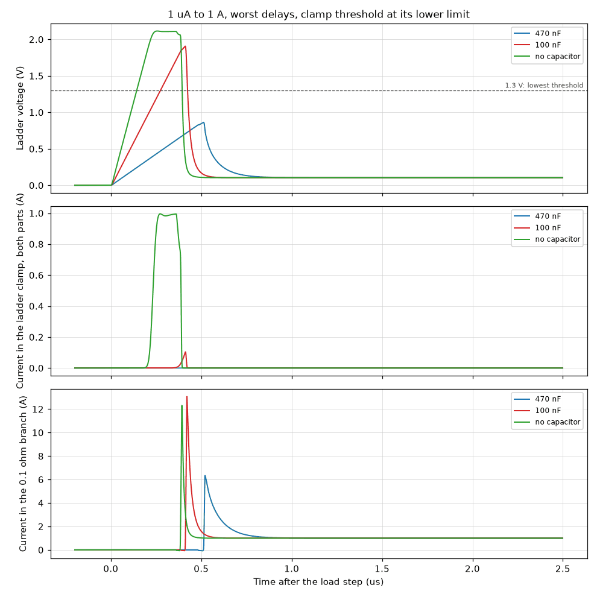

Notes:

- The drop is taken between the supply node and the output terminal, as the
  requirement defines it. The source holds its voltage behind 20 mohm, so the
  terminal voltage falls by about the same amount; what the regulator or an
  external supply adds is not in these runs.
- Worst case: multiplexer 430 ohm, comparators 80 ns, sequencer 100 ns, driver
  40 ns and 10 ohm, jump threshold at 155.1 mV, capacitor 10 % low, 20 nH of
  lead between the terminal and the capacitor. The amplifier keeps the bandwidth
  of its model, 6.4 MHz; two more runs give it half of that, which is an
  assumption (its datasheet states no spread) and comes close to the worst case
  of the earlier simulations of the design.
- The two runs with a sequencer of 300 ns are outside rule F-16. They show where
  the limit of 0.5 V is lost and carry no limit themselves.
- The gate charge of the range 3 switch, about 15 nC, is pushed into the load
  node when the switch turns on and lifts 1 uF by about 14 mV: the drop peaks
  that much below what the delay alone would give.
- The clamp runs use the clamp model with its threshold 0.4 V below the typical
  curve. That model has no current below its threshold, so the ladder voltage
  against the 1.3 V of the datasheet is the figure that counts; the current is
  what the model shows beyond it.
- The load is a current sink beside the capacitor (5 mohm in series) and stops
  drawing below about 0.1 V.
- Vendor tier: the range 3 switch and the two transistors of the output switch
  take the model of their manufacturer. The comparators keep the model written
  here, because the loop finds its operating point only with their hysteresis
  held, and the model of the manufacturer offers no node for that. The bench
  models/range-logic-mcp6561 puts the two comparator models side by side.

Models. written here: AD8421, BAV199, CSD17577Q3A, IRLML0030, IRLML0030_CLAMP,
IRLML0030_CLAMP_LO, MCP656X, MUX509, OPA197, OPA365, OUTPUT_PTVS15V, RL_MCP6562,
TC4427CH.

Decks: [load-step.clamp-1a-470n.cir](load-step.clamp-1a-470n.cir),
[load-step.nominal-10u.cir](load-step.nominal-10u.cir),
[load-step.nominal-1u.cir](load-step.nominal-1u.cir),
[load-step.worst-1u.cir](load-step.worst-1u.cir).

## `range_logic/power-on`

**DUT power on into 1000 uF to 3300 uF: the in-rush against the armed trip.**

Range 3 is selected, the trip is armed and the output switch is asked to close.
The output switch closes as a source follower behind 2.2 Mohm and 10 nF, so the
output voltage rises slowly and a discharged capacitor at the output draws a
current in proportion to its size. The trip has no blanking at a start: the
current has to stay below the over-current level by itself. The run takes 1000
uF, 1800 uF, 2200 uF, 2200 uF plus 20 %, and 3300 uF at 5 V, and 2200 uF at 3.3
V and 0.8 V, and reads the largest current in the 0.1 ohm shunt, when the output
begins to rise and how fast, and whether the trip acts.

Answers: sections 4.2 (output switch) and 4.4 (trip without blanking), rules
F-19, F-20 and F-24.

| Figure | Simulated | Vendor models | Specification | Limits | Verdict | Source |
| --- | --- | --- | --- | --- | --- | --- |
| 1000 uF at 5 V: largest current in the shunt | 403.5 mA | 397.7 mA | 390 mA (+3.46 %) | at most 1 A | pass | section 4.2: 0.39 A into 1000 uF, simulated; section 11: no trip, peak below 1.0 A up to 1800 uF |
| 1800 uF at 5 V: largest current in the shunt | 714.8 mA | 708.8 mA | | at most 1 A | pass | section 11: no trip, peak below 1.0 A up to 1800 uF |
| 2200 uF at 5 V: largest current in the shunt | 868.1 mA | 862.7 mA | 850 mA (+2.13 %) | at most 1.15 A | pass | section 4.2: 0.85 A into 2200 uF, simulated; section 4.4: below the trip level |
| 2200 uF plus 20 % at 5 V: largest current in the shunt | 1.035 A | 1.031 A | | | | |
| 2200 uF at 3.3 V: largest current in the shunt | 852.9 mA | 856.7 mA | | at most 1.15 A | pass | section 4.4: below the trip level up to about 2200 uF |
| 2200 uF at 0.8 V: largest current in the shunt | 819.6 mA | 783.8 mA | | at most 1.15 A | pass | section 4.4: below the trip level up to about 2200 uF |
| Starts into 2200 uF or less in which the trip acts, of 5 | 0 | 0 | | at most 0 | pass | section 4.4: no trip up to about 2200 uF |
| 2200 uF plus 20 %: the trip acts (1 when so) | 0 | 0 | | | | |
| 3300 uF: the trip acts (1 when so) | 1 | 1 | 1 (+0.00 %) | | | rule F-19: a start trips with more than about 2200 uF |
| 2200 uF at 5 V: request to 0.1 V at the output | 6.354 ms | 6.545 ms | 6.5 ms (-2.24 %) | | | section 4.2: starts to rise 6 ms to 7 ms after the request, simulated |
| 2200 uF at 5 V: slope of the output between 1 V and 2 V | 369.5 V/s | 364.6 V/s | 440 V/s (-16.01 %) | | | section 4.2: 0.44 V/ms, simulated |
| 2200 uF at 5 V: request to 90 % of the output voltage | 20.39 ms | 20.72 ms | 20 ms (+1.97 %) | | | section 4.2: about 20 ms at 5.0 V, simulated |

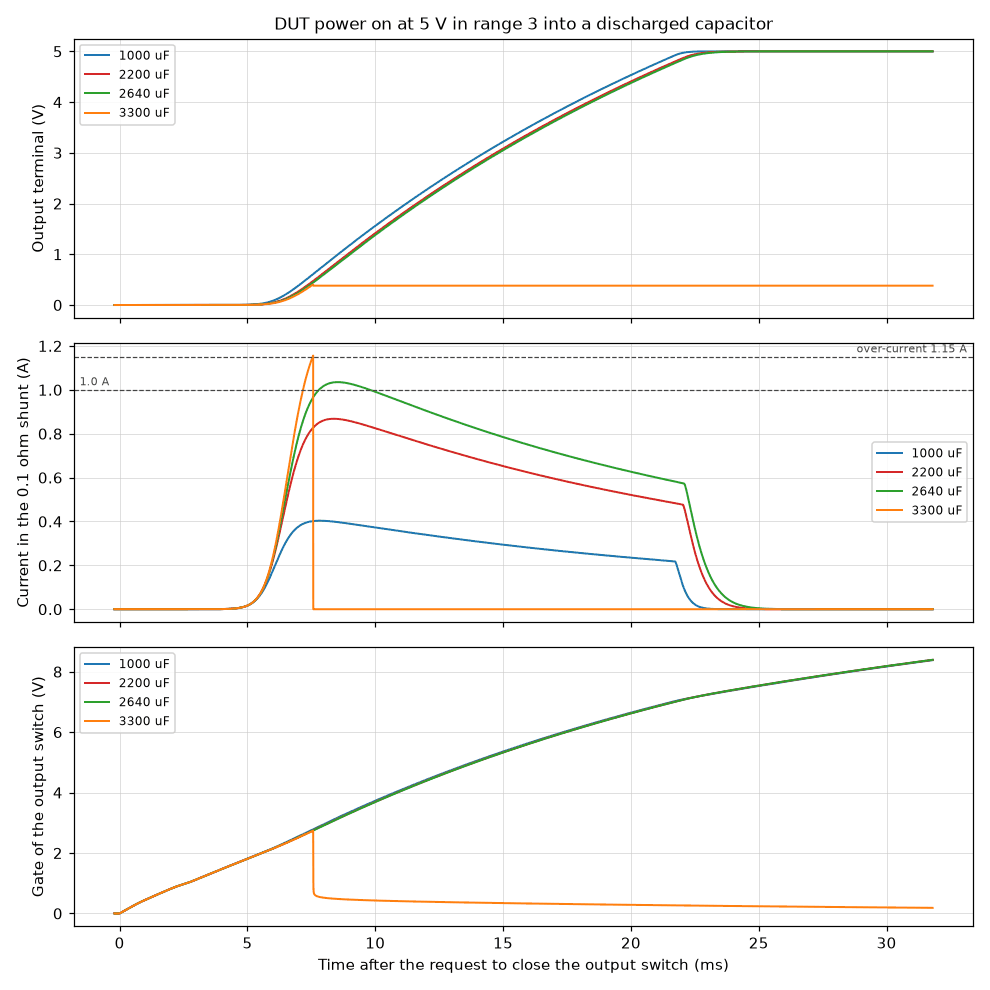

Notes:

- The capacitor has 20 mohm in series and starts at 0 V; a leak of 100 kohm
  stands for the rest of the device. A device that draws current while its
  supply rises adds to the in-rush.
- The slope of the output, and with it the current, follows the gate network and
  the capacitances of the two switch transistors; the instant at which the
  output begins to rise follows their threshold. The transistor model is a
  typical part.
- The trip is the model of rule F-18 and is armed from the start of the run;
  that range 3 is selected first is the order of rule F-24, set here through the
  state at rest.
- The source holds its voltage behind 20 mohm: what the regulator does with 0.9
  A of in-rush is not in this run.
- Vendor tier: the range 3 switch and the two transistors of the output switch
  take the model of their manufacturer. The comparators keep the model written
  here, because the loop finds its operating point only with their hysteresis
  held, and the model of the manufacturer offers no node for that. The bench
  models/range-logic-mcp6561 puts the two comparator models side by side.

Models. written here: AD8421, BAV199, CSD17577Q3A, IRLML0030, IRLML0030_CLAMP,
MCP656X, MUX509, OPA197, OPA365, OUTPUT_PTVS15V, RL_MCP6562, TC4427CH.

Decks: [power-on.2200uf.cir](power-on.2200uf.cir).

## `range_logic/ramp`

**A slow ramp from 1 uA to 1 A and back: one range at a time, no bounce.**

The load current rises from 1 uA to 1 A in 60 ms and falls again. The ramp takes
10 ms for every decade, slow against every delay of the loop. On the way up the
step-up comparator moves the sequencer; on the way down the bench plays firmware
and asks for one step down 1 ms after the current has fallen below the level of
the range (60 mA, 1.8 mA, 60 uA), which is the 100 samples of the rule. The run
counts the range changes, reads the current at which each step up comes and the
shortest time between two changes, and compares the reading that the amplifier
output stands for with the load in the middle of every range. It is made without
a capacitor at the terminals and with 1 uF.

Answers: section 4.4 (step up, blanking, step down), rule F-17, requirement
R-07.

| Figure | Simulated | Specification | Limits | Verdict | Source |
| --- | --- | --- | --- | --- | --- |
| Range changes on the whole ramp, no capacitor | 6 | 6 (+0.00 %) | 6 to 6 | pass | section 4.4: three steps up, three steps down, none back |
| Ranges in the order 1, 2, 3, 2, 1, 0, no capacitor (1 when so) | 1 | | 1 to 1 | pass | section 4.4: a slow rise climbs range by range |
| Shortest time between two range changes, no capacitor | 14.77 ms | | at least 3 µs | pass | rule F-17: 1 us of overlap and 2 us of blanking |
| Longest time the jump comparator is high, no capacitor | 0 s | | at most 0 s | pass | section 4.4: a slow rise does not reach the jump threshold |
| Current through the ladder when range 0 is left, no capacitor | 91.23 µA | 90.95 µA (+0.31 %) | 87.5 µA to 94.4 µA | pass | section 4.3, switch up above: 91 uA, 2.85 mA, 91 mA |
| Current through the ladder when range 1 is left, no capacitor | 2.854 mA | 2.847 mA (+0.25 %) | 2.739 mA to 2.955 mA | pass | section 4.3, switch up above: 91 uA, 2.85 mA, 91 mA |
| Current through the ladder when range 2 is left, no capacitor | 91.26 mA | 91.04 mA (+0.24 %) | 87.59 mA to 94.49 mA | pass | section 4.3, switch up above: 91 uA, 2.85 mA, 91 mA |
| Load current at that instant, no capacitor | 93.4 µA | 90.95 µA (+2.70 %) | | | |
| Load current at that instant, no capacitor | 2.855 mA | 2.847 mA (+0.31 %) | | | |
| Load current at that instant, no capacitor | 91.23 mA | 91.04 mA (+0.20 %) | | | |
| Range changes on the whole ramp, 1 uF | 6 | 6 (+0.00 %) | 6 to 6 | pass | section 4.4: three steps up, three steps down, none back |
| Ranges in the order 1, 2, 3, 2, 1, 0, 1 uF (1 when so) | 1 | | 1 to 1 | pass | section 4.4: a slow rise climbs range by range |
| Shortest time between two range changes, 1 uF | 14 ms | | at least 3 µs | pass | rule F-17: 1 us of overlap and 2 us of blanking |
| Longest time the jump comparator is high, 1 uF | 0 s | | at most 0 s | pass | section 4.4: a slow rise does not reach the jump threshold |
| Current through the ladder when range 0 is left, 1 uF | 91.23 µA | 90.95 µA (+0.31 %) | 87.5 µA to 94.4 µA | pass | section 4.3, switch up above: 91 uA, 2.85 mA, 91 mA |
| Current through the ladder when range 1 is left, 1 uF | 2.854 mA | 2.847 mA (+0.25 %) | 2.739 mA to 2.955 mA | pass | section 4.3, switch up above: 91 uA, 2.85 mA, 91 mA |
| Current through the ladder when range 2 is left, 1 uF | 91.26 mA | 91.04 mA (+0.24 %) | 87.59 mA to 94.49 mA | pass | section 4.3, switch up above: 91 uA, 2.85 mA, 91 mA |
| Load current at that instant, 1 uF | 114.4 µA | 90.95 µA (+25.78 %) | | | |
| Load current at that instant, 1 uF | 2.876 mA | 2.847 mA (+1.04 %) | | | |
| Load current at that instant, 1 uF | 91.25 mA | 91.04 mA (+0.23 %) | | | |
| Reading against the load at 0.03 mA on the way up, no capacitor | -2.407 % | | -5 % to 5 % | pass | limit of this bench: the ramp is slow enough for the node after the shunts alone |
| Reading against the load at 0.03 mA on the way up, 1 uF | -20.31 % | | | | |
| Reading against the load at 1 mA on the way up, no capacitor | -0.09715 % | | -5 % to 5 % | pass | limit of this bench: the ramp is slow enough for the node after the shunts alone |
| Reading against the load at 1 mA on the way up, 1 uF | -0.813 % | | | | |
| Reading against the load at 30 mA on the way up, no capacitor | 0.003138 % | | -5 % to 5 % | pass | limit of this bench: the ramp is slow enough for the node after the shunts alone |
| Reading against the load at 30 mA on the way up, 1 uF | -0.02169 % | | | | |
| Reading against the load at 300 mA on the way up, no capacitor | -0.002733 % | | -5 % to 5 % | pass | limit of this bench: the ramp is slow enough for the node after the shunts alone |
| Reading against the load at 300 mA on the way up, 1 uF | -0.005893 % | | | | |

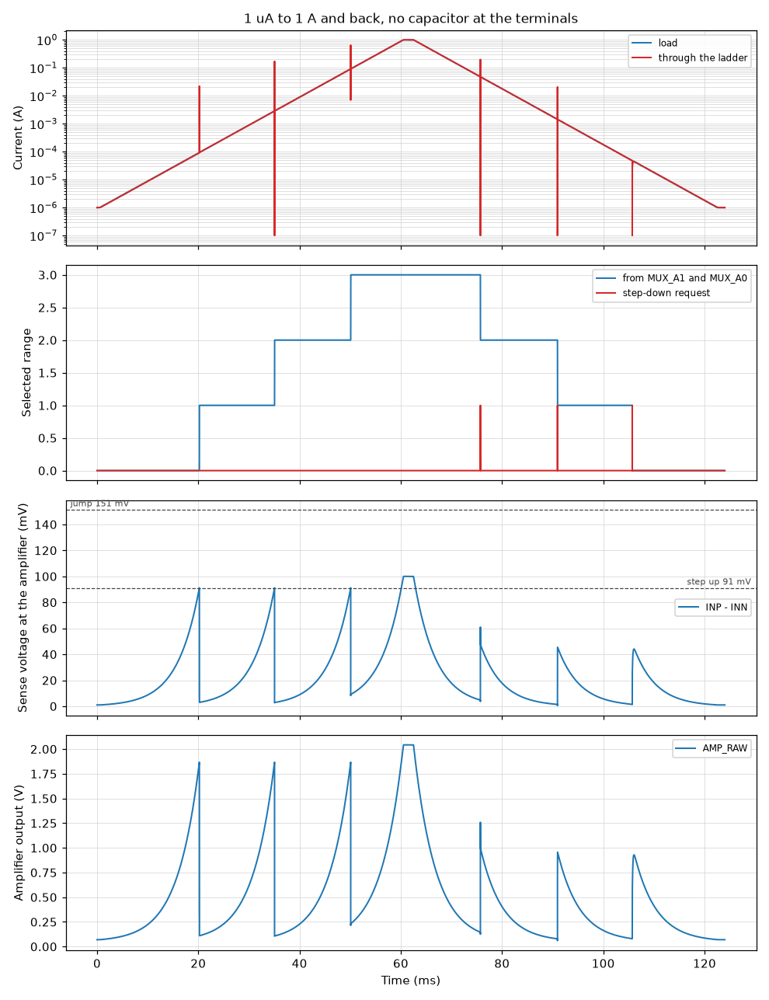

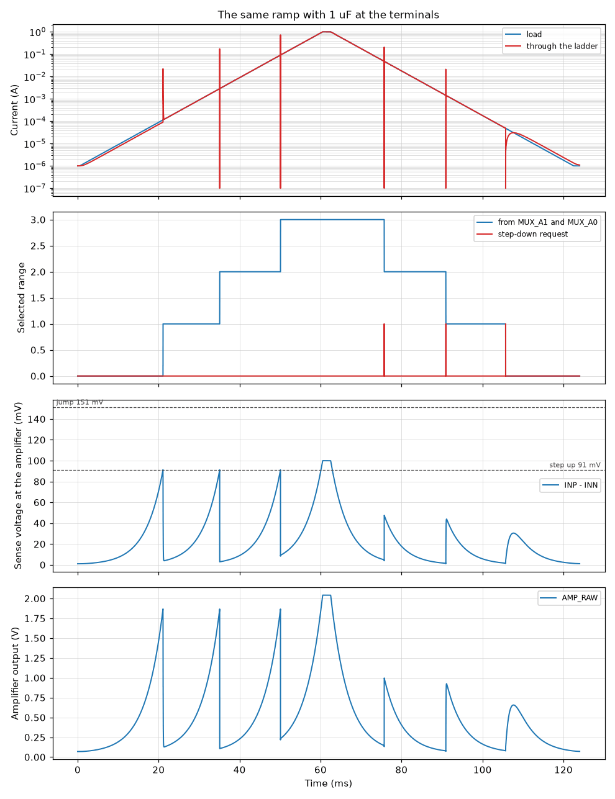

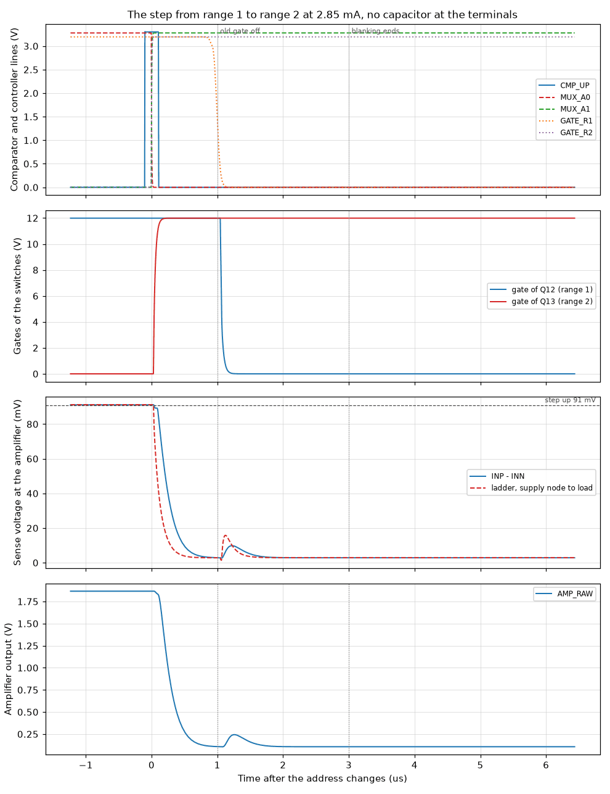

Notes:

- The sequencer is the model of rules F-16 to F-18. It steps down on a request
  only; the requests are placed by this bench where firmware would issue them
  and are not the work of a program.
- With 1 uF at the terminals the shunt of range 0 and that capacitor have a time
  constant of 1.1 ms: on a ramp of 10 ms per decade the current through the
  ladder lags the load by about a quarter, and range 0 is left at a load current
  that much above 91 uA. The figures without a limit show it. The instrument
  measures the current into the node; the capacitor supplies the rest.
- The reading is the amplifier output minus the pedestal, divided by the gain
  and the shunt of the selected range. Without a capacitor it trails the ramp by
  the time constant of the shunt with the 100 nF after the shunts, 2.3 % in
  range 0 at this rate.
- The source holds 5 V behind 20 mohm. The amplifier and the comparators have no
  noise in these runs: a real ramp that rests at a threshold for long would see
  the comparator output chatter inside its hysteresis, which the blanking bounds
  to one step.
- Vendor tier: the range 3 switch and the two transistors of the output switch
  take the model of their manufacturer. The comparators keep the model written
  here, because the loop finds its operating point only with their hysteresis
  held, and the model of the manufacturer offers no node for that. The bench
  models/range-logic-mcp6561 puts the two comparator models side by side.

Models. written here: AD8421, BAV199, CSD17577Q3A, IRLML0030, IRLML0030_CLAMP,
MCP656X, MUX509, OPA197, OPA365, OUTPUT_PTVS15V, RL_MCP6562, TC4427CH.

Decks: [ramp.no-capacitor.cir](ramp.no-capacitor.cir),
[ramp.with-1uf.cir](ramp.with-1uf.cir).

## `range_logic/reverse`

**Reverse current through the ladder: under-range level and voltage across the
ladder.**

A current flows from the load back into the output, in range 3 and in range 0.
The comparators see forward current only, and the converter reads a reverse
current as a code below the pedestal. The run lets the reverse current rise
slowly to 30 mA and reads at which current the converter input falls below the
level of code 650, from which firmware flags the samples as under-range. Then
the current steps to 1 A, and the run reads the voltage across the ladder with
range 3 selected, where the current flows through the channel of its switch, and
with every range gate low, where it flows through the body diodes.

Answers: section 4.4 (reverse current, decision D-69), rule F-22.

| Figure | Simulated | Vendor models | Specification | Limits | Verdict | Source |
| --- | --- | --- | --- | --- | --- | --- |
| Range 3: reverse current at which the converter input passes code 650 | 12.74 mA | 12.74 mA | 13 mA (-1.97 %) | 12.5 mA to 13.5 mA | pass | rule F-22: about 13 mA backward, calculated; to its last digit |
| Range 3, 1 A backward: voltage across the ladder | 104.3 mV | 105.4 mV | 105 mV (-0.64 %) | 100 mV to 110 mV | pass | section 4.4: 105 mV per ampere, calculated |
| Range 3, 1 A backward: converter input | 1.991 mV | 1.991 mV | | at most 24.8 mV | pass | rule F-22: a code below 650 is flagged as under-range |
| Range 3, 1 A backward: amplifier output | -1.943 V | -1.943 V | | | | |
| Range gates low, 1 A backward: voltage across the ladder | 711.3 mV | 731.8 mV | | | | |
| Range gates low, 1 A backward: converter input | 1.991 mV | 1.991 mV | | at most 24.8 mV | pass | rule F-22: a code below 650 is flagged as under-range |
| Highest level of a comparator output in both runs | 0 V | 0 V | | at most 100 mV | pass | section 4.4: the comparators see forward current only |
| Range changes in both runs | 0 | 0 | | at most 0 | pass | section 4.4: a reverse current moves no range by itself |

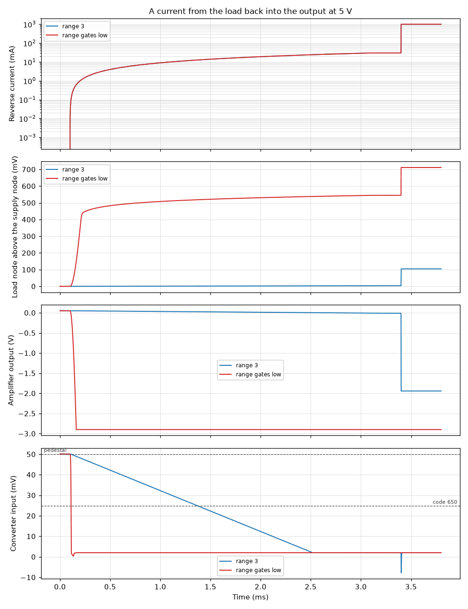

Notes:

- The load is a current source into the output, and the source of the instrument
  takes that current at 5 V behind 20 mohm. The regulator of the source meter
  cannot sink current, and an external supply may not: what the supply node then
  does is not in this run.
- The converter is not in the circuit; code 650 is taken as 24.8 mV at its
  input. With 1 A backward that input rests at the lower limit of its driver: 2
  mV in the model of the driver, 20 mV at the most by the datasheet figure in
  the head of that model. Both lie below the level of code 650.
- With every range gate low the current divides between the body diodes of the
  five transistors of the ladder by their models, which are typical parts at 25
  C; the share of each and its heating are not figures to take from this run.
- No program is in the loop: that firmware selects range 3 and opens the output
  after 100 ms (rule F-22) is not simulated.
- Vendor tier: the range 3 switch and the two transistors of the output switch
  take the model of their manufacturer. The comparators keep the model written
  here, because the loop finds its operating point only with their hysteresis
  held, and the model of the manufacturer offers no node for that. The bench
  models/range-logic-mcp6561 puts the two comparator models side by side.

Models. written here: AD8421, BAV199, CSD17577Q3A, IRLML0030, IRLML0030_CLAMP,
MCP656X, MUX509, OPA197, OPA365, OUTPUT_PTVS15V, RL_MCP6562, TC4427CH.

Decks: [reverse.range-0.cir](reverse.range-0.cir),
[reverse.range-3.cir](reverse.range-3.cir).

## `range_logic/supply-leads`

**Ampere mode behind supply leads: sag of the supply node, ringing and the
trip.**

The supply node is fed from an external supply through leads with inductance. In
ampere mode the current of a load step has to come through the leads of the
supply of the user. First the step of requirement R-07, 1 uA to 500 mA with 1 uF
at the load, behind 0.5 uH and 1 uH of lead: the run reads how far the supply
node sags while the 1 uF and the damped 4.7 uF on it carry the step. Then a step
to 1.0 A beside 10 uF to 100 uF behind 1 uH and 3 uH: leads and load capacitor
ring, and the run reads how long the current in the 0.1 ohm branch stays above
the over-current level, with the trip made inactive, and whether the trip acts
when it is active. That is done for thin and for heavy leads, and again with 100
uF at the VIN terminals, as the user documentation asks. The last runs lower the
step to find where the trip begins to act.

Answers: sections 4.3 (supply node, decision D-63), 4.4 (ampere mode with long
leads) and 4.9.

| Figure | Simulated | Vendor models | Specification | Limits | Verdict | Source |
| --- | --- | --- | --- | --- | --- | --- |
| Sag of the supply node, 500 mA step, 0.5 uH and 0.13 ohm of lead, nominal delays | 172.5 mV | 172.1 mV | 170 mV (+1.45 %) | at most 215 mV | pass | section 4.3: 0.17 V to 0.21 V behind 0.5 uH to 1 uH, simulated; to its last digit |
| The same with the worst delays | 184.8 mV | 184.4 mV | | at most 215 mV | pass | section 4.3: 0.17 V to 0.21 V behind 0.5 uH to 1 uH, simulated; to its last digit |
| Sag of the supply node, 500 mA step, 1 uH and 0.05 ohm of lead, nominal delays | 201 mV | 200.8 mV | | at most 215 mV | pass | section 4.3: 0.17 V to 0.21 V behind 0.5 uH to 1 uH, simulated; to its last digit |
| The same with the worst delays | 206.7 mV | 206.5 mV | 210 mV (-1.59 %) | at most 215 mV | pass | section 4.3: 0.17 V to 0.21 V behind 0.5 uH to 1 uH, simulated; to its last digit |
| Drop from the supply node to the terminal in these four runs, largest | 357.4 mV | 356.3 mV | | at most 500 mV | pass | requirement R-07: the leads do not enter the drop |
| Thin leads, no capacitor at VIN, trip inactive: longest time above 1.15 A | 13.98 µs | 13.69 µs | | | | |
| Supply lead of that run | 3 µH | 3 µH | | | | |
| Load capacitor of that run | 22 µF | 22 µF | | | | |
| Thin leads, no capacitor at VIN: runs of 8 that trip | 2 | 2 | | | | |
| Thin leads, 100 uF at VIN, trip inactive: longest time above 1.15 A | 54.2 ns | 36.17 ns | 2.1 µs (-97.42 %) | at most 10 µs | pass | section 4.4: 2.1 us with 100 uF at the VIN terminals; rule F-18: 10 us |
| Thin leads, 100 uF at VIN: runs of 8 that trip | 0 | 0 | | at most 0 | pass | section 11: no trip on a step to 1.0 A with 100 uF at the VIN terminals |
| Heavy leads, no capacitor at VIN, trip inactive: longest time above 1.15 A | 29.43 µs | 28.31 µs | 29 µs (+1.48 %) | | | section 4.4: 12 us to 29 us with 1 uH to 3 uH and 10 uF to 100 uF, simulated |
| Supply lead of that run | 3 µH | 3 µH | | | | |
| Load capacitor of that run | 100 µF | 47 µF | | | | |
| Heavy leads, no capacitor at VIN: runs of 8 that trip | 5 | 5 | | | | |
| Heavy leads, 100 uF at VIN, trip inactive: longest time above 1.15 A | 32.75 µs | 31.65 µs | 2.1 µs (+1459.39 %) | at most 10 µs | **FAIL** | section 4.4: 2.1 us with 100 uF at the VIN terminals; rule F-18: 10 us |
| Heavy leads, 100 uF at VIN: runs of 8 that trip | 2 | 2 | | at most 0 | **FAIL** | section 11: no trip on a step to 1.0 A with 100 uF at the VIN terminals |
| Heavy leads of 3 uH, no capacitor at VIN: smallest step that trips, 0.7 A to 1.0 A | 900 mA | 900 mA | 700 mA (+28.57 %) | | | section 4.4: the trip can act on load steps above about 0.7 A |

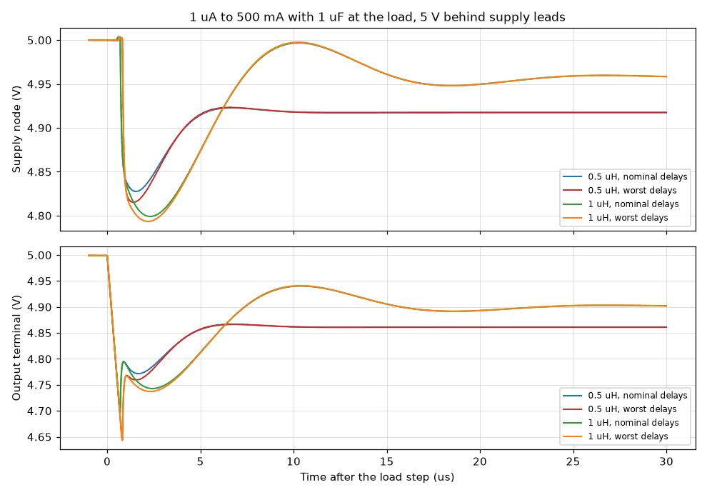

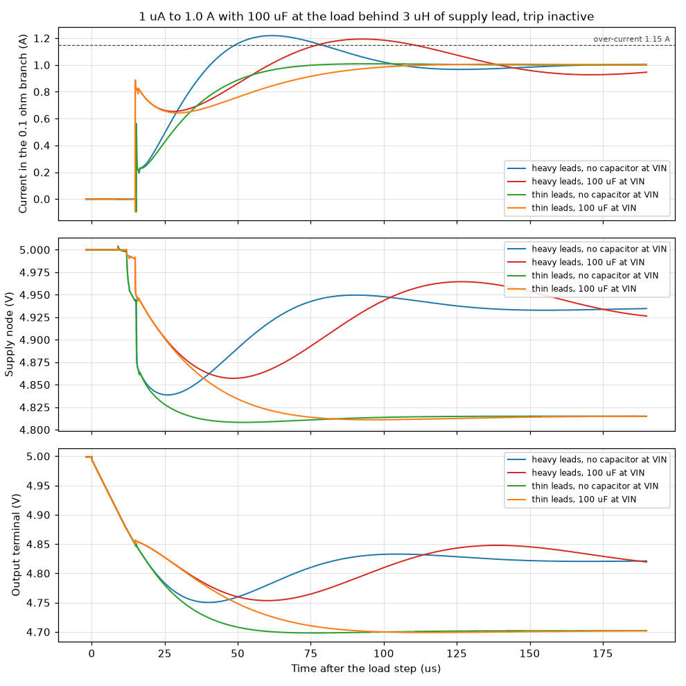

Notes:

- Ampere mode is not drawn into this circuit: the fuse, the closed ampere switch
  and the copper to the supply node are one resistance of 35 mohm, and the
  external supply holds 5 V behind its leads. The 1 uF and the damped 4.7 uF on
  the supply node are the parts of the schematic.
- Lead resistance for the sag: 0.13 ohm with 0.5 uH and 0.05 ohm with 1 uH, the
  pairs of the earlier simulations of the design. For the ringing two kinds of
  lead: thin, 50 mohm for every microhenry, and heavy, 10 mohm. The
  specification names inductances only; its 12 us to 29 us are found again with
  the heavy leads.
- The leads and the capacitors ring together, and the current that recharges the
  load capacitor passes the shunt. A capacitor at the VIN terminals takes a
  share of that current in proportion to its size against the load capacitor.
  With thin leads the ringing is damped and 100 uF at the terminals is enough;
  with heavy leads and 47 uF or more at the load it is not: the branch stays
  above the level for tens of microseconds and the trip acts.
- The time above 1.15 A is read with the qualification time of the trip set out
  of reach, so that the ringing can be seen whole; the trip count comes from the
  same runs with the 12 us of rule F-18.
- What happens to the supply node when the trip opens the output on a short
  circuit in ampere mode is not in this bench. The node is then bounded by the
  ampere switch acting as a source follower and by the suppressor of the VIN
  terminal, which are parts of the path switching sheet.
- Vendor tier: the range 3 switch and the two transistors of the output switch
  take the model of their manufacturer. The comparators keep the model written
  here, because the loop finds its operating point only with their hysteresis
  held, and the model of the manufacturer offers no node for that. The bench
  models/range-logic-mcp6561 puts the two comparator models side by side.

Models. written here: AD8421, BAV199, CSD17577Q3A, IRLML0030, IRLML0030_CLAMP,
MCP656X, MUX509, OPA197, OPA365, OUTPUT_PTVS15V, RL_MCP6562, TC4427CH.

Decks:
[supply-leads.heavy-3uh-100uf-terminal-free-1000ma.cir](supply-leads.heavy-3uh-100uf-terminal-free-1000ma.cir),
[supply-leads.sag-0u5-nominal.cir](supply-leads.sag-0u5-nominal.cir),
[supply-leads.sag-0u5-worst.cir](supply-leads.sag-0u5-worst.cir),
[supply-leads.sag-1u-nominal.cir](supply-leads.sag-1u-nominal.cir),
[supply-leads.sag-1u-worst.cir](supply-leads.sag-1u-worst.cir).

## `range_logic/thresholds`

**The three comparator thresholds, with tolerances, and their hysteresis.**

Range 3 is held and the load current is ramped from 0.8 A to 1.6 A and back. The
shunt voltage passes all three thresholds twice, slowly. For each comparator the
run reads the shunt voltage and the voltage at its own input at the instants its
output rises and falls: their middle is the threshold, their distance the
hysteresis. The same ramp tells at which shunt voltage the input of the
converter reaches full scale. The run is repeated with every part at the end of
its tolerance that moves one threshold furthest, first with what the
specification names (the six resistors of the string and the divider, the gain
resistor, 10 mV of comparator offset), then with what it does not name as well
(gain error and offsets of the amplifier, the pedestal, the reference), and with
120 boards drawn at random.

Answers: section 4.4 (table of the thresholds, over-current level), decisions
D-28 and D-74.

| Figure | Simulated | Vendor models | Specification | Limits | Verdict | Source |
| --- | --- | --- | --- | --- | --- | --- |
| Step up: threshold at the comparator input | 464.5 mV | 464.5 mV | 464 mV (+0.11 %) | 463.5 mV to 464.5 mV | pass | table of section 4.4, to its last digit |
| Step up: threshold at the shunt | 90.95 mV | 90.94 mV | 91 mV (-0.06 %) | 90.5 mV to 91.5 mV | pass | table of section 4.4, to its last digit |
| Step up: hysteresis at the comparator input | 2.124 mV | 2.108 mV | | 1 mV to 5 mV | pass | datasheet range of 1 mV to 5 mV (section 3); the model is set to 3 mV |
| Step up: hysteresis referred to the shunt | 430 µV | 426.8 µV | | | | |
| Over-current: threshold at the comparator input | 584.3 mV | 584.2 mV | 584 mV (+0.04 %) | 583.5 mV to 584.5 mV | pass | table of section 4.4, to its last digit |
| Over-current: threshold at the shunt | 115 mV | 115 mV | 115 mV (+0.04 %) | 114.5 mV to 115.5 mV | pass | table of section 4.4, to its last digit |
| Over-current: hysteresis at the comparator input | 2.062 mV | 2.043 mV | | 1 mV to 5 mV | pass | datasheet range of 1 mV to 5 mV (section 3); the model is set to 3 mV |
| Over-current: hysteresis referred to the shunt | 417.5 µV | 413.8 µV | | | | |
| Jump: threshold at the comparator input | 763.9 mV | 763.8 mV | 764 mV (-0.02 %) | 763.5 mV to 764.5 mV | pass | table of section 4.4, to its last digit |
| Jump: threshold at the shunt | 151.2 mV | 151.2 mV | 151 mV (+0.12 %) | 150.5 mV to 151.5 mV | pass | table of section 4.4, to its last digit |
| Jump: hysteresis at the comparator input | 2.067 mV | 2.047 mV | | 1 mV to 5 mV | pass | datasheet range of 1 mV to 5 mV (section 3); the model is set to 3 mV |
| Jump: hysteresis referred to the shunt | 418.5 µV | 414.6 µV | | | | |
| Load current at the over-current threshold in range 3 | 1.15 A | 1.15 A | 1.15 A (+0.04 %) | 1.114 A to 1.187 A | pass | section 4.4: 1.15 A, 1.114 A to 1.187 A with tolerances |
| Step up: lowest threshold at the shunt, tolerances the specification names | 88.57 mV | 88.57 mV | | 87.5 mV to 94.4 mV | pass | table of section 4.4, with tolerances |
| Step up: highest threshold at the shunt, tolerances the specification names | 93.35 mV | 93.35 mV | | 87.5 mV to 94.4 mV | pass | table of section 4.4, with tolerances |
| Over-current: lowest threshold at the shunt, tolerances the specification names | 112.6 mV | 112.6 mV | | 111.4 mV to 118.7 mV | pass | table of section 4.4, with tolerances |
| Over-current: highest threshold at the shunt, tolerances the specification names | 117.5 mV | 117.5 mV | | 111.4 mV to 118.7 mV | pass | table of section 4.4, with tolerances |
| Jump: lowest threshold at the shunt, tolerances the specification names | 148.6 mV | 148.6 mV | | 147.2 mV to 155.1 mV | pass | table of section 4.4, with tolerances |
| Jump: highest threshold at the shunt, tolerances the specification names | 153.8 mV | 153.8 mV | | 147.2 mV to 155.1 mV | pass | table of section 4.4, with tolerances |
| Step up: lowest threshold at the shunt, every tolerance | 88.12 mV | 88.12 mV | | 87.5 mV to 94.4 mV | pass | table of section 4.4, with tolerances |
| Step up: highest threshold at the shunt, every tolerance | 93.8 mV | 93.81 mV | | 87.5 mV to 94.4 mV | pass | table of section 4.4, with tolerances |
| Over-current: lowest threshold at the shunt, every tolerance | 112 mV | 112 mV | | 111.4 mV to 118.7 mV | pass | table of section 4.4, with tolerances |
| Over-current: highest threshold at the shunt, every tolerance | 118.1 mV | 118.1 mV | | 111.4 mV to 118.7 mV | pass | table of section 4.4, with tolerances |
| Jump: lowest threshold at the shunt, every tolerance | 147.9 mV | 147.9 mV | | 147.2 mV to 155.1 mV | pass | table of section 4.4, with tolerances |
| Jump: highest threshold at the shunt, every tolerance | 154.5 mV | 154.5 mV | | 147.2 mV to 155.1 mV | pass | table of section 4.4, with tolerances |
| Step up: lowest of 120 random boards | 88.92 mV | 88.92 mV | | 87.5 mV to 94.4 mV | pass | table of section 4.4, with tolerances |
| Step up: highest of 120 random boards | 93.07 mV | 93.06 mV | | 87.5 mV to 94.4 mV | pass | table of section 4.4, with tolerances |
| Over-current: lowest of 120 random boards | 113 mV | 113 mV | | 111.4 mV to 118.7 mV | pass | table of section 4.4, with tolerances |
| Over-current: highest of 120 random boards | 117.1 mV | 117.1 mV | | 111.4 mV to 118.7 mV | pass | table of section 4.4, with tolerances |
| Jump: lowest of 120 random boards | 149.2 mV | 149.2 mV | | 147.2 mV to 155.1 mV | pass | table of section 4.4, with tolerances |
| Jump: highest of 120 random boards | 153.3 mV | 153.3 mV | | 147.2 mV to 155.1 mV | pass | table of section 4.4, with tolerances |
| Shunt voltage at which the converter input is at full scale | 122.9 mV | 122.9 mV | 122.9 mV (+0.03 %) | 122.3 mV to 123.5 mV | pass | section 4.3: 122.9 mV, calculated |
| Full scale of the converter above the over-current threshold, nominal | 7.884 mV | 7.892 mV | | | | |
| The same, least of 120 random boards | 5.761 mV | 5.761 mV | | at least 0 V | pass | section 4.4: the level lies below the full scale on every board |
| The same with the over-current threshold at its highest, every tolerance | 5.421 mV | 5.424 mV | 3.6 mV (+50.58 %) | at least 0 V | pass | section 4.4: 3.6 mV to spare in the worst case, calculated |

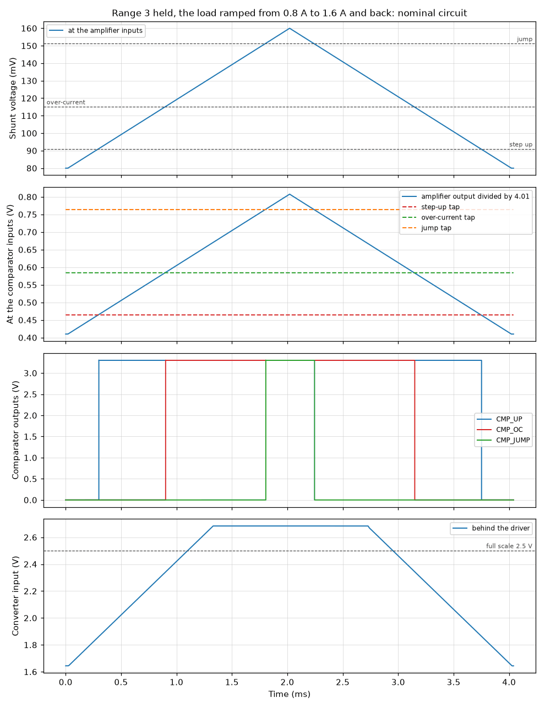

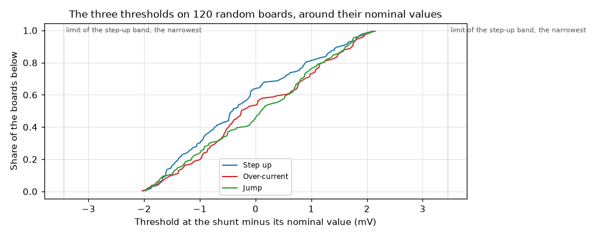

Notes:

- A threshold is the middle of the two shunt voltages at which the comparator
  output rises and falls on a slow ramp; the delay of the chain shifts both by
  the same amount in opposite directions and drops out.
- The hysteresis of 3 mV is a parameter of the comparator model, inside the 1 mV
  to 5 mV of the datasheet: the figure shows that the circuit passes it on
  unchanged, not what a part has. It moves the threshold for a rising voltage by
  half of it, 0.3 mV at the shunt, 0.5 mV for a part at 5 mV.
- Tolerances the specification names: the 0.1 % of R132 to R137 and of the gain
  resistor R123, and 10 mV of comparator offset. Every tolerance adds 0.3 % of
  gain error and 60 uV and 350 uV of offset of the amplifier (datasheet limits
  of the A grade), 0.1 % on the two pedestal resistors, 100 uV of the pedestal
  buffer and 0.1 % of the reference. The 0.1 % of the reference is an
  assumption.
- Random boards: the seven resistors uniform inside 0.1 % and the three offsets
  uniform inside 10 mV, each comparator with its own. Uniform is the cautious
  reading of an offset limit; real parts cluster near the typical 3 mV.
- The drift with temperature is not in these runs: 25 ppm/K on the resistors
  moves a threshold by less than 0.01 mV over 20 K.
- The margin to full scale is taken at the input of the converter in the same
  run; the converter itself is not in the circuit.

Models. written here: AD8421, BAV199, CSD17577Q3A, IRLML0030, IRLML0030_CLAMP,
MCP656X, MUX509, OPA197, OPA365, OUTPUT_PTVS15V, RL_MCP6562, TC4427CH.

Decks: [thresholds.nominal.cir](thresholds.nominal.cir).

## `range_logic/trip`

**The over-current trip after 12 us, and the recharge of a load capacitor.**

Three questions about the over-current comparator are answered. Does the trip
act: range 3 carries 0.8 A, the load steps to 1.3 A and stays, and the output
switch has to open 12 us after the comparator rose. Does a shorter excess pass:
two pulses of 1.3 A, 8 us each and 2 us apart, must leave the output on. Does
the recharge of a load capacitor pass: the load steps from 1 uA in range 0 to
1.0 A beside 47 uF to 100 uF, the sequencer climbs to range 3 while the
capacitor sags, and in range 3 the shunt carries the load and the current that
brings the capacitor back. The run reads how long the comparator stays high, in
any range and in range 3 alone, with nominal parts, with the over-current
threshold at its lowest and the worst delays, and with the three thresholds at
opposite ends of their bands.

Answers: section 4.4 (over-current, qualification), rules F-18 and F-19, section
11 (step to 1.0 A).

| Figure | Simulated | Vendor models | Specification | Limits | Verdict | Source |
| --- | --- | --- | --- | --- | --- | --- |
| Over-current comparator high to the line of the output switch low | 12 µs | 12 µs | 12 µs (+0.03 %) | 10 µs to 20 µs | pass | rule F-18: 12 us, never below 10 us or above 20 us; a parameter of the model |
| Line low to the gate of the output switch below 2 V | 6.396 µs | 6.216 µs | 7 µs (-8.62 %) | | | rule F-8: below 2 V within 7 us, simulated |
| Line low to the current in the shunt below a tenth | 6.107 µs | 5.662 µs | | | | |
| Load step above the level to the current below a tenth | 18.36 µs | 17.91 µs | | at most 30 µs | pass | limit of this bench: the longest time of rule F-18 and 10 us to open |
| Line of the output switch at the end of the run | 16.36 nV | 16.36 nV | | at most 100 mV | pass | rule F-19: low until the fault is cleared |
| Range selected after the trip | 3 | 3 | 3 (+0.00 %) | 3 to 3 | pass | rule F-19: after a trip range 3 stays selected |
| Two pulses of 8 us, 2 us apart: lowest level of the output line | 3.195 V | 3.195 V | | at least 3 V | pass | rule F-18: high without interruption for 12 us |
| CMP_OC high, longest over 47 uF to 100 uF, nominal | 5.086 µs | 4.544 µs | | | | |
| Load capacitor of that run | 56 µF | 82 µF | | | | |
| CMP_OC high in range 3, longest over 47 uF to 100 uF, nominal | 2.359 µs | 1.439 µs | | at most 10 µs | pass | rule F-18: the trip acts in range 3 only; shortest time 10 us |
| CMP_OC high, longest over 47 uF to 100 uF, over-current threshold lowest, worst delays | 9.923 µs | 8.315 µs | 8.6 µs (+15.39 %) | at most 10 µs | pass | section 4.4: up to 8.6 us; section 11: high for less than 10 us |
| Load capacitor of that run | 82 µF | 75 µF | 56 µF (+46.43 %) | | | |
| CMP_OC high in range 3, longest over 47 uF to 100 uF, over-current threshold lowest, worst delays | 5.552 µs | 4.255 µs | | at most 10 µs | pass | rule F-18: the trip acts in range 3 only; shortest time 10 us |
| CMP_OC high, longest over 47 uF to 100 uF, thresholds at opposite ends, worst delays | 11.62 µs | 10.36 µs | | at most 10 µs | **FAIL** | section 4.4: up to 8.6 us; section 11: high for less than 10 us |
| Load capacitor of that run | 82 µF | 75 µF | | | | |
| CMP_OC high in range 3, longest over 47 uF to 100 uF, thresholds at opposite ends, worst delays | 7.074 µs | 5.964 µs | | at most 10 µs | pass | rule F-18: the trip acts in range 3 only; shortest time 10 us |
| CMP_OC high, longest over 47 uF to 100 uF, the same with 2 mohm in the capacitor | 12.83 µs | 11.55 µs | | at most 10 µs | **FAIL** | section 4.4: up to 8.6 us; section 11: high for less than 10 us |
| Load capacitor of that run | 82 µF | 82 µF | | | | |
| CMP_OC high in range 3, longest over 47 uF to 100 uF, the same with 2 mohm in the capacitor | 8.174 µs | 6.974 µs | | at most 10 µs | pass | rule F-18: the trip acts in range 3 only; shortest time 10 us |
| CMP_OC high, longest over 47 uF to 100 uF, the same with 30 mohm in the capacitor | 5.278 µs | 5.266 µs | | | | |
| Load capacitor of that run | 75 µF | 75 µF | | | | |
| CMP_OC high in range 3, longest over 47 uF to 100 uF, the same with 30 mohm in the capacitor | 686.7 ns | 609.7 ns | | at most 10 µs | pass | rule F-18: the trip acts in range 3 only; shortest time 10 us |
| CMP_OC high with 56 uF, over-current threshold lowest, worst delays | 7.96 µs | 7.137 µs | 8.6 µs (-7.44 %) | | | section 4.4: 8.6 us with 56 uF at the lowest threshold, simulated |
| Recharge runs in which the trip acted, of 40 | 0 | 0 | | at most 0 | pass | section 4.4: the qualification lets the recharge pass |

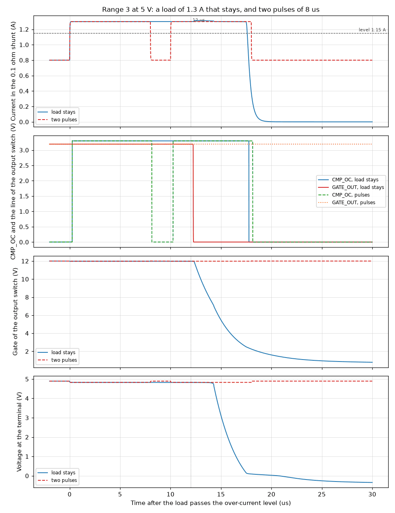

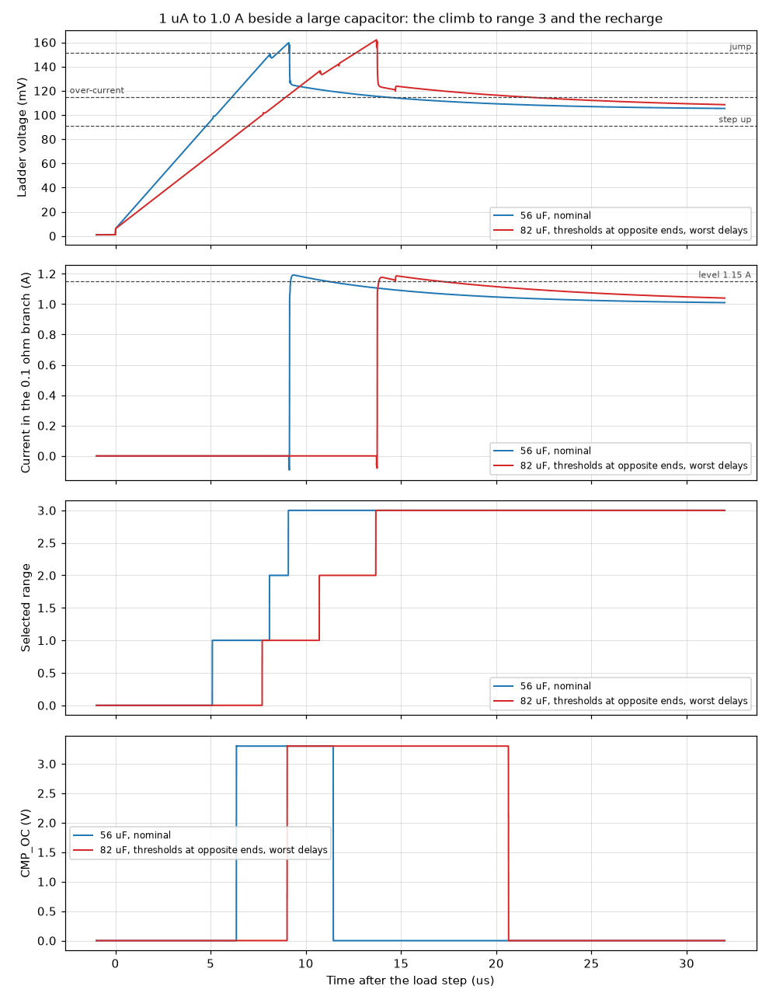

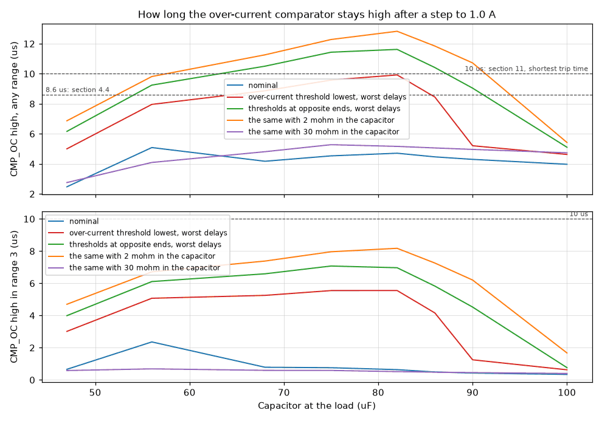

Notes:

- The trip is the model of rule F-18: a timer that runs while CMP_OC is high and
  range 3 is selected. Its 12 us are a parameter, so the first figure shows that
  the bench is wired right, not that a program keeps the time.
- With a large capacitor the load voltage sags slowly, the sequencer steps to
  range 1 at 91 mV, waits out the blanking, steps to range 2, waits again, and
  reaches range 3 with 145 mV to 160 mV across the ladder. The over-current
  comparator is high from 115 mV on, that is for microseconds before range 3 is
  selected, and then until the capacitor is recharged.
- The blanking here is that of rule F-17 as written: 3 us from the first change
  of a line to the next step. The 8.6 us of the specification came from runs
  with 2 us between steps; with 3 us the longest time is found at a larger
  capacitor and is longer.
- The figures that fail are the time the comparator output is high in any range,
  which is what a probe at TP46 shows and what the test of section 11 limits to
  10 us. The time in range 3, the only one the trip of rule F-18 counts in this
  model, stays below 10 us in every run, and no run trips. A program that
  started its count at the comparator edge and not at the entry into range 3
  would have no margin at 12 us in the worst run and would trip at the 10 us
  that the rule allows.
- The capacitor has 5 mohm in series unless said otherwise and 1 mohm of lead;
  the recharge current, and with it these times, falls quickly with more series
  resistance, as the runs with 30 mohm show.
- The source holds 5 V behind 20 mohm. The amplifier model recovers from
  overload at its slew rate; these runs do not overload it.
- Vendor tier: the range 3 switch and the two transistors of the output switch
  take the model of their manufacturer. The comparators keep the model written
  here, because the loop finds its operating point only with their hysteresis
  held, and the model of the manufacturer offers no node for that. The bench
  models/range-logic-mcp6561 puts the two comparator models side by side.

Models. written here: AD8421, BAV199, CSD17577Q3A, IRLML0030, IRLML0030_CLAMP,
MCP656X, MUX509, OPA197, OPA365, OUTPUT_PTVS15V, RL_MCP6562, TC4427CH.

Decks: [trip.nominal-56u.cir](trip.nominal-56u.cir),
[trip.pulses.cir](trip.pulses.cir), [trip.spread-82u.cir](trip.spread-82u.cir),
[trip.trip.cir](trip.trip.cir).
