# Simulation Results: Signal Chain

Everything on this page is a simulation result. Nothing here is measured on
hardware. The page is written by `circuit-sim report` from the result files
beside it; do not edit it by hand.

## `signal_chain/common-mode`

**Offset and gain of the chain against the output voltage.**

The node after the shunts is swept from 0 V to 5.5 V with the shunt voltage
held. That node is the output voltage of the instrument and the common mode of
the amplifier. With 0 V across the shunt the converter input shows how the zero
moves with the output voltage; with 100 mV it shows the gain. The run is made
with the typical amplifier model, which has no common-mode error, and with the
rejection of the amplifier at the limit of its datasheet (86 dB at a gain of 1,
which is 112 dB at this gain), once with each sign. The shift from 0 V is what a
zero taken with the ladder at 0 V does not remove; a zero taken with the ladder
at its working voltage (section 4.2, D-29) leaves the slope times the change of
the output voltage since that zero. A small-signal run gives the same rejection
over frequency.

Answers: section 4.5 (supplies and common mode of U27), section 8 (zero
calibration), section 4.10 (zero of R0), requirement R-05.

| Figure | Simulated | Specification | Limits | Verdict | Source |
| --- | --- | --- | --- | --- | --- |
| Typical model: the zero at 5 V against the zero at 0 V, at the shunt | 965.6 pV | | | | |
| Rejection at its limit: the zero at 0.8 V against the zero at 0 V | 1.051 codes | | at most 65.54 codes | pass | requirement R-05: 0.1 % of range, 65.5 codes |
| The same as a current in range 0, at 0.8 V | 2.012 nA | | | | |
| Rejection at its limit: the zero at 3.3 V against the zero at 0 V | 4.336 codes | | at most 65.54 codes | pass | requirement R-05: 0.1 % of range, 65.5 codes |
| The same as a current in range 0, at 3.3 V | 8.3 nA | | | | |
| Rejection at its limit: the zero at 5 V against the zero at 0 V | 6.57 codes | | at most 65.54 codes | pass | requirement R-05: 0.1 % of range, 65.5 codes |
| The same as a current in range 0, at 5 V | 12.58 nA | | | | |
| Rejection at its limit: the zero moves with the output voltage by, at the shunt | 2.515 µV | 2.5 µV (+0.60 %) | | | AD8421 datasheet, page 3: 86 dB at G = 1, divided by the gain, per volt |
| The same as a current in range 0, for each volt of output voltage | 2.515 nA | | | | |
| The other sign gives the opposite shift at 5 V: sum of the two | 0.0009827 codes | | -0.5 codes to 0.5 codes | pass | check of this bench |
| The shift at 5 V as a current in range 1 | 393.6 nA | | | | |
| The shift at 5 V as a current in range 2 | 12.59 µA | | | | |
| The shift at 5 V as a current in range 3 | 125.8 µA | | | | |
| Gain at 0.8 V of output voltage | 19.93 | 19.93 (+0.00 %) | 19.93 to 19.93 | pass | section 4.5: the common mode of 0.8 V to 5 V stays inside the input range |
| Gain at 5 V of output voltage | 19.93 | 19.93 (+0.00 %) | 19.93 to 19.93 | pass | section 4.5: the common mode of 0.8 V to 5 V stays inside the input range |
| Change of the gain from 0.8 V to 5 V of output voltage | 3.416e-05 ppm | | | | |
| Rejection at its limit: common-mode rejection of the chain at 50 Hz | 112 dB | | | | |
| Rejection at its limit: common-mode rejection of the chain at 1 kHz | 111.9 dB | | | | |
| Rejection at its limit: common-mode rejection of the chain at 20 kHz | 103.7 dB | | | | |
| Typical model with nominal parts: what reaches the converter at 1 kHz, of 1 V | 1.704 µV | | | | |

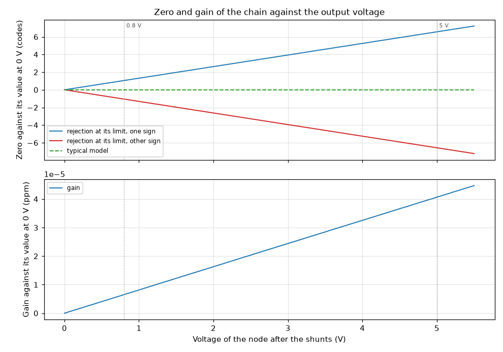

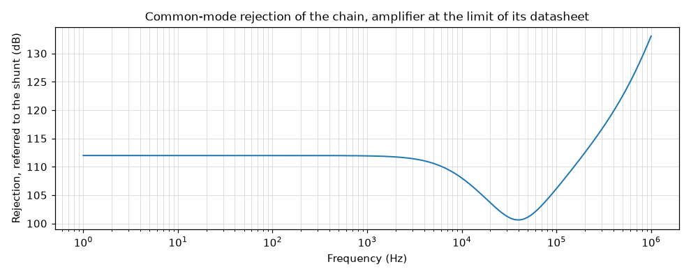

Notes:

- The datasheet of the amplifier states the rejection as a least value and gives
  no typical one; the limit of the A grade is used with either sign. A part can
  sit anywhere between the two lines of the graph.
- The model makes the error in the output stage of the amplifier, as a straight
  line over the common mode. A real part can bend; the figures say how large the
  term is, not its shape.
- The amplifier model has no term that changes its gain with the common mode,
  and its datasheet states none. The gain figures show that the chain stays
  inside its linear range from 0.8 V to 5 V, nothing more.
- The ladder is not in this circuit, so the bias current of the amplifier inputs
  flows in ideal sources. On the board the current of the inverting input flows
  through the shunt in use: 2 nA at the most in every range, which the zero
  calibration removes, and its change with the common mode (30 Gohm) is 0.14 nA
  from 0.8 V to 5 V.
- Leakage of the multiplexer against the common mode adds to this on the board;
  no model here gives a believable figure for it.
- The closed-switch zero of section 8 is taken at 5.0 V and at the working
  voltage and so contains this term at those voltages. For the open-switch zero
  section 8 does not say where the ladder stands. Section 4.2 (D-29) lets it run
  with the mode pair closed, the ladder at its working voltage: the term is then
  in the zero for that voltage, and a later change of the set-point or of the
  supply of the user brings it back with the slope above. A zero taken in the
  reset state, or after the output was switched off (the ladder rests at 0 V and
  falls there with 0.57 s), does not contain it.

Models. written here: AD8421, BAV199, MUX509, OPA197, OPA365.

Decks: [common-mode.zero-plus.cir](common-mode.zero-plus.cir).

## `signal_chain/driver-rail`

**The driver rail: output of the buffer U28, the rail, and the stability of its
loop.**

The buffer U28 with its network supplies the converter driver U29. The circuit
holds the buffer, its gain resistors, the 10 ohm of R129, the 100 nF of C88 and
the driver with its filter; the amplifier output is a source at 1 V. An
operating point gives the voltages and the supply current. The loop gain of the
buffer is taken by double injection at its output, with the feedback closed: as
drawn, with C88 at 60 nF and at 110 nF (its value under bias and at its
tolerance), with R126 at 100 ohm, which holds the non-inverting input, and with
R129 reduced to 1 mohm, which stands for the buffer without it. A load step of 3
mA on the rail is then run with and without R129. Two more runs take the
amplifier model alone and read its input capacitances and its open-loop output
impedance against the datasheet: these three figures decide the loop, and the
two tiers differ in them.

Answers: section 4.5 (driver rail D-73), section 16 (driver rail and its step
response).

| Figure | Simulated | Vendor models | Specification | Limits | Verdict | Source |
| --- | --- | --- | --- | --- | --- | --- |
| Output of the buffer U28 | 2.727 V | 2.727 V | 2.727 V (+0.01 %) | 2.719 V to 2.735 V | pass | section 4.5: 1.091 x VREF, 2.73 V |
| Driver rail at the test point TP42 | 2.686 V | 2.685 V | 2.68 V (+0.21 %) | 2.67 V to 2.69 V | pass | section 4.5: about 2.68 V after the drop in the 10 ohm |
| Current through R129, the supply current of the driver | 4.16 mA | 4.183 mA | | | | |
| Current that buffer and driver take from 3V3_A together | 8.664 mA | 8.696 mA | | | | |
| Of which the buffer adds (its own supply current and its gain resistors) | 4.504 mA | 4.513 mA | 4.8 mA (-6.16 %) | at most 5.3 mA | pass | section 4.5: 4.8 mA, 5.3 mA at the most |
| Phase margin of the loop, as drawn, 10 ohm and 100 nF | 41.92 ° | 68.99 ° | 54 ° (-22.36 %) | at least 45 ° | **FAIL** | section 4.5: 54 degrees with the 10 ohm; 45 degrees is the least this bench accepts |
| Crossover of the loop, as drawn, 10 ohm and 100 nF | 4.84 MHz | 8.814 MHz | | | | |
| Phase margin of the loop, C88 at 60 nF | 40.99 ° | 68.44 ° | | at least 45 ° | **FAIL** | section 4.5: 54 degrees with the 10 ohm; 45 degrees is the least this bench accepts |
| Crossover of the loop, C88 at 60 nF | 4.842 MHz | 8.816 MHz | | | | |
| Phase margin of the loop, C88 at 110 nF | 42.05 ° | 69.07 ° | | at least 45 ° | **FAIL** | section 4.5: 54 degrees with the 10 ohm; 45 degrees is the least this bench accepts |
| Crossover of the loop, C88 at 110 nF | 4.84 MHz | 8.813 MHz | | | | |
| Phase margin of the loop, R126 at 100 ohm in place of 10 kohm | 54.04 ° | 68.84 ° | | at least 45 ° | pass | section 4.5: 54 degrees with the 10 ohm; 45 degrees is the least this bench accepts |
| Crossover of the loop, R126 at 100 ohm in place of 10 kohm | 10.14 MHz | 9.232 MHz | | | | |
| Phase margin of the loop without R129 | -27.12 ° | -2.65 ° | | at most 0 ° | pass | section 4.5: without the 10 ohm the loop is unstable |
| Crossover of the loop without R129 | 1.406 MHz | 1.388 MHz | | | | |
| Load step of 3 mA: the rail falls by | 29.94 mV | 29.94 mV | 30 mV (-0.19 %) | | | 3 mA in the 10 ohm of R129, calculated here |
| Load step of 3 mA: the rail dips below its new level by | 151.9 nV | 52.3 nV | | | | |
| Load step of 3 mA: the rail is within 1 mV of its new level after | 3.369 µs | 3.364 µs | | | | |
| Without R129: swing of the rail in the last 10 us of the run | 96.45 mV | 84.4 mV | | | | |
| Amplifier model of this run: capacitance between its inputs | 6 pF | 350 fF | 6 pF (+0.00 %) | 4.5 pF to 7.5 pF | pass | OPA365 datasheet, page 6; 25 % is the fit this bench asks of a model |
| Amplifier model of this run: capacitance from each input | 2 pF | 6.001 pF | 2 pF (+0.00 %) | 1.5 pF to 2.5 pF | pass | OPA365 datasheet, page 6; 25 % is the fit this bench asks of a model |
| Amplifier model of this run: open-loop output impedance at 1 MHz | 30 Ω | 55.88 Ω | 30 Ω (+0.00 %) | 22.5 Ω to 37.5 Ω | pass | OPA365 datasheet, page 7; 25 % is the fit this bench asks of a model |

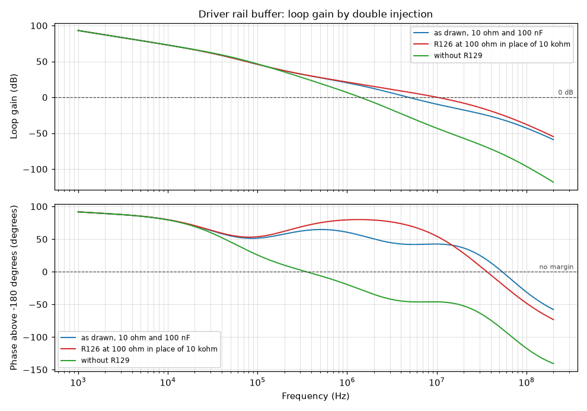

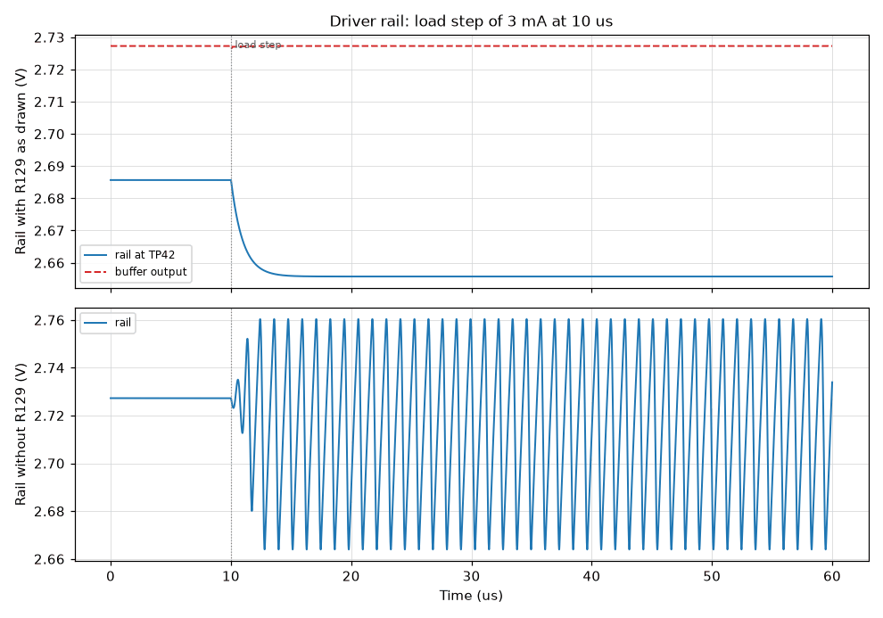

Notes:

- The amplifier model has the gain-bandwidth product, the open-loop output
  impedance at 1 MHz (30 ohm) and the input capacitances of its datasheet, 6 pF
  between the inputs and 2 pF from each input; its second pole is fitted to the
  phase curve of the datasheet.
- The margin as drawn is lower than the 54 degrees of the specification because
  of R126: with 10 kohm at the non-inverting input and no capacitor there, the 6
  pF between the inputs let that input follow the inverting one, which lowers
  the crossover and costs about 36 degrees there. With R126 at 100 ohm the same
  model has the margin of the row above.
- The model of the manufacturer, run in the vendor tier, shows no such effect
  and gives 69 degrees as drawn. The last three figures say why: that model has
  about 6 pF from each input and less than 1 pF between the inputs, the two
  values of the datasheet the other way round, and 56 ohm of output impedance
  where the datasheet states 30 ohm. In the figures that decide this loop it is
  not the part of the datasheet, so its margin does not speak against the lower
  one. A capacitor from the non-inverting input to ground would make the loop
  independent of the question.
- C88 and the other capacitors are ideal: no series resistance, no inductance.
  The reference and 3V3_A are ideal sources.
- The supply current of the two amplifiers follows the typical curve of the
  datasheet (4.3 mA at 3.3 V, 4.2 mA at 2.7 V), not the 4.6 mA of its table,
  which holds at 5 V. The figure that the buffer adds is therefore below the 4.8
  mA of the specification.
- The amplifier U27, its pedestal buffer and the multiplexer are not in this
  circuit: the amplifier output is an ideal source.

Models. written here: BAV199, OPA365, SIGNAL_CHAIN_OPA365_PROBE.

Decks: [driver-rail.loop-series.cir](driver-rail.loop-series.cir),
[driver-rail.rest.cir](driver-rail.rest.cir),
[driver-rail.step-without.cir](driver-rail.step-without.cir),
[driver-rail.step.cir](driver-rail.step.cir).

## `signal_chain/frequency`

**Frequency response: input filter and anti-alias filter.**

Small-signal runs around a shunt voltage of 50 mV in range 0. A source across
the shunt gives the response to the signal: from the shunt to the amplifier
inputs (the input filter, with 125 ohm, 250 ohm and 430 ohm in a multiplexer
channel), from the amplifier output to the driver output (the anti-alias filter)
and from the shunt to the converter input. A source on the node after the shunts
moves both sense taps together and gives the response of the input filter to the
common mode. The parts of the anti-alias filter are then drawn 60 times inside
their tolerances.

Answers: section 4.5 (input filter D-65, anti-alias filter), section 4.3
(multiplexer resistance).

| Figure | Simulated | Specification | Limits | Verdict | Source |
| --- | --- | --- | --- | --- | --- |
| Input filter, signal: time constant with 125 ohm per channel | 59.87 ns | 60 ns (-0.22 %) | 54 ns to 66 ns | pass | section 4.5: 0.06 us to 0.20 us over 125 ohm to 430 ohm |
| Input filter, signal: corner with 250 ohm per channel | 1.329 MHz | 1.35 MHz (-1.53 %) | 1.282 MHz to 1.417 MHz | pass | section 4.5, D-65: 1.35 MHz |
| Input filter, signal: time constant with 250 ohm per channel | 119.7 ns | 120 ns (-0.23 %) | 108 ns to 132 ns | pass | section 4.5: 0.06 us to 0.20 us over 125 ohm to 430 ohm |
| Input filter, signal: time constant with 430 ohm per channel | 205.9 ns | 200 ns (+2.96 %) | 180 ns to 220 ns | pass | section 4.5: 0.06 us to 0.20 us over 125 ohm to 430 ohm |
| Input filter, common mode: corner with 250 ohm per channel | 20.03 MHz | 20 MHz (+0.17 %) | 18 MHz to 22 MHz | pass | section 4.5, D-65: 20 MHz |
| Anti-alias filter: natural frequency | 40.26 kHz | 40 kHz (+0.66 %) | 38.8 kHz to 41.2 kHz | pass | section 4.5: two poles at 40 kHz |
| Anti-alias filter: Q | 0.7415 | 0.74 (+0.21 %) | 0.7178 to 0.7622 | pass | section 4.5: Q = 0.74 |
| Anti-alias filter: rise above its level at low frequency | 0.03522 dB | | | | |
| Whole chain: gain at 10 Hz | 19.93 | 19.93 (+0.00 %) | 19.91 to 19.95 | pass | section 4.5: 19.93 |
| Whole chain: frequency at which the response is 3 dB down | 41.99 kHz | | | | |
| Whole chain: response at half the sample rate, below its level at 10 Hz | 4.935 dB | | | | |
| Whole chain: response at the sample rate, below its level at 10 Hz | 15.89 dB | | | | |
| Whole chain: response at 1 MHz, below its level at 10 Hz | 62.35 dB | | | | |
| Anti-alias filter: lowest natural frequency of 60 boards | 38.94 kHz | | | | |
| Anti-alias filter: highest natural frequency of 60 boards | 42.3 kHz | | | | |
| Anti-alias filter: lowest Q of 60 boards | 0.7111 | | | | |
| Anti-alias filter: highest Q of 60 boards | 0.773 | | | | |

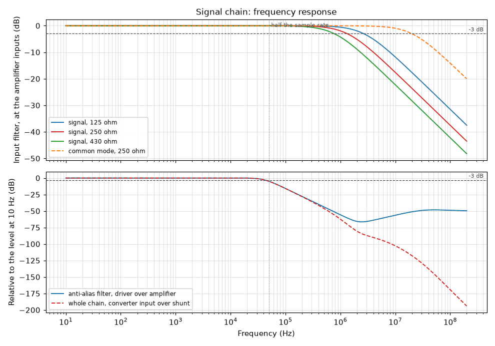

Notes:

- The ladder is not in this circuit: ideal sources stand on the inputs of the
  multiplexer, so the source of the input filter is the channel resistance
  alone.
- The multiplexer model has a fixed resistance per channel and 6.7 pF at each
  output; the amplifier model has 3 pF between its inputs and 3 pF from each
  input. The capacitance of the tracks is not in the circuit; with 22 pF from
  each input to ground it moves the common-mode corner.
- The tolerance of the two filter capacitors is taken as 5 %, the tolerance of
  their part numbers; the netlist value does not state it. The limits of the
  natural frequency and of Q are the fit that this bench asks of the nominal
  circuit, 3 %.
- The amplifier model has two poles and gives 6.4 MHz at this gain; it does not
  have the peaking near 8 MHz that the datasheet shows at low gain.

Models. written here: AD8421, BAV199, MUX509, OPA197, OPA365.

Decks: [frequency.common-mode.cir](frequency.common-mode.cir),
[frequency.signal-250r.cir](frequency.signal-250r.cir).

## `signal_chain/head-room`

**Head room of the amplifier near full scale with the output voltage near 0 V.**

The shunt voltage is swept with the node after the shunts at 0 V to 0.8 V. Range
3 is held. With the output voltage near 0 V the inputs of the amplifier sit near
ground, and its first stage needs room below them that grows with the signal:
one of its two outputs moves down by half the amplified signal. The model takes
that room as a parameter. It is run with the two readings that the specification
names: the one of the range tool of the manufacturer, which figure 13 of the
datasheet supports, and the one of figure 14. For each the sweep gives where the
amplifier leaves its straight line, and at which shunt voltage its output
reaches the over-current level and the jump level of the comparators. One more
sweep takes the reading of figure 14 with 0.2 V less room, a case of this bench:
it shows where the over-current level is reached once the linear range ends
below it, which section 4.10 estimates as 1.26 A.

Answers: section 4.5 (head room to the -4 V rail), section 4.10 (limits of the
budget), section 4.4 (trip and jump level), section 16.

| Figure | Simulated | Specification | Limits | Verdict | Source |
| --- | --- | --- | --- | --- | --- |
| Output voltage 0 V, range tool of the manufacturer and figure 13: the amplifier is linear up to | 214 mV | 210 mV (+1.90 %) | | | section 4.10: the two readings end at 130 mV and at 210 mV |
| Output voltage 0 V, range tool of the manufacturer and figure 13: over-current level reached at | 115 mV | 115 mV (+0.00 %) | | | section 4.4: 115 mV, 111.4 mV to 118.7 mV |
| Output voltage 0 V, range tool of the manufacturer and figure 13: jump level reached at | 151.2 mV | 151 mV (+0.14 %) | | | section 4.4: 151 mV, 147.2 mV to 155.1 mV |
| Output voltage 0.05 V, range tool of the manufacturer and figure 13: the amplifier is linear up to | 219 mV | | | | section 4.10: the two readings end at 130 mV and at 210 mV |
| Output voltage 0.05 V, range tool of the manufacturer and figure 13: over-current level reached at | 115 mV | 115 mV (+0.00 %) | | | section 4.4: 115 mV, 111.4 mV to 118.7 mV |
| Output voltage 0.05 V, range tool of the manufacturer and figure 13: jump level reached at | 151.2 mV | 151 mV (+0.14 %) | | | section 4.4: 151 mV, 147.2 mV to 155.1 mV |
| Output voltage 0.2 V, range tool of the manufacturer and figure 13: the amplifier is linear up to | 235 mV | | at least 155.1 mV | pass | section 4.5: trip and jump level are specified from 0.2 V on |
| Output voltage 0.2 V, range tool of the manufacturer and figure 13: over-current level reached at | 115 mV | 115 mV (+0.00 %) | 111.4 mV to 118.7 mV | pass | section 4.4: 115 mV, 111.4 mV to 118.7 mV |
| Output voltage 0.2 V, range tool of the manufacturer and figure 13: jump level reached at | 151.2 mV | 151 mV (+0.14 %) | 147.2 mV to 155.1 mV | pass | section 4.4: 151 mV, 147.2 mV to 155.1 mV |
| Output voltage 0.8 V, range tool of the manufacturer and figure 13: the amplifier is linear up to | 299 mV | | at least 155.1 mV | pass | section 4.5: trip and jump level are specified from 0.2 V on |
| Output voltage 0.8 V, range tool of the manufacturer and figure 13: over-current level reached at | 115 mV | 115 mV (+0.00 %) | 111.4 mV to 118.7 mV | pass | section 4.4: 115 mV, 111.4 mV to 118.7 mV |
| Output voltage 0.8 V, range tool of the manufacturer and figure 13: jump level reached at | 151.2 mV | 151 mV (+0.14 %) | 147.2 mV to 155.1 mV | pass | section 4.4: 151 mV, 147.2 mV to 155.1 mV |
| Output voltage 0 V, figure 14 of the datasheet: the amplifier is linear up to | 130 mV | 130 mV (+0.00 %) | | | section 4.10: the two readings end at 130 mV and at 210 mV |
| Output voltage 0 V, figure 14 of the datasheet: over-current level reached at | 115 mV | 115 mV (+0.00 %) | | | section 4.4: 115 mV, 111.4 mV to 118.7 mV |
| Output voltage 0 V, figure 14 of the datasheet: jump level reached at | 362.4 mV | 151 mV (+139.99 %) | | | section 4.4: 151 mV, 147.2 mV to 155.1 mV |
| Output voltage 0.05 V, figure 14 of the datasheet: the amplifier is linear up to | 135 mV | | | | section 4.10: the two readings end at 130 mV and at 210 mV |
| Output voltage 0.05 V, figure 14 of the datasheet: over-current level reached at | 115 mV | 115 mV (+0.00 %) | | | section 4.4: 115 mV, 111.4 mV to 118.7 mV |
| Output voltage 0.05 V, figure 14 of the datasheet: jump level reached at | 312.4 mV | 151 mV (+106.88 %) | | | section 4.4: 151 mV, 147.2 mV to 155.1 mV |
| Output voltage 0.2 V, figure 14 of the datasheet: the amplifier is linear up to | 151 mV | | at least 155.1 mV | **FAIL** | section 4.5: trip and jump level are specified from 0.2 V on |
| Output voltage 0.2 V, figure 14 of the datasheet: over-current level reached at | 115 mV | 115 mV (+0.00 %) | 111.4 mV to 118.7 mV | pass | section 4.4: 115 mV, 111.4 mV to 118.7 mV |
| Output voltage 0.2 V, figure 14 of the datasheet: jump level reached at | 162.4 mV | 151 mV (+7.54 %) | 147.2 mV to 155.1 mV | **FAIL** | section 4.4: 151 mV, 147.2 mV to 155.1 mV |
| Output voltage 0.8 V, figure 14 of the datasheet: the amplifier is linear up to | 214 mV | | at least 155.1 mV | pass | section 4.5: trip and jump level are specified from 0.2 V on |
| Output voltage 0.8 V, figure 14 of the datasheet: over-current level reached at | 115 mV | 115 mV (+0.00 %) | 111.4 mV to 118.7 mV | pass | section 4.4: 115 mV, 111.4 mV to 118.7 mV |
| Output voltage 0.8 V, figure 14 of the datasheet: jump level reached at | 151.2 mV | 151 mV (+0.14 %) | 147.2 mV to 155.1 mV | pass | section 4.4: 151 mV, 147.2 mV to 155.1 mV |
| Gain of the amplifier beyond the limit (output voltage 0 V, figure 14) | 1.904 | | | | |
| Output voltage 0 V, figure 14 with 0.2 V less room: the amplifier is linear up to | 108 mV | | | | |
| Output voltage 0 V, figure 14 with 0.2 V less room: over-current level reached at | 183.4 mV | 126 mV (+45.54 %) | | | section 4.10: the trip could then act at up to about 1.26 A (estimate) |

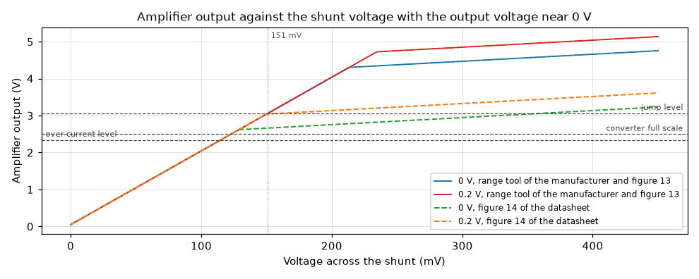

Notes:

- The limit is a parameter of the amplifier model, not a result: the simulation
  shows what each reading of the datasheet does to the chain, and cannot say
  which reading is right. That stays a measurement on the first board (section
  16).
- Beyond the limit the model stops one half of its first stage. The gain then
  falls to about 2, not to half: the level of a comparator is reached only far
  above its shunt voltage, or not at all inside the sweep (no value). A level
  does not move little by little: it stays where it is while the linear range
  ends above it, and moves far once the range ends below it. With 0.2 V less
  room than figure 14 the over-current level of 115 mV is reached at about 180
  mV, which is 1.8 A in range 3 where section 4.10 estimates 1.26 A. How a real
  part behaves beyond its limit is not in its datasheet.
- The reading of figure 14 is a line with a slope of 0.41 V of common mode per
  volt of output; the model has 0.5, which follows from its structure. The
  parameter is matched at the converter full scale. At the jump level the line
  of the figure leaves 6 mV more at the shunt than the model (calculated): 156
  mV in place of 150 mV at an output voltage of 0.2 V. Against a jump level of
  up to 155.1 mV neither leaves a margin.
- With a short circuit at the terminals the node after the shunts stands some
  tens of millivolts above ground in range 3, the drop of the output switch and
  of the contacts: between the first two rows of each reading.
- The comparators are not in this circuit: the levels are their thresholds times
  the division of 4.01, nominal values.
- The -4 V rail is at its nominal value. The specification allows -3.91 V to
  -4.05 V; each 0.1 V of it moves the limit by 11 mV at the shunt.
- The model is a part at 25 C. The datasheet moves the lower end of the input
  range up by 0.2 V at -40 C and down by 0.2 V at 85 C (page 4), about 3 mV for
  each kelvin: 8 mV less at the shunt at 0 C than at 25 C (calculated).

Models. written here: AD8421, BAV199, MUX509, OPA197, OPA365.

Decks: [head-room.fig14-0v.cir](head-room.fig14-0v.cir).

## `signal_chain/limiter`

**The limiter in front of the converter driver during an over-range.**

The shunt voltage leaves the range and stays there. Range 0 is held. The voltage
across the shunt rises from 50 mV to 0.6 V within 1 us and stays, so that the
amplifier goes to its positive limit and the limiter works: R125 feeds the diode
pair D22, whose upper diode ends on the driver rail. The run goes on until
everything rests. It is repeated with the forward voltage variants of the
diodes, with 3 V across the shunt, with the +12 V rail and the parts at the
corner that lifts the driver rail, and with a reverse current, which takes the
amplifier output below ground and the lower diode into conduction.

Answers: section 4.5 (limiter D-73, driver rail), section 4.6 (converter input),
section 16.

| Figure | Simulated | Specification | Limits | Verdict | Source |
| --- | --- | --- | --- | --- | --- |
| 0.6 V at the shunt: converter input above the reference, at rest | 201.8 mV | 200 mV (+0.88 %) | at most 250 mV | pass | section 4.5: VREF + 0.25 V at the most, VREF + 0.20 V simulated |
| 0.6 V at the shunt: current through R125 into the limiter | 1.813 mA | | | | |
| diodes at 0.9 V: converter input above the reference, at rest | 201.5 mV | | at most 250 mV | pass | section 4.5: VREF + 0.25 V at the most, VREF + 0.20 V simulated |
| diodes at 0.9 V: current through R125 into the limiter | 1.787 mA | | | | |
| diodes at 0.7 V: converter input above the reference, at rest | 202 mV | | at most 250 mV | pass | section 4.5: VREF + 0.25 V at the most, VREF + 0.20 V simulated |
| diodes at 0.7 V: current through R125 into the limiter | 1.838 mA | | | | |
| 3 V at the shunt: converter input above the reference, at rest | 201.8 mV | | at most 250 mV | pass | section 4.5: VREF + 0.25 V at the most, VREF + 0.20 V simulated |
| 3 V at the shunt: current through R125 into the limiter | 1.813 mA | | | | |
| +12 V rail at 12.6 V, amplifier 1.2 V below it: converter input above the reference, at rest | 203.6 mV | | at most 250 mV | pass | section 4.5: VREF + 0.25 V at the most, VREF + 0.20 V simulated |
| +12 V rail at 12.6 V, amplifier 1.2 V below it: current through R125 into the limiter | 1.997 mA | | | | |
| rail and resistors at the corner that lifts the driver rail: converter input above the reference, at rest | 204.5 mV | | at most 250 mV | pass | section 4.5: VREF + 0.25 V at the most, VREF + 0.20 V simulated |
| rail and resistors at the corner that lifts the driver rail: current through R125 into the limiter | 2.042 mA | | | | |
| -0.3 V at the shunt (reverse current): amplifier output | -2.9 V | | | | |
| -0.3 V at the shunt (reverse current): limiter node | -773.5 mV | | | | |
| -0.3 V at the shunt (reverse current): converter input | 1.923 mV | | at least -100 mV | pass | ADS8860 datasheet, page 6: input range from -0.1 V |
| -0.3 V at the shunt (reverse current): current through R125 | -545.3 µA | | | | |
| Amplifier output during the over-range | 10.6 V | 10 V (+6.00 %) | | | section 4.5: the amplifier output can reach 10 V |
| Limiter node during the over-range | 3.531 V | | | | |
| Limiter node above the supply of the driver during the over-range | 827.3 mV | | | | |
| Current into the driver input through R128 if its protection diode holds it 0.5 V above the supply | 83.92 µA | | at most 10 mA | pass | OPA365 datasheet, page 5: inputs that pass 0.5 V beyond a supply are to be limited to 10 mA |
| Driver rail at the test point before the over-range | 2.686 V | 2.68 V (+0.21 %) | 2.66 V to 2.7 V | pass | section 4.5: about 2.68 V |
| Driver rail at the test point during the over-range | 2.704 V | | | | |
| Current that the upper diode puts into the driver rail | 1.813 mA | | at most 2.3 mA | pass | section 4.5: R125 limits the current into the driver rail to 2.3 mA |
| Current of the rail buffer through R129 during the over-range (out of the buffer) | 2.351 mA | | at least 0 A | pass | this bench: the buffer keeps sourcing, the rail stays regulated |
| Change of the current that the reference delivers, over-range against before | 26.07 pA | | at most 1 µA | pass | section 4.5: no current flows into the reference (limit of this bench: 1 uA) |
| Current through the protection diode of the converter input into its REF pin | 24.62 pA | | | | |
| Highest converter input above the reference, any case and any instant | 204.5 mV | | at most 300 mV | pass | ADS8860 datasheet, page 5: VREF + 0.3 V is the absolute maximum |
| Converter input above the end of its operating range, VREF + 0.1 V, at rest | 101.8 mV | | | | |

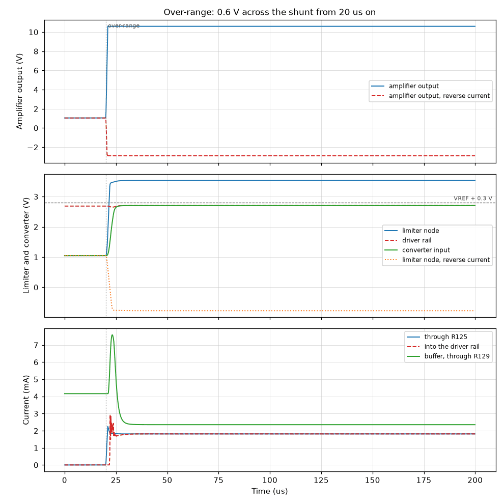

Notes:

- The amplifier model goes to 1.4 V below its positive supply, the reading of a
  typical curve of its datasheet at 2 kohm; the table guarantees 1.6 V. With +12
  V that is 10.6 V, more than the 10 V of section 4.5, so the clamp current here
  is the larger one.
- The driver model rests 2 mV below its supply when it is not loaded
  (assumption). The converter input in an over-range therefore is the driver
  rail itself, and the rail rises by what the clamp current takes off the 10 ohm
  of R129.
- The supply current of the two OPA365 follows the typical curve of the
  datasheet: 4.2 mA at 2.7 V. The corner case takes 4.0 mA at 5 V for the
  driver, an assumption: the datasheet states no least value.
- The protection diodes of the converter input are an assumed junction; the
  current into the REF pin at 0.2 V of forward voltage is not a figure to rely
  on.
- During an over-range the limiter node stands a diode drop above the driver
  rail, which is the supply of the driver, and with a reverse current a diode
  drop below ground. The input of the driver behind R128 is then held by its own
  protection diode, which the amplifier model does not have; the current through
  R128 is calculated for a diode that holds the input 0.5 V beyond the supply.
- The reference, the rails and their impedance are ideal. Leakage of the diode
  pair is not modelled.

Models. written here: AD8421, BAV199, BAV199_HI, BAV199_LO, MUX509, OPA197,
OPA365, SIGNAL_CHAIN_ADS8860.

Decks: [limiter.nominal.cir](limiter.nominal.cir).

## `signal_chain/noise`

**Noise of the chain at the converter input, by range.**

A noise analysis from 0.1 Hz to 100 MHz with each range held. The shunt of the
range is in the circuit as the resistor of the netlist, the two closed channels
of the multiplexer as 250 ohm resistors, and the amplifiers carry the voltage
and current noise of their datasheets with the 1/f part. A test current through
the shunt gives the gain. The noise of one sample is the density at the
converter input integrated over the whole analysis, because sampling folds every
frequency down; divided by the gain and by the shunt it is the noise of the
reading. The noise of the converter itself is not simulated: it is added from
its datasheet. Range 0 is run a second time as the board has it, with the 100 nF
of C71 on the node after the shunts and a quiet supply.

Answers: section 4.10 (noise budget), requirement R-04, section 4.5 (anti-alias
filter).

| Figure | Simulated | Specification | Limits | Verdict | Source |
| --- | --- | --- | --- | --- | --- |
| R0: noise of one sample at the shunt, chain alone | 1.575 µV | | | | |
| R0: noise of one sample with the converter, as a current | 2.266 nA | 2.1 nA (+7.89 %) | at most 5 nA | pass | section 4.10: about 2.1 nA, limit of the test 5 nA |
| R1: noise of one sample at the shunt, chain alone | 1.317 µV | | | | |
| R1: noise of one sample with the converter, as a current | 65.57 nA | 65 nA (+0.87 %) | | | section 4.10 |
| R2: noise of one sample at the shunt, chain alone | 1.308 µV | | | | |
| R2: noise of one sample with the converter, as a current | 2.091 µA | 2.1 µA (-0.43 %) | | | section 4.10 |
| R3: noise of one sample at the shunt, chain alone | 1.307 µV | | | | |
| R3: noise of one sample with the converter, as a current | 20.89 µA | 21 µA (-0.54 %) | | | section 4.10 |
| R0: part of the noise at the shunt that comes from shunt | 877 nV | | | | |
| R0: part of the noise at the shunt that comes from multiplexer channels | 620.2 nV | | | | |
| R0: part of the noise at the shunt that comes from amplifier U27 and R123 | 1.102 µV | | | | |
| R0: part of the noise at the shunt that comes from pedestal: U26, R121, R122 | 56.82 nV | | | | |
| R0: part of the noise at the shunt that comes from filter and driver: R125, R128, R130, U29 | 325.7 nV | | | | |
| R0: part of the noise at the shunt that comes from other | 249 pV | | | | |
| R0: the parts above together, over the integrated density | 0.9995 | | 0.97 to 1.03 | pass | check of this bench: the parts are those of the same analysis |
| Noise of the converter at its input with a reference of 2.5 V, from its datasheet | 32.46 µV | | | | |
| The same referred to the shunt | 1.629 µV | 1 µV (+62.89 %) | | | section 4.10 estimates about 1.0 uV |
| R0: noise of one sample if the converter had 0.5 code of noise at 2.5 V | 1.843 nA | 2.1 nA (-12.25 %) | | | section 4.10: about 2.1 nA |
| R0: density at the shunt at 1 kHz | 7.189 nV/√Hz | | | | |
| R0: density at the shunt at 1 Hz | 21.6 nV/√Hz | | | | |
| R0: noise at the shunt from 0.1 Hz to 10 Hz | 48.13 nV | | | | |
| R0: part of the chain noise that lies above half the sample rate | 0.3971 | | | | |
| R0: noise of the mean of 100 samples (1 ms), with the converter | 239.7 pA | | at most 5 nA | pass | section 4.10: 5 nA for the mean of 100 samples |
| R0: noise of the mean of 100000 samples (1 s), with the converter | 24.39 pA | | | | |
| R0 with C71 and a quiet supply: noise of one sample at the shunt, chain alone | 1.322 µV | | | | |
| R0 with C71 and a quiet supply: noise of one sample with the converter | 2.098 nA | 2.1 nA (-0.10 %) | at most 5 nA | pass | section 4.10: about 2.1 nA, limit of the test 5 nA |

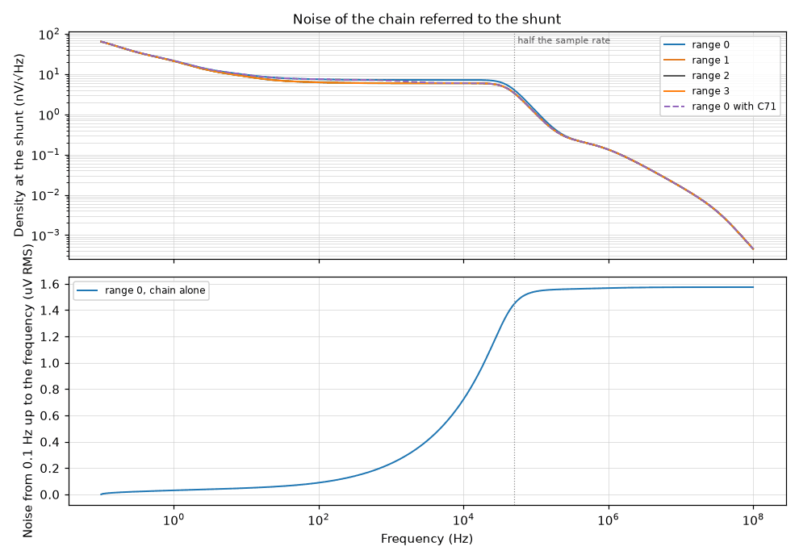

Notes:

- Every noise source is typical: 3 nV/rtHz and 60 nV/rtHz of the two stages of
  U27 with 200 fA/rtHz at each input, the densities of the other amplifiers, the
  thermal noise of every resistor. The reference, the rails and the supply are
  ideal and quiet: what a switching converter adds behind the filter is not in
  these figures.
- The multiplexer channels are 250 ohm resistors here (a variant of the
  multiplexer model written for this bench); the datasheet states no noise for
  them.
- The converter is not simulated. Its noise comes from its datasheet at a
  reference of 2.5 V: 88.7 dB of signal-to-noise ratio (figure 14), which is 32
  uV RMS or 0.85 code. The 0.5 code of its table holds for a reference of 5 V.
- The analysis starts at 0.1 Hz. A mean over 1 s also takes in what lies below
  that, where the 1/f noise keeps rising; drift is not noise in this sense.
- Without C71 the node after the shunts is held by an ideal source, so the whole
  thermal noise of the shunt is read. With C71 that noise is shunted above 1.6
  kHz.

Models. written here: AD8421, BAV199, OPA197, OPA365, SIGNAL_CHAIN_MUX509_HELD.

Decks: [noise.r0-c71.cir](noise.r0-c71.cir), [noise.r0.cir](noise.r0.cir).

## `signal_chain/pedestal`

**The pedestal: divider with its 1 uF, the buffer U26 and the reference pin of
U27.**

The pedestal is followed from the reference to the reference pin of the
amplifier. An operating point gives the voltage at the test point and the
current that the reference pin takes from the buffer; the same point is solved
with the divider at the two ends of its tolerance and with the offset and the
bias current of the buffer at their limits. Small-signal runs give what the
divider and its 1 uF let through from the reference, the impedance that the
buffer offers the reference pin, and the loop gain of the buffer by double
injection. Two transient runs follow: the amplifier output steps by 2 V, which
changes the current of the reference pin, and the reference appears at power-up.

Answers: section 4.5 (reference pin at +50 mV), section 8 (zero calibration).

| Figure | Simulated | Specification | Limits | Verdict | Source |
| --- | --- | --- | --- | --- | --- |
| Pedestal at the test point TP41 | 50.08 mV | 50.08 mV (+0.00 %) | 49.98 mV to 50.18 mV | pass | section 4.5: +50 mV from 49.9 kohm and 1.02 kohm |
| Pedestal with divider and buffer at the low corner | 49.88 mV | | | | |
| Pedestal with divider and buffer at the high corner | 50.28 mV | | | | |
| The two corners apart, in codes of the converter | 10.65 codes | | | | |
| Current that the divider takes from the reference | 49.1 µA | | | | |
| Current of the buffer output at 50 mV of shunt voltage (negative: into the buffer) | -168.7 µA | | | | |
| From the reference to the pedestal at 1 Hz | 0.02003 | 0.02003 (+0.00 %) | | | |
| Corner above which the divider and its 1 uF keep reference noise off the pedestal | 158.8 Hz | 159 Hz (-0.10 %) | 154.2 Hz to 163.8 Hz | pass | 1 uF with 49.9 kohm and 1.02 kohm in parallel, calculated here |
| Impedance that the buffer offers the reference pin at 1 kHz | 34.08 mΩ | | at most 1 Ω | pass | AD8421 datasheet, page 23: source impedance of the REF pin below 1 ohm |
| Impedance that the buffer offers the reference pin at 10 kHz | 340.8 mΩ | | at most 1 Ω | pass | AD8421 datasheet, page 23: source impedance of the REF pin below 1 ohm |
| Impedance that the buffer offers the reference pin at 40 kHz | 1.363 Ω | | at most 1 Ω | **FAIL** | AD8421 datasheet, page 23: source impedance of the REF pin below 1 ohm |
| Gain error that this impedance causes at 40 kHz | 68.16 ppm | | | | |
| Phase margin of the buffer loop with the reference pin as its load | 56.75 ° | | at least 45 ° | pass | this bench: 45 degrees is the least it accepts |
| Crossover of the buffer loop | 8.733 MHz | | | | |
| Amplifier output steps by 2 V: largest excursion of the pedestal | 1.433 mV | | | | |
| Amplifier output steps by 2 V: lasting shift of the pedestal | 3.922 nV | | -19.07 µV to 19.07 µV | pass | this bench: below half a code of the converter |
| Amplifier output steps by 2 V: pedestal within half a code after | 643.2 ns | | | | |
| Reference appears: pedestal within one code of its level after | 7.182 ms | | at most 200 ms | pass | rule F-36: the zero calibration starts no earlier than 200 ms after a reset |

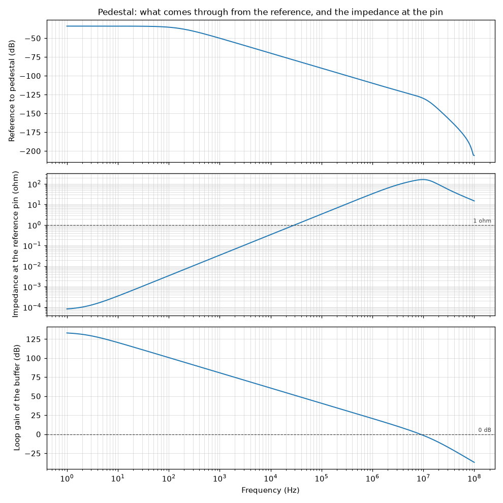

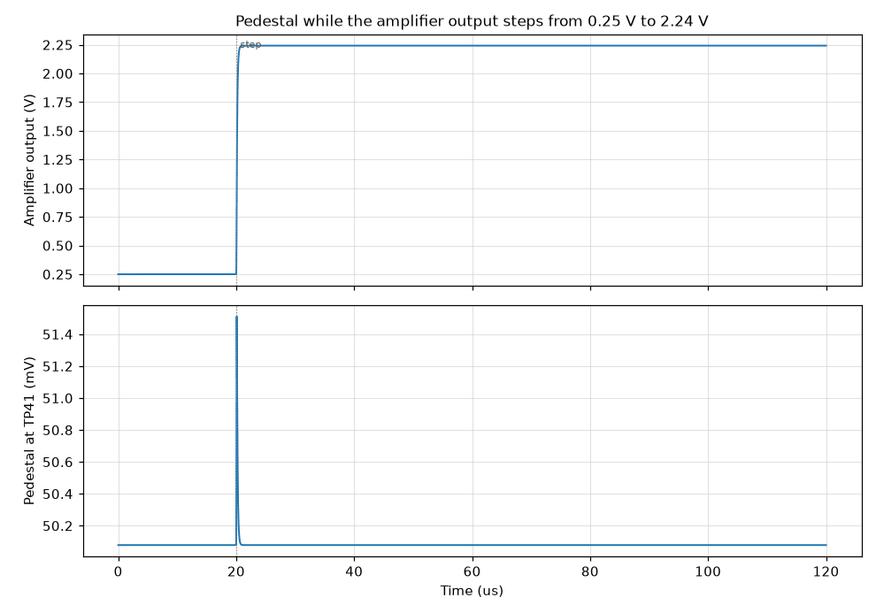

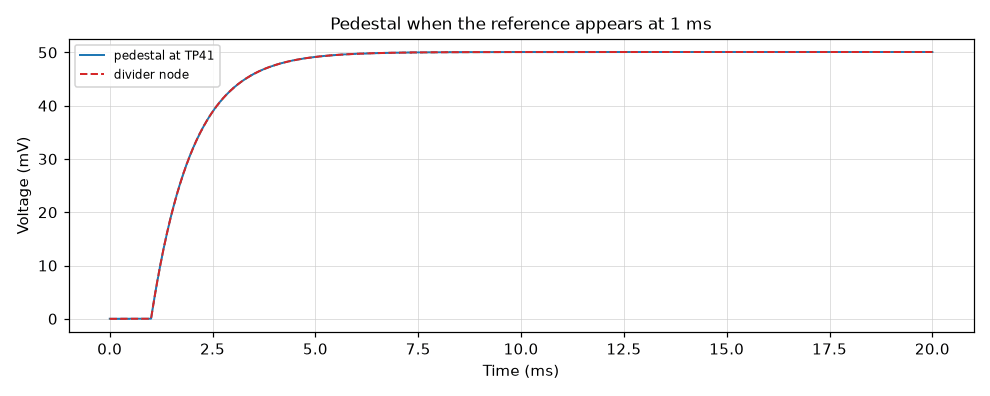

Notes:

- The reference is an ideal source: its own noise, tolerance and output
  impedance are not in these figures. The pedestal follows the reference in
  proportion, as the converter does, so a reference error does not move the code
  at zero current.
- The corners take the two divider resistors to opposite ends of their 0.1 % and
  the buffer to 100 uV of offset and 5 nA of bias current, its limit over
  temperature. The zero calibration removes what is constant of it.
- The load of the buffer is the reference pin of the amplifier model, 20 kohm to
  its first stage. The capacitance of the test point and of the track is not in
  the circuit.
- The buffer model has the open-loop output impedance of its datasheet, 375 ohm
  with 100 pF across it. Its impedance in closed loop passes 1 ohm near 30 kHz;
  the datasheet of the amplifier asks for less than 1 ohm without naming a
  frequency. The consequence is a gain error of the positive input by the ratio
  to 20 kohm.

Models. written here: AD8421, BAV199, MUX509, OPA197, OPA365,
SIGNAL_CHAIN_OPA197_PROBE.

Decks: [pedestal.power-up.cir](pedestal.power-up.cir),
[pedestal.rest.cir](pedestal.rest.cir), [pedestal.step.cir](pedestal.step.cir).

## `signal_chain/reference-line`

**The reference pin of the converter during a conversion: R131 and C89.**

The converter takes its reference current and the line is watched. The circuit
holds the reference U12 with its capacitors, the 22 uF of C89 behind the 0.22
ohm of R131 at the REF pin of the converter, and the 100 nF of the monitor
converter on the same line. The model of the converter draws its reference
current for the 710 ns of every conversion: 150 uA at 2.5 V, the 300 uA of the
datasheet in proportion to the reference. Before the first conversion the line
carries the mean of that current, so that the run starts in the state of a
converter that has been running for long. The run is made at 100 kSPS and at 500
kSPS with C89 at its nominal value, and at 500 kSPS with the 14 uF and the 10.8
uF that the part keeps under bias.

Answers: section 4.6 (capacitors on the reference line, D-75).

| Figure | Simulated | Specification | Limits | Verdict | Source |
| --- | --- | --- | --- | --- | --- |
| 100 kSPS: REF pin at the start of a conversion, off its mean level by | 3.314 µV | | at most 38.15 µV | pass | ADS8860 datasheet, page 31: within one code when a conversion starts |
| 100 kSPS: REF pin falls during a conversion by | 29.91 µV | | | | |
| 100 kSPS: the same as a part of the reference | 11.96 ppm | | | | |
| 500 kSPS: REF pin at the start of a conversion, off its mean level by | 10.25 µV | | at most 38.15 µV | pass | ADS8860 datasheet, page 31: within one code when a conversion starts |
| 500 kSPS: REF pin falls during a conversion by | 28.87 µV | | | | |
| 500 kSPS: the same as a part of the reference | 11.55 ppm | | | | |
| 500 kSPS, C89 at 14 uF: REF pin at the start of a conversion, off its mean level by | 10.89 µV | | at most 38.15 µV | pass | ADS8860 datasheet, page 31: within one code when a conversion starts |
| 500 kSPS, C89 at 14 uF: REF pin falls during a conversion by | 29.92 µV | | | | |
| 500 kSPS, C89 at 14 uF: the same as a part of the reference | 11.97 ppm | | | | |
| 500 kSPS, C89 at 10.8 uF: REF pin at the start of a conversion, off its mean level by | 11.44 µV | | at most 38.15 µV | pass | ADS8860 datasheet, page 31: within one code when a conversion starts |
| 500 kSPS, C89 at 10.8 uF: REF pin falls during a conversion by | 30.77 µV | | | | |
| 500 kSPS, C89 at 10.8 uF: the same as a part of the reference | 12.31 ppm | | | | |

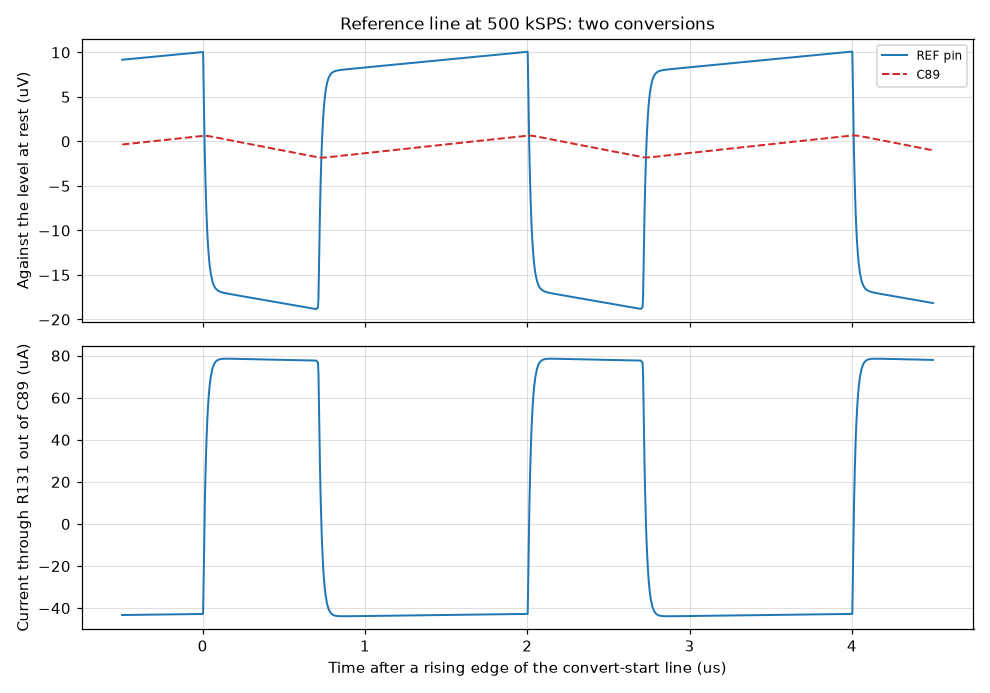

Notes:

- The reference current of the model is a constant current during the
  conversion. The real converter takes its charge as one packet per bit, with
  peaks far above the mean; the dip of the REF pin inside a bit period is
  therefore larger than this figure, and what counts is that the pin has
  recovered at the end of each bit, which no model here resolves.
- The current is taken as 150 uA at 2.5 V (the datasheet states 300 uA at 5 V
  and mid-code); it depends on the code, which the model leaves out.
- The reference is the model of the analog rails block, whose output impedance
  is a fit to two figures of its datasheet. The track between the reference and
  the converter has no inductance or resistance here, and C89 no inductance.
- A dip that is the same at every conversion is part of the gain, which the
  calibration removes.

Models. written here: REF5025AID, SIGNAL_CHAIN_ADS8860.

Decks: [reference-line.500k.cir](reference-line.500k.cir).

## `signal_chain/sampling-kick`

**The converter input: settling of the sampling kick through R130 and C90.**

The converter samples a steady voltage and the driver refills its capacitor. The
circuit holds the driver U29 with its filter and its rail, the 22 ohm and 10 nF
at the converter input, and the model of that input: a switch of 96 ohm and a
capacitor of 55 pF, opened by the convert-start line for the longest conversion
of the datasheet, 710 ns. The capacitor comes back empty from every conversion,
which is the bounding case: the datasheet does not state what it holds. The
voltage on it at the next sampling instant is compared with the voltage that the
input has without any sampling. The run is made at 100 kSPS and at 500 kSPS, at
three levels of the input.

Answers: section 4.5 (network at the converter input), section 4.6 (100 kSPS,
option of 500 kSPS).

| Figure | Simulated | Specification | Limits | Verdict | Source |
| --- | --- | --- | --- | --- | --- |
| 100 kSPS, pedestal: sample against the settled input | 1.877e-05 codes | | -0.5 codes to 0.5 codes | pass | ADS8860 datasheet, page 32: the input must settle to 16 bits within the acquisition time |
| 100 kSPS, half scale: sample against the settled input | 0.0006609 codes | | -0.5 codes to 0.5 codes | pass | ADS8860 datasheet, page 32: the input must settle to 16 bits within the acquisition time |
| 100 kSPS, near full scale: sample against the settled input | 0.002203 codes | | -0.5 codes to 0.5 codes | pass | ADS8860 datasheet, page 32: the input must settle to 16 bits within the acquisition time |
| 100 kSPS, near full scale: the input pin dips by | 12.33 mV | | | | |
| 100 kSPS, near full scale: pin back within half a code after | 1.424 µs | | at most 9.29 µs | pass | the acquisition time at 100 kSPS with the longest conversion, calculated here |
| 500 kSPS, pedestal: sample against the settled input | -0.01936 codes | | -0.5 codes to 0.5 codes | pass | ADS8860 datasheet, page 32: the input must settle to 16 bits within the acquisition time |
| 500 kSPS, half scale: sample against the settled input | -0.4841 codes | | -0.5 codes to 0.5 codes | pass | ADS8860 datasheet, page 32: the input must settle to 16 bits within the acquisition time |
| 500 kSPS, near full scale: sample against the settled input | -0.9491 codes | | -0.5 codes to 0.5 codes | **FAIL** | ADS8860 datasheet, page 32: the input must settle to 16 bits within the acquisition time |
| 500 kSPS, near full scale: the input pin dips by | 12.32 mV | | | | |
| 500 kSPS, near full scale: pin back within half a code after | nan s | | at most 1.29 µs | **FAIL** | the acquisition time at 500 kSPS with the longest conversion, calculated here |
| 500 kSPS, near full scale, capacitor keeps nine tenths of its charge: sample against the settled input | -0.08716 codes | | | | |

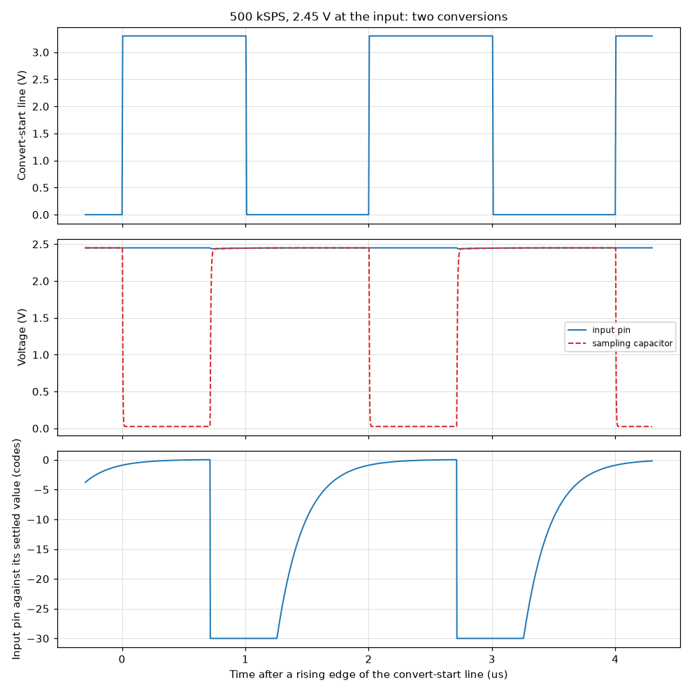

Notes:

- The sampling capacitor is empty at the start of every acquisition. A real
  converter keeps part of its charge and kicks less; the last figure shows the
  size of that effect with nine tenths kept.
- The conversion takes 710 ns, the longest of the datasheet; a shorter one
  leaves more time to settle.
- An error that is the same at every sample is a gain error, which the
  calibration removes; it matters as an error that depends on the sample before,
  which this bench does not separate.
- The driver model has the open-loop output impedance and the bandwidth of its
  datasheet; the amplifier output is an ideal source, the reference and the
  rails are ideal. The clock and data lines of the converter are not in the
  circuit.

Models. written here: BAV199, OPA365, SIGNAL_CHAIN_ADS8860.

Decks: [sampling-kick.500k-2p45v.cir](sampling-kick.500k-2p45v.cir).

## `signal_chain/settling`

**Settling of the chain after a range change.**

A range change is a change of the multiplexer address between two held voltages.
Each sense tap of the multiplexer holds the voltage of its shunt; the address
lines change at one instant, and the converter input is followed until it rests.
The time counts from the edge of the address lines. In the jump cases the old
range stands in overload (0.6 V across its shunt, the amplifier at its positive
limit, the limiter at work); the other cases stay inside the linear range. Every
case gives the time to 0.1 % of the converter range and to one code, and what a
sample taken 70 us and 80 us after the change still carries: the first valid
sample falls between the two.

Answers: section 4.5 (settling, D-76), rule F-35 and section 8 (settling
window), requirement R-05.

| Figure | Simulated | Specification | Limits | Verdict | Source |
| --- | --- | --- | --- | --- | --- |
| jump to range 3 from an overload, 15 mV after it: within 0.1 % of the range after | 45.37 µs | 45 µs (+0.81 %) | at most 50 µs | pass | section 4.5: about 45 us, 37 us to 50 us over the simulated cases |
| jump to range 3 from an overload, 15 mV after it: within one code after | 65.22 µs | 65 µs (+0.34 %) | at most 70 µs | pass | section 4.5: about 65 us, 64 us to 70 us over the simulated cases |
| jump from an overload, 5 mV after it: within 0.1 % of the range after | 45.48 µs | | at most 50 µs | pass | section 4.5: about 45 us, 37 us to 50 us over the simulated cases |
| jump from an overload, 5 mV after it: within one code after | 65.26 µs | | at most 70 µs | pass | section 4.5: about 65 us, 64 us to 70 us over the simulated cases |
| jump from an overload, 50 mV after it: within 0.1 % of the range after | 45.27 µs | | at most 50 µs | pass | section 4.5: about 45 us, 37 us to 50 us over the simulated cases |
| jump from an overload, 50 mV after it: within one code after | 65.76 µs | | at most 70 µs | pass | section 4.5: about 65 us, 64 us to 70 us over the simulated cases |
| jump from an overload, 100 mV after it: within 0.1 % of the range after | 37.33 µs | | at most 50 µs | pass | section 4.5: about 45 us, 37 us to 50 us over the simulated cases |
| jump from an overload, 100 mV after it: within one code after | 67.75 µs | | at most 70 µs | pass | section 4.5: about 65 us, 64 us to 70 us over the simulated cases |
| jump from an overload, diodes at 0.9 V and 3 us of recovery: within 0.1 % of the range after | 49.2 µs | | at most 50 µs | pass | section 4.5: about 45 us, 37 us to 50 us over the simulated cases |
| jump from an overload, diodes at 0.9 V and 3 us of recovery: within one code after | 69.05 µs | | at most 70 µs | pass | section 4.5: about 65 us, 64 us to 70 us over the simulated cases |
| jump from an overload, diodes at 0.7 V: within 0.1 % of the range after | 45.11 µs | | at most 50 µs | pass | section 4.5: about 45 us, 37 us to 50 us over the simulated cases |
| jump from an overload, diodes at 0.7 V: within one code after | 64.97 µs | | at most 70 µs | pass | section 4.5: about 65 us, 64 us to 70 us over the simulated cases |
| jump from an overload, 125 ohm: within 0.1 % of the range after | 45.34 µs | | at most 50 µs | pass | section 4.5: about 45 us, 37 us to 50 us over the simulated cases |
| jump from an overload, 125 ohm: within one code after | 65.25 µs | | at most 70 µs | pass | section 4.5: about 65 us, 64 us to 70 us over the simulated cases |
| jump from an overload, 430 ohm: within 0.1 % of the range after | 45.45 µs | | at most 50 µs | pass | section 4.5: about 45 us, 37 us to 50 us over the simulated cases |
| jump from an overload, 430 ohm: within one code after | 65.28 µs | | at most 70 µs | pass | section 4.5: about 65 us, 64 us to 70 us over the simulated cases |
| jump after 2 us of overload: within 0.1 % of the range after | 44.32 µs | | at most 50 µs | pass | section 4.5: about 45 us, 37 us to 50 us over the simulated cases |
| jump after 2 us of overload: within one code after | 64.28 µs | | at most 70 µs | pass | section 4.5: about 65 us, 64 us to 70 us over the simulated cases |
| jump after 5 us of overload: within 0.1 % of the range after | 44.83 µs | | at most 50 µs | pass | section 4.5: about 45 us, 37 us to 50 us over the simulated cases |
| jump after 5 us of overload: within one code after | 64.67 µs | | at most 70 µs | pass | section 4.5: about 65 us, 64 us to 70 us over the simulated cases |
| jump with 3 V across the ladder before it: within 0.1 % of the range after | 45.55 µs | | at most 50 µs | pass | section 4.5: about 45 us, 37 us to 50 us over the simulated cases |
| jump with 3 V across the ladder before it: within one code after | 65.41 µs | | at most 70 µs | pass | section 4.5: about 65 us, 64 us to 70 us over the simulated cases |
| step up at 91 mV, range 0 to range 1: within 0.1 % of the range after | 40.16 µs | | at most 50 µs | pass | section 4.5: about 45 us, 37 us to 50 us over the simulated cases |
| step up at 91 mV, range 0 to range 1: within one code after | 60.69 µs | | at most 70 µs | pass | section 4.5: about 65 us, 64 us to 70 us over the simulated cases |
| step down at 60 uA, range 1 to range 0: within 0.1 % of the range after | 38.19 µs | | at most 50 µs | pass | section 4.5: about 45 us, 37 us to 50 us over the simulated cases |
| step down at 60 uA, range 1 to range 0: within one code after | 59.78 µs | | at most 70 µs | pass | section 4.5: about 65 us, 64 us to 70 us over the simulated cases |
| 120 mV to 1.2 mV, range 2 to range 3: within 0.1 % of the range after | 42.47 µs | | at most 50 µs | pass | section 4.5: about 45 us, 37 us to 50 us over the simulated cases |
| 120 mV to 1.2 mV, range 2 to range 3: within one code after | 63.5 µs | | at most 70 µs | pass | section 4.5: about 65 us, 64 us to 70 us over the simulated cases |
| Largest error of a sample taken 70 us after the change, any case | 0.6441 codes | | at most 65.54 codes | pass | requirement R-05: 0.1 % of range, 65.5 codes |
| Largest error of a sample taken 80 us after the change, any case | 0.3949 codes | | at most 65.54 codes | pass | requirement R-05: 0.1 % of range, 65.5 codes |
| Longest time to 0.1 % of the range, any case | 49.2 µs | | at most 70 µs | pass | rule F-35: seven samples are flagged, the eighth is taken after 70 us |

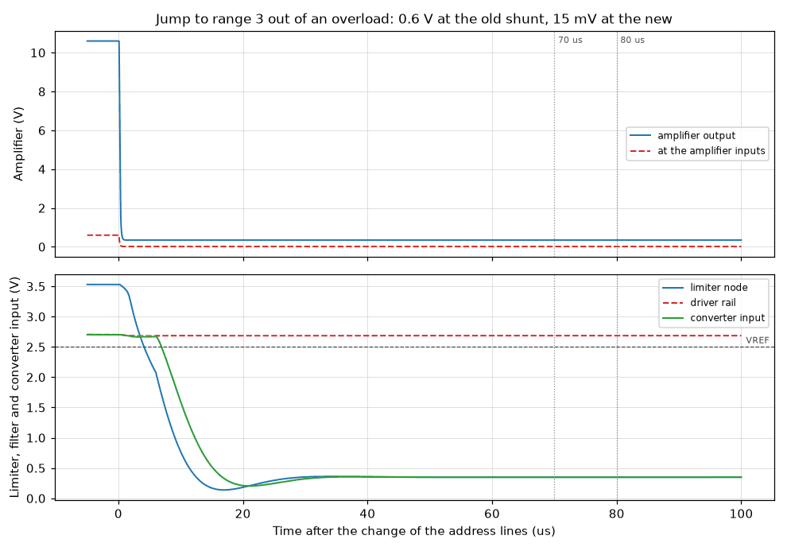

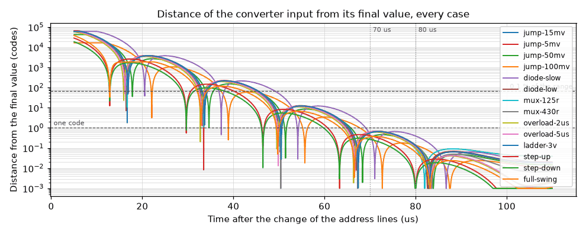

Notes:

- The ladder is not in this circuit. Each sense tap is an ideal source, so the
  new shunt voltage stands at once: the time that the load and its capacitor
  need to reach the new voltage across the shunt (benches of the ladder) is not
  in these figures.
- The amplifier model leaves an overload as fast as it slews: its datasheet
  states no recovery time. The 5 us that section 4.5 allows for it are not in
  these figures and would add to every jump case.
- The multiplexer model has a fixed resistance per channel and no charge
  injection; the diode models carry the recovery time of their datasheet.
- One code is 15 ppm of the range. No model here resolves such a tail (thermal
  effects of the amplifier, dielectric absorption): the time to one code is what
  the two poles of the filter give, not a prediction of the board.

Models. written here: AD8421, BAV199, BAV199_HI, BAV199_LO, MUX509, OPA197,
OPA365.

Decks: [settling.jump-15mv.cir](settling.jump-15mv.cir).

## `signal_chain/transfer`

**From the shunt voltage to the converter input and to the code, with
tolerances.**

The shunt voltage is swept and the converter input is read. Range 0 is held, the
node after the shunts stands at 3.3 V and the voltage across the shunt is swept
from -5 mV to 160 mV as an operating point sweep. The slope of the converter
input is the gain of the chain, its value at 0 V the pedestal; an ideal
converter turns it into codes. Then 120 boards are drawn: every resistor of the
chain inside its tolerance, the gain error and the offsets of the amplifiers
inside the limits of their datasheets, all with a uniform distribution.

Answers: sections 4.3, 4.5 and 8 (gain, pedestal, zero code, full scale,
resolution), section 4.4 (room above the trip level).

| Figure | Simulated | Specification | Limits | Verdict | Source |
| --- | --- | --- | --- | --- | --- |
| Gain from the shunt to the converter input | 19.93 | 19.93 (+0.00 %) | 19.91 to 19.95 | pass | section 4.5: 19.93 from R123, a 0.1 % part |
| Converter input at zero shunt voltage (the pedestal) | 50.08 mV | 50.08 mV (+0.00 %) | 49.83 mV to 50.33 mV | pass | section 4.5: +50 mV from R121 and R122 |
| Code at zero shunt voltage | 1313 codes | 1313 codes (+0.00 %) | 1310 codes to 1316 codes | pass | section 4.5: about 1313 codes |
| Shunt voltage at which the converter reads full scale | 122.9 mV | 122.9 mV (+0.02 %) | 122.7 mV to 123.1 mV | pass | section 4.3: 122.9 mV |
| Largest distance from a straight line, zero to full scale | 0.000365 codes | | at most 1 codes | pass | section 4.5: the driver is linear beyond the full scale of the converter |
| Driver rail above the converter input at full scale | 185.7 mV | | at least 100 mV | pass | OPA365 datasheet, page 6: gain specified down to 100 mV from the rail |
| Shunt voltage at which the driver output is 100 mV below its rail | 127.2 mV | 126.8 mV (+0.34 %) | at least 122.9 mV | pass | section 4.5: linear up to 126.8 mV, above the full scale of the converter |
| Converter input with 150 mV at the shunt (driver against its rail) | 2.684 V | | at most 2.75 V | pass | section 4.5: never above VREF + 0.25 V |
| R0: current of one code, with the shunt of the specification | 1.914 nA | 1.914 nA (+0.01 %) | 1.91 nA to 1.918 nA | pass | sections 4.3 and 8 |
| R1: current of one code, with the shunt of the specification | 59.91 nA | 59.9 nA (+0.02 %) | 59.78 nA to 60.02 nA | pass | sections 4.3 and 8 |
| R2: current of one code, with the shunt of the specification | 1.916 µA | 1.916 µA (+0.00 %) | 1.912 µA to 1.92 µA | pass | sections 4.3 and 8 |
| R3: current of one code, with the shunt of the specification | 19.14 µA | 19.14 µA (+0.01 %) | 19.1 µA to 19.18 µA | pass | sections 4.3 and 8 |
| Lowest gain of 120 boards | 19.87 | | at least 19.87 | pass | 0.1 % of R123 (section 4.5) and 0.2 % of the amplifier (AD8421, page 4) |
| Highest gain of 120 boards | 19.97 | | at most 19.99 | pass | 0.1 % of R123 (section 4.5) and 0.2 % of the amplifier (AD8421, page 4) |
| Lowest code at zero shunt voltage, offsets of the chain alone | 1278 codes | | | | |
| Highest code at zero shunt voltage, offsets of the chain alone | 1350 codes | | | | |
| Lowest code at zero shunt voltage with the offset error of the converter | 1196 codes | | at least 650 codes | pass | section 4.4: a code below 650 counts as under-range |
| Highest code at zero shunt voltage with the offset error of the converter | 1446 codes | | | | |
| Lowest shunt voltage of the converter full scale | 122.5 mV | | at least 122.3 mV | pass | section 4.4: 3.6 mV to spare above the highest trip level of 118.7 mV |
| R0: spread of the current of one code over the boards, highest to lowest | 0.4783 % | | | | |

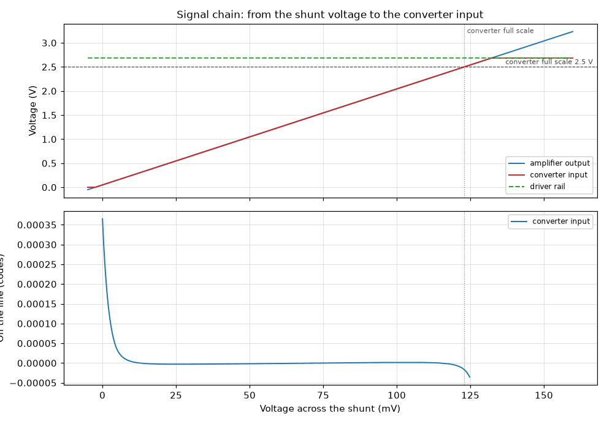

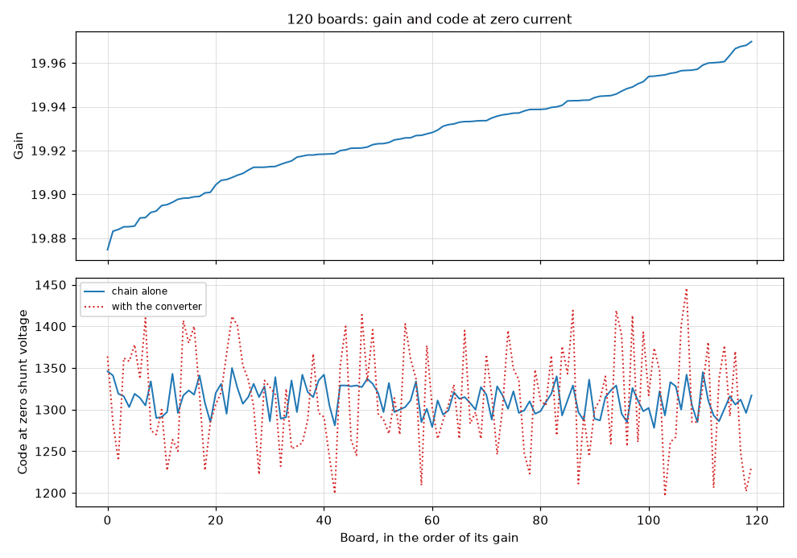

Notes:

- The ladder is not in this circuit: ideal sources stand on the inputs of the
  multiplexer. The current of one code uses the shunt values of the
  specification.
- The converter is ideal: one code per VREF / 65536. Its offset error (4 mV at
  most) is added by arithmetic in the figures that say so; its gain error (0.01
  %) is left out.
- The amplifier models are typical parts without offset in the sweep. Their
  offsets and the gain error of U27 are drawn only in the Monte Carlo run,
  inside the limits of the datasheets, with a uniform distribution; the
  reference is ideal.
- The driver model keeps its gain up to its rail. The figure for the driver
  output 100 mV below the rail marks where the datasheet stops to state the
  gain.
- The models are straight inside their limits, so the distance from the straight
  line in the second panel is the residue of the solver, a few ten-thousandths
  of a code. The non-linearity of the real parts is not in it: the amplifier has
  5 ppm typical and 10 ppm at the most over an output of -5 V to +5 V (AD8421,
  page 4), the converter 1 code typical and 2 codes at the most (ADS8860, page
  1).

Models. written here: AD8421, BAV199, MUX509, OPA197, OPA365.

Decks: [transfer.sweep.cir](transfer.sweep.cir).
