# Simulation Results: Source Meter

Everything on this page is a simulation result. Nothing here is measured on
hardware. The page is written by `circuit-sim report` from the result files
beside it; do not edit it by hand.

## `source_meter/enable`

**The enable pin of the pre-regulator behind Q1, over the 5 V rail.**

Q1 with its resistors is taken alone and the 5 V rail is swept from 0 V to 5.5
V. The gate of Q1 is the line 5V_OK, which R25 pulls up to the rail against the
divider of the charge pump and the enable inputs of the two 3.3 V regulators.
The controller holds SMU_ON at 3.3 V. The sweep gives the voltage of the enable
pin at the nominal rail, at 4.25 V and at the lowest threshold of the
supervisor, with a typical transistor and with the threshold at both limits of
its datasheet. One more sweep holds SMU_ON low.

Answers: section 4.2 (enable), decision D-48.

| Figure | Simulated | Vendor models | Specification | Limits | Verdict | Source |
| --- | --- | --- | --- | --- | --- | --- |
| Line 5V_OK as a share of the 5 V rail, at 5 V | 94.34 % | 94.34 % | 94.34 % (+0.00 %) | 93 % to 95.5 % | pass | calculated from R25, R27, R28 and the two pull-downs of 1 Mohm |
| Enable pin at 5 V on the rail, typical threshold of Q1 | 3.157 V | 3.157 V | | at least 1.2 V | pass | section 4.2: 2.36 V at 4.25 V and 1.96 V at the lowest supervisor threshold (calculated, with an estimate of the gate threshold), against 1.2 V |
| Enable pin at 5 V on the rail, low threshold of Q1 | 3.176 V | 3.176 V | | at least 1.2 V | pass | section 4.2: 2.36 V at 4.25 V and 1.96 V at the lowest supervisor threshold (calculated, with an estimate of the gate threshold), against 1.2 V |
| Enable pin at 5 V on the rail, high threshold of Q1 | 3.058 V | 3.058 V | | at least 1.2 V | pass | section 4.2: 2.36 V at 4.25 V and 1.96 V at the lowest supervisor threshold (calculated, with an estimate of the gate threshold), against 1.2 V |
| Enable pin at 4.25 V on the rail, typical threshold of Q1 | 2.776 V | 2.776 V | | at least 1.2 V | pass | section 4.2: 2.36 V at 4.25 V and 1.96 V at the lowest supervisor threshold (calculated, with an estimate of the gate threshold), against 1.2 V |
| Enable pin at 4.25 V on the rail, low threshold of Q1 | 3.147 V | 3.147 V | | at least 1.2 V | pass | section 4.2: 2.36 V at 4.25 V and 1.96 V at the lowest supervisor threshold (calculated, with an estimate of the gate threshold), against 1.2 V |
| Enable pin at 4.25 V on the rail, high threshold of Q1 | 2.381 V | 2.381 V | 2.36 V (+0.87 %) | at least 1.2 V | pass | section 4.2: 2.36 V at 4.25 V and 1.96 V at the lowest supervisor threshold (calculated, with an estimate of the gate threshold), against 1.2 V |
| Enable pin at 3.83 V on the rail, typical threshold of Q1 | 2.394 V | 2.394 V | | at least 1.2 V | pass | section 4.2: 2.36 V at 4.25 V and 1.96 V at the lowest supervisor threshold (calculated, with an estimate of the gate threshold), against 1.2 V |
| Enable pin at 3.83 V on the rail, low threshold of Q1 | 2.964 V | 2.964 V | | at least 1.2 V | pass | section 4.2: 2.36 V at 4.25 V and 1.96 V at the lowest supervisor threshold (calculated, with an estimate of the gate threshold), against 1.2 V |
| Enable pin at 3.83 V on the rail, high threshold of Q1 | 1.999 V | 1.999 V | 1.96 V (+2.00 %) | at least 1.2 V | pass | section 4.2: 2.36 V at 4.25 V and 1.96 V at the lowest supervisor threshold (calculated, with an estimate of the gate threshold), against 1.2 V |
| Enable pin with SMU_ON low, rail at 5 V | 0 V | 0 V | | at most 400 mV | pass | SLVS916I, page 6: low below 0.4 V |
| Current that the pin SMU_ON delivers, rail at 5 V, typical transistor | 3.157 mA | 3.157 mA | | | | |

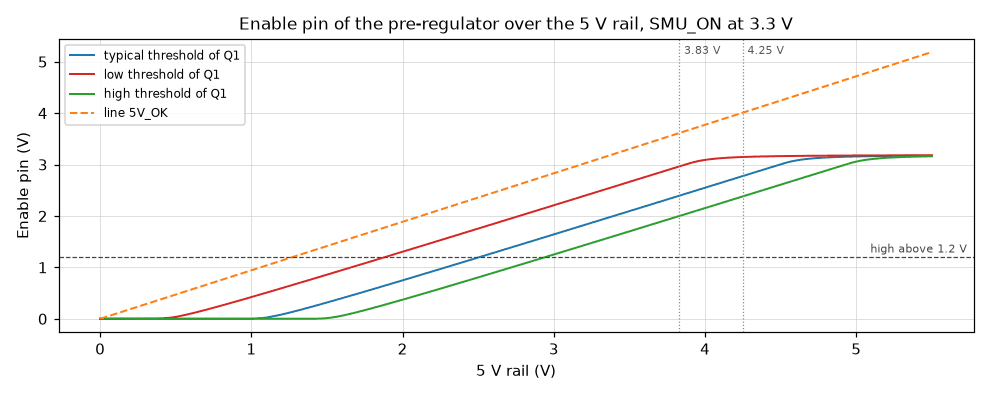

Notes:

- The supervisor is not in this circuit: its output is released for the whole
  sweep, so the curve shows what Q1 passes, not when the supervisor lets it.
  Below its threshold the supervisor pulls 5V_OK low and the pin is at 0 V.
- The converter takes no current at its enable pin that counts (0.1 uA at the
  most, datasheet) and is left out; R53 is the load.
- The three models of Q1 differ in the threshold alone: 0.5 V, typical and 1.5 V
  at 250 uA (datasheet limits at 25 C). The pin of the controller is 3.3 V
  behind 33 ohm (assumption).

Models. written here: SOURCE_METER_BSS138, SOURCE_METER_BSS138_HI,
SOURCE_METER_BSS138_LO.

Decks: [enable.sweep-typical.cir](enable.sweep-typical.cir).

## `source_meter/external`

**A device above the set-point: current drawn from it, clamps, the 5 V rail.**

The source stands at 0.80 V and a device lifts its output from outside. In the
first runs a source behind 50 mohm is connected at the terminal in range 3,
raised slowly to 5.0 V, held there for 15 ms and raised to 6.5 V. They give the
current that the instrument takes from a device at rest at 5.0 V, the current
through the clamp of the SET pin, the IN pin against the output, and the voltage
at which the pre-regulator starts to return current to the 5 V rail, with the
over-voltage level of the converter model and with the lowest one of its
datasheet. In the last runs a capacitor of 100 uF charged to 5.0 V is connected
to the live output at once, through leads of two lengths.

Answers: sections 4.2 and 4.9 (external voltage on the source output), rules
F-31 and F-33.

| Figure | Simulated | Vendor models | Specification | Limits | Verdict | Source |
| --- | --- | --- | --- | --- | --- | --- |
| Current that the instrument takes from a device at rest at 5.0 V, set-point 0.80 V | 10.11 mA | 10.11 mA | 11 mA (-8.11 %) | 9 mA to 14 mA | pass | section 4.9: about 11 mA, up to 14 mA warm (calculated) |
| The same current while the device rises through 4.9 V with 0.14 V/ms | 13.86 mA | 13.86 mA | | | | |
| Movement of that current in the last 2 ms of the rest at 5.0 V | 13.34 nA | 13.34 nA | | at most 10 µA | pass | limit of this bench: the current counts as at rest below 10 uA |
| In that state: current through the clamp of the SET pin into R60 | 3.453 mA | 3.453 mA | | at most 10 mA | pass | LT3080 Rev. E, page 2: 10 mA at the most |
| In that state: output above the SET pin | 755.9 mV | 755.9 mV | | | | |
| In that state: pre-regulator output | 5.45 V | 5.45 V | 5.452 V (-0.03 %) | | | |
| Slow rise up to 5.3 V: lowest voltage of the IN pin relative to the output | 368.5 mV | 368.5 mV | | at least -300 mV | pass | LT3080 Rev. E, page 2 (D-57); rule F-33 opens the output at 5.3 V |
| Slow rise up to 5.3 V: most power returned to the 5 V rail | -85.32 mW | -85.32 mW | | at most 250 mW | pass | section 4.2 and section 16: less than the instrument takes from the rail, for which 0.25 W is the condition |
| Outside voltage at which the 5 V rail takes current back, model of the converter | 6.452 V | 6.452 V | | | | |
| The same with the lowest over-voltage level of the converter, 5.5 V | 5.748 V | 5.748 V | 5.7 V (+0.83 %) | at least 5.3 V | pass | rule F-33: above about 5.7 V (estimate); the output opens at 5.3 V |
| Charged 100 uF connected, leads of 0.2 uH and 20 mohm: lowest voltage of the IN pin relative to the output | -1.04 V | -1.04 V | -630 mV (-65.14 %) | at least -300 mV | **FAIL** | LT3080 Rev. E, page 2: not more than 0.3 V below the output; section 4.9: 0.32 V to 0.94 V below for 3 us to 21 us (simulated), which no part covers |
| Charged 100 uF connected, leads of 0.2 uH and 20 mohm: time the IN pin spends more than 0.3 V below the output | 22.82 µs | 22.82 µs | 12 µs (+90.20 %) | | | |
| Charged 100 uF connected, leads of 0.2 uH and 20 mohm: highest current into the terminal | 17.53 A | 17.53 A | | | | |
| Charged 100 uF connected, leads of 0.2 uH and 20 mohm: highest regulator output | 3.493 V | 3.493 V | | | | |
| Charged 100 uF connected, leads of 1 uH and 50 mohm: lowest voltage of the IN pin relative to the output | -1.013 V | -1.013 V | -630 mV (-60.87 %) | at least -300 mV | **FAIL** | LT3080 Rev. E, page 2: not more than 0.3 V below the output; section 4.9: 0.32 V to 0.94 V below for 3 us to 21 us (simulated), which no part covers |
| Charged 100 uF connected, leads of 1 uH and 50 mohm: time the IN pin spends more than 0.3 V below the output | 24.72 µs | 24.72 µs | 12 µs (+105.97 %) | | | |
| Charged 100 uF connected, leads of 1 uH and 50 mohm: highest current into the terminal | 11.11 A | 11.11 A | | | | |
| Charged 100 uF connected, leads of 1 uH and 50 mohm: highest regulator output | 3.568 V | 3.568 V | | | | |

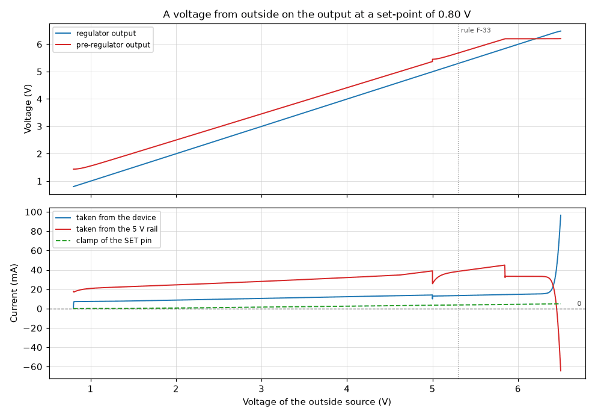

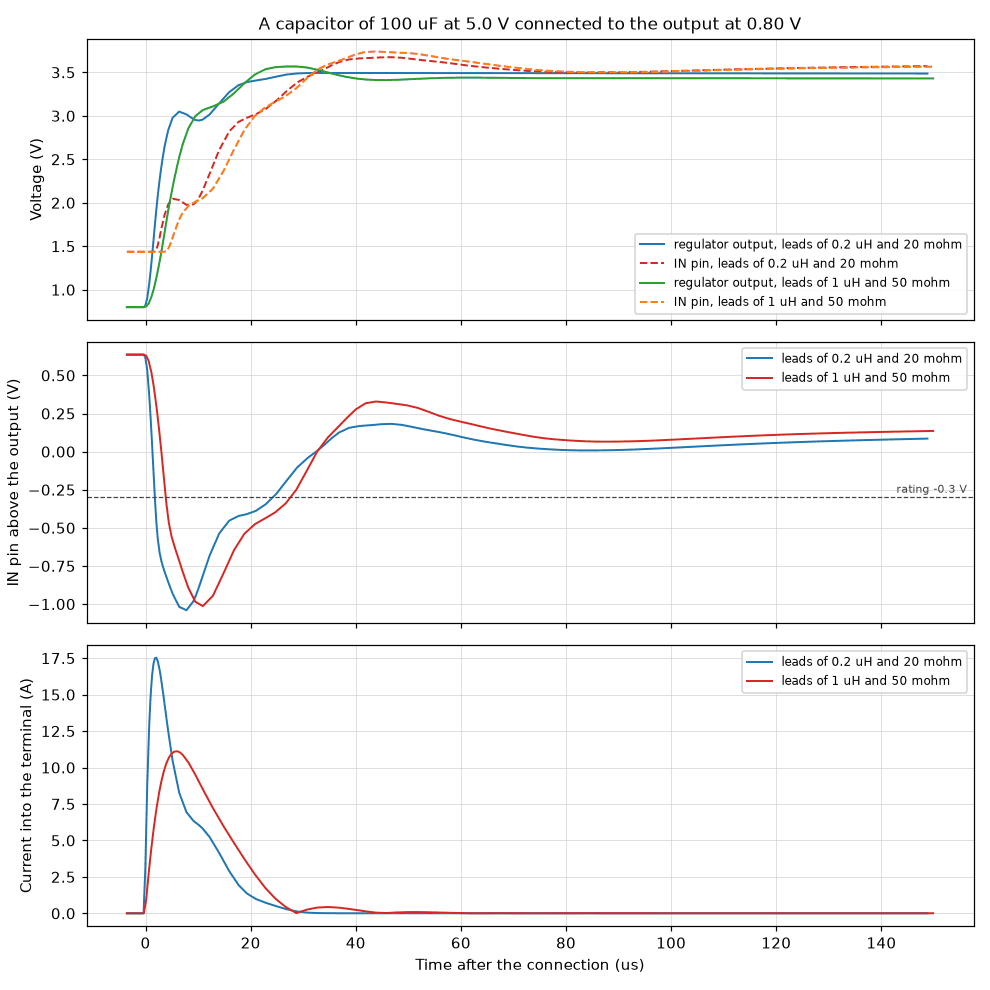

Notes:

- Nothing reacts in these runs: rules F-31 and F-33 are firmware, and the output
  switch, the range logic and the over-current trip belong to other blocks. The
  path from the terminal to the regulator output is three resistors, 145 mohm in
  range 3, without the inductance of the board.
- At rest at 5.0 V the device feeds the minimum load R69, 6.9 mA, and the clamp
  between OUT and SET of the regulator, which carries 3.5 mA into R60, less the
  0.3 mA that the regulator delivers itself. While the device rises it also
  charges the capacitors at the output, 28 uF at the capacitance that these runs
  take at 0.8 V: 3.5 mA more at 0.14 V/ms.
- The voltage at which the converter starts to return current depends on its
  over-voltage level, which the datasheet gives as 5.5 V to 7 V: the model has
  6.2 V, and one run takes 5.5 V. The rail is an ideal source, so it shows the
  current and not what the rail does with it.
- The hot-plug runs fail the rating of the IN pin, as section 4.9 says they
  would: the specification states that no part covers a charged device connected
  to the live output. The figures depend on the leads of the capacitor, which
  are assumptions, on the diode model of D11 and on the capacitors of the
  filter, which have no series inductance here.
- The diode D11 is the typical model at 27 C; the regulator model has no
  junction from the output to the IN pin other than its pass transistor, whose
  reverse behavior is an assumption.

Models. written here: BAV199, BLM31SN500, LT3080, MCP4921, OPA197, OPA365,
SOURCE_METER_1N5819HW, SOURCE_METER_BSS138, TPS63020_AVG, XFL4020_152.

Decks: [external.plug-200nh.cir](external.plug-200nh.cir),
[external.slow.cir](external.slow.cir).

## `source_meter/filter`

**The filter in front of the IN pin: source impedance with and without the
damper.**

A test current is fed into the node of the IN pin and the voltage is read. The
circuit is the bead FB1, the capacitor C46, the damper C43 with R59, and the
output capacitors of the converter with their bleeder; the converter and the
regulator are left out. The capacitors have the capacitance of their bias curve
at 0.8 V and at 5.0 V of output, and the bead takes three values of its
inductance, which its specification does not state. The same runs without the
damper show what it is for.

Answers: section 4.2 (filter toward the regulator).

| Figure | Simulated | Vendor models | Specification | Limits | Verdict | Source |
| --- | --- | --- | --- | --- | --- | --- |
| 0.8 V of output, bead of 0.1 uH: highest impedance at the IN pin above 20 kHz, with the damper | 313.5 mΩ | 313.5 mΩ | 320 mΩ (-2.04 %) | | | section 4.2: 0.27 ohm to 0.37 ohm with the damper (simulated) |
| 0.8 V of output, bead of 0.1 uH: frequency of that peak | 175.2 kHz | 175.2 kHz | | | | |
| 0.8 V of output, bead of 0.1 uH: highest impedance without the damper | 4.066 Ω | 4.066 Ω | | | | |
| 0.8 V of output, bead of 0.2 uH: highest impedance at the IN pin above 20 kHz, with the damper | 328 mΩ | 328 mΩ | 320 mΩ (+2.50 %) | | | section 4.2: 0.27 ohm to 0.37 ohm with the damper (simulated) |
| 0.8 V of output, bead of 0.2 uH: frequency of that peak | 121.1 kHz | 121.1 kHz | | | | |
| 0.8 V of output, bead of 0.2 uH: highest impedance without the damper | 6.875 Ω | 6.875 Ω | | | | |
| 0.8 V of output, bead of 0.5 uH: highest impedance at the IN pin above 20 kHz, with the damper | 352.5 mΩ | 352.5 mΩ | 320 mΩ (+10.15 %) | | | section 4.2: 0.27 ohm to 0.37 ohm with the damper (simulated) |
| 0.8 V of output, bead of 0.5 uH: frequency of that peak | 72.94 kHz | 72.94 kHz | | | | |
| 0.8 V of output, bead of 0.5 uH: highest impedance without the damper | 9.093 Ω | 9.093 Ω | | | | |
| 5 V of output, bead of 0.1 uH: highest impedance at the IN pin above 20 kHz, with the damper | 325.6 mΩ | 325.6 mΩ | 320 mΩ (+1.74 %) | | | section 4.2: 0.27 ohm to 0.37 ohm with the damper (simulated) |
| 5 V of output, bead of 0.1 uH: frequency of that peak | 242 kHz | 242 kHz | | | | |
| 5 V of output, bead of 0.1 uH: highest impedance without the damper | 6.707 Ω | 6.707 Ω | | | | |
| 5 V of output, bead of 0.2 uH: highest impedance at the IN pin above 20 kHz, with the damper | 338.3 mΩ | 338.3 mΩ | 320 mΩ (+5.71 %) | | | section 4.2: 0.27 ohm to 0.37 ohm with the damper (simulated) |
| 5 V of output, bead of 0.2 uH: frequency of that peak | 167.3 kHz | 167.3 kHz | | | | |
| 5 V of output, bead of 0.2 uH: highest impedance without the damper | 10.69 Ω | 10.69 Ω | | | | |
| 5 V of output, bead of 0.5 uH: highest impedance at the IN pin above 20 kHz, with the damper | 374.2 mΩ | 374.2 mΩ | 320 mΩ (+16.93 %) | | | section 4.2: 0.27 ohm to 0.37 ohm with the damper (simulated) |
| 5 V of output, bead of 0.5 uH: frequency of that peak | 94 kHz | 94 kHz | | | | |
| 5 V of output, bead of 0.5 uH: highest impedance without the damper | 13.08 Ω | 13.08 Ω | | | | |

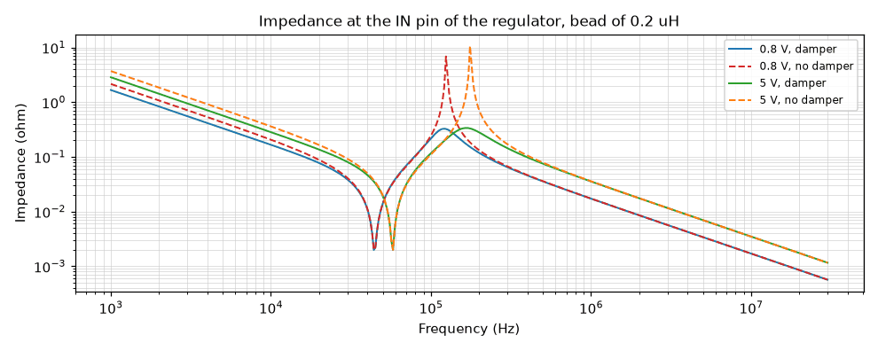

Notes:

- The inductance of the bead is an assumption, 0.1 uH to 0.5 uH: its reference
  specification gives the impedance at 100 MHz and the DC resistance alone. The
  copper between the converter and the bead, which section 10 holds to 15 mohm,
  is not in the netlist and not in this circuit; its inductance would add to
  that of the bead.
- The capacitors are ideal apart from their bias: no series resistance and no
  series inductance, so the impedance above some megahertz is lower here than on
  a board.
- The converter is left out: below its crossover, 19 kHz to 28 kHz in the model,
  its loop holds the impedance down, and the band of the peak starts there. The
  specification gives no limit for this impedance; the datasheet of the
  regulator asks for none at the IN pin.

Models. written here: BLM31SN500.

Decks: [filter.damped-5v-200nh.cir](filter.damped-5v-200nh.cir).

## `source_meter/load-step`

**Load steps from microamperes to 100 mA and to the curve: droop, recovery, head
room.**

The source is powered up, comes to rest, and its load is stepped up and back.
The device under test draws 10 uA, steps to 100 mA or to the current of the
curve of requirement R-08 within 1 us, and returns after 3 ms. The runs are made
at 0.8 V and at 5.0 V with 1 uF, 10 uF and 100 uF beside the device. They show
the droop of the regulator output and of the terminal, the recovery, the
overshoot at the release, and the head room of the regulator while the
pre-regulator answers the step. Steps to each of the four points of the curve,
with 10 uF, are repeated with a regulator at the guaranteed dropout.

Answers: section 4.2 (output capacitor, head room), rule F-32, decision D-57,
requirement R-08.

| Figure | Simulated | Vendor models | Specification | Limits | Verdict | Source |
| --- | --- | --- | --- | --- | --- | --- |
| 0.8 V, 10 uA to 100 mA, 1 uF: lowest regulator output below its value before the step | 16.29 mV | 16.29 mV | | | | |
| 0.8 V, 10 uA to 100 mA, 1 uF: lowest terminal voltage below its final value under load | 15.28 mV | 15.28 mV | | | | |
| 0.8 V, 10 uA to 100 mA, 1 uF: regulator output within 5 mV of its loaded value after | 13.46 µs | 13.46 µs | | | | |
| 0.8 V, 10 uA to 100 mA, 1 uF: highest regulator output above its idle value after the release | 9.779 mV | 9.779 mV | | | | |
| 0.8 V, 10 uA to 100 mA, 1 uF: lowest voltage of the IN pin above the output | 625.3 mV | 625.3 mV | | at least -300 mV | pass | LT3080 Rev. E, page 2: IN not more than 0.3 V below the output (D-57) |
| 0.8 V, 10 uA to 100 mA, 1 uF: time the output spends more than 0.3 V below its value | 0 s | 0 s | | at most 20 ms | pass | rule F-32: 20 ms of that is reported as an overload |
| 0.8 V, 10 uA to 100 mA, 1 uF: movement of the output in the last millisecond, at idle | 18.98 fV | 18.98 fV | | | | |
| 0.8 V, 10 uA to 100 mA, 10 uF: lowest regulator output below its value before the step | 10.62 mV | 10.62 mV | | | | |
| 0.8 V, 10 uA to 100 mA, 10 uF: lowest terminal voltage below its final value under load | 0.5551 fV | 0.5551 fV | | | | |
| 0.8 V, 10 uA to 100 mA, 10 uF: regulator output within 5 mV of its loaded value after | 18.39 µs | 18.39 µs | | | | |
| 0.8 V, 10 uA to 100 mA, 10 uF: highest regulator output above its idle value after the release | 3.642 mV | 3.642 mV | | | | |
| 0.8 V, 10 uA to 100 mA, 10 uF: lowest voltage of the IN pin above the output | 629.5 mV | 629.5 mV | | at least -300 mV | pass | LT3080 Rev. E, page 2: IN not more than 0.3 V below the output (D-57) |
| 0.8 V, 10 uA to 100 mA, 10 uF: time the output spends more than 0.3 V below its value | 0 s | 0 s | | at most 20 ms | pass | rule F-32: 20 ms of that is reported as an overload |
| 0.8 V, 10 uA to 100 mA, 10 uF: movement of the output in the last millisecond, at idle | 9.77 fV | 9.77 fV | | | | |
| 0.8 V, 10 uA to 100 mA, 100 uF: lowest regulator output below its value before the step | 3.766 mV | 3.766 mV | | | | |
| 0.8 V, 10 uA to 100 mA, 100 uF: lowest terminal voltage below its final value under load | 114.7 fV | 114.7 fV | | | | |
| 0.8 V, 10 uA to 100 mA, 100 uF: regulator output within 5 mV of its loaded value after | 0 s | 0 s | | | | |
| 0.8 V, 10 uA to 100 mA, 100 uF: highest regulator output above its idle value after the release | 279 µV | 279 µV | | | | |
| 0.8 V, 10 uA to 100 mA, 100 uF: lowest voltage of the IN pin above the output | 635.1 mV | 635.1 mV | | at least -300 mV | pass | LT3080 Rev. E, page 2: IN not more than 0.3 V below the output (D-57) |
| 0.8 V, 10 uA to 100 mA, 100 uF: time the output spends more than 0.3 V below its value | 0 s | 0 s | | at most 20 ms | pass | rule F-32: 20 ms of that is reported as an overload |
| 0.8 V, 10 uA to 100 mA, 100 uF: movement of the output in the last millisecond, at idle | 11.55 fV | 11.55 fV | | | | |
| 0.8 V, 10 uA to 1000 mA, 1 uF: lowest regulator output below its value before the step | 95.07 mV | 95.07 mV | | | | |
| 0.8 V, 10 uA to 1000 mA, 1 uF: lowest terminal voltage below its final value under load | 93.42 mV | 93.42 mV | | | | |
| 0.8 V, 10 uA to 1000 mA, 1 uF: regulator output within 5 mV of its loaded value after | 16.95 µs | 16.95 µs | | | | |
| 0.8 V, 10 uA to 1000 mA, 1 uF: highest regulator output above its idle value after the release | 49.35 mV | 49.35 mV | | | | |
| 0.8 V, 10 uA to 1000 mA, 1 uF: lowest voltage of the IN pin above the output | 526.3 mV | 526.3 mV | | at least -300 mV | pass | LT3080 Rev. E, page 2: IN not more than 0.3 V below the output (D-57) |
| 0.8 V, 10 uA to 1000 mA, 1 uF: time the output spends more than 0.3 V below its value | 0 s | 0 s | | at most 20 ms | pass | rule F-32: 20 ms of that is reported as an overload |
| 0.8 V, 10 uA to 1000 mA, 1 uF: movement of the output in the last millisecond, at idle | 645 fV | 645 fV | | | | |
| 0.8 V, 10 uA to 1000 mA, 10 uF: lowest regulator output below its value before the step | 74.97 mV | 74.97 mV | | | | |
| 0.8 V, 10 uA to 1000 mA, 10 uF: lowest terminal voltage below its final value under load | 68.53 mV | 68.53 mV | | | | |
| 0.8 V, 10 uA to 1000 mA, 10 uF: regulator output within 5 mV of its loaded value after | 17.31 µs | 17.31 µs | | | | |
| 0.8 V, 10 uA to 1000 mA, 10 uF: highest regulator output above its idle value after the release | 34.8 mV | 34.8 mV | | | | |
| 0.8 V, 10 uA to 1000 mA, 10 uF: lowest voltage of the IN pin above the output | 534.3 mV | 534.3 mV | | at least -300 mV | pass | LT3080 Rev. E, page 2: IN not more than 0.3 V below the output (D-57) |
| 0.8 V, 10 uA to 1000 mA, 10 uF: time the output spends more than 0.3 V below its value | 0 s | 0 s | | at most 20 ms | pass | rule F-32: 20 ms of that is reported as an overload |
| 0.8 V, 10 uA to 1000 mA, 10 uF: movement of the output in the last millisecond, at idle | 513.8 fV | 513.8 fV | | | | |
| 0.8 V, 10 uA to 1000 mA, 100 uF: lowest regulator output below its value before the step | 26.56 mV | 26.56 mV | | | | |
| 0.8 V, 10 uA to 1000 mA, 100 uF: lowest terminal voltage below its final value under load | 8.993 fV | 8.993 fV | | | | |
| 0.8 V, 10 uA to 1000 mA, 100 uF: regulator output within 5 mV of its loaded value after | 22.94 µs | 22.94 µs | | | | |
| 0.8 V, 10 uA to 1000 mA, 100 uF: highest regulator output above its idle value after the release | 7.036 mV | 7.036 mV | | | | |
| 0.8 V, 10 uA to 1000 mA, 100 uF: lowest voltage of the IN pin above the output | 583.4 mV | 583.4 mV | | at least -300 mV | pass | LT3080 Rev. E, page 2: IN not more than 0.3 V below the output (D-57) |
| 0.8 V, 10 uA to 1000 mA, 100 uF: time the output spends more than 0.3 V below its value | 0 s | 0 s | | at most 20 ms | pass | rule F-32: 20 ms of that is reported as an overload |
| 0.8 V, 10 uA to 1000 mA, 100 uF: movement of the output in the last millisecond, at idle | 6.883 fV | 6.883 fV | | | | |
| 5 V, 10 uA to 100 mA, 1 uF: lowest regulator output below its value before the step | 15.98 mV | 15.98 mV | | | | |
| 5 V, 10 uA to 100 mA, 1 uF: lowest terminal voltage below its final value under load | 14.35 mV | 14.35 mV | | | | |
| 5 V, 10 uA to 100 mA, 1 uF: regulator output within 5 mV of its loaded value after | 10.65 µs | 10.65 µs | | | | |
| 5 V, 10 uA to 100 mA, 1 uF: highest regulator output above its idle value after the release | 10.55 mV | 10.55 mV | | | | |
| 5 V, 10 uA to 100 mA, 1 uF: lowest voltage of the IN pin above the output | 441.3 mV | 441.3 mV | | at least -300 mV | pass | LT3080 Rev. E, page 2: IN not more than 0.3 V below the output (D-57) |
| 5 V, 10 uA to 100 mA, 1 uF: time the output spends more than 0.3 V below its value | 0 s | 0 s | | at most 20 ms | pass | rule F-32: 20 ms of that is reported as an overload |
| 5 V, 10 uA to 100 mA, 1 uF: movement of the output in the last millisecond, at idle | 135.9 fV | 135.9 fV | | | | |
| 5 V, 10 uA to 100 mA, 10 uF: lowest regulator output below its value before the step | 9.092 mV | 9.092 mV | | | | |
| 5 V, 10 uA to 100 mA, 10 uF: lowest terminal voltage below its final value under load | 2.665 fV | 2.665 fV | | | | |
| 5 V, 10 uA to 100 mA, 10 uF: regulator output within 5 mV of its loaded value after | 14.72 µs | 14.72 µs | | | | |
| 5 V, 10 uA to 100 mA, 10 uF: highest regulator output above its idle value after the release | 3.353 mV | 3.353 mV | | | | |
| 5 V, 10 uA to 100 mA, 10 uF: lowest voltage of the IN pin above the output | 446.1 mV | 446.1 mV | | at least -300 mV | pass | LT3080 Rev. E, page 2: IN not more than 0.3 V below the output (D-57) |
| 5 V, 10 uA to 100 mA, 10 uF: time the output spends more than 0.3 V below its value | 0 s | 0 s | | at most 20 ms | pass | rule F-32: 20 ms of that is reported as an overload |
| 5 V, 10 uA to 100 mA, 10 uF: movement of the output in the last millisecond, at idle | 33.75 fV | 33.75 fV | | | | |
| 5 V, 10 uA to 100 mA, 100 uF: lowest regulator output below its value before the step | 2.705 mV | 2.705 mV | | | | |
| 5 V, 10 uA to 100 mA, 100 uF: lowest terminal voltage below its final value under load | 40.86 fV | 40.86 fV | | | | |
| 5 V, 10 uA to 100 mA, 100 uF: regulator output within 5 mV of its loaded value after | 0 s | 0 s | | | | |
| 5 V, 10 uA to 100 mA, 100 uF: highest regulator output above its idle value after the release | 277.8 µV | 277.8 µV | | | | |
| 5 V, 10 uA to 100 mA, 100 uF: lowest voltage of the IN pin above the output | 451.3 mV | 451.3 mV | | at least -300 mV | pass | LT3080 Rev. E, page 2: IN not more than 0.3 V below the output (D-57) |
| 5 V, 10 uA to 100 mA, 100 uF: time the output spends more than 0.3 V below its value | 0 s | 0 s | | at most 20 ms | pass | rule F-32: 20 ms of that is reported as an overload |
| 5 V, 10 uA to 100 mA, 100 uF: movement of the output in the last millisecond, at idle | 36.42 fV | 36.42 fV | | | | |
| 5 V, 10 uA to 600 mA, 1 uF: lowest regulator output below its value before the step | 62.54 mV | 62.54 mV | | | | |
| 5 V, 10 uA to 600 mA, 1 uF: lowest terminal voltage below its final value under load | 61.83 mV | 61.83 mV | | | | |
| 5 V, 10 uA to 600 mA, 1 uF: regulator output within 5 mV of its loaded value after | 9.491 µs | 9.491 µs | | | | |
| 5 V, 10 uA to 600 mA, 1 uF: highest regulator output above its idle value after the release | 37.02 mV | 37.02 mV | | | | |
| 5 V, 10 uA to 600 mA, 1 uF: lowest voltage of the IN pin above the output | 386.1 mV | 386.1 mV | | at least -300 mV | pass | LT3080 Rev. E, page 2: IN not more than 0.3 V below the output (D-57) |
| 5 V, 10 uA to 600 mA, 1 uF: time the output spends more than 0.3 V below its value | 0 s | 0 s | | at most 20 ms | pass | rule F-32: 20 ms of that is reported as an overload |
| 5 V, 10 uA to 600 mA, 1 uF: movement of the output in the last millisecond, at idle | 276.2 fV | 276.2 fV | | | | |
| 5 V, 10 uA to 600 mA, 10 uF: lowest regulator output below its value before the step | 45.98 mV | 45.98 mV | | | | |
| 5 V, 10 uA to 600 mA, 10 uF: lowest terminal voltage below its final value under load | 39.37 mV | 39.37 mV | | | | |
| 5 V, 10 uA to 600 mA, 10 uF: regulator output within 5 mV of its loaded value after | 12.28 µs | 12.28 µs | | | | |
| 5 V, 10 uA to 600 mA, 10 uF: highest regulator output above its idle value after the release | 24.31 mV | 24.31 mV | | | | |
| 5 V, 10 uA to 600 mA, 10 uF: lowest voltage of the IN pin above the output | 391.9 mV | 391.9 mV | | at least -300 mV | pass | LT3080 Rev. E, page 2: IN not more than 0.3 V below the output (D-57) |
| 5 V, 10 uA to 600 mA, 10 uF: time the output spends more than 0.3 V below its value | 0 s | 0 s | | at most 20 ms | pass | rule F-32: 20 ms of that is reported as an overload |
| 5 V, 10 uA to 600 mA, 10 uF: movement of the output in the last millisecond, at idle | 61.28 fV | 61.28 fV | | | | |
| 5 V, 10 uA to 600 mA, 100 uF: lowest regulator output below its value before the step | 16.86 mV | 16.86 mV | | | | |
| 5 V, 10 uA to 600 mA, 100 uF: lowest terminal voltage below its final value under load | 31.97 fV | 31.97 fV | | | | |
| 5 V, 10 uA to 600 mA, 100 uF: regulator output within 5 mV of its loaded value after | 20.24 µs | 20.24 µs | | | | |
| 5 V, 10 uA to 600 mA, 100 uF: highest regulator output above its idle value after the release | 5.051 mV | 5.051 mV | | | | |
| 5 V, 10 uA to 600 mA, 100 uF: lowest voltage of the IN pin above the output | 418.3 mV | 418.3 mV | | at least -300 mV | pass | LT3080 Rev. E, page 2: IN not more than 0.3 V below the output (D-57) |
| 5 V, 10 uA to 600 mA, 100 uF: time the output spends more than 0.3 V below its value | 0 s | 0 s | | at most 20 ms | pass | rule F-32: 20 ms of that is reported as an overload |
| 5 V, 10 uA to 600 mA, 100 uF: movement of the output in the last millisecond, at idle | 24.87 fV | 24.87 fV | | | | |
| 0.8 V, 10 uA to 1000 mA, 10 uF: droop of the regulator output, typical regulator | 74.97 mV | 74.97 mV | | | | |
| 0.8 V, 10 uA to 1000 mA, 10 uF: droop with the regulator at the guaranteed dropout and the feedback reference at 495 mV | 75.04 mV | 75.04 mV | | | | |
| 0.8 V, 10 uA to 1000 mA, 10 uF: lowest head room above the dropout need during that step | 52.6 mV | 52.6 mV | | | | |
| 0.8 V, 10 uA to 1000 mA, 10 uF: head room above the dropout need at rest under load | 136.9 mV | 136.9 mV | | at least 0 V | pass | section 4.2, table of the curve: the margin is positive at rest |
| 2 V, 10 uA to 1000 mA, 10 uF: droop of the regulator output, typical regulator | 73.33 mV | 73.33 mV | | | | |
| 2 V, 10 uA to 1000 mA, 10 uF: droop with the regulator at the guaranteed dropout and the feedback reference at 495 mV | 73.41 mV | 73.41 mV | | | | |
| 2 V, 10 uA to 1000 mA, 10 uF: lowest head room above the dropout need during that step | 24.64 mV | 24.64 mV | | | | |
| 2 V, 10 uA to 1000 mA, 10 uF: head room above the dropout need at rest under load | 84.16 mV | 84.16 mV | | at least 0 V | pass | section 4.2, table of the curve: the margin is positive at rest |
| 3.3 V, 10 uA to 830 mA, 10 uF: droop of the regulator output, typical regulator | 60.94 mV | 60.94 mV | | | | |
| 3.3 V, 10 uA to 830 mA, 10 uF: droop with the regulator at the guaranteed dropout and the feedback reference at 495 mV | 61.1 mV | 61.1 mV | | | | |
| 3.3 V, 10 uA to 830 mA, 10 uF: lowest head room above the dropout need during that step | 21.85 mV | 21.85 mV | | | | |
| 3.3 V, 10 uA to 830 mA, 10 uF: head room above the dropout need at rest under load | 78.93 mV | 78.93 mV | | at least 0 V | pass | section 4.2, table of the curve: the margin is positive at rest |
| 5 V, 10 uA to 600 mA, 10 uF: droop of the regulator output, typical regulator | 45.98 mV | 45.98 mV | | | | |
| 5 V, 10 uA to 600 mA, 10 uF: droop with the regulator at the guaranteed dropout and the feedback reference at 495 mV | 46.13 mV | 46.13 mV | | | | |
| 5 V, 10 uA to 600 mA, 10 uF: lowest head room above the dropout need during that step | 24.79 mV | 24.79 mV | | | | |
| 5 V, 10 uA to 600 mA, 10 uF: head room above the dropout need at rest under load | 74.26 mV | 74.26 mV | | at least 0 V | pass | section 4.2, table of the curve: the margin is positive at rest |

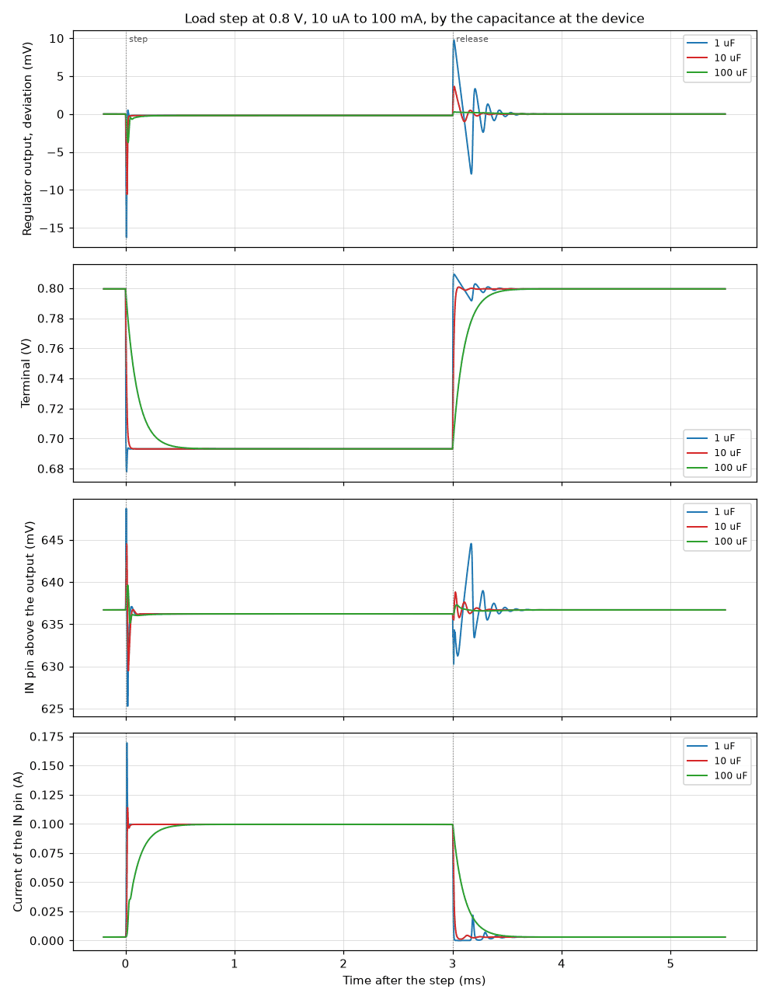

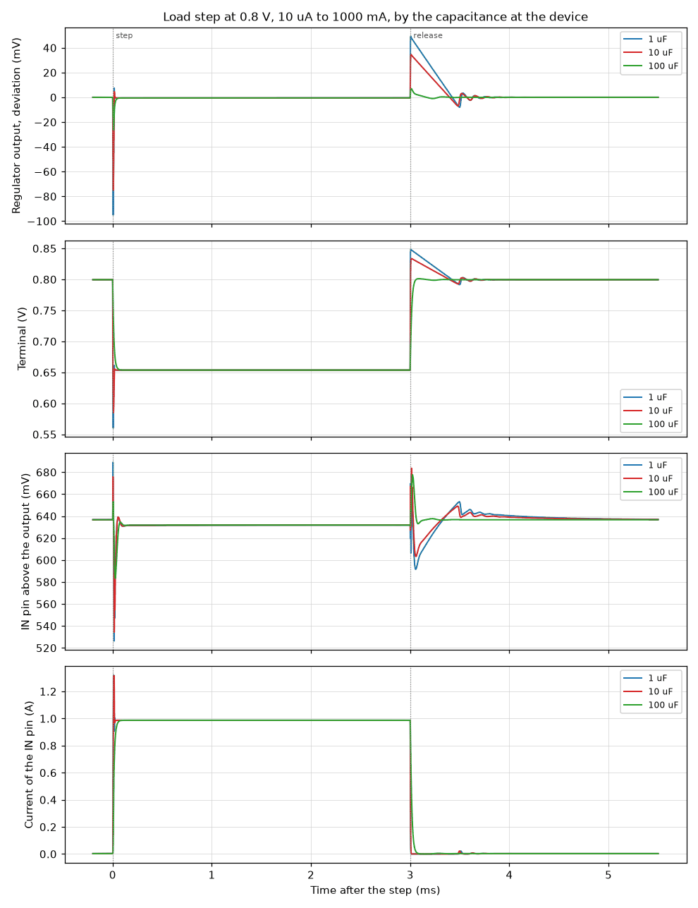

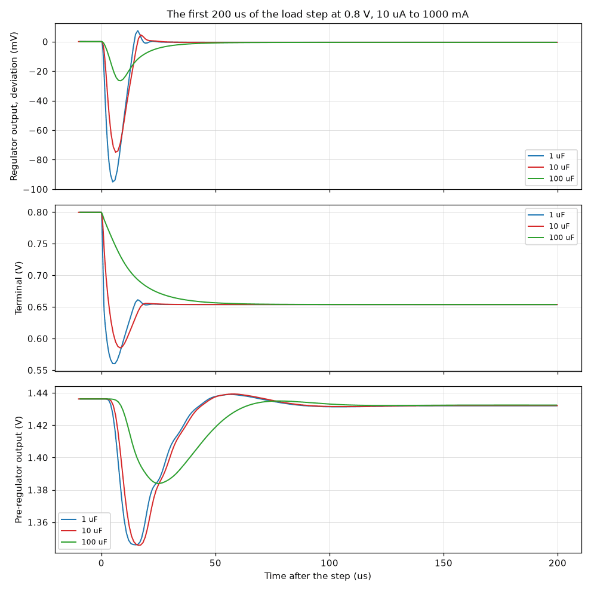

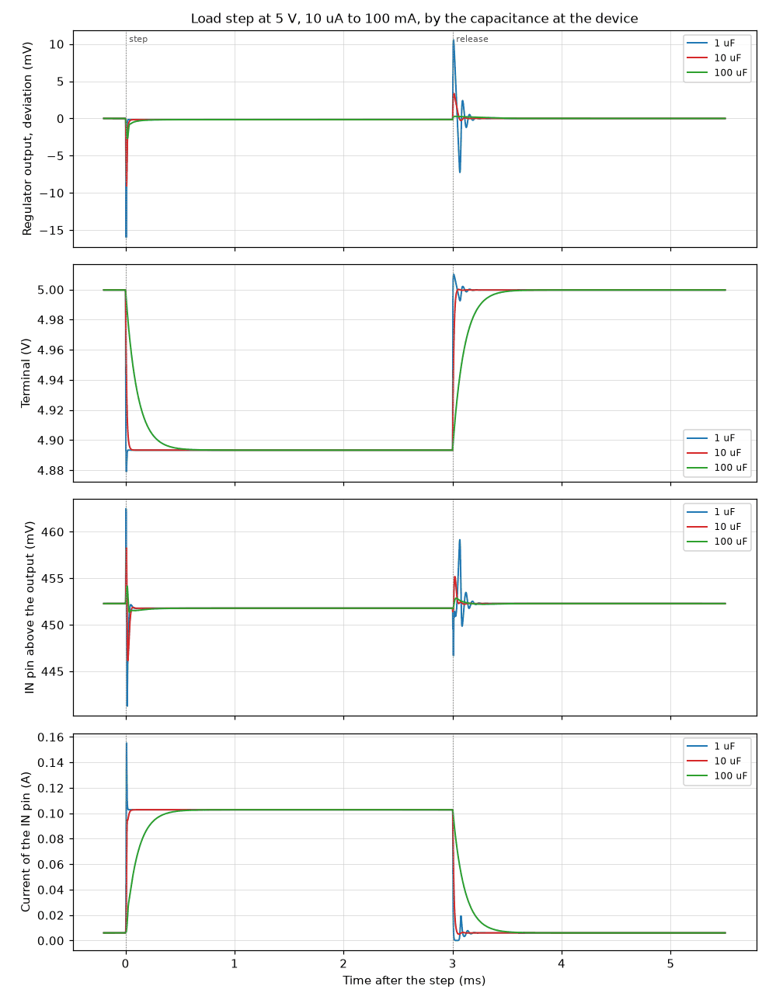

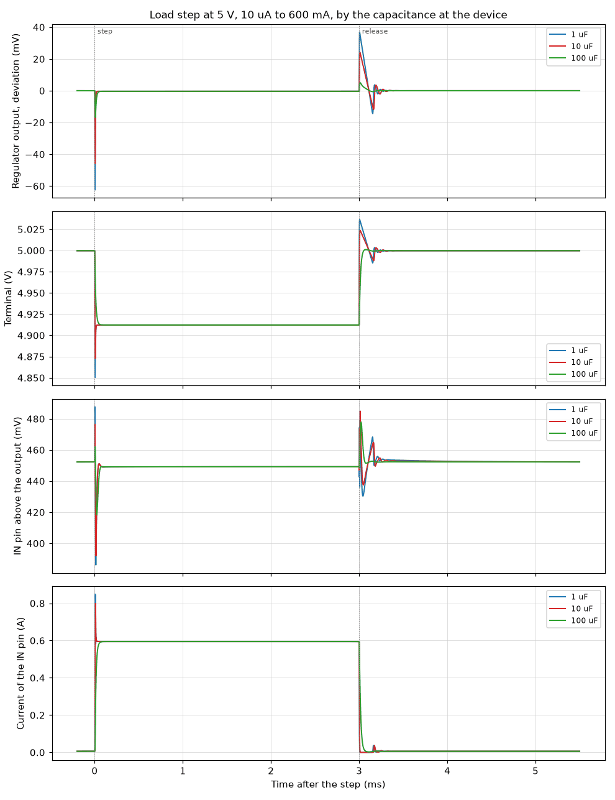

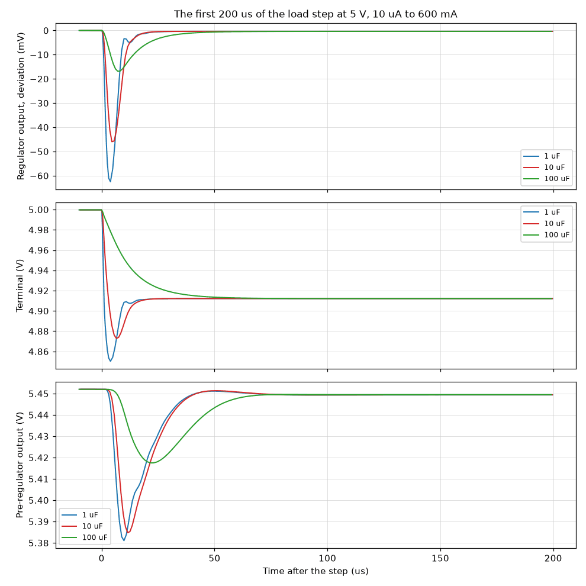

Notes:

- The specification states no limit for the droop of the source at a load step;
  those figures carry none. The two limits are the rating of the IN pin and the
  overload time of rule F-32.
- The path to the device is three resistors for one range: range 2 for the steps
  to 100 mA, range 3 for the steps to the curve. The range logic, which starts
  such a step in a lower range and jumps, belongs to another block; here the
  path does not change.
- The regulator is the model fitted to the load steps of its datasheet. It dips
  less than the datasheet for a step of 1 A and more for a step of 200 mA with
  10 uF; the droop figures carry that error, about 30 % either way.
- After the release the regulator cannot take current back: the output stays
  above its value until the minimum load has emptied the capacitors, some tenths
  of a millisecond, and then rings for a few periods near 10 kHz. That ringing
  follows from the low phase margin of the model at light load, which is an
  extrapolation and not a datasheet value.
- The margin during a step is not a figure of the specification: its table of
  the curve is static. The last figures show how much of that static margin the
  dip of the pre-regulator takes for some tens of microseconds, with the
  regulator at the guaranteed dropout and the feedback reference of the
  converter at its lower limit.
- The converter is the averaged model with a loop fitted to the model of its
  manufacturer: the dip of the pre-regulator is the answer of that loop, without
  switching ripple. The capacitor at the device is a ceramic part with 5 mohm.

Models. written here: BAV199, BLM31SN500, LT3080, MCP4921, OPA197, OPA365,
SOURCE_METER_1N5819HW, SOURCE_METER_BSS138, TPS63020_AVG, XFL4020_152.

Decks: [load-step.0p8v-1000ma-10uf.cir](load-step.0p8v-1000ma-10uf.cir),
[load-step.5v-600ma-10uf.cir](load-step.5v-600ma-10uf.cir).

## `source_meter/loop`

**Loop gain and phase margin: linear regulator, pre-regulator, tracking
amplifier.**

Each loop is measured closed, with a source inside the model or at the output
pin. The source is first powered up into a state and brought to rest; the
operating point of the small-signal run starts from the end of that run. The
loop of the linear regulator is read at its sense input with the output network
of the netlist: C53 and C54, the capacitors of the supply node, the path to the
device and the capacitor beside it. The loop of the pre-regulator is read at its
feedback pin, with the difference amplifier in the path. The loop of the
amplifier U19 is read by a double injection at its output, with and without C52.
With the model of the manufacturer only the amplifier is measured.

Answers: section 4.2 (loop of the pre-regulator, C52), section 16 (open checks
of U16 and U18).

| Figure | Simulated | Vendor models | Specification | Limits | Verdict | Source |
| --- | --- | --- | --- | --- | --- | --- |
| Tracking amplifier U19 with C52: phase margin | 64.67 ° | 72.81 ° | 75 ° (-13.78 %) | at least 60 ° | pass | section 4.2: 73 to 77 degrees with the model of the manufacturer; the lower limit of 60 degrees is the one of this bench |
| Tracking amplifier U19 with C52: crossover | 9.99 MHz | 29.48 MHz | | | | |
| Tracking amplifier U19 without C52: phase margin | 3.797 ° | 7.297 ° | | | | |
| Regulator, 0.8 V, 10 uA, range 0, no capacitor at the device: phase margin | 17.31 ° | | | | | |
| Regulator, 0.8 V, 10 uA, range 0, no capacitor at the device: crossover | 10.13 kHz | | | | | |
| Regulator, 0.8 V, 10 uA, range 3, 100 uF at the device: phase margin | 29.14 ° | | | | | |
| Regulator, 0.8 V, 10 uA, range 3, 100 uF at the device: crossover | 4.851 kHz | | | | | |
| Regulator, 0.8 V, 100 mA, range 2, 10 uF at the device: phase margin | 55.98 ° | | | | | |
| Regulator, 0.8 V, 100 mA, range 2, 10 uF at the device: crossover | 53.99 kHz | | | | | |
| Regulator, 0.8 V, 100 mA, range 3, 100 uF at the device: phase margin | 77.55 ° | | | | | |
| Regulator, 0.8 V, 100 mA, range 3, 100 uF at the device: crossover | 37.42 kHz | | | | | |
| Regulator, 0.8 V, 1000 mA, range 3, 1 uF at the device: phase margin | 51.46 ° | | | | | |
| Regulator, 0.8 V, 1000 mA, range 3, 1 uF at the device: crossover | 120.6 kHz | | | | | |
| Regulator, 0.8 V, 1000 mA, range 3, 100 uF at the device: phase margin | 70.88 ° | | | | | |
| Regulator, 0.8 V, 1000 mA, range 3, 100 uF at the device: crossover | 106.5 kHz | | | | | |
| Regulator, 5 V, 10 uA, range 0, no capacitor at the device: phase margin | 27.04 ° | | | | | |
| Regulator, 5 V, 10 uA, range 0, no capacitor at the device: crossover | 18.1 kHz | | | | | |
| Regulator, 5 V, 10 uA, range 3, 100 uF at the device: phase margin | 41.46 ° | | | | | |
| Regulator, 5 V, 10 uA, range 3, 100 uF at the device: crossover | 7.389 kHz | | | | | |
| Regulator, 5 V, 100 mA, range 2, 10 uF at the device: phase margin | 59.77 ° | | | | | |
| Regulator, 5 V, 100 mA, range 2, 10 uF at the device: crossover | 73.81 kHz | | | | | |
| Regulator, 5 V, 100 mA, range 3, 100 uF at the device: phase margin | 86.53 ° | | | | | |
| Regulator, 5 V, 100 mA, range 3, 100 uF at the device: crossover | 45.42 kHz | | | | | |
| Regulator, 5 V, 600 mA, range 3, 1 uF at the device: phase margin | 51.29 ° | | | | | |
| Regulator, 5 V, 600 mA, range 3, 1 uF at the device: crossover | 139.7 kHz | | | | | |
| Regulator, 5 V, 600 mA, range 3, 100 uF at the device: phase margin | 76.67 ° | | | | | |
| Regulator, 5 V, 600 mA, range 3, 100 uF at the device: crossover | 116.5 kHz | | | | | |
| Regulator, 0.8 V, 10 uA, range 0, no capacitor at the device, error amplifier of the model 0.5 times as fast: phase margin | 25.24 ° | | | | | |
| Regulator, 0.8 V, 10 uA, range 0, no capacitor at the device, error amplifier of the model 2 times as fast: phase margin | 11.28 ° | | | | | |
| Pre-regulator, 0.8 V, 10 uA, range 0, no capacitor at the device: phase margin | 58.18 ° | | 55 ° (+5.79 %) | at least 55 ° | pass | section 4.2: 55 degrees or more, from a behavioral model whose compensation is an assumption |
| Pre-regulator, 0.8 V, 10 uA, range 0, no capacitor at the device: crossover | 19.42 kHz | | | | | |
| Pre-regulator, 0.8 V, 1000 mA, range 3, 10 uF at the device: phase margin | 58.18 ° | | 55 ° (+5.79 %) | at least 55 ° | pass | section 4.2: 55 degrees or more, from a behavioral model whose compensation is an assumption |
| Pre-regulator, 0.8 V, 1000 mA, range 3, 10 uF at the device: crossover | 19.42 kHz | | | | | |
| Pre-regulator, 3.3 V, 830 mA, range 3, 10 uF at the device: phase margin | 60.96 ° | | 55 ° (+10.83 %) | at least 55 ° | pass | section 4.2: 55 degrees or more, from a behavioral model whose compensation is an assumption |
| Pre-regulator, 3.3 V, 830 mA, range 3, 10 uF at the device: crossover | 24.32 kHz | | | | | |
| Pre-regulator, 5 V, 10 uA, range 0, no capacitor at the device: phase margin | 62.71 ° | | 55 ° (+14.01 %) | at least 55 ° | pass | section 4.2: 55 degrees or more, from a behavioral model whose compensation is an assumption |
| Pre-regulator, 5 V, 10 uA, range 0, no capacitor at the device: crossover | 27.72 kHz | | | | | |
| Pre-regulator, 5 V, 600 mA, range 3, 10 uF at the device: phase margin | 61.02 ° | | 55 ° (+10.94 %) | at least 55 ° | pass | section 4.2: 55 degrees or more, from a behavioral model whose compensation is an assumption |
| Pre-regulator, 5 V, 600 mA, range 3, 10 uF at the device: crossover | 26.95 kHz | | | | | |

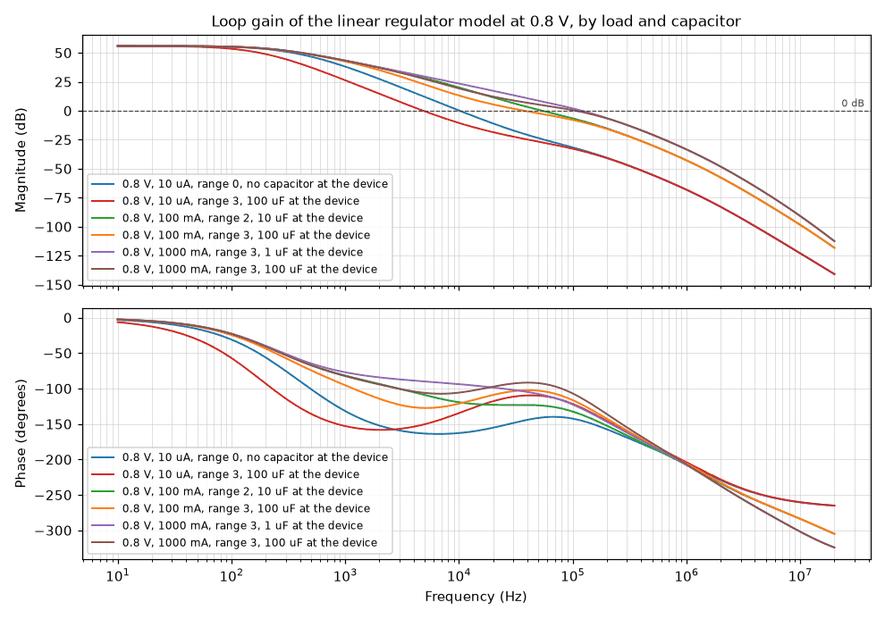

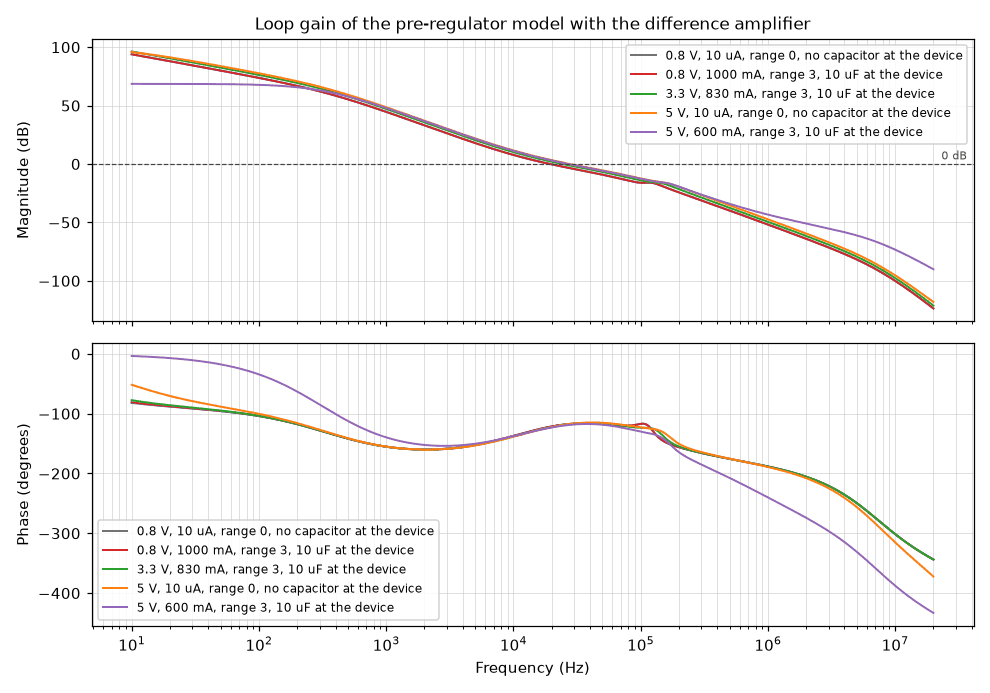

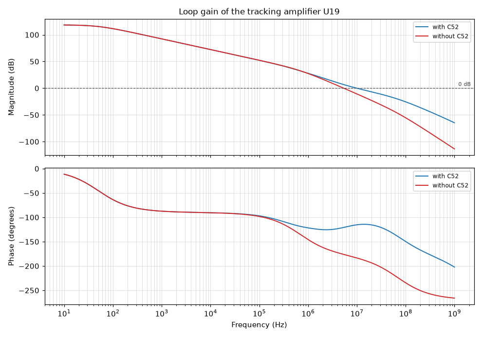

Notes:

- The loop of the regulator model is a fit to three load steps and one response
  curve of the datasheet, which shows no loop gain, no load below 50 mA and no
  capacitor above 10 uF. Its phase margin carries no limit here: at idle, where
  only the minimum load R69 flows, it is an extrapolation. The two runs with a
  slower and a faster error amplifier show how far the figure moves with one
  assumption of the model.
- The loop of the pre-regulator model is fitted to a load step of the transient
  model of the manufacturer in the application circuit of the datasheet; its
  current loop of 100 kHz is an assumption. The model is averaged: it holds no
  effect of the switching frequency on the phase. The specification names a risk
  prototype for this loop, and this bench does not replace it.
- The regulator loop is measured at the sense input inside the model and the
  pre-regulator loop at its feedback pin; both points take no current, so one
  injection is exact there. The amplifier loop is a double injection at its
  output pin.
- The path to the device is three resistors for one range; the capacitor beside
  the device is a ceramic part with 5 mohm. The capacitors of the netlist have
  the capacitance of their bias curve at the state of each run.

Models. written here: BAV199, BLM31SN500, LT3080, MCP4921, OPA197, OPA365,
SOURCE_METER_1N5819HW, SOURCE_METER_BSS138, SOURCE_METER_OPA365_PROBE,
TPS63020_AVG, XFL4020_152.

Decks: [loop.amplifier-series-c52.cir](loop.amplifier-series-c52.cir),
[loop.converter-5v-600ma-r3-10uf.cir](loop.converter-5v-600ma-r3-10uf.cir),
[loop.loop-0p8v-idle-r0-0uf.cir](loop.loop-0p8v-idle-r0-0uf.cir).

## `source_meter/noise`

**Noise of the source across the 1 kohm shunt of range 0.**

The source stands at rest in range 0 and its noise is read as the chain reads
it. The noise voltage between the supply node and the node after the shunts is
the noise that the 1 kohm of range 0 turns into current. Its density is weighted
with the filter in front of the converter, two poles at 40 kHz, and summed; the
mean of 100 samples adds its own weight. The run is made at 5.0 V with the
output open, with 100 nF and with 1 uF at the terminal, and at 0.8 V. A second
noise run gives the density at the regulator output itself.

Answers: requirement R-04, sections 4.2 and 4.10 (noise in source mode),
decision D-59.

| Figure | Simulated | Vendor models | Specification | Limits | Verdict | Source |
| --- | --- | --- | --- | --- | --- | --- |
| 5 V, output open: noise current in range 0 behind the filter of the converter | 30.87 nA | 30.87 nA | 26.5 nA (+16.49 %) | at most 40 nA | pass | requirement R-04: 40 nA at the most in source mode; section 4.2: 26 nA to 27 nA simulated |
| 5 V, output open: noise of the mean of 100 samples | 942 pA | 942 pA | 1.1 nA (-14.37 %) | at most 5 nA | pass | section 11: 5 nA for the mean of 100 samples; section 4.10: 1.1 nA with the output open, up to 3.9 nA with a device |
| 5 V, 0.1 uF at the terminal: noise current in range 0 behind the filter of the converter | 31.26 nA | 31.26 nA | 26.5 nA (+17.96 %) | at most 40 nA | pass | requirement R-04: 40 nA at the most in source mode; section 4.2: 26 nA to 27 nA simulated |
| 5 V, 0.1 uF at the terminal: noise of the mean of 100 samples | 1.3 nA | 1.3 nA | | at most 5 nA | pass | section 11: 5 nA for the mean of 100 samples; section 4.10: 1.1 nA with the output open, up to 3.9 nA with a device |
| 5 V, 1 uF at the terminal: noise current in range 0 behind the filter of the converter | 31.54 nA | 31.54 nA | 26.5 nA (+19.04 %) | at most 40 nA | pass | requirement R-04: 40 nA at the most in source mode; section 4.2: 26 nA to 27 nA simulated |
| 5 V, 1 uF at the terminal: noise of the mean of 100 samples | 2.328 nA | 2.328 nA | | at most 5 nA | pass | section 11: 5 nA for the mean of 100 samples; section 4.10: 1.1 nA with the output open, up to 3.9 nA with a device |
| 0.8 V, output open: noise current in range 0 behind the filter of the converter | 28.32 nA | 28.32 nA | 26.5 nA (+6.85 %) | at most 40 nA | pass | requirement R-04: 40 nA at the most in source mode; section 4.2: 26 nA to 27 nA simulated |
| 0.8 V, output open: noise of the mean of 100 samples | 1.074 nA | 1.074 nA | 1.1 nA (-2.39 %) | at most 5 nA | pass | section 11: 5 nA for the mean of 100 samples; section 4.10: 1.1 nA with the output open, up to 3.9 nA with a device |
| Noise density at the regulator output at 10 kHz, 5.0 V | 176.2 nV/√Hz | 176.2 nV/√Hz | 125 nV/√Hz (+40.93 %) | | | section 4.10: 125 nV/rtHz, a typical datasheet figure without a maximum |
| Noise at the regulator output from 10 Hz to 100 kHz, 5.0 V | 32.22 µV | 32.22 µV | 40 µV (-19.44 %) | | | LT3080 Rev. E, page 4: 40 uV RMS with 10 uF and 1.1 A |

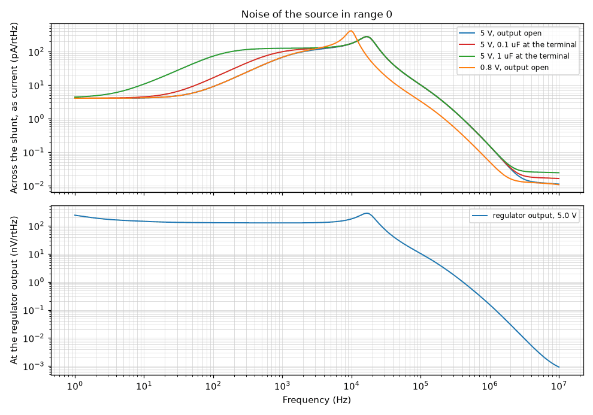

Notes:

- The noise of the regulator is the 125 nV/rtHz of its datasheet, flat, as the
  model holds it: a typical figure without a maximum, and without the 1/f part.
  Below the loop bandwidth it stands at the output unchanged; near the crossover
  the loop of the model raises it, and that part rests on the fitted loop.
- The DAC and the reference are sources without noise here: the datasheet of the
  DAC states none, and the reference belongs to another block. The buffer U17
  and every resistor of the netlist carry their noise.
- The shunt of range 0 is the 1 kohm resistor that stands for it, with its own
  thermal noise, which the chain reads in either mode. The amplifier chain and
  the converter are not in this circuit: only their filter is, as a weight of
  two poles at 40 kHz with Q = 0.74 (section 4.5).
- The regulator carries only its minimum load in these runs. A behavioral source
  makes no noise, so the pre-regulator adds none: its switching ripple is not in
  the averaged model at all.

Models. written here: BAV199, BLM31SN500, LT3080, MCP4921, OPA197, OPA365,
SOURCE_METER_1N5819HW, SOURCE_METER_BSS138, TPS63020_AVG, XFL4020_152.

Decks: [noise.shunt-5v-0nf.cir](noise.shunt-5v-0nf.cir).

## `source_meter/pre-regulator`

**The pre-regulator with its tracking amplifier: start and a load step to the
curve.**

The converter runs with its real feedback path and answers a load step to the
curve. The circuit is the converter with its inductor and capacitors, the
difference amplifier U19 with its network and the filter toward the regulator.
The regulator itself is replaced: a source holds its output, so that the target
of the converter stands still, and a current sink at the IN pin steps from 10 mA
to the current of the curve and back. Four states are run: 0.8 V with a step to
1 A, from capacitors that stand at 0.8 V as they do when rule F-28 raises
SMU_ON; 3.3 V with a step to 0.83 A, from empty capacitors; 4.5 V with a step to
0.67 A, where the converter has to deliver the voltage of its own input; and 5.0
V with a step to 0.6 A, where it has to deliver more. Each run gives the dip at
the IN pin against the dropout need and how the loop comes to rest, the first
two the start as well. The runs are short enough for the transient model of the
manufacturer, which the vendor tier puts in the place of the averaged model: its
ripple and its loop are then those that Texas Instruments published.

Answers: section 4.2 (loop of the pre-regulator), rule F-28, section 16 (open
check of U16).

| Figure | Simulated | Vendor models | Specification | Limits | Verdict | Source |
| --- | --- | --- | --- | --- | --- | --- |
| 0.8 V: pre-regulator output before the step | 1.436 V | 1.438 V | 1.437 V (-0.04 %) | 1.407 V to 1.467 V | pass | section 4.2: 0.672 V + 0.956 x 0.8 V; the band is the feedback reference of 495 mV to 505 mV |
| 0.8 V: feedback pin before the step | 500 mV | 500.2 mV | 500 mV (+0.00 %) | 495 mV to 505 mV | pass | SLVS916I, page 6 |
| 0.8 V, step of 10 mA to 1 A: lowest voltage of the IN pin below its value before | 108.6 mV | 137.9 mV | | | | |
| 0.8 V, step of 10 mA to 1 A: lowest voltage of the IN pin above the regulator output | 527.7 mV | 499.8 mV | | at least 470 mV | pass | section 4.2: dropout need of 470 mV at 1 A, 170 mV + 0.300 ohm x I |
| 0.8 V: fall of the IN pin from 10 mA to 1 A, at rest | 4.725 mV | 9.49 mV | | | | |
| 0.8 V: highest voltage of the IN pin above its loaded value after the dip (mean of 10 us) | 5.665 mV | 37.97 mV | | | | |
| 0.8 V: that overshoot as a share of the dip below the loaded value (means of 10 us) | 7.986 % | 31.25 % | | | | |
| 0.8 V, release of the step: highest voltage of the IN pin above its value before | 103.9 mV | 119.7 mV | | | | |
| 0.8 V, release of the step: most power returned to the 5 V rail (mean of 10 us) | 224.7 mW | 140.8 mW | | | | |
| 0.8 V: ripple at the pre-regulator output at 10 mA, peak to peak | 26.85 µV | 604.3 µV | | | | |
| 0.8 V: ripple at the IN pin at 10 mA, peak to peak | 26.85 µV | 454.5 µV | | | | |
| 0.8 V, start: 90 % of the target after the enable | 112.8 µs | 81.06 µs | | | | |
| 0.8 V, start: highest pre-regulator output above its target | 56.87 mV | 210.6 mV | | | | |
| 0.8 V, start: highest current of the 5 V rail (mean of 10 us) | 701.2 mA | 651.7 mA | | | | |
| 0.8 V, start on capacitors at 0.8 V: most power returned to the 5 V rail (mean of 10 us) | 167.9 mW | 152.2 mW | | at most 250 mW | pass | section 4.2 and section 16: less than the instrument takes from the rail in source mode without load, for which 0.25 W is the condition |
| 0.8 V, start on capacitors at 0.8 V: charge returned to the 5 V rail | 649.7 nC | 5.26 µC | | | | |
| 0.8 V, start on capacitors at 0.8 V: lowest pre-regulator output after the enable | 798.4 mV | 794.5 mV | | | | |
| 0.8 V, start on capacitors at 0.8 V: highest pre-regulator output above its target after the enable | 56.87 mV | 210.6 mV | | | | |
| 3.3 V: pre-regulator output before the step | 3.825 V | 3.825 V | 3.827 V (-0.05 %) | 3.797 V to 3.857 V | pass | section 4.2: 0.672 V + 0.956 x 3.3 V; the band is the feedback reference of 495 mV to 505 mV |
| 3.3 V: feedback pin before the step | 500 mV | 500.1 mV | 500 mV (+0.00 %) | 495 mV to 505 mV | pass | SLVS916I, page 6 |
| 3.3 V, step of 10 mA to 0.83 A: lowest voltage of the IN pin below its value before | 103.1 mV | 103 mV | | | | |
| 3.3 V, step of 10 mA to 0.83 A: lowest voltage of the IN pin above the regulator output | 421.7 mV | 422.3 mV | | at least 419 mV | pass | section 4.2: dropout need of 419 mV at 0.83 A, 170 mV + 0.300 ohm x I |
| 3.3 V: fall of the IN pin from 10 mA to 0.83 A, at rest | 3.19 mV | 2.782 mV | | | | |
| 3.3 V: highest voltage of the IN pin above its loaded value after the dip (mean of 10 us) | 2.328 mV | 5.406 mV | | | | |
| 3.3 V: that overshoot as a share of the dip below the loaded value (means of 10 us) | 3.681 % | 9.172 % | | | | |
| 3.3 V, release of the step: highest voltage of the IN pin above its value before | 100.1 mV | 100.5 mV | | | | |
| 3.3 V, release of the step: most power returned to the 5 V rail (mean of 10 us) | 532.3 mW | 146.4 mW | | | | |
| 3.3 V: ripple at the pre-regulator output at 10 mA, peak to peak | 158.9 µV | 592 µV | | | | |
| 3.3 V: ripple at the IN pin at 10 mA, peak to peak | 158.9 µV | 400.2 µV | | | | |
| 3.3 V, start: 90 % of the target after the enable | 158 µs | 182.8 µs | | | | |
| 3.3 V, start: highest pre-regulator output above its target | 40.18 mV | 135.6 mV | | | | |
| 3.3 V, start: highest current of the 5 V rail (mean of 10 us) | 2.08 A | 1.9 A | | | | |
| 4.5 V: pre-regulator output before the step | 4.973 V | 4.975 V | 4.974 V (-0.02 %) | 4.944 V to 5.004 V | pass | section 4.2: 0.672 V + 0.956 x 4.5 V; the band is the feedback reference of 495 mV to 505 mV |
| 4.5 V: feedback pin before the step | 500 mV | 500.1 mV | 500 mV (+0.00 %) | 495 mV to 505 mV | pass | SLVS916I, page 6 |
| 4.5 V, step of 10 mA to 0.67 A: lowest voltage of the IN pin below its value before | 89.29 mV | 89.5 mV | | | | |
| 4.5 V, step of 10 mA to 0.67 A: lowest voltage of the IN pin above the regulator output | 383.8 mV | 385.4 mV | | at least 371 mV | pass | section 4.2: dropout need of 371 mV at 0.67 A, 170 mV + 0.300 ohm x I |
| 4.5 V: fall of the IN pin from 10 mA to 0.67 A, at rest | 2.832 mV | 2.632 mV | | | | |
| 4.5 V: highest voltage of the IN pin above its loaded value after the dip (mean of 10 us) | 1.081 mV | 2.182 mV | | | | |
| 4.5 V: that overshoot as a share of the dip below the loaded value (means of 10 us) | 2.054 % | 4.926 % | | | | |
| 4.5 V, release of the step: highest voltage of the IN pin above its value before | 86.57 mV | 86.83 mV | | | | |
| 4.5 V, release of the step: most power returned to the 5 V rail (mean of 10 us) | 508.1 mW | 4.762 mW | | | | |
| 4.5 V: ripple at the pre-regulator output at 10 mA, peak to peak | 82.37 µV | 945.5 µV | | | | |
| 4.5 V: ripple at the IN pin at 10 mA, peak to peak | 82.37 µV | 748.5 µV | | | | |
| 4.5 V, start on capacitors at 4.97 V, the state that rule F-28 forbids: most power returned to the 5 V rail (mean of 10 us) | 3.197 W | 28.59 mW | | | | |
| 4.5 V, start on capacitors at 4.97 V: charge returned to the 5 V rail | 76.39 µC | 516.7 nC | | | | |
| 4.5 V, start on capacitors at 4.97 V: lowest pre-regulator output after the enable | 3.223 V | 4.953 V | | | | |
| 4.5 V, start on capacitors at 4.97 V: highest pre-regulator output above its target after the enable | 25.34 mV | 103.8 mV | | | | |
| 5 V: pre-regulator output before the step | 5.451 V | 5.453 V | 5.452 V (-0.02 %) | 5.422 V to 5.482 V | pass | section 4.2: 0.672 V + 0.956 x 5 V; the band is the feedback reference of 495 mV to 505 mV |
| 5 V: feedback pin before the step | 500 mV | 500.1 mV | 500 mV (+0.00 %) | 495 mV to 505 mV | pass | SLVS916I, page 6 |
| 5 V, step of 10 mA to 0.6 A: lowest voltage of the IN pin below its value before | 82.24 mV | 82.46 mV | | | | |
| 5 V, step of 10 mA to 0.6 A: lowest voltage of the IN pin above the regulator output | 368.7 mV | 370.5 mV | | at least 350 mV | pass | section 4.2: dropout need of 350 mV at 0.6 A, 170 mV + 0.300 ohm x I |
| 5 V: fall of the IN pin from 10 mA to 0.6 A, at rest | 2.559 mV | 2.371 mV | | | | |
| 5 V: highest voltage of the IN pin above its loaded value after the dip (mean of 10 us) | 1.067 mV | 1.716 mV | | | | |
| 5 V: that overshoot as a share of the dip below the loaded value (means of 10 us) | 2.113 % | 4.308 % | | | | |
| 5 V, release of the step: highest voltage of the IN pin above its value before | 79.82 mV | 79.94 mV | | | | |
| 5 V, release of the step: most power returned to the 5 V rail (mean of 10 us) | 462.6 mW | -2.391 mW | | | | |
| 5 V: ripple at the pre-regulator output at 10 mA, peak to peak | 100.6 µV | 668.7 µV | | | | |
| 5 V: ripple at the IN pin at 10 mA, peak to peak | 100.6 µV | 372.6 µV | | | | |
| 5 V, start on capacitors at 5.45 V, the state that rule F-28 forbids: most power returned to the 5 V rail (mean of 10 us) | 3.547 W | 9.444 mW | | | | |
| 5 V, start on capacitors at 5.45 V: charge returned to the 5 V rail | 87.61 µC | 137.9 nC | | | | |
| 5 V, start on capacitors at 5.45 V: lowest pre-regulator output after the enable | 3.478 V | 5.429 V | | | | |
| 5 V, start on capacitors at 5.45 V: highest pre-regulator output above its target after the enable | 21.18 mV | 113.7 mV | | | | |

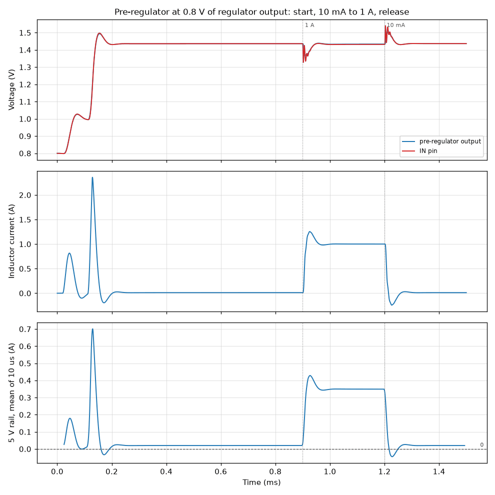

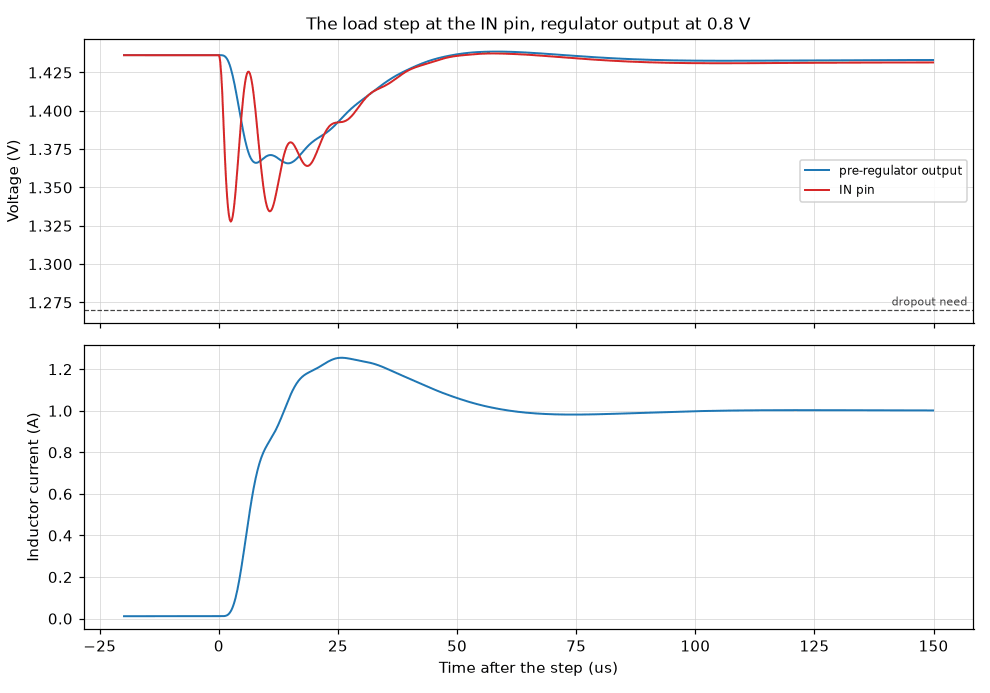

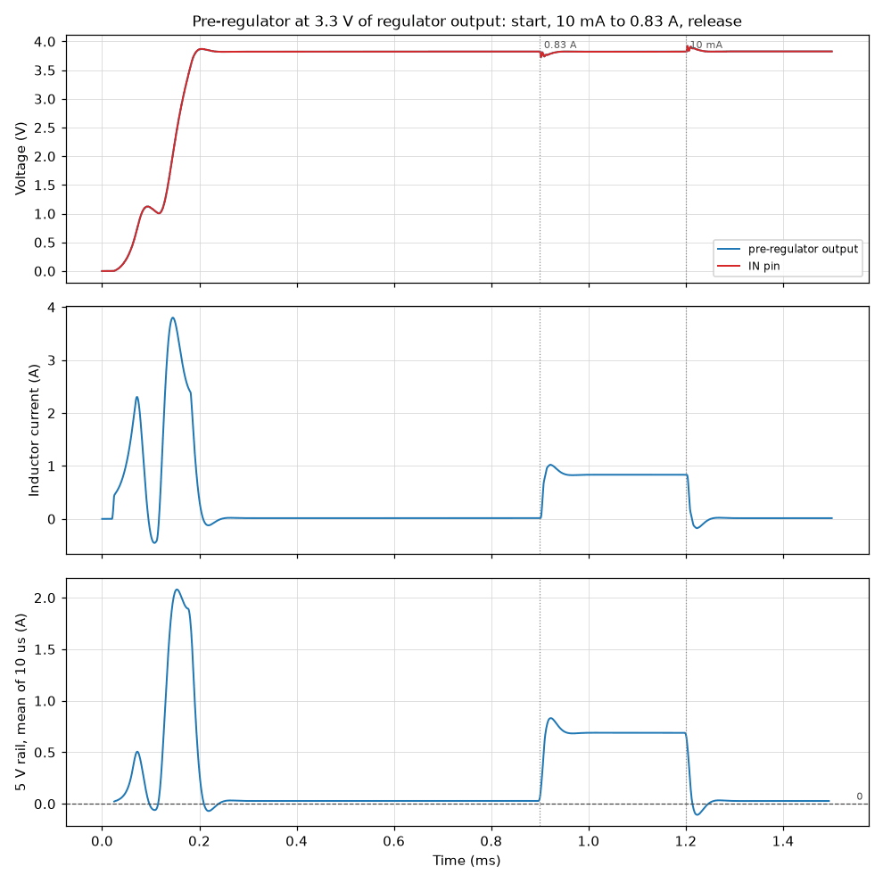

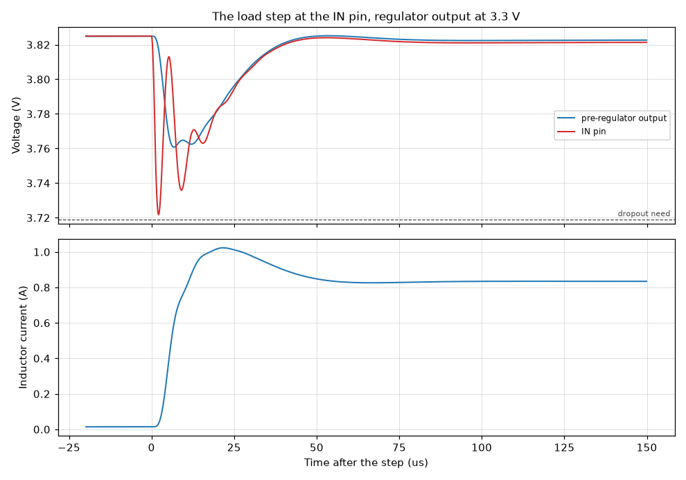

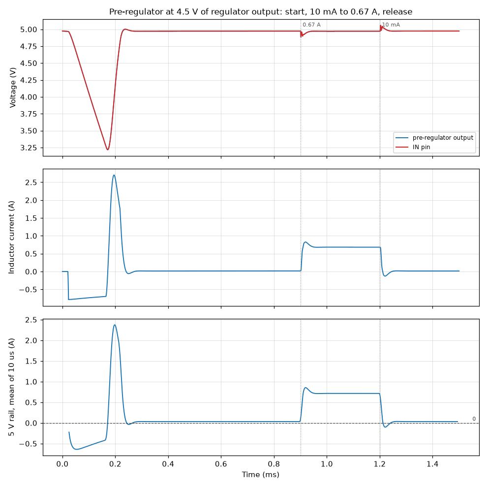

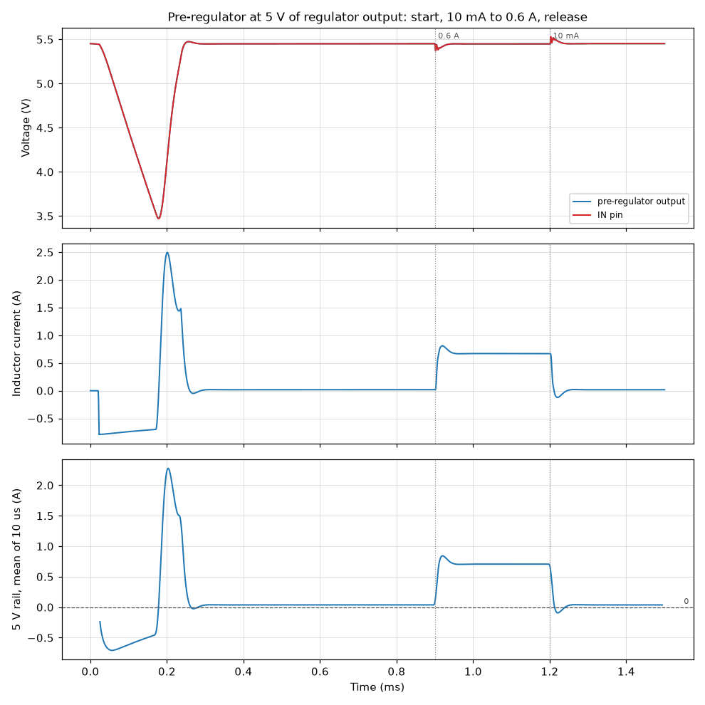

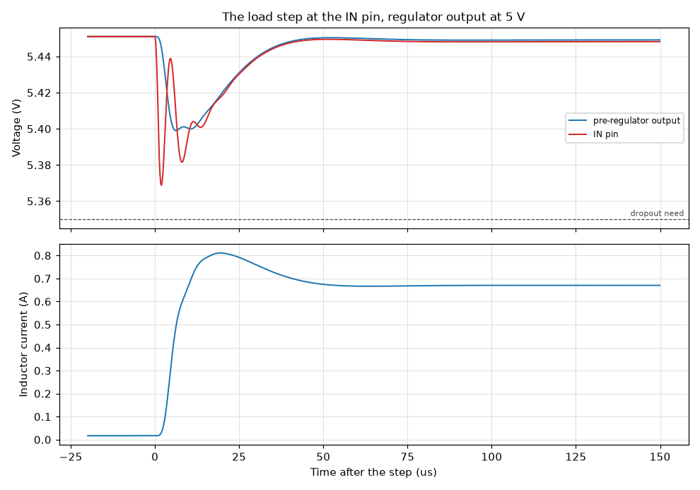

Notes:

- The regulator is not in this circuit: its output is a source and its IN pin a
  current sink, so the pre-regulator is alone with its own loop. The rails and
  the reference are ideal sources that stand from the first microseconds; the
  enable pin is driven directly.
- In the open tier the converter is the averaged model: it shows no ripple, and
  its loop is fitted to a load step of the model of the manufacturer in the
  application circuit of the datasheet. In the vendor tier the converter is that
  transient model itself, with the feedback path of this board.
- The two models agree at 3.3 V, 4.5 V and 5.0 V: dips of 103 mV, 89 mV and 82
  mV in both, and a recovery that overshoots by 1 mV to 5 mV, less than a tenth
  of the dip. At 0.8 V they do not: the transient model dips by 138 mV where the
  averaged model has 109 mV, its recovery overshoots by 38 mV, a third of the
  dip, where the averaged model has 6 mV, and it falls twice as far at rest for
  1 A. A recovery that overshoots by a third of the dip is that of a loop with
  about 40 degrees of phase margin, if the loop is taken as a second-order
  system; the averaged model has 58 degrees there. The start of the transient
  model overshoots by 0.14 V at 3.3 V and by 0.21 V at 0.8 V, that of the
  averaged model by 0.04 V and 0.06 V.
- The capacitors have the capacitance of their bias curve and no series
  resistance or inductance; the ripple figures of the vendor tier are therefore
  those of ideal capacitors behind an ideal bead of 0.2 uH (assumption).
- The step takes 1 us at the IN pin. On the board the regulator stands between
  the device and this pin, and its output capacitor carries the first
  microseconds of a load step, so the step here is faster than the one the
  pre-regulator sees. The dropout need is the straight line of section 4.2
  between the two guaranteed points; the head room of this run is the nominal
  one, with no tolerance taken off.
- At 0.8 V the capacitors of the pre-regulator start at 0.8 V: the regulator
  holds them near its output while the converter is off (0.81 V in the bench of
  the sequence, 0.15 V to 0.18 V less in section 4.2). The current of the 5 V
  rail is the mean over 10 us of the current of an ideal source, read from the
  enable on: before it the rail rises in 5 us and charges the input capacitors.
- At 4.5 V and at 5.0 V the capacitors start at the target of the converter: the
  state that rule F-28 forbids, run here to see what the rule guards against.
  The two models answer it in opposite ways. The averaged model starts its duty
  cycle from zero and takes the capacitors down by 2 V with its negative current
  limit of 0.7 A (TI SLVA726), which returns more than 3 W to the 5 V rail for
  0.15 ms. The transient model of the manufacturer leaves them charged, lifts
  them by 0.11 V and returns nothing. The datasheet does not say which the part
  does; rule F-28 is safe in both cases.
- The averaged model passes from step-down to step-up operation without a seam,
  so at 4.5 V, where the converter has to deliver the voltage of its own input,
  only the vendor tier shows what it does at that border: the ripple at the IN
  pin is 0.75 mV there against 0.4 mV elsewhere, with ideal capacitors.

Models. written here: BAV199, BLM31SN500, OPA365, TPS63020_AVG, XFL4020_152.

Decks: [pre-regulator.step-0p8v.cir](pre-regulator.step-0p8v.cir),
[pre-regulator.step-3p3v.cir](pre-regulator.step-3p3v.cir),
[pre-regulator.step-4p5v.cir](pre-regulator.step-4p5v.cir),
[pre-regulator.step-5v.cir](pre-regulator.step-5v.cir).

## `source_meter/rails`

**A missing or falling rail, the minimum load and the set-point filter in a
hold-off.**

The source is brought to rest with one rail absent, and then every rail falls.
Without -4 V_A the minimum load R69 ends on a rail at 0 V: runs with the typical
quiescent current of the regulator and with the two values that section 4.2
calculates with give the output at a set-point of 0.80 V. Without the boost
output the regulator has no control supply and R69 pulls its output below
ground, where D12 holds it. A run with 2 mA forced into the output stands for
the leakage of a hot D11. Two power-off runs let the 5 V rail and the boost
output fall within 1 ms and within 10 ms and show the VCONTROL pin against the
output. One run of the DAC with its filter alone shows what C41 holds during a
hold-off of the supervisor.

Answers: section 4.2 (clamps, minimum load, set-point filter), decision D-57,
rules F-3 and F-7.

| Figure | Simulated | Vendor models | Specification | Limits | Verdict | Source |
| --- | --- | --- | --- | --- | --- | --- |
| Current of the minimum load R69 at 0.80 V | 3.692 mA | 3.692 mA | 3.7 mA (-0.22 %) | 3.6 mA to 3.8 mA | pass | section 4.2: 3.7 mA at 0.8 V |
| Current of the minimum load R69 at 5.00 V | 6.923 mA | 6.923 mA | 6.9 mA (+0.33 %) | 6.8 mA to 7 mA | pass | section 4.2: 6.9 mA at 5.0 V |
| Without -4 V_A, typical regulator: output at a set-point of 0.80 V | 799.6 mV | 799.6 mV | 800 mV (-0.05 %) | 790 mV to 810 mV | pass | section 4.2: 0.8 V with a typical regulator |
| Without -4 V_A, quiescent current of 0.67 mA: output | 847.4 mV | 847.4 mV | 870 mV (-2.60 %) | 820 mV to 920 mV | pass | section 4.2: 0.87 V to 1.17 V at the limits |
| Without -4 V_A, quiescent current of 0.90 mA: output | 1.137 V | 1.137 V | 1.17 V (-2.85 %) | 1.12 V to 1.22 V | pass | section 4.2: 0.87 V to 1.17 V at the limits |
| Without the boost output, -4 V_A present: regulator output | -176.1 mV | -176.1 mV | -200 mV (+11.93 %) | -300 mV to 0 V | pass | section 4.2: D12 holds the output at about -0.2 V (estimate) |
| In that state: SET pin above the output | 633.3 mV | 633.3 mV | | | | |
| 2 mA into the output at 0.80 V: rise of the output | 42.25 µV | 42.25 µV | | at most 1 mV | pass | section 4.2: the minimum load absorbs the leakage of D11, up to 2 mA at 100 C; 1 mV is the limit of this bench |
| Largest movement of output and pre-regulator in the last 2 ms of these runs | 240.6 nV | 240.6 nV | | at most 100 µV | pass | limit of this bench: a run counts as at rest below 0.1 mV |
| Power-off in 1 ms: lowest voltage of VCONTROL above the output | 549 mV | 549 mV | 880 mV (-37.62 %) | at least -300 mV | pass | section 4.2: at least 0.88 V (simulated); the limit is the rating of the pin, 0.3 V below the output |
| Power-off in 1 ms: lowest voltage of the IN pin above the output | 439.9 mV | 439.9 mV | | at least -300 mV | pass | LT3080 Rev. E, page 2 (D-57) |
| Power-off in 1 ms: lowest regulator output | 175.8 mV | 175.8 mV | | at least -300 mV | pass | section 4.2: D12 holds the output at about -0.2 V; 0.3 V is the limit of this bench |
| Power-off in 10 ms: lowest voltage of VCONTROL above the output | 549 mV | 549 mV | 880 mV (-37.62 %) | at least -300 mV | pass | section 4.2: at least 0.88 V (simulated); the limit is the rating of the pin, 0.3 V below the output |
| Power-off in 10 ms: lowest voltage of the IN pin above the output | 440.3 mV | 440.3 mV | | at least -300 mV | pass | LT3080 Rev. E, page 2 (D-57) |
| Power-off in 10 ms: lowest regulator output | 176.2 mV | 176.2 mV | | at least -300 mV | pass | section 4.2: D12 holds the output at about -0.2 V; 0.3 V is the limit of this bench |
| Set-point filter 180 ms after the DAC lost its supply: share of the last value | 69.12 % | 69.12 % | 70 % (-1.25 %) | 67 % to 73 % | pass | section 4.2: C41 still holds 44 % to 70 % of the last value |
| Set-point filter 420 ms after the DAC lost its supply: share of the last value | 42.3 % | 42.3 % | 44 % (-3.86 %) | 41 % to 47 % | pass | section 4.2: C41 still holds 44 % to 70 % of the last value |

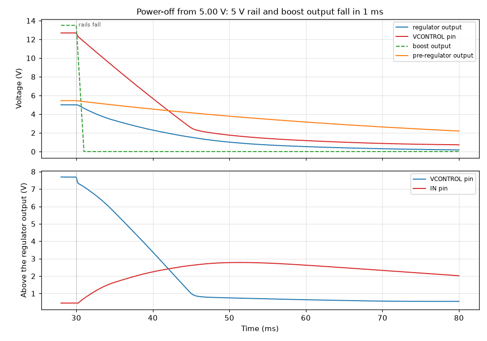

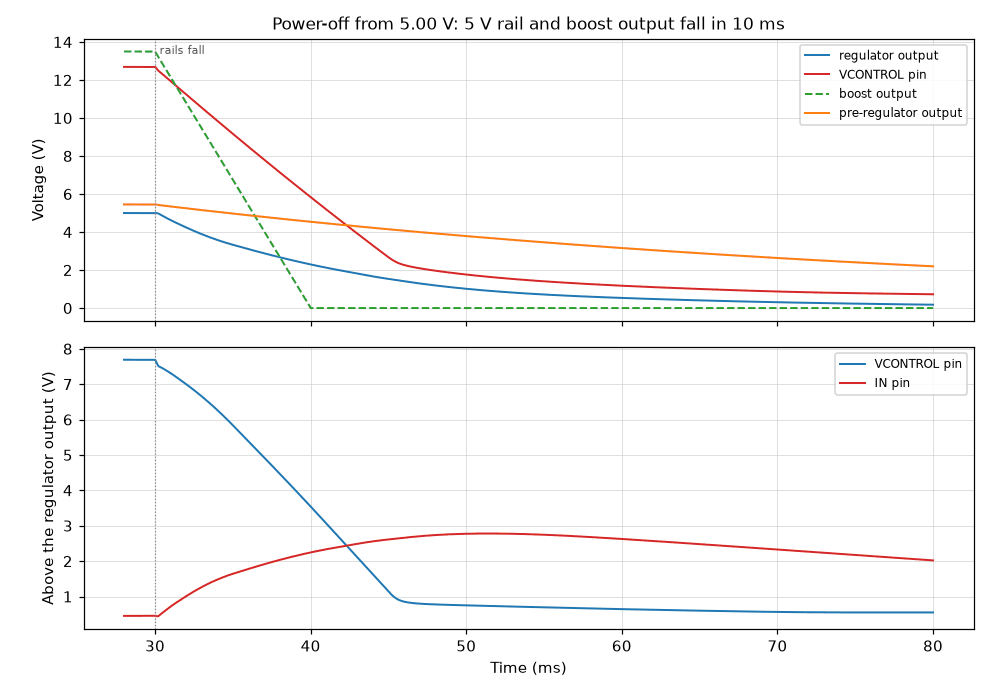

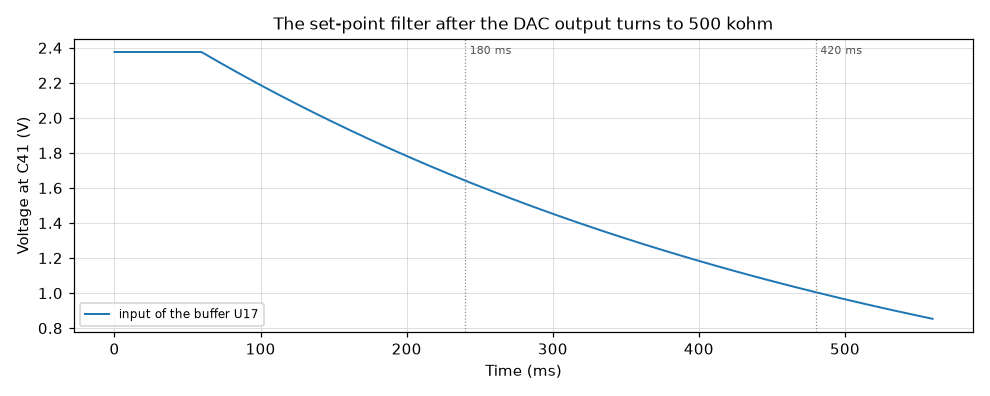

Notes:

- A missing rail is a source at 0 V: -4 V_A with its clamp D8 and the boost
  output with its loads belong to another block, and how far below 0 V or above
  it such a rail rests is not simulated here.
- The two quiescent currents of the regulator, 0.67 mA and 0.90 mA, are the
  values behind the 0.87 V and 1.17 V of section 4.2. The datasheet guarantees
  0.5 mA at 10 V and 1 mA at 25 V between the supply pins and the output.
- The diode model for D11 and D12 leaks 4 uA; the leakage of a hot D11 is a
  current source of 2 mA into the output here.
- The fall times of the rails at power-off are assumptions: the 5 V rail and the
  boost output together in 1 ms or in 10 ms, 3V3_A, -4 V_A and the reference in
  5 ms, +12 V_A in 14 ms (section 3 gives 14 ms for +12 V_A and 4 ms to 6 ms for
  3V3_A). The paths to the device are open and the output carries only its
  minimum load.
- At power-off the diode D10 blocks, and the capacitors of the VCONTROL pin can
  only empty into the output through the regulator. They stop doing so where the
  model ends its quiescent current, near 0.55 V between the two pins, and that
  is the lowest value read here: a property of the model, as the 0.88 V of
  section 4.2 is one of the model used there. What the run shows is the sign:
  VCONTROL follows the output down from above and does not cross it.
- The DAC without supply is its model after power-on, 500 kohm to ground
  (datasheet value for the state after a reset).

Models. written here: BAV199, BLM31SN500, LT3080, MCP4921, OPA197, OPA365,
SOURCE_METER_1N5819HW, SOURCE_METER_BSS138, TPS63020_AVG, XFL4020_152.

Decks: [rails.hold-off.cir](rails.hold-off.cir),
[rails.power-off-1ms.cir](rails.power-off-1ms.cir).

## `source_meter/sequence`

**Start and stop of the source in the order of rules F-28 and F-29, set-point
steps.**

The source runs through the start and the stop that firmware has to follow.
After the rails stand, the DAC takes the code of 0.80 V; 200 ms later SMU_ON
rises; 5 ms later the DAC takes the code of 5.00 V; after 80 ms and a wait the
source is stopped: SMU_ON falls and the DAC goes to zero. The paths to the
device are open throughout. The run shows the regulator alone on its control
supply, the start of the pre-regulator on its charged capacitors, the rise of
the output behind the set-point filter, and what the IN pin and the 5 V rail see
at the stop. Two more runs step the set-point from 5.00 V to 0.80 V at once,
without a device and with 100 uF at the device in range 3. A last run takes the
filter of the set-point out, so that the output is released and falls with its
minimum load alone.

Answers: section 4.2 (start and stop, clamps, bleeder, set-point filter), rules
F-28 to F-31.

| Figure | Simulated | Vendor models | Specification | Limits | Verdict | Source |
| --- | --- | --- | --- | --- | --- | --- |
| Idle, DAC at zero and SMU_ON low: regulator output | 17.28 mV | 17.28 mV | | | | |
| Regulator on its control supply alone, code of 0.80 V: output | 799.4 mV | 799.4 mV | 799.6 mV (-0.02 %) | 789.6 mV to 809.6 mV | pass | section 4.2: with the pre-regulator off the regulator follows the set-point; 10 mV is the limit of this bench |
| In that state: output above the IN pin | -6.419 mV | -6.419 mV | 165 mV (-103.89 %) | at most 300 mV | pass | section 4.2: D11 holds the IN pin 0.15 V to 0.18 V below the output; LT3080 Rev. E, page 2: not more than 0.3 V |
| In that state: pre-regulator output before SMU_ON rises | 805.8 mV | 805.8 mV | | at most 1.436 V | pass | rule F-28: the converter is never enabled on capacitors charged above its target, 1.437 V at 0.80 V |
| In that state: current of the VCONTROL pin | 4.519 mA | 4.519 mA | | at most 30 mA | pass | section 4.2: the regulator supplies only the milliamperes of its control path; LT3080 Rev. E, page 4: 30 mA at the most |
| Enable pin of the pre-regulator with SMU_ON high | 3.158 V | 3.158 V | | at least 1.2 V | pass | section 4.2: threshold of 1.2 V (datasheet value) |
| Most power returned to the 5 V rail in the 5 ms after SMU_ON rises | 68.97 mW | 68.97 mW | | at most 250 mW | pass | section 4.2 and section 16: less than the instrument takes from the rail in source mode without load, for which 0.25 W is the condition |
| Charge returned to the 5 V rail in the 5 ms after SMU_ON rises | 260.7 nC | 260.7 nC | | | | |
| Highest current of the 5 V rail in the 5 ms after SMU_ON rises | 485.1 mA | 485.1 mA | | | | |
| Movement of the regulator output in the 5 ms after SMU_ON rises | 6.661 mV | 6.661 mV | | | | |
| Pre-regulator output 5 ms after SMU_ON rises | 1.436 V | 1.436 V | 1.436 V (-0.01 %) | at least 1.2 V | pass | rule F-28: the pre-regulator is never asked for less than 1.2 V |
| Fastest rise of the output after the code of 5.00 V | 416.9 V/s | 416.9 V/s | 520 V/s (-19.84 %) | at most 600 V/s | pass | section 4.2: the set-point moves at 0.52 V/ms at most after a full-scale step; 0.6 V/ms is the limit of this bench |
| Largest lag of the output behind the SET drive during that rise | 42.31 mV | 42.31 mV | | | | |
| Lowest voltage of the IN pin above the output during that rise | 382.7 mV | 382.7 mV | | | | |
| Output below its final value 80 ms after the code of 5.00 V | 1.098 mV | 1.098 mV | | at most 100 mV | pass | rule F-28, step 7: within 100 mV of the set-point |
| Stop: lowest voltage of the IN pin relative to the output | -5.956 mV | -5.956 mV | -165 mV (+96.39 %) | at least -300 mV | pass | LT3080 Rev. E, page 2: not more than 0.3 V below the output; section 4.2: 0.15 V to 0.18 V with D11 |
| Stop: lowest current of the 5 V rail after SMU_ON falls | 5 nA | 5 nA | | at least -1 mA | pass | section 4.2: a disabled converter returns nothing; 1 mA is the limit of this bench |
| Fastest fall of the output after the DAC goes to zero | 468.8 V/s | 468.8 V/s | 520 V/s (-9.85 %) | at most 600 V/s | pass | section 4.2: the set-point moves at 0.52 V/ms at most after a full-scale step; 0.6 V/ms is the limit of this bench |
| Pre-regulator output 0.2 s after SMU_ON fell | 41.33 mV | 41.33 mV | | at most 300 mV | pass | section 4.2: the bleeder empties the capacitors in about 0.2 s; 0.3 V is the limit of this bench |
| Whole run: lowest voltage of the IN pin relative to the output | -7.132 mV | -7.132 mV | | at least -300 mV | pass | LT3080 Rev. E, page 2 (D-57) |
| Step from 5.00 V to 0.80 V, no device: lowest voltage of the IN pin above the output | 453.9 mV | 453.9 mV | 440 mV (+3.16 %) | at least -300 mV | pass | section 4.2: at least 0.44 V on a full-scale step down (simulated); the limit is the rating of the IN pin |
| Step from 5.00 V to 0.80 V, no device: most power returned to the 5 V rail | -21.34 mW | -21.34 mW | 60 mW (-135.56 %) | at most 270 mW | pass | section 4.2: at most 0.27 W (calculated bound), 0.06 W simulated |
| Step from 5.00 V to 0.80 V, no device: largest fall of the power taken from the 5 V rail below its value before the step | 141.2 mW | 141.2 mW | | | | |
| Step from 5.00 V to 0.80 V, no device: fastest fall of the output | 364.3 V/s | 364.3 V/s | | | | |
| Step from 5.00 V to 0.80 V, no device: output within 10 mV of 0.80 V after | 57.97 ms | 57.97 ms | | | | |
| Step from 5.00 V to 0.80 V, 100 uF at the device, range 3: lowest voltage of the IN pin above the output | 453.1 mV | 453.1 mV | 440 mV (+2.97 %) | at least -300 mV | pass | section 4.2: at least 0.44 V on a full-scale step down (simulated); the limit is the rating of the IN pin |
| Step from 5.00 V to 0.80 V, 100 uF at the device, range 3: most power returned to the 5 V rail | -82.45 mW | -82.45 mW | 60 mW (-237.41 %) | at most 270 mW | pass | section 4.2: at most 0.27 W (calculated bound), 0.06 W simulated |
| Step from 5.00 V to 0.80 V, 100 uF at the device, range 3: largest fall of the power taken from the 5 V rail below its value before the step | 80.04 mW | 80.04 mW | | | | |
| Step from 5.00 V to 0.80 V, 100 uF at the device, range 3: fastest fall of the output | 64.75 V/s | 64.75 V/s | | | | |
| Step from 5.00 V to 0.80 V, 100 uF at the device, range 3: output within 10 mV of 0.80 V after | 89.96 ms | 89.96 ms | | | | |
| Set-point taken away at once at 5.00 V, source pair open: fastest fall of the output | 699.5 V/s | 699.5 V/s | 750 V/s (-6.73 %) | 700 V/s to 800 V/s | **FAIL** | section 4.2: a released output falls with 0.7 V/ms to 0.8 V/ms at 5 V (calculated) |
| Released output: most power returned to the 5 V rail | 40.03 mW | 40.03 mW | 160 mW (-74.98 %) | at most 250 mW | pass | section 4.2: 0.12 W to 0.20 W for about 5 ms (simulated); the limit is the 0.25 W that the instrument has to take from the rail (section 16) |
| Released output: largest fall of the power taken from the 5 V rail below its value before | 202.3 mW | 202.3 mW | | | | |
| Released output: time for which the 5 V rail gives at least 10 mW less than at rest after the step | 10.36 ms | 10.36 ms | 5 ms (+107.20 %) | | | section 4.2: for about 5 ms (simulated) |
| Released output: lowest voltage of the IN pin above the output | 452.3 mV | 452.3 mV | | at least -300 mV | pass | LT3080 Rev. E, page 2 (D-57) |
| Set-point given at once, source pair open: slope of the output between 2 V and 4 V | 1235 V/s | 1235 V/s | | at least 520 V/s | pass | section 4.2: the set-point moves at 0.52 V/ms at most; the source has to rise at least that fast for its output to follow (limit of this bench) |
| Set-point given at once, source pair open: highest output above its final value | 35.6 mV | 35.6 mV | | | | |

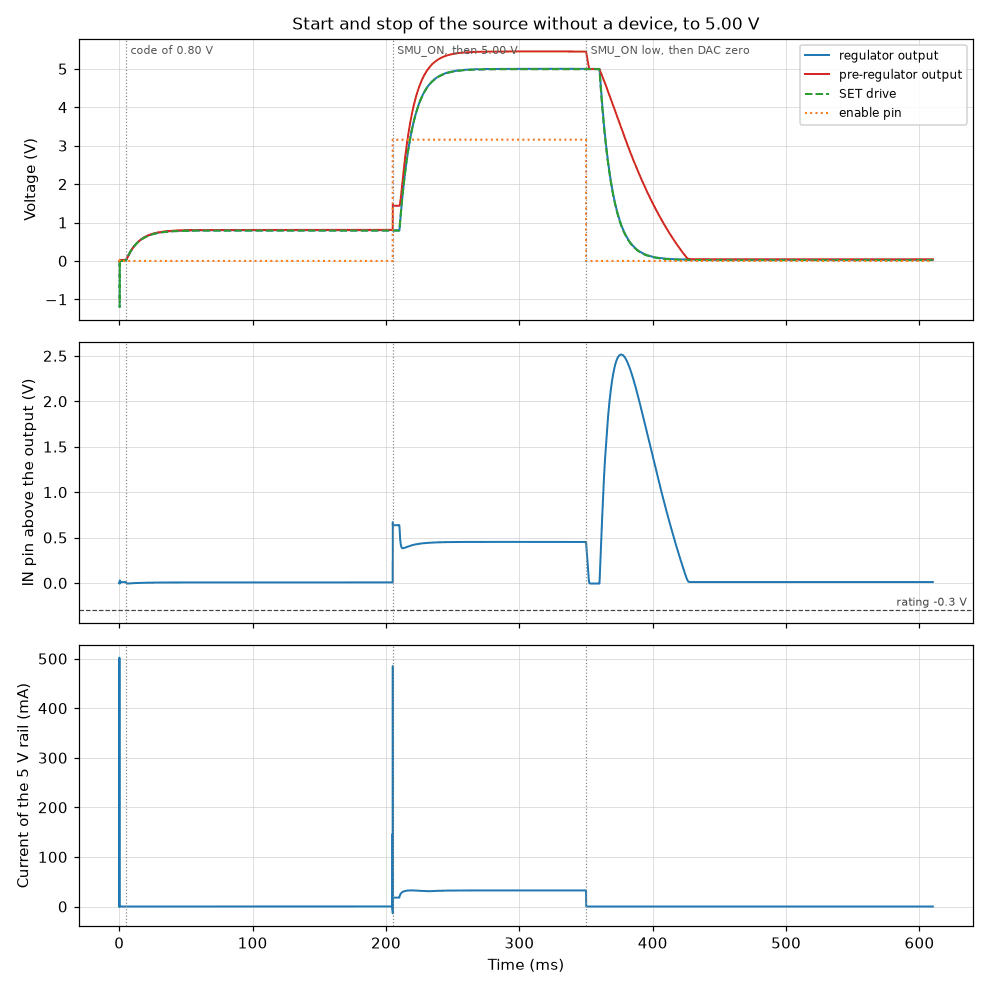

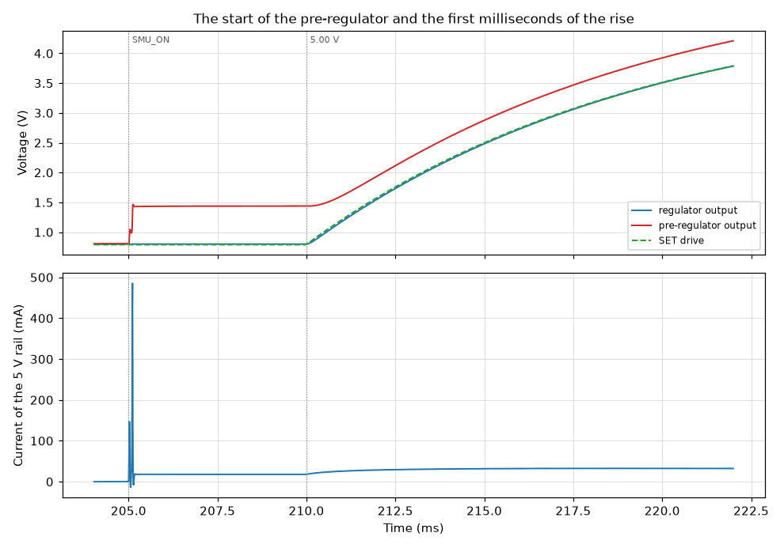

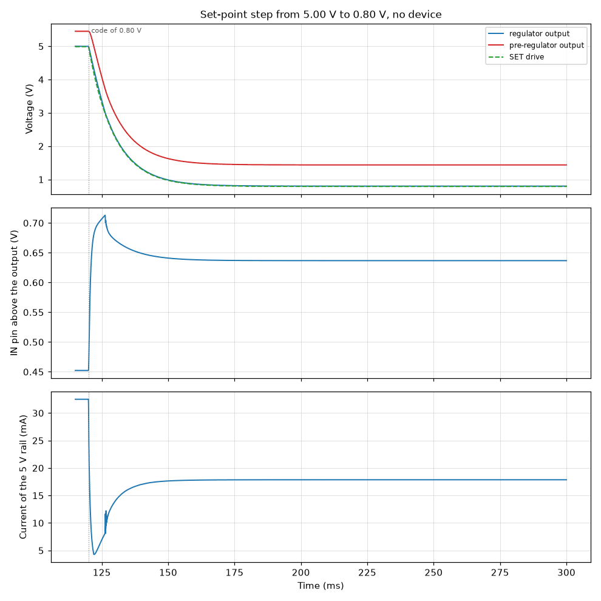

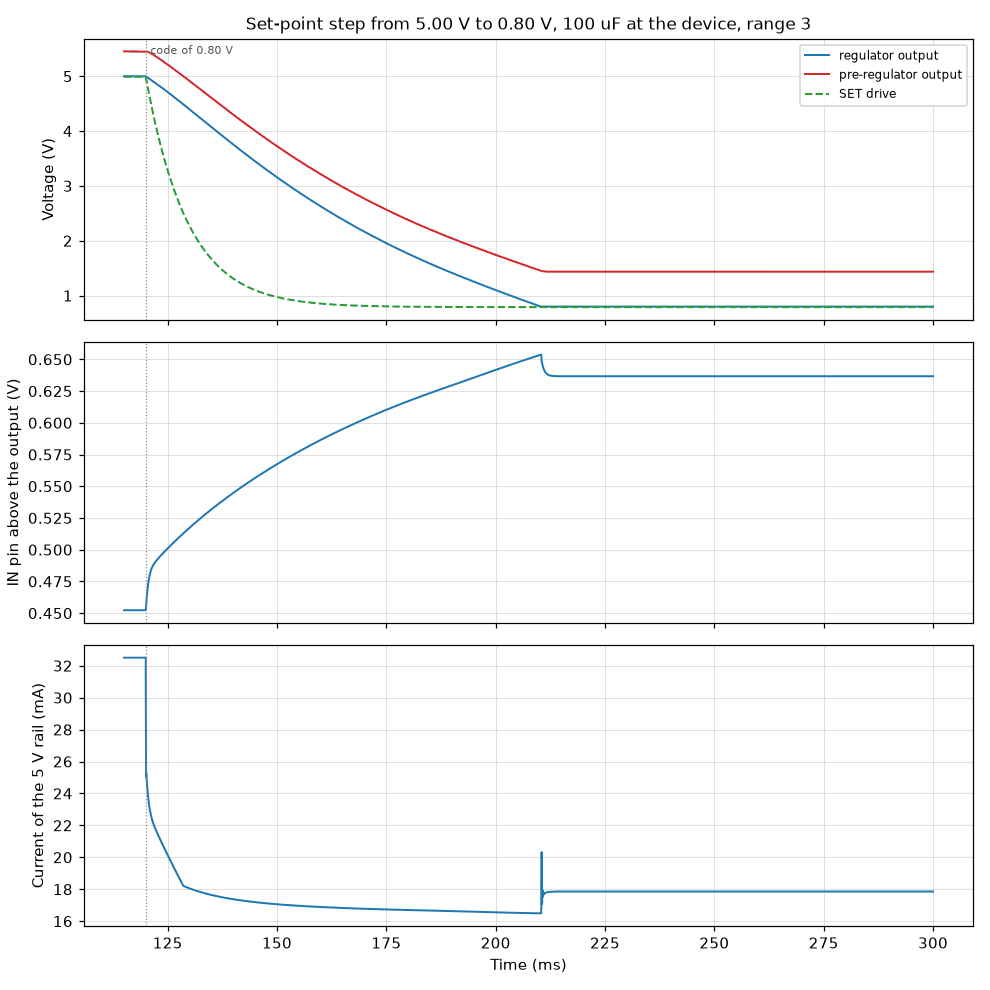

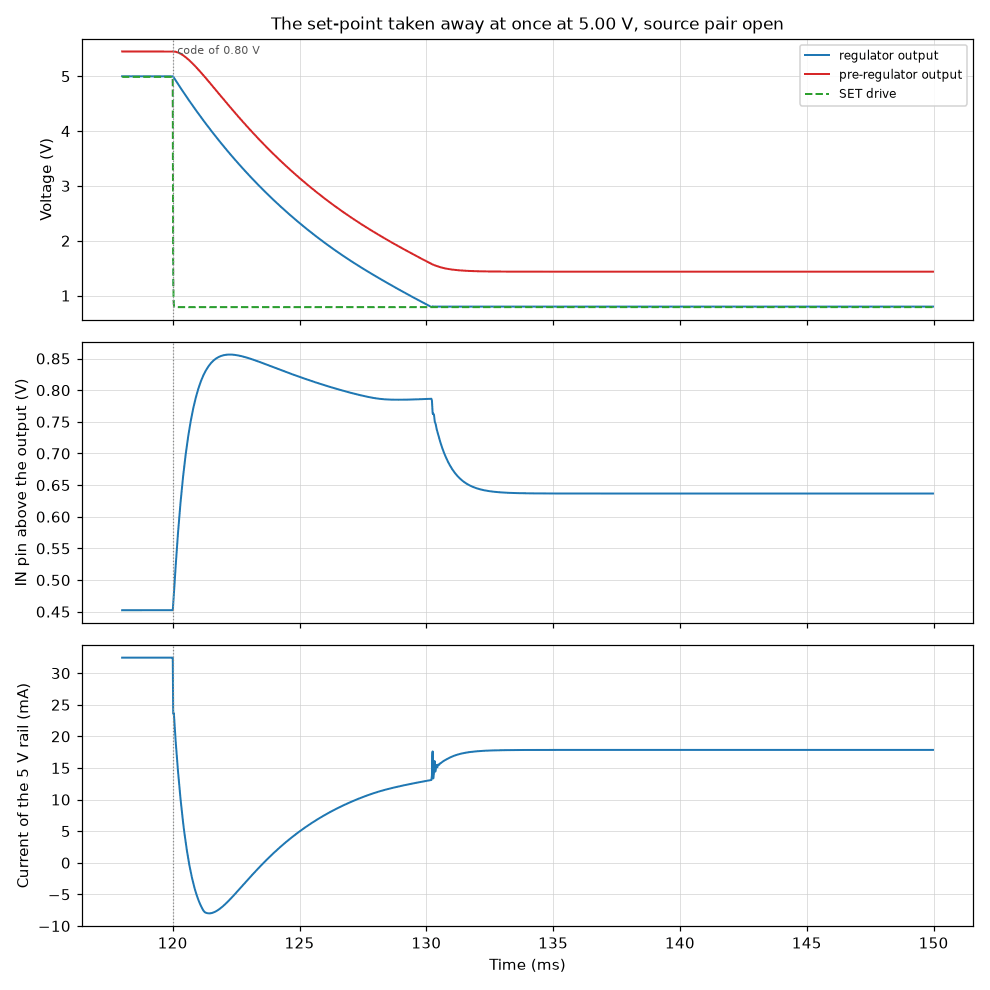

Notes:

- The paths to the device stay open in the start and stop run: steps 6 to 8 of
  rule F-28, the source pair, the check of the monitor and the output pair,
  belong to other blocks. Nothing hangs on the regulator output there but the
  parts of the sheet. In the two set-point steps the source pair is closed: the
  capacitors of the supply node hang on the output through the resistor that
  stands for it.
- The rails and the reference are ideal sources, so no rail moves when the
  converter starts or returns current: the current of the 5 V rail is what the
  source asks of it, not what the rail does with it.
- The power returned to the 5 V rail is the current of that rail, so it is what
  is left after the losses of the converter model: about 0.09 W, fitted to one
  efficiency curve at 3.6 V and taken to hold at 5 V. At 5.00 V without a device
  the source takes 0.16 W, of which 0.07 W go to the bleeder and to the minimum
  load. A converter without losses would return more; the fall of the power
  below its value before the step is an upper bound for that, to be held against
  the 0.06 W and the 0.12 W to 0.20 W of section 4.2.
- The run with the set-point taken away at once is not a state of the schematic:
  C41 is reduced to a thousandth, 10 us in place of 10 ms. The output then falls
  with its minimum load and with 3 mA more, which the clamp between OUT and SET
  of the regulator carries into R60: 0.70 V/ms over the first 0.2 ms, in which
  the output is already at 4.8 V. The figure stands 0.06 % below the 0.7 V/ms to
  0.8 V/ms of the specification and fails on that digit; the calculation of the
  specification is confirmed.
- With the filter in place the set-point of a full-scale step down falls with
  0.42 V/ms at first. The minimum load alone takes the output down with 0.36
  V/ms while the source pair is closed, so the output lags its set-point by up
  to 84 mV for the first 8 ms, and by 0.7 V for tens of milliseconds with 100 uF
  at the device: the regulator cannot take current, and the clamp between OUT
  and SET conducts.
- Given at once, a set-point of 5.00 V is followed with 1.2 V/ms: the regulator
  rises in dropout as fast as the pre-regulator follows its own output through
  the diode of D13. That is 2.4 times the slope that the filter lets through, so
  the output follows the filtered set-point, 42 mV behind at the most.
- How the IN pin is fed while the pre-regulator is off depends on the reverse
  gain of the pass transistor of the regulator model, which is an assumption:
  with it the pin is charged from the control supply through the transistor, and
  D11 carries little.
- The converter is the averaged model. What the real part does when it is
  enabled on a charged output is not in its datasheet; the model starts its duty
  cycle from zero behind a time constant of 0.21 ms, and it may take up to 0.7 A
  back from its output in forced PWM (TI SLVA726).
- The DAC is a behavioral model whose code changes in a step; the frames of the
  serial interface and the ramp of firmware (1 V/ms by default) are not
  simulated.

Models. written here: BAV199, BLM31SN500, LT3080, MCP4921, OPA197, OPA365,
SOURCE_METER_1N5819HW, SOURCE_METER_BSS138, TPS63020_AVG, XFL4020_152.

Decks: [sequence.start-stop.cir](sequence.start-stop.cir),
[sequence.step-down-open.cir](sequence.step-down-open.cir).

## `source_meter/setpoint`

**The set-point: DAC code to output voltage, step, ceiling and tolerances.**

The whole source is powered up at one DAC code after the other and read at rest.
The nominal run gives the output over the code, its step, the offset that the
SET current adds and the ceiling at the highest code. A wrong gain bit is one
more run. Random sets of resistor values, reference voltage and SET current give
the spread of the uncalibrated output at 0.80 V and at 5.00 V, and one run with
every part at the limit that raises the output gives the ceiling at the
tolerance limits. Four runs with the full-scale current of each range give the
voltage at the terminal behind the burden.

Answers: section 4.2 (voltage control, ceiling), rule F-30, requirement R-08,
decision D-58.

| Figure | Simulated | Vendor models | Specification | Limits | Verdict | Source |
| --- | --- | --- | --- | --- | --- | --- |
| Output at code 616 | 799.5 mV | 799.5 mV | 799.6 mV (-0.01 %) | 798 mV to 801.1 mV | pass | rule F-30: 10 mV + code x 1.2817 mV, nominal code of 0.80 V |
| Output at code 3893 | 5 V | 5 V | 5 V (+0.00 %) | 4.997 V to 5.002 V | pass | rule F-30: nominal code of 5.00 V |
| Step from code 616 to code 617 | 1.282 mV | 1.282 mV | 1.282 mV (+0.00 %) | 1.269 mV to 1.295 mV | pass | rule F-30: 1.2817 mV; requirement R-08: steps of 1.3 mV |
| Step from code 3893 to code 3894 | 1.282 mV | 1.282 mV | 1.282 mV (+0.00 %) | 1.269 mV to 1.295 mV | pass | rule F-30: 1.2817 mV |
| Gain of the buffer U17, between the two codes | 2.1 | 2.1 | 2.1 (+0.00 %) | 2.098 to 2.102 | pass | section 4.2: gain 2.1 with R57 and R58 |
| Output above the SET drive at code 616: the SET current in R60 | 9.952 mV | 9.952 mV | 10 mV (-0.48 %) | 8 mV to 12 mV | pass | section 4.2: about 10 mV |
| Reference input of the DAC (TP19) | 1.25 V | 1.25 V | 1.25 V (+0.00 %) | 1.249 V to 1.251 V | pass | section 4.2 and section 16: half the reference at TP19 |
| Output at the highest code, nominal parts | 5.259 V | 5.259 V | 5.26 V (-0.03 %) | 5.249 V to 5.271 V | pass | section 4.2 and rule F-30: 5.26 V nominal |
| Output at the highest code, every part at the limit that raises it | 5.381 V | 5.381 V | 5.39 V (-0.17 %) | at most 5.5 V | pass | section 4.2: 5.39 V at the tolerance limits, below the 5.5 V of the level translator |
| Output at code 3893 with the gain bit wrong | 2.505 V | 2.505 V | 2.505 V (+0.00 %) | 2.5 V to 2.51 V | pass | section 4.2: a wrong gain bit halves the output |
| Fall of the output at code 3893 with the reference input unbuffered | 30.06 mV | 30.06 mV | 30 mV (+0.20 %) | 25 mV to 35 mV | pass | rule F-6: the unbuffered input would load the divider by 0.6 %, 30 mV at 5.0 V |
| Rise of the output at 5.00 V with R55 and R56 apart by 25 ppm/K over 40 K each | 4.99 mV | 4.99 mV | 5 mV (-0.20 %) | 4 mV to 6 mV | pass | section 4.2: up to 5 mV per pair at 5 V over 40 K |
| Rise of the output at 5.00 V with R57 and R58 apart by 25 ppm/K over 40 K each | 5.233 mV | 5.233 mV | 5 mV (+4.65 %) | 4 mV to 6 mV | pass | section 4.2: up to 5 mV per pair at 5 V over 40 K |
| Output at code 0 | 30.96 mV | 30.96 mV | 10 mV (+209.62 %) | | | section 4.2: 0.01 V; the swing of the DAC ends 10 mV above ground |
| Lowest output of 24 random sets at the code of 0.80 V | 798.8 mV | 798.8 mV | 799.6 mV (-0.09 %) | | | |
| Highest output of 24 random sets at the code of 0.80 V | 800.7 mV | 800.7 mV | 799.6 mV (+0.15 %) | | | |
| Lowest output of 24 random sets at the code of 5.00 V | 4.994 V | 4.994 V | 5 V (-0.12 %) | | | |
| Highest output of 24 random sets at the code of 5.00 V | 5.003 V | 5.003 V | 5 V (+0.06 %) | | | |
| Range 0: regulator output above the terminal at full scale | 100 mV | 100 mV | | | | |
| Range 0: fall of the regulator output at full scale | 713.7 nV | 713.7 nV | | | | |
| Range 1: regulator output above the terminal at full scale | 96.03 mV | 96.03 mV | | | | |
| Range 1: fall of the regulator output at full scale | 18.03 µV | 18.03 µV | | | | |
| Range 2: regulator output above the terminal at full scale | 106.2 mV | 106.2 mV | | | | |
| Range 2: fall of the regulator output at full scale | 160.7 µV | 160.7 µV | | | | |
| Range 3: regulator output above the terminal at full scale | 145.3 mV | 145.3 mV | 144 mV (+0.90 %) | at most 200 mV | pass | requirement R-06: 200 mV at 1 A; section 2: 144 mV typical |
| Range 3: fall of the regulator output at full scale | 474.6 µV | 474.6 µV | | | | |
| Largest movement of output and pre-regulator in the last 2 ms of any run | 18.09 nV | 18.09 nV | | at most 100 µV | pass | limit of this bench: a run counts as at rest below 0.1 mV |

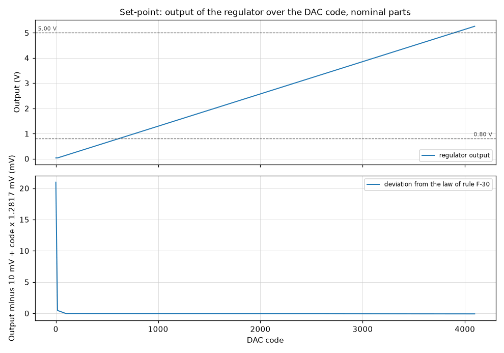

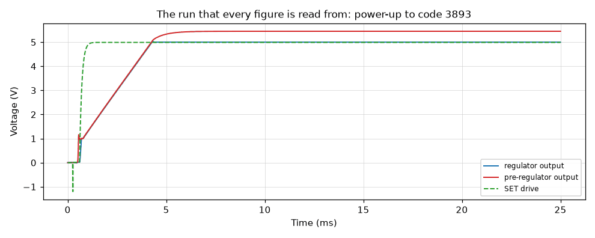

Notes:

- Every figure is the end of a run that starts with all rails at zero and ends
  at rest; the capacitor of the set-point filter, C41, has one hundredth of its
  value in these runs, which changes no voltage at rest.
- The rails and the reference are ideal sources. The DAC is the behavioral model
  without the serial interface: its code is a parameter, and the frame of rule
  F-6 is not simulated.
- The random sets draw the six resistors of the path inside their tolerance, the
  reference inside 0.05 % (assumption) and the SET current inside 2 %. The error
  of the DAC is left out of them: the calibration of rule F-30 removes it. The
  ceiling at the limits adds 1 % of gain and 1 % of offset of the DAC and 3.5 mV
  of regulator offset.
- At the highest code the pre-regulator is asked for 5.70 V, above the 5.5 V at
  which its datasheet ends; the model follows up to its assumed over-voltage
  level of 6.2 V. Rule F-30 keeps the set-point at or below 5.00 V.
- The path to the terminal is three resistors that stand for the closed
  switches, the shunt, copper and contacts; the ladder and the switches belong
  to other blocks.

Models. written here: BAV199, BLM31SN500, LT3080, MCP4921, OPA197, OPA365,
SOURCE_METER_1N5819HW, SOURCE_METER_BSS138, TPS63020_AVG, XFL4020_152.

Decks: [setpoint.code-3893.cir](setpoint.code-3893.cir),
[setpoint.code-616.cir](setpoint.code-616.cir).

## `source_meter/short`

**Short circuit at the output: current limit, pre-regulator, dissipation of
U18.**

The source stands at rest without load and its output is shorted for 30 ms. The
short circuit of 10 mohm closes at the regulator output, ahead of every switch,
or at the terminal behind the path of range 3. Nothing opens a switch in these
runs: the over-current trip belongs to another block, and the question here is
what the regulator and the pre-regulator do while the short lasts and after it
opens. The runs give the limited current, the voltage that the pre-regulator
falls to, the dissipation of the regulator at the start and at rest, and what
the 5 V rail sees.

Answers: section 4.2 (short circuit, sense path of the tracking), rule F-15,
decision D-55.

| Figure | Simulated | Vendor models | Specification | Limits | Verdict | Source |
| --- | --- | --- | --- | --- | --- | --- |
| 5.0 V, short at the regulator output: current of the IN pin in the short circuit | 1.32 A | 1.32 A | 1.4 A (-5.73 %) | 1.1 A to 1.6 A | pass | LT3080 Rev. E, page 4: 1.4 A typical, 1.1 A at the least; the upper limit is the one of this bench |
| 5.0 V, short at the regulator output: pre-regulator output in the short circuit | 848.9 mV | 848.9 mV | 840 mV (+1.06 %) | 700 mV to 1 V | pass | section 4.2: the pre-regulator follows down to about 0.8 V, 0.84 V simulated; the band is the one of this bench |
| 5.0 V, short at the regulator output: dissipation of the regulator in the lasting short circuit | 1.352 W | 1.352 W | 1.75 W (-22.72 %) | at most 2 W | pass | section 4.2 and rule F-15: 1.5 W to 2.0 W, calculated |
| 5.0 V, short at the regulator output: highest dissipation of the regulator | 7.525 W | 7.525 W | | | | |
| 5.0 V, short at the regulator output: energy in the regulator in the first 5 ms | 10.19 mJ | 10.19 mJ | | | | |
| 5.0 V, short at the regulator output: pre-regulator output below 1.2 V after | 1.388 ms | 1.388 ms | | | | |
| 5.0 V, short at the regulator output: most power returned to the 5 V rail | 94.55 mW | 94.55 mW | | at most 250 mW | pass | section 4.2 and section 16: less than the instrument takes from the rail, for which 0.25 W is the condition |
| 5.0 V, short at the regulator output: lowest voltage of the IN pin relative to the output | -33.58 mV | -33.58 mV | | at least -300 mV | pass | LT3080 Rev. E, page 2 (D-57) |
| 5.0 V, short at the regulator output: output above its value before the short, after the release | 49.76 mV | 49.76 mV | | | | |
| 5.0 V, short at the regulator output: output back within 0.1 V after the release in | 3.507 ms | 3.507 ms | | | | |
| 5.0 V, short at the terminal in range 3: current of the IN pin in the short circuit | 1.317 A | 1.317 A | 1.4 A (-5.90 %) | 1.1 A to 1.6 A | pass | LT3080 Rev. E, page 4: 1.4 A typical, 1.1 A at the least; the upper limit is the one of this bench |
| 5.0 V, short at the terminal in range 3: pre-regulator output in the short circuit | 866.2 mV | 866.2 mV | 840 mV (+3.12 %) | 700 mV to 1 V | pass | section 4.2: the pre-regulator follows down to about 0.8 V, 0.84 V simulated; the band is the one of this bench |
| 5.0 V, short at the terminal in range 3: dissipation of the regulator in the lasting short circuit | 1.113 W | 1.113 W | 1.75 W (-36.40 %) | at most 2 W | pass | section 4.2 and rule F-15: 1.5 W to 2.0 W, calculated |
| 5.0 V, short at the terminal in range 3: highest dissipation of the regulator | 7.255 W | 7.255 W | | | | |
| 5.0 V, short at the terminal in range 3: energy in the regulator in the first 5 ms | 9.443 mJ | 9.443 mJ | | | | |
| 5.0 V, short at the terminal in range 3: pre-regulator output below 1.2 V after | 1.646 ms | 1.646 ms | | | | |
| 5.0 V, short at the terminal in range 3: most power returned to the 5 V rail | 91.15 mW | 91.15 mW | | at most 250 mW | pass | section 4.2 and section 16: less than the instrument takes from the rail, for which 0.25 W is the condition |
| 5.0 V, short at the terminal in range 3: lowest voltage of the IN pin relative to the output | -33.03 mV | -33.03 mV | | at least -300 mV | pass | LT3080 Rev. E, page 2 (D-57) |
| 5.0 V, short at the terminal in range 3: output above its value before the short, after the release | 47.29 mV | 47.29 mV | | | | |
| 5.0 V, short at the terminal in range 3: output back within 0.1 V after the release in | 3.496 ms | 3.496 ms | | | | |
| 0.8 V, short at the regulator output: current of the IN pin in the short circuit | 1.32 A | 1.32 A | 1.4 A (-5.73 %) | 1.1 A to 1.6 A | pass | LT3080 Rev. E, page 4: 1.4 A typical, 1.1 A at the least; the upper limit is the one of this bench |
| 0.8 V, short at the regulator output: pre-regulator output in the short circuit | 848.9 mV | 848.9 mV | 840 mV (+1.06 %) | 700 mV to 1 V | pass | section 4.2: the pre-regulator follows down to about 0.8 V, 0.84 V simulated; the band is the one of this bench |
| 0.8 V, short at the regulator output: dissipation of the regulator in the lasting short circuit | 1.353 W | 1.353 W | 1.75 W (-22.71 %) | at most 2 W | pass | section 4.2 and rule F-15: 1.5 W to 2.0 W, calculated |
| 0.8 V, short at the regulator output: highest dissipation of the regulator | 2.072 W | 2.072 W | | | | |
| 0.8 V, short at the regulator output: energy in the regulator in the first 5 ms | 7.035 mJ | 7.035 mJ | | | | |
| 0.8 V, short at the regulator output: pre-regulator output below 1.2 V after | 230.8 µs | 230.8 µs | | | | |
| 0.8 V, short at the regulator output: most power returned to the 5 V rail | 87.75 mW | 87.75 mW | | at most 250 mW | pass | section 4.2 and section 16: less than the instrument takes from the rail, for which 0.25 W is the condition |
| 0.8 V, short at the regulator output: lowest voltage of the IN pin relative to the output | 203.8 mV | 203.8 mV | | at least -300 mV | pass | LT3080 Rev. E, page 2 (D-57) |
| 0.8 V, short at the regulator output: output above its value before the short, after the release | 1.399 mV | 1.399 mV | | | | |
| 0.8 V, short at the regulator output: output back within 0.1 V after the release in | 21.1 µs | 21.1 µs | | | | |
| 5.0 V, short at the regulator output, least current limit: current of the IN pin in the short circuit | 1.05 A | 1.05 A | 1.1 A (-4.59 %) | 1 A to 1.2 A | pass | LT3080 Rev. E, page 4: 1.4 A typical, 1.1 A at the least; the upper limit is the one of this bench |
| 5.0 V, short at the regulator output, least current limit: pre-regulator output in the short circuit | 879.8 mV | 879.8 mV | 840 mV (+4.74 %) | 700 mV to 1 V | pass | section 4.2: the pre-regulator follows down to about 0.8 V, 0.84 V simulated; the band is the one of this bench |
| 5.0 V, short at the regulator output, least current limit: dissipation of the regulator in the lasting short circuit | 1.129 W | 1.129 W | 1.75 W (-35.47 %) | at most 2 W | pass | section 4.2 and rule F-15: 1.5 W to 2.0 W, calculated |
| 5.0 V, short at the regulator output, least current limit: highest dissipation of the regulator | 6.046 W | 6.046 W | | | | |
| 5.0 V, short at the regulator output, least current limit: energy in the regulator in the first 5 ms | 8.31 mJ | 8.31 mJ | | | | |
| 5.0 V, short at the regulator output, least current limit: pre-regulator output below 1.2 V after | 1.388 ms | 1.388 ms | | | | |
| 5.0 V, short at the regulator output, least current limit: most power returned to the 5 V rail | 53.29 mW | 53.29 mW | | at most 250 mW | pass | section 4.2 and section 16: less than the instrument takes from the rail, for which 0.25 W is the condition |
| 5.0 V, short at the regulator output, least current limit: lowest voltage of the IN pin relative to the output | -23.59 mV | -23.59 mV | | at least -300 mV | pass | LT3080 Rev. E, page 2 (D-57) |
| 5.0 V, short at the regulator output, least current limit: output above its value before the short, after the release | 42.5 mV | 42.5 mV | | | | |
| 5.0 V, short at the regulator output, least current limit: output back within 0.1 V after the release in | 3.657 ms | 3.657 ms | | | | |

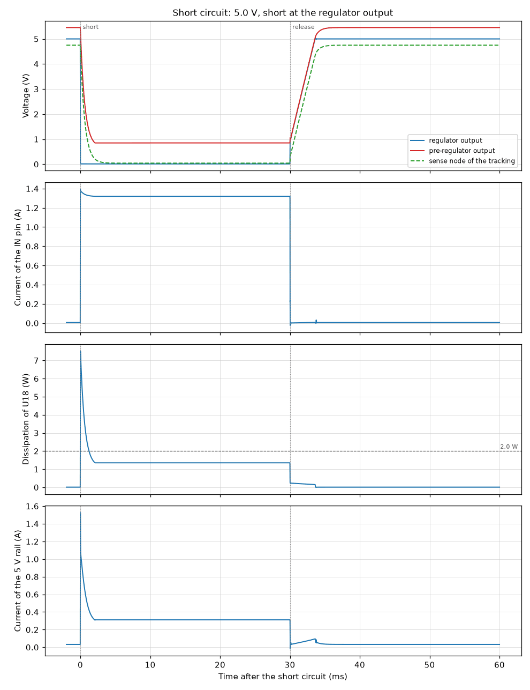

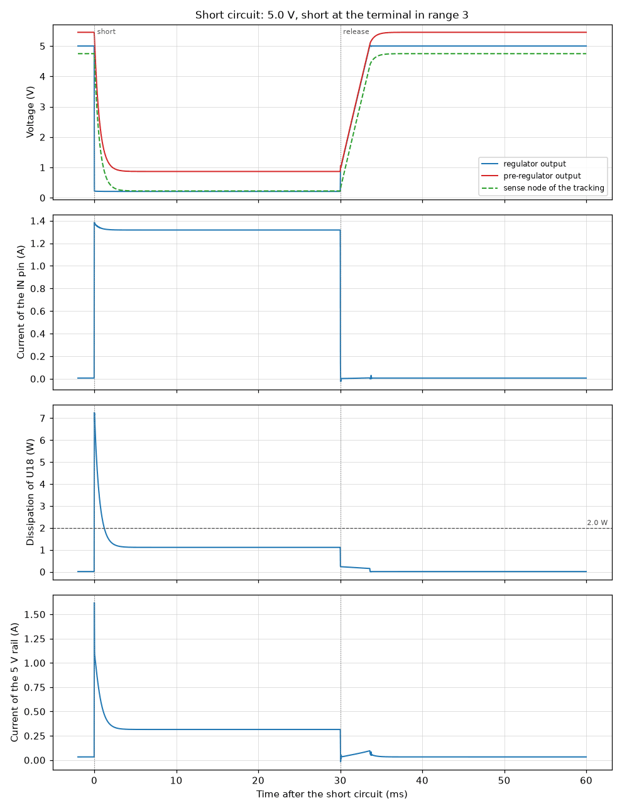

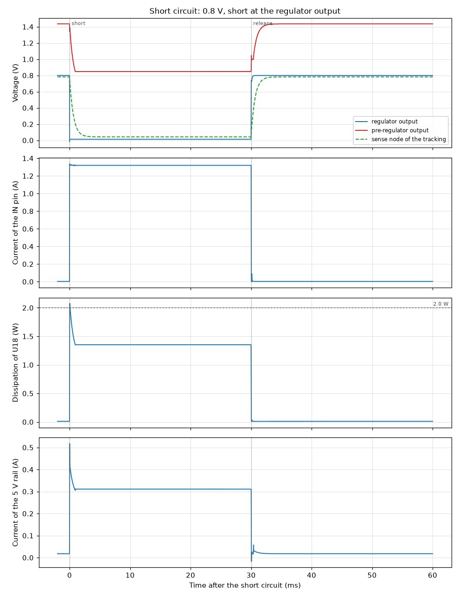

Notes:

- The regulator model has the typical current limit of 1.4 A, flat up to the 6 V
  that this circuit can put across it, and no thermal limit: a real part in a
  lasting short circuit heats until its own limit acts, which the datasheet
  allows for an indefinite time. The datasheet gives no highest value of the
  current limit.
- What the converter does when it is asked for less than a duty cycle of 20 % is
  not in its datasheet. The model holds 20 % while its current is below its
  limit, which puts about 1 V behind its switch resistance: the voltage that the
  pre-regulator rests at in the short circuit, and with it the dissipation of
  the regulator, follow from that assumption.
- The dissipation at the start is the full head room times the limited current
  until the regulator has emptied the capacitors of the pre-regulator through
  the short circuit; the energy of the first 5 ms states it.
- The rails are ideal sources. The over-current trip, the range logic and the
  output switch are not in these runs.

Models. written here: BAV199, BLM31SN500, LT3080, MCP4921, OPA197, OPA365,
SOURCE_METER_1N5819HW, SOURCE_METER_BSS138, TPS63020_AVG, XFL4020_152.

Decks: [short.output-5v.cir](short.output-5v.cir).

## `source_meter/tracking`

**The tracking pre-regulator at rest: law, head room on the curve,
dissipation.**

The source is powered up at a series of output voltages and loads and read at
rest. Without load the output of the pre-regulator over the output of the linear
regulator gives the tracking law, and the difference amplifier alone gives the
three weights of its feedback voltage. At the four points of the curve of
requirement R-08 the runs give the head room at the IN pin, the dissipation of
the regulator and the power taken from the 5 V rail, with a typical regulator
and with one at the guaranteed dropout. A corner run puts the six resistors of
the amplifier, the feedback reference of the converter and the reference voltage
at the limits that lower the pre-regulator. One more run loads the output with 5
ohm at 5.0 V, beyond the curve.

Answers: section 4.2 (pre-regulator, table of the curve), requirement R-08,
decisions D-55, D-56.

| Figure | Simulated | Vendor models | Specification | Limits | Verdict | Source |
| --- | --- | --- | --- | --- | --- | --- |
| Tracking law: offset | 671.8 mV | 671.8 mV | 672 mV (-0.03 %) | 665.3 mV to 678.7 mV | pass | section 4.2 |
| Tracking law: slope | 0.9561 | 0.9561 | 0.956 (+0.01 %) | 0.9512 to 0.9608 | pass | section 4.2 |
| Feedback voltage: weight of the pre-regulator output | 0.2003 | 0.2003 | 0.2 (+0.14 %) | 0.198 to 0.202 | pass | section 4.2: 0.200 x V_PRE + 0.146 x VREF - 0.191 x V_LDO |
| Feedback voltage: weight of the regulator output | -0.1915 | -0.1915 | -0.191 (-0.25 %) | -0.1929 to -0.1891 | pass | section 4.2 |
| Feedback voltage: weight of the reference | 0.1462 | 0.1462 | 0.146 (+0.13 %) | 0.1445 to 0.1475 | pass | section 4.2 |
| Feedback pin at rest, 5.0 V without load | 500 mV | 500 mV | 500 mV (+0.00 %) | 499 mV to 501 mV | pass | section 4.2: the converter holds 0.5 V |
| Pre-regulator output at 5.05 V of regulator output | 5.5 V | 5.5 V | 5.5 V (+0.00 %) | 5.48 V to 5.52 V | pass | section 4.2: the law reaches 5.5 V at 5.05 V |
| 0.8 V without load: pre-regulator output | 1.436 V | 1.436 V | 1.437 V (-0.06 %) | 1.433 V to 1.441 V | pass | section 4.2, table of the curve: V_PRE, nominal |
| 0.8 V and 1 A: pre-regulator output | 1.432 V | 1.432 V | | | | |
| 0.8 V and 1 A: IN pin above the output, nominal parts | 631.9 mV | 631.9 mV | 637 mV (-0.81 %) | at least 470 mV | pass | section 4.2, table of the curve: head room, nominal; the limit is the dropout need of the same table |
| 0.8 V and 1 A: head room above the dropout need, parts at their limits | 132.8 mV | 132.8 mV | 85 mV (+56.19 %) | at least 0 V | pass | section 4.2, table of the curve: margin, worst case |
| 0.8 V and 1 A: fall of the output, regulator at the guaranteed dropout, parts at their limits | 901.2 µV | 901.2 µV | | at most 10 mV | pass | requirement R-08: no overload on the curve; 10 mV is the limit of this bench |
| 0.8 V at 1 A, typical regulator: fall of the output | 506 µV | 506 µV | | at most 10 mV | pass | section 4.2: a typical regulator delivers 1 A at every set-point |
| 2 V without load: pre-regulator output | 2.584 V | 2.584 V | 2.584 V (+0.02 %) | 2.576 V to 2.592 V | pass | section 4.2, table of the curve: V_PRE, nominal |
| 2 V and 1 A: pre-regulator output | 2.581 V | 2.581 V | | | | |
| 2 V and 1 A: IN pin above the output, nominal parts | 579.1 mV | 579.1 mV | 584 mV (-0.83 %) | at least 470 mV | pass | section 4.2, table of the curve: head room, nominal; the limit is the dropout need of the same table |
| 2 V and 1 A: head room above the dropout need, parts at their limits | 76.51 mV | 76.51 mV | 25 mV (+206.03 %) | at least 0 V | pass | section 4.2, table of the curve: margin, worst case |
| 2 V and 1 A: fall of the output, regulator at the guaranteed dropout, parts at their limits | 1.492 mV | 1.492 mV | | at most 10 mV | pass | requirement R-08: no overload on the curve; 10 mV is the limit of this bench |
| 2 V at 1 A, typical regulator: fall of the output | 494.5 µV | 494.5 µV | | at most 10 mV | pass | section 4.2: a typical regulator delivers 1 A at every set-point |
| 3.3 V without load: pre-regulator output | 3.827 V | 3.827 V | 3.827 V (+0.00 %) | 3.816 V to 3.838 V | pass | section 4.2, table of the curve: V_PRE, nominal |
| 3.3 V and 0.83 A: pre-regulator output | 3.824 V | 3.824 V | | | | |
| 3.3 V and 0.83 A: IN pin above the output, nominal parts | 522.9 mV | 522.9 mV | 527 mV (-0.78 %) | at least 419 mV | pass | section 4.2, table of the curve: head room, nominal; the limit is the dropout need of the same table |
| 3.3 V and 0.83 A: head room above the dropout need, parts at their limits | 67.46 mV | 67.46 mV | 15 mV (+349.71 %) | at least 0 V | pass | section 4.2, table of the curve: margin, worst case |
| 3.3 V and 0.83 A: fall of the output, regulator at the guaranteed dropout, parts at their limits | 2.09 mV | 2.09 mV | | at most 10 mV | pass | requirement R-08: no overload on the curve; 10 mV is the limit of this bench |
| 3.3 V at 1 A, typical regulator: fall of the output | 484.7 µV | 484.7 µV | | at most 10 mV | pass | section 4.2: a typical regulator delivers 1 A at every set-point |
| 5 V without load: pre-regulator output | 5.452 V | 5.452 V | 5.452 V (+0.00 %) | 5.436 V to 5.468 V | pass | section 4.2, table of the curve: V_PRE, nominal |
| 5 V and 0.6 A: pre-regulator output | 5.45 V | 5.45 V | | | | |
| 5 V and 0.6 A: IN pin above the output, nominal parts | 449.2 mV | 449.2 mV | 452 mV (-0.62 %) | at least 350 mV | pass | section 4.2, table of the curve: head room, nominal; the limit is the dropout need of the same table |
| 5 V and 0.6 A: head room above the dropout need, parts at their limits | 57.81 mV | 57.81 mV | 2 mV (+2790.45 %) | at least 0 V | pass | section 4.2, table of the curve: margin, worst case |
| 5 V and 0.6 A: fall of the output, regulator at the guaranteed dropout, parts at their limits | 2.873 mV | 2.873 mV | | at most 10 mV | pass | requirement R-08: no overload on the curve; 10 mV is the limit of this bench |
| 5 V at 1 A, typical regulator: fall of the output | 474.6 µV | 474.6 µV | | at most 10 mV | pass | section 4.2: a typical regulator delivers 1 A at every set-point |
| Dissipation of the regulator at 0.8 V and 1.0 A, typical | 820.8 mW | 820.8 mW | 820 mW (+0.09 %) | 700 mW to 1.02 W | pass | section 4.2: 0.82 W typical, 1.02 W worst case |
| Dissipation of the regulator at 5.0 V and 0.6 A, typical | 359.2 mW | 359.2 mW | 340 mW (+5.63 %) | 280 mW to 450 mW | pass | section 4.2: 0.34 W typical, 0.45 W worst case |
| Dissipation of the regulator at 0.8 V and 1 A, typical | 820.8 mW | 820.8 mW | | | | |
| Dissipation of the regulator at 2 V and 1 A, typical | 748.9 mW | 748.9 mW | | | | |
| Dissipation of the regulator at 3.3 V and 1 A, typical | 671 mW | 671 mW | | | | |
| Dissipation of the regulator at 5 V and 1 A, typical | 568.8 mW | 568.8 mW | | | | |
| Power the pre-regulator takes from the 5 V rail at 5.0 V and 0.6 A | 3.502 W | 3.502 W | | | | |
| Power the pre-regulator takes from the 5 V rail at 5.0 V and 1 A | 5.802 W | 5.802 W | | | | |
| Power the pre-regulator takes from the 5 V rail at 0.8 V without load | 89.29 mW | 89.29 mW | | | | |
| Power the pre-regulator takes from the 5 V rail at 5.0 V without load | 162.5 mW | 162.5 mW | | | | |
| Output into 5 ohm at a set-point of 5.0 V, regulator at the guaranteed dropout | 4.729 V | 4.729 V | 4.48 V (+5.56 %) | at least 4.4 V | pass | section 4.2: 4.48 V simulated; requirement R-08: a sag of up to 0.6 V |
| Regulator output in that run | 4.867 V | 4.867 V | | | | |
| Current into the 5 ohm in that run | 945.8 mA | 945.8 mA | | | | |
| Output into 5 ohm at a set-point of 5.0 V, typical regulator | 4.858 V | 4.858 V | | at least 4.4 V | pass | requirement R-08: a sag of up to 0.6 V beyond the curve |
| Largest movement of output and pre-regulator in the last 2 ms of any run | 2.46 nV | 2.46 nV | | at most 100 µV | pass | limit of this bench: a run counts as at rest below 0.1 mV |

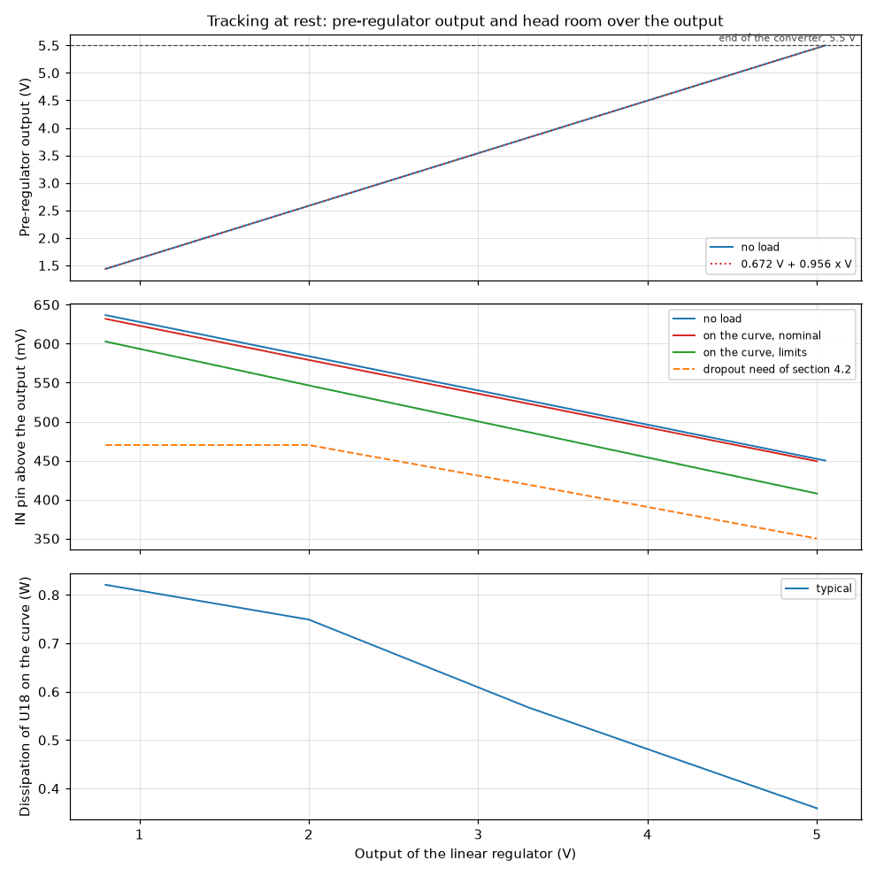

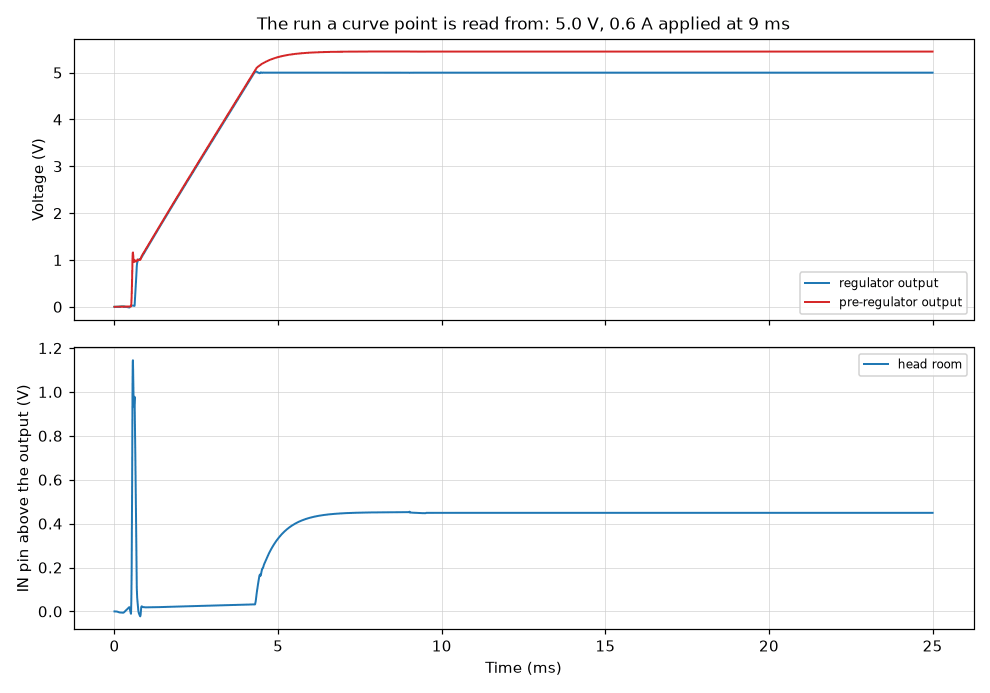

Notes:

- Every figure is the end of a run that starts with all rails at zero and ends
  at rest. C41 has one hundredth of its value in these runs, which changes no
  voltage at rest.
- The corner puts each of the six resistors of U19 at the limit of its 0.1 %
  that lowers the pre-regulator (found by one run per resistor), the feedback
  reference of the converter at 495 mV and the reference at its lower or upper
  limit of 0.05 % (assumption). It leaves out what the table of section 4.2 also
  counts: the drift of the resistors over 40 K and the copper between the
  converter and the bead, which the netlist does not hold.
- The dropout need is the straight line of section 4.2, 170 mV + 0.300 ohm x I,
  and the regulator at the guaranteed dropout is the model with the parameters
  that put it on that line. Both rest on two guaranteed points of the datasheet
  at 25 C and on an estimate between them.
- The converter is the averaged model: its load regulation of 4.4 mV per ampere
  at 3.3 V is fitted to the model of the manufacturer (4.5 mV), and its losses
  to four points of the datasheet at 3.6 V of input.
- The power figures are those of the pre-regulator alone. The control current of
  the regulator comes from the boost converter, which belongs to another block.

Models. written here: BAV199, BLM31SN500, LT3080, MCP4921, OPA197, OPA365,
SOURCE_METER_1N5819HW, SOURCE_METER_BSS138, TPS63020_AVG, XFL4020_152.

Decks: [tracking.amplifier.cir](tracking.amplifier.cir),
[tracking.curve-5v.cir](tracking.curve-5v.cir).
