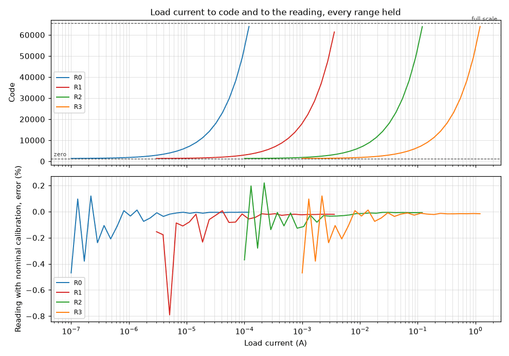
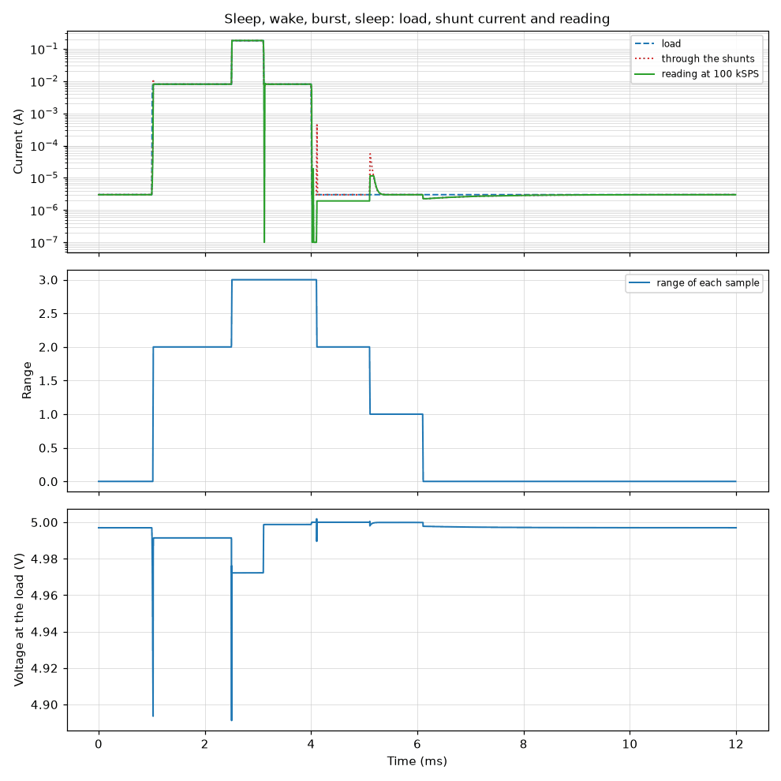
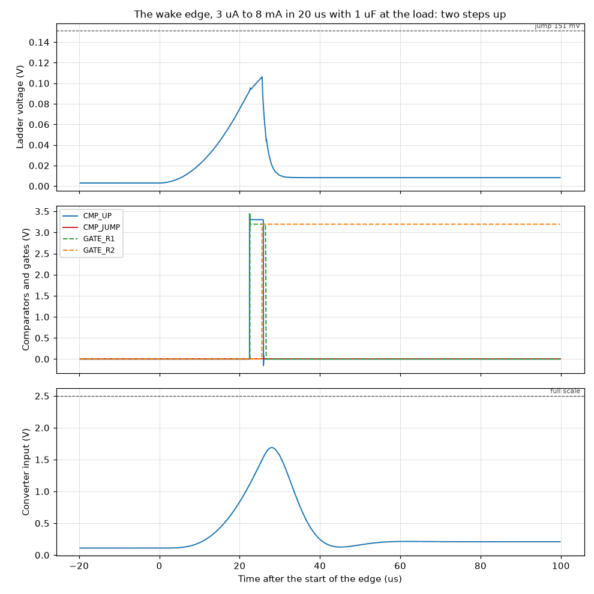

# Simulation Results: Whole Measuring Path

Everything on this page is a simulation result. Nothing here is measured on
hardware. The page is written by `circuit-sim report` from the result files
beside it; do not edit it by hand.

## `system/accuracy`

**From the load current to the code, every range held.**

Ladder, multiplexer and amplifier chain run as one circuit, from the netlist.
Each range is held and the load current is stepped from zero to 120 % of the
full scale as a staircase. At the end of each step the voltage at the converter
input becomes a 16-bit code. The host reading is that code with the nominal
calibration of the specification. The figures say what one code is worth in each
range, where zero and full scale lie, and how far the path is from a straight
line, which is what remains on a board after its calibration at two points.

Answers: sections 4.3, 4.5 and 8 (gain, pedestal, resolution, full scale),
requirement R-12.

| Figure | Simulated | Specification | Limits | Verdict | Source |
| --- | --- | --- | --- | --- | --- |
| Code at zero current (the pedestal) | 1313 codes | 1313 codes (+0.00 %) | 1308 codes to 1318 codes | pass | section 4.5: about 1313 codes, calculated |
| Converter input at zero current | 50.08 mV | 50.08 mV (+0.00 %) | 49.83 mV to 50.33 mV | pass | section 4.5: pedestal of 50 mV |
| R0: current of one code | 1.914 nA | 1.914 nA (+0.01 %) | 1.91 nA to 1.918 nA | pass | sections 4.3 and 8, calculated |
| R0: shunt voltage at which the converter reads full scale | 122.9 mV | 122.9 mV (+0.03 %) | 122.3 mV to 123.5 mV | pass | section 4.3: 122.9 mV, calculated |
| R0: reading with the nominal calibration at 100 µA | -0.004734 % | | -0.5 % to 0.5 % | pass | limit of this bench: nominal values agree within 0.5 % |
| R0: largest deviation from a straight line, zero to full scale | 0.02905 codes | | at most 1 codes | pass | limit of this bench: one code |
| R1: current of one code | 59.92 nA | 59.91 nA (+0.02 %) | 59.79 nA to 60.03 nA | pass | sections 4.3 and 8, calculated |
| R1: shunt voltage at which the converter reads full scale | 123 mV | 122.9 mV (+0.04 %) | 122.3 mV to 123.5 mV | pass | section 4.3: 122.9 mV, calculated |
| R1: reading with the nominal calibration at 3 mA | -0.02023 % | | -0.5 % to 0.5 % | pass | limit of this bench: nominal values agree within 0.5 % |
| R1: largest deviation from a straight line, zero to full scale | 0.0866 codes | | at most 1 codes | pass | limit of this bench: one code |
| R2: current of one code | 1.916 µA | 1.916 µA (+0.01 %) | 1.912 µA to 1.92 µA | pass | sections 4.3 and 8, calculated |
| R2: shunt voltage at which the converter reads full scale | 122.9 mV | 122.9 mV (+0.03 %) | 122.3 mV to 123.5 mV | pass | section 4.3: 122.9 mV, calculated |
| R2: reading with the nominal calibration at 100 mA | -0.008444 % | | -0.5 % to 0.5 % | pass | limit of this bench: nominal values agree within 0.5 % |
| R2: largest deviation from a straight line, zero to full scale | 0.02215 codes | | at most 1 codes | pass | limit of this bench: one code |
| R3: current of one code | 19.14 µA | 19.14 µA (+0.02 %) | 19.1 µA to 19.18 µA | pass | sections 4.3 and 8, calculated |
| R3: shunt voltage at which the converter reads full scale | 122.9 mV | 122.9 mV (+0.04 %) | 122.3 mV to 123.5 mV | pass | section 4.3: 122.9 mV, calculated |
| R3: reading with the nominal calibration at 1 A | -0.0151 % | | -0.5 % to 0.5 % | pass | limit of this bench: nominal values agree within 0.5 % |
| R3: largest deviation from a straight line, zero to full scale | 0.02216 codes | | at most 1 codes | pass | limit of this bench: one code |

Notes:

- The converter is ideal arithmetic on the voltage at its input: no noise, no
  nonlinearity of its own, no sampling kick.
- Offset, bias current and noise of the amplifiers are zero in these runs, so
  the error at small currents is the size of one code and the rounding to it; a
  real board adds its offsets, which the zero calibration removes (section 8).
- The levels are a staircase in time, because a fresh operating point of this
  circuit does not always converge in the simulator; each level is held for 150
  us (1.5 ms in range 0) and read over its last 20 us.
- Range 0 is slow by itself: its 1 kohm shunt and the 100 nF capacitor C71 on
  the node after the shunts make a time constant of 100 us, before any
  capacitance of the load is counted.
- The comparators are left out of this circuit; their divider loads the
  amplifier output as drawn.

Models. written here: AD8421, BAV199, CSD17577Q3A, IRLML0030, IRLML0030_CLAMP,
MUX509, OPA197, OPA365, TC4427CH.

Decks: [accuracy.r0.cir](accuracy.r0.cir), [accuracy.r1.cir](accuracy.r1.cir),
[accuracy.r2.cir](accuracy.r2.cir), [accuracy.r3.cir](accuracy.r3.cir).

## `system/profile`

**A load profile with automatic ranging: sleep, wake, burst, sleep.**

The whole measuring path follows a load that sleeps, wakes and transmits.
Ladder, multiplexer, amplifier chain and comparators are the circuit as drawn;
the sequencer is the model of the rules, and the requests to step down are
written in at the instants the firmware rule gives. The load draws 3 uA, wakes
to 8 mA, takes 180 mA for 0.6 ms and sleeps again, with 1 uF beside it. The
converter input is sampled at 100 kSPS and turned into a current with the
nominal calibration, with the samples after a range change flagged as the
specification says. The reading is compared with the load current and with the
current that really flowed through the shunts, which differ while the capacitor
at the load changes its voltage.

Answers: sections 4.3 to 4.5, rules F-16, F-17 and F-35, requirement R-07,
section 9 (flagged samples).

| Figure | Simulated | Specification | Limits | Verdict | Source |
| --- | --- | --- | --- | --- | --- |
| Charge read over the profile against the charge through the shunts | 0.3386 % | | -1 % to 1 % | pass | limit of this bench: the reading follows the shunt current within 1 % |
| Charge read over the profile against the charge the load drew | 0.3387 % | | -1 % to 1 % | pass | limit of this bench: 1 % |
| Largest deviation of a valid sample from the shunt current, of its range | 57.68 % | | | | |
| Median deviation of the valid samples from the shunt current | 0.03133 % | | at most 0.5 % | pass | limit of this bench: 0.5 % |
| Range in which the run starts, at 3 uA | 0 | 0 | 0 to 0 | pass | the run has to start at rest in range 0 |
| Range changes over the profile | 5 | | | | |
| Samples flagged invalid | 2.917 % | | | | |
| Highest ladder voltage at the wake edge | 106.3 mV | | at most 151 mV | pass | section 4.4: below the jump level of 151 mV, so the steps are single |
| Lowest voltage at the load during wake and burst (set to 5 V) | 4.891 V | | at least 4.5 V | pass | requirement R-07: a drop of 0.5 V at the most |
| Reading at the end, back in sleep at 3 uA | 2.995 µA | 3 µA (-0.18 %) | 2.9 µA to 3.1 µA | pass | the load current of the profile |

Notes:

- The sequencer is the model of rules F-16 to F-18 with a reaction time of 100
  ns. The requests to step down are written into the deck at the instants the
  firmware rule gives for this profile: 1 ms after the load fell below the level
  of range 3 and 1 ms after each step. The latency of the sample blocks, up to
  2.56 ms per step, is not in it.
- The source in front of the ladder is an ideal 5 V source with 50 mohm, an
  assumption; the output switch is not in this circuit.
- The reading follows the current through the shunts. That current is the load
  current plus what charges the capacitor at the load, so after a step down the
  reading approaches the load current with the time constant of shunt and
  capacitor: 1.1 ms in range 0 with 1 uF.
- At the wake edge the capacitor at the load supplies the current first, so the
  ladder voltage rises slowly enough for the step-up comparator: range 0 to
  range 1 at 91 mV, range 2 after the blanking time, and the jump level is not
  reached. At the burst, in range 2, the jump takes the path to range 3.
- The converter is ideal arithmetic; amplifier offsets and noise are zero.

Models. written here: AD8421, BAV199, CSD17577Q3A, IRLML0030, IRLML0030_CLAMP,
MCP656X, MUX509, OPA197, OPA365, TC4427CH.

Decks: [profile.sleep-wake.cir](profile.sleep-wake.cir).
